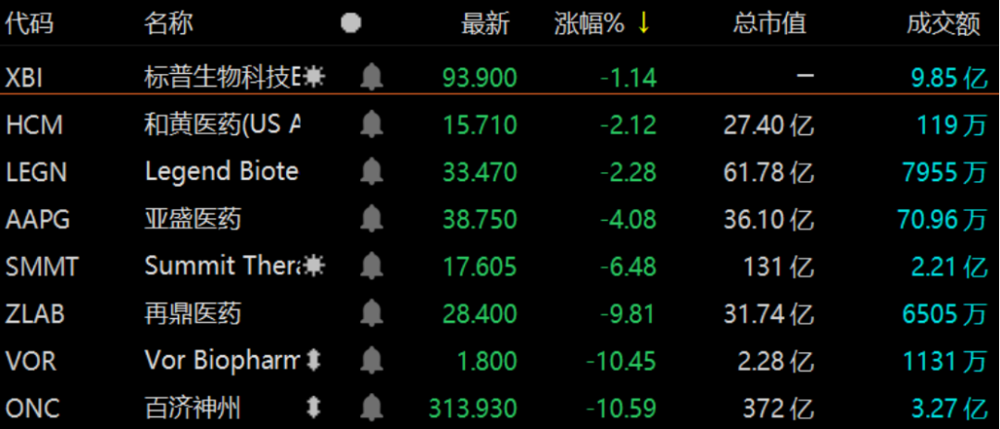
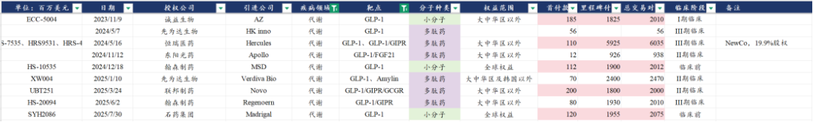
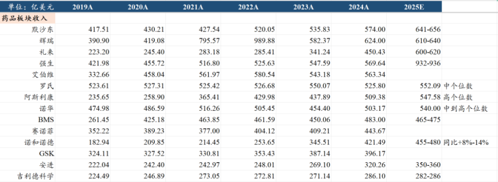
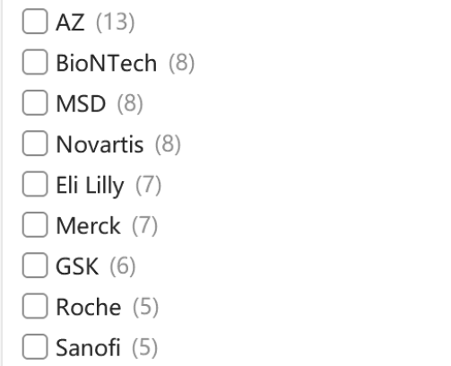
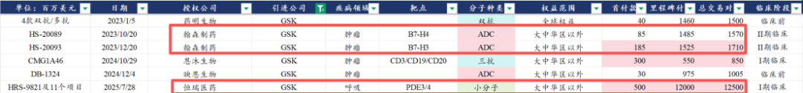

# 政治风险永无止尽，产业发展生生不息

大家好，我是龙哥。

昨晚，纽约时报发布了一份已经起草的行政命令草案，草案的核心内容包括3点：

①要求药企提高几种类型的药物的生产，包括抗生素、镇痛药（对乙酰氨基酚等），这是涉及到基础用药安全、对外依赖度较高的品种，此前美国已经多次提到过，且有政府拨款建产能。

②对美国制药公司从中国药企购买研发阶段的药物的交易进行更严格的审查，要求这类交易接受美国国家安全委员会下属的美国外国投资委员会的审查，而此前并未有类似审查。

③对来自中国患者的临床试验数据进行更严格的审查、并收取更高的监管费用，这点本身也有道理，因为FDA到中国进行临床核查的确存在成本更高、难度更大的问题，其他问题我们也在下文展开。

除了以上消息外，还有消息提到百济神州在25年9月5日被做空机构J Capital  Research发布了做空报告，指责其2017-2018年的伪造收入，这个事再被提起来基本是和以上消息配合做空。这个事我太熟悉了，因为龙哥开始写公众号的第一篇文章就是2019年写的驳斥这篇百济的做空报告的文章，兜兜转转又回到这里。

以上这两个信息，共同导致在美股上市的中国创新药公司股价大跌，如百济神州截至收盘跌了10.59%，再鼎医药跌了9.81%，BD引进康方生物的PD-1/VEGF双抗的Summit又跌了6.48%，三个交易日已经跌了32%，BD引进荣昌生物的泰它西普的Vor跌了10.45%，另外还有亚盛跌了4.08%，传奇跌了2.28%，和黄跌了2.12%。XBI指数也跟随跌了1.14%。

对于该事件该如何理解和解读呢，本文聊聊我们的观点。

1、意料之外、又在意料之中

首先，关于该消息的出现对于我们来说并不算突然，只是时间上比我们预计的要早了一些。

大家如果有印象的话，此前已经有美国智库的文章分析过欧美药企在中国创新药BD的交易金额在25年上半年达到全球的一半，当时已经在渲染中国创新药的全球竞争力，那时候我们就有提到，美国的政府部门和很多智库必然会越来越关注到和重视这个现象。

我们在此前的文章中有过测算（[创新药宏大叙事](https://mp.weixin.qq.com/s?__biz=MzkyMzQ3MDc3Mw==&mid=2247484619&idx=1&sn=9c50a7c53e83a5c5b592a0a46e33b026&scene=21#wechat_redirect)），中国创新药按照当前的BD授权的趋势，假设未来国产创新药拿到20%-30%的全球创新药的份额，意味着这些BD授权可以“再造一个中国制药产业”，可以每年带来3000亿以上的净利润，且中国药企还不需要承担巨额的临床费用和失败风险、不需要搭建庞大且复杂的销售团队与竞品厮杀，甚至说竞争越激烈、欧美药企对中国高效率、高性价比的创新药管线的需求越强。

从这个角度来说国内创新药产业未来将在全球创新药市场赚到“最轻松”但“很丰厚”的一笔钱，实际上这种靠专利、IP赚的“容易钱”，是欧美发达国家最想赚的钱，相当于供给在中国、市场和需求在海外。潜在的利益冲突在这个商业模式诞生之初就已经埋下伏笔，利益受损方必然会想方设法地攻击国内创新药产业。

同时根据我们此前与海外投行人员的交流已经了解到，对于目前欧美药企密集到中国寻求创新药BD、从而严重影响美国创新药biotech投资人/基金的利益——美国biotech的BD或被并购项目减少，美国的创新药投资人实际上已经有非常明显的体感，因此美国的创新药投资者对这种现状进行“反击”实际上是可预期未来必然会发生的事情，只是比我们预计的还要早一些。

2、有钱的不一定是大爷

从中美贸易战以来一直有一种观点，就是认为有钱的一定是大爷，今年来贸易战的情况大家随便在什么渠道都能有所了解，这里我们不多展开，但至少在医药行业，我们有非常典型的案例可以展示，那就是CDMO行业。

自2024年1月生物安全法案的事件之后，国内以药明系为首的CDMO/CMO企业一度迎来股价暴跌、订单受损的情况，欧洲和韩国的CMO公司如Lonza、三星生物等趁机获益。

但我们可以发现，在新的全球创新药技术趋势下，国内CDMO企业还是一往无前的实现订单和业绩的高增长，例如我们在（[CXO行业全面加速](https://mp.weixin.qq.com/s?__biz=MzkyMzQ3MDc3Mw==&mid=2247484869&idx=1&sn=c2cff57e618e3686776c4799e7ab6003&scene=21#wechat_redirect)）文章中聊到的CDMO行业的中报总结，大家可以看到在这几年全球创新药行业最大的几个产业方向——ADC、双抗/多抗、GLP-1类多肽药领域，国内CMO企业实现了极强的赢单能力，头部公司的美国收入占比还在持续提升，嘴上说不要中国的CDMO企业，身体上还是很诚实的嘛，制造业回流美国是理想，订单给药明系才是现实。

在生物安全法案对CXO行业影响较大的阶段，我们习惯性的用国内政策对产业的影响力来判断美国政策对产业的影响力，从而放大了潜在的影响，而现实反复的告诉我们，利益至上才是美国一切政策的核心驱动力。

如何理解美国医药行业的利益至上？核心在于找到对产业发展趋势和方向选择能起到决定性作用的利益相关方。

这个决定性的力量是来自上文提到的这些欧美的创新药投资人吗？显然不是。

欧美医药行业的核心力量来自欧美的顶级跨国药企，这些MNC才是真正能影响政治因素的核心力量，这些MNC已经在用真金白银告诉我们，他们和中国创新药站在一起。

他们之所以选择和中国创新药站在一起，核心因素就是，选择中国创新药能赚钱。

第一个角度，中国创新药的性价比是真的高。

ADC领域国内创新药公司在分子开发、临床数据读出、全球BD方面的统治力这个就先不提了，我们来看另一个超高景气度的方向，GLP-1类的减肥药，9家海外公司BD引进的11个GLP-1类的分子，合计付出了9.45亿美元的首付款，其中包括多个II/III期临床的项目，已经可以给你展示部分优秀的临床数据。

如果在美国市场想要买一个优秀的GLP-1类的分子是什么价格呢，做GLP-1/GIPR双靶点注射剂和口服制剂的Viking此前估值一度高达100亿美元，即便按中位数50亿美元计算，叠加收购一般要有起码30%以上的溢价，意味着至少要65亿美元以上的对价，这个交易对价至少可以在中国创新药行业选20-30个II/III期临床的分子。

在欧美进行创新药BD和收购的高成本之下，是在新冠药/疫苗带来的一次性的创新药投资回报率回升后，全球创新药投资的IRR再度回落，到2024年全球TOP20的MNC的后期管线的内部收益率（IRR）只有5.9%，这其中还有GLP-1类药物贡献了相当一部分，我们知道GLP-1类药物的利润绝大部分都会被礼来和诺和两家公司赚走，扣除GLP-1类药物的IRR只有3.8%。

要提高IRR，要么提高药价和销售峰值，要么降低开发成本。

想要实现前者的可能性已经不高，原因嘛大家也都知道，美国的药品价格从全球来看已经是高的离谱，未来的通胀削减法案等政策都是以降药价为目的，美国的医疗保健支出占GDP的比重已经接近20%（VS我国7%出头），人均预期寿命反而已经低于我国，因此想要进一步提升药价和显著提升药品行业体量的可能性是低的。

那么药企想要提高甚至仅仅是维持IRR，降低药物开发成本、提高效率就成了必然，相较在欧美市场动辄数十亿美元乃至上百亿美元的创新药项目并购，国内创新药BD的性价比绝对是拉满的。

第二个角度，选择中国创新药是未来欧美MNC在创新药的生死之争。

全球的创新药行业基本被下图所示的美国和欧洲的十几家巨头瓜分：

美国的创新药市场对于这些欧美MNC来说是开放竞争的市场，我们可以看到在2019年的时候，全球药品收入TOP5的公司分别是罗氏、诺华、强生、默沙东、辉瑞，然后是赛诺菲、艾伯维、GSK、BMS、阿斯利康，前十里有5家欧洲药企，前2都是欧洲药企。

到2025年的各家指引和大致预测情况来看，前五分别是默沙东、辉瑞、礼来、强生、艾伯维，TOP5已经没有欧洲药企，GSK掉队掉的很明显，赛诺菲已经基本靠IL-4Rα打天下，诺华和阿斯利康的管线还算不错，但眼看着也没有竞争前五的机会。

欧洲药企的掉队，反而给了中国创新药出海最大的机遇：

从中国创新药累计海外BD授权的项目数来看：英国的阿斯利康13个遥遥领先，然后是德国的新兴biopharma公司BioNTech是8个，美国的默沙东8个，瑞士诺华8个，美国的礼来7个，德国默克7个，英国GSK6个，瑞士罗氏5个，法国赛诺菲5个。

如果再从交易金额来看：阿斯利康在中国的创新药BD累计支付首付款19.01亿美元，总交易对价224.26亿美元；诺华在中国的创新药BD累计支付首付款16.4亿美元，总交易对价205.75亿美元；GSK累计支付首付款11.4亿美元，总交易对价191.35亿美元；BioNTech累计支付首付款13.3亿美元（含并购）、总交易对价90亿美元。

欧洲药企在从中国创新药BD这件事上，是下了重注的。欧洲顶级MNC里掉队的GSK在这两年更是像“all in”恒瑞/豪森这对夫妻店：

（GSK还收购了恒瑞医药BD授权海外的TSLP单抗）

美国药企在中国BD金额最大的默沙东累计支付首付款18.57亿美元，总交易对价204.16亿美元；辉瑞支付首付款13.43亿美元，总交易对价82.78亿美元，核心就是一个自三生制药引进的PD-1/VEGF双抗。

欧洲和美国药企在新时代的“军备竞赛”，实际上都是在中国买“军火”。

对于CXO行业，你如果不选药明系做CRO/CDMO服务，那你就会落后+高成本。

对于创新药行业，你如果不在中国做创新药license in，那你就会落后+高成本。

对于欧美药企来说，没有什么yes or no，有的是未来全球创新药行业的生死角逐时的选择，这个时候什么政治正确、什么MAGA都不重要。

3、实质影响评估

基于以上内容评估，我们大致做出如下判断：

①如果仅凭一份媒体发布的行政命令的草案，对欧美MNC的约束力将极其有限，哪怕是CDMO这样偏制造的领域，去年都无法落地生物安全法案的立法，更何况是对技术和IP的引进这种相对宽泛和可操作空间巨大的项目的限制，中国创新药海外BD的爆发本质上是CRO/CDMO的全球竞争力的延伸。

②对中国临床数据的更高成本和更严格的审查值得关注，不只是给MNC增加引进中国新药的成成本的问题（那点临床核查的成本相比创新药总体的研发投入来说太过有限），更重要的是国内临床数据的质量需要进一步提升，需要更多中国和欧美临床一致性的案例来验证中国的临床数据质量，尤其是安全性数据的差异性。

③客观看待市场运行的客观规律，今年以来港股创新药指数累计涨幅115%，恒生医疗保健指数累计涨幅98%，客观来说存在庞大的获利盘，叠加24年初的生物安全法案导致CXO板块巨大跌幅的记忆，短期市场或许会有扰动。

风险提示：本文仅讨论行业/公司经营情况，投资需综合考虑公司经营、估值、管理层等多方面因素，建议读者审慎参考，本文不作为投资依据，不建议大家根据本文做出投资计划。

<!-- wxmp-comments-begin -->

---

## 留言（19 条，含回复共 38 条）

- **马华磊** 👍9 · 2025-09-11 08:10
  昨晚也看到了相关消息，龙大这么早，大跌加仓就是重仓机会
  - ↳ **作者** · 2025-09-11 08:14
    昨晚睡得早，一早起来给大家聊聊啊
- **洪易** 👍7 · 2025-09-11 08:22
  中国的生物医药行业在成本这方便真是冠绝全球，人才密度高，效率快，其他国家很难竞争
- **刘勇** 👍5 · 2025-09-11 08:14
  这其实是另一个廉价劳动力市场
  - ↳ **作者** · 2025-09-11 08:17
    这个和大的经济环境有关，实际上创新药是给国内创造高收入群体的行业，你所谓的廉价劳动力只是和欧美比，要是和国内比，总比进厂打螺丝的要好n倍吧。
  - ↳ **作者** · 2025-09-11 08:51
    以前我们的等量劳动力在价格上看，都卖不到欧美的百分之一；现在已经巨大进步了，等我们军事再起飞一下，未来更美好
- **黑小弟** 👍5 · 2025-09-11 08:40
  哪怕是CDMO这样偏制造的领域，去年都无法落地生物安全法案的立法，更何况是对技术和IP的引进这种相对宽泛和可操作空间巨大的项目的限制，中国创新药海外BD的爆发本质上是CRO/CDMO的全球竞争力的延伸[强][强][强]
- **刘二** 👍4 · 2025-09-11 08:13
  恒瑞医药 药明康德是不是要跌停[捂脸]
  - ↳ **作者** · 2025-09-11 08:16
    也没这么悲观吧，创新药全球化做的最好的百济昨晚被美股投资人摁着打是跌了10%，药明这种已经被政治风险反复摩擦过的，还有恒瑞这种国内海外预期五五开的，还能更差吗。
- **唐小堂** 👍4 · 2025-09-11 08:19
  临床数据要求高了，倒逼中国企业提高质量，加速竞争，对于龙头和优秀企业是好事，避免行业高速发展，泥沙俱下，不过不管怎么说，指数投资问题都不大。
- **范征** 👍4 · 2025-09-11 08:21
  感觉和CDMO当时一样，只是位置不一样了，当时CXO处于低位，现在创新药处于高位，所以抄底也不是不买也不是，没啥意思。在缩量行情下，即使没有这个利空创新药估计也会回调。
  - ↳ **作者** · 2025-09-11 08:29
    当时CDMO本身处于基本面的下行期，所以生物安全法案之后就是估值业绩双杀。现在创新药的位置确实不可同日而语，但基本面也在不同的阶段。
- **牛马嘉** 👍2 · 2025-09-11 08:15
  制裁侧面表明咱们创新药开始厉害了
  - ↳ **作者** · 2025-09-11 08:30
    那也不需要用这个来证明，国产创新药的竞争力在两三百个BD里已经展示的淋漓尽致了。
- **陌上初薰** 👍2 · 2025-09-11 08:17
  药明又要被爆锤了吗。。。
  - ↳ **作者** · 2025-09-11 08:18
    好好看文章内容。
- **灵感自在** 👍2 · 2025-09-11 08:29
  龙大，这个对国内cro泰格这些什么影响？
  - ↳ **作者** · 2025-09-11 08:34
    国内CRO和创新药是一荣俱荣，一损俱损，像泰格现在也是一半收入来自海外，中国创新药出海也给国内CRO公司带来了海外临床的订单。
  - ↳ **作者** · 2025-09-11 08:55
    是的
- **Seplues** 👍2 · 2025-09-11 08:30
  虽然现在看来生物法案确实对CXO公司的业绩影响有限，但是股价当时确实跌了很多。这次也不应该这么乐观，业绩是业绩，股价是股价！
  - ↳ **作者** · 2025-09-11 08:33
    在股价高位谨慎一点没问题。
    不过还是要说，当时CDMO本身处于基本面的下行期，而且大家没应对过这方面的风险，所以生物安全法案之后就是估值业绩双杀。现在创新药的位置确实不可同日而语，但基本面也在不同的阶段。
- **美克眼镜视光顾问** 👍2 · 2025-09-11 08:54
  龙哥，目前创新药整个板块都已经翻倍了，其实分享一些低位的比如器械，医疗服务方面的行业，潜在价值更大
  - ↳ **作者** · 2025-09-11 08:57
    医疗器械有分享，我们今年也比较看好一些器械出海的标的，但是我们还是要把握核心的产业趋势，就像AI你今年投不投光模块和PCB的收益率可能差几倍，不可能说光模块涨多了就去强行投低位的。
- **求索者** 👍2 · 2025-09-11 09:25
  五年后如果老美再继续闭关锁国，会不会来一场反向鸦片战争[呲牙]
  - ↳ **作者** · 2025-09-11 09:29
    珍爱和平
- **Berry** 👍2 · 2025-09-11 10:14
  龙哥，这个如果真能实现，创新药是不是会向芯片一样，迎来更大的国家给的应对机会。况且创新药水平在国际地位上比芯片水平的国际地位高很多了。
  - ↳ **作者** · 2025-09-11 10:25
    芯片是内需，创新药是外需，国家能给创新药什么应对机会呢
  - ↳ **作者** · 2025-09-11 10:41
    外需转内需嘛，美国不承认我们的创新药ip，我们也不承认美国的，那好多美国专利可以无视了，咱们是不就可以直接研发了[捂脸][捂脸]
- **孙小山** 👍1 · 2025-09-11 08:18
  感谢龙哥的一路陪伴啊，现在我的创新药仓位已经很低了，之前高的时候都是看着龙哥的文章买
  - ↳ **作者** · 2025-09-11 08:28
    这个消息出来大家心情真是各不相同，重仓的心如死灰，轻仓的风淡云轻[捂脸]
    大部分投资人是仓位决定脑袋这正常，但在这之外还是要客观理性的想想这事儿[呲牙]
- **春去春又来** 👍1 · 2025-09-11 09:06
  哈哈，再想买双抗在研药物就没那么容易了，岂不利好杜根？
  - ↳ **作者** · 2025-09-11 09:11
    该买的会有各种方法去买的[捂脸]
- **鲲鹏** 👍1 · 2025-09-11 09:19
  看来CXO、CDMO也难逃一劫
  - ↳ **作者** · 2025-09-11 09:29
    产业链肯定是一荣俱荣一损俱损
- **baggio** 👍1 · 2025-09-11 12:55
  感觉中国创新药被贱卖给欧美啊
  - ↳ **作者** · 2025-09-11 12:58
    行业总体还是市场化竞争的，觉得贱卖可以找能出高价的[捂脸]
- **气宇轩昂** · 2025-09-11 16:24
  龙哥，300685艾德生物您怎么看？滞涨的原因是集采降价吗？谢谢
  - ↳ **作者** · 2025-09-11 17:44
    整个IVD行业今年都比较差，行业β的因素，降价压力也客观存在。

<!-- wxmp-comments-end -->
