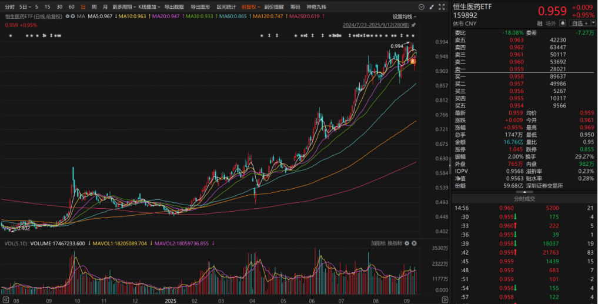
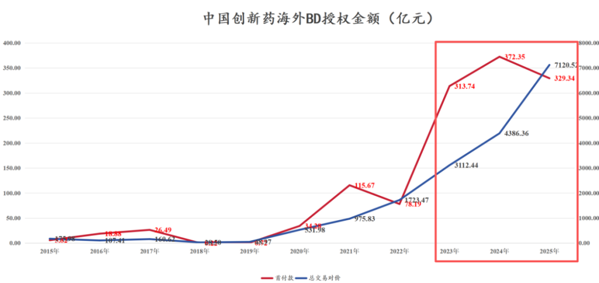
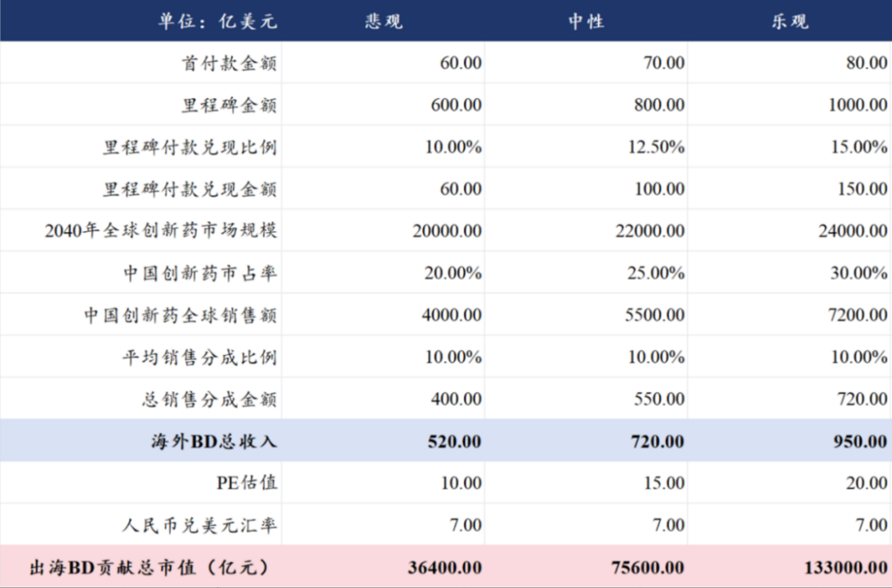
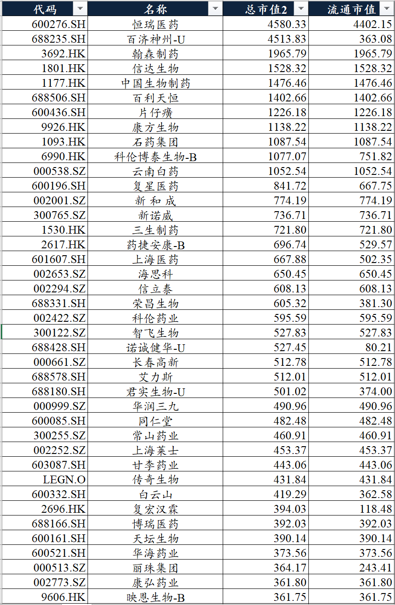
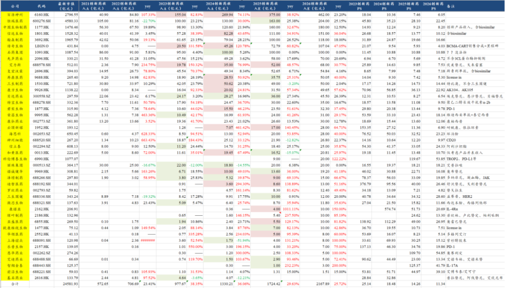
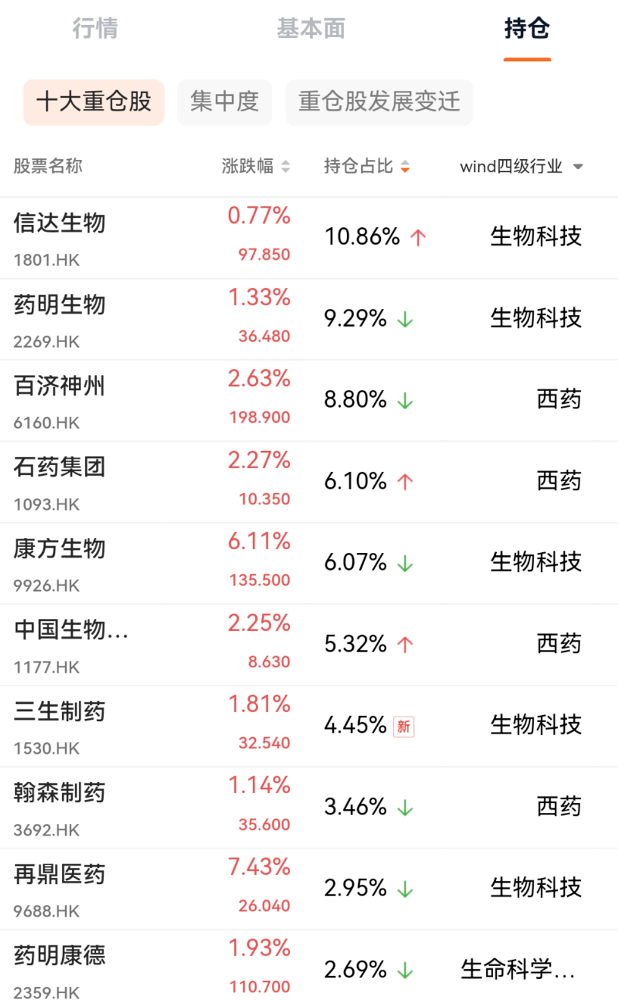

# 创新药宏大叙事，行业估值处于什么水平？

大家好，我是龙哥。

在今年6月我曾经给大家写过两篇文章，一篇是创新药宏大叙事[创新药宏大叙事](https://mp.weixin.qq.com/s?__biz=MzkyMzQ3MDc3Mw==&mid=2247484619&idx=1&sn=9c50a7c53e83a5c5b592a0a46e33b026&scene=21#wechat_redirect)，另一篇是创新药行业估值水平[创新药目前处于什么估值水平？](https://mp.weixin.qq.com/s?__biz=MzkyMzQ3MDc3Mw==&mid=2247484651&idx=1&sn=170b1d665b283894fb722e7daeb885a7&scene=21#wechat_redirect)。

时隔接近三个月，行业又实现了较大幅度的上涨，因此这个时间点，再给大家测算一下行业未来的市值空间以及当前创新药行业的估值情况，不论大家是投我们一直以来讲的恒生医药ETF（159892），还是投创新药个股，都希望对大家有所帮助。

1、创新药出海重塑行业逻辑和估值

在这轮创新药牛市以前的全行业层面的估值，朴素的认知还是国内业务的估值为主、海外业务的估值为辅，毕竟那时候大家普遍认为出海还是只能带来个别公司的估值显著提升，并不能对全行业的估值带来重大的变化。

而事实上从2023年开始创新药的海外BD就已经开始重塑行业逻辑，只是直到2024年底以来在行业流动性大幅改善之际市场才充分认可这个逻辑，看龙哥文章久的读者也知道我们看好创新药有多久、在底部磨了多久、期间消耗了大家多少的耐心和信心，才有这轮的收获期。

从我们统计的目前376家A/H/美股医药工业上市公司，截止到上周五（9月12日）合计的总市值为6.74万亿元，合计流通市值6.00万亿元。（有AH股的都是按简单A股估值测算，因此这个总市值会比实际略高）

我们来测算一下行业未来的市值空间，可以分为国内部分和海外BD的部分：

医药工业国内估值：医药制造业企业2024的利润约3400亿，按15倍PE可贡献5.10万亿市值。最悲观的假设是未来国内市场的创新药研发只能贡献较为有限的利润、行业总体的利润体量维持该水平。

创新药出海估值：

假设①：全球创新药规模在2040年达到2.2万亿美元（2024年约为1.2万亿美元），行业复合增速约为4%。

假设②：未来中国公司研发的创新药通过海外BD授权的方式占据全球25%的创新药市场份额。

中性预期下，创新药海外BD远期约贡献7.56万亿市值。 

按中性预期，远期（10-15年周期）中国创新药+传统制药（仿制药、中药）的总市值空间约为12.66万亿元，约有1倍空间，潜在年化复合回报率4.3%-6.5%。乐观预期18.4万亿元，约有2倍空间，潜在年化复合回报率6.9%-10.6%。总体来看在行业层面的潜在回报率已经不高。

这其中还值得注意的是，在我们统计的行业总市值里，还包含一部分市值规模比较大、但是其主要是短期流通盘小、资金推动的行情，未来股价有可能会跌80%-90%的，大家应该也大致知道龙哥大致指的是哪些公司。

我们再来测算一下行业龙头公司的市值空间：

TOP40的医药工业上市公司合计市值为3.63万亿元，合计流通市值2.99万亿元。其中TOP10药企的总市值为2.00万亿元，恒瑞医药和百济神州的市值都在4500亿元左右。

头部药企市值空间测算：

假设①：中国2024年药品三大终端（院内+线下药店+互联网医疗）市场销售规模合计1.86万亿元同比略微下降，假设未来10年做到3.0万亿元，复合增速4.9%。 

假设②：中国龙头药企未来市占率约5%。参照MNC的全球市占率约5%、日本药企在日本市场的CR10约为51%。 

假设③：未来中国头部药企国内和海外利润占比各半。参照日本药企国际化后的国际收入占比50%-70%。

中国头部药企市值空间：中国区收入约1500亿（3万亿\*5%市占率），按国内市场20%净利率计算约为300亿利润。海外市场贡献相当于国内市场的利润，则合并为600亿利润。按15-20倍PE计算，头部药企的市值可到9000亿-12000亿元，参照头部药企当前市值，远期也是约有1-2倍空间，也既行业龙头公司的市值空间与行业总体的市值空间接近。

2、创新药商业化PS估值

第二块我们来聊聊大家比较熟悉的这个图，国内创新药商业化公司的2021-2026年创新药产品收入数据及大致的收入预测，这个图基本我们每个财报季会给大家更新一次，这里再叠加最新的市值和估值水平。

在谈这个估值水平之前还是要再强调一下，以上PS估值是只含创新药商业化收入的估值，这个估值只能作为一个趋势的参考，本身有一定的局限性，尤其是这轮创新药行情的核心逻辑是海外BD，看国内商业化为主的估值可以作为基本盘，但不同公司的差异会非常大。

以创新药商业化收入为基数计算中国创新药AH上市公司当前估值水平，统计43家上市公司合计市值为2.46万亿元，2025-2026年创新药收入预计为1724亿元+29.63%、2168亿元+25.72%，对应2025年为14.26倍PS，2026年为11.34倍PS。

如果我们复盘历史来看，该估值水平不算完全泡沫化：

2021年6月28日上一轮牛市最高点，以上公司的总市值为1.90万亿元，对应2021年估值为33.11倍PS，对应2022年估值为26.83倍PS。

2023年1月27日医保政策反转后行业反弹的高点，以上公司的总市值合计为1.39万亿元，对应2023年估值为14.19倍PS，对应2024年估值为10.43倍PS，和现在比较接近。

2024年12月31日去年底，以上公司的总市值合计为1.25万亿元，对应2024年估值为9.39倍，对应2025年估值为7.25倍PS。

2025年4月7日的低点，以上公司的总市值合计为1.38万亿元，对应2025年估值为7.99倍PS，2026年估值为6.36倍PS。

对于159892恒生医药ETF的持仓的估值，大家也可以在下表中对应一下，看看大致处于行业什么水平。由于恒生医药ETF的权重成份股还是以大市值的Pharma为主，叠加部分头部CXO公司，总体估值都还好。

.....

最后再展示部分PS估值绝对值较低的创新药公司，大家可以关注一下，但PS绝对值低在创新药领域也不能作为最核心的投资逻辑，

①传奇生物：25年约6.93倍PS，预计26年4.03倍PS。BCMA-CART仍在快速放量期，强生对该产品较为重视。

②罗欣药业：25年约7.21倍PS，预计26年4.82倍PS。替戈拉生（P-CAB）放量期，但P-CAB竞品较多、首个品种已经集采，且罗欣药业本身财务结构偏复杂，市场关注度不高。

③先声药业：25年约5.69倍PS，预计26年4.72倍PS。流感新药、失眠新药等多个新品种上市，IL-4R等产品申报上市。

④华领医药：25年约8.23倍PS，预计26年5.14倍PS。糖尿病口服药快速放量，但后续管线有断层，后续研发方面的催化最快可能也要26年中。

⑤再鼎医药：25年约7.42倍PS，预计26年5.30倍PS。license in的模式为主，销售持续miss。

⑥百济神州：25年约7.46倍PS，预计26年6.05倍PS。总体收入增速放缓，开始放利润。

⑦贝达药业：25年约8.27倍PS，预计26年5.30倍PS。国内产品为主，销售持续miss。

⑧云顶新耀：25年约11.36倍PS，预计26年6.90倍PS。license in的模式为主，销售指引上调。

⑨复宏汉霖：25年约7.48倍PS，预计26年7.18倍PS。生物类似药收入占比较高，26年生物类似药集采。主要看点是在研管线。

⑩艾力斯：25年约9.85倍PS，预计26年7.53倍PS。近几年国内商业化持续超预期。

......

近期重点文章：

[政治风险永无止尽，产业发展生生不息](https://mp.weixin.qq.com/s?__biz=MzkyMzQ3MDc3Mw==&mid=2247484945&idx=1&sn=a5ab5306f3b952ef9b06a07e402b49ad&scene=21#wechat_redirect)

[中国创新药最具统治力的方向](https://mp.weixin.qq.com/s?__biz=MzkyMzQ3MDc3Mw==&mid=2247484932&idx=1&sn=cbac60396bc3da1ff79f4fe27e0453e6&scene=21#wechat_redirect)

[2025创新药商业化全梳理](https://mp.weixin.qq.com/s?__biz=MzkyMzQ3MDc3Mw==&mid=2247484922&idx=1&sn=80646a977271d93db81cafc4cc4400de&scene=21#wechat_redirect)

[最全ETF梳理](https://mp.weixin.qq.com/s?__biz=MzkyMzQ3MDc3Mw==&mid=2247484910&idx=1&sn=da49510d38deec63131e081599b4962e&scene=21#wechat_redirect)

[2025创新药融资之王](https://mp.weixin.qq.com/s?__biz=MzkyMzQ3MDc3Mw==&mid=2247484887&idx=1&sn=6d1b9b5f83f3d0f0b021a716a257cca7&scene=21#wechat_redirect)

[CXO行业全面加速](https://mp.weixin.qq.com/s?__biz=MzkyMzQ3MDc3Mw==&mid=2247484869&idx=1&sn=c2cff57e618e3686776c4799e7ab6003&scene=21#wechat_redirect)

[哪些全球顶级创新药在25年大超预期？](https://mp.weixin.qq.com/s?__biz=MzkyMzQ3MDc3Mw==&mid=2247484844&idx=1&sn=82de722328a5675ecf9ac735e60fd5e4&scene=21#wechat_redirect)

[自免再现200亿美金超级大药](https://mp.weixin.qq.com/s?__biz=MzkyMzQ3MDc3Mw==&mid=2247484792&idx=1&sn=8fb59368167f4ed7e950607826df81e7&scene=21#wechat_redirect)

风险提示：本文仅讨论行业/公司经营情况，投资需综合考虑公司经营、估值、管理层等多方面因素，建议读者审慎参考，本文不作为投资依据，不建议大家根据本文做出投资计划。

<!-- wxmp-comments-begin -->

---

## 留言（18 条，含回复共 36 条）

- **Jimmy** 👍11 · 2025-09-15 13:35
  目前大多都不便宜了，但是离显著泡沫化还有点距离
  - ↳ **作者** · 2025-09-15 14:17
    是的，从全行业角度、从行业龙头角度，都说不上便宜。
- **鲲鹏** 👍8 · 2025-09-15 13:27
  市场对医疗器械预期还没有反馈，回调1个月了
- **DRAGON** 👍6 · 2025-09-15 13:47
  药明药明[呲牙][强]
- **卢光明** 👍4 · 2025-09-15 13:40
  龙大，国药集团的胃口很大，已经三家血液制品公司了，随着人口老龄化严重，参照发达国家的情况血制品总体趋势咋样？
  - ↳ **作者** · 2025-09-15 14:18
    血液制品现在就是国资在整合市场，也是上面的态度。不过就公司基本面来说，行业还处于下行期吧。
- **头球之我见** 👍3 · 2025-09-15 13:22
  为什么都瞧不上上绿叶制药呢
  - ↳ **作者** · 2025-09-15 13:27
    但凡跟踪这公司久一点，但凡了解这公司历史，当你被公司无数次miss的时候，你肯定不会问这个问题。
  - ↳ **作者** · 2025-09-15 13:27
    以及如果你翻翻他的资产负债表的话，也不会问这个问题。
- **孙小山** 👍3 · 2025-09-15 13:33
  还是白鸡拿着安心
- **Bryan** 👍3 · 2025-09-15 14:01
  对了，昭衍新药看到小作文要有猴周期了？这两天也大涨，持怀疑态度。另外我记得FDA都放宽动物实验要求了，这是长期利空啊
  - ↳ **作者** · 2025-09-15 14:34
    那个还好，主要是明年猴子产能会放出来，以及后面可能要重新放开进口猴子了。
- **Bryan** 👍2 · 2025-09-15 13:51
  龙哥好，我觉得投资有个很朴素的道理就是低位要对利空迟钝一点，加大研究买入；高位要对利空敏感一点，小心站岗，上周的BD偷家虽然不是那么容易落地，但市场两天演绎下来大部分公司还上涨了（开盘跌幅不够大我都没买，当然我也是怪自己卖过早不然T下），实在是市场太热烈。
  另外，发现中美两地板块温差挺大的，有什么大MNC代表的基金嘛？我在低吸标普生物和纳指生物，要降息也有点压不住上涨了
  - ↳ **作者** · 2025-09-15 14:22
    上周的文章评论区刚好有个倒霉蛋在今年AH的创新药大牛市里拿了个投美股MNC的基金，你可以去翻翻看[破涕为笑]
- **王国森** 👍2 · 2025-09-15 14:46
  龙师   华海的HB0025  在PD-L1阴性及冷肿瘤领域如何看
  - ↳ **作者** · 2025-09-15 14:50
    倒也没怎么看，我自己感觉大家都是摸着康方过河，康方开了十几个3期临床了，核心还是看最前面的康方的数据吧。后来者反正我目前还没看到明显的差异，包括华海上周发的肺癌的数据，也是高剂量、高毒性的大力出奇迹吧。
- **胡言胡语hws** 👍1 · 2025-09-15 13:14
  龙哥，药捷是什么情况，单纯庄股炒作吗？这也太疯狂了吧
  - ↳ **作者** · 2025-09-15 13:15
    港股没啥流通盘的票经常有这种，只不过大多数关注度不高，以及药捷安康尤其极端。看表演呗。
  - ↳ **作者** · 2025-09-15 13:32
    药捷泡沫破灭的时候，别把创新药带崩了。。
- **天野源** 👍1 · 2025-09-15 13:33
  龙哥，几时出CXO的文章呀？等了很久很久了
  - ↳ **作者** · 2025-09-15 14:16
    CDMO发了，CRO主要是中报普遍也不太好，就不着急写[裂开]
- **幸运丰** 👍1 · 2025-09-15 13:41
  龙哥，爱博医疗还有啥新催化吗，股价跌跌不休
  - ↳ **作者** · 2025-09-15 14:18
    这公司就是得用业绩来持续证明自己呗，下个月看看三季度业绩。
- **笑看风云** 👍1 · 2025-09-15 13:51
  老师，和黄医药目前估值算偏低吗
  - ↳ **作者** · 2025-09-15 14:25
    和黄其实比较好的反应了创新药的特点，只要你有钱、持续的投研发、公司能力不太差，总归能投出来点东西，所以我们最早讲创新药估值体系的时候就说，biopharma的估值体系和biotech天生会有差别。
    和黄卖了上海和黄药业的股权之后，有接近100个亿的在收现金，还有几个商业化品种的收入。
    研发方面短期的变化就是首个ATTC平台的分子IND。
- **赵财** 👍1 · 2025-09-15 13:58
  龙哥，华海也算头部医药公司了么
  - ↳ **作者** · 2025-09-15 14:33
    头部的定义也没那么宽松[捂脸]
- **朱炜** · 2025-09-15 13:15
  老师港股亚盛医药咋样？
  - ↳ **作者** · 2025-09-15 13:16
    看前面有一篇梳理血液瘤的文章。公司是好公司，也有看点，只不过今年缺点催化。
  - ↳ **作者** · 2025-09-15 13:26
    就是短期没啥大的催化剂
- **小谭铁匠** · 2025-09-15 13:22
  血制品，什么时候能好起来？[呲牙]
  - ↳ **作者** · 2025-09-15 13:27
    还在周期下行期、行业整合期。
- **俊耀** · 2025-09-15 13:42
  我就是龙哥口中的信立泰钉子户，从2020年到2025年，经历了3次20元-40元的过山车，但是这波上涨到40的过程中，都卖飞了。没想到这波创新药能带动这么大上涨。然后，就是恩华最近是什么情况，大涨大跌
  - ↳ **作者** · 2025-09-15 14:20
    恩华药业和人福医药这俩麻醉药的龙头，之前大家对他俩的定位都是熊市防御的品种，估值低、业绩弹性不大，但实际上你看这两家公司每年的研发投入都不算少的，这两年陆续也开始有创新药品种兑现，现在创新药行业你也知道，关注度高的普遍涨了非常多，所以自然有人来挖掘这种底部低估值有边际变化的。长春高新实际上也类似。
- **ECHO** · 2025-09-15 14:16
  龙哥，康方能聊下吗？海外试验的数据不好，创始人吃相难看叠加亏损，还有其他什么情况？
  - ↳ **作者** · 2025-09-15 14:36
    二线肺癌达不到OS终点应该是可预期的，只能说市场有点后知后觉。
    吃相难看这个说法，我只能说看的公司多了也就觉得大家都一样，对这些公司千万别要求他们管理层是白莲花[破涕为笑]，相对来说康方的管理层并不算过分的。
    至于亏损，创新药公司早期都亏损，这个没啥。

<!-- wxmp-comments-end -->
