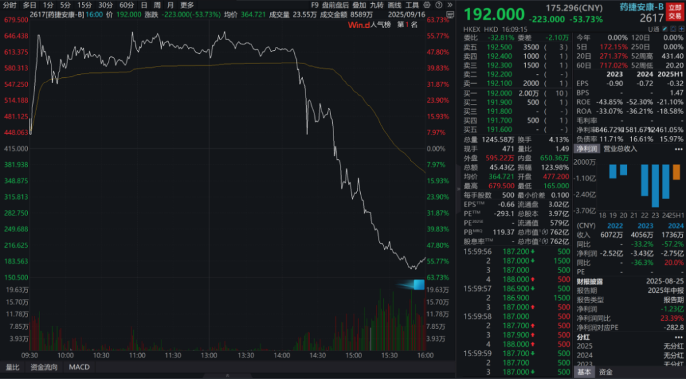
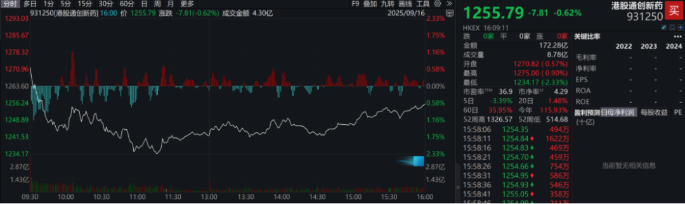
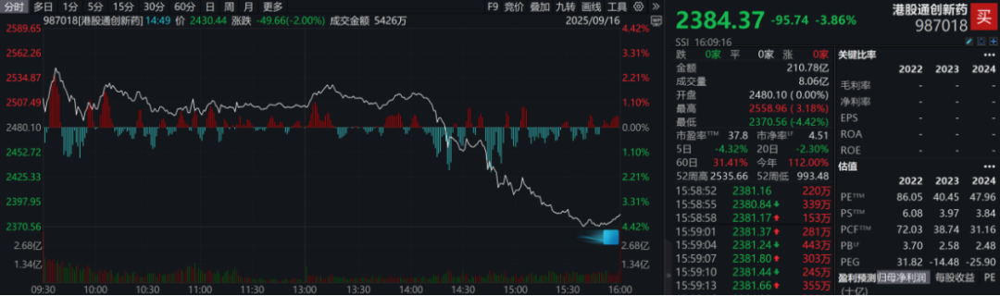
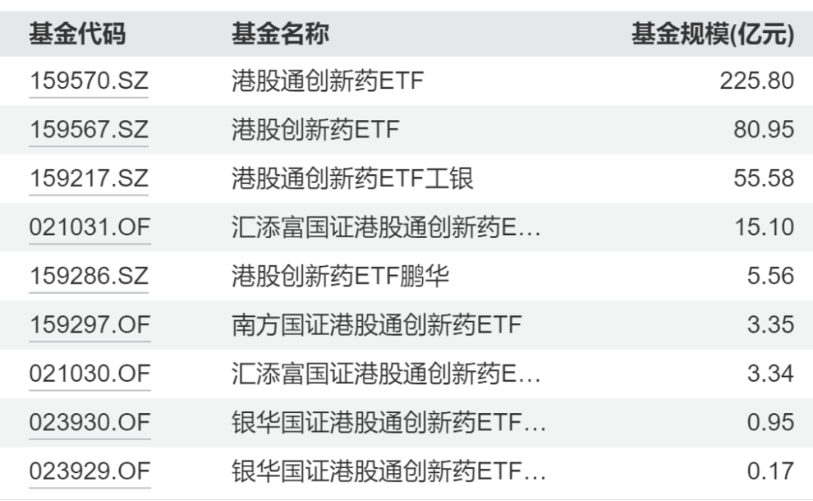
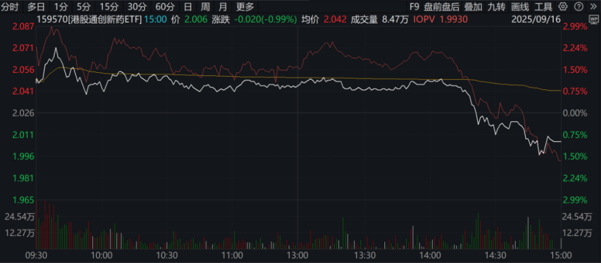
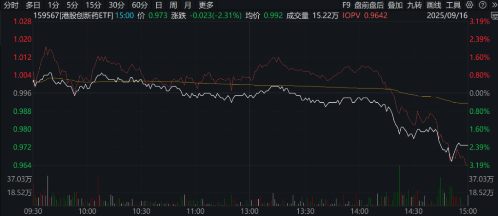
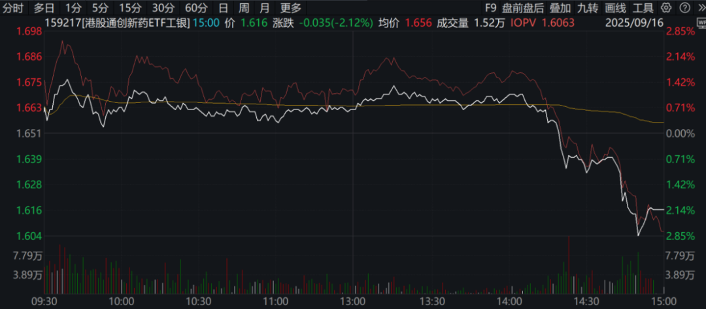

# 坏了，药捷安康的瓜吃到自己头上了

大家好，我是龙哥。

药捷安康最近的市场表现，基本上只要关注医药的投资人都是大致有看到的，但大多数人实际上还是抱着吃瓜的态度看。

包括龙哥在内的大部分医药投资人，实际上在药捷安康涨到两三百亿市值的时候就开始抱着吃瓜的态度看，因为实际上在港股市场这种情况并不少见，甚至说次新股新纳入港股通之前爆拉一波股价然后高位把筹码出给港股通资金已经是非常常见的现象，也有一些港股次新是趁着刚上市不久流通盘非常小，坐庄把股票炒起来，然后一把出货流畅的跌80%以上的也有不少。

因此，这次药捷安康的表现，不管其市值是炒到1000亿、2000亿，我们都是抱着看戏的心态来看，并没有太当回事，顶多就是闲聊时候会提一句药捷安康崩盘的时候会不会影响创新药行业的短期情绪。

但没想到，对于部分投港股创新药ETF的投资人来说，坏事了——国证港股通创新药指数把药捷安康纳入指数成份股了，导致ETF在昨天和今天被动追高买入，然后今天指数和ETF跟随药捷安康股价暴跌而下跌。

今天日内指数的表现非常明显：

中证港股通创新药指数（931250）是半年调整一次指数成分股，本次因祸得福没有纳入药捷安康，因此中证港股通创新药指数今天仅是跟随港股医药跌了0.62%（今天恒生医疗保健指数跌了1.02%）。

而国证港股通创新药指数（987018）是季度调整一次指数成份股，看似更频繁的调整成份股可以更贴近市场变化，但这次在高位纳入了药捷安康作为成份股，并且还给了不小的权重（5%左右），从而导致国证港股通创新药指数今天的走势和中证港股通创新药指数完全背离，全天跌了3.86%，且其走势是：上午大涨——药捷安康上午暴涨最多60%+——下午暴跌——药捷安康下午股价累计跌70%。

由于以上ETF的交易都是跟随A股在3点收盘，但是指数的波动和港股的交易是持续到四点，因此我们把股价和ETF波动分为第一阶段14.09-15.00（药捷安康在A股交易时间内的暴跌）和第二阶段15.00-16.00（A股收盘后药捷安康在港股继续暴跌）这两段来看。

药捷安康的股价从14.09的620港元/股跌到15.00的318.6港元/股，第一阶段股价跌了48.61%，又从15.00的318.6港元/股跌到收盘价192港元/股，第二阶段股价跌了39.74%。这样两个阶段合计股价跌了69.03%。

与之对应的，国证港股通创新药指数在第一阶段跌了4.07%，在第二阶段跌了1.09%，而中证港股通创新药指数在第一阶段持平，在第二阶段涨了0.73%，也即国证港股通创新药指数在两个阶段的“超额下跌”分别是4.07%和1.82%，再以此来推算，在药捷安康股价最高点时其权重一度涨到指数的8.37%，在前一个交易日的权重占比则大概是5.60%。

跟踪国证港股通创新药指数的ETF共有9个，合计总规模达到390.8亿元：

其中规模比较大的是159570汇添富国证港股通创新药ETF（225.8亿）、159567银华国证港股通创新药ETF（80.95亿）、159217工银国证港股通创新药ETF（55.58亿）。这3个ETF的规模就达到362.33亿。

应该是由于持有药捷安康的比例有所不同——指数刚调完成份股、ETF还没完全调整到位——导致3个ETF今天的净值走势有所差异。

但3个ETF今天到3点都是溢价收盘，分别溢价0.65%、0.91%、0.60%，其中隐含的有两种可能性：

①交易者预计在3点之后到4点的这段时间指数会有反弹，但实际上我们看到15.00-16.00的第二阶段，药捷安康的股价以及国证港股通创新药指数都是继续下跌。

②交易者与发行以上ETF的公司交流后了解到其已经剁掉了药捷安康的持股，因此上图中红线的预测净值表现实际上是失真的。

龙哥也不知道是哪种情况，目前判断后者的可能性会更大一些。

假如说以上ETF还没有剁掉或者只减了一部分药捷安康的持仓，后续会是什么结果呢，以159570为例计算，其预测净值在第一阶段跌了3.48%（指数跌了4.07%），大概对应药捷安康的持仓比例最高达到7%左右，其到今天收盘价有0.65%的溢价，指数在第二阶段又跌了1.09%，也就是相当于ETF实际上还“少跌”了1.74%，如果的确没有做调仓，则明天可能ETF会直接低开比较多来反映这部分影响。

如果再考虑到今天下午16.00港股收盘，药捷安康的权重将下降到2.3%左右，假如药捷安康的市值在当前762亿港元的基础上再跌85%（别问为什么是跌这么多，拍脑袋的），也就是对于以上ETF的净值还要损失2%左右，再叠加以上“少跌”的1.74%，则在今天ETF收盘价的基础上可能净值累计还要损失3.74%，如果从昨天收盘价来计算，以上ETF的净值会因为药捷安康这一波操作而最多损失约5.3%的净值。

换句话说，持有跟踪国证港股通创新药指数的ETF的投资人，这药捷安康的瓜吃着吃着，莫名其妙的损失了2%-5%的资金。。。吃瓜吃到自己头上了。。。

当然，如果以上公募基金对持仓及时做了主动的减仓，则实际的净值损失会远小于此。

这次药捷安康的事件，对于投资ETF的投资人、对于指数基金管理机构来说都是一次比较值得重视的教训，有些资金以有心算无心，专门收割港股通资金、尤其是被动配置的资金。

指数基金投资或者说被动基金投资，背后隐含着的是“市场永远是对的、跟随市场获取平均回报”，但在面对这种情况的时候，也还是可以采取一些主动的行为来维护客户的利益。

风险提示：本文仅讨论行业/公司经营情况，投资需综合考虑公司经营、估值、管理层等多方面因素，建议读者审慎参考，本文不作为投资依据，不建议大家根据本文做出投资计划。

<!-- wxmp-comments-begin -->

---

## 留言（13 条，含回复共 26 条）

- **Bryan** 👍34 · 2025-09-16 23:46
  [破涕为笑]其实之前寒武纪纳入上证50就有人吐槽要接盘（流动性好, 业绩高增，叙事宏大唯一问题贵），但药捷安康明显是庄股，还这么被动，实在是不应该的
- **浪味仙本仙** 👍8 · 2025-09-16 23:55
  我要不是看了你的文章，我都不知道我买的港股通创新药etf也有这货…标题不就是我么[撇嘴]
  - ↳ **作者** · 2025-09-17 00:09
    [裂开][裂开][裂开]
- **Zg** 👍7 · 2025-09-16 23:57
  这公募基金经理没灰色链条，我是不信的
  - ↳ **作者** · 2025-09-17 00:09
    这个还真不一定，只是说jjjl确实没有做出主动判断，就自己送刀口上了。
- **知行** 👍3 · 2025-09-16 23:59
  港股创新药ETF--513120和恒生医疗ETF--513060有踩坑么
  - ↳ **作者** · 2025-09-17 00:07
    这俩没有
- **刘兆航** 👍2 · 2025-09-16 23:58
  龙哥晚上好，请教一下，与药捷安康同一天入通的映恩生物，映恩生物上周的一小波行情，是否更多为内地的主动基金买入所致
  - ↳ **作者** · 2025-09-17 00:07
    有可能，这个质地要好的多的，本身就有比较多主动管理资金想买的
- **Dengbiao** 👍1 · 2025-09-16 23:54
  龙哥，美国降息会不会利好兑现，A股会不会趁机大调整一波，您怎么看。
  - ↳ **作者** · 2025-09-17 00:11
    会不会调整一大波这种我没法判断啊，短期降25bp确实有可能有一部分利率敏感的标的出现利好兑现吧
- **JMTerry** 👍1 · 2025-09-17 00:03
  搞到我赶紧看看我的etf跟踪的是哪个指数[吃瓜]
  - ↳ **作者** · 2025-09-17 00:08
    哈哈反正我之前一直讲的159892没踩坑[破涕为笑]
- **郑晓加** 👍1 · 2025-09-17 01:38
  龙哥为什么今天港股康龙化成猛涨，创业的还跌了[破涕为笑]
  - ↳ **作者** · 2025-09-17 08:12
    从我们之前分析CXO的文章来看，港股康龙属于基本面已经企稳、弹性暂时没那么大、但好在估值还比较低的，我理解还是补涨吧，也没看到其他消息
- **Lc** · 2025-09-17 00:08
  感谢龙哥解惑 [抱拳] 下午收盘  我还一头雾水呢  别的创新药ETF  都好好的  我的159567 咋跌2个多点    龙哥我想问下 1、 上周到今天上午  动辄都是几十上百点的涨幅  风险很大了吧 明显是火坑啊   基金还跟个傻狍子一样追高买入  就算是被动基金  就没有办法避开吗  2、明天开盘是不是还得计提损失 3、事情发生了我该怎么应对 ？  谢谢  望龙哥不吝指教[抱拳]
  - ↳ **作者** · 2025-09-17 00:13
    理论上来说，被动基金他确实不是必须要为你做主动的分析，直接跟着指数调仓就是他最简单和免责的做法。
    明天开盘会不会计提不好说，就文中说的，主要看他们今天剁了没，已经剁了的话明天影响就不大了。
  - ↳ **作者** · 2025-09-17 00:13
    应对的话也没啥好应对的，顶多就是换到跟踪中证港股通创新药指数的ETF里去。
- **廖书豪** · 2025-09-17 01:52
  龙哥，请教泰格临床CXO业绩落后药明3-4个季度，现在有必要去做左侧吗，虽然几大头部CRO里就他没怎么涨，但牛市时间成本太大了，而且还比较怕3季度报miss，现在其他的都下不去手求教
  - ↳ **作者** · 2025-09-17 08:14
    我觉得看中长期的话这位置也没啥大问题，泰格H现在这估值肯定是算的过来账的，但他毕竟本身作为创新药行情的放大器，要是创新药行情出现波动，他也不太可能完全稳住。
- **WW** · 2025-09-17 03:40
  我有个疑问想请教。指数里的权重应该是以自由流通市值算。但药捷应该是流通盘很小才能被控盘。所以这个为什么会产生这个矛盾点？
  - ↳ **作者** · 2025-09-17 08:15
    流通股少，但市值被拉到两千亿以后，流通市值就不少了。
- **汪浩博** · 2025-09-17 08:05
  中证港股通创新药到时候还会计提吗？
  - ↳ **作者** · 2025-09-17 08:15
    等中证指数纳入的时候，药捷安康股价应该已经跌的差不多了，估计还好
- **Joe** · 2025-09-17 09:19
  国证港股通创新药指数（987018）这个指数的成分股列表里没有，万得的成分股进出记录里也没有。这信息披露太过分了吧
  - ↳ **作者** · 2025-09-17 09:41
    还没更新，昨天刚调完，我也去查过，确实没有

<!-- wxmp-comments-end -->
