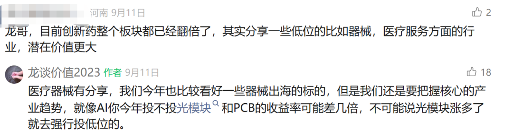
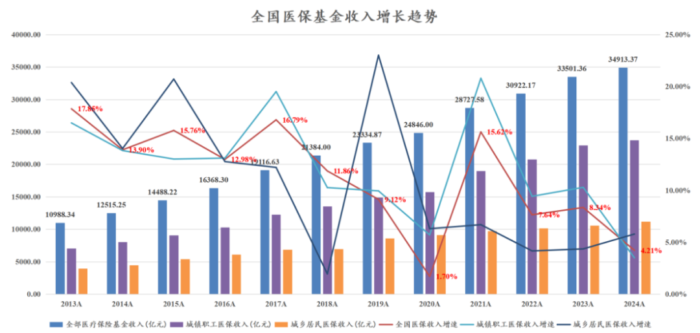
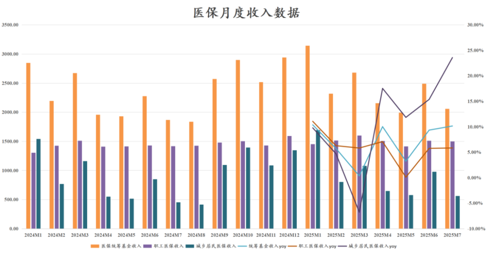
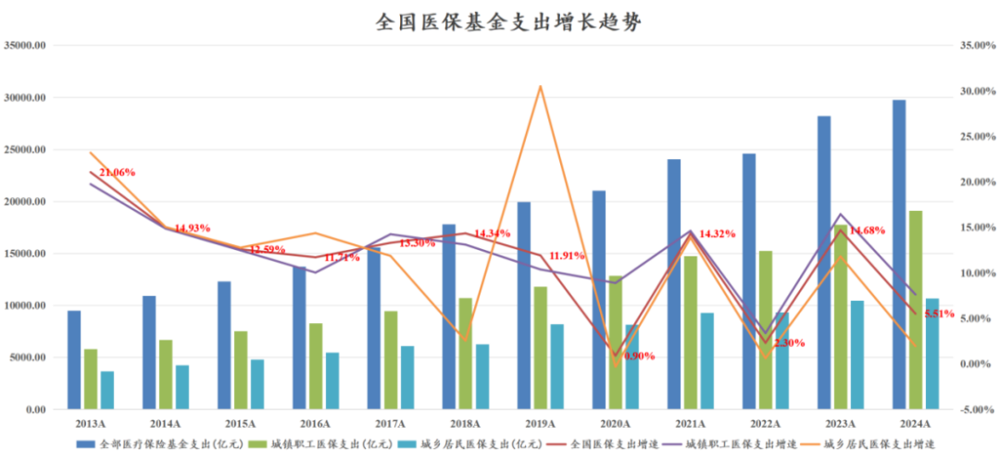
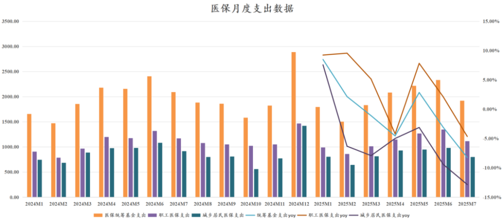
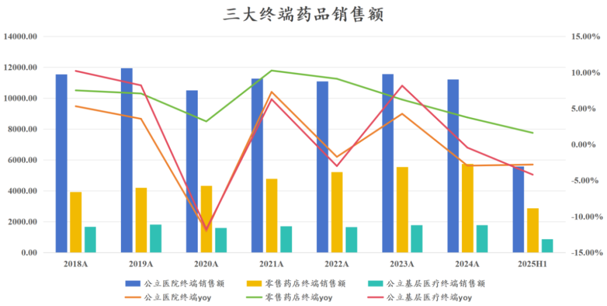
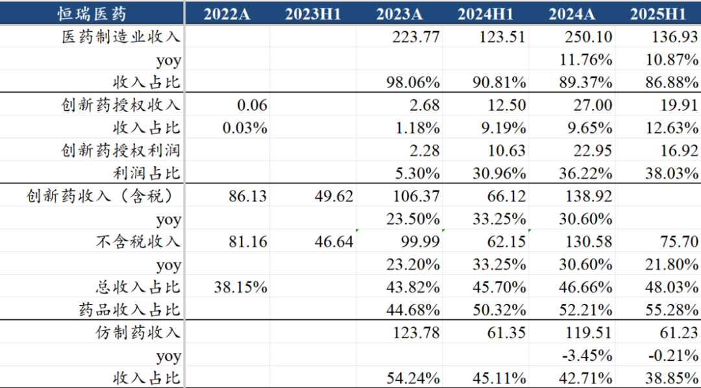

# 医药总量逻辑不容乐观

大家好，我是龙哥。

大家知道从2023年以来，我们主要的精力和大部分的文章都在聊创新药，今年创新药行业终于爆发之后，经常会有读者留言说“创新药已经涨多了，可以多讲讲医疗器械和医疗服务这些没涨的板块”。

实际上我们讲哪些方向，首先还是基于逻辑而不是涨多少跌多少，那这篇文章，我们展示一下医药行业总量的数据，来告诉大家为什么创新药以外的子领域还是很难形成非常强的大β。

提示：本文与周一的文章（[创新药宏大叙事，行业估值处于什么水平？](https://mp.weixin.qq.com/s?__biz=MzkyMzQ3MDc3Mw==&mid=2247484956&idx=1&sn=015c13dab5e66b4a6ca8d66ff8791921&scene=21#wechat_redirect)）配合食用效果更佳。

1、医保收支的压力

国家医保压力大，这个是大家早都知道的事情，包括前两年的熊市大家也都是讲这个逻辑，但医保压力到底有多大，我们还是从数据来看：

从收入端来看，2024年的医保收入同比增长只有4.21%，这个增速是除了2020年以外历史最低水平，2020年增速低的原因大家也都知道，因为当时免除了不少社保医保的缴纳。

从月度数据来看（2024年初开始，国家医保局不再披露单月的医保总收支数据，只披露单月的统筹医保收支数据），今年1-7月统筹医保的收入同比增长6.93%，总体增速算是有小幅回升，2024年全年统筹医保的增速是5.06%。其中1-7月城乡居民医保的收入增速同比增长8.62%，城镇职工医保的收入同比增长5.93%。7月单月改善的更明显，总体医保统筹基金的收入同比增长10.15%，其中城乡居民医保的7月单月收入同比增长23.58%。

支出端，近几年由于疫情的原因，一直呈现比较大幅度的震荡，近5年的复合增速大概是8.3%，而再往前5年的复合增速是12.8%。

月度数据来看今年以来的支出端的压力更大，与收入端出现了非常明显的背离，医保的支出部分才是真正与终端医保支付直接挂钩的，支出端出现下滑将意味着支付端的巨大压力。

具体来看，今年来职工医保的支出总体还算稳定，上半年支出同比增长2.97%，虽然表现比较弱，但也还在增长；而居民医保部分，从2025年2月到7月是连续6个月出现同比下滑，6-7月甚至下滑幅度还有所扩大，分别达到-9.41%和-12.84%。

在这样的医保支出的大环境之下，可以说政策面已经是用尽全力去支持创新药产业和一部分的创新器械，有些投资人还期望医药行业出现类似上一轮医药牛市那种全行业鸡犬升天的大行情，这个难度是非常大的，尤其是有一些赛道实际上还处于“出海无门、国内政策下行期”，更难言估值大幅修复。

2、药品行业总量增长乏力

制药行业在最近1年的时间里，除了中药板块以外，化药和生物药几乎已经是经历了一轮鸡犬升天的行情，但国内药品行业的总量逻辑也是不乐观，出海毕竟只是少数公司能取得突破。

根据米内网的数据，中国三大终端（公立医院、零售药店、公立基层医疗）的药品销售额在2019年就已经达到1.80万亿元，而直到2024年这个规模也只有1.87万亿元，相当于5年的复合增速只有0.84%，并且2025年上半年三大终端的药品销售规模9310亿还同比下降了1.6%。

具体来看，这里面最惨的是公立医院终端，2019年公立医院终端的药品销售规模就达到1.20万亿元，当时占三大终端销售额的66.56%，但是到2024年规模仅有1.12万亿元，相当于5年间还下滑了7%，占三大终端的比重下降到59.9%，2025年上半年又进一步下滑2.8%。

这其中，城市公立医院销售额在5年间下滑了2.4%，25年上半年又同比下滑1.6%；县级公立医院药品销售额在5年间下滑了16.3%，25年上半年又同比下滑6.7%。

零售药店终端的表现还相对尚可，主要是受益于处方外流，在整个药品终端销售总量逻辑较差的背景下还能有增长，零售药店终端销售额自2018年的3919亿增长到2024年的5740亿，复合增速约为6.6%，2025年上半年销售2867亿元同比增长1.60%。

其中，线下实体药店的药品销售额自2018年的3820亿元增长至2024年的4981亿元，复合增速约为4.5%，而网上药店的药品销售额自2018年的99亿元增长至2024年的759亿元，复合增速约为40.4%。不过这个增速在2024-2025年也有明显放缓，2024年线上药店收入同比增长14.48%，2025年上半年同比增长16.80%，即便是收入增速放缓，在整个药品行业各个细分市场来说也是唯一的α。

公立基层医疗终端总体表现类似公立医院终端，其中城市社区卫生服务中心的表现尚可，而乡镇卫生院的药品销售额，自2018年的1112亿元下降至2024年的877亿元，5年下降21%，2025年上半年又进一步加速下滑7.6%。

以上药品销售数据，与第一部分讨论的医保数据也有呼应，城镇职工医保和城市公立医院、城市卫生服务中心总体表现要显著好于城乡居民医保、县级公立医院和乡镇卫生院，我们也可以理解为，这些后线城市和乡镇卫生院的药品销售，实际上是受到药品集采冲击最大、缺少增量的市场，而城市公立医院市场还有一部分国内或进口的创新药作为增量。

以上药品行业的表现，也是为什么在过去几年我们对于医药流通、连锁药店等较为依赖总量增长逻辑的细分领域相对保守，即便有行业集中度提升的逻辑，但整个行业总量基本没有增长的阶段，意味着行业需要经历较为残酷的出清的过程，药店行业目前就在经历这个过程。

同样的，对于传统制药企业，哪怕是转型创新药，也会客观存在总量的压制，例如恒瑞医药、翰森制药、中国生物制药等头部的pharma，哪怕创新药有较快的增长，整体制药收入的增速也基本只有10%出头，传统仿制药部门的压力需要较长的周期去消化。

......

看完以上内容，再来读下面这两篇文章，或许会有更深刻的理解。

[创新药宏大叙事，行业估值处于什么水平？](https://mp.weixin.qq.com/s?__biz=MzkyMzQ3MDc3Mw==&mid=2247484956&idx=1&sn=015c13dab5e66b4a6ca8d66ff8791921&scene=21#wechat_redirect)

[2025创新药商业化全梳理](https://mp.weixin.qq.com/s?__biz=MzkyMzQ3MDc3Mw==&mid=2247484922&idx=1&sn=80646a977271d93db81cafc4cc4400de&scene=21#wechat_redirect)

风险提示：本文仅讨论行业/公司经营情况，投资需综合考虑公司经营、估值、管理层等多方面因素，建议读者审慎参考，本文不作为投资依据，不建议大家根据本文做出投资计划。

<!-- wxmp-comments-begin -->

---

## 留言（18 条，含回复共 38 条）

- **求索者** 👍8 · 2025-09-18 10:48
  公立医院终端支付额不增长主要是集采和医保局对医院的管控趋严造成的，如果单把创新药挑出来，这几年销售额应该是高速增长的，只不过创新药品种依然太少，单纯做创新药的pharma更是稀缺，biotech基本又没形成商业化销售。
  - ↳ **作者** · 2025-09-18 10:51
    9月5号的文章《2025创新药商业化全梳理》，介绍了国内创新药商业化的情况，大家可以再去读一下，感受一下创新药商业化销售在药品行业的α。
- **王熙** 👍6 · 2025-09-18 10:41
  无论是消费、医药、科技，在选公司时优选买能大幅度出海的，准没错。
- **横渡牛熊** 👍5 · 2025-09-18 10:38
  确实，老牌药企新旧药一升一落，赔赔赚赚。反而是血统纯一些的港股创新药相对增速高看一眼
- **戴着🐸 头套的🐶** 👍3 · 2025-09-18 10:45
  龙哥的文章好的地方在于散户平民都能看懂。点赞。
  - ↳ **作者** · 2025-09-18 10:48
    也有很多说看不懂的，可能慢慢就取关了。
    每个作者有不同的风格，读者在筛选公众号文章，文章也在筛选读者吧，互相选择。
  - ↳ **作者** · 2025-09-18 11:13
    有无可能是大部分人其实是看不懂的。看明白文章写什么，和看懂文章所陈述的问题是两回事。
- **哈巴达依达拉** 👍2 · 2025-09-18 10:38
  还是得看有bd预期的
  - ↳ **作者** · 2025-09-18 10:46
    从2-3年前我们就一直强调一句话，有全球竞争力的药物一定会出海，也只有能出海的药物才能验证真实的竞争力，因此药企不管把自己的药吹的多天花乱坠，一众海外投资人和MNC都不要的话，只能说明药不行。
    有BD预期的也要仔细分辨，大部分所谓的BD预期最终也兑现不了，还有的公司纯粹为了炒股票。
- **Eminem** 👍2 · 2025-09-18 10:45
  想到了龙哥你之前的文章，这个时候感觉乐普蹉跎的这几年有了一些价值，从双重集采中爬出，还有了结构心、眼科和减肥。至少有很多故事可以讲，人不就是活在未来，忍在当下吗？和文章中的企业相比稍好一些。谢谢龙哥的文章，尤其是对于我这样的纯外行。
  - ↳ **作者** · 2025-09-18 10:49
    乐普医疗接下来的看点，一方面是他结构心的子公司心泰医疗表现确实不错，也是一批新品种兑现的阶段；另一方面的看点是医美，童颜针获批，明年底可能会有一款医美的重磅蓝海产品三文鱼针；第三方面就是创新药这块，公司在减肥药三靶点药物的布局还算领先，未来三靶点的竞争应该有其一席之地。
  - ↳ **作者** · 2025-09-18 11:02
    医美还是算了吧，大环境不允许[捂脸][捂脸]
- **星移无痕** 👍2 · 2025-09-18 11:01
  医保支出主要不就是集采影响嘛，这个因素后边边际影响基本不存在了，后续总量还是会恢复增长的，毕竟老龄化肉眼可见了
  - ↳ **作者** · 2025-09-18 11:03
    并不是。医保支出长期来看核心取决于医保收入，而医保收入在人口老龄化中是严重受损的，这就意味着医保支出总金额的增长有压力，但对医疗服务和药械的需求量都会快速增长，价格就会持续受到较大压力，这种价格压力是客观事实，不是主观的想让政策怎么调整就能改变的。
  - ↳ **作者** · 2025-09-18 11:27
    也确实是，医疗需求量快速增长与医保收入增长的不匹配[抱拳]
- **醉品烟酒茶15503640189** 👍1 · 2025-09-18 10:51
  老师，消费医疗还有机会吗
  - ↳ **作者** · 2025-09-18 10:53
    消费医疗我自己认为肯定会有机会，虽然消费医疗的修复有可能会滞后于其他消费品种，但只要经济总量还能持续以较快的速度增长，必然会带来消费的提升，只是经济发展周期和传导时间的问题。
- **James詹** 👍1 · 2025-09-18 11:19
  锦欣是不是就只剩下等生育政策刺激这一个逻辑了？虽然即便出了政策基本面也难有起色
  - ↳ **作者** · 2025-09-18 11:21
    锦欣现在除了行业β的问题以外，更大的问题是公司运营和治理能力，这几年在国内外的资本运作都是一言难尽。
- **陈梓zi敏** 👍1 · 2025-09-18 11:46
  你这个说的很有道理。无奈仿制药赛道看不太懂。
  早两年看到港股创新药的财务，觉得这就是个仙股。
  没想到啊。当时要是学习了解一下这个赛道，早就发家致富了。
  - ↳ **作者** · 2025-09-18 11:51
    要是那个阶段大家都能来积极学习，反而就不会跌到那么极端了[破涕为笑]
- **远航** 👍1 · 2025-09-18 12:17
  创新药出海为主，国内医保影响没那么大，看看百济神州干脆都不在国内销售
  - ↳ **作者** · 2025-09-18 12:18
    不在国内销售的也就只有百济和传奇而已
  - ↳ **作者** · 2025-09-18 12:37
    不会，绝大部分公司应该会国内外都做，中国药品市场规模3000亿美金，是全球第二大药品市场，哪怕百济都在国内有大几十亿的产品收入，没几家公司会完全放弃国内。
- **何勇** · 2025-09-18 10:49
  增量靠出海？
  - ↳ **作者** · 2025-09-18 10:52
    这个问题似乎应该是2年前问的问题哦
- **王建** · 2025-09-18 10:53
  创新药已进入回调和震荡区间，后面需要更多的BD或业绩来验证基本面了。龙哥现在创新药仓位还大吗？
  - ↳ **作者** · 2025-09-18 11:01
    今年以来，港股创新药板块涨了110%，A股创新药板块涨了接近60%，调整和震荡都是正常的，要是继续爆拉那才是让人害怕，这个阶段就是选股难度大了很多，要更精细的选股。
- **HY** · 2025-09-18 10:58
  龙哥，CXO行业未来预期怎么样，整体板块还有机会吗
  - ↳ **作者** · 2025-09-18 10:59
    8月26日文章，CDMO行业中报梳理，去翻看一下哈
- **丁山** · 2025-09-18 11:10
  龙哥，龙谈医药科技现在还适合定投吗？毕竟创新药估值不便宜了，虽然谈不上泡沫。
  - ↳ **作者** · 2025-09-18 11:11
    还好吧，这个组合的初衷不就是把握创新药和AI科技两大主线，你看今年的行情，医药涨的时候港股科技互联网可能休息一下，然后医药休息的时候港股科技互联网又来一波。
- **景** · 2025-09-18 11:20
  龙哥，像先声药业这种创新药销量比重逐步增加的，适合持有吗
  - ↳ **作者** · 2025-09-18 11:23
    先声在pharma里算是不太出众也还可以的，比较早转型创新，虽然方向选择上我感觉走了些弯路，但总体转型创新的战略是对的，在pharma里也不算贵。
- **专坑队友123** · 2025-09-18 11:50
  那些cxo会不会被市场默认成消费股的估值[捂脸]而不是创新药估值
  - ↳ **作者** · 2025-09-18 11:51
    这个东西核心是看产业逻辑和增长，消费股估值还是什么估值都不重要。
- **人间白加黑** · 2025-09-18 13:28
  迈瑞医疗港股即将上市，如果投资者认港股迈瑞，应该可以带一下A股。
  - ↳ **作者** · 2025-09-18 13:29
    嗯，有可能，迈瑞本身在国际市场的认可度也还可以。

<!-- wxmp-comments-end -->
