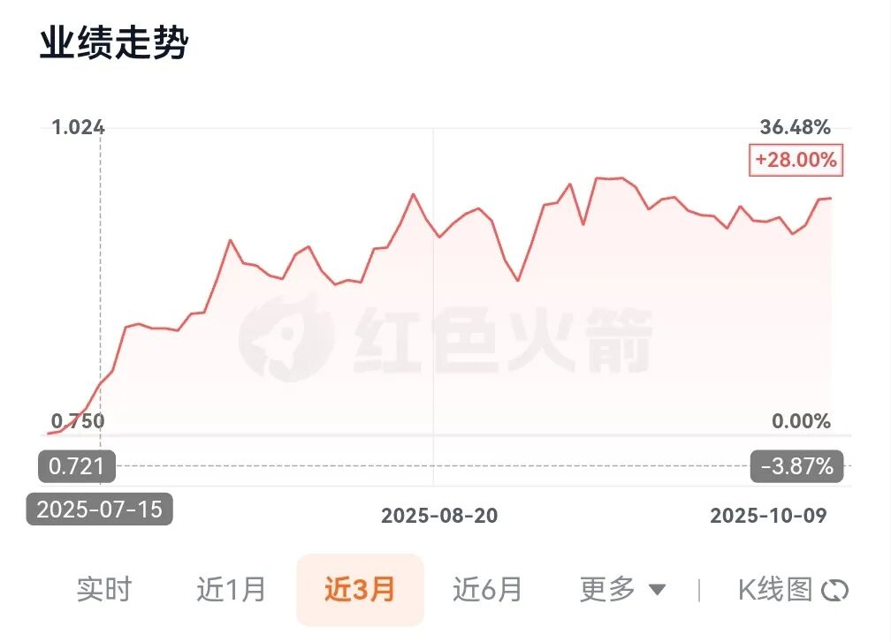
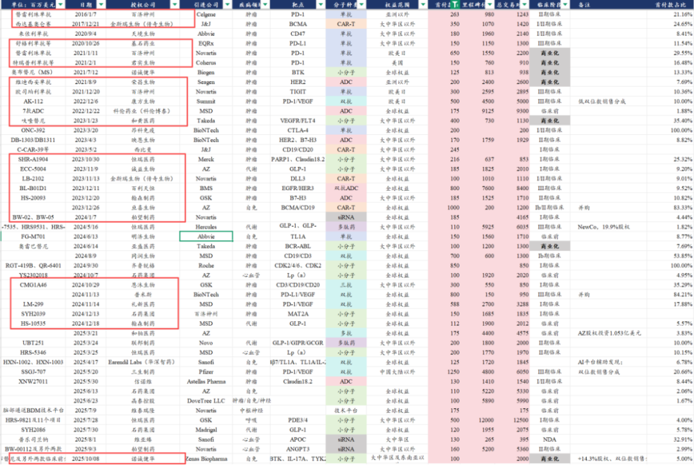
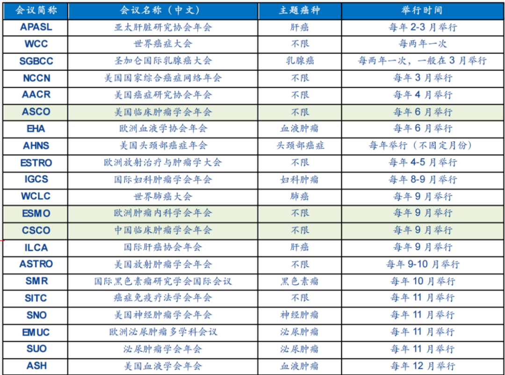

# 创新药可能进入催化密集落地期

大家好，我是龙哥。

自2025年7月底恒瑞医药的PDE3/4及其他10个分子达成5亿美元首付款+120亿美元里程碑付款、石药集团的GLP-1达成1.2亿美元首付款+19.55亿美元里程碑付款的海外BD后，2025年8-9月份没有医药上市公司再达成首付款超过1亿美元的规模较大的BD。在此期间落地的两个大的BD，分别是维亚臻和舶望制药这两家非上市公司进行的siRNA药物的海外BD。

因此8-9月份对于国内创新药海外BD来说、尤其是对创新药上市公司来说还是属于一个相对的空窗期，期间创新药板块也曾出现了一定幅度回调，且AH医药指数在此期间总体是以震荡为主，例如我们一直讲的159892恒生医药ETF自7月底石药的GLP-1小分子BD落地后至今累计涨幅在3.6%左右，期间也曾有一些震荡。

此前我们也曾梳理过哪些项目后续还有可能落地BD《[创新药后续还有哪些潜在重磅BD](https://mp.weixin.qq.com/s?__biz=MzkyMzQ3MDc3Mw==&mid=2247484658&idx=1&sn=d7c51ba3a690495b19c9fec122a04e1b&scene=21#wechat_redirect)》，这其中有两个BD已经落地，分别是荣昌生物的泰它西普和诺诚健华的奥布替尼，这两个已经在国内商业化的品种进行海外BD时，首付款都要低于大家的预期，但也都叠加了一部分的股权，股权的规模不算小，荣昌的BD落地大跌后至今股价已经再度翻倍，昨晚诺诚健华公布的BD合作里，共可获得Zenas的700万股股权，按其昨晚的价格相当于1.8亿美元的股权价值，Zenas本身也临近原有在研管线的注册和商业化，本身就处于价值兑现阶段，其股权价值也是可以另眼相看的。

除了这俩以外，大部分预期可能在这两年落地的BD都还没有动静，落地的两个项目的首付款也都低于部分投资人的预期，叠加AI那边利好不断，更加让有些蹲短期催化剂的投资人没什么耐心，这是行业客观面临的问题，问题出现的直接原因是股价涨多了以后市场更加关注边际变化而不是产品和企业本身，BD是反映企业和品种价值的一部分，现在却有点被扭曲。

就BD交易而言，我们复盘历年的创新药海外BD情况，每年的11月-次年1月，也即每年年底前后，是系列重磅BD密集落地的时间，历史上的大额BD大部分都是在这个时间段落地。之前也有部分观点认为年底可能会有部分BD密集落地，这里我们从具体数据的角度给大家展示一下为什么会有这个结论。

首先我们梳理了历史上中国医药海外BD授权的231个项目中有47个创新药海外BD的首付款超过1亿美元：

为什么要选择首付款超过1亿美元以上的项目来看呢，因为首付款超过1亿美元的项目更有可能对上市公司、乃至行业层面的预期带来较大的影响，从上图可见，除了科伦博泰的TROP2-ADC以外，基本也包含了国内创新药海外BD最核心的项目。

当然，首付款较少的项目不一定不是好项目，例如newco的方式首付款普遍不多，或者太早期的项目也注定首付款不多，但随着项目的推进，其项目价值可能会逐渐扩大，最典型的就是科伦博泰的TROP2-ADC，随着海外大III期的逐个启动，市场对其认知和预期持续提升。因此，以上选择，核心还是我们简化分析的方式，不能就此对BD的价值按照首付款去一概而论。

如果我们从落地时间的角度来看，可以看到：在1月落地的有5个，在2月的有0个，在3月的有4个，在4月的有2个，在5月的有4个，在6月的有3个，在7月的有4个，在8月的有3个，在9月的有3个，在10月的有5个，在11月的有4个，在12月的有8个，10月到次年1月合计有22个，占总体的47%。

这其中2025年目前目前只进展到9月，如果我们剔除2025年的BD项目后，当年10月到次年1月这四个月的重磅BD项目占比可以达到64%，也就是说全年三分之一的时间达成了全年约三分之二的重磅BD合作。2025年以前的康方生物、科伦博泰、百利天恒、普米斯、传奇生物等一系列对行业有重大影响的BD基本都是在12月达成。

如果要去解释这个现象，我们认为其主要原因是，一般重磅的BD谈判至少需要6个月的时间，国内希望BD的企业如果从春节后复工制订全年计划后开始与MNC接触，历经一系列的谈判和尽调后，到签订TS协议，再到最终公布，这个周期可能就要长达大几个月，到大家看到的落地时间，可能就是在四季度前后乃至是赶到春节前的时间，创新药企业也会倾向于尽量在年内实现BD谈判落地。

当然，BD本身并不是唯一的逻辑，内在投资逻辑还是药物本身有全球竞争力，之所以能呈现出多个重磅BD的密集落地时间，核心还是因为国产创新药总体的全球竞争力在持续验证，这个不会因为最近BD多一点就认为国产创新药已经统治全球市场，也不会因为最近BD少一点就认为国产创新药出海完蛋了，产业发展到什么阶段、在全球处在一个什么样的地位，都要有一个基本的判断。

BD本身是充满了不确定性的，并且直到最终落地以前都会存在较多的不确定性。因此今年一些公司搞的预告式BD确实是让大家比较反感，尤其是个别公司历史上的业绩指引几乎是永远在miss，到今年又创造出预告式BD的模式，结果预告式BD也持续miss。

即便是落地的BD，如上文提到的荣昌生物和诺诚健华的BD落地，也都因为首付款的规模低于预期而导致股价在BD落地后反而出现暴跌，背后的本质也是今年创新药涨幅巨大的情况下，部分公司的BD预期在估值和股价中反映的已经比较多，反而使得BD临近落地或者真正落地的时候充满短期博弈，这是我们不想看到的情况，但既然大家在这个市场上，就必须要遵守这个市场的游戏规则。

......

进入10月后，创新药行业将再迎来一系列的密集催化落地时间，具体包括：

①四季度有两个重要的肿瘤领域学术大会，10月中旬的2025年欧洲肿瘤学年会（ESMO）和12月将进行美国血液学年会（ASH），每年肿瘤领域几个重要的学术会议，如ASCO、ESMO、WCLC、AACR、ASH，创新药公司会把一系列重磅研究成果在这些重要的学术会议上进行发布，以求扩大研究者、公司及药物的全球知名度。

②11月预计将进行2025年国家医保谈判，相较以往将新增商保丙类目录。大家对商保目录的期待已经有接近1年之久，期间也算是历经波折，我们认为最终商保目录的落地也未必会如部分投资者预期的那样乐观，但从产业发展的角度来说商保目录的推出还是一个非常重要的边际增量，尤其是对于创新度越高、定价越高的创新药品种其意义越是重大。

③10月-次年1月进入BD密集落地阶段，如上文所述。

标的选择上，老生常谈的还是159892恒生医药ETF，涵盖了大部分的港股创新药和CXO的优质标的，ETF在较长一段时间里都会是大部分投资人配置创新药行业的优选，原因是创新药本身是高波动的资产，且研究门槛非常高，只是过去半年的单边上涨让一些投资人忽视了这个因素。

至于其他个股方面，还是参照我们的历史文章：

[哪些医药公司在持续回购和增持？](https://mp.weixin.qq.com/s?__biz=MzkyMzQ3MDc3Mw==&mid=2247484987&idx=1&sn=7c31c0e50e2ddc23ced5d00b30929bb4&scene=21#wechat_redirect)

[创新药宏大叙事，行业估值处于什么水平？](https://mp.weixin.qq.com/s?__biz=MzkyMzQ3MDc3Mw==&mid=2247484956&idx=1&sn=015c13dab5e66b4a6ca8d66ff8791921&scene=21#wechat_redirect)

[2025创新药商业化全梳理](https://mp.weixin.qq.com/s?__biz=MzkyMzQ3MDc3Mw==&mid=2247484922&idx=1&sn=80646a977271d93db81cafc4cc4400de&scene=21#wechat_redirect)

[CXO行业全面加速](https://mp.weixin.qq.com/s?__biz=MzkyMzQ3MDc3Mw==&mid=2247484869&idx=1&sn=c2cff57e618e3686776c4799e7ab6003&scene=21#wechat_redirect)

[哪些全球顶级创新药在25年大超预期？](https://mp.weixin.qq.com/s?__biz=MzkyMzQ3MDc3Mw==&mid=2247484844&idx=1&sn=82de722328a5675ecf9ac735e60fd5e4&scene=21#wechat_redirect)

[自免再现200亿美金超级大药](https://mp.weixin.qq.com/s?__biz=MzkyMzQ3MDc3Mw==&mid=2247484792&idx=1&sn=8fb59368167f4ed7e950607826df81e7&scene=21#wechat_redirect)

[创新药浪潮下，传统药企的新时代](https://mp.weixin.qq.com/s?__biz=MzkyMzQ3MDc3Mw==&mid=2247484757&idx=1&sn=665201d4cd54a2d564c5a17b0a18bfbc&scene=21#wechat_redirect)

[创新药后续还有哪些潜在重磅BD](https://mp.weixin.qq.com/s?__biz=MzkyMzQ3MDc3Mw==&mid=2247484658&idx=1&sn=d7c51ba3a690495b19c9fec122a04e1b&scene=21#wechat_redirect)

风险提示：本文仅讨论行业/公司经营情况，投资需综合考虑公司经营、估值、管理层等多方面因素，建议读者审慎参考，本文不作为投资依据，不建议大家根据本文做出投资计划。

<!-- wxmp-comments-begin -->

---

## 留言（16 条，含回复共 33 条）

- **胖胖咪咪** 👍11 · 2025-10-09 13:35
  那今天的暴跌是什么逻辑[天啊]
  - ↳ **作者** · 2025-10-09 13:39
    解释市场很容易，预测市场才是难题。今天跌很容易解释啊，文章里也写到了，只是你没仔细看，例如国庆节期间AI板块的利好太多了，TMT和有色疯狂抽血，再例如诺诚的BD首付款低于预期，这个表现在6月荣昌的BD落地的时候也出现过，再例如国庆节期间港股医药提前涨了，今天只是跌回来。不管涨还是跌都容易找到解释，但大部分时候这个解释没太大意义。
- **王熙** 👍4 · 2025-10-09 13:39
  龙大梳理的很清楚[强][强]
  - ↳ **作者** · 2025-10-09 13:54
    用数据说话好过空谈叙事对吧[加油]
- **王建** 👍4 · 2025-10-09 13:50
  感觉最景气确定性最高的还是药名生物药名合脸啊，创新药个股的话还是凭运气
  - ↳ **作者** · 2025-10-09 13:52
    讲确定性是这样，但这也是后视镜来看，3月我们讲CDMO的ADC和多肽药这两大景气度赛道和药明系的绝对龙头地位的时候，大家都在说不如创新药，只是复盘来说涨幅后来差不多了。
- **林** 👍3 · 2025-10-09 13:39
  龙哥好，目前阶段生命科学上游，比如纳微投资性价比如何
  - ↳ **作者** · 2025-10-09 13:45
    生命科学上游比较有代表性的就是两个赛道嘛，就是培养基和填料， 这俩是在生物药生产中，成本占比比较高的两个领域，代表性的公司像奥浦迈、纳微、赛分这些。生命科学上游的长期逻辑是跟随国产创新药出海，但短期他的弹性不会那么大，在国内创新药修复周期里这些公司属于相对偏后段的，他们的周期性相对没那么强，更多是跟随国内国产创新药的商业化放量而放量。
- **肥锋  家诚哥** 👍3 · 2025-10-09 13:53
  创新药这块门槛确实不是一般的高，对于非专业人士能抱抱CXO一哥，希望他继续开启下一个周期就不错了
  - ↳ **作者** · 2025-10-09 13:56
    对的，不要老看着有些biotech动不动涨十倍，在一轮大行情里能抓住行业主要赛道、能达到赛道平均收益、能把收益带走，就非常不错了。
- **Hu.JF** 👍3 · 2025-10-09 13:57
  今天晶泰控股、诺诚健华都吃了十个点的跌幅，有点扛不住[捂脸]
  - ↳ **作者** · 2025-10-09 14:03
    晶泰其实就是跌回国庆节前的位置，诺诚是确实反应有点过度了，和之前荣昌BD落地的时候一模一样....
- **杰Orz** 👍3 · 2025-10-09 14:35
  龙大，怎么看乐普最近与美团、腾讯签定的合作，后期发展的潜力大吗？
  - ↳ **作者** · 2025-10-09 14:43
    你说的是腾讯入股民为生物的那个投资吗，民为生物的三靶点还是国内进度比较领先的，对乐普来说有一定看点。
  - ↳ **作者** · 2025-10-09 16:31
    医美这块现在市场也给了一定的预期，之前批了一个竞争已经很激烈的童颜针，明年应该会有一款竞争格局比较好的三文鱼针获批，和美团合作可能会有一定帮助吧，但还是得看公司自身的销售推广能力。
- **叶恒辉** 👍2 · 2025-10-09 14:14
  龙哥对CarT进丙类药目录预期如何？以后商保报销会不会解放消费力限制？
  - ↳ **作者** · 2025-10-09 14:18
    我不太确定CART会不会进，一方面现在本身有些保险项目是纳入CART的，另一方面要纳入目录让众多商保保险一百多万的项目我感觉也有难度。但对于其他的价格没那么离谱的高价创新药肯定是好事。
- **船长开车不开船** 👍2 · 2025-10-09 14:26
  龙哥，请教一下您现在京东健康等医疗服务没动静，后续这个行业怎么看呢？
  - ↳ **作者** · 2025-10-09 14:27
    互联网医疗我是看好的，只是京东健康这种巨无霸今年能涨130%确实有点超涨了吧，2000亿港元的京东健康今年不好拍空间了。
- **马向东** 👍2 · 2025-10-09 14:47
  绿叶自己说年内肯定有BD，龙哥能否聊聊？
  - ↳ **作者** · 2025-10-09 14:48
    🍃承诺的降债、销售放量、BD，我已经数不清miss了多少次，可以等他们落地了再看吧
- **十里春风不入秋** 👍1 · 2025-10-09 13:42
  龙哥您好，那请问从当前估值来看，是继续布局创新药更好，还是布局CXO更好。
  - ↳ **作者** · 2025-10-09 13:53
    为什么非得二选一[旺柴]
- **求索者** 👍1 · 2025-10-09 14:19
  龙哥为诺诚健华操碎了心[捂脸]，幸亏有个荣昌的bd兜底下限。
  - ↳ **作者** · 2025-10-09 14:22
    哈哈还好啦，创新药就没有一个不操心的，都会偶尔整幺蛾子[偷笑][偷笑]
- **马华磊** 👍1 · 2025-10-09 17:36
  今天合联被暴击，康德减持意味着什么？肯定不是看衰的原因吧
  - ↳ **作者** · 2025-10-09 17:42
    康德今年这是第三次减持了
- **蔡乔宇** · 2025-10-09 13:55
  晶泰11月会有bd吗？
  - ↳ **作者** · 2025-10-09 13:59
    没了解到消息，晶泰现在是AI应用在创新药领域的标杆公司，短期波动也未必和BD有强关联性。
- **红旗飘飘** · 2025-10-09 14:24
  龙哥好，百济神州在美国诉讼胜了为什么国内股价还跌了
  - ↳ **作者** · 2025-10-09 14:26
    他那个诉讼是在4月胜诉的，只是这次艾伯维是不再上诉了。
    至于股价，今天恒生医疗指数被干了接近5个点......
- **WM** · 2025-10-09 16:22
  龙哥，CXO有没有适合投资的ETF啊？
  - ↳ **作者** · 2025-10-09 16:31
    CXO没有单独的ETF啊，有的话我早就会讲了

<!-- wxmp-comments-end -->
