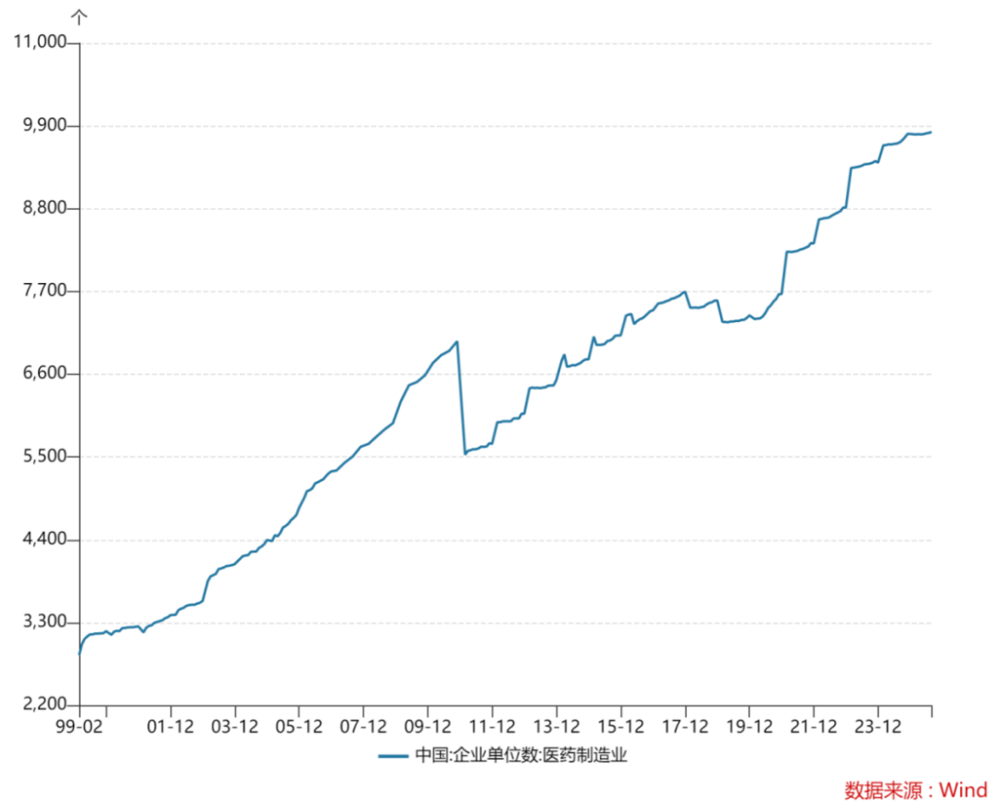

# 聊几个创新药行业大家最关心的问题

大家好，我是龙哥。

这篇文章趁着行业大幅回调、市场出现一些分歧和讨论之际，来给大家聊聊最近可能会比较关心的问题，大部分问题的核心原因实际上就一个——涨多了，但还是市场的归市场，我们讨论基本面和逻辑的归基本面和逻辑，尊重市场的波动和运行规律，也要强调核心逻辑和基本面变化。

1、8-9月没有出现大的BD，诺诚健华BD低于预期，未来不会有大的BD了？

上篇文章讲到，每年重磅BD都集中在10月到次年1月这4个月（[创新药可能进入催化密集落地期](https://mp.weixin.qq.com/s?__biz=MzkyMzQ3MDc3Mw==&mid=2247485001&idx=1&sn=106ad8605a49f137ddd912f147903744&scene=21#wechat_redirect)），25年在年中前后出现多个重磅BD是历年未有的情况，市场此前对重磅BD做线性外推本身有问题，年底前后可能会有系列BD落地，但能否出现超大规模的BD尚未可知，重磅BD本身存在偶然性。

诺诚健华的BD并没有那么差，Zenas本身进入产品申报注册阶段，股价走势较强且已经突破历史新高，股权价值不差于固定首付款，市场踩踏反应过度，周五诺诚健华开始回购，当日回购1000万元。

市场对BD的认知开始回归，真正对行业有巨大影响力的超大BD本身就较为少见，历史上交易总价超过50亿美元的BD合计不到30项，其中单个品种能达到50亿美元以上的项目只有10多个，注意这是过去20多年的创新药BD历史合计的水平，随着通胀和药品价格上涨，这个总包的规模可能会逐渐提升，但这种超大规模的BD仍会是少数。

2、首付款和总包大的BD才是好BD？ 

市场的某些认知开始从一个极端走向另一个极端，从之前看总包的规模（甚至有段时间按总包的总金额直接加到估值里），到被某些公司骗了几次之后开始过度强调首付款，首付款固然是至关重要，实际上BD本身还是要单个项目具体去看，对于成功率和市场潜力不同的项目本身会有差异较大的交易结构，例如昨晚百利天恒公告，由于BMS启动EGFR/HER3双抗ADC的全球II/III期注册临床，百利天恒即将收到2.5亿美元的里程碑付款。

如果BD出去的项目不能成功，仅靠BD首付款能带来的估值提升就只有一次性的现金价值，因此核心逻辑还是要看项目能否取得最终的成功、有多大概率取得成功，以及成功之后潜在的里程碑付款、销售分成，首付款是从最前端确定性的角度去部分反映项目价值和成功率，但绝不是这个项目的全部。

3、MNC在海外连续几个并购，其BD目标回归海外了？

最近辉瑞、诺和诺德等MNC陆续在海外进行了几笔数十亿美金级别的并购，有些朋友问到这个问题。

实际上这也是一个具有认知偏差的问题，其背景在于，中国创新药还远没达到能完全替代欧美biotech的水平，其本质上是类似CXO产业链的延伸，中国创新药行业的能力的确在近年有显著提升，从过去的几乎没有全球竞争力，到这几年可以预期未来抢占部分全球创新药的市场份额。

此前我们讲到，在25年初我们“天马行空的乐观预期”，当时讲的创新药行业【宏大叙事】，也只敢给20%-25%的全球份额，随着股价上涨，此前我们测算的乐观预期也只给到30%的全球份额。但有些投资人甚至按照70%的份额去拍，属于过于乐观的预期。因此，MNC的BD从来没有完全转移到国内，又何谈回到海外，MNC在欧美继续大额BD和并购不会是偶然性事件，还会常态化的发生，就如在国内做BD也会是常态化的事情。

4、再有大的BD落地能拉动行业大涨？ 

行业经历鸡犬升天的表现后，A股炒作的创新药标的回调幅度显著更大（部分公司已经快速腰斩或接近腰斩），行业降温明显，而即便今年港股创新药指数的涨幅显著大于A股，但H股基本面较好的biopharma则回调幅度相对温和，也反映行业在短线热钱流出后更加趋于基本面。

但在当前时点，似乎所有医药投资人都在等待下一个大的BD，这种一致预期下，再现大的BD是否真的能拉动行业性的暴涨？

情绪降温后市场也会意识到BD本身是个例事件，不是所有公司的管线都能进行海外BD，目前涉及到创新药研发的AH上市公司超过200家，医药制造业企业数量直逼1万家，一二级市场的创新药biotech超过千家，而每年能落地的创新药BD也不过是大几十个，25年BD较为火热的环境下预期总量也不会超过100个，其中还有恒瑞这种一年做好多个的pharma。

因此，对于大部分的二级市场投资人来说，在投资思路上，成功率较高的方式还是沿着技术路线的思路进行布局，应选择全球大的疾病领域正在逐渐被验证的技术路线上布局较为领先的公司，投资的是从1→10阶段具有全球竞争力的管线，核心方向如自免双抗、双抗ADC、siRNA、IO双抗等等，这是中国公司最擅长的研发模式。

5、创新药行业一涨起来都是配股、减持，上市公司老骗人？

创新药行业历史上就是骗子公司较多，即便不是纯骗，就公开信息来说也是套路很多，今年的创新药BD出现的“预告式BD”、BD不出去就自己组局做BD、多次宣布与海外药企洽谈等相关的公司，普遍是持续miss。

即便公司管线相对靠谱，其创始人在股价大涨后也普遍性的会出现大规模减持。创始人在MNC的工作经历一般来说顶多拿百万美元级别的薪酬，很多biotech到去年底还在面临生死存亡问题，到今年公司老板突然面对数以亿乃至十亿的股票估值摆在眼前，很难抑制减持的想法，大部分科学家创始人面对数十亿的金钱也没那么大的格局，虽然可能让投资人不舒服，但实属人之常情。

即便如此，在龙哥前面的文章《[哪些医药公司在持续回购和增持？](https://mp.weixin.qq.com/s?__biz=MzkyMzQ3MDc3Mw==&mid=2247484987&idx=1&sn=7c31c0e50e2ddc23ced5d00b30929bb4&scene=21#wechat_redirect)》和大家聊回购和增持的公司时，还有读者留言说我是想让更多人被套，假如你作为股东，一个公司老板自己掏钱来增持，另一个公司老板隔三差五巨额减持，你拿着哪个公司更能睡得着觉？

创新药此前行业性上涨的时候，经常会遇到的问题就是，\*\*公司能不能长期持有/长期定投/长期价值投资。而我一直以来不论创新药行情好坏，给大家强调的都是，创新药这个行业就不是个适合省事进行长期持有的行业，创新药本质是科技行业，行业每天都在快速的变化，他不是大家传统认知的消费/医药那种变化缓慢、高ROE、持续成长、慢即是快的行业。——大部分的创新药公司都是价值毁灭，即便能BD出去也有较大概率失败、退货，也不会分红、回购，最终结果依然是价值毁灭。

创新药由于个体差异性非常强，严格意义上并不是一个适合用ETF工具进行投资的行业，但一方面创新药行业正处于国内商业化爆发+出海逻辑强化的十年难得一遇的大β里，另一方面也是我们一直强调的，绝大部分普通投资人赚钱最简单的路径就是ETF，实际结果来看今年仅靠买ETF就足以跑赢大部分在创新药个股里折腾的投资人，这是我们这个公众号今年的一点小小的成就。

絮絮叨叨这么多，还是希望大家能客观、理性的看待这个医药行业为数不多具有大的投资机会的行业，健康的投资环境需要大家共同的努力。

风险提示：本文仅讨论行业/公司经营情况，投资需综合考虑公司经营、估值、管理层等多方面因素，建议读者审慎参考，本文不作为投资依据，不建议大家根据本文做出投资计划。

<!-- wxmp-comments-begin -->

---

## 留言（18 条，含回复共 39 条）

- **卢光明** 👍4 · 2025-10-13 13:49
  龙大，港股医药ETF比内地的医药ETF更好吗？
  - ↳ **作者** · 2025-10-13 13:51
    关注两年半、留言5次的老读者，问这个问题，有点伤人啊[捂脸]
- **天天向上** 👍3 · 2025-10-13 14:10
  不知道龙哥找到主要持仓是礼来、默沙东、强生这些国际创新药巨头的基金了吗？
  - ↳ **作者** · 2025-10-13 14:15
    000369广发全球医疗保健
- **岁月同频** 👍3 · 2025-10-13 14:37
  <a class="js_mention_entry wx_at_link" data-biz="Mzk0NzY4MjM5MA==" data-username="gh_63f7f08149c4" href="">@元宝</a>总结一下
  - ↳ **作者** · 2025-10-13 14:38
    文章围绕创新药行业近期调整展开，核心指出：行业回调主因前期涨幅过大，需区分市场波动与基本面逻辑。关键观点包括：1）年度重要BD多集中于年末，并非市场期待的线性外推；2）判断BD价值不应仅看总包或首付款，需结合项目成功率与长期潜力；3）MNC全球BD布局不变，中国创新药占全球份额预计仅20%-30%；4）行业更适合沿技术路线精选标的（如双抗、ADC等），而非追逐短期BD事件。创新药本质是科技行业，多数公司不具备长期持有基础，行业ETF相较个股折腾可能更优。
- **红旗飘飘** 👍2 · 2025-10-13 13:28
  请教龙哥，百济神州A股可继续持有不
  - ↳ **作者** · 2025-10-13 13:32
    包括百济在内的大部分有AH股的公司，总体虽然还是呈现同涨同跌的趋势，但如果AH有过大的溢价，我还是会主要聊估值显著折价的部分，这算是我做投资的基本原则吧，当然最终买AH的结果可能差不太多。
    百济我一直还是比较看好的，但始终是在H股。
- **屿川咖啡 丁瑞军** 👍2 · 2025-10-13 13:36
  龙哥，想请教一下爱博目前你是怎么看待的？
  - ↳ **作者** · 2025-10-13 13:40
    爱博现在也不是我怎么看的问题，是他需要连续几个季度用业绩证明自己的问题，Q2是超预期的，马上出Q3业绩了，如果Q3还能不错的话应该会有较大改善，Q3再下去的话就又要磨底等待。
  - ↳ **作者** · 2025-10-13 15:02
    没办法，目前整个眼科服务和眼科器械都处在行业周期谷底，只能靠个股α吸引投资人，没有亮眼业绩资金不会来，希望独苗爱博能保持业绩增长。
- **Ben Peng** 👍2 · 2025-10-13 13:53
  博瑞有在关注没，之前潜在买家辉瑞买了其他公司减肥管线，导致博瑞股价腰斩，a股就是这么不讲武德，难道以后博瑞就没有BD的机会吗？
  - ↳ **作者** · 2025-10-13 13:59
    你也说了是BD的机会，他毕竟只是个机会，你不能把一个机会就按照确定BD来把估值打满吧，之前是按确定BD给打满的预期，然后辉瑞扭头去买了其他的，那不就应该把原本给的确定性的估值去掉。
- **雨夜落无声** 👍1 · 2025-10-13 13:25
  cro还有机会不 好多药明+恒瑞 哈哈哈
  - ↳ **作者** · 2025-10-13 13:38
    药明主要还是CDMO，CDMO这边之前一直还是显著强于CRO，这个逻辑我们之前也讲过好多次，就不赘述，那CDMO短期因为生物安全法案通过参议院投票，可能会有一些情绪上的影响，但新的生物安全法案大家如果仔细看一下会发现影响力已经被极大程度的弱化了，也没再提药明系，之前可能很多投资人觉得生物安全法案不会落地了，现在发现还是会落地，所以情绪上可能有一些影响，但实质内容和去年的生物安全法案已经完全不同，实际影响我认为很小很小。
    至于CRO，后面会陆续看到业绩拐点的。
- **Journal** 👍1 · 2025-10-13 14:09
  龙哥觉得港股创新药ETF会在这个位置继续震荡横盘吗，还是会有大的调整周期
  - ↳ **作者** · 2025-10-13 14:17
    这和算命没太大区别啊，对整个Q4也是觉得不悲观的，短期确实判断不了，还是看具体个股的情况了，现在让我非常想买的公司也不多[破涕为笑]
- **王国森** · 2025-10-13 13:42
  HB0025还有BD么
  - ↳ **作者** · 2025-10-13 13:46
    华海这个BD一直是有雪球的koc讲的比较多，我一直没看到明确信息，这种咱们确实判断不了能不能最终落地，毕竟国内PD-1/L1*VEGF双抗还有好几家等着BD，还有后面陆续三抗上来，基石药业要发I期数据。
  - ↳ **作者** · 2025-10-13 14:35
    这个东西问龙哥也没有结果的，只有内部人可能才知道的，只能说依旧有预期，就像德琪的ADC以及基石的三抗一样。当然，基石和德琪即将公布最新的数据，如果数据好，那还有后续的反转
- **峰回路转** · 2025-10-13 13:47
  龙哥好，创新药H股连续大涨，获得盘、大股东减持利空不少，估值也不算低了吧？再涨要有后面更大催化或者要回调洗洗后才有机会吧
  - ↳ **作者** · 2025-10-13 13:50
    所以文初也说了，种种问题总结起来其实就三个字，涨多了
- **rivers** · 2025-10-13 13:56
  龙哥，请教一下您对亚盛医药的看法
  - ↳ **作者** · 2025-10-13 14:01
    亚盛当前市值下的核心看点是bcl2在海外的MDS和AML这两个3期临床能否取得不错的数据，只不过就是都还需要比较长的时间去做，需要等待比较久。
- **刘杰-lj** · 2025-10-13 13:59
  160亿元的BD不达市场预期？要600亿元才满意？[疑问]
  - ↳ **作者** · 2025-10-13 14:04
    也不是，你这个160亿就是只看总包，有些人是在这里面只看首付款和奥布替尼的交易对价，实际上那700万股股权现在都快值2亿美元了。
  - ↳ **作者** · 2025-10-13 15:07
    是低于预期，我意思是这笔交易没那么差，至少不像股价反映的这么差。股权那个近期里程碑应该很容易达成，700万股应该没什么问题，唯一就是有减持限售要求。股价走势与管线相关，但zenas本身确实处于产品临床后期和临近注册阶段，股价创下历史新高，这也是现实呀。
- **朱程杰 Boyee** · 2025-10-13 14:03
  龙哥，药明合联怎么看？看他项目进展未来多个进入PPQ乃至商业化的ADC项目才是其加速的拐点，现在虽然有40%-50%的营收增速但感觉这还不算是最猛烈的阶段。
  - ↳ **作者** · 2025-10-13 14:11
    现在40-50%的增长很猛了啊，前面几年都是每年翻倍的增长，后面随着收入体量的增大，也不一定能这样线性外推的，合联的放量速度已经超过当年的药明生物了，早知道药明生物是单抗、双抗、ADC、疫苗、融合蛋白都有，合联只有XDC。
- **上行驿站** · 2025-10-13 14:03
  请教龙哥，诺泰生物怎么看，是被ST情绪影响了吗
  - ↳ **作者** · 2025-10-13 14:12
    ST肯定有影响啊，被ST了公募被限制买入了。
- **饶小超** · 2025-10-13 14:04
  A股创新药ETF编制就有问题，居然药明康德是榜一…。创新药这次至少回调20-30%
  - ↳ **作者** · 2025-10-13 14:06
    药明康德最近两天跌了11%，今年涨幅仍有85%，A股创新药指数今年涨幅总共不到50%，之前高的时候也就60%多，所以你也别看到CXO回调了就瞧不上药明，人家今年是大幅跑赢A股创新药指数的[捂脸][捂脸]
- **王宇** · 2025-10-13 14:28
  海吉亚值得入吗？只跌不涨的
  - ↳ **作者** · 2025-10-13 14:44
    海吉亚现在这个估值，你按现金流算估值是算的过来账的，但他有一半的医院是在后线城市，后线城市的医保状况非常差，现在的市场环境下属于内需里比较差的一类资产，确实比较难走出α。
- **石破金开** · 2025-10-13 14:42
  龙哥，泰格康龙昭衍最近为什么跌这么多，一点反弹都没有，还能拿吗不知道要不要割肉，是不是这两个月很难有行情了
  - ↳ **作者** · 2025-10-13 14:46
    康龙还好，只是把9月中旬以来超涨的部分跌回来，回撤也不算多大。泰格医药比较差，他还是需要业绩验证自己的拐点，不能纯靠预期，H股的泰格是算的过来账的，就看你有没有耐心等到业绩反转的时候。
- **Rita .Z** · 2025-10-13 16:44
  博主，我第一次留言。盼复。三生，信达，这两个月三生感觉一点消息也没有，博主怎么看三生
  - ↳ **作者** · 2025-10-13 16:46
    三生制药不是没消息，是辉瑞启动临床就是需要时间，辉瑞启动全球3期可能在明年了。ESMO上三生刚更新了707在结直肠癌的2期数据，也是不错的。

<!-- wxmp-comments-end -->
