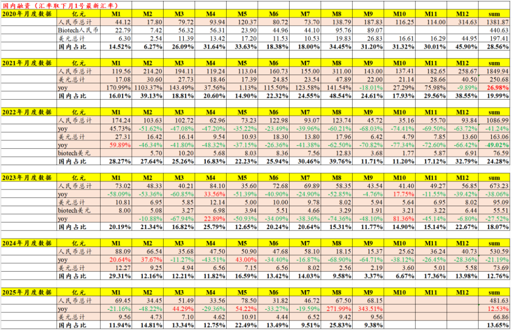
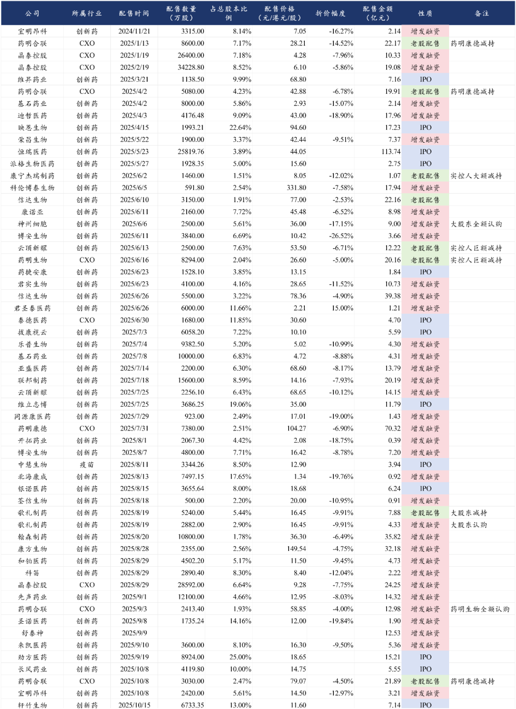
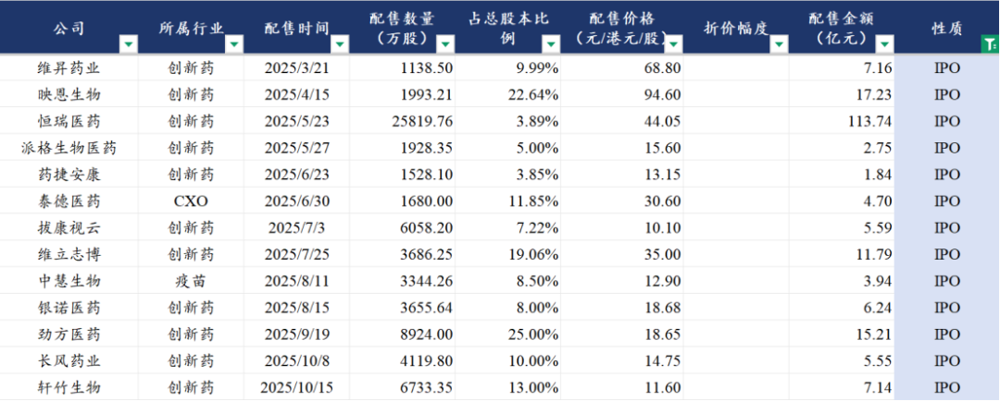
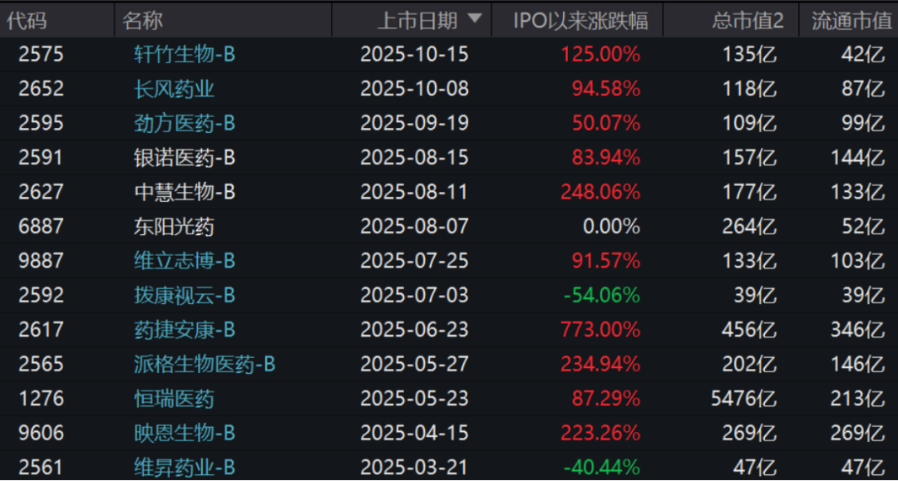
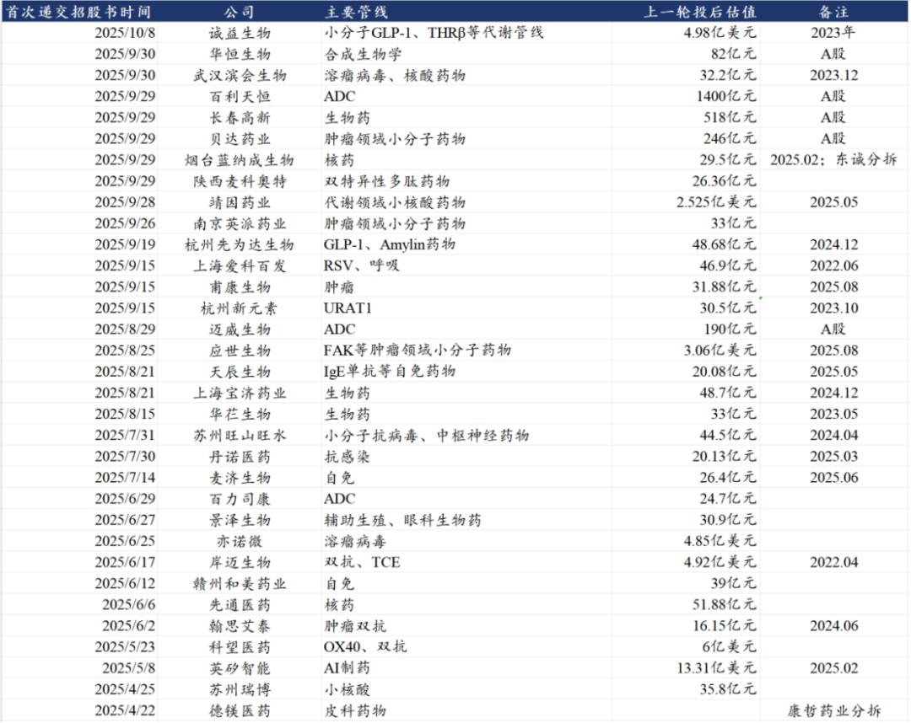
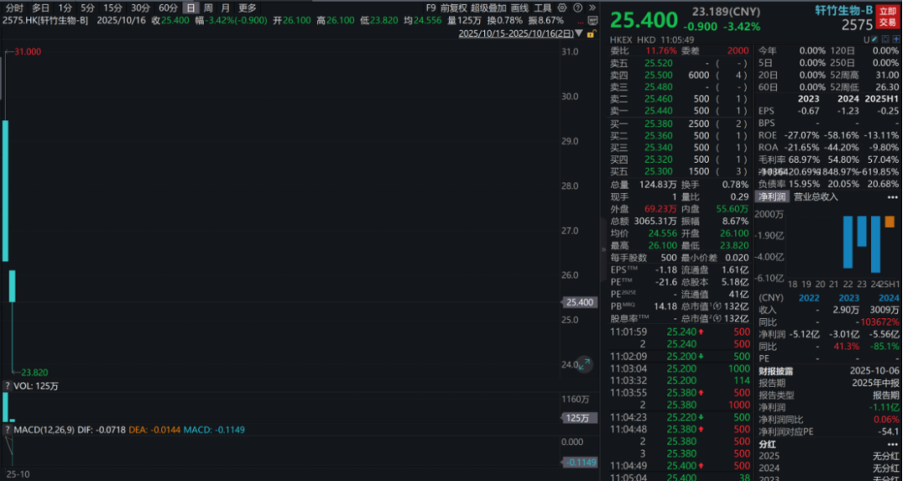
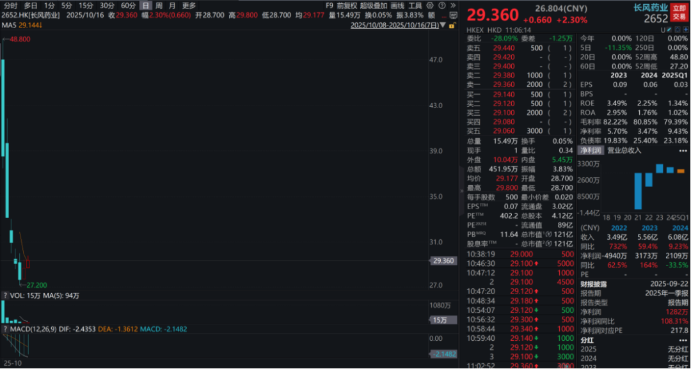
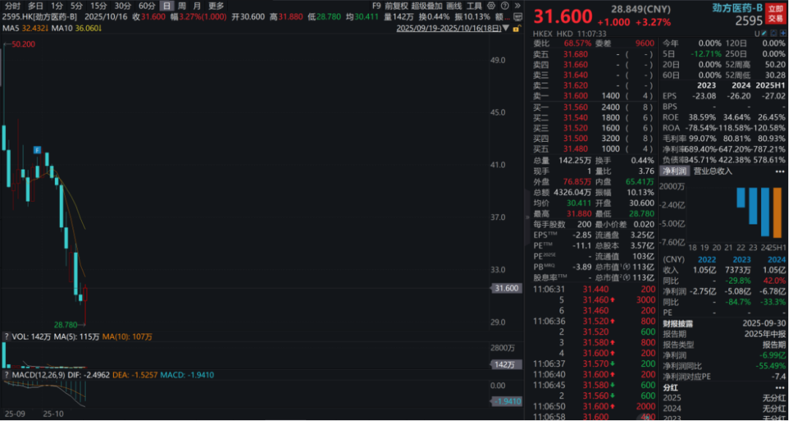

# 创新药港股IPO大爆发

大家好，我是龙哥。

最近关注到一点行业趋势，就是港股创新药公司的IPO开始疯狂增加，IPO的增加他本身不是一个单一的利好或者利空因素，但龙哥的老读者一定记得，我们对于上一轮创新药产业发展阶段的总结里有一段话叫“成也资本市场、败也资本市场”。

2018年开始执行的允许未盈利生物科技公司上市的港股18A和2019年的科创板第五套规则，很大程度上促成了国内创新药行业的大发展，在资本市场的助力下国内创新药一二级市场融资得以大爆发，从而带动了整个产业的爆发。

大家可以再来感受一下2020-2021年的医药行业一级市场融资火热程度：2020年医药行业一级市场融资达到1382亿元，2021年更进一步达到1850亿元，而2024年已经下降至531亿元。

但上一轮资本市场驱动的创新药产业发展，大部分公司的产品管线都是me too甚至me worse，出海的能力相对偏弱，用监管部门的定性来说就是很多创新药属于低水平的重复研发，属于无序内卷行为，甚至有公司攒一个研发管线的PPT单纯是为了上市融资，在资本市场退潮、医保谈判降价的双重打击下原形毕露，这是上一轮创新药熊市的痛苦记忆的来源之一。

而在去年下半年以来创新药行业的二级市场表现已经出现了极大程度的修复，不少公司的估值已经显著高于前面3年的水平，这也使得增发融资、减持、IPO的数量都开始飙升，一二级市场融资再次进入“抢钱行情”。

如此前的文章《[2025创新药融资之王](https://mp.weixin.qq.com/s?__biz=MzkyMzQ3MDc3Mw==&mid=2247484887&idx=1&sn=6d1b9b5f83f3d0f0b021a716a257cca7&scene=21#wechat_redirect)》给大家展示的二级市场融资情况：

这其中IPO的数量已经开始显著增加，今年以来有维昇药业、映恩生物、恒瑞医药、派格生物、药捷安康、泰德医药、拔康视云、维立志博、中慧生物、银诺医药、劲方医药、长风药业、轩竹生物等13家创新药及CXO公司在港股实现IPO。

就创新药新股的数量，我们也可以与往年对比一下，从2018年港股18A的第一家歌礼制药上市后，2018年AH股合计有6家创新药公司IPO，2019年随着科创板第五套规则的放开，合计有9家创新药公司IPO，2020年有30家，2021年行情走弱，IPO数量缩减至15家，2022年13家，2023年9家，2024年5家，其中2023年6月上市的智翔金泰是科创板地五套规则最后一家，直到最近申购的武汉禾元生物成为科创板第五套规则重新放开的首家。

这些今年新上市的公司，在火热的市场环境下，大多呈现的是IPO后的开盘价过高、且由于流通盘较小，股价容易被炒作，导致一方面是不少投资人对新股买不下手，另一方面又眼看着一些公司暴涨几倍乃至十倍，成了部分短炒资金的乐园，当然这并不是首次出现这种情况，上一轮医药牛市同样是这样的情况。

上图可见，今年IPO的创新药和创新疫苗的新股，除了市场关注度非常低的维昇药业和拔康视云以外，其他创新药公司的市值起步都已经是100亿以上，再剔除换股上市的东阳光药，剩下的公司涨幅最低的劲方也有50%以上的涨幅，最离谱的药捷安康相较发行价的涨幅高达773%，这些新股中部分公司的估值甚至已经大幅超过已上市公司中质地显著更好的标的，并且也曾带动部分原有可比上市公司的估值提升，呈现典型的左脚踩右脚式的估值提升。

而随着今年来的这些创新药新股的股价走出非常离谱的表现（最有代表性的像大家都知道的药捷安康），后面那些计划或者等待IPO的公司再也无法忍耐，开始密集的提交招股书寻求IPO上市，熟悉的味道又来了。

除了已经通过聆讯将在近期完成上市的还有一家海西新药以外，今年已经递交H股招股书的还有：

从8月底以来港股递交IPO招股书的公司数量激增，各家公司在行情火热了半年左右之后，基本也看清了市场热度和产业趋势，纷纷开始急着递交招股书争取IPO，生怕没赶上“抢钱行情”。

这里面包括几家A股公司发行港股的，如长春高新、贝达药业、百利天恒、迈威生物等，今年发行H股的恒瑞医药，H股估值大涨了87%，引得不少A股公司眼红，创新药以外，迈瑞医疗也开始推进发行H股。

也有一部分原本就在其细分领域算是知名度比较高的公司，比如GLP-1领域的先为达、诚益生物，例如双抗领域的岸迈生物，例如ADC领域的百力司康，以及核药领域的先通药物和蓝纳成，小核酸领域的苏州瑞博，AI制药的英矽智能等等。

港股创新药新股的估值，从一步到位，已经演变成一步登天。如果是估值偏高/偏低，IPO后一把大涨大跌，叫一步到位，现在的情况，估值本身发的不算很低估，上市后大幅高开和暴涨，叫一步登天。

这种市场表现，对于医药投资人来说本应该高兴，因为行业新股的火热本身就代表了行业热度，意味着很多资金愿意在行业里折腾。

但一波爆炒上天然后连着跌几年并不是我们想看到的，这种模式也会导致劣币驱逐良币，会导致行业内公司过度追求炒股票和减持退出，一切战略规划和研发管线都变成为了短期炒高股价而服务，真心做产品、不乱吹牛的公司会黯淡无光，这并不利于产业本身的健康发展。

还有如我们此前的文章《[坏了，药捷安康的瓜吃到自己头上了](https://mp.weixin.qq.com/s?__biz=MzkyMzQ3MDc3Mw==&mid=2247484970&idx=1&sn=22311272811206d8d758a8e097de2235&scene=21#wechat_redirect)》写到的，爆炒的次新股还可能误伤到其他医药投资人。

随着行业热度下降，大幅高开的新股在上市后表现也开始恶化，首日开盘既是高点的味道又来了：

次新股行情的降温，对行业来说未尝不是好事，在前期的鸡犬升天后已经开始呈现一地鸡毛，尤其A股部分公司，短短1-2个月的时间腰斩，市场对于BD炒作的认知也开始趋于理性，分化已经在发生。

风险提示：本文仅讨论行业/公司经营情况，投资需综合考虑公司经营、估值、管理层等多方面因素，建议读者审慎参考，本文不作为投资依据，不建议大家根据本文做出投资计划。

<!-- wxmp-comments-begin -->

---

## 留言（13 条，含回复共 28 条）

- **隐隐** 👍10 · 2025-10-16 11:50
  迅猛调整20个点以后终于来了点反弹。[捂脸]
  - ↳ **作者** · 2025-10-16 11:52
    不如说行业猛涨了一倍之后终于来了波中期调整[捂脸]
- **Bryan** 👍6 · 2025-10-16 11:52
  龙哥，港股IPO是不是更不审核公司质量啊？最近上的几个公司质量都不高，至于资金的热炒不知道何解，刚上市的公司流动盘小本来就方便控盘炒高，也没法借到足够的股，所以也不支持做空（指大资金），普通散户好像远离才是最佳选择
  - ↳ **作者** · 2025-10-16 11:54
    港股就是完全的注册制、荒野丛林，对投资者也没啥保护，就自由搏击，赚了亏了都是自己本事[捂脸][捂脸]
- **峰回路转** 👍2 · 2025-10-16 11:42
  @<a class="js_mention_entry wx_at_link" data-biz="Mzk0NzY4MjM5MA==" data-username="gh_63f7f08149c4" href="">@元宝</a>总结一下
  - ↳ **作者** · 2025-10-16 11:42
    文章分析显示，近期港股创新药IPO数量激增，十余家新公司集中上市且估值&quot;一步登天&quot;。重申&quot;成也资本市场、败也资本市场&quot;现象：资本曾推动行业繁荣，却也催生大量低水平重复研发；当前IPO热潮中若重陷短期炒作，恐重蹈历史覆辙，反而损害产业长期健康发展根基。
- **石破金开** 👍2 · 2025-10-16 11:43
  龙哥，怎么看创新药，当前有企稳反转的迹象了吗？
  - ↳ **作者** · 2025-10-16 11:48
    我自己理解是创新药牛市里正常的回调吧，企稳反转就有点离谱了吧，企稳反转是两年前的事儿了
  - ↳ **作者** · 2025-10-16 11:51
    看行业指数回调幅度并不算大，看创新药个股很多调整幅度已经比较大，个别个股也跌到我愿意抄的估值了。
- **专坑队友123** 👍1 · 2025-10-16 11:45
  龙哥，米国生物安全法案10月份那个，里面包括基因安全内容，这个对于cgt公司有啥影响
  - ↳ **作者** · 2025-10-16 11:50
    我理解基因安全的内容是会长期存在并且目前来看是他们极其关注的，时不时可能就会被针对。
- **hong** 👍1 · 2025-10-16 12:05
  龙哥，这一波再鼎医药 和黄医药基本上没吃上什么，后续有没有值得关注的点[抱拳]
  - ↳ **作者** · 2025-10-16 12:09
    和黄医药账上现金充足，又有几个商业化产品的现金流支撑，没有生死存亡的压力，就是看新管线有没有比较有价值的分子能推出来。
    除了原有管线之外，早研新技术平台的管线开始有新项目IND，主要看点也是新技术平台，不过公司效率偏低，看到早期数据可能还得一段时间。
  - ↳ **作者** · 2025-10-16 12:16
    说的新技术平台就是ATTC呀，看着是有点意思，不过也要看到上人体的数据
- **嘀嗒** 👍1 · 2025-10-16 12:17
  龙哥，忍不住问下，市场是这么不相信器械龙头三季度业绩拐点吗，港股ipo也不认可？还是说要看三季度后业绩持续体现。
  - ↳ **作者** · 2025-10-16 12:19
    咱就是说，有没有可能，市场就是相信迈瑞三季度能做出业绩拐点，所以股价在年报后就没再新低了。
- **这家伙有点实力** 👍1 · 2025-10-16 13:38
  中国生物制药有效公司质地怎么样？为啥国内信息非常少？
  - ↳ **作者** · 2025-10-16 21:08
    他不是信息少，他国内运营主体是正大天晴和北京泰德，你看这俩公司信息很多的
- **丰泽** · 2025-10-16 12:01
  禾元生物您怎么看，一则开盘首日预计到什么价格？二则可以买入吗？
  - ↳ **作者** · 2025-10-16 12:10
    这个我不知道科创板恢复后的第一家市场会开到什么估值，基本面情况在6月的文章里有介绍过。
- **大喵金** · 2025-10-16 12:39
  基本家家都这样的[尴尬]冇个好人[捂脸]
  - ↳ **作者** · 2025-10-16 21:09
    [捂脸][捂脸]还是有靠谱的[捂脸]
- **红枫** · 2025-10-16 12:44
  请教对目前血制品行业怎么看？天坛生物等龙头企业出海前景如何？
  - ↳ **作者** · 2025-10-16 21:09
    血制品出海也讲了好多年了，我印象中除了远大蜀阳以外也没有海外做出点规模的
- **刘建.** · 2025-10-16 15:28
  龙哥，国产疫苗股一直非常落后于医药指数，我手中的智飞生物就是一直垂头丧气的，想问问疫苗板块还有机会吗？是因为之前恶炒过所以就不会表现了吗？
  - ↳ **作者** · 2025-10-16 21:07
    他不是因为炒作过，他是行业性的基本面恶化的比较严重，你看业绩就能看得出来。
- **理** · 2025-10-16 16:40
  龙哥，丽珠集团怎么看？现在还算避险的公司不
  - ↳ **作者** · 2025-10-16 21:07
    丽珠就是比较稳，在医药牛市里可能很多人觉得一动不动[破涕为笑]

<!-- wxmp-comments-end -->
