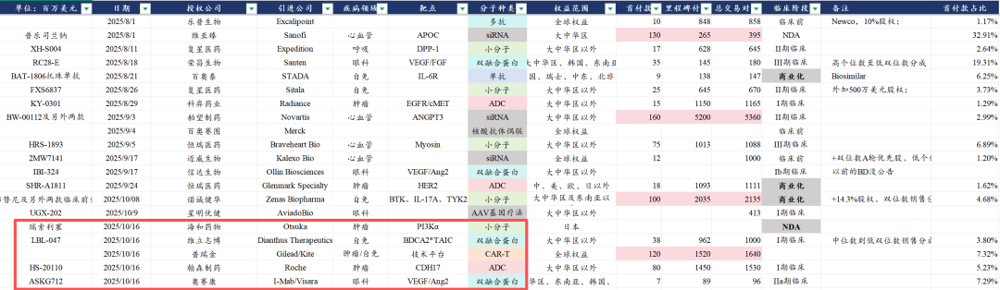

# 中国创新药闪耀国际学术大会

大家好，我是龙哥。

十一假期归来给大家分享了3篇文章，其中一篇是《[创新药可能进入催化密集落地期](https://mp.weixin.qq.com/s?__biz=MzkyMzQ3MDc3Mw==&mid=2247485001&idx=1&sn=106ad8605a49f137ddd912f147903744&scene=21#wechat_redirect)》，聊了聊四季度行业的潜在机会，还有一篇是《[聊几个创新药行业大家最关心的问题](https://mp.weixin.qq.com/s?__biz=MzkyMzQ3MDc3Mw==&mid=2247485007&idx=1&sn=45e247c9104c79fb75f049c267247e33&scene=21#wechat_redirect)》聊了聊当前市场对创新药行业存在的一些认知偏差，没读过的读者建议先读这两篇再读本文。

这两篇文章的观点，在这几天的一系列消息中都在验证：一方面是我们看到ESMO大会上中国创新药可谓是群星闪耀，多个品种发布了非常惊艳的III期临床数据，尤其是OS显著获益的数据；另一方面是我们也看到自十一假期之后，创新药BD又开始进入密集落地的阶段。

1、数据发布

欧洲肿瘤内科学会（ESMO）是肿瘤领域每年全球最重要的两大学术会议之一（另一个是5月份的美国临床肿瘤学会年会ASCO），各个肿瘤领域的重磅临床数据都会选择在ASCO或者ESMO上发布，2025年ESMO的数据就在这两天开始密集发布，部分国内创新药展现了极其惊艳的大III期临床数据，这里我们选几个最典型的给大家聊聊。

1）科伦博泰：

公司公布芦康沙妥珠单抗（TROP2-ADC，sac-TMT）二线治疗EGFR TKI耐药的EGFR突变非小细胞肺癌和二线治疗HR+/HER2-乳腺癌的两项国内III期临床数据。

①在376例二线治疗EGFR TKI耐药的EGFR突变NSCLC患者中，sac-TMT单药对照双药化疗的临床数据显示，mPFS为8.3个月VS 4.3个月（HR值0.49，p＜0.0001），mOS未达到VS 17.4个月（HR值0.60，p=0.0006），交叉用药调整后的mOS为未达到VS 17.2个月（HR值0.56，p=0.0002）。

这是在二线TKI耐药EGFR阳性NSCLC中首个达到显著OS获益的创新疗法，预计将成为该适应症的标准疗法，目前国内每年新发EGFR突变NSCLC患者超过40万人且仍在每年增长，是个超大适应症。

②在399例CDK4/6经治且至少经过一线化疗的HR+BC患者中，sac-TMT单药对照化疗的临床数据显示，mPFS为8.3个月VS 4.1个月（HR值0.35，p＜0.0001），OS尚未成熟，但目前OS的HR值为0.33，也显示出显著临床生存获益的趋势。

科伦博泰本次发布的sac-TMT的两项III期临床数据表现非常亮眼，且都有望成为两个大适应症的二线治疗标准疗法，再次验证了芦康沙妥珠单抗的全球BIC实力和全球市场潜力。

2）康方生物：

公司公布依沃西（PD-1/VEGF双抗）联合化疗头对头替雷利珠单抗头对头化疗一线治疗非小细胞肺癌的中国III期临床数据（IO最大适应症），532例患者1:1分配在实验组和对照组的临床结果显示，依沃西+化疗VS替雷利珠+化疗的mPFS为11.1个月VS 6.9个月（HR值0.60，p＜0.0001），其中PD-L1 TPS＜1%的亚组mPFS为9.9个月VS 5.7个月，HR值为0.55，PD-L1 TPS≥1的亚组mPFS为12.6个月VS 8.6个月，HR值为0.66，在PD-L1低表达患者中展现出更佳的临床获益。

依沃西本次发布的PFS数据符合预期，市场预期PFS超过11个月、PFS HR值为0.60-0.65。

3）荣昌生物/君实生物：

公司公布荣昌生物的维迪西妥单抗（HER2-ADC）+君实生物的特瑞普利单抗（PD-1）对照化疗一线治疗HER2阳性尿路上皮癌（HER2+UC）的III期临床数据，484例患者的III期临床数据显示mPFS为13.1个月VS 6.5个月（HR值0.36，p＜0.0001），mOS为31.5个月VS 16.9个月（HR值0.54，p＜0.0001），≥三级治疗相关不良事件发生率为55.1%VS 86.9%，总体展现出显著临床生存获益和更好的安全性。

4）石药集团/康宁杰瑞：

公司公布安尼妥单抗（HER2双抗）联合化疗对照化疗二线治疗HER2高表达胃/胃食管结合部腺癌的III期临床数据，数据显示mPFS为7.1个月VS 2.7个月（HR值为0.25，p＜0.0001），mOS为19.6个月VS 11.5个月（HR值为0.29，p＜0.00001），显示出显著临床生存获益。

除了康方AK112本次披露的是PFS数据以外，另外3个双抗、ADC的完整III期临床数据均不仅展现PFS获益，且展现出显著的OS获益，相较现有标准疗法的头对头III期临床显示OS获益是取得临床疗效突破的金标准，一方面显示当前国内临床质量的提升，另一方面显示国内创新药本身的质量提升。

2、创新药出海

2025年10月16日，国内创新药公司单日实现5笔创新药海外BD，其中包括2笔交易质量比较高的BD，分别是翰森制药以8000万美元首付款+14.5亿美元里程碑付款将处于临床I期、国内竞品较多的CDH17 ADC授权给国际MNC公司罗氏，另一笔是普瑞金以1.2亿美元首付款+15.2亿美元里程碑付款将体内CAR-T技术平台授权给全球细胞治疗龙头吉利德/凯特。

10月15日纽约举办的美中关系全国委员会晚宴上，辉瑞CEO布尔拉发言表示美国制药产业需与中国合作：“在生物制药领域，中国惊人的速度、成本和规模引发了全球竞争格局的转变，中国目前拥有1200种在研新药、而10年前只有60种，在24年所有大型制药公司的药品许可交易中，中国生物技术公司占了近三分之一，这是创新来源的重大转变，中国生物制药公司招募患者进行临床试验的速度是美国公司的2-5倍”。

10月14日周二，恒瑞医药的GLP-1减重药海外Newco公司获得6亿美元B轮融资。早在2024年5月16日，恒瑞医药将其GLP-1系列产品线（GLP-1/GIPR双靶点激动剂，GLP-1小分子，GLP-1/GIPR/GCGR三靶点激动剂）打包以Newco方式授权给Hercules，恒瑞医药获得1.1亿美元首付款、59.25亿美元里程碑付款，总交易对价为60.35亿美元，且恒瑞医药可获得新公司19.9%的股权。

该海外子公司已经完成GLP-1R/GIPR双靶点激动剂的II期临床总结会议，并计划在2025年底启动全球III期临床试验，本次融资将支撑其全球III期临床以及另外两款产品的国际市场开发。

此前国内Newco授权海外的方式一直被轻视，原因是Newco授权公司的资金实力普遍受限，因此即便完成了Newco授权，也需要再看到被MNC收购方可有后续更加具有确定性的项目临床开发，恒瑞医药的海外Newco子公司本次获得包括贝恩资本、RTW投资、Adage Capital、加拿大养老投资、卡塔尔投资局等豪华机构投资者，其有信心自己将项目推进到超大规模全球III期临床。

......

不论短期市场如何波动，行业在快速向前发展是客观现实，行业历经过去3个季度的预期大幅提升、行业全面暴涨，到8月以来的中期回调，预期归于理性，分化已经在发生。

风险提示：本文仅讨论行业/公司经营情况，投资需综合考虑公司经营、估值、管理层等多方面因素，建议读者审慎参考，本文不作为投资依据，不建议大家根据本文做出投资计划。

<!-- wxmp-comments-begin -->

---

## 留言（8 条，含回复共 16 条）

- **肥锋  家诚哥** 👍5 · 2025-10-20 07:57
  国内集采确实也起到一举两得的作用，记忆中孙总也是那时候下决心大刀阔斧改革，改变恒瑞的模式
- **星移无痕** 👍4 · 2025-10-19 22:31
  荣昌ADC还是牛啊
  - ↳ **作者** · 2025-10-19 22:32
    荣昌那个HER2-ADC也说不上太牛，主要是IO+ADC对照化疗是降维打击，选择大于努力
- **和** 👍3 · 2025-10-19 22:50
  这么晚发感觉明天药大涨[捂脸][捂脸][捂脸][捂脸]
  - ↳ **作者** · 2025-10-19 22:53
    梳理完周末的信息顺手就发了😂
- **南** 👍1 · 2025-10-19 22:42
  中国生物制药没有任何消息吗？
  - ↳ **作者** · 2025-10-19 22:55
    那得看你说的消息是什么，BD的话暂时还没有落地的，但最近临床推进还是很快的，不管是正大天晴原本自己的管线还是收购来的礼新的管线。
- **Hawk16H** 👍1 · 2025-10-19 22:45
  康方算超预期吗
  - ↳ **作者** · 2025-10-19 22:51
    文章里说了呀，我认为是很不错的数据，符合预期吧
- **gaowei** 👍1 · 2025-10-20 06:23
  昨晚学习发现：本来华海药业的HB0025二期数据在非小细胞肺癌PD-L1阴性患者中有良好表现，可惜现在被康方的3期亚组数据浇灭了希望。所以可以说华海药业的这个产品没什么前途对吗？
  - ↳ **作者** · 2025-10-20 08:49
    fast follow的品种要做出差异化
- **会飞的鱼** · 2025-10-20 07:14
  16号五笔BD交易，但17号创新药etf反而跌了，把前一天的涨幅都抹去了，这是属于利好已兑现了么？
  - ↳ **作者** · 2025-10-20 08:48
    不要陷入解释每一天的涨跌，每一天不论涨跌都能给你找N个原因出来，周五大盘跌这么惨烈，和医药利好兑现有什么关系？
- **凡** · 2025-10-20 07:42
  没记错的话在EGFR突变的NSCLC上康方112没有OS阳性，数据不如博泰的264
  - ↳ **作者** · 2025-10-20 08:46
    康方AK112主要的战场还是在一线联用，现在这个适应症也没啥估值预期了吧
  - ↳ **作者** · 2025-10-20 09:09
    默沙东本来也不做TKI耐药的二线EGFR+NSCLC。二线原本的标准治疗就是含铂化疗。默沙东的K药+博泰也是冲一线的。

<!-- wxmp-comments-end -->
