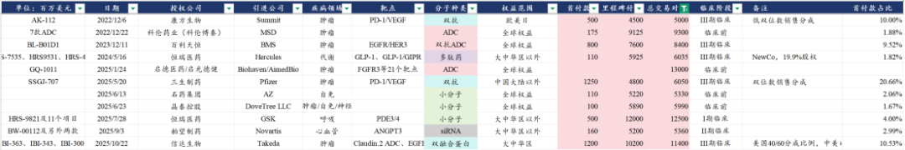
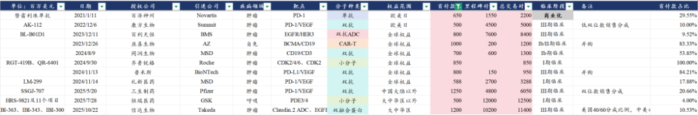
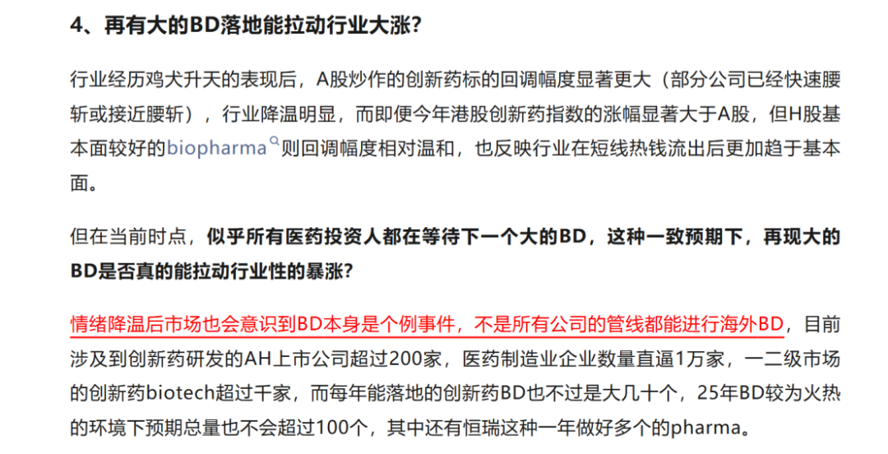

# 抱歉，迟到的重磅交易解读

大家好，我是龙哥。

这周在外面连续跑了几天的调研，基本是连轴转，终于忙完有空简单写点东西。这周最大的事儿就是信达生物的BD落地，咱们就这个事儿聊聊当前创新药行业的情况，给大家说声抱歉，这么重磅的事儿延后了几天才有空聊聊。

1、BD交易结构

信达生物这笔海外授权BD交易是3个分子，具体来说，信达生物及其海外子公司Forvita与武田制药达成全球开发合作协议，合作范围包括IBI363（PD-1/IL-2α）、IBI343（Claudin18.2-ADC），以及一款早期开发项目IBI3001（EGFR/B7-H3 ADC）的选择权。

交易对价方面，信达生物获得首付款11亿美元、溢价30%的股权投资1亿美元，合计可以拿到12亿美元的现金，研发和商业化里程碑付款合计是102亿美元。

具体项目和权益比例方面：

①对于IBI-363，信达生物与武田制药按照40/60比例共担美国开发成本、共享美国市场利润，且信达生物拥有大中华区及美国以外区域的高双位数梯度销售分成。

②对于IBI343，武田制药获得大中华区以外全球权益，信达生物可获得高双位数销售分成。

③对于IBI3001，武田制药获得大中华区以外权益的独家选择权，信达生物可获得中双位数销售分成。

假如咱们再对这笔交易的交易对价简单拆分一下，那么处于III期临床阶段的Claudin18.2-ADC和处于I期临床阶段的EGFR\*B7H3 ADC，如果按当前其他可比交易对价来看，大概能对应合计1-2亿美元的首付款、20亿-30亿美元的总交易对价，也就是说就IBI-363这个项目来说，大概可以认为是9-10亿美元的首付款、70亿-80亿美元的总交易对价。

2、BD交易背景

信达生物算是咱们老生常谈的公司了，从龙哥开始写公众号开始就会时常提到信达生物，可以说信达生物就是半部中国创新药发展史，其选择靶点和品种的眼光以及超强的执行力也是国内创新药行业的标杆之一，例如在去年以前我们时常提到的信达生物的管线像匹康奇拜单抗（IL-23p19）、玛仕度肽（GLP-1R/GCGR），目前分别处于申报上市阶段和商业化阶段，而IL-23p19和GLP-1双靶药物分别代表目前自免和代谢领域全球最重磅靶点，信达生物的这两个药物都是国产厂商进度第一。

但自从2021年信达生物的PD-1出海失败以后，信达生物哪怕在国内有包括以上两个药物在内的多个优质产品进入注册或商业化，其市值天花板似乎总是被锁死在七八百亿的水平，大概就是公司指引的2027年达到200亿收入的3-4倍PS的水平。

这其中的原因，一方面是那时候创新药行业总体β确实很弱，信达生物商业化持续的超预期也并没有带来股价特别大的表现，另一方面是市场对于纯国内商业化的公司确实是给了比较多的折价，哪怕国内政策面已经有了大幅的改善，仍然是给了不少折价，更何况信达生物在去年底还经历了低价出售Forvita股权的信任危机。

但随着信达生物的PD-1/IL-2α（IBI363））这个潜在的第二代重磅IO疗法的临床数据陆续发布，市场对其预期开始持续改观，尤其是IBI-363发布在EGFR野生型NSCLC患者的早期临床数据中达到OS获益后更是给足了市场信心，信达生物真正具备了全球FIC分子管线和开发能力，随之而来的就是对海外BD的预期持续抬升直到本周的BD落地。

也因此，信达这笔BD交易，可以说是意义重大、期待已久、预期甚高，那么落地之后，股价如大家看到的这样充满博弈，虽然很让人无语，但也实属正常。

信达生物目前对于IBI-363启动了两项注册临床，分别是：

①2025年3月启动的单药头对头K药（PD-1，帕博利珠单抗）一线治疗不可切除局部晚期或转移性黏膜型及肢端型黑色素瘤的中国注册II期临床。

②2025年10月启动的单药头对头多西他赛（化疗）治疗经铂类化疗和PD-1/L1治疗后进展的局部晚期或转移性鳞状非小细胞肺癌的全球多中心III期临床，计划在中国、日本、美国、加拿大、欧盟、英国等地招募约600名患者，剂量为3mg/kg，主要终点为OS。

对于第一项在国内开展的注册II期临床，还属于信达生物的主场，但第二项入组人数达到600人、将覆盖数个大洲、十几个国家的全球大III期临床，对信达生物来说还是有较大难度的，这一项大III期所需的至少3-4亿美元以上的临床费用还是次要的，毕竟信达生物目前百亿以上的现金储备、持续增加的商业化现金流还是足以支撑这个投入的，更重要的是这对于信达生物来说是全球FIC管线实现全球化突破的标志性临床，是不容有失的，因此选择一家国际MNC来帮助推进全球注册和商业化是非常有必要的。

再来聊聊合作方武田制药，相比其他欧美传统MNC，武田真正进入欧美等主流国际市场的时间并不算早，历史上通过一系列并购逐渐打入欧美市场，目前制药业务的收入体量在全球市场大概在14-15名的位置（包括较大体量血制品业务），相比其他MNC而言，武田制药的标志性品种也偏少，目前几乎就是一款炎症性肠病的重磅药物维得利珠单抗独当一面。

武田制药在2019年以620亿蛇吞象收购夏尔后，至今仍背负超过300亿美金的有息负债，因此近年的大手笔交易一直不多，为数不多的一笔在2022年以40亿美元首付款+20亿美元里程碑付款引进了一款TYK2抑制剂以求延续维得利珠单抗在IBD领域的竞争力，但造化弄人，艾伯维的IL-23p19在IBD领域攻城略地、今年IBD适应症收入可能将超越维得利珠单抗，在口服小分子药物领域，强生的IL-23口服环肽已经在银屑病适应症上头对头战胜BMS的TYK2抑制剂，在IBD适应症上也在快速推进，TYK2未来在IBD的潜力也受到挑战。

因此，对于合作方武田制药来说，开发一款足以改变公司命运的、颠覆性的超级重磅药物，是保证武田制药未来不会逐渐“走向平庸”的关键，信达生物的IBI-363给了武田制药这个机会，并且相比武田制药对TYK2抑制剂的“慷慨”，与信达生物的这笔交易已经是在其资金捉襟见肘下的较为保守的交易。

3、BD交易影响

上文花了大量的篇幅来聊整个交易双方的背景，实际上已经把很多东西讲清楚，这笔交易对于信达生物和武田制药来说，都是一笔“久旱逢甘露”式的双赢交易。

对于二代IO疗法的意义咱们不再这里再赘述，大家可以参考《[宇宙级大药](https://mp.weixin.qq.com/s?__biz=MzkyMzQ3MDc3Mw==&mid=2247484380&idx=1&sn=f59a39aac3c6cb168c326d789c8d8031&scene=21#wechat_redirect)》文章里的内容，PD-1/VEGF的逻辑可以类比到PD-1/IL-2α在内的其他二代IO潜在靶点的逻辑中。

对于信达生物而言：

①PD-1/IL-2α的全球化临床开发确定性提升，虽然不是全球顶级肿瘤领域MNC，但有武田制药的助力也可以减少很多由于信达生物缺少经验而可能出现的风险点，放大PD-1/IL-2α的全球价值，信达生物还可保留美国市场40%的权益比例（开发成本和收益按比例共担），可以说是信达生物真正进入美国市场的一次重要铺垫。

②本次信达生物拿到超过10亿美金的现金，信达生物将有超过200亿的现金储备，叠加今年超百亿、27年超200亿的产品收入，再加上信达生物超强的执行力，信达生物在未来1-2年将真正具备和恒瑞、翰森、中国生物制药、石药等国内头部老牌传统药企“叫板”的能力，跨入中国制药领域的第一梯队。

③信达生物将有资金和能力加速ADC领域的开发进度，在ADC领域的布局时间并不算早，但在信达生物的超强执行力下，累计有11款自研ADC药物和1款自研ISAC药物进入临床阶段，一跃成为国内ADC领域一线阵营的玩家，此外其中还包含4款双抗ADC、1款双荷载ADC，成为双抗ADC国内TOP3的玩家，信达生物的充沛资金和第二代IO的基石疗法，将很大程度上帮助其ADC管线的联合疗法临床开发。按照信达生物的效率，2024-2025年陆续进入临床阶段的一系列ADC管线，到26年预计也将陆续开始读出一些早期数据，首个项目Claudin18.2-ADC也将临近申报注册。

对于创新药行业而言：

中国创新药出海历史上共有11笔交易的总交易对价超过50亿美元，其中超过100亿美元的只有3笔，如果不算启德医药那笔的话只有7月恒瑞医药那笔和本次信达生物的这笔，分别涉及12个分子和3个分子。

中国创新药出海历史上首付款超过5亿美元的也是11笔交易，不算两项并购交易的话是9笔，其中首付款超过10亿美元的只有三生制药授权辉瑞的PD-1/VEGF双抗和本次信达生物的IBI-363。

就IBI-363单个项目的交易对价而言信达生物这笔交易应该是在首付款仅次于三生制药，如果按我们上文预计的IBI-363单个项目大概首付款9-10亿美元、总交易对价70亿-80亿美元，在首付款和里程碑付款都与BMS与百利天恒的那笔交易比较接近或者略高，是中国创新药领域又一笔标志性的BD交易。

但信达生物的BD落地后，行业反而并没有出现上半年那样火热的上涨，为什么？

在上周的文章里实际上已经告诉大家：

风险提示：本文仅讨论行业/公司经营情况，投资需综合考虑公司经营、估值、管理层等多方面因素，建议读者审慎参考，本文不作为投资依据，不建议大家根据本文做出投资计划。

<!-- wxmp-comments-begin -->

---

## 留言（20 条，含回复共 38 条）

- **廖书豪** 👍12 · 2025-10-24 16:00
  最近医药：高开低走 、平开低走、低开低走[破涕为笑]
  - ↳ **作者** · 2025-10-24 16:06
    [捂脸]
- **James曾** 👍5 · 2025-10-24 16:18
  创新药真的是看不懂，跌得太随意了[捂脸]大盘好它跌，大盘不好它跌得更凶，利空它大跌，利好它照跌不误，大A制药前几天大涨它也跌.？..
  - ↳ **作者** · 2025-10-24 16:20
    涨的很随意，跌的也很随意
- **c** 👍4 · 2025-10-24 16:01
  君实生物那个JS207头对头O药怎么看[疑问]
- **moro** 👍3 · 2025-10-24 15:57
  龙哥，创新药近2个月的走势真的难绷啊
  - ↳ **作者** · 2025-10-24 16:02
    恒瑞百亿美金BD落地基本就是阶段高位了，回调了两个多月了
- **时间之外的往事** 👍3 · 2025-10-24 16:07
  从再造一个国内市场，到信达大BD资本砸盘，是否意味着这波创新药行情结束了，后面开始慢慢回归，又到了拼贝塔的时候。。。
- **肥锋  家诚哥** 👍3 · 2025-10-24 16:33
  创新药调整之时，只有那个受到大洋彼岸金毛挑逗下的一哥，还在稳稳地横盘。
- **尘缘** 👍3 · 2025-10-24 17:28
  涨多了必然会跌，这很正常。可是，这么大的BD，居然没蹦跶一下，真是想不到啊[破涕为笑]
  - ↳ **作者** · 2025-10-24 17:37
    是的
- **雪山** 👍2 · 2025-10-24 15:57
  基本面还可以的石药集团，已经卧倒了[捂脸]
  - ↳ **作者** · 2025-10-24 16:02
    5月30日的公告，给市场很高的期望，快5个月过去了，一再miss
  - ↳ **作者** · 2025-10-24 16:27
    这个公告太无耻了，开了个极恶劣的头
- **陈国政** 👍2 · 2025-10-24 15:58
  请教下龙大，三生国健三季报数据这么漂亮，首付款也收到了，只不过没计入而已，也大跌？
  - ↳ **作者** · 2025-10-24 16:00
    三生国健的三季报包含收到部分子公司分红，但不含这块的表现也不算差，辉瑞的首付款已经反映在经营现金流里，还没确认收入，我也不太懂今天大跌的原因。
- **游子** 👍2 · 2025-10-24 15:59
  龙🐉大，乐普的预期还有吗？感谢回馈
  - ↳ **作者** · 2025-10-24 16:05
    乐普医疗逻辑上还是之前讲的，第一要看他医美今年商业化销售的情况，虽然也不会太大规模，但对明年的三文鱼针商业化预期有较大影响。第二是看三靶点的临床开发进度和BD的情况。器械和药品板块基本就是平稳。
- **人间白加黑** 👍2 · 2025-10-24 16:10
  持有迈瑞五年，体验感不好，看看三季报能不能出拐点？
  - ↳ **作者** · 2025-10-24 16:12
    得看是什么拐点，同环比正增长估计公司会努力做到，但不是三季度转正就无忧了。
- **专坑队友123** 👍2 · 2025-10-24 16:20
  昨晚美股Medpace业绩超预期大涨了，验证行业进一步恢复，然而只是带动cxo涨了30分钟，就成了科技股得血包[裂开][裂开]
  - ↳ **作者** · 2025-10-24 16:21
    CXO已经算是比较强了，生物安全法案啥的各种消息下都回调不多
- **微尘** 👍2 · 2025-10-24 16:29
  看过博主之前的文章，似乎对信达生物有偏见，估计不喜欢信达的老板吧[破涕为笑][破涕为笑][破涕为笑]
  - ↳ **作者** · 2025-10-24 16:38
    我对信达谈不上偏见，我对他唯一负面的评论就是去年管理层想要低价拿forvita的股权，其他评论都是积极正面的，我从信达IPO时候就写了他的深度报告，一路跟踪到现在7年了。
  - ↳ **作者** · 2025-10-24 16:42
    我20年关注您开始，才知道信达。我买入信达也是之前有印象，去年一直没找到合适的机会，老板知错能改就还算顾及股东感受了，这成了我当时买的理由。谢谢您。
- **kaka** 👍1 · 2025-10-24 16:02
  龙哥，骨科有消息吗，最近春立爱康都有异动
  - ↳ **作者** · 2025-10-24 16:10
    春立应该是Q3还是有持续改善的，最近要发三季报了。
- **Luca** 👍1 · 2025-10-24 16:03
  龙哥怎么看待中国中药前景，特别是最近传的中国中药私有化或者重组方案
  - ↳ **作者** · 2025-10-24 16:11
    中国中药的私有化传了太久了，反复博弈过太多次，最近应该是要到解决同业竞争的最后期限了，所以又有人来博弈这个
- **赵东亮律师** 👍1 · 2025-10-24 16:13
  请问龙哥对医疗器械是什么看法，7月底到现在走势不太好
  - ↳ **作者** · 2025-10-24 16:14
    有没有可能，整个医药行业从7月底到现在都在行业性回调[捂脸]
- **饶小超** 👍1 · 2025-10-24 17:22
  什么都拯救不了创新药持续阴跌了。除非再来个百亿美元订单…
- **COCO** · 2025-10-24 15:57
  龙哥请问下血制品行业拐点是否已到，行业龙头整合同行。
  - ↳ **作者** · 2025-10-24 16:03
    血制品行业的龙头整合是供给端的整合，供给端也没收缩，行业拐点或者说当下核心矛盾还是看需求端。
- **执着如呆** · 2025-10-24 16:01
  可以拿创新药中的恒瑞去理解吗？[可怜][可怜][可怜]
  - ↳ **作者** · 2025-10-24 16:09
    没太懂，信达和恒瑞不都是创新药公司吗
- **求索者** · 2025-10-24 16:53
  下跌很大部分原因是因为363这个价格的bd，锚定了大概大几十亿美金销售峰值的潜力，把理想拉回现实，距离宇宙级大药还差至少一个数量级，否则不管是首付款还是总额都要至少✖️3。
  - ↳ **作者** · 2025-10-24 16:55
    之前市场预期大概就在这左右，只是没有再超预期。

<!-- wxmp-comments-end -->
