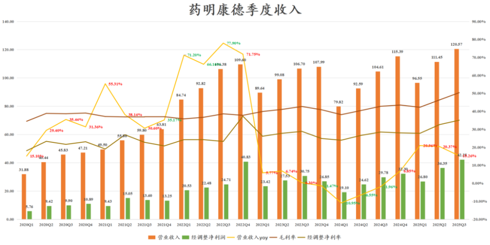
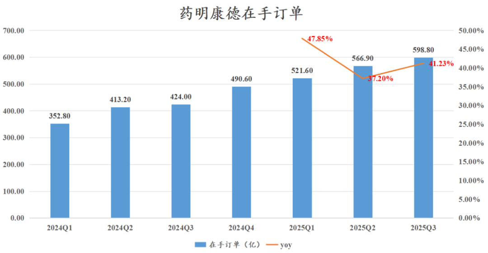
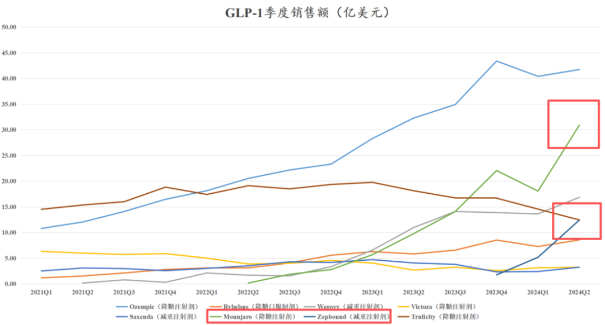
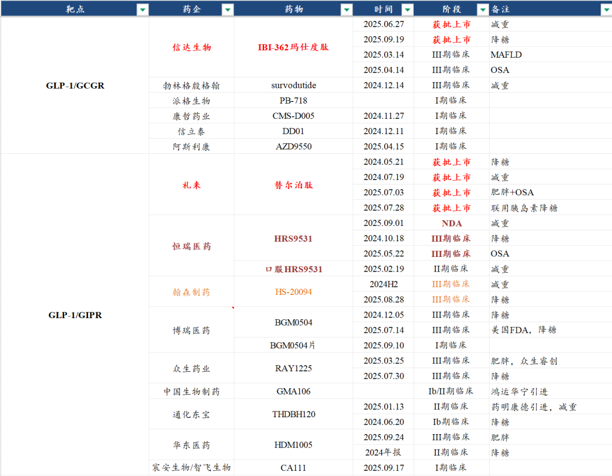
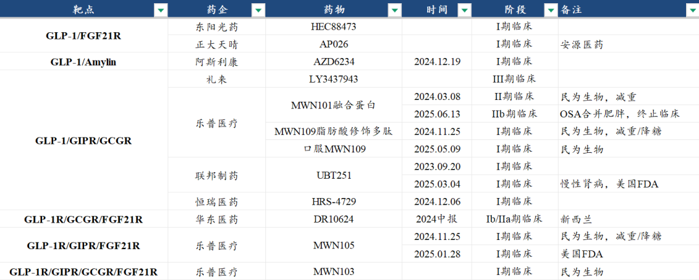

# 从药明康德业绩看CXO产业趋势

大家好，我是龙哥。

昨晚药明康德披露了三季报，就这份三季报和大家聊聊我们看到的一些趋势。

1、业绩情况

药明康德2025年前三季度实现收入328.57亿元同比增长18.61%，其中2025年Q3收入120.57亿元+15.26%，环比增长8.19%，收入同环比增速均有所放缓，如果剔除公司剥离部分资产的影响后，“持续经营业务”收入同比增长19.7%。

利润端，前三季度归母净利润120.8亿元同比增长84.8%，我们知道这其中包括公司今年减持了3笔药明合联的投资收益，公司前三季度经调整Non-IFRS归母净利润是105.4亿元同比增长43.4%，依然是非常亮眼的表现，前三季度药明康德的毛利率提升至46.62%创历史新高，经调整净利率32.08%。

Q3单季度毛利率50.37%同比提升7.55%、环比提升4.02%，以非常离谱的水平突破历史新高，单季度的经调整净利率达到35.04%，在全球CXO行业都是最高水平的毛利率和净利率。

截至三季度末，公司在手订单为598.80亿元同比增长41.23%、环比增长5.6%。

公司全年收入增速指引由增长13%-17%上调至17%-18%，收入指引由425亿-435亿元上调至435亿-440亿元。

公司毛利率和净利率提升均超预期，Q3单季度毛利率达到50.37%创历史新高（也远高于做新冠大单时），预计主要是公司业务结构变化导致，一方面公司CDMO业务占比已经从2020年的30%左右上升至2025Q3的69.42%，过去拖累业务的细胞基因治疗CDMO被剥离，CRO业务收入占比显著下降，另一方面预计公司作为CMO生产的部分大品种的毛利率非常高。

2025年前三季度资本开支35.66亿元同比增长43%，Q3单季度资本开支14.65亿元，公司将全年资本开支指引由70亿-80亿元下调至55亿-60亿元，主要是部分工程结算周期较长；公司预计全年自由现金流由50亿-60亿元上调至80亿-85亿元。

2、业务分部

公司的业务部门是分为化学、测试、生物三个部门，化学部门包括药物发现和CDMO，这里我们把业务分为CRO和CDMO部门讨论，更符合公司的业务特性。

①CDMO业务：

药明康德现在的CDMO业务是拆分为小分子CDMO部门和TEDIS（多肽及寡核苷酸，主要是GLP-1类多肽药），小分子CDMO业务前三季度收入142.4亿元同比增长14.19%，TEDIS部门前三季度收入78.4亿元同比增长120.85%，CDMO业务合计收入220.8亿元同比增长37.83%，收入占比67.2%同比提升9.37%。

Q3单季度小分子CDMO收入55.60亿元同比增长9.45%、环比增长15.1%，TEDIS部门收入28.10亿元同比增长91.16%、环比增长0.72%，CDMO业务合计收入83.7亿元同比增长27.79%（Q1-Q3增速分别为52.25%、39.31%、27.79%），CDMO业务占总收入的比重达到69.42%。

到2025年三季度，TEDIS部门服务项目数377个同比增长34%，服务客户数170个同比增长12%，预计其中大部分是GLP-1类药物，包括替尔泊肽的CMO订单贡献重要收入，替尔泊肽在25Q2的全球销售额已经达到85.8亿美元同比增长98%、环比增长39%，预计25Q3-Q4就将超过司美格鲁肽登顶全球药王，这也是全球CDMO领域景气度最高的赛道之一，而由于替尔泊肽的放量，25年有可能是这个高景气赛道增速最快的一年，随着基数的快速提升，赛道增速也会降速。

除了替尔泊肽以外，国内外还有数量庞大的GLP-1类药物在研管线，药明康德在该领域占据全球领先地位。

部分AH上市公司GLP-1双靶点/多靶点在研管线

②CRO业务：

2025年前三季度，药物发现板块收入38.98亿元同比下降4.31%，测试业务收入41.69亿元同比下降9.72%，生物板块收入19.47亿元同比增长6.65%。

Q3单季度药物发现收入13.07亿元同比下降2.04%，公司药物药物发现板块的收入自2022-2023年高峰的单季度18-19亿元下降到目前在单季度13亿元左右震荡了6个季度，也还未有显著改善。

测试业务Q3单季度收入14.81亿元同比下滑7.45%，其中实验室分析与测试收入10.70亿元同比-6.14%，临床CRO/CSO收入4.10亿元同比下降12.77%，公司发布三季报的同时公告将聚焦CDMO业务，将以28亿元剥离临床CRO业务给高瓴资本。

生物部门Q3单季度收入6.96亿元同比增长5.89%，近4个季度恢复个位数正增长。

总体从CRO和CDMO两个业务板块来看，CDMO不论是小分子CDMO的修复还是TEDIS部门的高景气度，表现都要显著好于CRO部门，临床前CRO和临床CRO部门的表现在今年国内外降息和创新药预期显著修复的情况下依然表现的差强人意。

药明康德的业务部门的表现，实际上也与今年CXO行业的股价表现具有较高的相关性，高度依赖国际市场的CDMO行业跟随更早修复的海外创新药行业而全面走出基本面拐点，在高景气度的方向甚至走出加速，而CRO业务普遍还是和国内创新药行业的相关度偏高，走出拐点的时间则要相对滞后。

3、资产剥离

关于药明康德剥离临床CRO部门这里想展开讨论一下，此前产业界已经有了解到药明康德计划剥离临床CRO业务部门，本次剥离的两家公司，上海康德弘翼24年收入2.91亿元、利润-4247万元，25年1-9月收入1.86亿元、利润-7545万元；上海药明津石24年收入13.38亿元、利润3.13亿元，25年1-9月收入9.79亿元、利润1.62亿元，也即两家公司25年1-9月的合并收入为11.65亿元，占药明康德收入比重3.55%，合并净利润为0.86亿元，占药明康德利润比重0.72%。

药明康德表示出售临床CRO资产的原因是未来更加聚焦在CDMO业务，药明康德在2020年时中国区收入占比还有25%，美国区收入占比54%，到2025年前三季度，美国收入占比达到67.4%，中国区收入占比则下降至15.34%，上文也提到CDMO业务的收入占比从30%左右提升到接近70%，这种业务结构的变化使得药明康德继续做国内为主、低毛利、管理难度较大的临床CRO业务的意义在下降，由此选择剥离该部分业务。

药明康德已经陆续剥离了ATU部门（CGT CDMO）和临床CRO部门，这个实际上也非常符合国际大公司的特点——陆续剥离盈利能力差的非核心部门，持续聚焦和强化核心部门的竞争力。

过去我们也曾看到国内一些公司会选择将增速最高的核心部门分拆上市（包括药明系也做过两次，分拆药明生物、药明合联），从而实现资本市场估值的最大化，但是对于母公司股东来说相当于是对优质资产的持股比例下降、对劣质资产的持股比例不变，那换句话说就是持有的母公司价值由于资产结构的变化而下降。

所以通常我们都会说一旦某家公司分拆优质资产上市，就直接去买他分拆出来的最优质的那部分资产，药明生物与药明合联、科伦药业与科伦博泰、复星医药与复宏汉霖、微创医疗与微创系一系列子公司等等一系列案例都是如此。

药明康德分拆临床CRO是否说明临床CRO行业不行了？

这个也未必，总体来看临床CRO还是跟随国内创新药行业处于景气度拐点的位置，只是上游的各细分领域的景气度复苏时间要相对滞后与一二级市场，在上游各个环节里临床CRO又处于相对下游的位置，与培养基/填料等上游细分领域类似，景气度修复的时间也都还要滞后一些。

对于药明康德来说，CDMO属于其具备全球竞争力并且近年竞争优势还在持续扩大的领域，而临床CRO显然是其不论在国内还是在全球都不具备显著竞争优势的业务，且盈利能力也与CDMO有较大差距，临床CRO对现在的药明康德来说属于“辛苦钱”，因此剥离该业务部门只是说明药明康德在该业务领域做的不及公司的目标和期望，这也说明再强大的公司也有能力边界，某些公司毫无边界的进行业务无限扩张并不是好事。

除了资产运作以外，药明系本身不论从运营和管理、员工待遇等方面都体现出比较高的国际化的风格，这点还是值得国内很多公司慢慢学习和靠近的。

......

总体来说，药明康德三季度的收入符合预期，利润端超预期，收入端呈现同环比的降速，GLP-1带来的这一轮行业高景气在今年可能达到增速的高点（康德TIDES部门23-25年增速预计分别为67%、70%、90%逐年加速），当然这并不一定代表行业达到高点，只是随着基数的快速增大，必然会面临行业增速逐渐趋缓，以及，药明康德以外其他CDMO公司虽然滞后、也会有部分享受到行业景气度。

风险提示：本文仅讨论行业/公司经营情况，投资需综合考虑公司经营、估值、管理层等多方面因素，建议读者审慎参考，本文不作为投资依据，不建议大家根据本文做出投资计划。

<!-- wxmp-comments-begin -->

---

## 留言（25 条，含回复共 52 条）

- **肥锋  家诚哥** 👍8 · 2025-10-27 16:10
  很多人因该会埋怨药明的走势，其实这个是资金面的问题，既然三个月前就确定第二个周期景气度来临，那么就乖乖拿住。
- **翻石头选手** 👍7 · 2025-10-27 19:52
  连续看到好几篇龙哥文章下面全是吐槽利好不涨的，实在不吐不快：今年港股创新药指数都涨了100％了，个股涨200％、300％的比比皆是，信达这种都直接历史新高了，还要咋样。另说cxo，药明今年这个业绩高基数，明年得有多少增长，才能维持住当前估值。
- **安兔** 👍5 · 2025-10-27 15:38
  今天药明又是发套的一天， 这么好的业绩走成这鬼样，哎。。。。。
  - ↳ **作者** · 2025-10-27 15:39
    行业β走弱的时候，最近一系列的不论行业、公司的利好出来全都是高开低走。。。。。[叹气]
- **Vincent 韩👀🐲** 👍5 · 2025-10-27 15:41
  创新药是把后面几年的业绩和deal都涨完了吗？已经对一切好消息无动于衷了[捂脸]
  - ↳ **作者** · 2025-10-27 15:45
    从行业层面确实是，可以看我们在9月15日的文章测算的行业空间和估值，对应远期的潜在年化复合回报率4.3%-6.5%，对于创新药这样的高风险资产，这个潜在回报率确实已经比较低。
  - ↳ **作者** · 2025-10-27 16:04
    你去翻翻当时的文章嘛，这个说的是创新药，不是CXO
- **李多强** 👍4 · 2025-10-27 15:35
  龙哥，信达头对头三期数据都已经被无视利好了么，现在创新药想涨起来是真的不知道得要什么样的利好才行了。。。
  - ↳ **作者** · 2025-10-27 15:37
    你就别说这个头对头III期了，上周百亿美金的deal都不涨，这数据又算什么。
    他公布的这个III期数据，是玛仕度肽头对头司美格鲁肽，现在双靶点打单靶点基本都是完胜的，属于预期之内了。
- **幸运丰** 👍2 · 2025-10-27 15:44
  龙哥，爱博医疗您的三季度预期是多少
  - ↳ **作者** · 2025-10-27 15:49
    爱博虽然股价走的很弱，但我预计应该没那么差，欧普康视周五也发了三季报，三季度也还可以，欧普还比较能代表OK镜领域的行业β。
- **Aiolos** 👍2 · 2025-10-27 15:44
  CDMO的景气度更高 是因为业务性质的原因最先复苏还是因为药明的能力强，感觉还是药明能力更强，康龙不是也在做CDMO吗 感觉一点起色都没有呢
  - ↳ **作者** · 2025-10-27 15:47
    是因为细分领域的景气度高，这是下游创新药需求和研发趋势带来的，对于ADC和GLP-1这两大CDMO高景气赛道我们已经讲了快2年。康龙、博腾这些基本没赶上这两个赛道的就要弱一些，但总体还是受益于CDMO行业性的修复的，所以这些公司也能涨不少。
- **鲲鹏** 👍2 · 2025-10-27 15:54
  凯莱英真是跌成狗，感觉业绩也差不了吧
  - ↳ **作者** · 2025-10-27 15:58
    嗯。凯莱英也是基本面基本明确向上了，他有礼来小分子GLP-1的订单，礼来小分子GLP-1减重和降糖也都已经做完III期临床了。
- **范征** 👍1 · 2025-10-27 15:35
  强如药明康德这样的公司都做不好CRO，泰格医药的含金量还在提高，但是奈何泰格简直太贵了，腰斩还差不多。
  - ↳ **作者** · 2025-10-27 15:37
    泰格H股还好，目前AH溢价还有35%。
  - ↳ **作者** · 2025-10-27 16:18
    是正常现象，但今年来你看一些外资认可的国内优质资产，未必H股折价的。
- **月下南樵** 👍1 · 2025-10-27 15:57
  长春高新咋看啊，能不能困境反转
  - ↳ **作者** · 2025-10-27 16:00
    长春高新实际上创新药部门已经开始有所显现了，至少比1-2年前看高新的创新药要好的多了，只是表观业绩还不好说，生长激素这边的价格战也激烈，总体消费需求也不佳，合并报表可能不会很好看，尽量规避业绩期吧。
- **DRAGON** 👍1 · 2025-10-27 16:01
  龙大，我关注药明系很多年了，也持有两家几年了，虽然拿的价比较高，也不会轻易卖掉的，第三家也在持续关注中，等待进入击球区[呲牙][呲牙][呲牙]
  - ↳ **作者** · 2025-10-27 16:04
    [握手][握手]
- **caoguoan** 👍1 · 2025-10-27 16:13
  龙哥，请点评一下神州细胞的大股东全额定增，现在股价又跌回来了
  - ↳ **作者** · 2025-10-27 16:17
    神州细胞大股东两次给上市公司输血，还是值得肯定的，其实我五六月份想写一篇的，拖延症了，结果他炒IO双抗股价炒上去了，就没啥写的必要了。
- **yang.yang105** 👍1 · 2025-10-27 16:18
  龙哥 迈威还可以等待吗？目前深套，感觉利好挺多的，但是下跌个不停，这回调的也太深了吧？
  - ↳ **作者** · 2025-10-27 16:19
    迈威我虽然这公司跟了好几年，但我印象中是没在公众号文章讲过，有些个人的偏见，所以不多做评价。
- **moro** · 2025-10-27 15:39
  恒瑞今天业绩能超预期吗
  - ↳ **作者** · 2025-10-27 15:42
    那得看你预期是什么，合并收入的话肯定很好看，恒瑞Q3谈了几个漂亮的BD。国内产品收入这边不好说， 今年国内总体商业化压力还是客观存在的。
- **kaka** · 2025-10-27 15:40
  龙哥，泰格的临床确实也不怎么赚钱
  - ↳ **作者** · 2025-10-27 15:40
    那只是今年处于行业周期最底部的时候不怎么赚钱......
- **建东** · 2025-10-27 15:41
  康德没空间了？
  - ↳ **作者** · 2025-10-27 15:45
    不是没空间了，只是说TEDIS部门要降速，公司总体还是有增长，估值20倍出头也说不上很贵。
- **相濡** · 2025-10-27 15:42
  泰格延迟发布三季报，是出于什么考虑[旺柴]
  - ↳ **作者** · 2025-10-27 15:43
    不太清楚，不过这种延后几天也是常见的，只要还是规定时间范围内就还好。
- **廖书豪** · 2025-10-27 15:44
  怡和嘉业请问龙哥有拍过今年的预估业绩吗，快加不动了最近这走势我都怕业绩出雷了[捂脸]
  - ↳ **作者** · 2025-10-27 15:48
    瑞迈特其实现在还算相对清晰的，美国出口这边Q3还是很好的，国内的话公司之前也明确了今年因为渠道调整不会很好。Q2业绩主要是利润端低于预期，公司多投了一些费用。
  - ↳ **作者** · 2025-10-27 16:03
    这些都是次要的吧，我感觉他中报那个利润有点让人不爽，不爽的投资人中就包括龙哥我......
- **老牛十八岁** · 2025-10-27 15:44
  博腾是不是也会加速好转
  - ↳ **作者** · 2025-10-27 15:50
    博腾其实Q2-Q3已经呈现出来显著修复了，尤其是利润端，博腾由于每次扩产都扩太多，一波景气度之后订单跟不上，利润波动老是很大，但是在景气度修复的时候也会有业绩弹性。
- **哎，墨宝斋** · 2025-10-27 15:47
  龙大：今天在惠泰吐血了，是三季报差吗？
  - ↳ **作者** · 2025-10-27 15:51
    惠泰Q3收入符合预期，但利润端只有7%也太差了，公司是说费用多投了一些，但市场也接受不了这个利润增速，毕竟他本身这么高的估值反映的预期就很高。
- **Iven Ge** · 2025-10-27 15:48
  龙大，再典这个月的走势简直了，可以谈谈这家公司后续的预期吗？谢谢
  - ↳ **作者** · 2025-10-27 15:53
    今年Q3以来的再鼎给我的感觉就像是24Q3的和黄，说是时运不济也好，说是公司有点问题也罢，总之是各种问题都密集暴露出来，像再鼎今年Q3以来，中报业绩大幅miss，艾加莫德竞品持续增加，Bema的III期最终结果大幅miss，DLL3-ADC也没有BD，刚披露的数据也低于预期，总之就是各种不顺，我今天刚看再鼎今年以来的涨幅居然已经转负，在今年港股创新药大牛市的背景下.....
- **HY** · 2025-10-27 16:03
  龙哥，目前国内这些CDMO公司的估值对应潜在复合回报率也是在4.3%-6.5%这个区间吗？还是会更高一点？
  - ↳ **作者** · 2025-10-27 16:05
    CXO不是，那个说的是创新药全行业，当时也是基于很多假设和前提的，还是结合那个文章去理解这段话哈
- **木子先森** · 2025-10-27 16:16
  龙大，想咨询下ADC行业景气度的变化，康德减持合联后，跌了不少，也看到了一些负面的消息。[抱拳]
  - ↳ **作者** · 2025-10-27 16:17
    李哥每次卖完都大跌，形成肌肉记忆了。
  - ↳ **作者** · 2025-10-27 16:23
    说的是哦，还是应该相信李哥的操作。虽然相信事件过后还是星辰大海，但20多个点的回撤还是很疼的，影响心态。
- **gaowei** · 2025-10-27 16:20
  ”某些公司毫无边界的进行业务无限扩张并不是好事。“，龙哥这个指的是恒瑞？
  - ↳ **作者** · 2025-10-27 16:22
    肯定不是恒瑞啊，恒瑞不就老老实实做创新药嘛，也没去开医院，没去做互联网，没去蹭AI概念，没去其他跨界业务。
- **Dreamoon** · 2025-10-27 16:51
  老师，合联会不会发布三季报
  - ↳ **作者** · 2025-10-27 16:59
    港股不要求发三季报的

<!-- wxmp-comments-end -->
