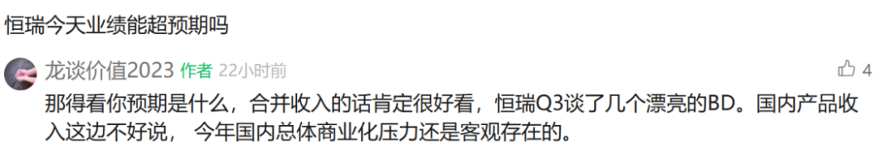
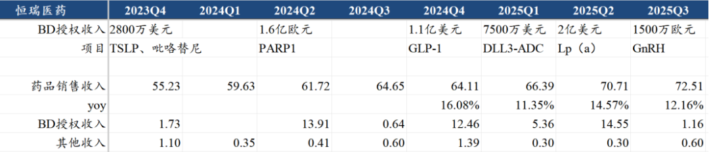
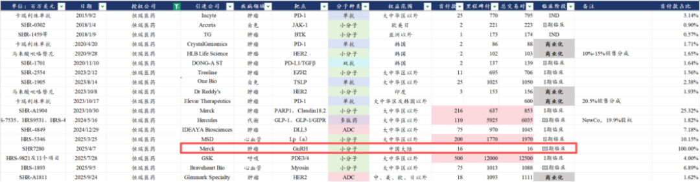
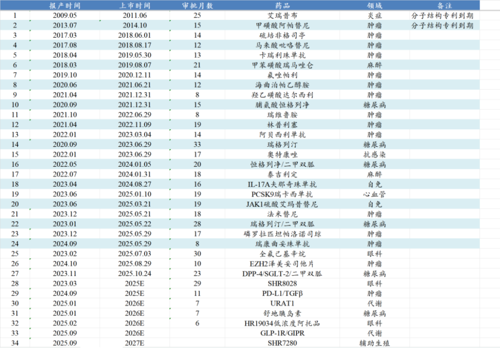

# 连云港现金王

大家好，我是龙哥。

昨晚恒瑞医药出了三季报，今天简单聊一下，昨天的文章也有读者问到恒瑞的业绩预期，龙哥给的回复如下。

实际业绩表现来看，恒瑞医药在三季度达成的BD授权并未在三季报利润表中合并，当然其收到的现金已经在现金流量表中体现，所以什么时候合并利润表其实并不重要了，对于其利润表更重要的还是其产品商业化这边的收入，商业化这边仍然呈现较大压力，这也是今天股价表现不佳的原因。

具体来看，恒瑞医药前三季度收入231.88亿元同比增长14.85%，其中Q3单季度收入74.27亿元同比增长12.72%，归母净利润57.51亿元同比增长24.50%，其中Q3单季度归母净利润13.01亿元同比增长9.53%，经营现金净流量91.10亿元同比增长98.68%，其中Q3单季度为48.10亿元同比增长209.78%。

截至三季度末恒瑞医药账上的现金已经超过400亿元，成为“连云港现金王”。

我们来拆分一下其业务结构：

根据三季报交流，恒瑞在今年Q3只合并了授权给德国默克GnRH的这笔交易，也就是BD授权收入大概是1.16亿元，我们根据恒瑞医药往年披露的AH股的财报/招股书推算其24Q3的药品销售收入是64.65亿元、BD授权收入是0.64亿元、其他收入约为0.60亿元，因此假设25Q3的其他收入仍为0.60亿元，BD授权收入为1.16亿元，则25年三季度药品销售收入为72.51亿元，同比增长12.16%，药品这边销售压力还是比较大。

药品销售这边，恒瑞医药这两年基本都是10%出头的增速，一方面是仿制药业务的拖累，直到24年报恒瑞医药依然有接近120亿的仿制药收入，占药品收入的比重还有43%，这些仿制药品种在未来几年会陆续出清；另一方面创新药国内销售方面恒瑞今年表现也不尽如人意，上半年创新药销售收入只有21.8%，并且恒瑞的员工持股计划对创新药销售收入的业绩考核也从30%的复合增速下调到25%的复合增速。

2025年以来恒瑞医药新获批了9款创新药、新获批了18个新适应症，这些新药和新适应症中大部分都会在今年底谈医保，纳入医保后26年有望开始放量，26年恒瑞医药的国内创新药收入很有必要让投资人看到较大幅度的改善。

利润端，按照BD收入扣除所得税计算非BD业务贡献的利润，24Q3约为11.334亿元，2025Q3约为12.025亿元，同比增长6.1%，利润端的表现比收入端更差。从Q3的利润表来看，销售、管理、研发费用都有不同程度的快速增长，还有一些应收账款减值等的资产减值计提。

创新药公司不是利润表完全不用看，但我认为利润表的意义不是很大，创新药公司如果有很好的管线，这两年哪怕巨额投入研发费用导致亏损我们也不怕，但如果没有很好的在研管线，哪怕利润表做的再好看也没太大意义，更何况恒瑞医药、复星医药、贝达药业等为首的国内不少药企还有进行研发投入资本化来美化利润表。

虽然恒瑞医药在三季报的利润表暂时还没合并三季度的几个大的BD授权项目，但现金流量表上，Q3单季度的经营现金净流入是48.10亿元，相当于收到了35亿-40亿元的BD授权款项，大概就是授权GSK获得的5亿美元首付款在Q3已经收到，授权Braveheart Bio的7500万美元首付款暂不确定是否收到，这两项大概率会在Q4确认收入。

至此，恒瑞医药通过海外BD授权收到的首付款就已经达到12.8亿美元，超过90亿人民币的现金，叠加其可能还收到部分里程碑付款，合计金额可能接近百亿。

还是龙哥在恒瑞中报解读时候提到的，在恒瑞医药创新药商业化高增长、创新药海外BD密集落地、账上现金突破400亿、市值超过4000亿的当下，调节那点报表端利润的意义真的已经不大，应该回到与国际MNC相同的财务规则下，对研发投入就全部费用化。

总体来看恒瑞医药披露出来的三季报比较平淡，没太多好讲的，但恒瑞医药在Q3的业务进展实际上是里程碑式的突破，Q3达成了3笔BD交易，合计接近6亿美元的首付款、140亿美元的里程碑付款，对于恒瑞来说是历史性的突破，恒瑞+翰森牢牢绑定了欧洲老牌顶级MNC葛兰素史克。

25年全年，恒瑞医药的BD授权贡献的利润预计将超过50亿元，预计会超过恒瑞药品销售部分的利润，“出海再造一个恒瑞”已经在25年成为现实，恒瑞的市值也重回AH医药股第一。当然，这并不是终点，恒瑞在后续创新药持续输出海外、国内商业化方面都还将持续面临挑战，仍需不断突破自己。

风险提示：本文仅讨论行业/公司经营情况，投资需综合考虑公司经营、估值、管理层等多方面因素，建议读者审慎参考，本文不作为投资依据，不建议大家根据本文做出投资计划。

<!-- wxmp-comments-begin -->

---

## 留言（24 条，含回复共 47 条）

- **胡超** 👍8 · 2025-10-28 16:26
  等爱博业绩出来，想龙哥再分析一下爱博[呲牙]
  - ↳ **作者** · 2025-10-28 16:29
    嗯，爱博看业绩情况
- **gaowei** 👍6 · 2025-10-28 16:24
  恒瑞的研发能力还是很不错的，感觉风险比其他小的药企低太多了。是否现阶段创新药最让人放心的还是药明和恒瑞？
- **Wayne** 👍3 · 2025-10-28 16:25
  最近医药板块都在跌，管他啥利好。
- **JMTerry** 👍3 · 2025-10-28 17:14
  泰格的三季度利润似乎有点进步
  - ↳ **作者** · 2025-10-28 17:16
    投资收益
- **雨化心声** 👍2 · 2025-10-28 16:29
  垃圾管理，二级市场运营，一塌糊涂。
  - ↳ **作者** · 2025-10-28 16:34
    如果四五千亿市值的公司都叫垃圾管理，让国内恒瑞以外的所有医药公司情何以堪啊？
- **yang.yang105** 👍1 · 2025-10-28 16:19
  龙哥 预期创新药还要调整多久？已经两个多月了。
  - ↳ **作者** · 2025-10-28 16:26
    这个问题就像上半年问我创新药还能涨多久一样，这和算命一样啊，我也算不到三生的BD、恒瑞的BD、石药的BD这些催化剂能不能落地、啥时候落地啊[捂脸]
- **嘎嘎** 👍1 · 2025-10-28 16:21
  恒瑞何时能出个国际上的重磅大药[惊讶]
  - ↳ **作者** · 2025-10-28 16:28
    现在BD授权出去的，呼吸科的TSLP、PDE3/4、代谢的GLP-1系列管线都还是有潜力的
- **尘缘** 👍1 · 2025-10-28 16:44
  今年获批的，明年进医保，进医院了也不意味着能快速放量。比如今年半年报披露，2021年底及2022年中获批的3款药，今年才开始快速放量，距离获批已经过去3年了。药品销售的事情，太复杂了。
  - ↳ **作者** · 2025-10-28 16:46
    是的，恒瑞的创新药商业化要是看数量，早就该爆发了，但这几年一直都是差强人意。
- **永樂** 👍1 · 2025-10-28 16:47
  龙哥你好，很想问一个问题啊，国内很多不知名药厂都在做仿制药。同一种药会有很多品牌，是否买国内知名品牌的仿制药（比如说恒瑞），就会比那些不知名的有效果。国内品牌的仿制药现在感觉真是不靠谱啊。谢谢
  - ↳ **作者** · 2025-10-28 16:48
    大厂的仿制药总体肯定还是要好一些的，哪怕都是同一家的原料药，制剂工艺差别也挺大的
- **何** 👍1 · 2025-10-28 17:03
  龙大，建发致新的竞争力怎么样啊
  - ↳ **作者** · 2025-10-28 17:07
    你给我问懵了，都没注意医药有这个新股上市了。做医疗器械分销业务的，兴趣不大。
- **和** · 2025-10-28 16:11
  不管业绩好不好大A先跌为敬[疑问]
  - ↳ **作者** · 2025-10-28 16:23
    这不是业绩不好嘛[捂脸]
- **廖书豪** · 2025-10-28 16:17
  希望龙哥下一篇文章讲讲泰格
  - ↳ **作者** · 2025-10-28 16:24
    泰格医药看三季报有没有值得讲的东西吧
- **凛风** · 2025-10-28 16:19
  太屁股涨幅太小了，好羡慕舒泰神这种[破涕为笑]
  - ↳ **作者** · 2025-10-28 16:25
    哈哈这样说的话值得羡慕的不少啊
- **雪山** · 2025-10-28 16:20
  龙哥，石药进入临床很多，管线也很丰富，却这么跌，看不懂了[捂脸]
  - ↳ **作者** · 2025-10-28 16:26
    见上一篇文章的评论区
- **大内总管** · 2025-10-28 16:21
  请教龙哥 今天的南微算是投资者用脚投票的结果吗....心塞呀[流泪]
  - ↳ **作者** · 2025-10-28 16:27
    南微和安杰思这俩，三季度都受国内政策面影响挺大的，业绩确实表现的差，股价就也这样了。。。
- **L.Henry** · 2025-10-28 16:26
  假如将研发投入费用化，走势还真可能突破一把[666]
  - ↳ **作者** · 2025-10-28 16:29
    这个我真是讲过好几次了，现在这个阶段了，恒瑞真没必要资本化研发投入了
- **薛盛根** · 2025-10-28 16:28
  今天上市的必贝特，怎么看？
  - ↳ **作者** · 2025-10-28 16:33
    必贝特目前是3款创新药在临床后期或者商业化阶段，分别是HDAC/PI3Kα、CDK4/6（国内近10家）、EGFR抑制剂（国内多家），后期管线不算非常有竞争力。
    禾元生物和必贝特是时隔两年科创板第五套规则重新放开后上市的首两家biotech，估值也都是直接一步到位。
- **雁哥 Kevin** · 2025-10-28 16:33
  能讲一下百济神州吗
  - ↳ **作者** · 2025-10-28 16:35
    百济今年讲的文章挺多的，翻历史文章吧，百济三季报之后看情况要不要再聊一下。
- **唐杰** · 2025-10-28 16:34
  ADC的几个管线数据都不及预期，双抗方面没有太大作为，反而糖尿病和心血管疾病方面有作为。手里握有大把现金，如果研发不行，不如收购
  - ↳ **作者** · 2025-10-28 16:36
    自免和代谢还可以，肿瘤这块恒瑞做的最好的确实还是小分子，ADC是进度快、数量多，可能后面还是要靠恒瑞的排列组合做联用。
- **水木二师兄** · 2025-10-28 16:42
  龙哥，云顶的耐赋康现在什么情况了
  - ↳ **作者** · 2025-10-28 16:43
    卖的很好啊，8月5个多亿，渠道铺货3个亿，纯销2亿个，9月纯销和8月差不多，之前中报的指引可能还能超
  - ↳ **作者** · 2025-10-28 16:45
    明年吧，今年应该做不到
- **我在楼脚搂实喊你** · 2025-10-28 16:49
  恒瑞24年三季度不是计入了2.75亿美元的BD收入吗？
  - ↳ **作者** · 2025-10-28 16:59
    24年前三季度计入了14.55亿元，24年上半年计入了13.91亿元，以此推算24Q3单季度大概是0.64亿元。
- **王勇** · 2025-10-28 16:58
  再鼎什么情况，今年都没涨最近跌成这样
  - ↳ **作者** · 2025-10-28 16:59
    见上一篇文章评论区
- **磊磊** · 2025-10-28 17:08
  老师药明康德业绩出来了，请您讲讲它，谢谢！
  - ↳ **作者** · 2025-10-28 17:17
    你猜猜看我昨天文章写的什么[偷笑]
- **K风自南** · 2026-02-03 07:48
  请问龙哥，恒瑞未来仿制药出清如何理解，是要逐渐将仿制药业务全部归零吗？谢谢。
  - ↳ **作者** · 2026-02-03 08:18
    也不会完全归零，但他确实仿制药新增品种很少了，未来收入体量和收入占比也会持续降低

<!-- wxmp-comments-end -->
