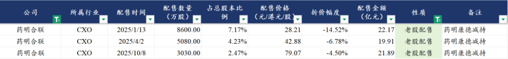
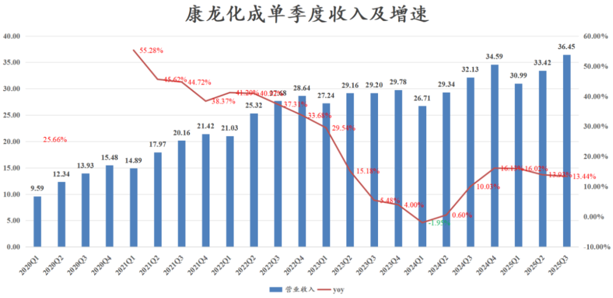

# 医药投资人，别再对Lige有任何期待

大家好，我是龙哥。

这两年，一众医药投资人的目光老是盯着药明系的大boss——Lige，基本已经形成了一个规律：①Lige减持——医药跌了——骂Lige，②药明系遭遇政治风险——医药跌了——骂Lige，③医药涨了——Lige又减持——医药回调——骂Lige。

实际上，一方面是Lige确实经常在市场热度较高、股价表现较高的时候去减持，另一方面也是投资人过于放大Lige的增减持行为，才共同在市场上形成一致预期，就是每次Lige减持的时候都要带着药明系乃至整个医药行业出现回调。

昨晚，药明康德再度公告，合计持股18.211%的公司实控人计划未来3个月通过集中竞价和/或大宗交易减持公司A股股份，减持规模占总股本的2%、不超过5967.5万股（预计集中竞价和大宗交易各1%），按最新收盘价计算约为63亿元。

怎么办？再带着CXO行业乃至整个医药行业跳？

龙哥今天想说，医药投资人是时候解除对Lige及其一致行动人坚持行为的过分关注，还是应该把更多关注点放在行业基本面，下文也会给大家梳理CXO行业总体Q3的情况。

1、减持行为并不代表行业趋势

就药明减持的问题，龙哥想和大家聊三点。

①与其埋怨别人不如提高自己。

药明减持——医药行业下跌，作为投资人大家难免有气，龙哥有时候也不可避免的在心里暗暗骂他两句，但说白了大家都是投资人，都是为自己的钱负责，Lige有本事在行情火热的时候做到高位减持这也是他的本事，我们作为投资人没有资格要求别人怎么做，只能加强自己对市场、行业、企业价值的判断能力，不说领先于Lige，至少能跟上大佬的节奏吧？

②减持与股价、基本面没有必然联系

药明康德、药明生物在2020-2021年期间，进行了多次大规模减持、大规模配售，每次减持、配售都是黄金买点，期间Lige及一致行动人在两家药明套现近千亿，那个阶段有人埋怨Lige吗？没有，人人都在夸他、夸药明能力强。基本面向上、股价向上的时候，减持、配股都不是事，基本面不够强的时候，才被作为理由去解释下跌。

同样的道理，我们此前统计过，药明康德在今年分3次减持药明合联，合计减持了64个亿的现金出来，占总股本的13.87%，药明康德今年第一笔减持药明合联是在今年的1月13日，减持的价格是28.21港元/股，难道你因为药明康德的减持就完全放弃掉这个CXO行业近三年景气度最高、竞争力最强的公司？

实际上药明合联今年累计涨幅是139%，药明康德这笔8600万股的减持后至今涨幅是160%，药明康德血亏35亿。更不用说还有第二笔在4月2日减持5080万股、减持价格42.88港元/股，至今涨幅也有70%，又血亏14亿，两笔交易少赚了快50亿元。所以，你们还觉得Lige是股神吗？

③Lige已经明确要几乎清仓持股

大概1-2年之前我们就大概清楚，Lige及其一致行动人对于药明系大概率是要卖掉大部分持股的，只是股价涨的快了就多卖一点，总体的趋势就是这样，如果大伙的投资始终被Lige的操作而影响，那基本未来几年可以不用看医药了，因为未来几年你还会再有很多次看到Lige的减持。

2、CXO行业景气度全面修复

在此前的文章《[创新药行情延伸](https://mp.weixin.qq.com/s?__biz=MzkyMzQ3MDc3Mw==&mid=2247484631&idx=1&sn=46d50979dcb5eb6edfbfb77cf83a7b18&scene=21#wechat_redirect)》给大家介绍了在创新药之后向CXO延伸的投资逻辑，在文章《[CXO行业全面加速](https://mp.weixin.qq.com/s?__biz=MzkyMzQ3MDc3Mw==&mid=2247484869&idx=1&sn=c2cff57e618e3686776c4799e7ab6003&scene=21#wechat_redirect)》中给大家介绍了主要的CDMO企业中报的情况，当时本来也想写一篇CRO这边的，但当时中报的时候除了普蕊斯以外的大部分CRO公司的业绩都还没完全企稳，订单价格也只是不再继续下跌，因此没有单独来聊CRO这边的业绩。

而到了三季度，我们看到CDMO行业业绩企稳向上的趋势在从一线公司逐渐向二三线公司蔓延，CRO公司的业绩趋势也开始向好，行业逻辑在进一步验证。

药明系我们就不提了，前两天的文章《[从药明康德业绩看CXO产业趋势](https://mp.weixin.qq.com/s?__biz=MzkyMzQ3MDc3Mw==&mid=2247485054&idx=1&sn=41e9ca5275aaf3663bd506db2bef8b4e&scene=21#wechat_redirect)》也有讲到了，我们来聊聊后面这些CRO/CDMO公司的三季度业绩情况。

平台公司：

①康龙化成：Q3单季度收入36.45亿元同比增长13.44%、单季度收入创历史新高，上一次创历史新高是24Q3-Q4。Q3单季度扣非净利润3.97亿元同比增长25.28%，经调整净利润4.72亿元同比增长13.97%，综合毛利率已经连续6个季度在34%左右震荡，其中临床前CRO的毛利率已经6个季度维持在历史较高位的45%左右，综合毛利率受到大分子和CGT CDMO业务的波动影响。前三季度康龙化成新签订单同比增长13%左右，新签订单也有所加速。

临床CRO：

②泰格医药：Q3单季度收入17.75亿元同比增长3.86%、环比增长5.29%，毛利率27.47%同比下降9.81%、环比下降2.67%，毛利率仍未企稳主要是目前执行的大部分还是去年的低价订单，归母净利润6.37亿元同比增长98.7%，扣非归母1.15亿元同比下降54.25%、环比增长6.24%。前三季度累计净新签订单近70亿元，同比实现中双位数增长，不含方达控股的Q3新签订单同比增速超过29%。

Q3单季度公允价值变动损益实现转正，单季度公允价值变动净收益为4.13亿元，投资收益2.07亿元，二者合计贡献6.2亿元的利润，这部分投资收益预计主要来自①中国生物制药收购礼新，②映恩生物IPO后股权价值上涨。泰格医药140亿的股权投资，在创新药一二级市场修复之际会再度成为其业绩放大器。

③诺思格：Q3单季度收入2.28亿元同比增长24.48%、环比增长10.10%，毛利率32.74%同比下降4.61%，归母净利润0.35亿元同比增长32.98%、环比下降1.69%，扣非归母净利润0.30亿元同比增长52.69%、环比下降0.22%。公司维持全年13亿新签订单的目标，预计同比增长20%-30%。

④普蕊斯：Q3单季度收入2.19亿元同比+9.84%、环比+2.47%，归母净利润0.33亿元同比+91.6%、环比-28.9%，扣非净利润0.31亿元同比+120.7%、环比-7.7%。24Q3为公司利润端最低基数的一个季度，因此利润端改善更加明显。Q3单季度毛利率29.11%同比提升8.3%、环比下降0.56%，毛利率已经连续2个季度出现显著改善，回到历史中高位水平（历史高位33%-34%，25Q1达到历史最低16%）。公司维持全年新签订单预期13亿元左右，也即回到2023年的水平。

CDMO：

⑤博腾股份：Q3单季度收入9.24亿元同比增长19.44%、环比增长12.65%，毛利率31.02%环比提升2.13%，归母净利润0.53亿元同比扭亏、环比增长68.6%，扣非归母净利润0.47亿元同比扭亏、环比增长186%。

⑥药石科技：Q3单季度收入4.99亿元同比增长30.36%、环比增长7.45%，归母净利润0.41亿元同比增长23.55%、环比增长11.40%，扣非归母净利润0.29亿元同比增长41.85%、环比下降1.88%，Q3单季度毛利率30.77%同比下降6.71%，主要是业务结构变化导致。

另外CDMO还有普洛药业CDMO业务前三季度收入增长19%，九洲药业CDMO业务前三季度收入增长15%。

生物制药上游产业链：

⑦奥浦迈：Q3单季度收入0.94亿元同比增长29.80%，归母净利润0.12亿元同比增长284%，扣非归母净利润0.08亿元同比增长2175%。奥浦迈的培养基实际上属于比较后段受益创新药行业景气度修复的子领域。

⑧纳微科技：Q3单季度收入2.57亿元同比增长22.56%，归母净利润0.45亿元同比扭亏、环比增长30.42%，扣非归母净利润0.40亿元同比扭亏、环比增长32.65%。

⑨赛分科技：Q3单季度收入1.20亿元同比增长81.4%、环比增长20.94%，归母净利润0.40亿元同比增长141%、环比增长32%，扣非归母净利润0.38亿元同比增长141%、环比增长65%。

行业各个细分领域主要公司的业绩摆在这里，已经不需要再做太多的修饰。

......

又到月底，开一次赞赏，10月的医药行情总体还是比较弱势，但是呢，持续上涨就会有读者不断留言说踏空了、等回调，真正中期回调来临了又有读者哀声载道亏钱了，总归市场行情不可能永远尽如人意，但在龙哥这里总会有数据详实、客观理性的文章等着大家。

本月赞赏任意金额的读者，还是可以送份资料，《中国创新药公司创新药收入及PS估值汇总》，资料在这两天三季报陆续出完后才能完成更新，需要的读者在后台私信留下邮箱，下周会给大家发到邮箱。

风险提示：本文仅讨论行业/公司经营情况，投资需综合考虑公司经营、估值、管理层等多方面因素，建议读者审慎参考，本文不作为投资依据，不建议大家根据本文做出投资计划。

<!-- wxmp-comments-begin -->

---

## 留言（14 条，含回复共 25 条）

- **Simon** 👍13 · 2025-10-30 09:47
  几乎满仓药明系，基本不慌，总不能吃肉的时候说真香，挨打的时候骂人吧。只是苦了那些冲进来一知半解的。从今天竞价来看，港股一开始是没怎么动的，A股开始竞价就大幅开跪了，侧面证明大A还是一个极度情绪化的市场
- **DRAGON** 👍12 · 2025-10-30 09:47
  对药明康德的管理层一如既往的失望，如不是看好这个行业和企业，早就卖出走人了
- **Aiolos** 👍8 · 2025-10-30 10:17
  本来现在cxo乃至整个医药行业都很弱势，更别说医疗一直在地上就没起来过，药明是回暖和业绩复苏的急先锋，他不仅是代表自己，更是行业的一种旗帜，给还在挣扎中的其他同行一点希望的那种，这时候减持真的伤害很大，主要是情绪上的伤害。我的康龙前段时间也是减持不断，但他的影响只限于自己，和药明的影响力完全不可同日而语。没办法，熬着吧，股票仓位在康龙，基金仓位在医疗医药，死扛~
- **刘帆** 👍5 · 2025-10-30 09:21
  请问在哪赞赏呢？
  - ↳ **作者** · 2025-10-30 09:23
    忘记开了[尴尬][尴尬][尴尬]
    在公众号主业给大家更新整理了一版历史文章合集，那个文章开了赞赏，大伙可以在那篇文章赞赏吧😂
- **大内总管** 👍3 · 2025-10-30 09:24
  财报季=龙哥高产期 
  龙哥生活中对嫂子是不是也很暖
  ps：请教爱博预计又得挪后几个财报期呢  近期各种医疗器械业绩不及预期  算不算是政策反转后的最后一次下跌了[捂脸]
  - ↳ **作者** · 2025-10-30 09:26
    爱博这个我就一整个无语，他们其实Q2就知道压力很大了，但Q2还是压货放业绩做的这么漂亮，完了以后Q3看欧普的业绩还可以，我以为爱博Q3至少也不会太差，然后拉了个大的，渠道去库存还是怎么样。看他们下午电话会怎么说吧。
- **卢光明** 👍3 · 2025-10-30 10:03
  药名这个减持也是尿性，我在犹豫药名还是恒瑞！[呲牙][呲牙]
- **峥嵘岁月** 👍1 · 2025-10-30 10:34
  请教龙总怎么评价兴齐眼药的估值，风险主要在于恒瑞等竞品吧，竞品的压力大么
  - ↳ **作者** · 2025-10-30 10:38
    其实吧，我现在感觉，竞争格局的影响似乎也没那么大，核心还是企业自己，三代EGFR十家竞争者了，国产还是翰森、艾力斯两家独大。恒瑞和兆科都要到26下半年获批吧，竞争肯定是增加的，但核心还是看兴齐自己的商业化能不能持续突破。
- **在远方** 👍1 · 2025-10-30 11:25
  龙大，创新药159992还能持有吗 重仓持有4年了，盈利15% ，后悔没切换到港股创新药，现在的形势还值得持有CS创新药吗，有什么好策略? 谢谢
  - ↳ **作者** · 2025-10-30 13:59
    159992今年才涨了不到30%，港股的创新药相关的ETF随便都是70%-80%，最早关注的老读者怎么之前一直不换呀，现在才来问策略[捂脸]
- **叶** · 2025-10-30 09:23
  请教迈瑞的拐点算来了吗
  - ↳ **作者** · 2025-10-30 09:29
    迈瑞这个拐点.......反正我觉得有点失望，虽然知道他应该也就是努力做个转正，但这.......哎就很难评。当然本身我对今年设备行业也没抱有多高的期望，看看除了两大出海龙头联影和迈瑞之外的设备公司也是惨淡的很。
  - ↳ **作者** · 2025-10-30 10:33
    1.5%的增长，感觉和考试考60多分差不多[破涕为笑]
- **zhz** · 2025-10-30 10:00
  龙哥，还有心脉医疗能简单点评一下吗
  - ↳ **作者** · 2025-10-30 10:05
    心脉就没太多看点，他去年Q3是降价的低基数嘛，当时降价的原因大家也都知道，今年Q3收入端同比就看着还不错。其他方面就和国内高耗行业总体的情况差不多，成熟产品总体还是有压力的。
- **童鹏** · 2025-10-30 10:08
  减持可能会被解读为对公司前景缺乏信心，Lige为什么要清仓持股呢？
  - ↳ **作者** · 2025-10-30 10:14
    实际上美股大部分的上市公司，实控人都会减到持股比例还剩非常低。这种也说不上信心不信心的，就像文中说的，他们能不知道合联今年爆单吗，照样卖卖卖。
- **Sirius** · 2025-10-30 10:23
  龙哥，一直关注泰格，现在主要配合创新药etf和恒生医药etf，泰格昨天拉个大阳线。请教龙哥，是否应该在这俩etf里面分配一点到泰格，博个弹性啊？
  - ↳ **作者** · 2025-10-30 10:26
    ETF里怎么配泰格，你意思是从ETF转个股吗？泰格也不是说他自己怎么样，就本文内容写到的，主要是临床CRO这边总体还是有业绩企稳的迹象了。
- **xxxxXY** · 2025-10-30 10:54
  想不通泰格比康龙涨的好
  - ↳ **作者** · 2025-10-30 10:59
    有什么想不通的，康龙H今年涨了86%，泰格H今年涨了49%
- **Bryan** · 2025-10-30 11:14
  相比康龙，其实药名从估值还能下手一点...搞不懂为何康龙A为什么一直那么贵，康龙H还好有些折价...
  - ↳ **作者** · 2025-10-30 13:57
    其实康龙从上市以来一直隐含着一个净利率提升的逻辑，他的净利率到现在也只有10%左右，你看康德的净利率都干到多少了，普通临床前CRO、常规CDMO的净利率基本都有20%+。

<!-- wxmp-comments-end -->
