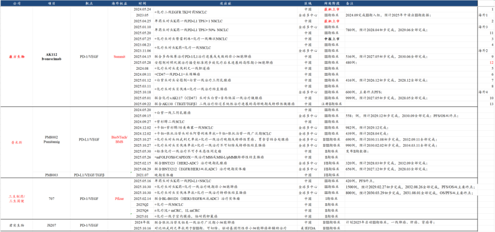
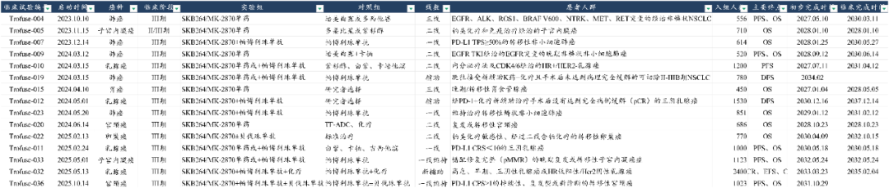
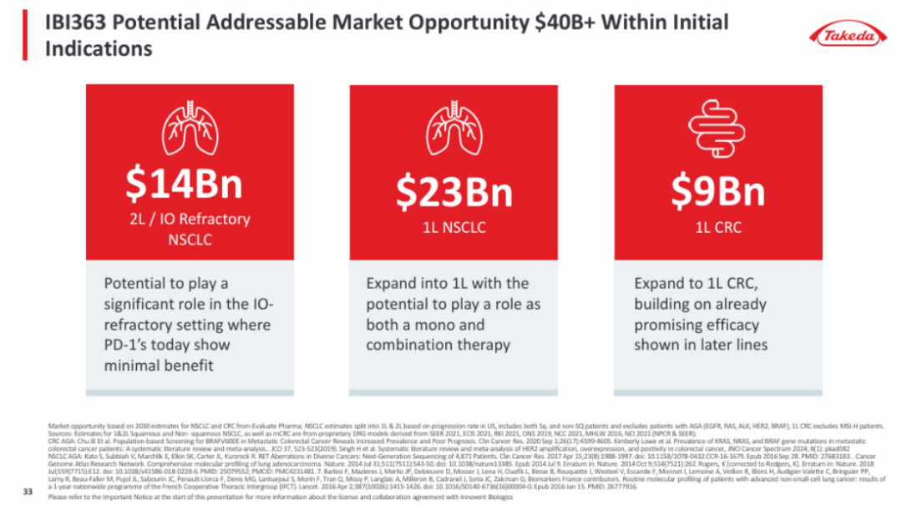

# 创新药重磅品种重回C位

大家好，我是龙哥。

上周讲到的创新药三季度后更新已经发送完毕，因为后台会自动屏蔽部分发联系方式的消息，所以如果有赞赏的读者留言了但没收到邮件，记得再重新发一次。

IO双抗是我们今年反复讲到的创新药最重要的细分领域之一，去年和今年也诞生了多个中大市值的牛股，5月份创新药行情的加速就来自三生制药的巨额BD《[创新药520的浪漫是三生制药给的](https://mp.weixin.qq.com/s?__biz=MzkyMzQ3MDc3Mw==&mid=2247484530&idx=1&sn=e240f64a1a2d6cac85cd2fa6c0b6b8ed&scene=21#wechat_redirect)》，而8月以来的本轮创新药行情大幅回调之后，行业的反弹又是来自三生和IO双抗，同时信达生物、康方生物等也有系列催化。IO双抗重回创新药C位。

1、三生制药

10月30日，辉瑞注册了PD-1/VEGF双抗PF-08634404（三生制药/三生国健的707）两项全球III期临床，进度早于市场预期。

在没有经过在美国做桥接临床的情况下，辉瑞敢于直接启动两项合计入组2300人的全球大III期（超10亿美金级别的临床花费），展示辉瑞对该项目的重视程度和信心，也展示辉瑞的执行力和政府关系能力。

两项大的III期临床也是PD-1/VEGF的IO双抗潜力最大的两个适应症——联合化疗一线治疗肺癌、联合化疗一线治疗结直肠癌，并且都是以PFS和OS为双终点。

此前Summit已经对依沃西启动了这两项临床的全球III期临床，其中一线肺癌还算领先较多，一线肠癌的全球III期则几乎已经是前后脚，如果Summit还是自己来做一线肠癌的大III期，入组进度和完成临床时间很可能会被美国顶级MNC辉瑞给反超。

此前我们的文章《[聊几个创新药行业大家最关心的问题](https://mp.weixin.qq.com/s?__biz=MzkyMzQ3MDc3Mw==&mid=2247485007&idx=1&sn=45e247c9104c79fb75f049c267247e33&scene=21#wechat_redirect)》里有讲到，市场对于创新药的预期，不应该过于关注BD授权的首付款、总交易对价，这是决定BD项目质量的因素之一，但绝不是全部。

实际上如果是为了炒股票为目的的BD，那单看首付款、总交易对价确实比较重要，只要能授权出去就行，管他是不是一锤子买卖。

但是如果是真正为了公司本身非常有信心的项目未来的全球价值最大化做的BD，那么更重要的实际上是后续海外持续的临床开发进展，科伦博泰就是最典型的案例，科伦博泰的TROP2-ADC在授权之初并没有被市场那么重视，科伦博泰IPO时候市值130亿还有投资人认为并不便宜，随着默沙东的海外临床推进——陆续启动15项全球III期临床、合计计划入组超1.4万名患者、临床花费可能要达到大几十亿美金，以及科伦博泰陆续发布卓越的临床数据，才得以实现市值节节攀升、达到千亿级别。

2、信达生物

武田制药三季报后交流展示对IBI-363（PD-1/IL-2α）的市场空间的预测，预计二线肺癌的潜在市场空间140亿美元，一线肺癌潜在市场空间230亿美元，一线结直肠癌潜在市场空间90亿美元，合计潜在市场空间超过400亿美元。

信达生物布局的下一代IO双靶点药物PD-1/IL-α此前百亿美金的BD落地，股价不但没涨，反而带着行业大跌，对很多投资人的信心打击比较大，荃信生物超预期的BD落地后行业进一步下跌更是击垮了不少投资人对创新药行业的信心，龙哥这的后台留言也是一片哀声载道。

但实际上不可否认的是信达生物的这个BD也是比较优质的BD，在《[抱歉，迟到的重磅交易解读](https://mp.weixin.qq.com/s?__biz=MzkyMzQ3MDc3Mw==&mid=2247485043&idx=1&sn=41734cf8e35cb68d80fde9aae0505be4&scene=21#wechat_redirect)》中给大家详细分析了这个BD对于武田制药和信达生物双赢的意义。现在武田制药初步给了较高的市场空间（不是销售峰值）的预期，后续的临床开发也值得期待。

3、康方生物

康方生物近期公布了AK112+化疗头对头替雷利珠单抗+化疗一线治疗鳞状非小细胞肺癌的III期临床PFS结果，到明年上半年有可能可以读出OS结果，AK112头对头K药一线治疗PD-L1阳性NSCLC的III期临床此前也已经读出过PFS结果在未来1-2个季度也有望读出OS结果。

康方生物读出OS结果不仅是对康方生物和Summit有重要意义，对于整个PD-1/L1\*VEGF为基础的IO双抗、三抗都有重要意义。

......

最后提一句，由于再鼎医药、百济神州、诺诚健华三家公司的三季报分别要在11月上旬和中旬发布，因此对国内创新药商业化这边的三季报总结，我们就在这三家创新药公司发布三季报后再进行总体的分享，目前可暂时参考龙哥给大家分享的数据。

风险提示：本文仅讨论行业/公司经营情况，投资需综合考虑公司经营、估值、管理层等多方面因素，建议读者审慎参考，本文不作为投资依据，不建议大家根据本文做出投资计划。

<!-- wxmp-comments-begin -->

---

## 留言（6 条，含回复共 13 条）

- **吴俊** 👍4 · 2025-11-03 00:03
  请问龙大怎么看不同技术疗法（ADC,双抗甚至CAR-T等)之间的关系？
  比如科伦博泰的trop2-ADC和三生信达康方的IO双抗，都算是泛癌创新药，会构成竞争吗？还是说联用甚至是协同的关系？多学龙大[抱拳]
  - ↳ **作者** · 2025-11-03 00:04
    第二代IO之间可能未来会有一定竞争，ADC药物与IO之间在个别适应症可能会有竞争，但总体未来更大的潜力还是IO+ADC的联合疗法。
- **Zg** 👍2 · 2025-11-03 00:26
  龙哥，商保目录纳入百万级的car-t，振奋人心，市场空间有望打开啊
  - ↳ **作者** · 2025-11-03 00:30
    如果能纳入的话，的确是好消息，但随之而来的问题是，哪些保险公司的哪些险种会按照商保目录报销？能覆盖多少患者群体？
    毕竟之前已经有些险种纳入了CART并且作为卖点去推。
- **气宇轩昂** 👍2 · 2025-11-03 00:29
  请问龙哥怎么看乐普医疗的BD?谢谢
  - ↳ **作者** · 2025-11-03 00:30
    时间上早了点，但这笔交易看起来比较一般，还要看后续怎么运作。
- **frank** 👍1 · 2025-11-02 23:54
  龙哥，资料没领到诶，怎么补领啊
  - ↳ **作者** · 2025-11-03 00:03
    私信留下邮箱。
    另外借这条留言提示一点，近期有多位读者留言问有没有读者群。这里明确，除本公众号及同名雪球账号外，无其他账号，无读者群。
- **Bryan** 👍1 · 2025-11-03 01:37
  龙哥好~
  1. 之前6-7月份卖早了，9-10月份小额做空也拿不住回补早了，前几天我也觉得信达有点错杀捞了点，哈哈；
  
  2. PD-1/L1-VEGF,    
  2.1 康方与summit预期，BNTX与三生都在开大适应症临床，一方面在增加技术路线的信心，但一方面似乎又是竞争了，但他们都不会头对头AK112, 所以是不是还是先看谁获批？这三家会在细分有特色差异嘛？例如BNTX走的是PD-L1路线；
  2.2 交易感受，三生我是觉得有点贵，BNTX开了5个大适应症一线临床，BD映恩的临床也不错，但股价这的不温不火，T都没得做拿着感觉很鸡肋； 康方/summit, 如果都在低位肯定选康方，如果赌AK112似乎不如直接summit？
  2.3 有他们三家珠玉在前，其他后排PD-1/L1-VEGF是不是没必要看了？
  - ↳ **作者** · 2025-11-03 08:51
    现在肯定不会做头对头的，差异嘛可能有一点但我估计不会很大，后面可能推广能力比较重要。
    BioNTech也挺有意思，BD给BMS的交易其实挺不错的，但美股好像对BD的模式给不上高估值，和国内投资人想要的不太一样[破涕为笑]
  - ↳ **作者** · 2025-11-03 08:52
    后排的如果能有好的MNC合作方的话还能看看，要么就是适应症能有点差异化竞争的。PD-1能上量的基本也就是两家嘛，再往后的就天花板不太高了。
- **长林浅水** 👍1 · 2025-11-03 08:14
  sum的肠癌是以PFS为终点，辉瑞也能超？
  - ↳ **作者** · 2025-11-03 08:54
    实际上我有点怀疑美国一线肠癌能不能用PFS去批，如果FDA再临时变卦要求OS终点，患者数不够到时候OS终点再达不到也是麻烦事。

<!-- wxmp-comments-end -->
