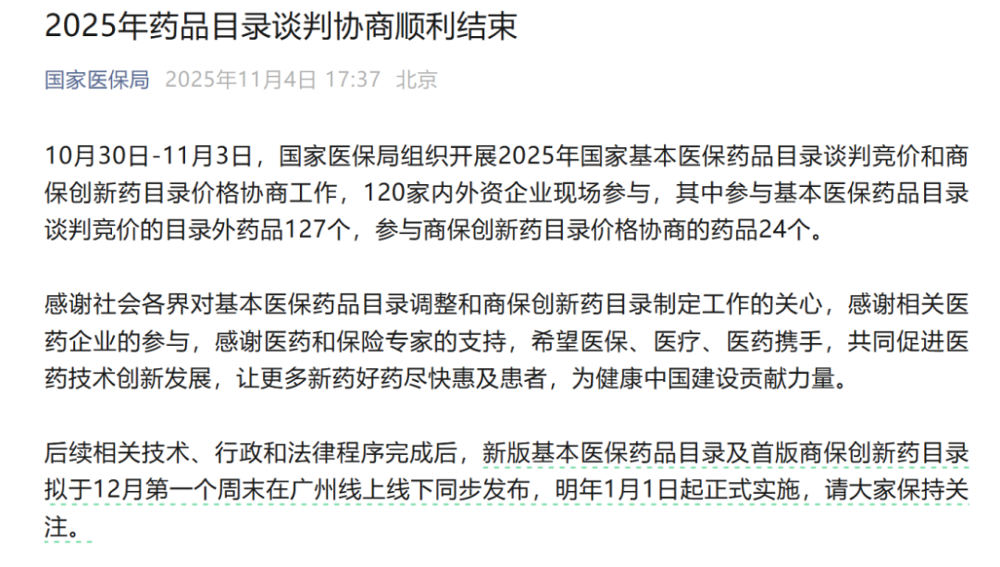
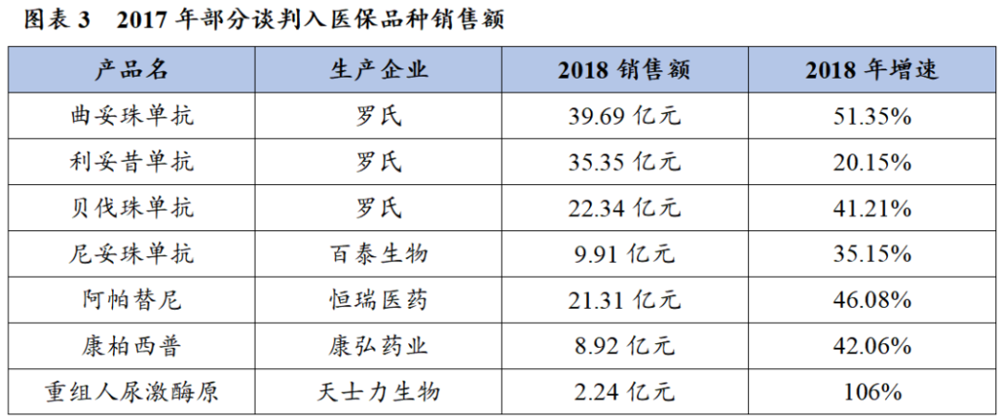
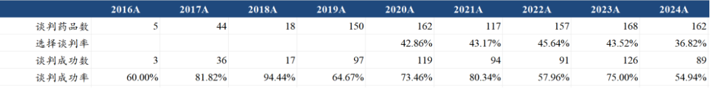
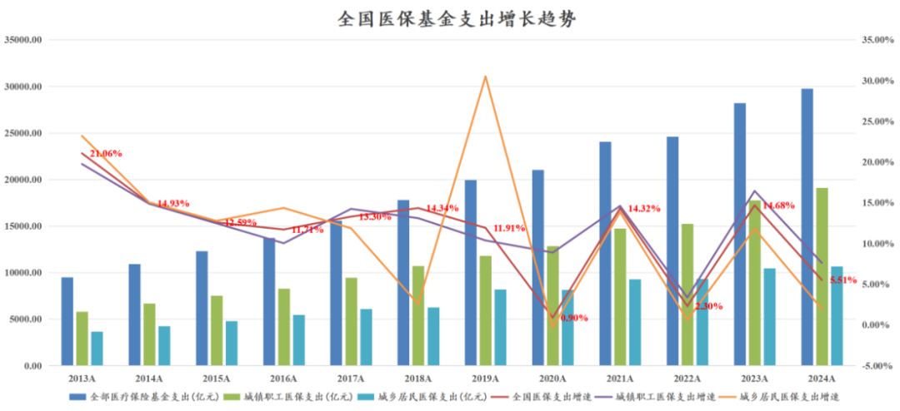
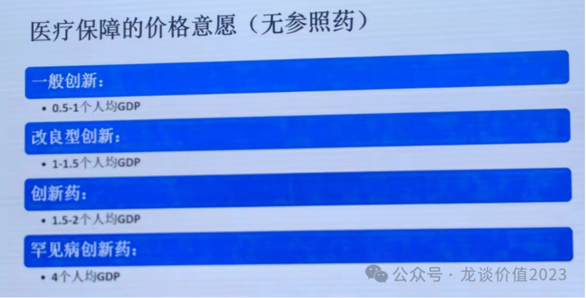
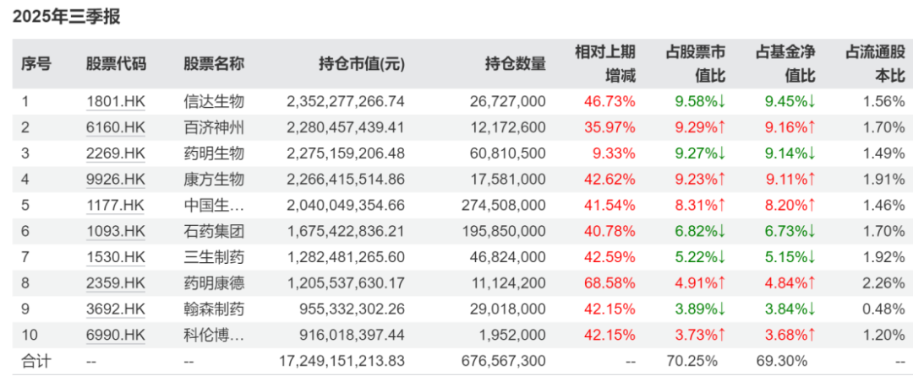
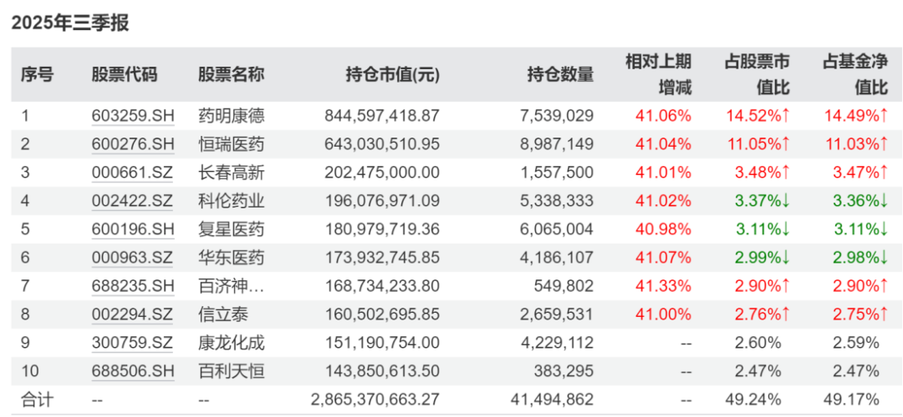

# 创新药十年，又是新的起点

大家好，我是龙哥。

国家医保局在昨日宣布为期5天的2025年国家医保谈判梳理结束，有120家内外资药企参与今年的医保谈判，包括有127个目录外产品参与基本医保药品目录谈判竞价，还有24个产品参与了商保创新药目录价格协商，最终结果将在12月的第一个周末发布，并在2026年1月1日开始执行。

从龙哥2019年开始写公众号的6年多以来，每年都会有多篇文章聊医药政策，尤其是23-24年和大家花了很多时间聊医保政策的变化，实际上现在医保政策的很多变化我们在2021年的创新药行业报告里就已经有预判，关注龙哥久一点的老读者一定都有印象，直到现在谈到2016年以来的医保谈判、2022年底看到政策面拐点，再到2024年以来的基本面和股价逐渐形成共振，再到创新药出海预期彻底点燃这轮创新药行情，还是有点唏嘘的。

不管今年市场对于创新药出海在估值中打入了多高的预期，对于各位投创新药行业的投资人来说，不论你投的是港股创新药ETF（513120），还是A股创新药ETF（515120），亦或者是一众AH创新药个股，每年底的医保谈判还是必须要关注的一年一度最重要的医药政策，而今年的创新药医保谈判与往年又有不同——首次纳入了商保创新药目录的价格协商。

在2016-2025年整整10年的国家基本医保目录价格谈判后，我国的医疗支付体系开启了新的篇章，商保在创新药支付中开始站上历史舞台。我们本文就商保对创新药的影响做一个讨论。

1、商保目录推出背景

大部分投资人对国家医保谈判的记忆都是2017年，实际上第一次医保谈判是在2016年，那年谈判了5个创新药，最终有3款药物成功通过谈判降价并纳入国家医保目录，分别是第一代EGFR抑制剂埃克替尼和吉非替尼，以及乙肝药物替诺福韦酯。2017年的医保谈判有44个品种，但其中大部分品种也都是上市多年的老品种，我翻看当年的报告时看到这样一个图，大家可以感受一下当年进医保的品种现在的情况，最大的贝伐珠已经突破百亿市场，曲妥珠超70亿市场，利妥昔最高超50亿市场，康柏西普25年也将成为超25亿销售额的大药。

再到2018年18个肿瘤药进行“专场”国谈，新医保局成立后，质变出现在2019年，150个创新药进行谈判，97个品种成功纳入医保，包括70个医保外产品新增纳入医保，大批药物通过医保谈判纳入医保，是2020年全面医药牛市的背景之一。

此后每年的医保谈判数量基本在160个左右，谈判成功的数量基本在100个左右，到今天，国谈对于国内创新药产业发展的意义已经无人质疑，今天读这篇文章的很多读者可能无法理解，在2019年，龙哥要写2万字的长文去解读和讨论医保谈判政策的长期意义。

国家医保对于创新药的意义如此重大，并且此前的文章我们用了很多的篇幅去讨论国家医保，但我们也必须要认识到，所谓的医保一系列的砍价，核心原因还是国家医保的能力是有限的，随着经济体量的扩大、GDP增速的降速、人口老龄化的趋势，医保基金的收支都在显著降速，医保局也越来越强调“保基本”的原则。

所以去年的文章里有给大家展示过国家医保的角度对于创新药的定价意愿：

注意以上改良型创新、创新药的定义并不是药监局定义的那个改良新药和1类新药，医保定义的改良新药实际上更类似于我们讲的me better的新药，医保讲的真正的创新药其实是我们说的best in class、first in class的新药，而国内大部分公司开发的实际上都是me too甚至me worse类的新药，在医保的眼里属于一般创新，定价区间是0.5-1倍人均GDP。

2018年中国人均GDP是6.08万元，如果按照1-2倍的人均GDP计算，me better和BIC/FIC新药在国家医保能获得的定价区间大概是6-12万元的年用药费用；2024年中国人均GDP是9.57万元，按1-2倍人均GDP计算大概是10-20万元的年用药费用，从我们此前历年梳理的创新药国谈价格来看总体还是比较匹配的，到24年有个别进口的FIC/BIC新药已经可以突破20万/年的定价上限，但也不会偏离太多。对于罕见病药物如果能达到4倍人均GDP的定价，也就是年用药费用可以达到40万以上。

但以上定价机制就会存在明显的问题，最直接的就是欧、美、日同样的创新药定价以美元计价可能都不止以上定价水平，例如百济神州的泽布替尼在美国的定价是1.25万美元/月，在中国的定价是1.02万元/月，和黄医药的呋喹替尼在美国的定价是2.52万美元/月，在中国的定价是7500元/月，BCMA-CART在美国的定价是46万美元，在中国的定价是120万元。

即便是国内CAR-T细胞疗法定价120万元，已经是中国和欧美之间价差较小的创新药了，这个价差依然有2.7倍以上。

传奇生物BCMA-CART目前在欧美的销售预计25年会接近20亿美元，在高定价、高规模的情况下，目前传奇生物毛利率还是在60%附近波动，可见CAR-T疗法的生产成本之高，国内做CAR-T商业化的药明巨诺也是40%-50%的毛利率，距离扭亏尚且遥遥无期。

对于研发/生产成本高、创新性强、定价高的创新疗法，个人自费只适用于极少数人，国家医保无力覆盖，唯有依靠商保可以提高这类药物的可及性。

2、商保创新药目录推出的意义

商业健康险此前已经对部分创新药有支付，从2019-2023年每年都有50个左右的新特药纳入商业健康险的支付范围，到2023年底累计有441种药品纳入商业健康险的支付范围，其中56%是肿瘤药，仅从纳入品种的数量来说甚至要超过国家医保的创新药医保谈判目录的药品数量。看着纳入品种很多，但现实意义不大。

2024年中国商业健康险的收入规模合计是9774亿元，赔付总支出大概4000亿出头，赔付率仅有41.5%，这其中重疾险约有4600亿元，我们知道重疾险是一次性赔付的金额，不直接涉及对医疗行为包括创新药的支付（患者可自费用药），除此以外的医疗险和惠民保大概合计5000亿左右的规模，这些医疗险+惠民保合计赔付金额大概在3300多亿，赔付率在65%左右。

国家基本医保的赔付率一般都在80%-85%之间，这还是在包含大量政府补助的情况下，如果只计算居民端收支，则赔付率可以高达104%，欧美的商业健康险赔付率也普遍在80%以上、甚至可以达到90%。赔付率低是中国商业健康险的一大问题。

另一个问题就是对创新药械的支付不足，上文提到截至2023年底纳入商业健康险的创新药品种达到441个，但根据《中国创新药械多元支付白皮书（2025）》的数据，2024年商业健康险对创新药和创新器械合计的支付金额也仅有124亿元，在赔付金额中的占比仅有3%，可以说是完全没有起到商业健康险应该起到的补充基本医保、支付高价创新药械的理论价值。

因此，国家推出创新药商保目录的意义不可谓不重大，可以说是从政策层面改善商业健康险对创新药的支付。

未来商业健康险对创新药的支付提升空间体现在几个维度：

①商业健康险本身收支目前每年有高个位数增长，尤其是在国家逐渐规范商业健康险行业、基本医保保基本的属性被更多人明晰后，商业健康险的需求还会持续增长。

②当前医疗健康险65%的赔付率显著低于全球商业健康险运营较为成熟国家的80%以上的水平，也显著低于国家基本医保的水平，未来有望向80%以上去提升，将带来商业健康险20%以上的行业增量。当然，这个同样是需要行业性的规范，包括医保数据共享以显著降低保险公司的运营成本。

③美国商业健康险的支出端，对处方药的支付比例大概是42%，按照美国80%的创新药金额占比，大概是34%的创新药支付占比；我国不可能达到这么高的创新药占比，即便未来达到40%，对应商保对创新药的支付比例也应该达到15%-20%的水平。

基于以上假设来测算，未来10年医疗健康险按7%的复合增速计算到2035年约1万亿的规模，按赔付率达到80%计算赔付金额约为8000亿元，假设对创新药的支付占比20%约为1600亿元。这1600亿元中如果大部分作为国家基本医保的补充，来支持高价创新药的支付，对整个国内创新药研发和商业化都会形成显著的撬动作用。

实际上我们看这次商保目录进行价格协商的品种，就包括了几乎所有的国内已经获批上市的CAR-T疗法，并且这些CAR-T疗法大概率都可以成功纳入商保创新药目录，真正为创新性强、患者获益显著的CAR-T疗法在中国的可及性提升向前迈出一步。

因此，商保创新药目录哪怕当前还有较多客观存在的问题、较多困难需要去解决，正如上文所述，哪怕是国家基本医保谈判，也是历经几年的试点和尝试，最终全面铺开，商保创新药目录的规则和流程完善可能也需要较长周期的摸索，但我们也必须要承认，这是商保对创新药支付迈出的一小步，但却是医疗支付端改革迈出的一大步。

3、创新药投资

自年初到8月的强势上涨后，创新药板块回调已有3个月，不管是对产业发展节奏还是股价表现，市场分歧巨大，10月以来行业出现诸多公司的利好消息，股价却常反映为易跌难涨，投资人对行业的信心也产生了较大波动。

但我们要知道，在前一轮创新药高位时，仅年内涨2倍以上的医药公司就有超过40家，翻倍公司更是不胜枚举，对于这类高波动、高弹性的行业我们在9月中旬测算的行业10年潜在复合回报率也只有中个位数。

创新药未来的空间还有多大？在行业回调后，我们还是要多从产业趋势的角度聊聊。

创新药国际化仍在如火如荼，创新药国内商业化可能处于过去10年、未来30年行业放量增速最好的几年，政策面支持与国际化爆发的行业，别说在医药行业，在全行业也并不多见。

行业β角度，这两年我们一直在强调ETF投资的价值，例如目前规模最大的、也是大家比较熟悉的，广发基金管理的港股创新药ETF（513120），持仓占比70%的前十大重仓股基本全面覆盖了港股创新药+CXO的核心标的。

ETF基金和主动管理基金在选择逻辑上有很大的差别，主动管理基金在规模达到一定程度后会遇到管理的瓶颈，专业做FOF的投资人很多都几乎不会碰规模超过100亿的主动管理基金。但ETF基金是“规模的朋友”，规模越大越好。

ETF基金的规模越大，①具有更好的流动性，从而降低投资人的交易难度、提高便利性，流动性是ETF最重要的指标，②规模大的ETF，规模效应可降低管理成本。513120是港股创新药规模最大的ETF，流动性更是大幅好于其他同类ETF，多个交易日的单日成交额甚至可以达到百亿元以上，在这点上的优势是其他品种无法匹敌的。

除了港股创新药ETF以外，A股创新药ETF也有广发的515120创新药ETF，规模和流动性也是行业头部水平，不过由于A股创新药权重更加分散，前十大重仓股的集中度大概在50%左右。

风险提示：本文仅讨论行业/公司经营情况，投资需综合考虑公司经营、估值、管理层等多方面因素，建议读者审慎参考，本文不作为投资依据，不建议大家根据本文做出投资计划。

<!-- wxmp-comments-begin -->

---

## 留言（20 条，含回复共 44 条）

- **Seplues** 👍6 · 2025-11-05 11:13
  最后投资没有明确的观点啊？现在适不适合入？
  - ↳ **作者** · 2025-11-05 11:26
    其实吧你关注两年半了，我文章对行业投资观点一直挺明确的，一直是比较务实、讲数据讲逻辑的。
    对交易我从来不给建议，每个人投资风格、预期回报、风险承受能力、认知水平、仓位、交易习惯差异都非常大，我如何给投资建议？
  - ↳ **作者** · 2025-11-05 11:59
    说了增速最快的几年
- **喻力** 👍6 · 2025-11-05 11:58
  现在持股创新药体验太差了，信心瓦解中
  - ↳ **作者** · 2025-11-05 12:03
    你别说现在了，历史上创新药从来都是高波动高弹性的板块，就在一年多以前还有大量公司处于跌80%+甚至90%+的深坑里呢，中长期持股体验向来都不好。我理解你说的持股体验好可能就是波动小一点、中长期跟着产业趋势连续上涨，创新药很难这样，即便在美股也是只有部分MNC和个别新兴biopharma可以做到。
  - ↳ **作者** · 2025-11-05 12:05
    也是因为意识到个人投资者在承担波动时的局限性，所以我这两年基本一直聊ETF，今年这波港股创新药ETF 的涨幅并不小，近期指数回调幅度也是小于大多数个股的。
- **阿杰** 👍5 · 2025-11-05 11:19
  爱博四季度和明年一季度，业绩是不是没希望了？
  - ↳ **作者** · 2025-11-05 11:27
    目前判断不了，q2在行业已经很差的情况下他做了很好的业绩，q3又多方面因素导致业绩很拉，这个季度波动现在判断不了，至少行业层面β还是差的。
- **Haley华** 👍5 · 2025-11-05 11:26
  老师百济神州后市咋看？据说明年会有十倍左右的业绩放量。
  - ↳ **作者** · 2025-11-05 11:31
    你说的业绩放量指的是利润吗，这个倍数没啥意义啊，百济的确进入利润释放的阶段了，今明年利润端增长肯定是很好看的。
    但创新药公司估值核心决定因素是在研管线，现有商业化品种以及盈利预期很大程度已经包含在估值里。
- **Y.Y** 👍5 · 2025-11-05 11:57
  个人感受，商业健康险起付线还是比较高的，我自己高血压，有一款药就不在医保范围，要自费，但是这部分根本达不到赔付线。这也是商业健康险利用率低的一个原因。
  - ↳ **作者** · 2025-11-05 11:58
    是的，国内商业健康险还是有很大的提升空间的，国内自费比例还是太高，各方面的改变，希望能以这次商保创新药目录调整为契机逐渐改变吧。
- **木子先森** 👍5 · 2025-11-05 12:22
  龙大，想咨询下春立的三季报，以及前景。谢谢。
  - ↳ **作者** · 2025-11-05 12:39
    春立三季报其实挺明确的啊，他因为是骨科里出海比例目前最高的，所以今年财报最好看。他们选择也是对的，在国内继续卷下去，毛利率高一点低一点，价格高一点低一点，有什么意义呢。
- **宝克文具用品** 👍4 · 2025-11-05 11:25
  麻烦问下：迈瑞医疗最近喋喋不休，是有什么问题吗？
  - ↳ **作者** · 2025-11-05 11:40
    还是来自业绩压力
- **9527568** 👍4 · 2025-11-05 11:39
  药明康德减持为什么对股价打压这么严重？业绩非常好啊
  - ↳ **作者** · 2025-11-05 11:43
    发了很好的业绩之后老板减持把筹码卖给你，必然会引起投资人的担心或者反感呀，放任何一个公司都是这样。
  - ↳ **作者** · 2025-11-05 11:54
    药明不是第一次高位减持了，大家记忆深刻、伤害极深，所以很多人这波都没买CXO
- **知行** 👍4 · 2025-11-05 13:01
  龙哥，联影三季报还可以但是股价也被砸，迈瑞感觉还没见底啊
  - ↳ **作者** · 2025-11-05 13:04
    联影主要是我感觉也说不上太好，环比q1增长也不多，同比增速高主要是去年基数太低了，但很多人解读为超预期。
- **游子** 👍3 · 2025-11-05 11:17
  龙大，请教疫苗是彻底不行了吗？与牛市绝缘
  - ↳ **作者** · 2025-11-05 11:29
    疫苗他主要是行业内卷+需求端也差，所以只有少数新品种在放量周期的还可以，我之前已经很久没跟踪疫苗行业，今年中报的时候又梳理了一遍行业内所有公司的在研管线，目前来看各家还是陆续有一些新品种上来，至于商业化做的怎么样还是各凭本事，咱们后面再跟踪看看。
- **劉** 👍3 · 2025-11-05 11:31
  迈瑞今年能做到100亿利润就不错了，请问2026年前瞻能给到多少PE区间
  - ↳ **作者** · 2025-11-05 11:37
    确实，迈瑞今年100亿利润可能都够呛，他这个所谓的三季报增长回正，给人的感觉也是做的非常勉强，公司可能想说拐点是收入拐点，我们投资角度要看产业、看毛利率，不仅是看个收入同比增速。
- **雨化心声** 👍3 · 2025-11-05 11:36
  龙大，恒瑞的药做的这么好，为什么二级市场这么拉胯，机构抛售这么厉害？今年都他喵的废了，回到去年10月了
  - ↳ **作者** · 2025-11-05 11:40
    恒瑞A股今年涨了36%，和A股创新药指数差不多，确实没有非常明显的超额收益。只是恒瑞历史上估值也一直没有特别便宜过，你看我9月中旬那个文章测算行业空间的时候，龙头公司的市值空间也做了测算。
- **YANd** 👍3 · 2025-11-05 11:49
  以中国的企业和监管尿性，对商业报销赔付率的提高空间是不是有点乐观，或者未来虽然提高了但耗时会很久很久很久很久。。。
  - ↳ **作者** · 2025-11-05 11:50
    其实我感觉10年的周期足够做到，如果监管真的愿意去做，按基本医保目前的情况，其实应该挺急迫的......
  - ↳ **作者** · 2025-11-05 11:53
    是很紧迫，但这也只是节流，开源才关键，但似乎上峰不急[得意]
- **没耳朵的老虎** 👍3 · 2025-11-05 11:50
  龙大，诺思兰德入您法眼吗？我是您的老粉了[偷笑]
  - ↳ **作者** · 2025-11-05 11:53
    首先得纠正，是老读者，大伙读的是殷实的文章，不是粉我这个人。
    诺思兰德不是说入不入的了法眼的问题，是我确实不太能判断他这个产品后面商业化到底有多大机会做起来，要再学习学习。
- **廖书豪** 👍3 · 2025-11-05 11:50
  龙哥，请问凯莱英三季度miss的原因是因为多肽类项目订单延迟交付确认造成的吗，三季度产线利用率不高，又在新建爆产能，有这么多订单吗有点看不清楚
  - ↳ **作者** · 2025-11-05 11:56
    季度波动我也不太想过度解读，从产业角度q3几乎就凯莱英一家不尽如人意，我觉得可以再观察交流一下后续的订单和业绩释放情况，对cxo这边除非政治风险再有大的敞口，否则我认为没有啥悲观的必要啊。
- **翠华路** 👍3 · 2025-11-05 12:19
  龙大能占有你几分钟说说上海谊众吗？谢谢
  - ↳ **作者** · 2025-11-05 12:38
    上海谊众那个改良化疗药能不能卖起来我一直是将信将疑，而且他销售老是miss，给人的感觉是不太好的。
- **松明** 👍2 · 2025-11-05 11:57
  龙大能唠唠康龙化成的前景吗？
  - ↳ **作者** · 2025-11-05 12:00
    康龙化成跟上行业β应该没太大问题，只是也跟踪了多年，相比比较优秀的最头部的企业，康龙的表现的确还是有点差强人意了。
- **燃烧吧我的不惑之年** 👍2 · 2025-11-05 12:48
  龙大能说说晶泰控股嘛，最近跌的比较厉害
  - ↳ **作者** · 2025-11-05 13:03
    晶泰你翻翻我历史文章的留言区就知道了，我是确实不知道他这怎么给估值，涨的时候不知道，跌的时候也不知道。
- **spurs** 👍1 · 2025-11-05 11:29
  能说一说药明生物的前景吗？
  - ↳ **作者** · 2025-11-05 11:33
    新读者朋友我建议翻一翻我前两天发的历史文章合集，里面有对cxo行业尤其cdmo、药明系的一些讨论，比我在留言里一两百字说的清楚的多
- **知行** 👍1 · 2025-11-05 23:44
  龙哥，你觉得未来创新药新的股价支撑上涨预期在哪呢？现在对BD都过敏了的背景下
  - ↳ **作者** · 2025-11-05 23:47
    过去的炒作模式，BD是股价驱动因素，但BD只是创新药出海的一个开始而不是结束，BD之后需要海外临床注册推进，逐渐提升确定性或者失败，对应的估值调整。

<!-- wxmp-comments-end -->
