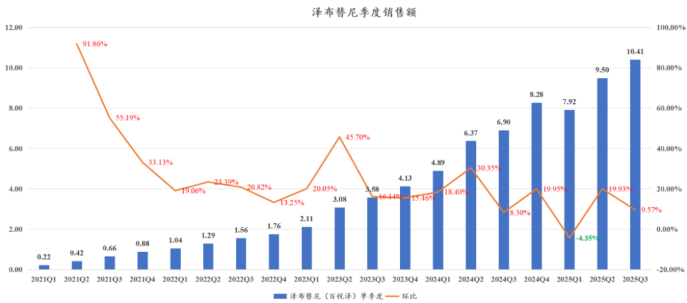
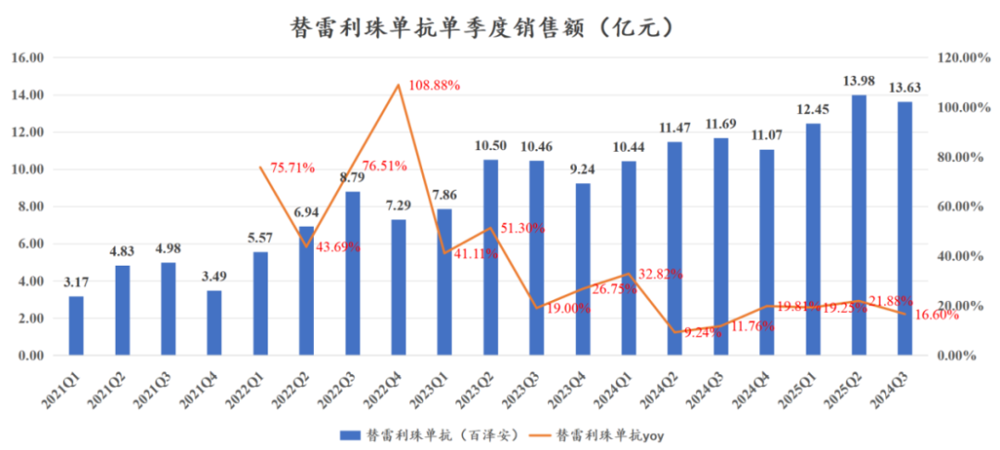
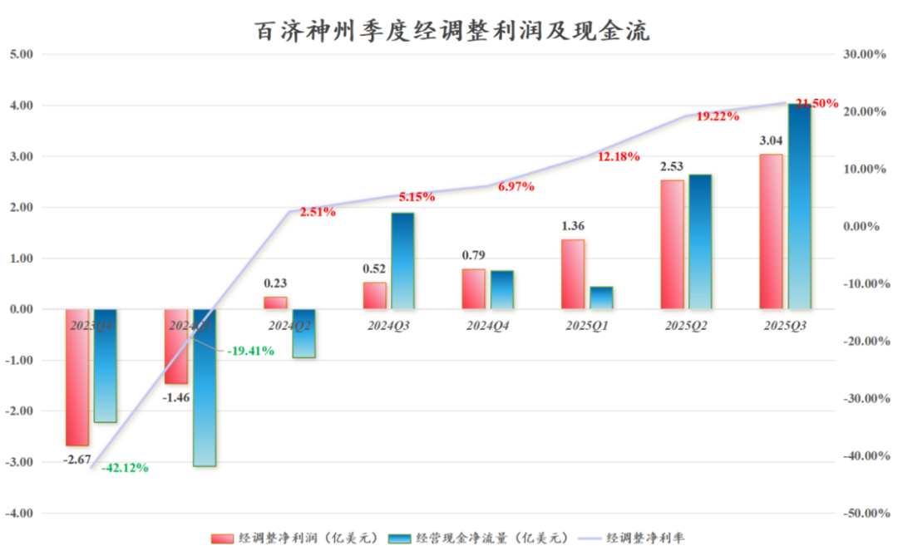
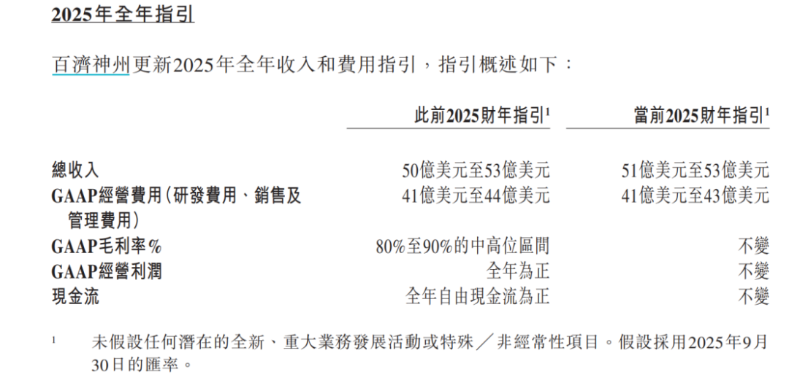
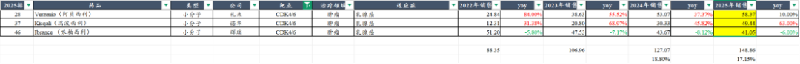

# 创新药之王利润爆表

大家好，我是龙哥。

百济神州昨晚发布了三季度业绩，作为国内已经毫无疑问的创新药之王，百济神州非常生动的给各位展示了一款创新药大药在全球开发和商业化过程中的收入、费用表现和利润释放节奏，不论是跟踪百济神州，还是未来研究其他创新药全球商业化的标的，都是比较典型的一个案例。

1、三季度业绩

百济神州前三季度实现营业收入275.95亿元同比增长44.21%、其中产品收入273.14亿元同比增长43.86%，Q3单季度收入100.77亿元同比增长41.14%、其中产品收入99.54亿元同比增长40.62%，从收入端来看随着基数的提升，收入增速有所放缓。

具体产品来看：

①泽布替尼前三季度收入27.83亿美元同比增长53%，仍是公司主要收入增量来源，其中美国收入19.90亿美元，欧洲收入4.29亿美元，中国区收入18.53亿元。

Q3单季度泽布替尼收入10.41亿美元同比增长50.8%、环比增长9.57%，其中美国区收入7.43亿美元环比增长7.10%，Q3美国区收入占比提升至74.3%，欧洲区收入1.63亿美元、收入占比16.3%，中国区收入6.61亿元环比增长9.80%。

上篇文章说到中美创新药价差的问题，泽布替尼在美国单月用药费用约1.61万美元，其中到百济报表上的收入是1.25万美元，以此推算百济在美国Q3卖了7.43亿美元（约53.5亿元）大概对应5.94万盒；而在国内的月用药费用是1.02万元/盒，在国内Q3销售6.61亿元对应销量是6.48万盒，8倍的销售额差距，国内销量还更多。

②替雷利珠单抗前三季度收入40.06亿元+19.23%，Q3单季度收入13.63亿元+16.60%。PD-1海外已经在美国和欧盟等多个市场获批多个适应症，估计百济会搭着卖一卖、初步搭建一下实体瘤的商业化团队，为未来后续实体瘤管线的全球临床和商业化做准备。

③代理及其他品种前三季度收入33.58亿元同比增长24.63%，Q3单季度收入11.68亿元同比增长17.3%，代理品种增速相对偏低。

利润端，Q3毛利率85.9%同比提升3.1%，其中产品毛利率86.3%同比提升1.4%；Q3研发费用4.46亿美元同比增长10%，销售及管理费用4.34亿美元同比增长14%；公司前三季度归母净利润11.39亿元，净利率4.13%，Q3单季度归母净利润6.89亿元、净利率6.84%。

前三季度经调整净利润47.29亿元/6.93亿美元（去年同期-4.74亿元/-0.71亿美元），Q3单季度经调整净利润3.04亿美元（去年同期0.52亿美元），25年Q1-Q3经调整净利润分别为1.36亿美元、2.53亿美元、3.04亿美元，经调整净利率分别为12%、19%、22%，前三季度经营现金净流量7.1亿美元，Q3单季度为4.03亿美元，经调整净利润和经营现金流均大幅提升。

在百济维持高强度研发投入的情况下,全球化的大品种在利润端开始爆表。这就是创新药国际化的魅力。

截至25Q3末，百济神州在手现金41.1亿美元，有息负债9.5亿美元，净现金31.6亿美元。

公司又略微上调了全年的业绩指引，上调的不多，就不再赘述。

2、研发管线更新

在研管线方面，25年三季度以来也有一些进展：

①Tarlatamab塔拉妥单抗（DLL3\*CD3）：百济神州与安进合作开发的全球首款实体瘤TCE，此前8月25日百济神州宣布把该产品的海外分成权益以8.85亿美元现金+0.65亿美元潜在付款卖给Royalty Pharma，不得不说百济的格局还是相当不错的，每年拿销售分成对百济这样志在成为全球顶级biopharma的公司来说并没太大意义，不如回笼现金投入到自研管线的开发中。塔拉妥单抗在国内已经于25年7月递交上市申请，用于二三线治疗广泛期小细胞肺癌，有望在26年获批上市。

②BGB-11417索托克拉片（BCL-2）：百济神州仅次于亚盛医药在今年4月和5月分别递交了r/r CLL/SLL和r/r MCL的国内上市申请（亚盛的BCL-2利沙托克拉治疗r/r CLL/SLL已经在今年7月获批上市），如果能赶在26年630之前获批，还有机会与亚盛一起参与26年底的国家医保谈判；单药治疗r/r WM的注册II期临床和联合泽布替尼一线治疗CLL/SLL的全球III期临床都已经完成患者入组，r/r MCL获得美国FDA的突破性疗法认定，有望在今年底之前向FDA递交r/r MCL的上市申请。公司还将在26年上半年启动联合泽布替尼头对头阿卡替尼+维奈克拉的全球III期临床。

③BGB-16673（BTK CDAC）：百济在今年2月和5月分别启动了单药对照研究者选择疗法和单药对照礼来匹妥布替尼（第三代非共价BTK抑制剂）的全球III期临床，在Q3已经完成首例患者入组。公司预计26H1有望读出支持加速获批上市的r/r CLL的临床数据。

④BGB-43395（CDK4）：百济在今年的ASCO上披露了CDK4抑制剂的早期临床数据，但由于随访时间太短，没有太大的参考意义；到三季报时间，百济宣布调整CDK4抑制剂的开发策略，不再开发二线治疗的适应症，直接去挑战一线治疗的大市场——将在26H1启动一线治疗HR+/HER2-乳腺癌的全球III期临床，因此也不会再披露二线治疗的数据。这个选择对于百济来说属于“孤注一掷”，主要是HR+/HER2- BC目前竞争确实也比较激烈，二线治疗有AKT、PI3K、HER2-ADC、TROP2-ADC等多种创新疗法的竞争，导致二线治疗的市场趋于碎片化。

公司直接打一线治疗的市场，如果能成功成为一线治疗标准疗法，甚至未来可以继续往辅助/新辅助推进，则可以直接抢占目前全球150亿美元的CDK4/6抑制剂的市场。这也是百济继泽布替尼后又一次的“背水一战”。

⑤BG-C9074（B7-H4 ADC）：这是百济以4000万美元首付款+12.87亿美元里程碑付款自映恩生物引进的一款ADC药物，到今年三季度已经完成概念验证，有望在26年进入III期临床，这对映恩生物来说也是个好消息。

此外在肿瘤领域公司还有BG-58067（PRMT5抑制剂）、BGB-B2033（GPC3\*4-1BB）两个早期项目已经完成概念验证。

自免领域，公司首款自免领域CDAC药物BGB-45035（IRAK4 CDAC）已经完成中重度类风湿性关节炎的II期首例患者入组，且预计26年上半年启动特应性皮炎的II期临床；BGB-16673（BTK CDAC）已经完成慢性自发性荨麻疹的Ib期首例患者入组。

......

8年前，百济神州背水一战，毅然开启与伊布替尼的头对头之路，最终战胜伊布替尼，赢得今天的收入和利润释放。但百济并未沉浸于胜利的喜悦，Bcl-2、CDK4又开启或即将开启新一轮的背水一战。百济已然亮剑，成功与否尚未可知，国际MNC的气质已经尽显无疑——光明正大的通过头对头国际大三期战胜最强大的对手——要做就要做全球最顶级的药物。

风险提示：本文仅讨论行业/公司经营情况，投资需综合考虑公司经营、估值、管理层等多方面因素，建议读者审慎参考，本文不作为投资依据，不建议大家根据本文做出投资计划。

<!-- wxmp-comments-begin -->

---

## 留言（28 条，含回复共 54 条）

- **龙谈价值2023** 👍13 · 2025-11-07 15:11
  补充一条，25Q3伊布替尼加速下滑，泽布替尼市占率进一步提升，自24Q4泽布替尼实现单季度超越阿卡替尼，预计26年泽布替尼将实现季度超越泽布替尼。
- **c. 🧸໊** 👍11 · 2025-11-07 15:12
  现在谁都救不了创新药
  - ↳ **作者** · 2025-11-07 15:15
    今年AI产业趋势下最火的A股通信板块涨63%，电力设备板块涨52%。今年恒生医疗涨69%，港股创新药指数涨82%。有什么好救的啊，不就涨多了正常回调吗，新易盛过去2年有2次跌幅超过50%的回调，需要有人去救新易盛吗。
  - ↳ **作者** · 2025-11-07 15:20
    2024年10月-2025年4月，新易盛回调6个月，最大跌幅55%，也确实被骂死了。不知道这个算不算回调很短。
- **卢光明** 👍5 · 2025-11-07 15:11
  龙大，药名跟恒瑞二选一，因药名的减持放弃了，不过想在药上挣钱感觉好难[呲牙]
- **HY** 👍4 · 2025-11-07 15:15
  龙哥觉得目前创新药是中期调整，还是整个大周期已经见顶，要像21年之后连跌几年？
  - ↳ **作者** · 2025-11-07 15:19
    是中期调整还是周期见顶，核心还是看产业逻辑，只要产业逻辑是顺畅的，实际上鸡犬升天之后回调很正常。
    产业逻辑是怎么样的？看国内商业化，看商保政策落地，看出海BD，看海外临床推进，这几个角度你只要稍微看看，都不会认为是周期见顶。
- **廖书豪** 👍4 · 2025-11-07 15:24
  看见大家都在骂，感觉又可以加仓了，不过创新药持股确实体验不大好[旺柴]
  - ↳ **作者** · 2025-11-07 15:26
    你看到的大家都在骂，还只是翻出来的一小部分，还有大量没翻出来的更消极的发言，哈哈
  - ↳ **作者** · 2025-11-07 15:36
    想起前半年大家都在骂半导体的时候，
- **喻力** 👍3 · 2025-11-07 15:18
  医药怎么办？业绩好也是跌成狗了
  - ↳ **作者** · 2025-11-07 15:21
    百济AH股今年都涨了73%，百济A股还创了历史新高，跌成狗说谁也说不到百济吧。
- **刘杰-lj** 👍3 · 2025-11-07 15:40
  看好了目标，悄悄干就是了。小套一点也无妨😃。
- **Rita .Z** 👍3 · 2025-11-07 16:23
  创新药最近在震荡，以为可以了，又不行了。以为不行了，又可以了。
- **Andrew Tang** 👍2 · 2025-11-07 15:25
  龙哥，BG-C9074 (DB 1312)，是 B7-H4 靶点ADC，而非B7-H3；DB 1311，B7H3 靶点，BD 给BNT 了
  - ↳ **作者** · 2025-11-07 15:28
    是的是的，笔误，感谢提醒，已经改过来了，最近看映恩看的比较多，写B7-H3写顺手了，哈哈，感谢感谢
- **人间白加黑** 👍1 · 2025-11-07 15:13
  这么看，确实已经是创新药一哥，超越恒瑞了。
  - ↳ **作者** · 2025-11-07 15:22
    实际上如果只看创新药收入，百济在2022年就已经超越恒瑞了，后面差距是在持续拉大的。
- **求索者** 👍1 · 2025-11-07 15:30
  百济泽布之后仍然缺一款大药
  - ↳ **作者** · 2025-11-07 15:31
    是的，所以现在CDK4又开始背水一战
- **晴明** 👍1 · 2025-11-07 15:49
  龙哥，映恩生物最近看的啥，是不是有调研结果要出来啦[呲牙]
  - ↳ **作者** · 2025-11-07 16:50
    就是日常的调研，龙哥每周都要调研好多家公司
- **lin** 👍1 · 2025-11-07 17:02
  龙大，能说说前沿生物吗
  - ↳ **作者** · 2025-11-07 17:04
    前沿Hiv的药没啥好看的。他小核酸还在临床前，太早了，啥也看不到，我不太喜欢投这么早期的。
- **小鱼** · 2025-11-07 15:08
  三生制药是又有什么大雷吗？跌的亲爹都不认识？
  - ↳ **作者** · 2025-11-07 15:25
    三生我前两天刚去公司调研过，雷应该是没什么雷，公司各方面还是比较平稳的，市场预期多变，你要找理由解释股价总归是能找到的，但不要自己吓自己。
- **希格拉之耀** · 2025-11-07 15:09
  特朗普大药房对BD有啥影响，能谈谈
  - ↳ **作者** · 2025-11-07 15:24
    他那个对BD能有啥影响，他那个不就是搞了个新的直销渠道嘛。美国对药品控价的想法是已经明确了，执行层面我们之前也分析过，IRA法案还是最重要的抓手，其他的都是表面工程大于实质。
- **清澂** · 2025-11-07 15:45
  药明有看头吗？大佬
  - ↳ **作者** · 2025-11-07 16:51
    翻翻历史文章啦
- **Rose@RTS | LED Factory | 13Years** · 2025-11-07 15:45
  龙大 再鼎这次Miss业绩了 没得救了
  - ↳ **作者** · 2025-11-07 16:53
    8月11日的文章....
- **半岛饭盆** · 2025-11-07 15:54
  百济神州引入映恩B7H4的条款公开了吗，之前说没公开的
  - ↳ **作者** · 2025-11-07 16:50
    招股说明书里有哦，读的不仔细吧[偷笑]
- **gaowei** · 2025-11-07 16:02
  龙哥，既然亚盛医药的BCL-2抑制剂产品领先上市了，也算是有一定能耐，长期来看市值能否达到百济神州的五分之一。或者你帮忙判断亚盛值不值500亿港币市值
  - ↳ **作者** · 2025-11-07 16:33
    国内先上市这个事不是很好比，就像文中说的，泽布替尼在美国的销量还不如中国，在美国的销售额是中国的8倍，血液瘤还是看海外。亚盛的bcl-2目前也在开国际多中心的III期，还有几个临床在规划或者申报，看点肯定是有的，也是创新药国际化的公司里比较值得看的一家，估值需要跟着临床进展一步步的看。
- **文萃Rossoneri** · 2025-11-07 16:05
  没有催化剂。[撇嘴]
  - ↳ **作者** · 2025-11-07 16:54
    这就是这轮创新药回调的原因之一，资金只想炒催化剂而不是中长期投资产业趋势，短线资金来的快去的也快，对应板块尤其是小票涨的快跌的也快。
- **Ddan** · 2025-11-07 16:15
  特朗普让减肥药大降价怎么看？短期算是给创新药又补了一刀？
  - ↳ **作者** · 2025-11-07 16:30
    短期是这么说，但那个降价，哎，就大部分人也是没研究过、只玩标题党的，回头我抽空再给大家解读下这个事。
- **Frank** · 2025-11-07 16:22
  龙大：国证港药回调近20个点了，怎么看？[破涕为笑]
  - ↳ **作者** · 2025-11-07 16:29
    怎么看，都在留言里了，翻翻留言区吧，哈哈
- **老船长** · 2025-11-07 16:35
  老板药捷安康风险大吗，
  - ↳ **作者** · 2025-11-07 16:56
    [尴尬][尴尬][尴尬]药捷安康在我朴素的认知里，在现在的估值跌80%都还贵。这种短线的妖股不用问我这种看基本面的人的观点，耽误赚钱，看图看资金流向呗。
- **专坑队友123** · 2025-11-07 16:35
  川普大药房，对于上游的多肽公司影响如何？老大
  - ↳ **作者** · 2025-11-07 16:56
    其实出厂价没降多少，生产成本那点没啥影响。
- **丽慧** · 2025-11-07 16:36
  拿的减肥创新药，天天跌，翰宇药业。能见到曙光吗？买点不好，又没及时止损。导致今年亏损
  - ↳ **作者** · 2025-11-07 16:57
    我问题是，也没人说过翰宇是减肥创新药吧[囧]
- **曲凯** · 2025-11-07 16:37
  cdk4好像研发日披露的数据不行？
  - ↳ **作者** · 2025-11-07 16:57
    就是太早了，随访时间很短，没太大参考意义，类似基石药业那个PD-1/VEGF/CTLA-4三抗在ESMO发的数据也是，随访时间都太短了。
- **阿榔** · 2025-11-07 16:54
  龙哥，能否说下再鼎，贝马是不是彻底黄了，艾加莫德放量是否放量不及预期，再鼎还有戏吗？
  - ↳ **作者** · 2025-11-07 16:59
    bema两个III期都挂了，这个基本是无了。
    艾加莫德放量大幅不及预期。
    公司中报时候其实当时测算下来就必然是要大幅下调全年指引了，但公司嘴硬不调整，到三季报终于兜不住了大幅下调，蠢得让人无话可说。
- **ALL-IN** · 2025-11-07 20:44
  最近乐普医疗跌的爹妈不认，是不是因为为民生物的BD不及预期啊，当天高开低走，还是有什么其余什么情况。望解解惑。感谢
  - ↳ **作者** · 2025-11-07 21:09
    前两天的留言里有回答过，我感觉这个BD是低了，但最近跌主要也是行业都在跌，未必是他自己有啥大问题。

<!-- wxmp-comments-end -->
