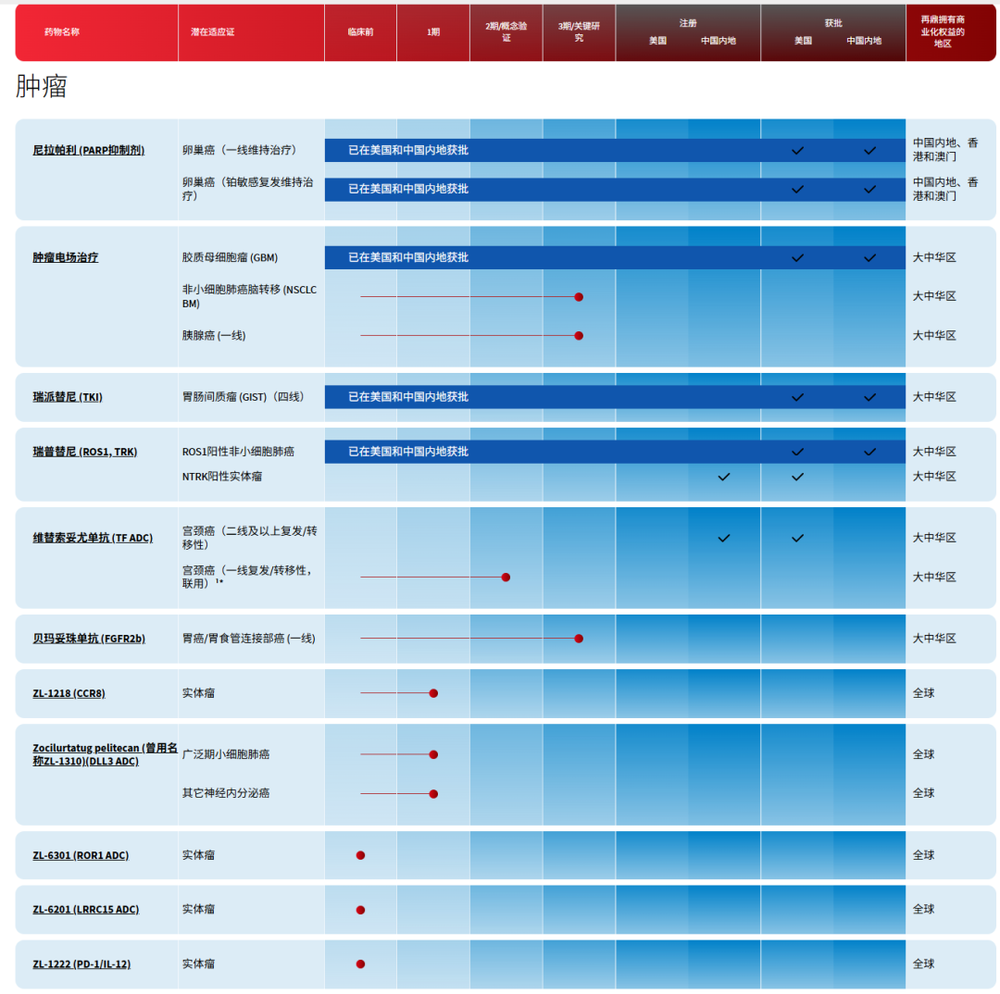
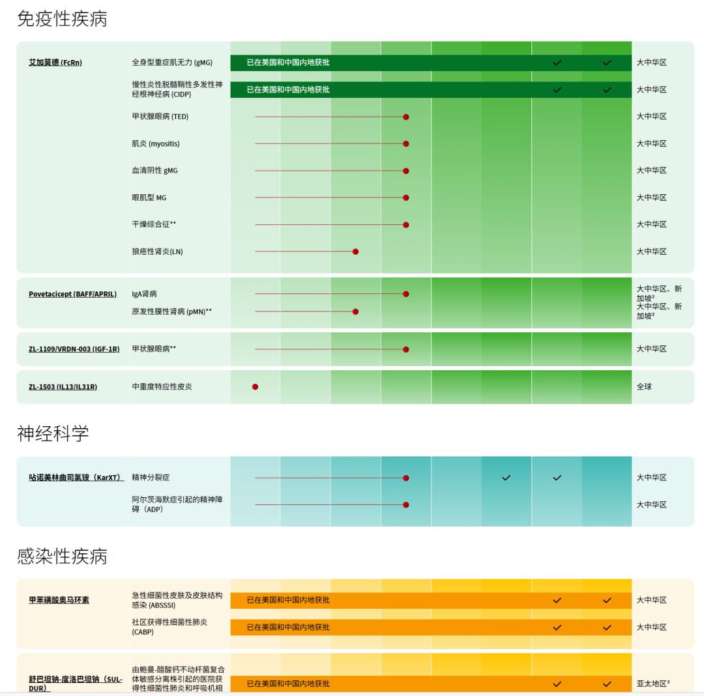
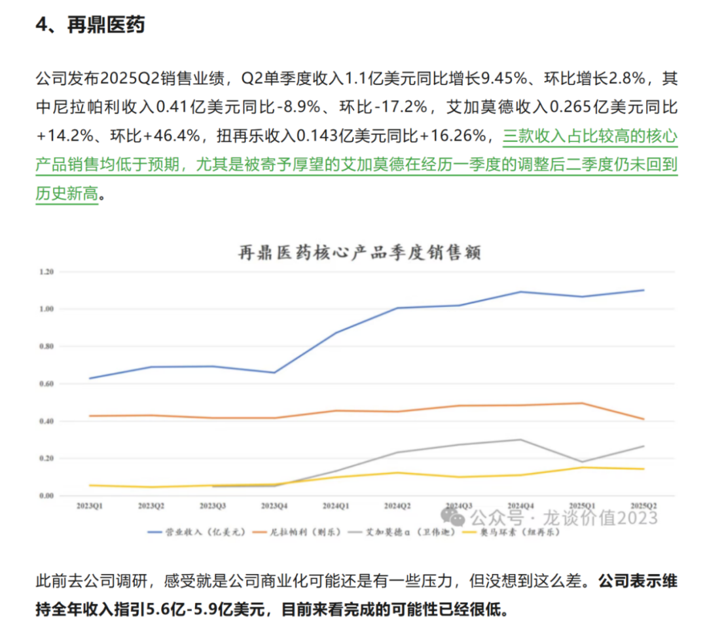
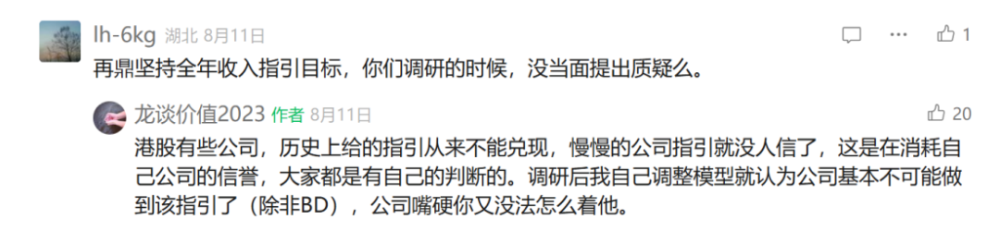
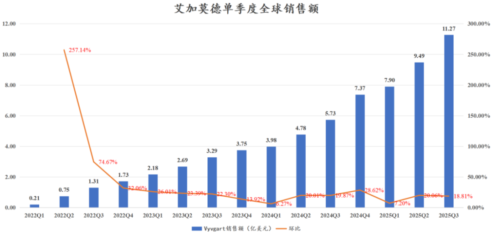

# 再鼎医药，何至于此

大家好，我是龙哥。

你可以说再鼎医药爱吹牛，但不能说他眼光差，BD引进的模式成功引进了一系列的全球FIC/BIC的项目在国内推进到临床后期和商业化。再鼎医药，产品管线不可谓不强大。

原本这种短期跌多了或者涨多了的标的龙哥都不爱再去“落井下石”或者“火上浇油”，但对再鼎医药有些话实在是不吐不快。

在几家美股上市的国内创新药公司中报解读的文章《[中国创新药美股五虎剧烈分化](https://mp.weixin.qq.com/s?__biz=MzkyMzQ3MDc3Mw==&mid=2247484834&idx=1&sn=985827b5491440939c3898141bf5a3e3&scene=21#wechat_redirect)》中，我们就曾讲到再鼎医药的情况，当时公司中报表现已经是大幅miss，完成全年指引的概率已经非常低，但公司依然嘴硬不调整全年指引，直到Q3业绩继续大幅miss，不得不下调指引，将全年产品收入预期下调至4.6亿美元。

当时我们的点评如下：

过去6个季度，再鼎医药单季度的营业收入分别是1.01亿、1.02亿、1.09亿、1.07亿、1.10亿、1.16亿美元，在艾加莫德、奥马环素、舒巴坦、瑞普替尼等多个新品种处于上市早期快速放量阶段的情况下，公司居然6个季度的收入累计仅增长了15%。

公司对市场指引国内销售峰值要做到10亿美元的艾加莫德，在独家占据市场、成功纳入医保的背景下，在2024Q2就达到单季度0.232亿美元的销售额，到25Q3新增了gMG和CIDP两个适应症的皮下制剂之后，居然在25Q2-Q3的销售额只有0.265亿美元、0.277亿美元，单季度连2亿元都卖不到。而另一边云顶新耀的耐赋康单月纯销做到2亿还在被股东怒斥低于预期。只能说人与人的悲欢并不相通。

反观海外合作方，Argenx在海外商业化艾加莫德持续超预期，单季度销售额突破11亿美元，市值也是屡创新高，已经达到530亿美元的总市值。

在公司独家并且有医保支付的情况下都做不好商业化，而后续我们看到，优时比的同靶点的FcRn单抗已经在国内获批，强生的FcRn单抗上半年也已经在国内申报上市，荣昌生物的泰它西普治疗gMG适应症在上半年国内获批上市，其中荣昌生物的泰它西普定价要显著更低。

多个竞品出现，再鼎医药的艾加莫德的商业化环境已经恶化，未来还能做得更好吗？国内创新药行业本身内卷程度较高，留给企业抢占先机和建立竞争优势的时间并不会很多，一旦错失，可能就很难挽回。

屋漏偏逢连夜雨，同样被公司寄予厚望、预期可以达到10亿美元销售峰值的Bemarituzumab（FGFR2b单抗），在II期临床数据和III期临床中期分析的表现均极其惊艳的情况下，在近期海外合作方安进宣布联合化疗和联合PD-1一线治疗胃癌的两项III期临床纷纷失败，着实让人大跌眼镜。

当然，Bema的III期失败这个不怪再鼎，创新药开发嘛本来就存在各种不确定性，国内过去做me too、me better比较多，很少遭遇重大临床失败，未来也会慢慢接受。

但我们不太能接受的，是公司对Bema给的不切实际的销售指引，实际上此前我们就测算过Bema的临床成功后在国内的市场潜力，乐观、理想的情况下测算bema的销售峰值也很难达到公司指引的一半。

2025年原本是再鼎医药基本面非常积极向上的一年，DLL3-ADC启动国际III期临床，IL-13/IL-31等自研管线也开始进入临床，艾加莫德在内的多个品种快速放量，KarXT临近获批，Bema申报BLA，看起来逻辑多么通畅。

但现实是商业化连续3个季度大幅miss，Bema遭遇滑铁卢，此前公司指引给的很高的舒巴坦钠-度洛巴坦钠也把商业化权益给出去了，又痛失一个大品种的预期。

公司历史上给较高指引的品种，尼拉帕利、肿瘤电场治疗、Bema、舒巴坦、艾加莫德、KarXT，除了KarXT还未进入商业化，前面5个已经miss不少，KarXT做精分适应症，公司又给了10亿美金国内销售峰值的指引，目前来看也是不确定性很高。

我们不是不能接受企业阶段性的经营失利，但企业不能老把投资人当傻子，给一些高的不切实际的指引，对股价未必能有特别大的帮助，但一旦持续性的大幅miss，带来的就是一再失信。

在A股市场很多企业一再失信也没什么，在港股和美股这样的市场一再失信的结果可能就是你的指引和预期再也不被人相信、长期估值折价，港股某些今年搞预告式BD的公司就非常典型。

2026年，再鼎医药自研管线DLL3-ADC将再读出包括一线SCLC在内的部分早期数据，IL-13/IL-31也可能读出早期临床数据，外部BD管线的全面失利，也使得再鼎医药的几款独立开发的自有管线的重要程度进一步提升。

2026年，再鼎医药不要再让投资人失望了。

风险提示：本文仅讨论行业/公司经营情况，投资需综合考虑公司经营、估值、管理层等多方面因素，建议读者审慎参考，本文不作为投资依据，不建议大家根据本文做出投资计划。

<!-- wxmp-comments-begin -->

---

## 留言（10 条，含回复共 21 条）

- **air** 👍12 · 2025-11-11 10:16
  一手好牌，打的稀烂，商业化能力这么差的核心原因是什么？
  - ↳ **作者** · 2025-11-11 10:17
    三季报电话会，公司完全没有认识到自己的问题，将责任甩给宏观环境。
  - ↳ **作者** · 2025-11-11 10:27
    优秀的管线，嘴硬的管理层，超高的薪资，但却不太高的市值[捂脸]这就是个天赋禀异但个性执拗的少年，是现在风投还是等青年壮大时再投，是个问题[撇嘴]
- **肥锋  家诚哥** 👍6 · 2025-11-11 10:07
  一个学习好的同学会不断优化自己好的学习习惯，让自己学习好成为正循环。反之也是一样。喜欢一些不断在突破自己的公司。
- **空明** 👍3 · 2025-11-11 10:52
  买创新药股票是非常危险的，最多就是买个ETF
  - ↳ **作者** · 2025-11-11 11:10
    这是创新药个股回调了你这么说，上半年不少读者们在教我创新药别讲ETF，得讲个股[捂脸]上一轮医药牛市是给我教育明白了，对大部分个人投资者真的只能聊ETF。
- **隐隐** 👍3 · 2025-11-11 11:31
  问题来了，26年他还会不会让人再次失望？我还考虑要不要埋伏点，反正快回到原点了[破涕为笑]
  - ↳ **作者** · 2025-11-11 11:40
    这个只能边走边看，他们过去miss太多次，去年下半年也以为这次会不一样[撇嘴]
- **阿宝** 👍3 · 2025-11-11 11:49
  低迷时期每天骂一个公司，这个系列肯定会🔥[机智]
  - ↳ **作者** · 2025-11-11 11:52
    觉得还有机会才会不吐不快的说两句，真正的失望是拉黑不看[偷笑]
- **🌲刘懿 Eric🌞** 👍2 · 2025-11-11 10:34
  Q3业绩终于不嘴硬下调了。。。但是Q2的时候明眼人都知道完不成了
  - ↳ **作者** · 2025-11-11 10:36
    Q2时候我已经尽量乐观再乐观的拍，也只能拍到5亿美金的收入，q3公司调到4.6亿美金倒是一步到位了，我自己拍的4.5-4.6亿美金。
- **勇敢的十六宝** 👍2 · 2025-11-11 10:40
  怎么看荣昌，国内部分能撑住现在的估值吗？再有泰它西普没有MNC要，自己找个小公司做，美股vor融资导致股价暴跌，重症肌无力这个海外三期做出来的难度大吗？
  - ↳ **作者** · 2025-11-11 10:43
    国内部分不太可能撑得住这个估值啊，肯定还是要看海外的。Vor这个newco的局我也不知道能不能做起来，跟踪着看看吧。
- **HungMan🍓🍒** 👍2 · 2025-11-11 11:38
  买医疗器械ETF弹性是不是好过选择医疗ETF呢！谢谢龙哥指教[玫瑰]
  - ↳ **作者** · 2025-11-11 11:40
    半斤对八两啊[破涕为笑]
- **estar** · 2025-11-11 10:41
  龙大，石药的三季报是不是很差，还能坚持吗？
  - ↳ **作者** · 2025-11-11 10:44
    石药显然不是什么季报的问题，石药的短期业绩差已经差了几个季度了。石药得先问问他们那3个50亿美金的deal到底啥时候落地啊？
  - ↳ **作者** · 2025-11-11 11:24
    哈哈哈，石药也做成诺诚建华这种级别bd可还行？
- **大土豆** · 2025-11-11 21:13
  <a class="js_mention_entry wx_at_link" data-biz="Mzk0NzY4MjM5MA==" data-username="gh_63f7f08149c4" href="">@元宝</a>总结
  - ↳ **作者** · 2025-11-11 21:13
    再鼎医药产品管线虽强（尼拉帕利、艾加莫德等多款已上市药物），但商业化表现持续不及预期：过去6个季度营收仅微增15%，核心产品艾加莫德在独家医保背景下单季销售额不足0.3亿美元，远低于10亿峰值预期；Bema胃癌适应症III期临床失败更是雪上加霜。作者指出，公司多次给出不切实际的销售指引导致市场信任流失，2026年自研管线数据将成为关键转折点。

<!-- wxmp-comments-end -->
