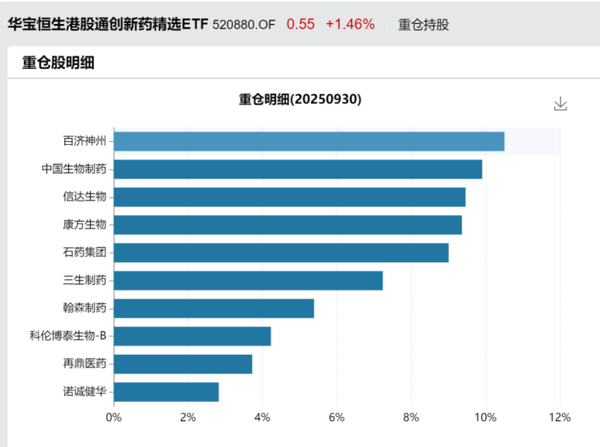

# 流动性将大幅改善的创新药公司们

大家好，我是龙哥。

临近年底，梳理了一下非通（不在港股通）biotech今年的表现情况，除了其基本面的因素以外，非通biotech或者非通的所有资产在此前普遍承受了比较多的“流动性折价”，因为只有港股账户可以购买非通的港股标的，而港股通是买不了非通标的的。

这个影响还是很大的，一方面是绝大部分大陆的机构资金，不论是主动管理基金（公募和相当一部分私募）还是被动管理的ETF（如港股通创新药ETF（520880）），基本都不能投资非港股通标的，另一方面我们看目前每天南向资金占港股总体成交额占比在50%左右，就意味着非通标的天然就要少一半以上的潜在交易方，叠加非通标的本身就是市值偏小的标的，流动性更加受限，二者叠加使得此前有不少非通biotech跌破净现金，直到今年创新药行情好转，估值才有所修复。

因此，能回到港股通内，对于公司的流动性改善会有较大的意义，这意味着内资机构将会有相当一部分可以配置这些资产。

进入港股通核心的门槛是市值门槛，要求12个月的平均市值达到港交所主板市值排名前94%，前两年港股市场比较差的时候这个门槛大概在40亿-50亿港元之间，而随着去年以来港股市场的上涨，这个门槛已经提升到80亿港元-90亿港元之间，期望回通的上市公司普遍预计到今年底这个门槛能会在85亿-95亿港元之间，因此我们按照相对高一点的预期——90亿港元的门槛来计算港股创新药biotech回通所需市值。

1、入通概率较高的公司

科济药业：2025年以来平均市值92.2亿港元，当前市值95亿港元，后续35个交易日需要平均市值达到76.7亿港元，也就是今年后续35个交易日只要股价平均跌幅不超过20%，就大概率可以在26年3月回到港股通。科济药业的通用CAR-T平台在前几天刚刚更新ASH摘要数据，是国内通用异体CAR-T进度较为领先的公司。

歌礼制药：2025年以来平均市值92.3亿港元，当前市值103亿港元，后续35个交易日平均市值只需达到76亿港元即可回到港股通，也即未来35个交易日的股价平均跌幅不超过26%即可。近期辉瑞和诺和几十亿美金的价格抢筹Metsera，可见MNC对超长效GLP-1月制剂的关注。

2、入通有难度的公司

和铂医药：2025年以来平均市值82.0亿港元，当前市值117亿港元，后续35个交易日平均市值需要达到138亿港元，在当前市值基础上平均溢价17.95%，如果年底冲一冲还有机会达到。和铂前阵子的研发日也给了2028年较高的远景目标，每年2笔以上项目BD授权，至少5款产品临近或进入商业化阶段。

3、明年再战有机会的公司

基石药业：2025年以来平均市值79.7亿港元，当前市值81亿港元，后续今年35个交易日需要平均市值达到155亿港元，在当前市值基础上平均溢价91%。不过公司当前市值距离入通门槛并不远，公司PD-1/VEGF/CTLA-4三抗和ROR1-ADC的后续数据披露时间都在2026年的ASCO，如能有好的数据读出，也有机会在26年达到市值要求。

康宁杰瑞制药：2025年以来平均市值78.6亿港元，当前市值93亿港元，后续今年35个交易日需要平均市值达到159亿港元，在当前市值基础上平均溢价71%。公司当前市值已经超过90亿港元，26年有机会进入港股通。康宁杰瑞在国内双抗ADC领域算是布局还相对领先一些的公司，如能谈成高质量的海外BD作为其双抗ADC技术平台的名片，也有机会迎来市值提升。

和誉：2025年以来平均市值72.8亿港元，当前市值97亿港元，后续今年35个交易日需要平均市值达到193.7亿港元，在当前市值基础上平均溢价100%。但公司当前市值已经超过90亿港元，并且研发管线还比较扎实，26年有机会进入港股通。

以上3家公司年底到明年上半年努努力，最快有望在26年9月纳入港股通。

4、明年也要狠狠努把力的公司

加科思：2025年市值最高点是93亿港元左右，当前市值只有54亿港元，公司pan-KRAS在2026年ASCO如能有好的数据读出，还有机会在26年冲一冲入通。

来凯医药：2025年市值最高点是96.5亿港元左右，当前市值只有47亿港元，减重增肌药物ActRIIA单抗的BD授权持续延后，市场预期的热情也被消磨了不少，26年BD能否落地对其还是较为重要的。

荃信生物：2025年市值最高点曾达到82亿港元左右，当前市值只有44亿港元，尤其是在10月28日大超预期的自免双抗授权罗氏后至今反而暴跌24%，可见近期创新药的hard模式。以当前市值水平即便是到2026年也需要在研发和商业化再有大的进展才能争取入通。

......

跟踪港股通创新药的指数有4个，分别是：

恒生港股通创新药精选指数：覆盖37个创新药标的，不含CXO，每半年调整一次成分股。跟踪该指数的产品有2个ETF+4个联接，合计规模28.88亿元。

国证港股通创新药指数：覆盖29个创新药标的，不含CXO，每季度调整一次成分股。另外之前较高比例纳入药捷安康导致对应跟踪的ETF出现高位接盘的也是这个指数。跟踪该指数的产品有5个ETF+4个联接，合计规模360.53亿元。

中证港股通创新药指数：覆盖37个创新药+CXO标的，每半年调整一次成分股。跟踪该指数的产品有3个ETF+12个联接，合计规模61.11亿元。

恒生港股通创新药指数：覆盖31个创新药标的，不含CXO，每半年调整一次成分股。跟踪该指数的产品有1个ETF+2个联接，合计规模40.24亿元。

以上4个港股通创新药指数合计跟踪产品规模达到491亿元。

实际上以上4个港股通创新药指数的成分股数量都没达到50个的上限，因此我们上文提到的这些非通创新药biotech公司入通后首先就是有可能被纳入指数成分股，并获得这些ETF的被动资金分配权重。

自8月以来创新药选股进入hard模式，像上文的留言在内的不少读者又意识到了ETF在创新药投资中的优点。非通Biotech回通后，也是可以通过ETF的方式来配置，这个时候，标的指数能否实现对创新药公司的快速和有效的覆盖就显得尤为重要。

以上4个指数中目前覆盖港股创新药范围最广的是恒生港股通创新药精选指数，不仅包含恒生综指成分股，还包含了AH公司（像荣昌、君实就是其他指数大多不包含的），也就是全部港股通标的都可以纳入指数。跟踪该指数的规模较大的ETF就是文初举例的港股通创新药ETF（520880）以及联接基金（025221）。

风险提示：本文仅讨论行业/公司经营情况，投资需综合考虑公司经营、估值、管理层等多方面因素，建议读者审慎参考，本文不作为投资依据，不建议大家根据本文做出投资计划。

<!-- wxmp-comments-begin -->

---

## 留言（12 条，含回复共 24 条）

- **光头的复利人生** 👍8 · 2025-11-12 10:31
  手中有粮，开支就上去了，利好CXO[旺柴]
  - ↳ **作者** · 2025-11-12 10:33
    实际上美股XBI暴涨更利好CXO，哈哈
- **甘文武** 👍4 · 2025-11-12 11:22
  龙哥，复宏汉霖是铁定会入通吗？
  - ↳ **作者** · 2025-11-12 11:27
    复宏汉霖要实现全流通是可以确定入通，如果不能顺利完成全流通的话就不是很确定。
- **孙凯** 👍3 · 2025-11-12 11:14
  龙哥，cxo的药明kd怎么看？
  - ↳ **作者** · 2025-11-12 11:26
    前两天写过了三季度业绩点评
- **DD** 👍2 · 2025-11-12 10:27
  龙哥怎么看荣昌的事情？
  - ↳ **作者** · 2025-11-12 10:30
    港股和美股对增发的价格是没有限制的，只要有人买，你发多少都可以，换句话说，如果没人买，你也可以把价格压的低到有人买。二级市场的价格是可以被操纵的， 但是要机构来增发买你的股票，定什么价格，是机构对你价值的认可。Vor这个定价，不就是公司和机构对他价值的判断吗。
- **秋水伊人** 👍2 · 2025-11-12 10:47
  老师好！刚刚介绍的520880，和原来介绍的有区别，是不是投这个更好！
  - ↳ **作者** · 2025-11-12 10:51
    ETF是工具，没有最好的ETF，只有最适合你投资目标和投资策略的ETF。520880的优势就是纯粹创新药、覆盖全面。
- **半岛饭盆** 👍2 · 2025-11-12 11:13
  劲方医药和维立志博明年上半年可以进通吗
  - ↳ **作者** · 2025-11-12 11:25
    劲方和维立志博按目前情况来看都是够的，只要后面俩月股价别出现大幅度的回撤。
- **Zg** 👍2 · 2025-11-12 11:13
  药明业绩会开完，法案仍是压制其估值的达摩利克斯之剑。药明不打开cxo的空间高度，小弟想拔估值也很难啊。
  - ↳ **作者** · 2025-11-12 11:26
    合联的估值也并未受到法案压制，甚至药明康德今年连续3次大笔减持合联都没能压制合联的估值。事实证明，法案早就已经不是压制CXO估值的核心因素，核心逻辑还是产业趋势、细分行业景气度、业绩增速。
- **低碳哥** 👍1 · 2025-11-12 10:29
  养成一个好习惯，先点赞后阅读📖
  - ↳ **作者** · 2025-11-12 10:31
    感谢感谢[抱拳]
- **Bryan** 👍1 · 2025-11-12 10:30
  龙哥，康宁杰瑞我23/24赛季的孽缘，好久没跟这公司了，今年股价倒不错，发现每年总要有一两段孽缘[捂脸]
  - ↳ **作者** · 2025-11-12 10:33
    康宁杰瑞，之前管线遭遇重大失败，原因也是多方面的，不但管线估值被砍，而且公司在投资者这边也严重失信。去年以来，公司这把主要还是及时去把握了双抗ADC的方向，如果能做出一些好的品种，可以做个不错的海外合作，也未必不能重新站起来。
- **雪山** 👍1 · 2025-11-12 10:45
  520690,龙哥这个如何呢？
  - ↳ **作者** · 2025-11-12 10:50
    跟踪的指数是同一个，但是ETF是规模的朋友，规模越大越好，520880是跟踪同一个指数里规模最大的，而且是显著大于其他的。
- **水木二师兄** 👍1 · 2025-11-12 11:15
  龙哥，港股通每年调整几次？
  - ↳ **作者** · 2025-11-12 11:26
    2次，3月和9月各一次
- **求索者** 👍1 · 2025-11-12 11:58
  龙哥有调研科济么？这几年入组怎么这么慢？
  - ↳ **作者** · 2025-11-12 12:01
    有调研，一个是CAR-T的成本太高了，临床成本要远高于常规的疗法；另一个是细胞治疗本身不像其他疗法那样，一般小规模临床和大规模注册临床的临床表现不会有太大偏离。

<!-- wxmp-comments-end -->
