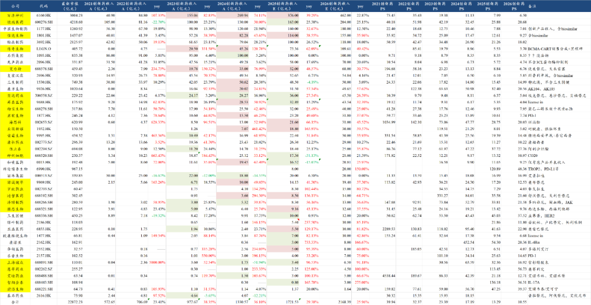
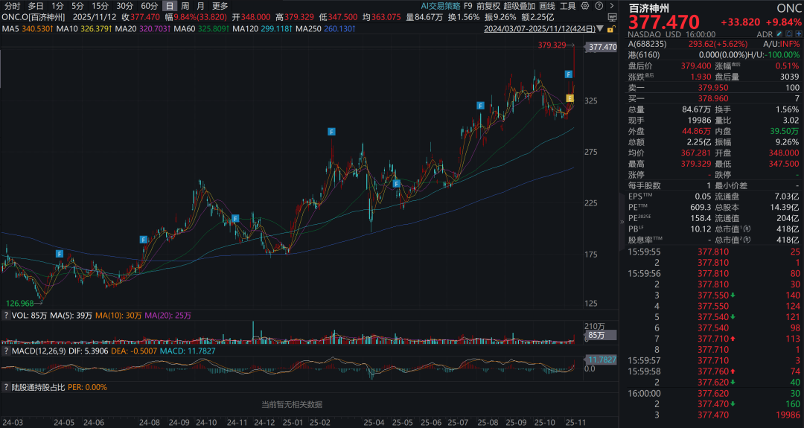
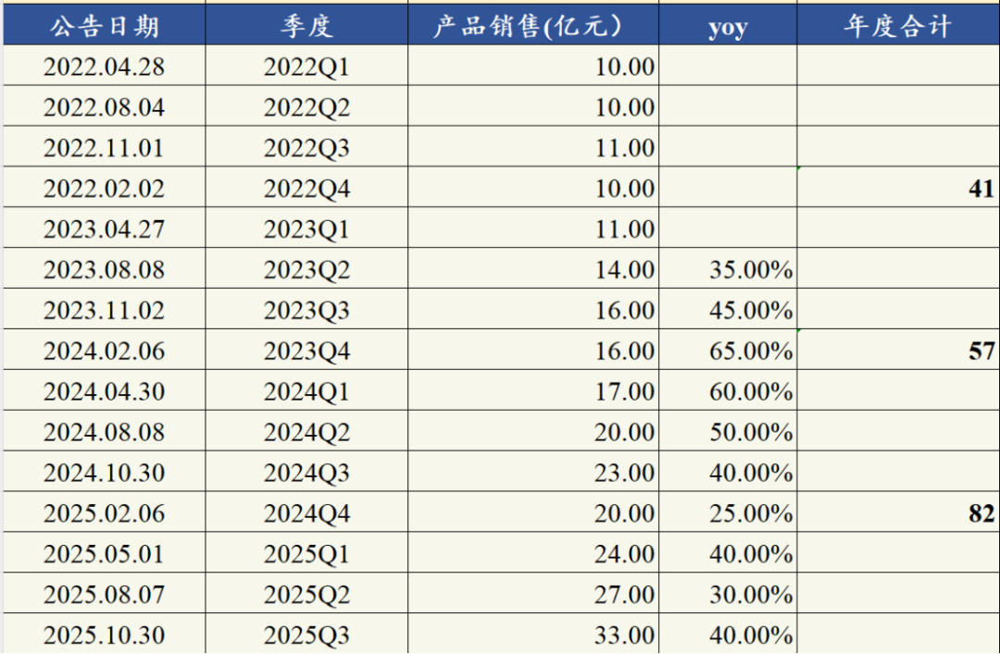
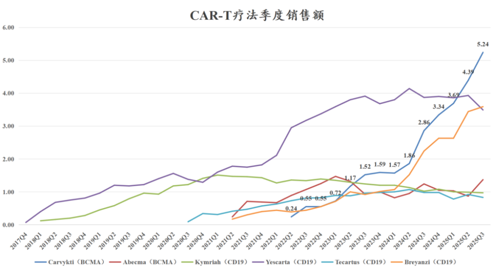
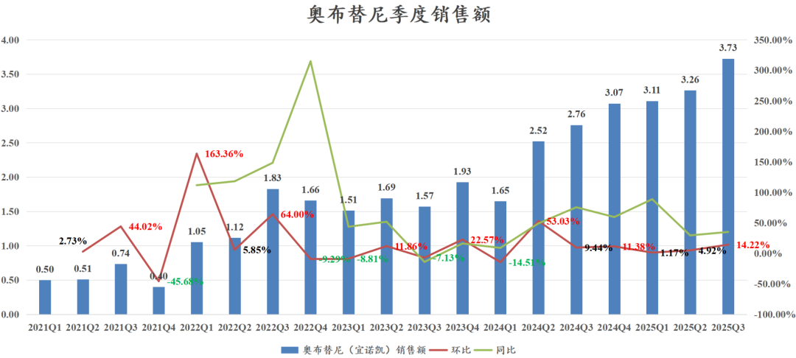
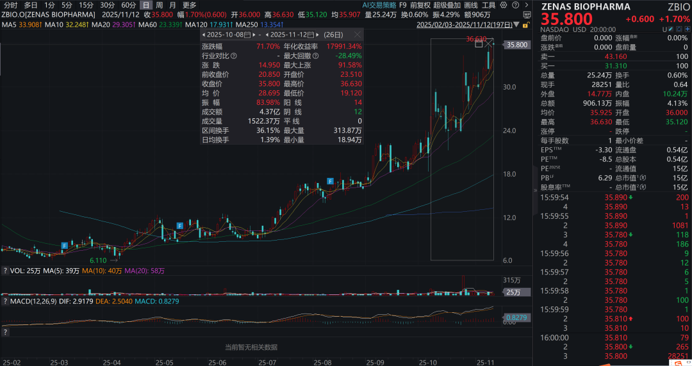
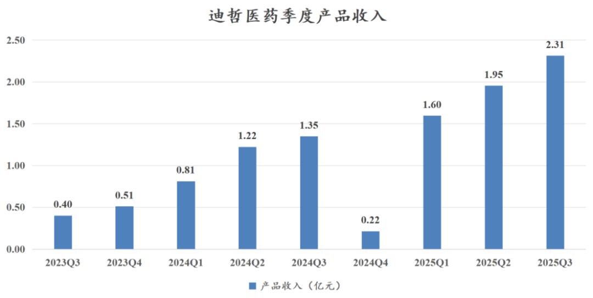
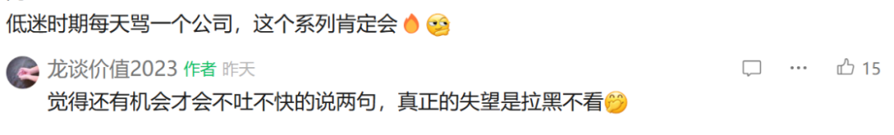
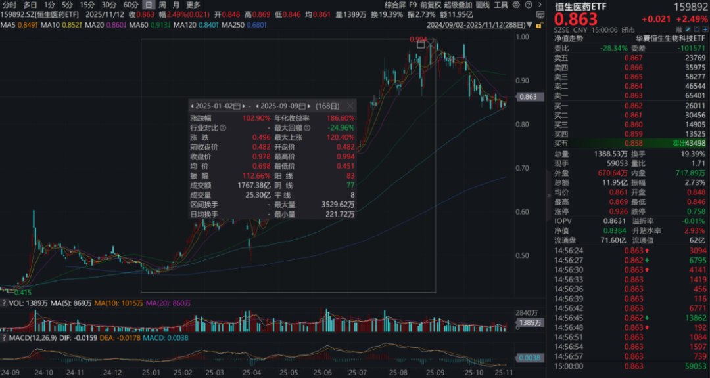
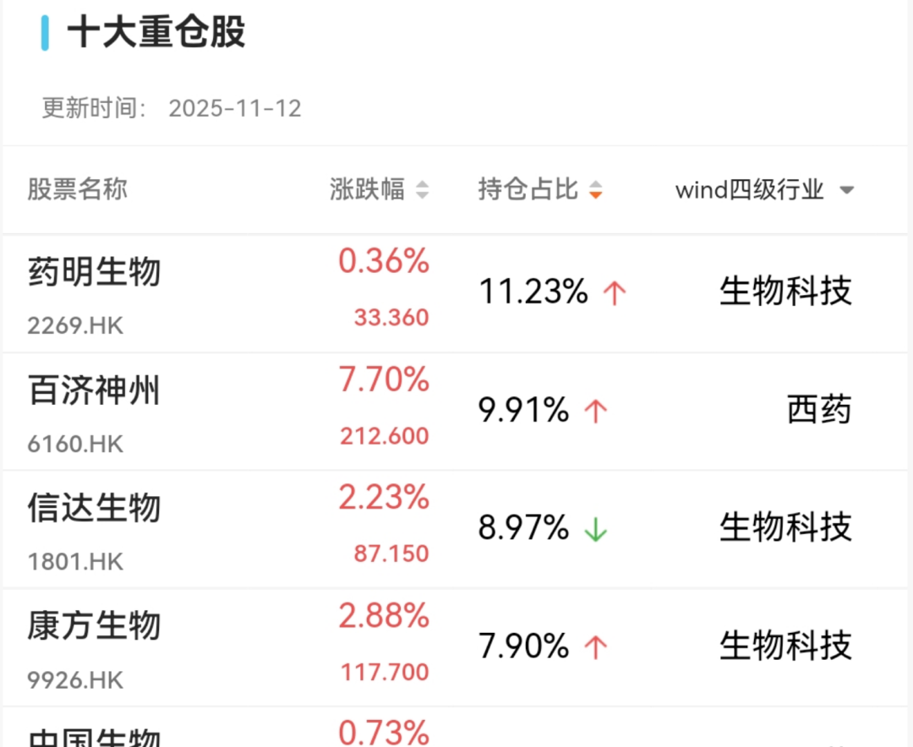

# 创新药三季度分化，龙头新高

大家好，我是龙哥。

创新药上市公司的三季报业绩已经发的差不多了，我们来对创新药行业三季度的商业化情况做个总结。

总体来看行业呈现剧烈分化的态势，海外商业化的几家基本都是符合预期或者超预期的快速放量，国内市场有表现非常亮眼的信达生物、海思科、迪哲医药等，也有非常拉胯的再鼎医药、神州细胞等。

创新药公司内部不管是研发还是销售，拉到中期和长期来看必然都是持续的分化，然而这种分化对股价的影响可能是短期就会出现非常幅度的波动，大部分非医药投资人无法及时判断这种分化，因此我们才要再、再、再次强调恒生医药ETF（159892）的价值。

总体经过三季度业绩后的全年商业化销售预测调整如下：

1、三季度超预期的创新药公司

1）百济神州

在前两天的文章《[创新药之王利润爆表](https://mp.weixin.qq.com/s?__biz=MzkyMzQ3MDc3Mw==&mid=2247485135&idx=1&sn=c2f89a4f0c7f82e54dfed7bd2019f55e&scene=21#wechat_redirect)》中已经给大家详细介绍了，建议大家可以翻看一下，尤其是这个文章的评论区，大家可以去看看创新药情绪较为低迷、百济业绩大超预期反而股价高开低走的时候，评论区那读者留言都是什么状态，那百济现在股价新高了......

2）信达生物

信达生物每季度都会公布产品销售额的情况，25年Q3公布的产品销售额是33亿元左右同比增长超过40%，由此我们将信达生物全年产品收入预期由111亿元上调至114亿元。Q3单季度实现20%的环比增长，预计其中玛仕度肽已经有不少的贡献，公司较早进行了营销准备，6月底获批之后渠道铺货+纯销会有一定的量。

信达生物自2024年下半年以来陆续有6个新产品（含BD引进）获批上市进入商业化，并且这6个产品都有资格参加25年底的医保谈判，预计其中的大部分品种都会纳入医保（玛仕度肽减重预计不太可能纳入），从而助力2025年进一步的放量。到今年底信达生物还有一款自免领域的重磅品种IL-23p19单抗即将在国内获批。

3）传奇生物

Carvykti这个放量曲线实在是过于漂亮和标准，所以每次提到传奇我都忍不住给大家看这个图（蓝色有数据标注的线是传奇的Carvykti）：

Carvykti在25年三季度销售5.24亿美元同比增长83%、环比增长19.4%，其中美国区收入3.96亿美元同比增长53.49%，美国区收入增长放缓比较多，收入占比下降到75.57%；欧洲、日本及其他市场收入1.28亿美元同比增长374%，增速还有所加速，收入占比从上个季度的18%提升到三季度的24%。

目前来看公司全年完成指引的19亿美元销售额已经是没太大问题了，只是看销售还能不能进一步超预期。另外就是三季度BMS的Abecma有10%的同比增长、57%的环比增长。

4）海思科

海思科在今年Q3的销售表现也是比较出众的，Q3单季度收入12.99亿元同比增长22.05%、环比增长17.18%，毛利率同环比也均有提升。海思科2024年创新药收入占比大概在30%-35%，2025年预计将会提升到45%-50%，26-27年预计将进一步提升至60%以上。

在传统pharma中海思科也属于转型创新还相对比较早、这两年进入创新药密集商业化阶段的公司，从2020年的环泊酚上市和逐渐放量后，这两年又陆续上市了克利加巴林（糖尿病周围神经痛、带疱神经痛等）、安瑞克芬（KOR）、考格列汀（DPP-4）等创新药，当然其过去两年的股价表现在传统pharma也是比较出众的一个。

5）诺诚健华

Q3单季度公司收入3.84亿元同比增长38.09%，药品销售收入3.83亿元同比增长38.21%，其中奥布替尼销售3.73亿元同比增长35.04%、环比增长14.22%，季度环比增长超预期，CD19单抗预计Q3销售1000万左右，环比增长约1.5倍。

前三季度净亏损0.72亿元同比减亏74.78%，主要是奥布替尼放量+年初BD授权CD20\*CD3双抗获得的首付款，预计将奥布替尼授权Zenas的首付款会在25Q4确认收入，近期里程碑有望在2026年确认收入。公司预计Q4实现扭亏（BD收入贡献），但即便不考虑BD的贡献，公司也已经距离实现季度经营性扭亏比较接近，有望在2026年实现非BD业务的经营性扭亏。

另外，自与诺诚健华的BD落地后，Zenas的股价已经涨了70%+，股价来到35美元，诺诚健华的这笔BD中包含的700万股Zenas股权的价值已经超过2.5亿美元。

6）迪哲医药

迪哲医药Q3单季度的产品收入2.31亿元同比增长71.46%、环比增长18.37%，这是舒沃替尼和戈利昔替尼进入医保的第一年，除了去年Q4经历医保谈判后的渠道调价导致季度业绩低基数以外，总体放量趋势还是比较不错的，25年全年完成8亿的指引已经是比较轻松，只是看8-9亿之间可以达到什么水平。

这里还是要再感慨一下EGFR这个靶点对于中国市场、对于国产创新药来说真是一个极其惊喜的靶点，造就了2000亿市值的翰森、500亿市值的艾力斯、200-300亿的贝达和迪哲，以及后面的同源康等。

7）微芯生物

25年Q2-Q3的收入分别为2.44亿元（同比+42%、环比+51%）、2.68亿元（同比+50%、环比+9.5%），去年底微芯生物经历了西奥罗尼的III期临床失败，销售也比较平淡，算是微芯生物的至暗时刻，25年以来西格列他那的销售放量带动微芯生物走出低谷，上半年西格列他那销售增长了125.7%，25年预计销售超过3亿，销售占比超过三分之一，成为微芯生物收入增长的主力。

其他的像艾力斯、君实生物等公司三季度销售也还不错，但也没有进一步超预期，所以就不再挨个介绍。

2、三季度低于预期的创新药公司 

1）再鼎医药

在前两天的文章《[再鼎医药，何至于此](https://mp.weixin.qq.com/s?__biz=MzkyMzQ3MDc3Mw==&mid=2247485150&idx=1&sn=ae1a51db12e8de25b676cd3c9aa3b2c7&scene=21#wechat_redirect)》中聊了再鼎的业绩问题，有读者说让我们每天骂一个公司，但这个对我们投资来说没太大意义嘛，真正太垃圾的公司就拉黑不看了，不太可能专门写篇文章来聊他的基本面情况，对读者来说也是纯纯浪费时间。还是觉得公司未来或许还能看看所以才会写，不管是积极正面的还是比较负面的。提出公司的问题，除了分享给大家之外，也是希望公司层面能看到，能认识到大家担心的问题。

和今年的再鼎医药比较类似的是去年Q3以来的和黄医药，也是遭遇了国内销售低于预期、海外销售增长停滞、重要项目研发失败、重要项目研发进度miss等一系列利空影响。

但在利空充分反映在股价中后，只要公司还在推进研发，公司账上有充足的现金可以支撑其未来几年持续研发开支，一旦再有新的有看点的管线，依然可以关注起来。

2）神州细胞

神州细胞的业绩属于，你知道他今年会很差，但没想到他会这么差，Q1-Q3的收入分别同比下滑15%、35%、46%。

都知道他今年会很差，因为神州细胞的重组八因子的商业化有一些行业内都知道的问题，以及陆续的有中国生物制药、天坛生物等的竞品上来了，原本年初预计重组八因子销售额今年下滑20%-25%左右，结果他这一下滑就一发不可收拾，按Q3的业绩推算全年重组八因子可能要下滑50%左右。

实际上在上半年那段时间咱们有几篇文章聊IO双抗的时候，也曾提到过神州细胞，那时候龙哥原本还打算专门写一篇这个公司的，标题是“老板给公司掏了20亿”，就是在当时行业涨起来之后各家基本都是着急减持，神州细胞是老板给公司掏了9个亿全额参与定增，加上以前给公司投的钱，前后加一起接近20亿了，实际上当时文章都写一半了，计划6.25发的，谁知道6.23-6.24两天暴涨，那龙哥的风格就是尽量不在主题炒的热的时候去聊公司，后面虽然又涨了50%，但现在已经完全跌回来。

3）上海谊众

公司三季度收入0.83亿元同比增长74%、环比下降7.2%，化疗改良新药紫杉醇胶束在去年底纳入医保，但今年的放量依然不尽如人意，紫杉醇我们都知道是曾经的化疗超级大品种，但化疗改良新药在如今这个医保控费、肿瘤新药快速迭代的时代似乎已经很难带来大的惊喜。

4）智翔金泰

智翔金泰Q3单季度收入1.62亿元同比增长12倍、环比增长5.4倍，主要是还有BD贡献的2000万美元首付款，扣除该部分后Q3单季度的产品收入预计在2000万元左右，Q1-Q2也大概是这个水平上下，年初也知道赛立奇单抗（IL-17A）今年没有医保不好卖，但也没想到卖的这么差，今年底智翔金泰和恒瑞医药的IL-17A单抗都参加医保谈判，26年纳入医保后的销售表现就至关重要了，诺华可善挺60亿的市场，国产到底有没有能力在其中分一杯羹？

其他的如康弘药业的康柏西普销售也比我预期的差一些，荣昌的终端销售销售预期没有下调、但由于今年底医保谈判预计会有降价和渠道调价影响，因此报表端的销售预测是给下调了，这个不影响逻辑。

......

最后总结一下，总体国产创新药放量的趋势还是非常不错的，但即便是在这样的行业β之下——行业端有接近30%的高增长——但仍有不少公司是业绩miss的，其中原因复杂多样，比如有的是市场预期过高或者指引比较高却达不到，有的是公司销售能力和执行力实在拉垮，也有的是确实受到一些政策面和宏观环境的影响。

那对于我们专业机构来说依然要面临紧密跟踪仍会有一些公司业绩超预期或miss的情况，因此行业ETF投资在多数情况下还是大家最好的选择，我们讲了两年的恒生医药ETF（159892），今年来最大涨幅是103%，期间有两次回调幅度超过10%，分别是4月7日那次贸易战回调了18%和近期高位回调至今最大跌幅也没超过15%。

看起来持仓是比较均衡，CXO、创新药、互联网医疗龙头都有不少，实际业绩表现完全不弱于今年的港股创新药指数，并且持有的体验很好，这是投资个股不能带来的体验。

风险提示：本文仅讨论行业/公司经营情况，投资需综合考虑公司经营、估值、管理层等多方面因素，建议读者审慎参考，本文不作为投资依据，不建议大家根据本文做出投资计划。

<!-- wxmp-comments-begin -->

---

## 留言（18 条，含回复共 39 条）

- **雨夜落无声** 👍5 · 2025-11-14 08:21
  手里拿着药名和恒瑞两大龙头 哈哈哈就是高位接了 只能等了
- **Wayne** 👍5 · 2025-11-14 08:32
  传奇生物为啥这么便宜，是不是后续缺乏管线的原因？昨天听说章总公开表达了对股价的不满。[呲牙]
  - ↳ **作者** · 2025-11-14 08:36
    章总不是大格局吗，这么大格局的老板还这么在意短期股价？是有减持需求还是？不然干嘛突然讲2028年这么乐观的指引[旺柴]
- **王熙** 👍3 · 2025-11-14 08:19
  百济神州就看2026年是不是能有一款潜力产品来接替泽布替尼了。
  - ↳ **作者** · 2025-11-14 08:21
    也没有这么快，Bcl2虽然在26年可以在国内获批，主要的3期临床还不会读出结果，其他开3期或者计划开3期的项目都不会这么快。
- **COCO** 👍3 · 2025-11-14 08:29
  血制品无人问津
  - ↳ **作者** · 2025-11-14 10:01
    重仓天坛很难受，前段时间还吃了个大的，这几天回了不少血。
- **天涯过客** 👍2 · 2025-11-14 08:51
  龙哥药石科技拐点到了吗？
  - ↳ **作者** · 2025-11-14 08:54
    翻看一下CXO三季报点评的文章，这个不仅是药石科技啦，行业β都不错的
- **佛门小僧** 👍2 · 2025-11-14 09:00
  云鼎龙哥不讲讲吗？[流泪]
  - ↳ **作者** · 2025-11-14 09:04
    云顶不公布三季报，月度的纯销还是不错的，全年应该也会再上调。
- **嘀嗒** 👍1 · 2025-11-14 08:23
  龙哥，最近强的可怕。医药的行情要来了。
  - ↳ **作者** · 2025-11-14 08:30
    难道不是已经来了吗
- **燚** 👍1 · 2025-11-14 08:25
  一直想重新上车，但总觉得回调15%是不是太少了[破涕为笑]
  - ↳ **作者** · 2025-11-14 08:31
    指数回调15%，头部个股普遍回调了20%-30%，后排小公司很多回调30%-50%的。
  - ↳ **作者** · 2025-11-14 08:38
    看具体公司吧，也不是一概而论，小公司里也有一些还不错的
- **🌲刘懿 Eric🌞** 👍1 · 2025-11-14 08:28
  不能理解传奇为什么股价这样[捂脸]真的是数据漂亮的不像话
  - ↳ **作者** · 2025-11-14 08:33
    传奇最大的问题是金斯瑞的公司治理问题，其次是中国资产在美国上市不受待见，尤其是美股的竞品公司可以低成本的在美国投资者中攻击传奇。
  - ↳ **作者** · 2025-11-14 08:41
    创新药公司我是绝不建议单吊的，任何一家公司都是。
- **人生在世** 👍1 · 2025-11-14 08:30
  恒瑞呢
  - ↳ **作者** · 2025-11-14 08:34
    恒瑞三季报单独写过一篇文章，就国内药品销售来看还是平淡的。
- **咀方头湾** 👍1 · 2025-11-14 08:47
  龙大，对瑞迈特和普门科技两个公司的研发能力及后续在研新医疗器械产品有哪些看法？谢谢
  - ↳ **作者** · 2025-11-14 08:50
    瑞迈特今年海外重回高增长，海外业务的周期企稳了，这个还是比较重要吧，国内部分调整渠道导致今年不会很好看。
- **Simon** 👍1 · 2025-11-14 08:48
  龙哥，感觉你的封面图用的AI不是很聪明[旺柴]生成的冰火两重天有点割裂
  - ↳ **作者** · 2025-11-14 08:49
    微信公众号的AI生成图片，一直很蠢。。。。
  - ↳ **作者** · 2025-11-14 08:54
    [尴尬][尴尬][尴尬]仅限于微信公众号，哈哈哈哈。腾讯元宝我还是经常用的......
- **K 杨** 👍1 · 2025-11-14 08:49
  龙哥，康诺亚512公告数据那么好，结果近期表现却很显眼拉胯，是国谈结果不理想吗？
  - ↳ **作者** · 2025-11-14 09:05
    512的数据还可以，但之前市场预期更高。国谈肯定是要大幅降价的，这个也没啥争议，今年IL-4没医保卖的一般，要看明年进医保之后的销售。
  - ↳ **作者** · 2025-11-14 09:07
    谢谢龙哥，就是说现在明牌，关键看明年进医保的销售是吧？
- **yuraisy** 👍1 · 2025-11-14 08:53
  龙大，药明减持的情绪影响是不是接近尾声了，股价看样子企稳了，就待下个月的美国防法案的利空落地了？
  - ↳ **作者** · 2025-11-14 08:55
    利空落地的时候可能短期还是会有点影响，现在确实担心这个的投资人不太多。
- **雪山** · 2025-11-14 08:24
  石药的季报预计会不会很差啊，BD没有出来
  - ↳ **作者** · 2025-11-14 08:31
    季报差是产品销售方面差，和BD不BD没啥关系。
- **浩** · 2025-11-14 08:43
  龙哥，请教2个问题，1百济的三季报不是7日港股那边就出了，为什么a股的要13日出，主要内容不是一样的嘛。2 股价为啥等a股季报出了才涨，是市场的因素，还是大家担心a股这边的季报可能会有幺蛾子？
  - ↳ **作者** · 2025-11-14 08:54
    短期股价的影响因素是复杂多样的，长期股价趋势的核心矛盾不一定是短期股价波动的核心矛盾，因此不要对着单个公司的某些消息做股价归因，很容易错误归因，你这个归因就是明显错误的，百济的港股、美股披露三季报以及A股同时也披露了业绩公告，实际上当时百济的美股已经开始走强，只是当时AH股被行业带着高开低走比较弱，但你看后面行业稳住之后百济马上就新高了。市场虽然经常犯蠢，但不至于像你说的这么蠢，港美股的财报都发了，谁会担心A股季报呢。
- **峰回路转** · 2025-11-14 10:04
  <a class="js_mention_entry wx_at_link" data-biz="Mzk0NzY4MjM5MA==" data-username="gh_63f7f08149c4" href="">@元宝</a>总结
  - ↳ **作者** · 2025-11-14 10:05
    创新药三季度业绩分化显著：百济神州、信达生物（Q3销售额33亿+）、传奇生物等海外商业化企业超预期放量；海思科、迪哲医药等部分国内企业表现亮眼。但再鼎医药、神州细胞等业绩大幅不及预期。行业虽整体向好，个股波动剧烈，普通投资者更适合通过恒生医药ETF(159892)布局。
- **Robin Luo** · 2025-11-14 10:33
  龙大为啥不谈荣昌呢？
  - ↳ **作者** · 2025-11-14 10:36
    荣昌三季度销售端符合预期，文中也说了全年下调一点是因为年底医保谈判可能会有部分调价，不影响总体销售趋势。

<!-- wxmp-comments-end -->
