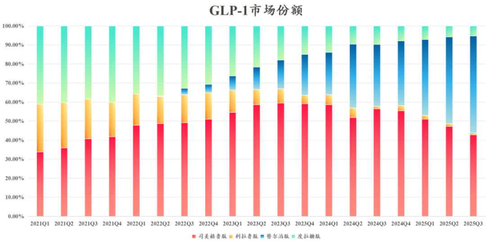
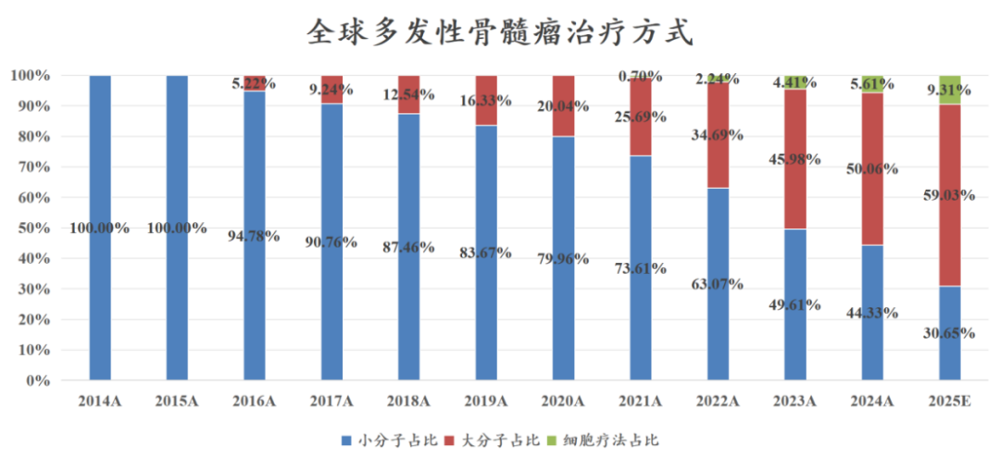
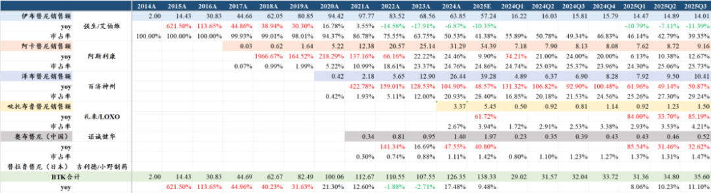
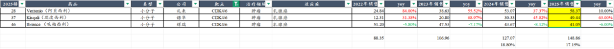
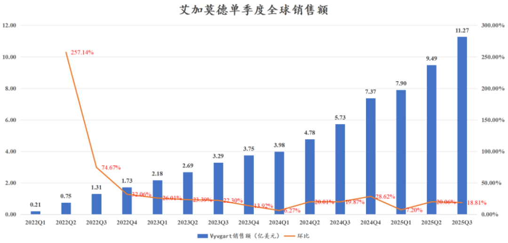
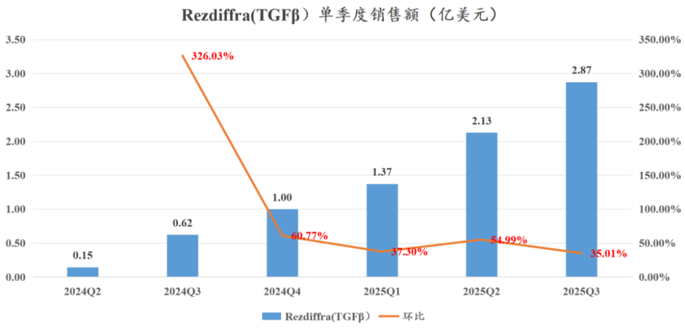

# 全球顶级大药的狂欢

大家好，我是龙哥。

8月12日的文章《[哪些全球顶级创新药在25年大超预期？](https://mp.weixin.qq.com/s?__biz=MzkyMzQ3MDc3Mw==&mid=2247484844&idx=1&sn=82de722328a5675ecf9ac735e60fd5e4&scene=21#wechat_redirect)》中我们曾经梳理了MNC的中报超预期的情况，那目前来看，当时梳理到的核心大品种销售亮眼的公司，如艾伯维、Argenx、强生、百济、诺华、阿斯利康、礼来、Madrigal等公司的股价悉数创下了历史新高，在MNC里也是领跑的态势，唯一表现不佳的是传奇生物。

最近跨国药企的三季报陆续发布完，我们今天再来梳理一下全球市场今年三季度有哪些药物取得不错的成绩。

1、GLP-1降糖减重：

礼来持续超预期，诺和诺德低于预期，替尔泊肽上市第4年超越上市9年的司美格鲁肽，双靶点替代单靶点的速度超预期。

①礼来替尔泊肽降糖注射剂25Q3收入65.15亿美元同比增长109.31%、环比增长25.32%，减重注射剂收入35.88亿美元同比增长185.27%、环比增长6.11%，25Q3替尔泊肽在GLP-1的市占率环比提升5.44%至50.92%；礼来上调全年收入预期，自中报指引600亿-620亿美元上调至630亿-635亿美元，市值突破历史新高，接近1万亿美元。

②诺和诺德司美格鲁肽降糖注射剂25Q3收入46.18亿美元同比+7.36%、环比-8.25%，降糖口服制剂收入8.17亿美元同比+3.86%、环比-6.69%，减重注射剂收入30.57亿美元同比+1.57%、环比+22.43%，总体司美格鲁肽Q3的市占率下降4.47%至42.80%；诺和诺德下调全年收入预期，同比增速由8%-14%下调至8%-11%，相当于收入自455亿-480亿下调至455亿-468亿元。

2、肿瘤领域：

血液瘤、乳腺癌表现亮眼

①强生达雷妥尤单抗前三季度销售104.48亿美元+21.7%，其中美国市场59.34亿美元同比+23.9%，Q3单季度销售36.72亿美元+21.7%，美国市场20.88亿美元+24.0%，全年预计大概率突破140亿美元；强生公司股价突破历史新高，市值超过4800亿美元。

②强生/传奇生物Carvykti（BCMA-CART）前三季度销售13.32亿美元+111.76%，Q3单季度销售5.24亿美元同比+83.22%、环比+19.36%，前线治疗的渗透率快速提升，但三季度美国市场增速有所下降，欧洲、日本等美国以外市场放量超预期，预计Carvykti全年销售额19亿-20亿美元。

多发性骨髓瘤近年的治疗方式和市场格局在持续变革，预计2025年达雷妥尤单抗将以一己之力占据56%的市场份额，但同时几款TCE双抗和CAR-T疗法也在异军突起，小分子药则由于专利到期的原因而份额快速下降。

③BTK抑制剂：百济神州泽布替尼Q3销售10.41亿美元同比+50.87%、环比+9.57%，25Q2-Q3环比增长持续超预期，Q3的全球市场份额提升至29.24%环比提升2%，预计全年达到39.28亿美元+48.57%，全年全球市场份额预计在28.4%左右，26年将成为超50亿美元的超级重磅品种。

④诺华的瑞波西利（CDK4/6）前三季度销售34.62亿美元同比增长62%，全年预计销售额将达到49亿美元，为25年肿瘤药超20亿美元的大品种中增速最快的药物，26年有望挑战礼来阿贝西利的份额。

⑤乳腺癌：乳腺癌如诺华的瑞波西利外，还有阿斯利康/第一三共的HER2-ADC德曲妥珠单抗（30%+）、罗氏的曲妥珠+帕妥珠皮下制剂（50%+）、阿斯利康的AKT抑制剂卡帕塞替尼（80%+）等高增长的重磅品种。

3、自免及呼吸领域：

IL-23p19靶点持续大超预期，单靶点未来有望达到300亿-400亿美元全球销售规模。

①IL-23p19：超级重磅靶点，艾伯维瑞莎珠单抗前三季度销售125.56亿美元，预计全年178亿美元同比增长50%以上；强生古塞奇尤单抗前三季度销售35.66亿美元+31%，预计全年48亿美元左右，二者均超预期，合计全年预计226亿美元左右，后续强生还推出IL-23口服环肽，二者共同弥补强生的乌司奴单抗（IL-23/IL-12）专利到期后的下滑。

②赛诺菲IL-4Rα单抗度普利尤单抗25Q3销售41.56亿欧元同比增长26.2%，前三季度累计114.7亿欧元，全年有望达到157亿欧元/超过170亿美元，但其被Skyrizi反超，成为自免领域第二大超级重磅药物。

③艾伯维JAK1抑制剂乌帕替尼前三季度销售59.30亿美元，预计全年超过83亿美元、同比增长40%+。艾伯维凭借两款超级重磅自免药物，股价在Q3创下历史新高，艾伯维的市值也突破4000亿美元。

④Argenx艾加莫德25Q2-Q3销售连续加速，分别环比增长20.06%和18.81%，同比增长98%左右，前三季度销售28.66亿美元+97.72%，全年预计超过41亿美元、同比+90%以上。国内合作方再鼎医药在中国市场销售则是连续3个季度miss。

⑤呼吸领域阿斯利康/Amgen的TSLP单抗特泽鲁单抗预计25年销售增长50%左右至18亿美元左右，目前主要是哮喘适应症贡献，后续还有鼻窦炎伴鼻息肉、COPD等适应症。

4、心血管及代谢领域：

PCSK9靶点表现较好，MASH新药放量逐季度超预期。

①PCSK9是近年该领域最大看点，Amgen的依洛尤单抗25全年有望挑战30亿美元、同比+35%左右，诺华的PCSK9 siRNA英克司兰预计25年增长60%以上，销售额将达到12亿美元。

②默沙东肺动脉高压新药ActRIIA新药Winrevair上市第二年，前三季度销售9.76亿美元，25Q3销售3.6亿美元同比+141%，预计全年销售额有望达到13.7亿美元左右同比增长230%，海外机构预计该药物的销售峰值将达到30亿-72亿美元。

③Madrigal的全球首款MASH新药Rezdiffra（TGF-β）Q3单季度销售2.87亿美元同比+362%、环比+35%，上市第二年有望挑战10亿美元。

5、罕见病：

siRNA龙头Alnylam大爆发

罕见病领域此前已经诞生福泰制药一款百亿美金大药Trikafta和其千亿市值，以及辉瑞60亿美金的大药——治疗转甲状腺素蛋白淀粉样多发性神经/心肌病的氯苯唑酸，而Alnylam的TTR-siRNA药物Amvuttra在25年销售大爆发，单季度销售额达到6.85亿美元，前三季度销售额14.87亿美元，Alnylam市值达到600亿美元、创历史新高。

......

总体来看代谢、自免、肿瘤是25年创新药全球市场最大看点，GLP-1/GIPR、IL-23p19、CDK4/6、PCSK9、JAK1、siRNA小核酸药物持续超预期，肿瘤领域的CAR-T、ADC和双抗表现不错但总体符合预期。

国内市场对标：

GLP-1双靶点激动剂：

- 国内信达生物玛仕度肽（GLP-1/GCGR）今年上半年进入商业化；
- 恒瑞医药的HRS9531（GLP-1/GIPR）临近商业化、且做了产品组合的海外BD，海外Newco公司在前阵子还刚完成了6亿美元的融资；
- 翰森制药的GLP-1产品组合也有两款药物授权海外，分别是小分子的GLP-1授权默沙东，以及GLP-1/GIPR双靶点激动剂授权再生元，翰森的GLP-1/GIPR在24年下半年启动的减重III期临床，按其临床进度推算在26年上半年也有望申报上市成为国产第三家GLP-1双靶；
- 国内GLP-1/GIPR双靶点在III期临床的还有博瑞医药、众生药业、华东医药；
- 此外联邦制药的GLP-1/GIPR/GCGR三靶点激动剂以及乐普医疗/民为生物的GLP-1/GIPR/FGF21三靶点抗体也均实现海外授权，其中联邦制药的三靶点授权诺和诺德，将在26年开临床。

IL-23p19：

- 信达生物已经提交注册。
- 翰森制药/荃信生物处于III期临床。
- 国内竞争格局相对较好，但国内银屑病领域的竞争也更为激烈，国内银屑病领域销售规模最为领先的还是诺华的司库奇尤单抗（IL-17A），后续还有IL-23/IL-12、IL-17A/F、IL-23p19、TYK2等靶点的竞争，因此药物本身优秀是一方面，还有就是在商业化方面需要付出较大的努力，信达生物和翰森制药在执行力和商业化能力方面都在国内属于一线水平，但自免创新药毕竟对他们来说也还是新的市场，也期待他们能在IL-23p19靶点上塑造国产自免重磅药物的典型案例。

CDK4/6：

- 国内已经获批或在III期临床阶段的CDK4/6已经较为众多，除3家进口以外，国产包括恒瑞、复星、中国生物制药、贝达、嘉和、四环/轩竹、先声等，还有多家在后续临床开发中，已经是陷入高度内卷，且无出海能力。
- 百济神州三季报解读中有提到，其下一代药物CDK4抑制剂即将在26年上半年开启一线HR+/HER2-乳腺癌的全球注册III期临床，是百济下一个“背水一战”的潜在重磅药物。

JAK1：

- 国内目前已经有恒瑞医药的JAK1抑制剂获批4项适应症、还有2项适应症申报上市，在国产企业中属于较为领先的公司，艾伯维不太重视中国市场，使得IL-23p19和JAK1这两个重磅靶点都给国产企业留下一些机会。
- 另外诺诚健华开发的JAK1/TYK2抑制剂有望实现更好的安全性，广谱覆盖自免适应症。

PCSK9：

- 信达生物、恒瑞医药、君实生物、康方生物等多家单抗竞品，竞争较为激烈。
- 另外心血管领域传统龙头信立泰在开发单抗和核酸类药物。

小核酸：

- 今年来小核酸药物也是创新药板块炒作的主题方向之一，但国内在小核酸领域布局较为领先的公司还未上市，如苏州瑞博、靖因药业等已经在港交所递表准备IPO，有望陆续在26年登陆资本市场。

风险提示：本文仅讨论行业/公司经营情况，投资需综合考虑公司经营、估值、管理层等多方面因素，建议读者审慎参考，本文不作为投资依据，不建议大家根据本文做出投资计划。

<!-- wxmp-comments-begin -->

---

## 留言（6 条，含回复共 14 条）

- **卢光明** 👍2 · 2025-11-18 10:07
  集采多家印度药中标，一个是价格，更多的是担心药效！
  - ↳ **作者** · 2025-11-18 10:08
    担心药效你就买原研或者买国产大厂的呗，印度药这两年确实偶尔会有些事件被爆出来，但人家毕竟是常年供应欧美市场的，也没那么不堪。
  - ↳ **作者** · 2025-11-18 10:49
    不是没得选，现在国家医保明确就是保基本，他给你兜底，但你如果想用更好更放心的，那你可以选择自费，你不在医院买不就行了，去线下药店或者去互联网药店总能买到你想买的品牌。
- **SOEBFQJBXKUWVVDIV** 👍1 · 2025-11-18 10:10
  这个诺和盈、诺和泰、替尔泊肽的盗版太多了
  - ↳ **作者** · 2025-11-18 10:54
    任何很赚钱的行业你都要能接受有一些趴在行业吸血的存在，这是不可能完全杜绝的，只要把握主要市场能有巨大空间不就足够了。
- **程子旭** 👍1 · 2025-11-18 10:19
  康方为啥这么弱
  - ↳ **作者** · 2025-11-18 10:55
    就目前来说时常担心的肯定还是竞争格局竞争态势的问题，辉瑞/三生和BMS/BNTX都在火力全开的推临床。
- **demo** 👍1 · 2025-11-18 10:38
  问个问题，买创新药etf，买科创创新药etf好，还是买港股创新药etf好？
  - ↳ **作者** · 2025-11-18 10:50
    关注不久的新读者，可以多翻翻历史文章，这是明牌的答案。
- **游文明** 👍1 · 2025-11-18 10:45
  龙哥：药明系在这些国际药企的服务怎么样，业绩的持续性强吗？
  - ↳ **作者** · 2025-11-18 10:53
    药明系的业绩点评基本每个季度都有，其执行力和效率是一方面，更重要的是他们一直在比较前瞻的把握技术趋势并做布局，药明系这轮行情里表现显著强于其他家，核心是把握了ADC、双抗、GLP-1减肥药等多个超级景气的赛道，因此才会呈现很有持续性的强劲业绩增长。
  - ↳ **作者** · 2025-11-18 11:49
    老师[抱拳]药明生物基本面这么差，还要保持信心吗？[偷笑]
- **田野** · 2025-11-18 22:30
  传奇是少数 核心品种还处于非常高速增长期，但是市值还在持续下跌的票——不知道市场是咋想的，担心竞品？还是已经提前给到峰值销售额了？
  - ↳ **作者** · 2025-11-19 09:17
    一个原因应该是吉利德/ACLX在美股到处路演攻击传奇，说未来要替代传奇80%的份额，对美股投资人影响比较大。

<!-- wxmp-comments-end -->
