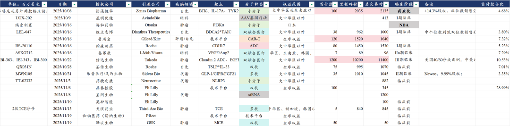
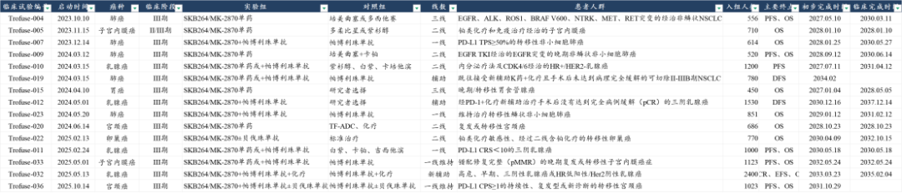

# 时来天地皆同力，运去英雄不自由

大家好，我是龙哥。

最近很多BD落地后股价表现不尽如人意，要说这些BD的数量、质量不行，也不尽然，但市场持续性的较为负面的表现，给投资人的体感非常差，尤其是每次出偏正面的消息的时候反而市场走的让人大跌眼镜。

关于BD的一些大家比较关心的问题，我们在10月份的文章《[聊几个创新药行业大家最关心的问题](https://mp.weixin.qq.com/s?__biz=MzkyMzQ3MDc3Mw==&mid=2247485007&idx=1&sn=45e247c9104c79fb75f049c267247e33&scene=21#wechat_redirect)》里基本都有谈到，本文就10月份以来的一些BD落地后的情况，来谈谈我们对未来BD模式下的创新药出海及创新药投资的中长期看法。

①诺诚健华

10月8日对外授权BTK抑制剂自免适应症海外权益、IL-17A/F小分子、TYK2小分子等3个项目，合计首付款+近期里程碑付款1亿美元+700万股Zenas股权，里程碑付款20.35亿美元。

这轮BD后股价负反馈的起点，就是诺诚健华的十一假期回来首个BD落地开始的，诺诚健华的股价两个交易日跌了22%，最大跌幅接近30%，至今的跌幅仍然有23%。

诺诚的这笔BD，低于预期的地方有几个方面，其一是之前市场预期1个项目BD、实际是3个项目BD，其二是1亿美金的首付款+近期里程碑，其中有6500万是近期里程碑、实际的首付款只有3500万美金，其三是合作方Zenas不是MNC。

好的是，这不是传统意义上的Newco交易，合作方Zenas本身在自免药物开发有一定经验，核心在研管线临近产品注册阶段，其本身估值有自有管线作为锚，在奥布替尼BD之后股价反而节节攀升。

②维立志博

10月16日对外授权BDCA2\*TAIC双靶点融合蛋白，首付款3800万美元，总交易对价10亿美元，自交易落地后股价高开低走一路下挫，至今跌幅19%、最大跌幅22%。

③翰森制药

10月16日对罗氏授权CDH17-ADC的海外权益，获得8000万美元首付款+14.5亿美元里程碑付款，国内CDH17-ADC已经有多家进入临床，翰森能拔得头筹实现海外授权，合作方是头部MNC罗氏，首付款和总交易对价都还不错，翰森是为数不多授权后股价表现较好的公司，至今股价涨幅8.56%，BD后的最大跌幅不到7%。

④信达生物

10月22日信达生物宣布将PD-1\*IL-2α双融合蛋白、Claudin18.2-ADC、EGFR\*B7-H3 ADC三个项目的海外权益授予武田制药，信达生物获得12亿美元的首付款、102亿美元的里程碑付款，总交易对价114亿美元，其中对IBI-363在美国市场为信达与武田4:6分成（费用及利润）。

信达生物这笔交易是备受关注的，除了PD-1/L1\*VEGF双抗以外，IBI-363（PD-1\*IL-2α）是目前最有潜力成为第二代IO的疗法，尤其是今年上半年发布了肺癌的OS数据后市场预期大幅提升，最终落地市场解读为miss和诺诚的情况有点像，其一是合作方武田制药在肿瘤领域没啥大品种，且不算顶级MNC；其二是原本预计1个项目，实际是3个项目打包；其三是首付款预期15亿美金+，实际3个项目合计12亿美金。

这笔交易可能不算是非常完美，低于投资人的预期，但对两家公司来说起码算是双赢的，在此前的文章《[抱歉，迟到的重磅交易解读](https://mp.weixin.qq.com/s?__biz=MzkyMzQ3MDc3Mw==&mid=2247485043&idx=1&sn=41734cf8e35cb68d80fde9aae0505be4&scene=21#wechat_redirect)》中有和大家聊到，BD落地后信达生物股价也是高开低走，但至少至今股价未跌。

⑤荃信生物

10月28日荃信生物将其TSLP\*IL-33双抗的全球权益授予罗氏，获得7500万美元首付款+9.95亿美元里程碑付款。自BD后股价高开低走，至今累计跌幅20%，最大跌幅27%。

荃信生物的BD也是此前就有市场预期，但是预期确实谈不上很高，一款临床前的项目授权给头部MNC罗氏、并且拿到7500万美元的首付款，在我们聊到的所有机构投资人都认为是一笔超预期的BD交易，也因此，这笔交易落地后股价的下跌，对不少投资人信心的打击实际上要比诺诚、信达的BD落地后股价表现要大的多。

⑥乐普医疗

10月31日乐普医疗控股子公司民为生物将其GLP-1/GIPR/FGF21三抗的大中华区以外权益授权给Sidera Bio，民为生物获得3500万美元首付款、10.1亿美元里程碑付款，并获得交易方9.99%的股权。

作为一款处于II期临床的GLP-1类三靶点药物，与该合作方、达成的该交易对价，的确有些低于市场预期，25年上半年联邦制药的GLP-1/GIPR/GCGR三靶点激动剂授权给诺和诺德获得了2亿美元首付款+18亿美元里程碑付款。BD交易落地后，乐普医疗股价高开低走，至今累计下跌11%。

⑦晶泰控股

11月6日晶泰控股与礼来达成基于AI抗体发现平台进行药物发现和开发双抗药物的合作协议，晶泰控股获得1亿美元首付款及近期里程碑付款，总交易对价3.45亿美元，晶泰控股的药物发现平台从小分子拓展到抗体领域，但也未能带动晶泰控股的股价，BD落地至今累计-11%。

......  
以上BD交易的落地，要说不及预期嘛，的确有部分不及预期的地方，但以上交易就具体项目来看大部分还是不错的结果，至少我们如果从年初或者年中的时间维度来看以上交易的达成都是非常不错的，但由于股价涨了更多、预期提的更高了，导致最终结果落地的时候股价反而呈现的是与上半年截然相反的走势。用一句话总结就是：

时来天地皆同力，运去英雄不自由。

这是文章标题，是感慨，但这不是最终的结论。

BD交易的落地，对于一些炒短期催化剂的资金来说可能是结束，例如荃信生物这样的公司，实际上不论你BD交易是超预期还是符合预期亦或者是低于预期，交易落地的时候都是股价被砸的时候，和交易本身已经没太大关系。

我们想说的是，对于真正希望长期价值投资创新药的投资人来说，BD交易的落地实际上只是出海的第一步，是个开始，合作方的后续临床开发和商业化才是重中之重。

如果能遇到默沙东、辉瑞、GSK这样的全球头部MNC，叠加其对项目较高的重视程度，其管线的全球估值将会大大提升。

如科伦博泰与默沙东这种“相互奔赴”，就是另一众创新药投资人非常希望看到的合作模式，公司开了15项全球III期临床，合计计划入组1.4万例患者，将付出大几十亿美元的临床费用，相比之下在合作之初的4700万美元首付款和13.6亿美元的里程碑付款就已经是洒洒水啦，如果只是盯着首付款和交易总包去判断项目价值，那就会严重低估科伦博泰的SKB264项目、同时又高估科伦博泰后续与默沙东签订的90多亿美金总包的项目。

即便是如信达/武田这样的合作，即便是很多投资人认为武田这样的合作方比较菜（相较其他头部MNC），但如果武田能像抓救命稻草一样重视IBI-363这个项目，未必会是一个差的结果，IBI-363这样的广谱抗肿瘤药需要超大规模的临床资金投入，而对于顶级MNC，即便是掏了十几亿美金的首付款出来，项目也未必就一定能得到高度重视和投入巨额的资源去开发。

我们也不喜欢再倒翻历史去抨击一些BD项目的合作，例如现在三生制药与辉瑞、普米斯与BioNTech/BMS的合作可能成为一段佳话，不代表2022年的康方的AK112海外权益卖给Summit的合作就要被大肆抨击，放在2022年康方达成5亿美元首付款、50亿美元总交易对价的时候，或许也少有投资人想到可以达到接近300亿美元、康方可以达到1500亿元市值，也少有投资人想到可以就此带火一整个赛道、一众十几家公司跟随。即便是我们从后验的角度来看Summit开临床确实开的比较慢，但没有AK112的这笔交易，可能根本没有今天IO2.0双抗的这些讨论，毕竟直到今天默沙东这样的顶级肿瘤免疫领军MNC都还在对这个赛道将信将疑。

一款国际大药的成功是要经历如此复杂的挑战，复杂到大部分投资人都没有那个耐心去等待一款药物的海外临床开发和成药。但值得欣慰的是，先行者百济、传奇已经把道路给我们蹚出来，我们也相信市场会逐渐教育投资人，如何从更长期的维度、多一些耐心的去投资创新药全球化的核心资产。

风险提示：本文仅讨论行业/公司经营情况，投资需综合考虑公司经营、估值、管理层等多方面因素，建议读者审慎参考，本文不作为投资依据，不建议大家根据本文做出投资计划。

<!-- wxmp-comments-begin -->

---

## 留言（19 条，含回复共 39 条）

- **鲲鹏** 👍4 · 2025-11-20 16:28
  医疗器械一年都没什么行情，差到极点，错过牛市
  - ↳ **作者** · 2025-11-20 16:35
    是的，医疗器械今年行业是比我们悲观预期都还差，设备这边差我们还比较好理解，本身没预期不好，耗材这边，从今年整个院内诊疗来看确实比我们预期的还要差一些，其实包括药那边也是，只不过创新药有出海、有大量新品种，一定程度上掩盖了院内真实的压力。
- **€** 👍2 · 2025-11-20 16:15
  老师，爱尔眼科，是个垃圾股吗？3层地板之下了。
  - ↳ **作者** · 2025-11-20 16:29
    额，消费医疗领域，他就和广大的消费类公司一样，竞争激烈、同时需求端又不好，就公司质地来说爱尔肯定算不上垃圾股，但在这个阶段的下行期，你要这么形容他也不是不行[撇嘴]
- **赵亚** 👍2 · 2025-11-20 17:19
  血制品才是今年最惨的板块，没有之一
  - ↳ **作者** · 2025-11-20 17:26
    此一时彼一时，大家都很惨的时候血制品也曾经独树一帜的强过。
- **🍵** 👍1 · 2025-11-20 16:01
  龙大，诺诚健华现在的主要问题是什么？
  - ↳ **作者** · 2025-11-20 16:10
    没啥问题吧，BD的事都落地俩月了，其他也没啥了，国内销售挺好的，研发进展也都正常推进的，非要说问题就还是缺少一款在国际市场验证自己的药物呗。
- **尹** 👍1 · 2025-11-20 16:14
  龙哥 ，爱博这个公司算医疗器械龙头吗？市场给予多少市盈率合适？
  - ↳ **作者** · 2025-11-20 16:31
    爱博他真不是市盈率的问题，还是基本面没企稳的问题，就爱博这种公司，高成长阶段乐观时候市场曾经给到100多倍的PE，现在成长性不行的时候给30倍都给不到，被业绩估值双杀了。
- **Zg** 👍1 · 2025-11-20 16:24
  龙哥，噶兰的基金快赎完了吧[捂脸]，最近医药走的不好，像公募在清盘式赎回
  - ↳ **作者** · 2025-11-20 16:33
    她的医疗基金规模依然400多亿啊，散户还是非常有信仰的啊？[捂脸]
- **峰回路转** 👍1 · 2025-11-20 16:50
  <a class="js_mention_entry wx_at_link" data-biz="Mzk0NzY4MjM5MA==" data-username="gh_63f7f08149c4" href="">@元宝</a>总结
  - ↳ **作者** · 2025-11-20 16:50
    近期创新药企业BD交易落地后股价普遍下跌，主因市场预期过高。作者指出BD只是出海第一步，后续临床开发和商业化更为关键，投资者应关注项目长期价值而非仅看首付款。
- **鑫淼** 👍1 · 2025-11-20 21:30
  老师，科伦药业微亏坚守，有未来吗？
  - ↳ **作者** · 2025-11-20 21:53
    这类公司呢，我一直说，如果有分拆最优质核心资产上市，就要去买他最优质的资产，你看复星旗下的复宏汉霖，科伦旗下的科伦博泰，药明康德最早分拆的药明生物，再到药明生物分拆的药明合联，还有微创医疗以前分拆的那些资产。
    科伦药业我们也是在23年投过的标的，但科伦博泰上市之后就没再投过母公司，倒不是说母公司不好，就是对比之下有更好的选择。
- **廖书豪** · 2025-11-20 15:58
  龙哥，请问最近泰格是在交易非基本面上的ZZ因素了吗？这周被锤麻了[捂脸]
  - ↳ **作者** · 2025-11-20 16:05
    泰格有啥zz因素好交易吗，也没有吧。
    我理解的可能还是大家会觉得他基本面各方面也只是见底，要财报验证基本面向上要明年了。
- **叶凌** · 2025-11-20 16:02
  大佬，有君实BD的消息么？
  - ↳ **作者** · 2025-11-20 16:07
    PD-1/VEGF的那几家，每家今年都传过好几次BD快落地了，最后都是没结果。美股创新药交易BD的时候交易现实，AH整天在这交易预期，交易预期就交易预期吧，还整天交易小道消息的预期。
- **人间白加黑** · 2025-11-20 16:07
  耐心持有恒瑞。恒瑞BD预收款(合同负债)看看第四季度能否结转到利润表里去[笑脸]
  - ↳ **作者** · 2025-11-20 16:13
    从我们的角度来说，现金已经到账了，已经反映在现金流量表上，那利润表上的计入已经没那么重要了，但也完全理解大家想看到靓丽的利润表的心情[破涕为笑]
  - ↳ **作者** · 2025-11-20 16:53
    是啊，现金已到账，但还一直跌，估计是估值比较高了吧？
- **武晓飞** · 2025-11-20 16:15
  预期打的太满，创新药翻几倍十几倍。短期预期早就没了。算力科技之类的这么大叙事不照样因为打的太满太快结果现在萎靡不振
- **berlin0320** · 2025-11-20 16:16
  先点赞吧，感觉没啥好问的，情绪上来的时候，连预告式BD都能涨呢[偷笑]
  另外，流动性改善那篇文章发完后买了一丢丢来凯还不错，歌礼没买到[呲牙]
  - ↳ **作者** · 2025-11-20 16:28
    是的呀，时来天地皆同力，上半年时候，发个啥消息、传个啥消息都能涨。
  - ↳ **作者** · 2025-11-20 16:48
    没有全流通啊，港股流通股少
- **木子先森** · 2025-11-20 16:16
  龙哥，想问下先声药业这家公司，简单了解了下，虽然管线不算亮眼，感觉业绩也逐步进入兑现期。不知道说的对不对？
  - ↳ **作者** · 2025-11-20 16:27
    嗯，你就产品商业化来说，多款产品临近或者进入商业化阶段，应该会慢慢走出前几年先必新一把卖起来之后的横盘了，总盘子增长没啥问题，不过他还是缺一款比较有标志性的大药。出海这边还要再看看，艾伯维买了他的三抗本来还是值得期待的，后来艾伯维扭头又更高价买了另一个三抗。
- **Nerve** · 2025-11-20 16:22
  龙哥，昭衍新药能给简单解读一下么，最近怎么感觉是要完犊子的公司
  - ↳ **作者** · 2025-11-20 16:24
    倒也不是说这公司不行，就是业绩周期的事吧我感觉，你看整个CXO行业的三季报，昭衍我印象中应该是唯一收入利润都还在快速下滑的。
- **Skyfall** · 2025-11-20 17:00
  龙大，不管会不会bd这件事，如何看待君实现有pd1的销售和其他管线的潜力
  - ↳ **作者** · 2025-11-20 17:26
    单看PD-1虽然现在卖的不错，但天花板过于明显。
- **俫佧光域 飞扬** · 2025-11-20 17:06
  请问龙哥，中证医疗这个指数，还在3000点啊，这个行业逻辑真的就那么差吗？
  - ↳ **作者** · 2025-11-20 17:27
    医疗主要是医疗器械、医疗服务、CXO，CXO不必多说是已经慢慢走出来了，前两个行业确实今年还是压力巨大的。
- **ken** · 2025-11-20 17:26
  龙大能讲下疫苗板块吗，下行了五年了，是否是周期底
  - ↳ **作者** · 2025-11-20 17:29
    板块存在的主要问题是供给严重过剩，需求持续萎靡，需要新的竞争格局好的品种能拉动个别公司的成长，但要整个板块都起来可能只能是一些事件或者主题性的炒作吧。
- **几米** · 2025-11-20 21:27
  大佬能不能更新一篇医疗器械行业的观点，之前看一些分析Q3可能出现拐点，但目前来看过于乐观了
  - ↳ **作者** · 2025-11-20 21:50
    嗯，最近正想写

<!-- wxmp-comments-end -->
