# 石药之殇，路径依赖之祸

大家好，我是龙哥。

石药集团是国内头部pharma之一，但我们历史文章中对石药提及的次数一直不是很多，不像对恒瑞、中生、翰森等公司提及的那么频繁，主要原因是，在转型创新这条路上，石药集团似乎一直没有走到“主路”上，直到24年下半年以来，在创新药出海方面陆续做出一些成绩，使得其给人的印象有所改观。其存在的问题，和其未来的看点，我们在本文来聊一聊。

1、业绩情况

石药在上周披露了三季报，环比边际上相较二季度是有所改善，但总体产品销售依然承压，前三季度收入198.91亿元同比-12.32%，其中，成药收入154.50亿元同比-17.25%，成药收入包括139.10亿元的产品收入，同比下滑25.49%，以及15.40亿元的授权费收入，去年同期授权费收入是0。

Q3单季度，成药产品收入是47.37亿元，同比-7.49%、环比+7.89%，虽然还在下滑，但环比二季度已经有所改善，此前石药已经是连续5个季度成药产品收入环比下滑。

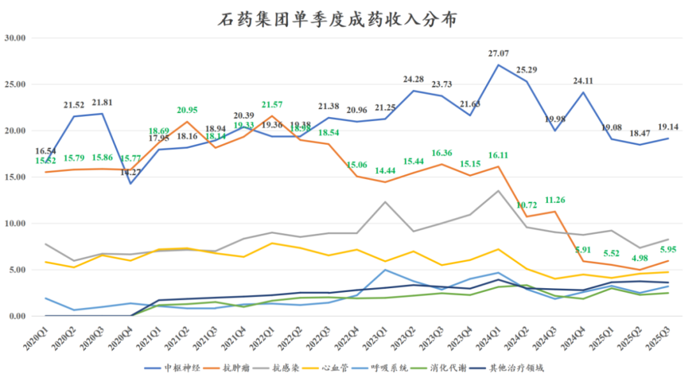

从成药的产品收入来看，公司前四大业务板块，中枢神经、抗肿瘤、抗感染、心血管，近年都处于剧烈波动中。

中枢神经板块在23-24年分别达到90.9亿元、96.5亿元的收入，占石药的成药收入比重达到40%以上，其中主力产品就是恩必普（丁苯酞胶囊/丁苯酞注射剂）这个国内卒中领域第一大药物，25年前三季度公司中枢神经板块收入56.69亿元同比-21.63%，神药丁苯酞终于也顶不住政策面的压力而出现大幅下滑。丁苯酞作为一款近百亿的国内超级大品种，专利已经到期，至今仍未能有仿制药上市，从2021年我们就开始关注该药物潜在竞品的问题，到现在2025年甚至未来2-3年公司可能还是要依靠该大品种支撑业绩基本盘，公司预计26年丁苯酞的销售会回到历史高位。

肿瘤板块曾是石药最辉煌的板块，也成了现在最拖累业绩的板块，2021-2022年巅峰时期单季度收入达到21亿元左右，2021年肿瘤板块收入77.1亿元，到2025年全年肿瘤板块收入可能在23亿元左右，相较2021年下滑超过70%。

实际上肿瘤板块是石药集团近年研发投入和研发项目最多、新获批药物最多的板块，反而表现如此拉垮，这是为何？这是我们本文题目的来源——路径依赖之祸。

2021年石药集团肿瘤板块达到巅峰的时候，其有3款重磅产品，分别是长效升白（津优力））、白蛋白紫杉醇（克艾力）、多美素（多柔比星脂质体），长效升白不用多说，百亿以上的市场潜力，另外2款改良型化疗药，销售规模均曾达到20亿-30亿元。

各位读者如果看国内创新药行业够久就知道，在国内一款创新药想要做到20亿-30亿的国内销售峰值有多么困难，得是比较不错的品种才能做到，而一款改良型化疗药在当年，可以在很短的时间内快速爬坡到这个销售体量。国内没有任何一家公司比石药更懂改良型化疗药的魅力。

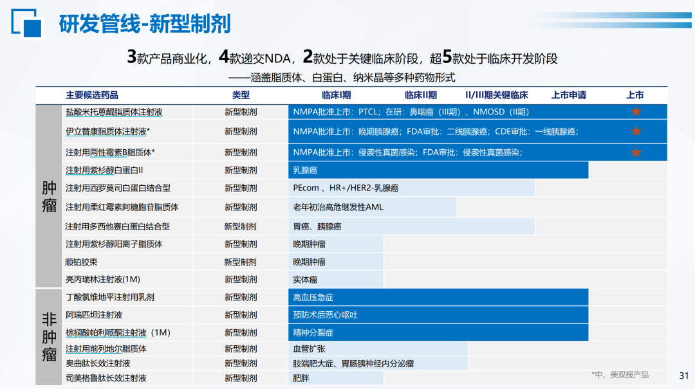

此后，石药集团做了米托蒽醌脂质体、紫杉醇纳米粒、柔红霉素阿糖胞苷脂质体、多西他赛（白蛋白结合型）、西罗莫司（白蛋白结合型）、顺铂胶束、紫杉醇阳离子脂质体等一系列改良型化疗药，对每个品种都是三五十亿的销售预期。

可惜时代变了，医保局不再为改良型化疗药买单，改良型化疗药的故事成为一场虚幻的泡沫，泡沫破裂的时候，对应石药肿瘤板块重磅品种陆续集采、收入崩盘式下滑。

直到今天，石药仍在努力开发改良型化疗药，沉迷其中无法自拔。

由此，石药也成为传统药企中仅剩的一家，直到2025年公司业绩仍在大规模的面临集采冲击的公司。

2、技术平台

石药集团在内的国内传统药企大多是做小分子药物起家，后来逐渐通过BD引进、收并购或者自建团队搭建起来抗体药、ADC药物、核酸类药物、核药、多肽药等领域的技术平台。

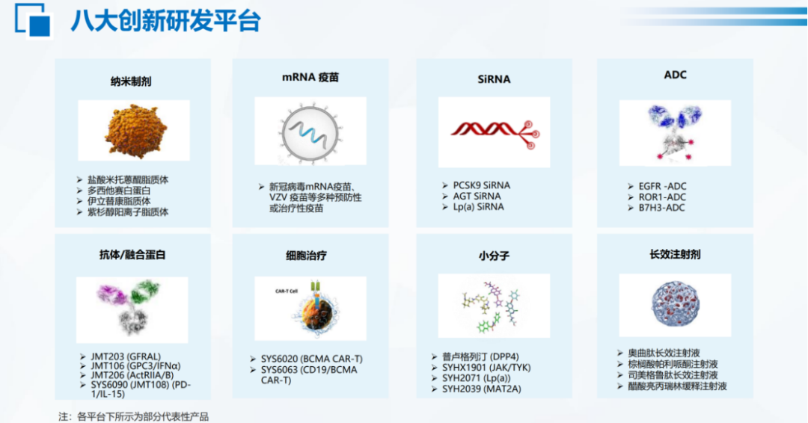

石药从高端小分子制剂平台（脂质体、纳米粒等），通过对外投资拓展了单抗、双抗技术平台，但自研项目除了几款生物类似药以外基本没有推出什么像样的产品，其PD-1单抗恩朗苏拜单抗也是上市时间太晚，难有好的销售表现，目前仍只有一个二线宫颈癌的适应症，基本算是失败的项目；RANKL单抗是一款创新药，目前竞品地舒单抗生物类似药陆续上来，以创新药申报的RANKL单抗也很难看到光明前景。

与武汉友芝友合作的一系列双抗的项目几乎是全军覆没，到今天我们看到CD3为基础的TCE双抗在血液瘤、实体瘤、自免等重大疾病领域都逐渐趋于火热，石药入门很早，选错了合作方，几乎是毫无建树。

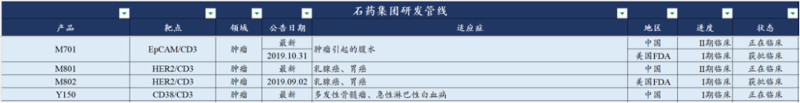

ADC领域石药入门不算晚，2021-2023年陆续布局了多个项目，也陆续有项目做海外BD，但规模都很小，像Claudin18.2-ADC由于临床数据太差而被退回海外权益。

目前ADC管线最具看点的，一个是其EGFR ADC，之前一直对外宣称是海外BD至少50亿美金以上、甚至可以超越百利天恒的EGFR/HER3双抗ADC的deal，只是不论是开临床还是谈BD，似乎都和百利天恒完全不可比；另一个是自康宁杰瑞引进的HER2双抗ADC，目前启动了多个适应症的III期临床。24-25年公司又陆续有多个ADC项目进入临床。和石药布局ADC时间差不多的信达生物已然成为国内ADC领域的一线公司。

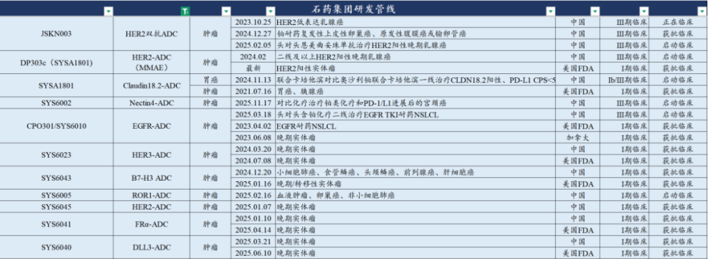

国内头部药企在IO双抗领域的布局，恒瑞基本是放弃治疗的状态，中生通过收购礼新实现布局，齐鲁开发了一款PD-1/CTLA-4的复方制剂，石药没有选择市场关注度最高的PD-1/L1\*VEGF的路线，选择了PD-1/IL-15，今年3/4月分别在中美拿到临床批件，进度不算领先，但目前看公司较为重视。

疫情期间，石药集团以“极其强大的执行力和综合能力”快速布局mRNA技术，在国内外几家在mRNA领域布局多年的公司的新冠mRNA疫苗都受阻的情况下，石药集团的mRNA仅用11个月完成获批I期临床到获批上市。但可惜其获批时间点是2023年3月，已经错过国内新冠疫苗的接种时间。

不过在mRNA疫苗技术基础上，石药后续开发了RSV、二价HPV、带状疱疹等的mNRA疫苗，目前都在I期临床阶段。

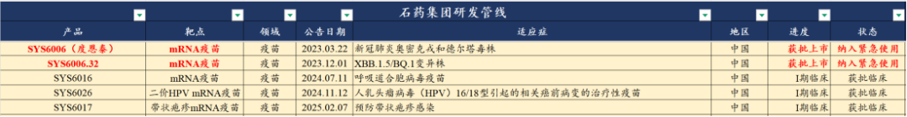

GLP-1代谢领域，石药集团早在2018年就从天境生物BD引进了一款GLP-1的融合蛋白药物依达格鲁肽，公司到接近5年后的2023年8月才启动III期临床，到25年10月完成肥胖适应症的III期临床并申报上市，但GLP-1单靶点减肥药物已经进入高度内卷，还要面临双靶点的降维打击式的竞争。

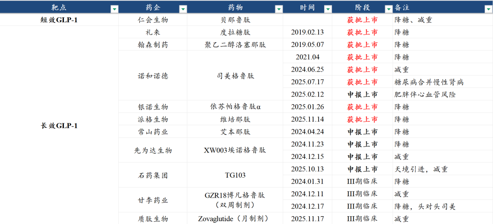

石药后续布局了司美格鲁肽的仿制药，但司美仿制药同样是高度内卷。再后续布局司美的改良型月制剂，以及小分子的GLP-1，且其SYH2086实现了不错的海外BD，公司还有长效GLP-1/GIPR双靶点激动剂在临床前研究。

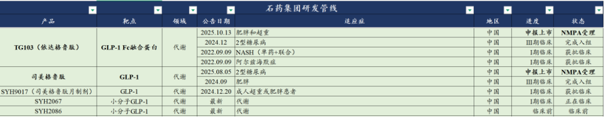

自免领域，石药在2019年自兴盟生物引进的奥马珠单抗生物类似药在2024年10月获批，石药巨石的乌司奴单抗生物类似药在24年11月申报上市，自和铂医药引进的FcRn单抗巴托利单抗申报注册一波三折，自康诺亚引进的IL-4Rα和TSLP的呼吸科适应症开发大幅miss，唯一在自免领域布局有一定机会的IL-23p19单抗也进度缓慢，那边信达生物已经临近获批，翰森/荃信在III期临床。

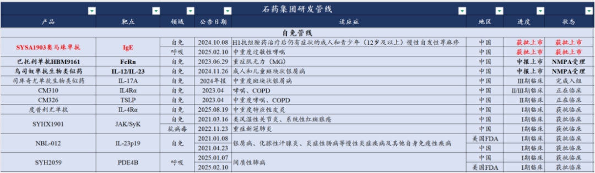

新技术平台方面，不多的看点来自siRNA领域，这几乎是目前全球最火的领域，自2023年11月SYH2053（PCSK siRNA）拿到临床批件，截至目前已经有5个小核酸项目拿到临床批件，分别是PCSK9、AGT、Lp（a）、ANGPTL3、C5，还有ALK7等靶点在临床前研究，石药集团在国内已上市公司中算是小核酸布局还较为领先的公司。

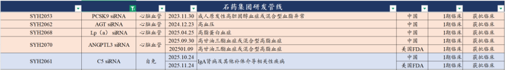

作为跟踪石药集团长达9年之久的医药投资人，在这里和大家梳理石药这些年的研发管线布局，真是不胜唏嘘。

石药这些年的研发投入也并不算少，2021年超过30亿研发费用，2022年接近40亿，2023年接近50亿，2024年52亿，2025年预计56亿以上。这样大规模的研发投入，堆出了足够的研发项目数量，但质量实在是不忍直视。

2026年公司有望获批上市的新产品，包括帕妥珠单抗生物类似药、乌司奴单抗生物类似药、安尼妥单抗（康宁杰瑞的KN026，HER2双抗）、依达格鲁肽（GLP-1）、司美格鲁肽仿制药（还要看原研专利延长情况）。这些产品在2026年也只能算是市场培育期，尚不能贡献多少收入。

3、BD交易

石药集团的BD交易（in/out）历史悠久，在2016年公司就曾把4款高端仿制药做海外BD授权。

从2018年开始到2023年，石药陆续进行了一系列的对外投资和license in，如投资武汉友芝友、收购永顺集团（RANKL单抗，EGFR单抗）、收购铭康生物（铭复乐，治疗急性心梗），BD引进度恩西布（PI3K抑制剂，目前已经在国内获批FL适应症）、神州细胞的CD20单抗（终止）、杭州英创医药的5款小分子药物、上海药物所的4款小分子药物、兴盟生物的奥马珠单抗、倍而达的三代EGFR、康诺亚的IL-4Rα和TSLP呼吸科权益、康宁杰瑞的HER2双抗和HER2双抗ADC、和铂医药的FcRn单抗、辉瑞的新冠口服药......

License out的质变出现在2024年底，从Lp（a）小分子药物授权阿斯利康开始，后续还谈成了与百济、AZ、Madrigal的三笔不错的BD交易，石药的对外BD交易累计获得5.53亿美元首付款和155.41亿美元的总交易对价。

可以看到石药集团最终实现BD大的突破的4个项目，都是小分子药物领域，石药集团多年技术平台的布局，似乎只有AI小分子药物发现的平台在全球化方面实现初步的价值兑现。

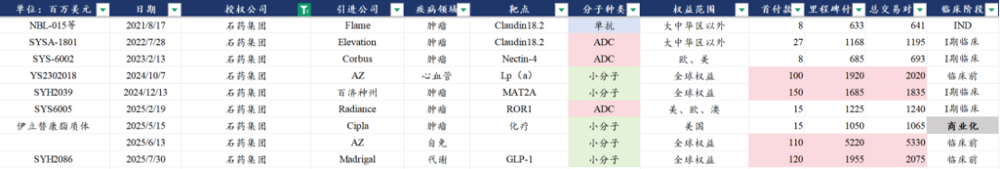

石药的创新药出海BD交易的改善是非常显著的，也将拉动其估值的提升，但在今年5月底，石药集团一纸公告，开了国内“预告式BD”的先河：

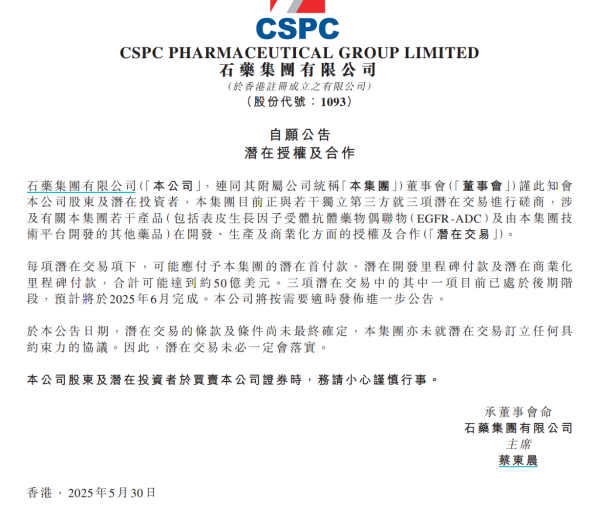

预告式BD虽然带来了短期股价的上涨，但重磅BD并未能如期落地，股价兜兜转转还是回到原点，距离其公告预告3个50亿美金的超大BD后，股价至今累计只涨了6%。

石药集团今年来股价上涨69%，涨幅也不小，但是跑输恒生医疗保健指数，更是显著跑输港股创新药指数，是港股头部创新药企中今年涨幅最小的一家（不算新IPO的恒瑞），市场对公司的行为给出了答案。

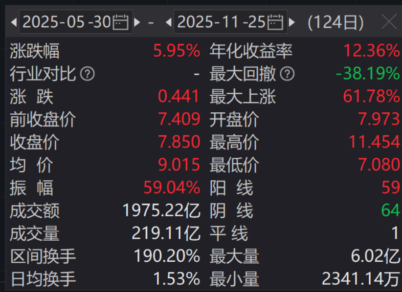

最后以我们此前的文章中回答的一条留言结尾，望一众上市公司引以为戒。

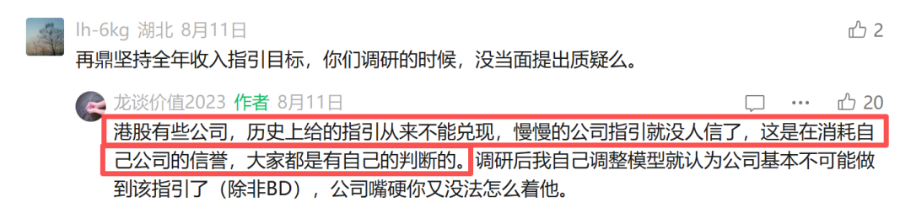

风险提示：本文仅讨论行业/公司经营情况，投资需综合考虑公司经营、估值、管理层等多方面因素，建议读者审慎参考，本文不作为投资依据，不建议大家根据本文做出投资计划。

<!-- wxmp-comments-begin -->

---

## 留言（13 条，含回复共 26 条）

- **马艺闻** 👍4 · 2025-11-25 14:59
  这算不算管理层战略有问题
  - ↳ **作者** · 2025-11-25 15:26
    那肯定是算的。
- **辜振宇** 👍4 · 2025-11-25 20:10
  这篇文章要发也应该在9月份市场先生对石药报价11元时发，而不是现在市场先生仅报价6元时发。
  - ↳ **作者** · 2025-11-25 21:30
    说得对，这公众号咋就不能判断4块是底部、11块是顶部呢，咋就不能底部推荐、顶部发文怼呢，只会跌了才开始怼，这公众号不行，垃圾，赶紧取关。
- **尹** 👍2 · 2025-11-25 14:01
  龙大  泰格医疗的成长是不是好于凯莱英
  - ↳ **作者** · 2025-11-25 14:03
    目前看CDMO行业中期的表现还是要好于CRO，临床CRO在全球市场来看中国企业很难占据较强的行业竞争力，而国内的CDMO企业的全球竞争力已经非常清晰明确。换句话说，CRO更多还是跟随国内创新药β的逻辑，CDMO是跟随全球创新药β的逻辑。
- **COCO** 👍2 · 2025-11-25 14:02
  啥时候再来一篇血制品行业分析文章
  - ↳ **作者** · 2025-11-25 14:07
    行业相较上半年的文章并没有边际变化出现，无须做特别的文章更新行业观点。
- **Zg** 👍2 · 2025-11-25 17:11
  创新药有企稳迹象了，希望资金能慢慢买回吧。长坡厚雪的赛道是真熬人啊。
- **聂士飞** 👍1 · 2025-11-25 14:11
  龙大，片仔癀处于底部吗？性价比如何
  - ↳ **作者** · 2025-11-25 14:14
    片仔癀一直令我比较费解的是，茅台早都不到20倍PE了，片仔癀为什么还能一直维持40倍以上的PE。
  - ↳ **作者** · 2025-11-25 14:21
    持有人结构不同，且骗子黄本身还是具有很大壁垒的，在吃药还是喝酒上，药优先级药高一些
- **心宁静与自由** 👍1 · 2025-11-25 14:35
  龙哥，时代天使你看好不？想慢慢地布局。不过消费现在很低迷
  - ↳ **作者** · 2025-11-25 21:38
    时代天使主要是看海外业务的盈利改善情况，光看国内消费环境的话肯定是比较困难。
- **尘缘** 👍1 · 2025-11-25 15:49
  石药的创新药是不是大部分都装进了新诺威了？
  - ↳ **作者** · 2025-11-25 21:37
    装了一部分，反正石药对新诺威还是控制大部分股权嘛
- **卢光明** · 2025-11-25 13:57
  龙大，礼来第一家万亿美元市值，希望我们也出现类似这样的大企，而不是整天趴在中药上。
  - ↳ **作者** · 2025-11-25 14:01
    前途是光明的，我们早就不是整天趴在中药上了，医药公司市值TOP40里只有3家中药公司，片仔癀、云南白药、华润三九，今年来分别-16%、-3%、-14%。市场也在投票。
- **雪山之巅8866** · 2025-11-25 14:14
  龙大觉得石药还有未来吗？
  - ↳ **作者** · 2025-11-25 14:15
    从产品线和研发管线来看基本面拐点可能在27-28年，但由于有BD，可能会提前一些。
- **空白°** · 2025-11-25 14:15
  龙哥，以迈瑞为首的器械怎么这么难，什么时候能见到拐点？
  - ↳ **作者** · 2025-11-25 14:18
    严格意义上说是医疗设备难，设备今年难搞我们也不是第一次说了，对耗材我们还信心稍微多一些，耗材总体政策面基本见底，叠加一些出海，后面还是有一些机会的。设备国内这块就完全看不清，医院的情况、cz的情况都是一言难尽。
- **张雪凡** · 2025-11-25 14:45
  龙哥的号不是转让了吗？还是之前分析一医药大神的龙哥吗？
  - ↳ **作者** · 2025-11-25 15:26
    你这不关注我两年多吗，咋会问这个问题[破涕为笑][破涕为笑]关注2年多前面文章没看嘛[破涕为笑]
- **峰回路转** · 2025-11-25 18:18
  <a class="js_mention_entry wx_at_link" data-biz="Mzk0NzY4MjM5MA==" data-username="gh_63f7f08149c4" href="">@元宝</a>总结一下
  - ↳ **作者** · 2025-11-25 18:18
    石药集团因过度依赖改良型化疗药陷入&quot;路径依赖&quot;困境，肿瘤板块收入较2021年下滑超70%。虽在ADC、siRNA等新领域布局，但业绩承压，近期创新药出海带来转机。

<!-- wxmp-comments-end -->
