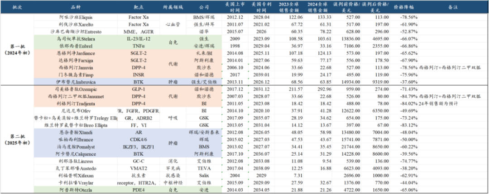
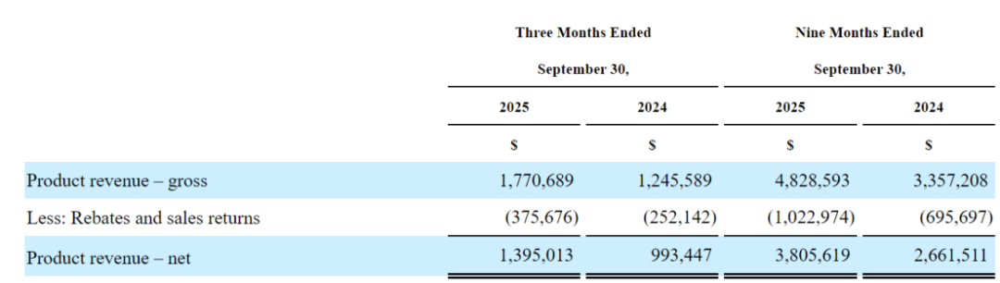
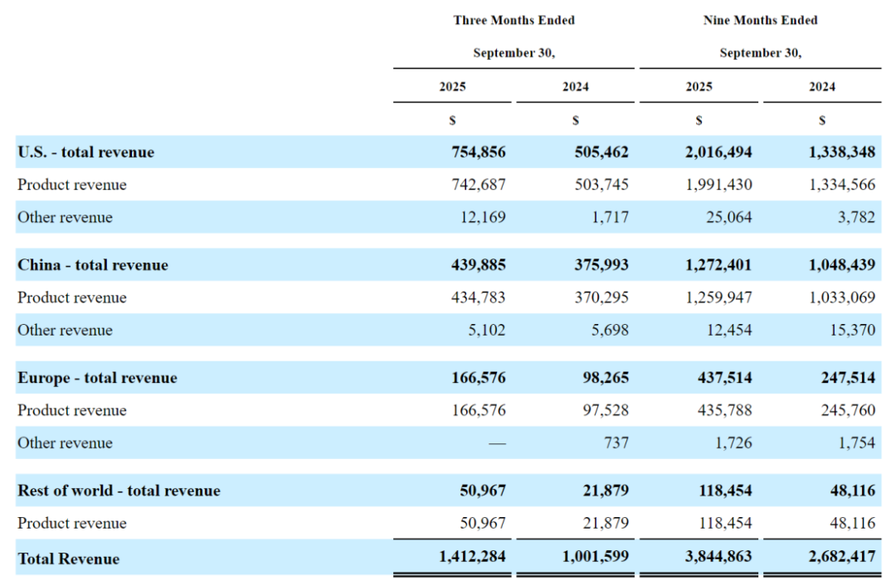
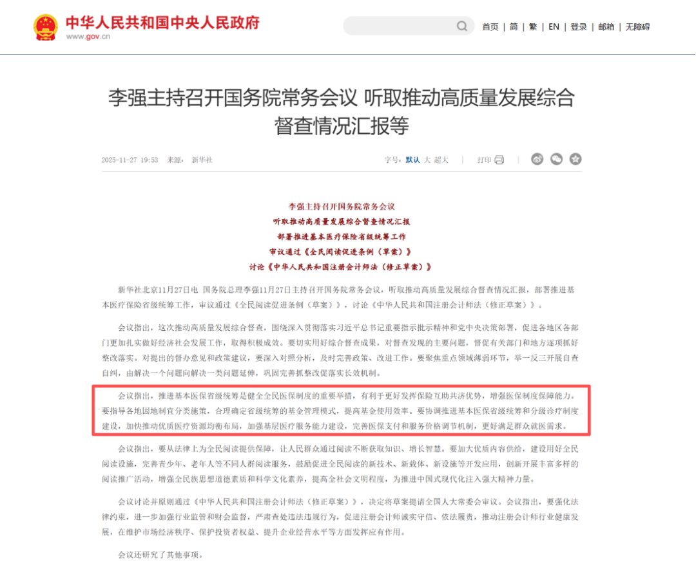
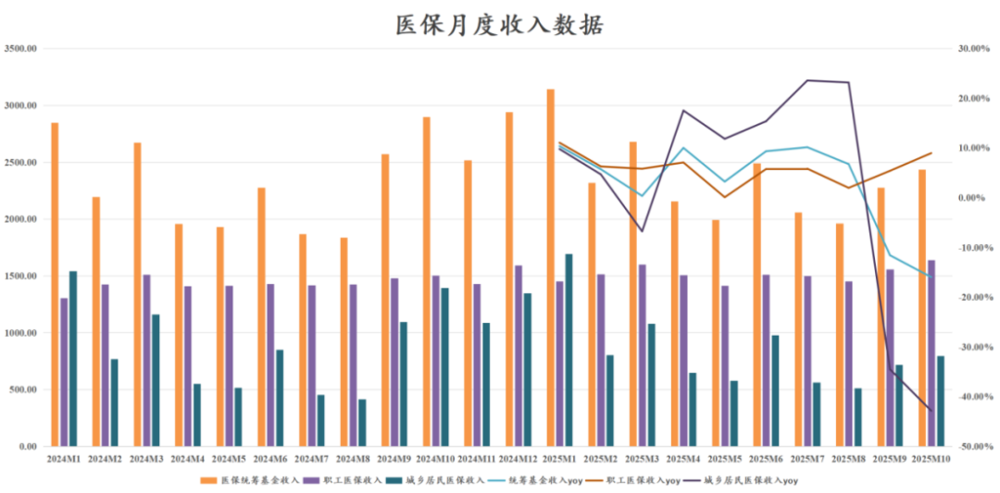
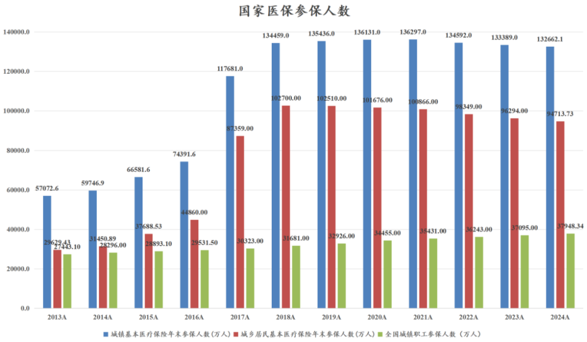
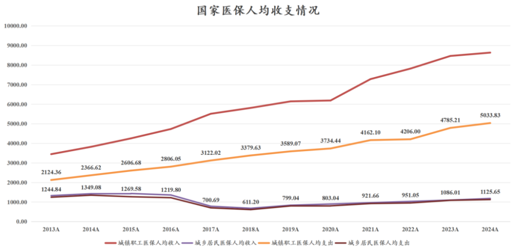

# 国内外两大重要医药政策

大家好，我是龙哥。

这两天国内外医药领域均有比较重要的政策推出或落地，我们就在本文一起来聊聊，由此来看看国内外目前和未来的医药行业政策方向。

1、美国药品大降价

前天，美国医疗保险与医疗补助服务中心（CMS）公布了通胀削减法案（IRA）下的第二批药品价格谈判结果，关于IRA法案的详细解读，我们在今年3月份的文章《[美国药品大降价](https://mp.weixin.qq.com/s?__biz=MzkyMzQ3MDc3Mw==&mid=2247484234&idx=1&sn=28cf6165faae82f398c9afb5f39bd641&scene=21#wechat_redirect)》中有较为详细的介绍，这里就不再做过多政策本身的解读，我们直接来看第二批价格谈判的结果。

第一批IRA法案谈判药品合计有10个品种，在2024年初公布名单，2024年8月进行价格谈判落地并公布结果，结果显示10个品种的终端月用药费用平均降价幅度为65.19%，价格降幅区间为37.6%-78.6%。

第二批IRA法案谈判药品合计有15个品种，在2025年初公布名单，2025年11月进行价格谈判落地并公布结果，结果显示15个品种的终端月用药费用平均降价幅度为61.94%，价格降幅区间为38.2%-84.8%。

看这个价格降幅，是不是很有国内医保谈判降价那个味道了？是不是担心美国药品行业要完蛋了？

不要慌，问题不大。以上价格降幅是终端价降幅而不是出厂价降幅，实际出厂价降幅要远小的多。

我们以大家最熟悉的百济神州的财务报表来解释这个问题。百济神州的美股财报中有披露如下数据：2025年前三季度产品收入合计是48.286亿美元，其中报表上的产品净收入是38.056亿美元，中间差的10.23亿美元，就是“rebates and sales returns”——销售返利和退货，也即25年前三季度百济神州给美国医保管理机构的销售返利部分占总的产品收入比重是21.2%。

如果我们假设销售返利大部分来自美国市场收入，2025年前三季度百济神州报表端来自美国市场的收入是20.165亿美元，其中泽布替尼前三季度美国销售额为19.90亿美元，也即百济在美国市场收入几乎全部是泽布替尼。

以此可以推算，销售返利占百济神州美国销售额的33%左右。

我们再回到这两次IRA降价情况来看，百济神州的泽布替尼的可比品种，强生/艾伯维的伊布替尼的月治疗费用由14934美元降至9319美元，降价幅度是37.6%；阿斯利康的阿卡替尼价格由14228美元降至8600美元，降价幅度约为39.56%。

假设未来百济神州的泽布替尼也被纳入IRA，降价幅度也在35%-40%之间，并且假设降价后消除销售返利部分，则实际的百济报表口径的出厂价降价幅度约为3%-10%，中性预期是出厂价降价7%。

再考虑Medicare PartD支付只是美国总体医保支出的一部分，以及美国市场收入占全球收入比重50%-70%，实际的收入端影响就只有低个位数。

其他降价幅度比较大的品种我们也可以去类比，例如：GSK的COPD三联疗法Trelegy Elliptaz在2024年使用了53亿美元的PartD的医保费用支出，而GSK实际24年销售27.02亿英镑，其中美国销售19.86亿英镑（约25亿美元），再考虑PartD支付的部分，实际渠道价差可能高达2倍以上，而该品种本次谈判降价幅度是73%。

也因此，IRA法案从目前来看，的确是很大程度上去削减渠道回扣费用，对出厂价不能说完全没影响，但这个影响幅度的确比较有限，这也是为什么欧美的MNC们很多不惧政策面而股价持续创出历史新高（产品管线增长的公司）。

IRA法案的其他影响，在年初的文章中都有讲到，唯一不同的点是，小分子药物纳入IRA法案的时间可能与大分子拉平，这样不会形成对药物形式的歧视，从而不影响药企开发小分子药物的意愿。

2、国内推进省级医保统筹

昨天总理主持召开的国常会，部署推进基本医疗保险省级统筹工作，从而发挥保险互助共济优势，增强医保制度保障能力，提高基金使用效率。

为什么要推进省级医保统筹？

目前的国家医保是市级统筹，一个省内各个地级市之间的基本医保账户是独立的，这个就会存在一个问题，省内各个城市的经济发展状况、在经济结构中的作用可能存在较大差异，这就意味着各个城市之间的就业、财政状况存在较大差异，对应的会较大程度上影响职工医保和居民医保的收入情况，进而影响各个城市的支付能力。

中西部省份有一些省会，就有比较别致的“外号”，例如成都的“成惯吸”、武汉的“捂着吸”、西安的“安慕吸”、合肥的“吸的肥”，这些省会城市会对省内周边城市从产业、经济到人才形成虹吸，从而出现明显的省内经济发展的区域间不平衡。

对于经济发达的城市，优质企业数量多、工作岗位多、就业机会多，职工医保充裕的同时，财政收入也较多，对于较为依赖财政支出的居民医保也会比较游刃有余。

而对于经济发展较差的城市，则是职工医保欠缺、老百姓较多依靠居民医保，又同时由于财政收入压力大，依赖财政支出的居民医保本身收入压力就很大，从而导致医保压力double。

刚好昨晚国家医保局发布了2025年1-10月的统筹医保收支数据：

2025年1-10月医保统筹基金收入2.35万亿同比增长1.97%，其中职工医保收入1.515万亿同比增长5.8%维持稳定，居民医保收入8369亿同比下降4.3%为近两年首次转负。

2025年10月单月医保统筹基金收入2434亿同比下降15.98%为近年最差单月表现，其中职工医保收入1638亿元同比增长8.96%表现较好，居民医保收入796.8亿元同比下降42.86%，此前9月单月下滑34.5%，为近两年居民医保收入最差的单月同比。

每年底到次年初一般是居民医保密集缴纳的时间，今年居民医保相较往年表现月度更平均一些，但高达43%的同比下滑幅度仍可能预示着地方财政的较大压力。

在总体的医保收支结构中，职工医保的收入和支出占统筹医保收支比重分别为64%和57%，这部分医保缴纳人数约3.8亿人，占全国人口的28%左右，且缴纳人数还在增加，平均支付能力较强，收支表现均较为稳定。

居民医保部分覆盖全国约9.4亿人，占全国人口的67%左右（另外5%既没有职工医保也没有居民医保），这部分人群在逐渐下降——部分转到职工医保。

居民医保的人均医保支付水平只有职工医保的22%，2024年人均居民医保支出1126元VS人均职工医保支出5034元。

居民医保约有三分之二来自财政支出——你交的400块居民医保费用相当于财政平均给你补贴700-800，且越是经济差、财政收入差的后新城市的医疗支出更加依赖居民医保/财政，本身会形成悖论。

以上两方面原因——城市间经济发展不平衡+医保收支结构，使得进行省内的医保统筹就变得较为重要，这是医疗领域“共同富裕”的一部分，不仅是对投资的影响，更是影响每一位读者的切身利益。

至于对医药行业带来的潜在影响，主要是后线城市的医疗支付能力会有边际改善，例如用药、器械，还有后线城市的医疗服务等。

......

不知不觉又到月底，老规矩月底开一次赞赏，大家的支持是我们持续分享的动力。

11月还是挺不容易的一个月，但相较9-10月，港股创新药行业还是有所好转，11月以来恒生医疗保健指数累计涨1.66%（10月份为-11.05%），恒生创新药指数累计涨2.15%（10月份为-12.74%），月度表现转正，11月美股创新药XBI指数涨9%、表现强势。

全球创新药行业在技术层面在蓬勃发展、持续突破，创新药本质是高端生物科技，科技行业投资核心是跟随技术发展，国内外政策面的影响也都已经逐渐清晰，还是可以多一些信心，多一些耐心。

风险提示：本文仅讨论行业/公司经营情况，投资需综合考虑公司经营、估值、管理层等多方面因素，建议读者审慎参考，本文不作为投资依据，不建议大家根据本文做出投资计划。

<!-- wxmp-comments-begin -->

---

## 留言（9 条，含回复共 19 条）

- **牛马嘉** 👍3 · 2025-11-28 11:25
  港股创新药目前感觉还能捡漏的可能就是映恩了。很多公司上半年的上涨已经透支了。不过现在的下杀才能看出来哪些公司属于真正的好公司，或者说估值相对合理一些了。
- **天野源** 👍2 · 2025-11-28 11:21
  龙哥，您觉得创新药接下来会走出主升浪吗？25年估值修复，26年利润增长走出主升？买港股通创新药ETF的策略还行吗？有人在说ETF可能不太行了[捂脸]
  - ↳ **作者** · 2025-11-28 11:29
    ETF咱们只是说从行业层面来说中短期看今年涨幅比较大，但你要知道，如果产业趋势向上，行业指数不可能不涨的，因为行业龙头一定是向上的，行业龙头向上就会带动指数成分股的主体向上。
- **返璞归真的老肖** 👍1 · 2025-11-28 11:07
  龙哥，中源协和可以算到创新药概念吗？
  - ↳ **作者** · 2025-11-28 11:10
    AH正经的创新药公司有200家，加上不正经的“创新药概念”估计三四百家是有的，只是个创新药概念的话，对投资会有很大帮助吗......
- **杜先生** 👍1 · 2025-11-28 11:16
  是不是可以这么理解：至少在三年内，药价下降是全球性的大趋势？
  - ↳ **作者** · 2025-11-28 11:18
    可以这么理解，但其实对投资没太大意义。
    我们过去搞集采最开始想的是砍掉中间灰色部分的价差、对出厂价影响没那么大，实际来看渠道价差和出厂价一起被砍，这个对投资的影响是巨大的。
    而现在IRA法案来看，出厂价降幅会比较小，主要是把中间回扣部分给砍掉，这个对投资的影响就没多大，主要影响的是商保机构——联合健康。
- **星移无痕** 👍1 · 2025-11-28 11:26
  咦，现在赞赏了还会显示出来给下情绪价值哈[爱心]
  - ↳ **作者** · 2025-11-28 11:35
    感谢支持哈~
    一直显示的呀，之前可能你没注意。
  - ↳ **作者** · 2025-11-28 11:55
    我才发现是这样显示的，那确实不一样，哈哈😂
- **蔡亮** · 2025-11-28 11:12
  终端药价降了。出厂药价降是早晚的事情。拼多多刚出来的时候都笑话他是低端的。最后呢？所有的产品不停的降价。这叫比价效应。
  - ↳ **作者** · 2025-11-28 11:14
    你可以多了解了解美国的药品政策、销售结构、药品价格再来评论。真要说比价效应，那美国药价比中国药品价格贵10-20倍这合理吗。
- **陈龙** · 2025-11-28 11:16
  支持一下，迈瑞老板增持这是增加信心啊[憨笑]，但是行业应该还未触底，龙大怎么看迈瑞的估值，当下是否偏低[微笑]
  - ↳ **作者** · 2025-11-28 11:19
    在看不清基本面中长期趋势之前很难说估值的高低。
- **moro** · 2025-11-28 11:18
  龙哥我一直场外投的CS创新药，你觉得有必要换到港股创新药吗
  - ↳ **作者** · 2025-11-28 11:21
    就从目前的AH创新药质地和估值来看，我们还是更倾向于投港股创新药。
  - ↳ **作者** · 2025-11-28 11:30
    时间点我判断不了，就像你说的，A股创新药前面那周单周跌幅很大，那短期是不是会反弹啥的我也不知道，前几天还有读者留言说最近A股创新药表现强于H股呢，我一看就是3天的表现好一点，这种短周期的波动我是真判断不了。
- **Rita .Z** · 2025-11-28 12:53
  三生分拆的事儿到底是好是坏啊？求分析
  - ↳ **作者** · 2025-11-28 12:58
    算是中性的事吧，反正后面直接给分曼迪的股权嘛，对你当下的股权价值也没啥大影响。

<!-- wxmp-comments-end -->
