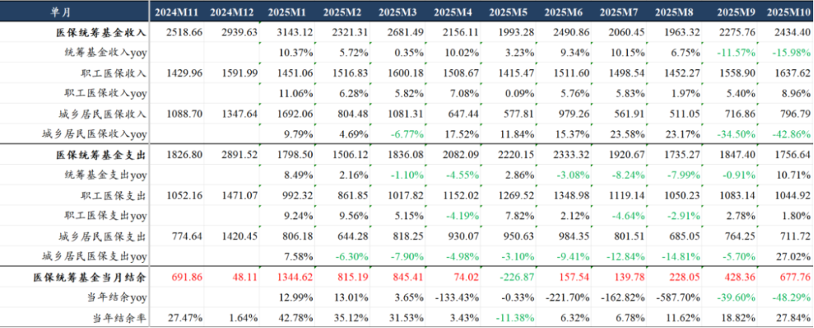

# 创新器械出海先锋

大家好，我是龙哥。

今天梳理下医疗器械领域出海做的比较领先的公司。

就整个医疗器械行业来说，国内政策面今年开始有边际改善，但是，其一是如下图所示，医保数据很差，在定价上现在给了明确支持的细分创新器械领域还是偏少，其二是从政策面边际变化传导到业绩端，我们此前也多次提到，创新药行业这个过程大概用了1.5-2年时间。

对于医疗器械公司来说，在当前的国内政策和经济环境下，也是要谋求出路，不少公司在这两年陆续开始在海外市场发力，到今年我们已经看到一些公司在出海方面有较大的突破，这是我们写这篇文章的原因。但我们无法穷举所有出海的公司，也欢迎各位读者做补充。

从医疗器械的各个细分领域来看，过去出海做的比较好的主要是医疗设备和低值耗材领域，这两个领域都是偏制造业属性，高度依赖我国的供应链优势，例如大家耳熟能详的迈瑞医疗、开立医疗（超声、监护等）等设备领域领先的公司，以及手套、口罩等低值耗材，还有类似南微医学、安杰思的内镜下耗材（止血夹、活检钳等）这些中低值耗材。IVD在过去几年国内企业出海也做的还不错，依托IVD设备的供应链优势先抢占装机市场，然后试剂逐渐放量，如迈瑞医疗、新产业等公司是领头羊，后续还有亚辉龙等公司在努力做海外市场。

过去大家普遍认为高值耗材的出海会相对困难一些，因为涉及到国际巨头的专利、渠道、品牌优势等，并且国内这些高值耗材企业的收入体量和国际巨头相比差着两到三个数量级（几亿到几十亿人民币VS千亿人民币）。但困难的事不代表一定做不成，在一部分细分领域（隐形正畸、骨科）、或者通过特别的方式（波科收购先瑞达65%股权）等方式，国内企业也可以实现出海的突破。

1、高值耗材

今年高值耗材领域在出海方面做的比较突出的是骨科（春立医疗、爱康医疗、大博医疗等）、隐形正畸（时代天使）、血管介入（先瑞达医疗、微电生理）等。

骨科我们在今年5月份写过一篇文章《[骨科行业新征程](https://mp.weixin.qq.com/s?__biz=MzkyMzQ3MDc3Mw==&mid=2247484565&idx=1&sn=8844a485f7ad04d8f4cb73f7e8253ce5&scene=21#wechat_redirect)》，从行业层面来看，国内政策面出清、国际化收入占比提升、研发投入增加、业务范围拓展和创新等已经成为明确的行业趋势。

春立医疗2024年海外收入占比已经已经达到3.5亿元同比增长78%、收入占比44%，25年上半年海外收入增速也有30%以上，收入占比在40%以上，绝对金额超过2亿元，不论是绝对金额还是收入占比，春立都已经成为国内骨科企业出海的先锋。

爱康医疗24年海外收入2.74亿元同比+20.78%，海外收入占比20.38%，25年上半年海外收入1.28亿元+3.98%，海外收入占比18.47%。爱康25年上半年收入比春立高40%左右，净利率水平接近，但由于两家公司海外收入结构的差异，使得两家公司的H股市值居然是差不多的，也就意味着春立的估值大概要比爱康高40%左右。当然可能这也意味着爱康未来海外业务如果能有大的突破，也会有估值提升空间。

大博医疗24年海外收入2.17亿元同比增长0.23%，25年上半年海外收入1.58亿元同比增长50.8%，海外收入占比13%，总体海外收入占比还不太高，但也在努力拓展国际市场。

国内骨科耗材集采把行业干的一塌糊涂，倒逼企业去谋生存谋发展，只能拓展海外市场，类似仿制药集采倒逼企业创新研发和海外BD。

隐形正畸领域，时代天使同样是在面临国内市场巨大压力的情况下被倒逼拓展全球市场，2024年时代天使国内案例数21.87万例+3.16%，国际市场案例数14.07万例+326%，2025年国内外的案例数预计都在25万例左右，国内外的案例数已经达到五五开，预计到2026年有望看到时代天使的海外收入超越国内收入。

到2025年时代天使海外业务仍将维持亏损，这已经是时代天使自2022年以来在海外市场投入和亏损的第四年，也说明了做国际市场所需要付出的高昂成本和较长投入周期。在开始有威胁到隐适美国际市场地位的迹象出现时，隐适美在今年也开启了对时代天使在国际市场的专利战，这同样是高值耗材企业出海所要面临的挑战之一，时代天使已经在积极备战。

血管介入领域，外周血管介入的龙头公司之一——先瑞达医疗，其出海模式算是独树一帜的，全球器械龙头波士顿科学在2023年收购了先瑞达医疗65%的股权使其成为波科的控股子公司，先瑞达医疗在海外注册的产品可以利用波科的全球渠道进行销售，这不同于创新药海外BD的模式，相当于让器械界的MNC成为先瑞达的“全球总代”，这种模式下的出海，持续性和确定性都会比较强，由此，先瑞达的海外订单在25年会开始有所增加，26年及以后可能会看到逐年爆发。

电生理领域，微电生理的海外收入占比在25年上半年达到31.05%，相较2024年的27.17%又有提升，电生理不论是在国内还是全球市场都是属于器械领域中长坡厚雪的赛道，也因此，行业龙头微电生理和惠泰医疗过去几年在整个器械行业都算是长期维持较高估值溢价的公司。

2、医疗设备

医疗设备领域的细分也比较多，过去我国医疗设备出海做的比较好的主要是小型设备，如超声、监护这些领域，做的比较好的企业像迈瑞医疗、开立医疗、祥生医疗等公司的海外收入占比都不低。在技术门槛比较高的领域，基因测序仪的华大智造海外收入占比一直在三分之一左右，也是参与全球市场竞争的细分领域龙头。

不过我们今天想重点聊的是这两年在国际化方面有较大突破的公司，主要是手术机器人和大型医学影像设备这两个领域，可谓是医疗设备领域“皇冠上的明珠”。

大型医学影像设备领域，联影医疗作为国内的行业龙头，这两年国内市场也不太好做，2024年国内市场收入80亿同比下滑17.46%，2025年上半年国内收入48.7亿+10.7%。但同时联影医疗在国际市场持续发力，23-25H1的海外收入增速分别为56%、35%和23%，海外收入占比在2024年提升至22%。联影医疗在国际市场的突破，不仅是靠设备的高性价比，在美国市场更是依靠超高端的PET-CT抢占市场，这和很多人认为的中国高端医疗设备相比GPS（GE、飞利浦、西门子）等国际巨头有较大差距的传统认知有较大差异。低端品牌向高端品牌拓展的难度会比较大，而高端品牌向中低端拓展的难度会小的多，联影的第一张王牌已经打出。今年6月联影智能医疗科技完成了10亿元的A轮融资，联影的第二张王牌AI产品也已经蓄势待发，海外的GPS们准备好迎接医疗设备的AI时代了吗？

手术机器人领域，今年微创手术机器人在国际化方面也是实现跨越式的突破，2024年图迈腔镜手术机器人实现国内装机19台、海外装机11台，2025年上半年实现国内装机6台、海外装机16台，并且根据公司披露的信息，截止到今年10月初，图迈的全球累计商业化订单已经突破100台、累计装机达到80台，仅今年全年，图迈海外的订单可能就会达到60-80台。手术机器人我们知道可谓是目前医疗设备领域最好的商业模式，销售主机只是其创收的第一步，后续随着手术机器人的临床使用可以持续的获得绑定的高价耗材费收入和后续维保和升级等服务费收入，理想情况下耗材+服务费收入会远超主机的收入，也因此，海外手术机器人龙头直觉外科目前2000亿市值、20倍PS、70倍PE，估值水平显著高于传统的医疗器械龙头（美敦力3.7倍PS、强生5.3倍PS、波科7.4倍PS）。

另外在家用呼吸机领域，瑞迈特（过去的怡和嘉业）今年海外业务也开始恢复增长，海外渠道库存出清以及新产品的推出，使得瑞迈特今年上半年海外收入同比增长61%，海外收入占比达到65%，跟踪海关出口数据可见下半年瑞迈特的出口依然维持较高的增速。

3、低值耗材

低值耗材出海的公司比较多，这里简单聊下空间和资金容量最大的手套行业今年的边际变化。

今年以来国内手套龙头公司英科医疗的股价涨了70%，但其实从手套价格和国际形势来说今年手套行业并不算是很好的一年，但对于手套这种较为成熟、需求端增长相对稳定（除疫情扰动外）的工业品来说，供给端的变化情况对价格的影响实际上更大。今年来行业的边际变化在于不论是丁腈手套还是PVC手套都有部分国内龙头厂商的供给收缩，叠加关税战的情况大家也都知道，关税不但没有进一步增加，反而还减少了10个点，对于手套企业来说也是比较直接的成本降低。

4、IVD

IVD领域自24年下半年以来国内市场呈现非常大的压力，这个压力来自多方面，既包括化学发光试剂集采的压力，也来自DRG和拆套餐的压力，同时还有常态化医疗反腐的压力，因此我们在今年初讲行业观点的时候就提到，中成药和IVD是去年下半年以来政策面和基本面恶化最明确的细分领域。

IVD领域出海做的比较突出的行业龙头是迈瑞医疗和新产业。新产业24年国内收入增速掉到只有9.3%，但由于国际市场增速还有28%，使得其总体收入增速达到15%、国际收入占比提升至37%。25年来国内市场环境进一步恶化，新产业25年上半年国内市场收入下滑12.8%，但同时国际市场收入增长19.6%，使得总体收入同比仅下滑1%，国际收入占比提升至44%。相比之下，迈瑞的IVD业务24年收入增长10.8%，25年上半年同比下滑18.5%；安图生物24年收入增长0.6%，25年前三季度收入同比下滑7.5%。IVD板块国内压力可能还会持续，行业层面和龙头公司都还难言见底。

5、医疗器械供应链

医疗器械供应链公司，可以类比制药板块的原料药公司和CDMO/CMO公司，既可以生产成熟的通用型供应链产品，也可以为国内及国际医疗器械企业做定制化开发和生产，不过供应链公司普遍存在的问题还是市场容量偏小，这其中有两家公司的市场容量还不错、同时公司有较强的横向拓展能力，也就是平板探测器龙头奕瑞科技和家用呼吸机配件龙头美好医疗。

奕瑞科技今年医疗和工业板块平板探测器业务是有所回升的，同时还有整机代工和部分新的零部件代工的发力，但其今年股价最大的驱动因素还是为兄弟公司视涯科技代工生产CMOS，视涯科技获得Meta AI眼镜的硅基OLED订单，并给视涯科技支付了预付款，而视涯科技在今年二季度给奕瑞科技支付了6亿左右的预付款，体现在奕瑞科技的现金流量表和资产负债表中。

......

医疗器械出海，已经逐渐在业绩趋势和估值上使得器械各个细分领域的公司拉开差距，仅在国内市场内卷的天花板普遍较低，过去在国内轻松赚钱的时代已经一去不复返，有竞争力的企业必然要参与到全球市场竞争中，做困难的事，做正确的事。

......

近期重点文章：

[国内外两大重要医药政策](https://mp.weixin.qq.com/s?__biz=MzkyMzQ3MDc3Mw==&mid=2247485250&idx=1&sn=26b1db9e62c4b9bc35e696f701dae3fa&scene=21#wechat_redirect)

[时来天地皆同力，运去英雄不自由](https://mp.weixin.qq.com/s?__biz=MzkyMzQ3MDc3Mw==&mid=2247485218&idx=1&sn=39925301800ea61fe2312d4e74675777&scene=21#wechat_redirect)

[全球顶级大药的狂欢](https://mp.weixin.qq.com/s?__biz=MzkyMzQ3MDc3Mw==&mid=2247485203&idx=1&sn=0b605ddfb552f201dccf6d651f3c7278&scene=21#wechat_redirect)

[创新药三季度分化，龙头新高](https://mp.weixin.qq.com/s?__biz=MzkyMzQ3MDc3Mw==&mid=2247485190&idx=1&sn=f40e332365cef8cd827481c6fb952ae9&scene=21#wechat_redirect)

风险提示：本文仅讨论行业/公司经营情况，投资需综合考虑公司经营、估值、管理层等多方面因素，建议读者审慎参考，本文不作为投资依据，不建议大家根据本文做出投资计划。

<!-- wxmp-comments-begin -->

---

## 留言（16 条，含回复共 33 条）

- **执着如呆** 👍4 · 2025-12-02 15:23
  器械跌出创伤综合症了[流泪]
- **王熙** 👍3 · 2025-12-02 15:10
  最看好微创机器人，对标达芬奇手术机器人公司。
  - ↳ **作者** · 2025-12-02 15:16
    微创机器人原本感觉已经非常艰难了，资金压力也巨大，海外突破之后就大幅改观了。
- **HuangCX** 👍3 · 2025-12-02 15:21
  开立医疗，2条产品线（超声和内窥镜）产品质量都是过硬的，奈何市场和销售都比较差，没有抓住机遇。现在2条产线竞争者越来越多了，外科和iuvs又投了很多固定资产。老板不居安思危。
  - ↳ **作者** · 2025-12-02 15:23
    开立医疗我跟踪了这么多年，引用一位故人的话就是，阶段性的踌躇满志，持续性的混吃等死。
  - ↳ **作者** · 2025-12-02 16:11
    哈哈哈哈，这和大部分人上班差不多，间接性努力，持续性摆烂
- **CHY** 👍3 · 2025-12-02 15:33
  图迈是迈瑞旗下的嘛
  - ↳ **作者** · 2025-12-02 15:36
    图迈手术机器人是微创医疗的子公司微创手术机器人的产品。迈瑞目前没有做手术机器人，但内部可能是有项目规划或者布局的。
- **安候鸟** 👍2 · 2025-12-02 15:36
  医疗影像领域，一脉能不能有一席之地？
  - ↳ **作者** · 2025-12-02 15:40
    一脉阳光做第三方医学影像中心，这个商业模式长期来说我不是很确定，三方检验那边现在是一片狼藉。
- **yuraisy** 👍1 · 2025-12-02 15:10
  龙大，下周美国防法案要表决了，怎么看？前几日外媒披露药明被建议进h1620名单，这样就会联动温和版不点名的生物法案，等于变相进去了
  - ↳ **作者** · 2025-12-02 15:14
    国防授权法案进去的中国公司挺多的，影响嘛好像也就那样，核心还是看有没有限制这些MNC或者biotech的订单吧。
- **翊瑋** 👍1 · 2025-12-02 15:13
  龙哥，凯利泰是不是已经被排除在骨科之外了... 
  - ↳ **作者** · 2025-12-02 15:14
    凯利泰不是去做什么消毒、贸易啥的了吗，他也没想好好做骨科业务了啊
- **Susanna Su** 👍1 · 2025-12-02 15:21
  龙大 请问英诺特在试剂行业中的出海竞争力怎么样啊？
  - ↳ **作者** · 2025-12-02 15:25
    英诺特没啥海外收入。
  - ↳ **作者** · 2025-12-02 15:39
    现在呼吸道多联检的证挺多的，仅仅一年时间竞争格局就恶化了很多，价格也下了非常多。
- **赵萌** 👍1 · 2025-12-02 15:29
  迈瑞Q4业绩是否能同比增长迎来反转
  - ↳ **作者** · 2025-12-02 16:23
    迈瑞自己调控业绩，渠道库存也没出清完，我这边无法判断单季度的业绩，并且他Q4业绩会和明年Q1业绩一起出，Q4业绩是否还重要。
- **观复** 👍1 · 2025-12-02 15:33
  [抱拳][抱拳]威高怎么看，估值也低，分红也还过得去
  - ↳ **作者** · 2025-12-02 15:38
    威高今年年初我觉得不错的，但公司今年还是受到一些集采的扰动，说白了就是集采还是没完全出清掉，再就是今年的医院诊疗量这些数据不太好，行业β弱，威高的院内耗材还是会受到β的影响。
    公司本身就是典型山东制造业的风格，稳健、踏实，以及像你说的低估值、分红还行。
- **北海的鱼** 👍1 · 2025-12-02 16:15
  联影的第二张王牌是什么啊？龙哥
  - ↳ **作者** · 2025-12-02 16:19
    AI啊，不是写了嘛😂
- **木子先森** 👍1 · 2025-12-02 17:01
  龙哥，信达的 IL-23p19 单抗可有预测过国内的销售额？这个海外bd的概率有多大？
  - ↳ **作者** · 2025-12-02 17:01
    国内预期还是不低的，对欧美市场做海外BD的概率基本为0哈。
- **鲲鹏** 👍1 · 2025-12-02 21:46
  龙哥，南微医学国外收入超过国内了，泰国也建厂，还有新的什么一次性胃镜之类；但是股价也是在历史较低位置，是不是也没什么发展，帮忙解析一下，谢谢🙏
  - ↳ **作者** · 2025-12-02 22:01
    也不是没什么发展，就是阶段性的核心矛盾不同，现阶段的核心矛盾还是业绩受到国内需求和集采的影响
- **李言超** · 2025-12-02 15:20
  现在一看创新就哆嗦
  - ↳ **作者** · 2025-12-02 15:24
    那就取关不看不就好了
- **李铭** · 2025-12-02 15:44
  龙大，心脉医疗出海这块怎么看啊，除去子公司并表，海外市场的营收增长怎么样啊，现在都成僵尸股了
  - ↳ **作者** · 2025-12-02 16:22
    趋势是好的，就是基数还是低了点。
- **兔子的蔡** · 2025-12-02 17:01
  希望明年能看到时代天使股价上能有所表现。
  - ↳ **作者** · 2025-12-02 17:02
    海外盈利能改善的话就能在股价上表现。

<!-- wxmp-comments-end -->
