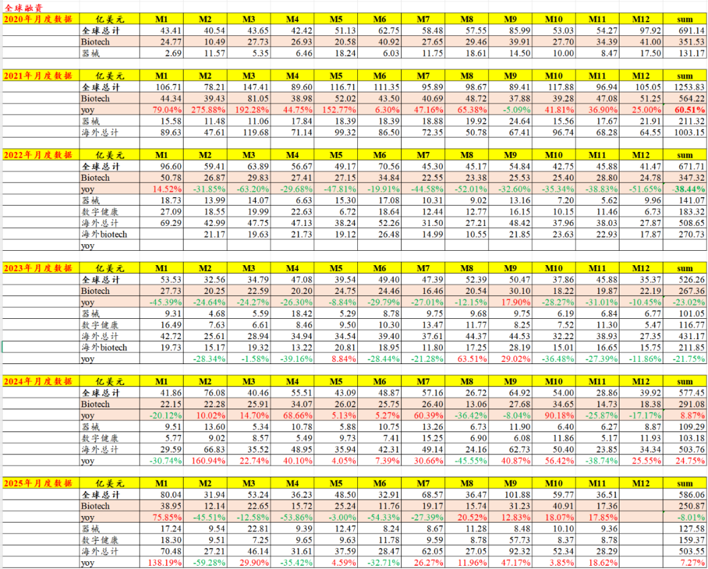
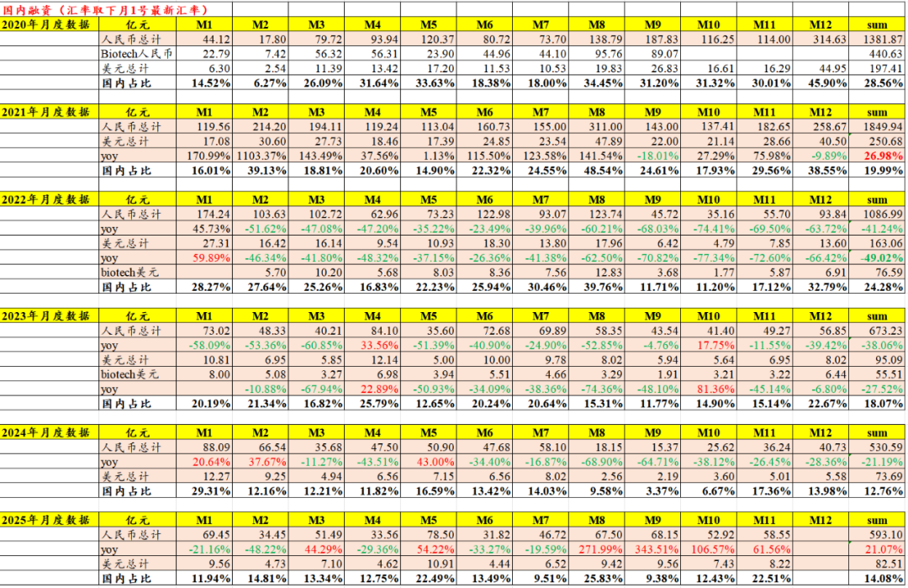
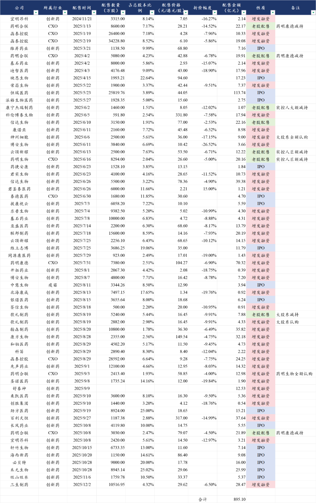
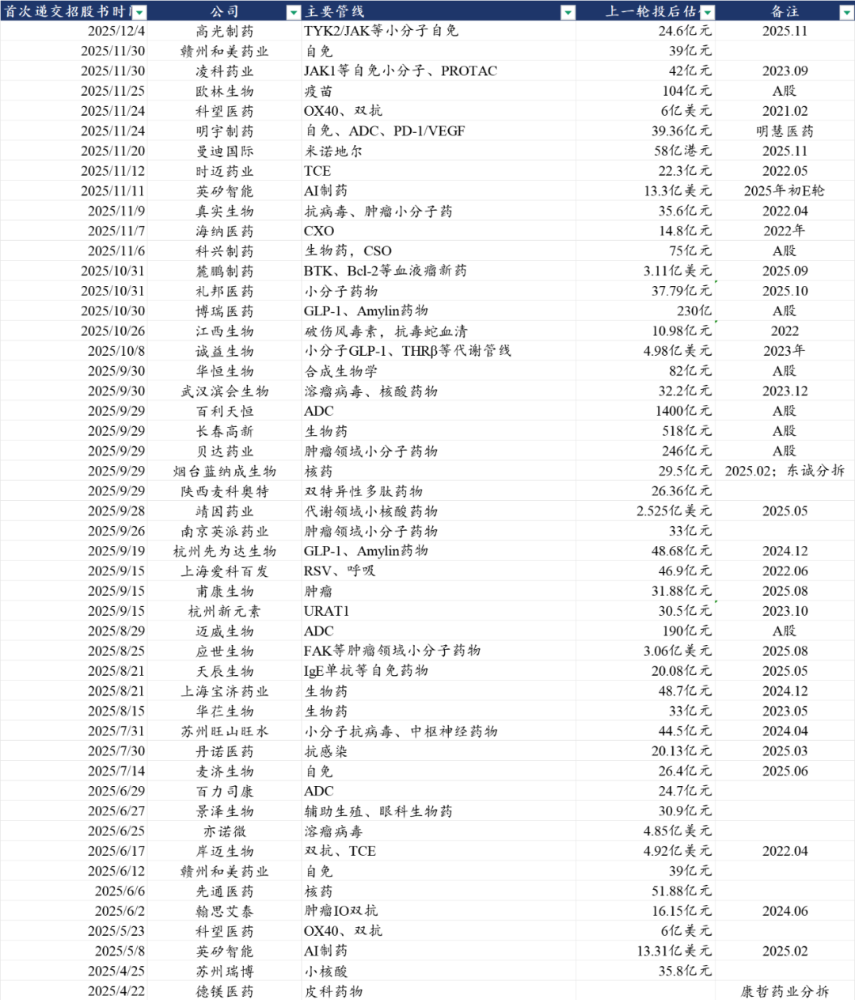
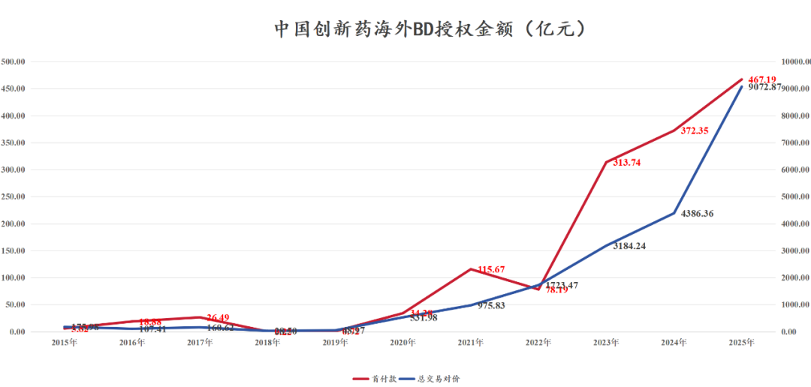
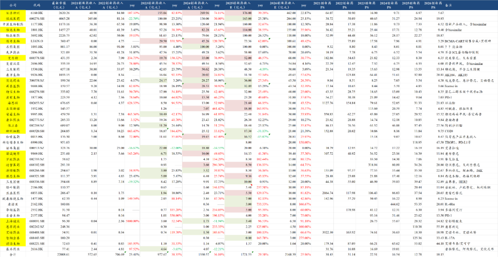
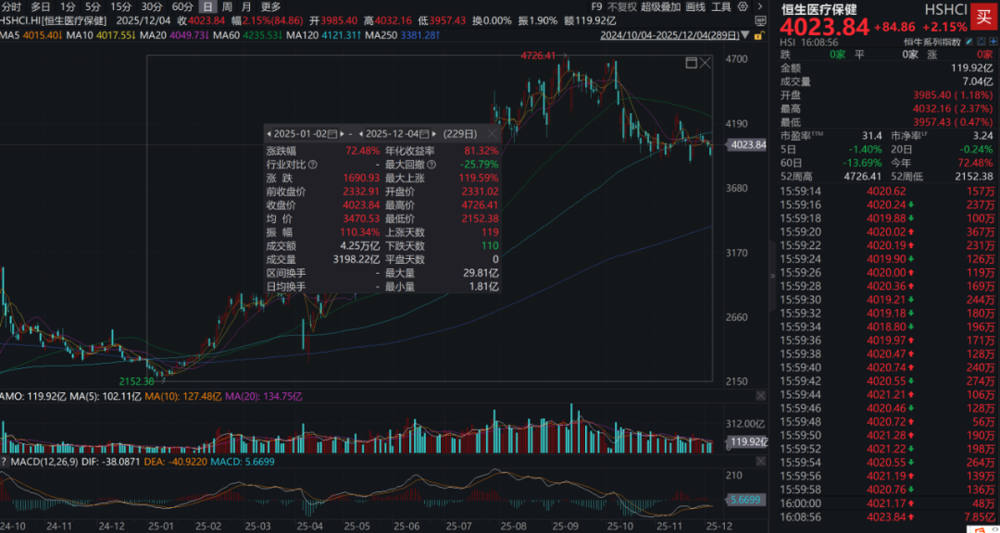

# 2025年创新药融资数据更新

大家好，我是龙哥。

我们知道，创新药的资金来源大致可以分为几个方面，①一级市场及二级市场融资，②BD授权收入，③创新药商业化销售收入。

这三方面的资金来源，共同构成了创新药公司的现金流，支撑创新药公司后续的研发投入以及潜在股东回报，由于近期有一些读者对以上一些数据表示担忧，因此我们本文给大家更新下截止到2025年12月4日我们统计到的以上数据的情况。

1、全球创新药一级市场融资稳健

根据动脉橙的数据，2025年11月全球医疗健康领域一级市场融资金额36.51亿美元同比增长26.5%，其中创新药融资17.36亿美元同比增长17.36%。11月国内医疗健康领域一级市场融资合计8.22亿美元/58亿元同比增长61%，海外医疗健康领域一级市场融资合计28.29亿美元同比增长18.62%。

2025年1-11月全球医疗健康领域一级市场融资合计586.06亿美元，其中创新药融资250.87亿美元同比下降8.01%，下降的原因就是在川普上台后的几个月，由于美国投资机构和创新药公司都要观察其政策动向，在医疗健康领域的研发投入和投融资端都有延后，因此我们可以在下图中看到今年2-7月持续半年的同比下滑，以及8月以来的同比增速转正。

1-11月国内医疗健康领域一级市场融资合计82.51亿美元/593亿元同比增长21.1%，海外则为504亿美元同比增长7.3%。

2、AH股创新药二级市场融资大增

这里统计了三方面的二级市场融资，包括①增发配股融资，②IPO融资，③老股大规模配售减持。

2025年1月-12月初，AH创新药+CXO公司合计完成增发配股融资506亿元，合计完成IPO融资259亿元，合计进行大规模配售减持127亿元，合计二级市场融资893亿元，其中创新药公司拿到的资金是765亿元，而在23-24年IPO和增发配股融资均非常少见。

另外港股还有一系列创新药公司在排队等待IPO，目前统计到在排队的有49家，另外还有几家是秘密交表的，未公开招股说明书，实际近半年多提交招股说明书计划IPO的港股创新药公司超过50家。

3、创新药BD收入指数式增长

2025年1月-12月4日，中国创新药海外BD授权的总交易对价合计为9073亿元，已经比2024年全年实现翻倍以上增长，首付款金额合计为467亿元，同比2024年全年增长超过25%。

目前各家药企手里普遍还有不少储备项目在积极推进海外BD授权，BD授权本身也呈现跟随新技术方向而持续变化的特点，相信26年还会有不少颇具亮点的创新药项目可以实现出海。

创新药BD授权出去只是第一步，2025年以来除了看到以上BD授权拿到的首付款以外，我们还看到后续的海外临床进展、里程碑付款对公司估值的重要性也在提升，这点在未来1-2年会逐渐让更多投资人认识到。

4、创新药收入维持高增长

我们统计的43家创新药公司2025年创新药收入预计合计为1722亿元同比增长29.4%，预计2026年收入2168亿同比增长26%。

头部的biopharma公司如百济神州、信达生物、康方生物、艾力斯、复宏汉霖都已经实现盈利或者即将在26年实现盈利，头部的pharma也基本在26年可以实现常规业务的增长和利润提升（考虑不含个别大项目BD扰动），产品创收将作为企业持续的现金流来源以支撑其后续研发投入。

（统计不含复星、华东、远大、康哲、人福等难以拆分创新药收入的公司，因此实际数据会比以上统计数据略高）

5、行业股价表现

今年以来，恒生医疗保健指数累计涨72.5%，港股创新药指数涨超80%，A股创新药指数涨约40%，申万医药涨约15%，港股创新药即便在AH全市场对比也算是表现较为出众的板块。

AH创新药公司今年合计有47家公司股价翻倍，15家公司股价涨超2倍，6家公司股价涨超5倍。AH的CXO公司今年有4家公司股价翻倍，18家公司股价涨超50%。

......

行业7-8月份短期超涨+AI产业链持续超预期，叠加短期部分海外政治风险暴露，使得创新药行业经历一轮中期回调。

但国内及海外双轮驱动，行业蓬勃向上，“回调”这件事不论在产业发展过程中还是在投资过程中都非常常见，还是要多一些耐心。

风险提示：本文仅讨论行业/公司经营情况，投资需综合考虑公司经营、估值、管理层等多方面因素，建议读者审慎参考，本文不作为投资依据，不建议大家根据本文做出投资计划。

<!-- wxmp-comments-begin -->

---

## 留言（3 条，含回复共 8 条）

- **嘀嗒** 👍2 · 2025-12-05 08:11
  龙哥最近这么高产。
  - ↳ **作者** · 2025-12-05 08:17
    今天要去恒瑞研发日，昨晚提前写好定时发了，下周给大家分享恒瑞研发日的情况哈[抱拳][抱拳]
- **迷雾** 👍1 · 2025-12-05 08:32
  龙哥，昨天港股药明系突然大涨是什么原因？
  - ↳ **作者** · 2025-12-05 08:36
    因为昨天的新闻报道，①美国为推进贸易谈判顺利进行，正暂缓对国家安全方面的制裁计划，特朗普也不再对中国实施新的出口管制措施；②国防授权法案中删除关于药明康德的生物安全相关内容，此前26年国防授权法案纳入药明康德，导致近期药明系公司股价有所回调。
  - ↳ **作者** · 2025-12-05 08:47
    龙哥，第一条是真消息。第二条被假的小作文。
  - ↳ **作者** · 2025-12-05 09:11
    为什么是假消息？外网可以找到这篇新闻
- **berlin0320** · 2025-12-05 08:27
  龙哥，排队的这50家里有哪些有趣的首次ipo的公司？
  - ↳ **作者** · 2025-12-05 08:34
    从产业技术方向的角度可以重点关注双抗和小核酸领域的几家新股

<!-- wxmp-comments-end -->
