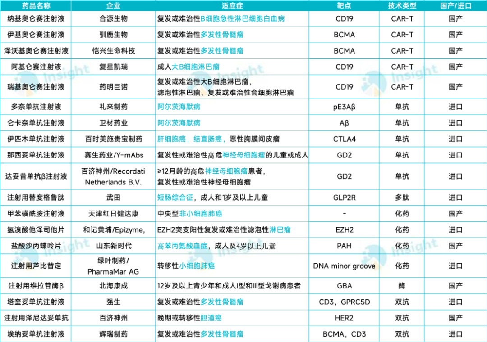

# 一年一度，创新药最重要的事

大家好，我是龙哥。

今天国家医保局宣布了2025年国家基本医保目录价格谈判的结果，以及首次商保目录谈判结果，本次医保谈判结果发布会为很高的规格。我们今天来聊聊医保谈判的结果以及涉及的一些重点公司的情况。

1、医保谈判结果

2025年医保谈判共有127个医保外品种参加，最终有114个品种谈判成功纳入医保，谈判成功率88%创近年新高、历史第二高（2018年18个肿瘤药谈判、17个成功纳入，成功率94%），同时我们看另外两个指标，①谈判成功率/通过形式审查数为21.35%VS 2024年的20.23%，②谈判成功数/申报药品数为15.88%VS 2024年的15.51%，这两个指标与2024年基本持平。这个实际上是说明，当前医保谈判体系是趋于成熟、效率是在提升的。

商保谈判申报品种有121个，最终24个品种进入谈判环节，有18家公司的19个品种最终纳入商保目录，包括9个国产品种和10个进口品种，涉及到的国内上市公司有复星医药（复星凯特）、药明巨诺、百济神州、和黄医药、绿叶制药、北海康成。纳入品种包括5款CAR-T疗法、3款双抗、1款多肽、5款双抗、4款化药、1款酶制剂。

价格降幅方面，本次医保谈判并未公布价格平均降幅，根据某券商医药团队的解读会议，讲到他们了解到的价格平均降幅略高于2024年，过去5年的医保谈判价格平均降幅为54%、62%、60%、62%、63%，价格平均降幅比24年略高意味着价格平均降幅又创历史新高，因此，本次国家医保局未公布降价幅度可能也是为了维护产业、资本市场的信心。

每次看到这个降价幅度非常大，很多投资人都会很不满，但我们从5年前解读医保政策开始就给大家说，这个价格降幅绝对值本身没太大意义——目前新药上市普遍定价超高、医保谈判表观降价幅度巨大，实际可能会有一些赠药政策，也既医保谈判中，表观降幅并不代表真实价格降幅，区别是赠药政策下可以一次性收到费用，而纳入医保并取消赠药后则是根据临床用药节奏给患者销售药物。

2、重点公司、重点品种：

①恒瑞医药：20款新药/新适应症纳入医保，其中包括10款新药为首次纳入医保，恒瑞医药国内商业化创新药品种爆发。截至目前恒瑞医药有27款新药在国内获批上市，其中2024年下半年以来获批的有10款，2024H2-2025H1获批的有7款，其中包括了艾玛昔替尼（JAK1抑制剂）、瑞康曲妥珠单抗（HER2-ADC）等潜在重磅品种，到2026年医保谈判时预计恒瑞医药还将有7款新药首次参加医保谈判，其中将包括全球首款DPP4/SGLT-2/二甲双胍三联复方、恒瑞医药的首款IO双抗PD-L1/TGFβ双抗（一线胃癌）等。

②信达生物：7款创新药/新适应症纳入医保，除了信迪利单抗为新增适应症外，其余6款新药为首次纳入医保，包括自研的甲状腺炎病的一款生物类似药IGF-1R单抗，另外5款小分子靶向药三代EGFR、KRAS G12C、RET、ROS1、BTK等均为外部BD引进的品种。另一款信达自研的重磅药物，上文提到的匹康奇拜单抗，则是预计在26年参加国谈。

2025年6月获批的GLP-1/GCGR双靶点减重药玛仕度肽未能进入国家医保，实际上礼来的替尔泊肽（GLP-1/GIPR）糖尿病适应症今年成功纳入医保，其减重适应症也未能纳入医保，诺和诺德的司美格鲁肽减重适应症同样未能纳入，目前对于GLP-1类药物，国家基本医保的支付还是在降糖领域，减重领域暂不覆盖、也没有能力覆盖。

③康方生物：目前共有5款创新药获批上市，并在25年医保谈判中均新进入或有新适应症纳入医保，包括AK112依沃西的一线肺癌、AK104卡度尼利的一线胃癌/一线宫颈癌等一线重磅适应症成功纳入医保，非肿瘤领域的两款新药包括降血脂的伊努西单抗（PCSK9）、治疗银屑病的依若奇单抗（IL-12/IL-23）也成功纳入医保，另外康方还有一款IL-17A单抗已经申报上市，也有望在26年上半年获批、参加26年底的医保谈判。

④科伦博泰生物：公司今年有3款创新药首次纳入医保，包括TROP2-ADC芦康沙妥珠单抗、西妥昔单抗生物类似药、PD-L1单抗塔戈利单抗。芦康沙妥珠单抗今年上半年及以前获批的适应症是3L+TNBC和3L+ EGFR突变NSCLC，下半年新获批了2L EGFR突变NSCLC，且已经申报上市3L+ HR+/HER2- BC，11月底又有联合K药一线治疗PD-L1阳性NSCLC达到III期临床终点，26-27年芦康沙妥珠单抗还会持续拓展大适应症。此外科伦博泰有一款HER2-ADC在今年10月获批，一款RET抑制剂在今年9月申报NDA。

⑤百济神州：作为中国创新药国际化的一哥，百济在今年的国家医保谈判里表现不多，主要是替雷利珠单抗新增肺癌辅助/新辅助这个大适应症，泽布替尼、帕米帕利、戈舍瑞林、司妥昔单抗成功续约，另外百济今年有两款代理进口的品种泽尼达妥单抗（全球首款HER2双抗，胆管癌小适应症）和达妥昔单抗β（GD2单抗，高位神经母细胞瘤小适应症）纳入商保目录。百济的Bcl-2抑制剂索托克拉片预计在2026年上半年获批，这样百济和亚盛的Bcl-2将共同在2026年底参加国谈。

⑥康诺亚：司普奇拜单抗（IL-4Rα）的3个适应症（中重度特应性皮炎、鼻窦炎伴鼻息肉、过敏性鼻炎）均纳入医保，今年康诺亚没有医保，商业化面临一定压力，26年是在医保内和赛诺菲竞争的第一年，也是至关重要的一年。

其他大一些的pharma公司，如大家可能比较关注的中国生物制药、石药集团、翰森制药、华东医药、复星医药等一二线的pharma，由于近1年多普遍没到其创新药密集兑现的阶段，因此参与医保谈判的品种不太多，基本上1-3个之间，且多为BD引进品种，就不一一列举。

二三线Biopharma、biotech公司中：

- 艾力斯代理的KRAS G12C抑制剂和RET抑制剂均纳入医保；
- 三生制药代理的口服紫杉醇溶液纳入医保；
- 君实生物的PCSK9单抗纳入医保，到今年国内已经有7款PCSK9药物获批，除了赛诺菲的PCSK9单抗退出中国外，目前有5款单抗（Amgen+信达+恒瑞+康方+君实）+1款小核酸（诺华）竞争且都纳入医保；
- 泽璟制药的JAK1/2/3抑制剂吉卡昔替尼新纳入医保，重组人凝血酶此前已经纳入医保；
- 智翔金泰的赛立奇单抗（IL-17A）纳入医保，恒瑞与智翔的IL-17A在去年下半年同时获批，但商业化都做的很差，今年底同时纳入医保后，明年的商业化也是至关重要，尤其是对智翔金泰，但恒瑞似乎对该品种的预期不高；
- 神州细胞的PD-1单抗（一线头颈鳞癌）纳入医保，PD-1/L1单抗国内批了十几家，除了前面四家国产外，后面的基本都选择不进医保，但不进医保的商业化压力也是山大，终归是逐渐选择纳入医保；
- 特宝生物的长效生长激素纳入医保，金赛的长效生长激素也纳入医保，均有一定幅度的降价，此前金赛的长效生长激素基本独占市场，目前长效生长激素逐渐有多家新玩家进入，行业竞争格局恶化，长春高新也只能接受降价进入医保参与市场化竞争。

另有一批医保内品种原价续约，呈现的是今年医保并未进行明显的压价，总体医保谈判情况还是较为稳定，24-25年医保谈判情况较为接近，后续市场可能会逐渐熟悉和接受续约谈判不降价。

最后，关于商保方面，我们认为本次商保目录的价格谈判只是一个开始，后续商保目录的制定和价格谈判规则也会逐渐的探索和趋于成熟，并且还会有一系列的其他配套的政策，其中有些我们现在已经逐渐了解到或者思考清楚（时机成熟时候会给大家解读），有些可能还在酝酿中，商保作为国家基本医保的补充可能不是一句空话，很可能会逐渐落地给大家看。

......

近期重点文章：

[2025年创新药融资数据更新](https://mp.weixin.qq.com/s?__biz=MzkyMzQ3MDc3Mw==&mid=2247485286&idx=1&sn=7251adbc2940be8b8c65842d6c45c243&scene=21#wechat_redirect)

[医疗数据看的人眼前一黑](https://mp.weixin.qq.com/s?__biz=MzkyMzQ3MDc3Mw==&mid=2247485274&idx=1&sn=6e837ca4ef2b8157346f34e115276e01&scene=21#wechat_redirect)

[创新器械出海先锋](https://mp.weixin.qq.com/s?__biz=MzkyMzQ3MDc3Mw==&mid=2247485262&idx=1&sn=72f5e11cdd06ea0b5beac35064179e86&scene=21#wechat_redirect)

[国内外两大重要医药政策](https://mp.weixin.qq.com/s?__biz=MzkyMzQ3MDc3Mw==&mid=2247485250&idx=1&sn=26b1db9e62c4b9bc35e696f701dae3fa&scene=21#wechat_redirect)

[时来天地皆同力，运去英雄不自由](https://mp.weixin.qq.com/s?__biz=MzkyMzQ3MDc3Mw==&mid=2247485218&idx=1&sn=39925301800ea61fe2312d4e74675777&scene=21#wechat_redirect)

[全球顶级大药的狂欢](https://mp.weixin.qq.com/s?__biz=MzkyMzQ3MDc3Mw==&mid=2247485203&idx=1&sn=0b605ddfb552f201dccf6d651f3c7278&scene=21#wechat_redirect)

[创新药三季度分化，龙头新高](https://mp.weixin.qq.com/s?__biz=MzkyMzQ3MDc3Mw==&mid=2247485190&idx=1&sn=f40e332365cef8cd827481c6fb952ae9&scene=21#wechat_redirect)

风险提示：本文仅讨论行业/公司经营情况，投资需综合考虑公司经营、估值、管理层等多方面因素，建议读者审慎参考，本文不作为投资依据，不建议大家根据本文做出投资计划。

<!-- wxmp-comments-begin -->

---

## 留言（17 条，含回复共 35 条）

- **廖书豪** 👍6 · 2025-12-07 23:12
  无论从宏观利率+融资，还是国家政策支持层面，叠加产业优势+工程师红利，确实可以说创新药出海基本是这几年国内少有的至少是医疗领域我国产业升级最大的机会了，中期调整快结束了共勉
- **caoguoan** 👍3 · 2025-12-07 23:19
  龙哥，短期对创新药影响可能比较小，长期来说对创新药板块还是偏利好的，特别是商保谈价的落地，对吧
- **光头的复利人生** 👍2 · 2025-12-07 22:52
  那个AI数字人“医小宝”NG好几回，主持人尬死…不过至少说明还挺真实的[破涕为笑]
- **半山雪庐** 👍2 · 2025-12-07 22:55
  恒瑞明天要涨了[破涕为笑]
  - ↳ **作者** · 2025-12-07 23:03
    上面还有个说明天吃面的，你俩商量商量到底吃面还是涨啊？
- **知行** 👍1 · 2025-12-07 23:02
  龙哥，整体这次医保谈判对创新药是偏利好还是利空呢
  - ↳ **作者** · 2025-12-07 23:04
    医保谈判我们也解读了比较多了，我认为就基本医保目录来说是逐渐成熟和高效的。那就今年的医保谈判结果来说，文中也说了，今年基本医保目录的价格谈判比较稳定，看到不少品种原价续约，新进的价格也有个别了解到的还可以，我认为是偏利好的。
    商保目录方面，这是商保第一步的突破，也如文末所言，后续会持续有配套政策，这只是个开始，值得大家重视，也是偏利好的。
- **🌺扶摇** 👍1 · 2025-12-07 23:35
  商业医保为啥没有恒瑞啊？？
  - ↳ **作者** · 2025-12-07 23:38
    因为恒瑞的品种都纳入国家医保了。
- **Ashley** 👍1 · 2025-12-08 00:24
  我的先声呢，怎么没提到
  - ↳ **作者** · 2025-12-08 00:26
    先声有公告，VEGF单抗纳入医保，不过这个品种不是很重要，我就没单独提
- **俫佧光域 飞扬** 👍1 · 2025-12-08 06:13
  创新药走出了非常踏实的一步，虽然这个利好还需要很长的时间慢慢兑现，但终究是好的，但是衬托着医疗，特别是中证医疗，感觉外有政治干扰，内有行业内卷，两头堵，处境真的那么凄惨吗
  - ↳ **作者** · 2025-12-08 08:52
    整个医疗费用支出低增长，诊疗量数据也比较差，医保支出低增长甚至下滑，这就意味着从医药医疗全行业来看是β很弱的，但同时创新药这边增速又比较高，就意味着创新药以外的行业大部分比全行业更差。
- **ANYTHING** 👍1 · 2025-12-08 07:03
  没啥用，能稳定点就行了，整体来看，医保就那么点钱，而老龄化加剧医药需求越来越多，国内市场发展上限依然锁死。贝塔没了只有阿尔法，散户做医药难度太大了。
  - ↳ **作者** · 2025-12-08 08:53
    医保的“那么点钱”，支撑了我国2万亿的药品销售，大概3000亿美金，全球最大的美国创新药市场大概6000亿美金。国内发展再怎么有上限，也是不容忽视的一块市场。
- **9527568** · 2025-12-07 22:49
  白鸡是美国公司在中国上市。类似阿里在美上市
  - ↳ **作者** · 2025-12-07 22:58
    没必要较这个真，那你怎么定义一个公司是哪里的公司？他主要办公地址、主要员工分布在哪里？主要税收贡献在哪里？他注册地在哪里？他大股东是谁？这些都要挨个去聊聊吗。
- **杨思宁** · 2025-12-07 22:49
  参加恒瑞研发日后的文章没有吗？
  - ↳ **作者** · 2025-12-07 23:00
    不说了下周发吗，别着急啊，开个研发日又不会让恒瑞的基本面发生什么质变
- **老虎** · 2025-12-07 23:01
  明天创新药吃面哇
  - ↳ **作者** · 2025-12-07 23:02
    就是大伙留言尽量说逻辑，你甩给我一个结论，对我、对读者们都没啥意义啊[捂脸]
  - ↳ **作者** · 2025-12-07 23:07
    不公布降幅，是没有勇气面对创新的口头承诺。如果降幅低于2024，必然大张旗鼓宣传，但是医保账户不支持。因此对医药人是再一次的失望，口头支持。对内需，是绝对的利空。对器械，那就是房地产。不出海，毋宁死。
  - ↳ **作者** · 2025-12-07 23:16
    你看，这不就是没好好看文章里写到的内容。医保局现在就是要逐渐淡化这个降价幅度的因素，原因嘛文章也已经讲了一部分，这个表观降幅的参考价值本身是越来越低的，文中举的例子，难道明年信达的匹康奇拜单抗医保谈判降价70%就是大利空？那他实际价格还涨了的，那怎么说？
    另一方面原因，医保局现在也很关注行业在资本市场的表现，也重视产业的出海，所以并不是再像以前那样需要靠宣传降幅来彰显自己的zj。你这个解读就明显属于过于表面和悲观。
    所以我说大家不要甩个结论给我，要说逻辑，咱们才能讨论。
- **lin** · 2025-12-07 23:12
  龙哥，微芯接下来有没有什么看点
  - ↳ **作者** · 2025-12-07 23:18
    还是有点缺少后续有看点的管线，后面两年可能只能看看西格列他那的放量。
- **开拓** · 2025-12-08 07:29
  龙哥，抽时间说说爱尔，我的仓位有点重，之前好多人谈他兼并扩容利好，降低商誉利好，营收基本面也没啥大问题，就是传言的医疗事故问题来说事，怎么就一个阴跌，有点不理解，恒瑞的K线就很稳定。
  - ↳ **作者** · 2025-12-08 08:55
    爱尔，你说的那些都不是核心矛盾，核心矛盾就是这几年眼科医疗服务通过资本市场实现供给端比较多的扩张，但需求端又受到消费低迷的负面影响，属于供给过剩、需求不振，他这个业绩修复需要消费环境复苏，并且由于供给端，也不太可能回到以前的高增长。
- **K 杨** · 2025-12-08 08:18
  龙哥，你提到的六个重点公司里，五家千亿市值，一家只有一百多亿市值的公司，是不是太高看这家小小公司了？
  - ↳ **作者** · 2025-12-08 08:48
    只是IL-4Rα是潜在大品种，倒不是太高看这个公司，和其他公司确实不是很可比的
  - ↳ **作者** · 2025-12-08 08:50
    哦哦哦，谢谢龙哥，我说呢，这么小一个公司不值得龙哥把它和那几家相提并论。
- **俊耀** · 2025-12-08 11:22
  龙哥，医保续约不讲价；营收增长的显著的，续约也没降价吗
  - ↳ **作者** · 2025-12-08 12:09
    不是续约都不降价，只是了解到有相当一部分没降价，增长过多的或者竞争格局显著恶化的肯定要降价
- **caoguoan** · 2025-12-08 12:47
  从今天市场的解读来看偏利空啊，都觉得医保的谈价过低了吗？
  - ↳ **作者** · 2025-12-08 13:24
    市场交易因素很多，前期还有不少资金埋伏医保谈判超预期的。单纯根据市场短期交易去解读利好利空，那就不需要分析判断了呀。
  - ↳ **作者** · 2025-12-08 15:31
    今天的盘面其实很有意思，A股创新药在涨，H股创新药在跌，其实是境内外对医保谈判的解读有差异。无论是医保目录还是商保目录，都代表着集采政策的优化，即国内市场支付端的优化；BD代表着境外市场的空间，这样的发展趋势，长期看是向好的。

<!-- wxmp-comments-end -->
