# 恒瑞，龙头的底蕴

大家好，我是龙哥。

和大家聊聊上周五参加恒瑞医药第三届研发日的情况，恒瑞医药一共举办了3次研发日，分别是在2021年10月15日、2023年11月16日、2025年12月5日，每隔两年举办一次，这里大家可以对照我们在2023年11月参加恒瑞医药第二届研发日的文章《[巨头盛会](https://mp.weixin.qq.com/s?__biz=MzkyMzQ3MDc3Mw==&mid=2247483803&idx=1&sn=9d7550f7d45962013cbc3b737b8b18c0&scene=21#wechat_redirect)》来看看恒瑞这两年的一些变化。

1、技术平台布局

恒瑞医药的技术平台覆盖小分子、PROTAC、ADC、单抗、融合蛋白、双抗/多抗、多肽、小核酸、核药等全球主流的药物分子形式，并在其中多个领域为国内领先水平。

例如在ADC领域，恒瑞医药目前有1款HER2-ADC产品获批，合计14款ADC产品在临床阶段，其中包括Claudin18.2-ADC、HER3-ADC、Nectin4-ADC、CD79b-ADC、TROP2-ADC（可能暂停）等5款ADC药物被推进到III期临床阶段，还有多款ADC、双抗ADC处于Ib/II期临床阶段。

在小核酸领域，连山总在研发日上敢于喊出“在小核酸领域的布局不会落后于中国任何一家公司”，恒瑞医药目前有5款小核酸药物处于临床阶段，前两周写到国内在小核酸布局较为领先的石药集团也是有5款分子处于临床阶段。

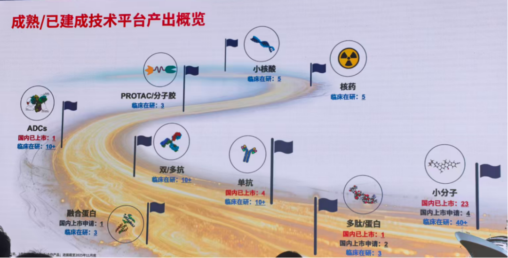

2、疾病领域布局

从2023年恒瑞医药聚焦到肿瘤、代谢、自免呼吸这三大领域、并表示未来拓展中枢神经领域以来，我们看到近两年恒瑞医药新进临床的项目几乎全部围绕这四大疾病领域，在这四大疾病领域以外只有1-2个新项目进入临床，恒瑞对产品组合的定位为“肿瘤+慢病双轮驱动加速转型”。

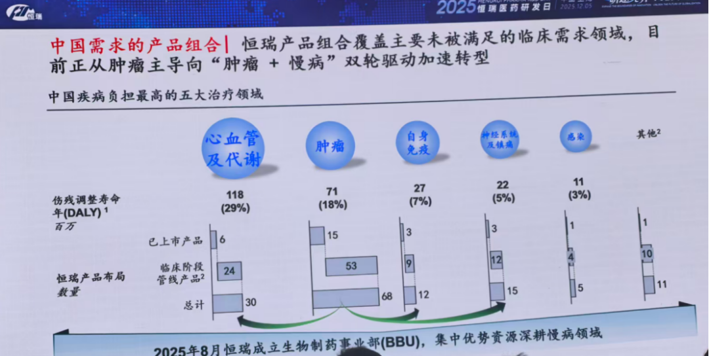

公司在今年的研发日上提出了“从BIC到BID”的概念，目标不再是聚焦于单个靶点的BIC药物或疗法，而是针对一个疾病领域进行全面、广泛的布局，实现在整个疾病领域最佳的产品组合帮助患者最大化获益，这个策略看起来比较简单，但实际上在全球市场来看，能有这样广泛的管线布局、较低的临床成本和较高的临床效率，也仅有极少数公司能有条件去做这样的布局。例如恒瑞在乳腺癌领域的一站式布局：

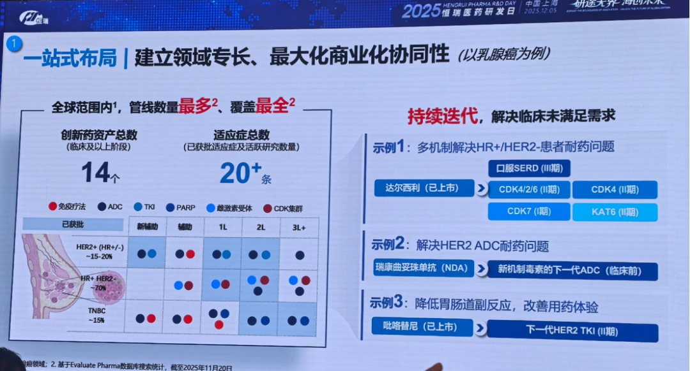

恒瑞医药拥有最全面的技术平台布局，并在此基础上进行一系列的排列组合联用探索。作为行业里跟踪恒瑞医药研发管线非常紧密的投资人，我们非常直观的感受到恒瑞医药的“工具箱”在肿瘤创新疗法开发中的意义，其可以快速的将“理论上的”潜在联用疗法进行5-10个不同疗法的排列组合，例如IO+小分子、IO+双抗、IO+ADC、TCE+ADC、双抗+ADC、双抗+小分子、小分子+ADC、小分子+PROTAC、小分子+核药、IO+小分子+ADC。你只管天马行空的想象潜在联合疗法，恒瑞医药自会在临床试验帮你验证。

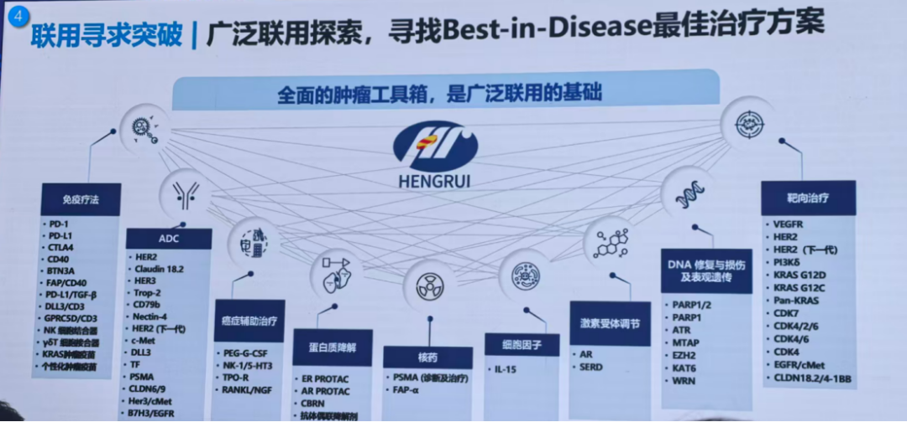

糖尿病代谢领域是恒瑞医药近年除肿瘤外创新药密集上市的最重要疾病领域，2021年以来有DPP-4、SGLT-2、DPP4/二甲双胍复方、SGLT-2/二甲双胍复方、DPP-4/SGLT-2/二甲双胍三联复方等5款新药获批，其中HR20031恒格列净瑞格列汀二甲双胍缓释片为全球首个该靶点的三联复方制剂。

在全球大火的GLP-1药物领域，恒瑞医药的布局也是国内的绝对龙头，除了首个国内自主研发的GLP-1双靶点激动剂HRS9531已经申报上市外，恒瑞还开发了口服GLP-1（III期临床）、长效胰岛素/GLP-1复方制剂（III期临床）、口服GLP-1/GIPR（II期临床）、GLP-1/GIPR/GCGR（I期临床），以及下一代管线周口服、月注射、Amylin、siRNA等。

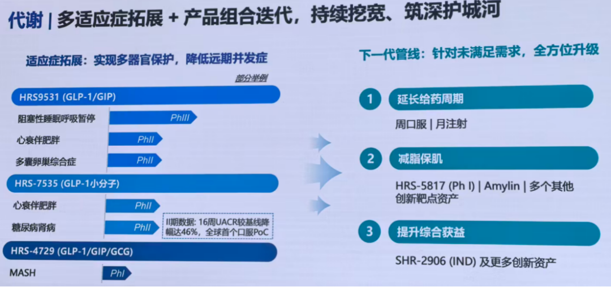

心血管领域是2024年以来恒瑞医药最重点布局的疾病领域之一，2024年以来恒瑞医药有8个心血管领域的新分子进入I/II期临床，3个项目进入III期临床，1个项目（PCSK9单抗）获批上市。

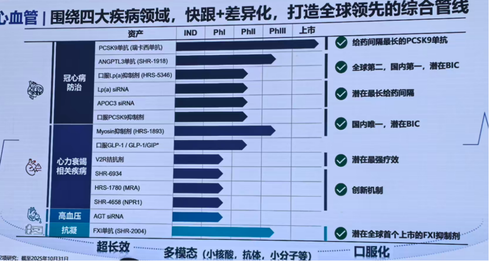

3、国内创新药临床及商业化

恒瑞医药2000多人的临床团队，每月管理临床试验患者数量从2023年的约17000名临床受试者到现在的30000+临床受试者，临床效率仍在提升。SHR-A1811瑞康曲妥珠单抗在2020年7月首次拿到临床批件，用时4年在2024年9月提交上市申请并纳入优先审评，到今年5月仅用时8个月就完成审批、成功获批上市。HRS9531 GLP-1/GIPR在2021年10月26日首次获批I期临床，2025年9月1日即申报上市，IND到NDA仅用时3年零10个月。

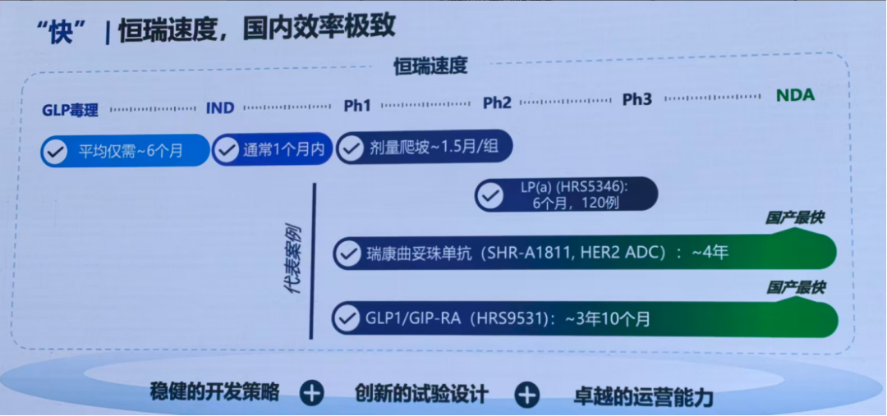

从管线布局到商业化，还有一段很长的距离，恒瑞医药目前在肿瘤领域的院内市场市占率大概是5.7%，但在其他重点疾病领域的市占率还是很低，如心血管代谢的市占率1.9%，与排名第一的阿斯利康的份额相差十倍；自免的市占率更是只有0.2%，与排名第一的诺华相差160倍，恒瑞在自免呼吸领域的管线布局在中国市场来说已经是非常全面和较为领先，只是这两年恒瑞医药的自免创新药管线才刚开始进入商业化阶段，公司希望自免成为继肿瘤、糖尿病代谢后的恒瑞又一重点领域。

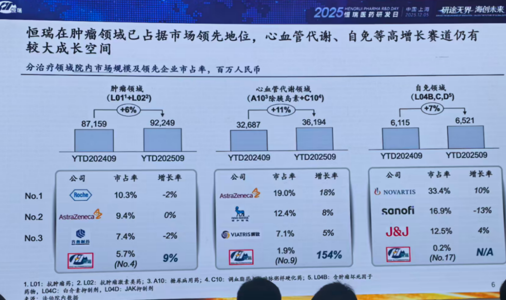

以上份额是基于院内市场的数据，实际上院内市场是恒瑞医药竞争优势最强的细分市场，在院外还有广阔的市场，而院外市场恒瑞医药与MNC的差距更大，因此恒瑞医药也强调了响应国家慢病管理号召、深耕广阔市场、提高患者可及性。

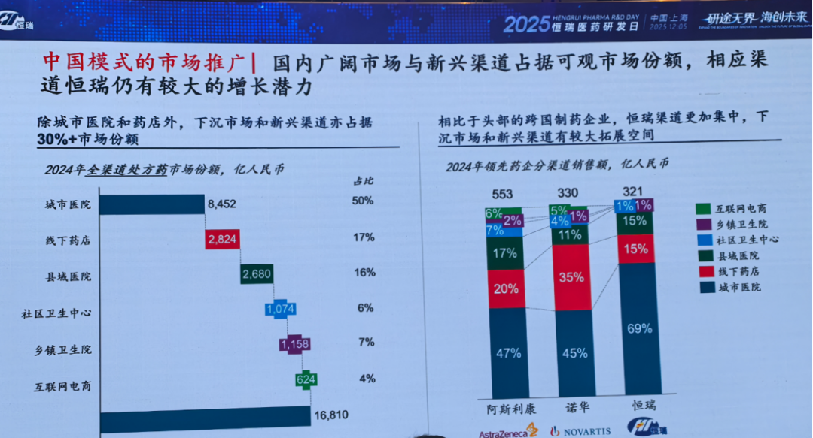

4、国际化

遥想2023年的研发日，恒瑞医药的出海正处于转型初见成效的阶段，当时的定位是“立足中国、放眼全球”，彼时刚与德国默克签订了14亿欧元的BD交易，拿到1.6亿欧元的首付款。

后续两年恒瑞医药的BD交易更进一步，与默沙东、GSK等公司达成了可圈可点的合作授权，BD已经成为恒瑞业务增长的重要驱动力之一。2023年恒瑞的BD收入占比1.2%，2024年BD收入占比9.6%，2025年预计BD收入超过60亿、收入占比超过18%，利润占比则是还要显著高于收入占比。

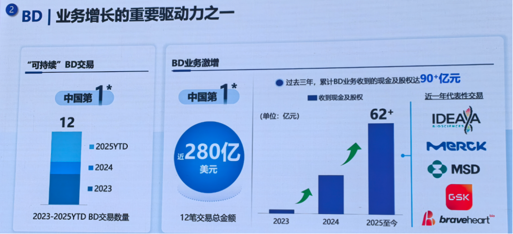

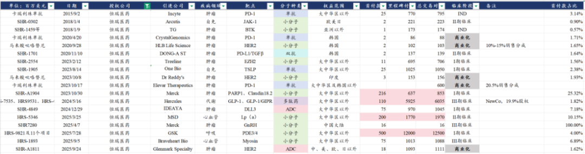

恒瑞医药今年新建一家波士顿研发中心，目前在海外有美国、瑞士、澳洲的4个研发中心，并新任命了全球商业化负责人，短中期以BD授权的方式进入全球市场、达到海外业务的财务回报，中长期恒瑞的目标依然是推进产品海外自主上市和全球化运营。

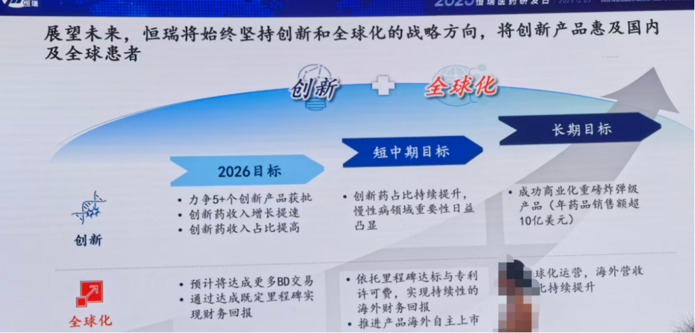

今年的研发日，恒瑞医药还邀请了两家海外合作方的高管来分享，分别是GSK的BD总，以及与恒瑞做GLP-1产品组合Newco的Kailera的CEO。

GSK分享的内容里几页重要的PPT我这里都放一下，大家由此可以感受一下GSK这家代表欧洲老牌药企的MNC是如何看到中国创新药产业的发展以及恒瑞医药的优势。

GSK在2023年以来的重点合作方目前包括恒瑞、翰森、映恩、药明、泽安等公司，其中自翰森引进了B7-H3 ADC和B7-H4 ADC，自恒瑞医药引进了PDE3/4+11款可选分子、以及收购了恒瑞Newco授权的长效TSLP单抗，自映恩生物引进了CDH17 ADC。

其看到了中国创新药产业的蓬勃发展，全球创新药行业来自中国市场的BD交易占比在近年大幅提升（图中可以看出来自欧洲和日本的占比下降最为明显），也看到了恒瑞的价值——重点管线与GSK优势领域的较高重合度、30年时间从仿制药企业成长为“big pharma”、较高的临床转化效率。

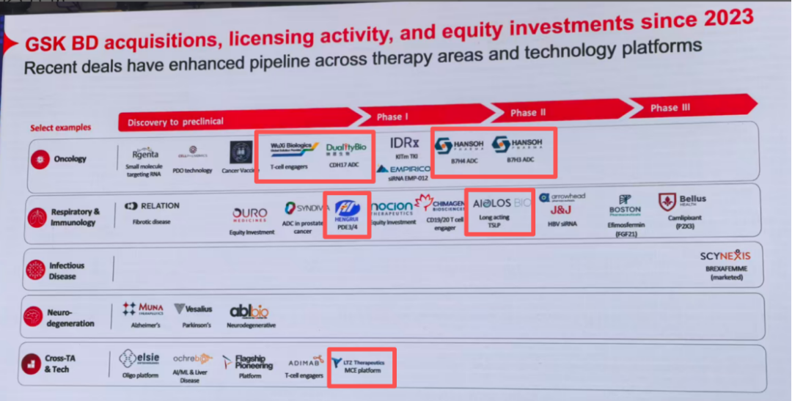

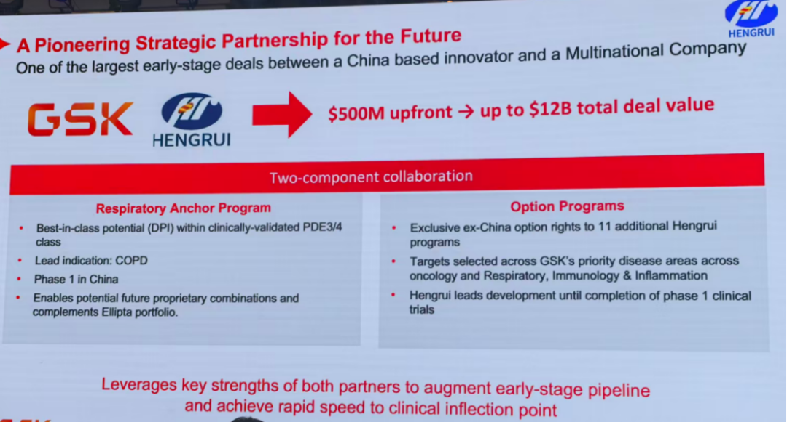

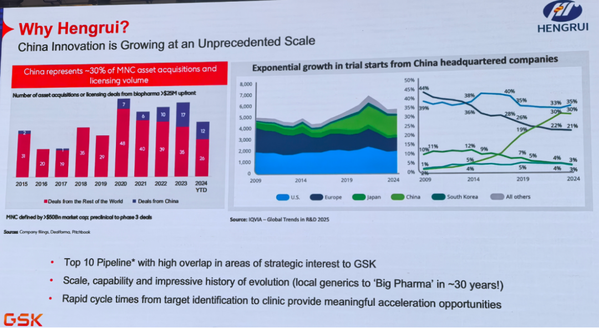

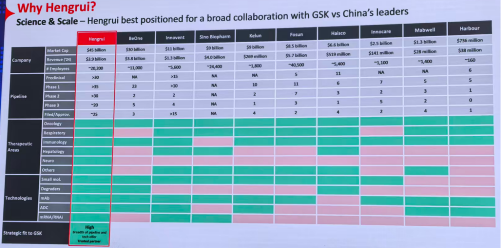

另一位合作方Kailera给出了GLP-1系列海外项目的临床规划和上市时间表，其预计即将启动GLP-1/GIP的全球III期临床（此前10月刚融资6亿美元），且预计2029年获批上市，另外其预计口服的GLP-1/GIP在2030年上市，口服GLP-1预计2031年上市。

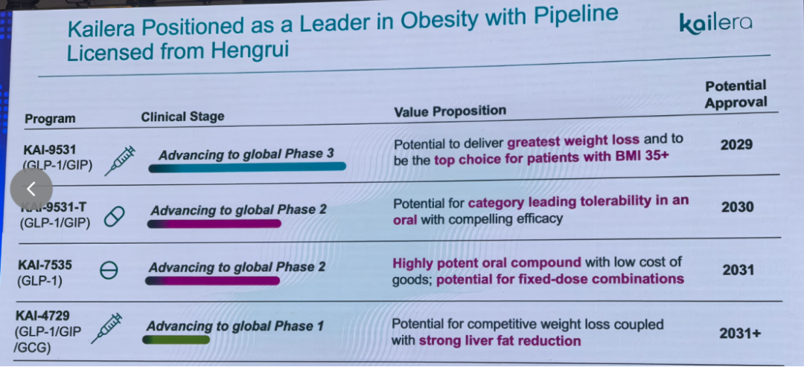

......

总体来看这次恒瑞的研发日还是内容非常丰富的，日常的投研经常会由于看的太细致而纠结于某个管线、某个靶点的研究，甚至有些投资人可能会觉得各家pharma之间的差别并不大。而这类研发日可以帮助我们跳脱出这种局限性，更加全面、深刻的更新公司各方面的发展和变化。

......

近期重点文章：

[一年一度，创新药最重要的事](https://mp.weixin.qq.com/s?__biz=MzkyMzQ3MDc3Mw==&mid=2247485292&idx=1&sn=08556c858af26754ced3d852f1c5a64c&scene=21#wechat_redirect)

[2025年创新药融资数据更新](https://mp.weixin.qq.com/s?__biz=MzkyMzQ3MDc3Mw==&mid=2247485286&idx=1&sn=7251adbc2940be8b8c65842d6c45c243&scene=21#wechat_redirect)

[医疗数据看的人眼前一黑](https://mp.weixin.qq.com/s?__biz=MzkyMzQ3MDc3Mw==&mid=2247485274&idx=1&sn=6e837ca4ef2b8157346f34e115276e01&scene=21#wechat_redirect)

[创新器械出海先锋](https://mp.weixin.qq.com/s?__biz=MzkyMzQ3MDc3Mw==&mid=2247485262&idx=1&sn=72f5e11cdd06ea0b5beac35064179e86&scene=21#wechat_redirect)

[国内外两大重要医药政策](https://mp.weixin.qq.com/s?__biz=MzkyMzQ3MDc3Mw==&mid=2247485250&idx=1&sn=26b1db9e62c4b9bc35e696f701dae3fa&scene=21#wechat_redirect)

风险提示：本文仅讨论行业/公司经营情况，投资需综合考虑公司经营、估值、管理层等多方面因素，建议读者审慎参考，本文不作为投资依据，不建议大家根据本文做出投资计划。

<!-- wxmp-comments-begin -->

---

## 留言（12 条，含回复共 26 条）

- **求索者** 👍11 · 2025-12-08 14:42
  一言以蔽之:内卷的土鳖之王
  - ↳ **作者** · 2025-12-08 14:44
    现在恒瑞的分子质量已经是大幅提升了[捂脸][捂脸]
  - ↳ **作者** · 2025-12-08 15:18
    363这种分子是可遇不可求的，实际上恒瑞和GSK以及默沙东的这两笔交易都是非常不错的交易。
- **CAI悠悠** 👍5 · 2025-12-08 15:21
  一直半死不活
  - ↳ **作者** · 2025-12-08 15:26
    过去三年，恒瑞医药的股价分别+17.8%、+1.98%、+36.57%。你可以说他涨的少，你说他半死不活？
- **追求卓越** 👍2 · 2025-12-08 14:17
  龙哥，相比之下，感觉石药已经是日薄西山了，是也不是呢？
  - ↳ **作者** · 2025-12-08 14:19
    也不是日薄西山，也是产品兑现周期不同，恒瑞转型早，进入兑现期，石药转型晚，目前的看点还更早期。
- **胡言胡语hws** 👍2 · 2025-12-08 14:19
  龙哥，荣昌泰它西普医保中标也没有低于预期吧，这市场在交易什么东东啊[晕]
  - ↳ **作者** · 2025-12-08 14:22
    泰它西普应该还好，维迪西妥单抗降的应该多一点。还有一些其他BD相关的传闻，我们也没法验证，就不在这里说了。
- **柴米油盐** 👍2 · 2025-12-08 14:21
  1811竟然没提到。
  - ↳ **作者** · 2025-12-08 14:24
    1811也有提到了，不过恒瑞东西太多了，就不单独讲单个品种了，不然够写一万字的文章
- **一凡** 👍2 · 2025-12-08 14:26
  创新药最近调整麻了。。。。
  - ↳ **作者** · 2025-12-08 14:32
    创新药行业典型特征，涨跌都很极致。如果想要“稳稳的幸福”的那种投资标的，创新药肯定不是。
- **yuraisy** 👍2 · 2025-12-08 14:33
  龙哥，生物安全进NDAA了，没有点名药明，靴子落地，龙哥解析一下
  - ↳ **作者** · 2025-12-08 14:38
    没太多好点评的，该说的前两周的文章讲过了啊
- **peter** 👍2 · 2025-12-08 15:19
  4640估计什么时候能上市？
  - ↳ **作者** · 2025-12-08 15:28
    现在非肿瘤慢病药平均要审批18个月左右，4640是今年1月申报NDA，顺利的话可能在26年中获批吧。
- **阿尔帕ALPA  周** 👍2 · 2025-12-08 17:04
  请教一下如何看待传奇生物年营收大概率同比增长90%以上，指引也基本都能实现，ACLX公司也没什么新变化，然而股价却创了几年新低，您怎么看？
  - ↳ **作者** · 2025-12-08 17:05
    我理解，海外市场主要是基于未来体内CART和TCE对自体CART竞争的担忧
- **ฅ*panda** 👍1 · 2025-12-08 14:17
  龙大，替尔波肽是进了中匡医保了吗
  - ↳ **作者** · 2025-12-08 14:18
    嗯，礼来官方公众号都发布消息了，替尔泊泰降糖适应症进了医保，减重没进，现在医保没能力支付减重需求。
  - ↳ **作者** · 2025-12-08 16:20
    那减重和降糖是不是有重叠的患者，打着降糖的幌子来减重呢？
- **frank** 👍1 · 2025-12-08 14:32
  恒瑞和百济都是龙头，各自有什么优劣势呢
  - ↳ **作者** · 2025-12-08 14:37
    百济的优势是全球化的研发和商业化能力，目前在血液瘤领域也已经建立起来极具全球竞争力的产品和在研管线，弹性更大，当然个别大品种的全球竞争风险也会大一些。
    恒瑞现在研发和商业化还是依托中国市场，大而全的广泛布局，出海主要靠BD，弹性没那么大，相应单个大品种的风险比较可控。
- **Jackie 余洵** · 2025-12-08 14:18
  龙哥，今天信达生物暴跌的原因是什么呢，没理解
  - ↳ **作者** · 2025-12-08 14:20
    信达今天跌的比较多，我看大家说的还是因为替尔泊肽进医保了，玛仕度肽没有医保嘛，降糖适应症明年就完全没法和替尔泊肽打了。

<!-- wxmp-comments-end -->
