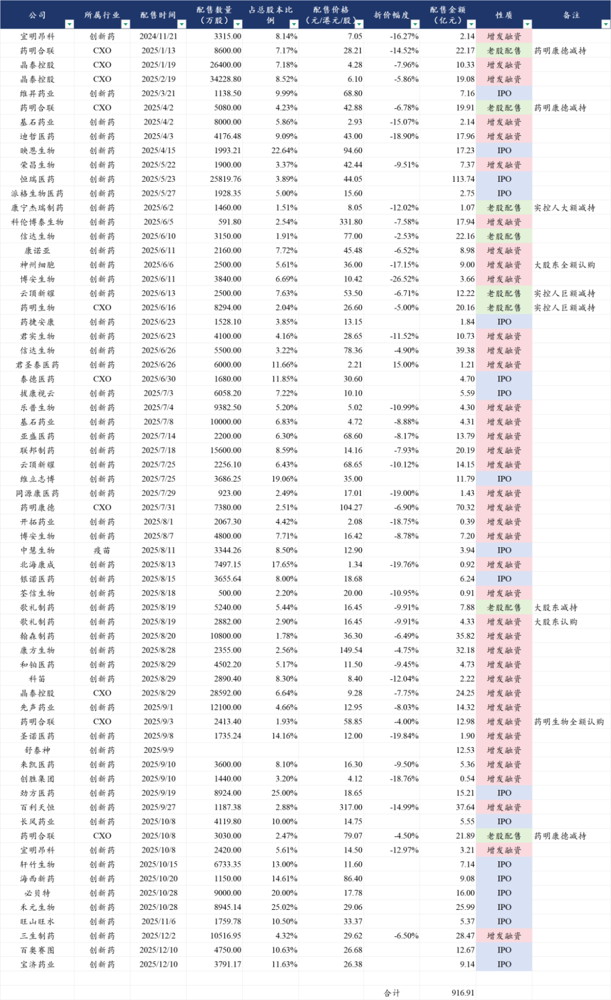
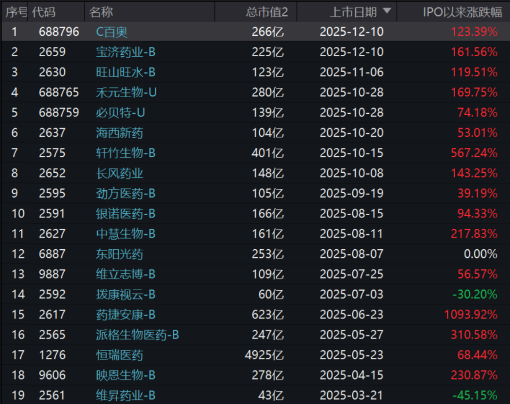
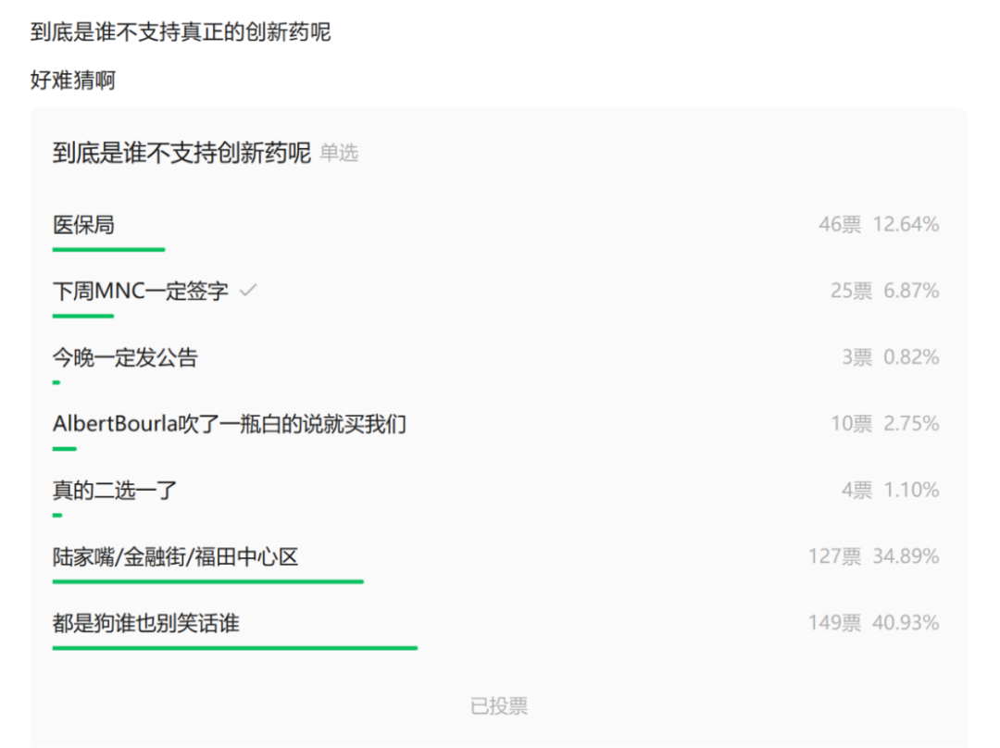
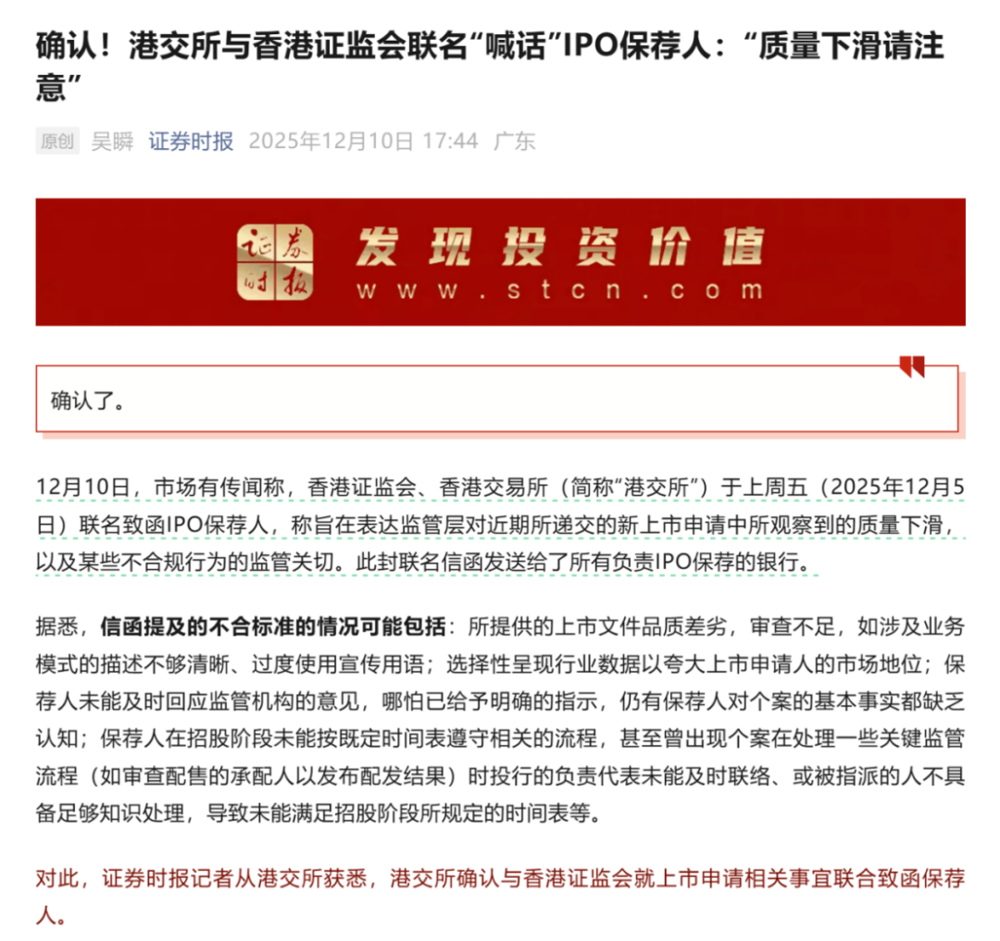
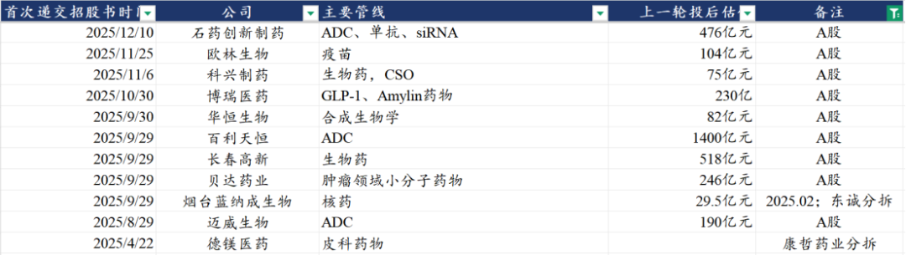

# 港股市场，荒野丛林

港股市场，向来是兵家不争之地。

A股流动性出点问题，先抽港股流动性；美股流动性出点问题，先抽港股流动性。

别人都看不起我，偏偏我也不争气。

港股市场以A股和美股零头的成交额，每年的融资金额却可与A股甚至美股比肩。融资当然是资本市场的最重要功能之一，但过犹不及。

2025年以来A股日均成交金额1.7万亿元，港股日均成交金额2520亿港元，相差7-8倍。

2024年A股IPO融资674亿元，港股IPO融资877亿港元。2025年以来，A股IPO融资1100多亿元，定增融资8500多亿元，扣除财政部和央企参与的银行定增以及券商重组外，A股实际定增融资约为3000亿，合计二级市场融资4100亿元；港股则是IPO融资2700多亿港元、定增融资1900多亿港元，合计二级市场融资4600亿港元。

这其中咱们医药行业尤其出众。

今年在A股创新药行业，IPO+增发融资合计100亿元出头，其中神州细胞老板自己掏9个亿定增还没落地，实际大概90多亿。而今年港股创新药行业，IPO+增发融资合计超过800亿元，占整个港股今年二级市场融资接近20%，不可谓不威风。

除了以上已经完成IPO实现上市的公司，目前在港股排队等待IPO的创新药公司超过50家，其中必然是有好的资产，也有很多莫名其妙的资产。资产质量有参差不齐，这无可厚非，而资产市场可以用脚投票，可以让劣质资产发不出来，可以让劣质资产大幅估值折价。

但一轮行情鸡犬升天，越是垃圾资产，由于股东结构中缺少机构，反而更容易被炒上天，次新股靠着流通盘少，估值可以顶到让人瞠目结舌的水平。再垃圾的资产只要在风口上IPO都有足够多的资金去推，结果就是我们要被持续喂垃圾。

有些投资人天天骂ybj，到底是谁在不支持创新药？其实投资人自己心里都清楚，投票结果一目了然。

港交所与香港证监会联名喊话IPO保荐人，注意新股的质量下滑。这是港股监管部门要拨乱反正了？

放心，不存在的，港股市场就是荒野丛林，不存在投资人保护这回事，港交所礼貌性的提醒一下，只是为了别耽误他赚钱。

港股排队IPO的创新药公司，包括9家A股公司到港股二次上市（另外昨晚又加一家信立泰），2家公司为分拆子公司上市。

资本运作被玩出花，H股公司去A股上市，A股公司去H股上市，现在更是来新花样，先把资产分拆A股上市，再把更多资产注入A股上市平台，最后把A股平台再拿回港股上市。在和我们玩俄罗斯套娃吗？

理论上优秀的上市公司，应该是不断剥离竞争力减弱、非核心、不增长甚至下滑的业务部门，聚焦发展具有成长潜力的核心业务部门，美股历史上很多伟大的公司历史上都曾经历过一系列的资产重组和业务调整，因此我们并不排斥分拆和重组。

但AH股的很多公司都是选择分拆最优质的资产出来独立融资，把低增长、不增长的资产放在体内作为基本盘，作为投资人来说，原本投资的这家公司是包括一部分高增长资产+一部分低增长资产，现在高增长资产出去独立上市，相当于投资人手里的股权对应的资产结构在被动“减持高增长资产、增持低增长资产”。

所以我们一直在给大家说，当一家公司做分拆上市，就直接去买他最好的资产而不是母公司、集团控股公司，药明系是如此，复星系是如此，科伦系是如此，微创系也是如此。也因此，我们甚至可以看到一些公司分拆出来的资产，估值可以超过母公司，也有很多投资人热衷于投这种看起来很“低估”的母公司，实际上大部分都是“低估值陷阱”。

......

产业发展不易，各位产业里的公司、尤其是头部公司，各位尊贵的医药投资人，且行且珍惜，维护在曲折中前行的中国创新药产业。

风险提示：本文仅讨论行业/公司经营情况，投资需综合考虑公司经营、估值、管理层等多方面因素，建议读者审慎参考，本文不作为投资依据，不建议大家根据本文做出投资计划。

<!-- wxmp-comments-begin -->

---

## 留言（9 条，含回复共 19 条）

- **Vincent 韩👀🐲** 👍7 · 2025-12-12 10:10
  原以为是双向奔赴，没想到，关系一好就借钱不还[旺柴]
- **穆晓春** 👍7 · 2025-12-12 10:11
  谢谢，终于有人把为啥不买控股型公司说明白了[强]
  - ↳ **作者** · 2025-12-12 10:13
    这个是原因之一，另一个原因就是集团控股型公司往往会相对更难实现股东价值兑现，尤其是对于爱瞎投资的集团控股公司，他赚了钱也是出去投资，也不会给你回购和分红。
- **沈清沁（随順自性）** 👍2 · 2025-12-12 10:12
  港股A股化
  - ↳ **作者** · 2025-12-12 10:18
    港股看上去是成熟资本市场，实际上一直挺残酷的，没有投资人保护，涨跌可以比A股更极致，你可以在港股捡到便宜到离谱的资产，也可以在港股爆亏99%，这在A股都是不太有的。
- **小鱼** 👍1 · 2025-12-12 10:03
  三生制药一直跌跌不休是因为啥呢？
  - ↳ **作者** · 2025-12-12 10:06
    三生制药还是今年涨的比较多，今年的预期反映的比较充分，估值要进一步提升还是得看明年辉瑞海外更多临床推进进展。
  - ↳ **作者** · 2025-12-12 10:31
    配股啊还有为啥，不看新闻吗[捂脸]
  - ↳ **作者** · 2025-12-12 10:33
    配股，分拆，确实都是有点影响的
- **人间白加黑** 👍1 · 2025-12-12 11:06
  被收购的公司呢？比如惠泰医疗之于迈瑞医疗。
  - ↳ **作者** · 2025-12-12 11:19
    收购兼并是企业做大做强的重要环节，但收购只是第一步，收购后的整合运营是更重要的，这是决定被收购公司价值的关键。
- **An** · 2025-12-12 10:18
  和博主观点稍有不同，我觉得主要要看母公司是不是一个“装资产的袋子”。如果袋子本身很便宜，而且里面装的资产价值远超袋子的价格，那就买袋子；如果袋子很贵，或者里面装的都是垃圾，那就直接去买里面那个值钱的“宝物”。
  - ↳ **作者** · 2025-12-12 10:21
    可是你买的不是个商品，你买的是股权。
    商品有自己的公允价值可以体现，股权价值需要公司给你兑现，尤其是集团控股公司的股权价值，因此集团控股公司的折价是全球资本市场共同的认知。
- **林洋** · 2025-12-12 10:23
  药明生物比药明康德更值得投资？
  - ↳ **作者** · 2025-12-12 10:25
    我自己的理解是，药明康德分拆药明生物出来的时候，应该买药明生物，药明生物分拆药明合联出来的时候，应该买药明合联，当然现在药明合联也涨了很多了，不过这两年也一直是这么给大家说的，就买他拆出来的景气度最高的赛道的核心资产就好。
- **沉默是金** · 2025-12-12 10:28
  创新药企业融资，对cxo是件好事情吧[呲牙]
  - ↳ **作者** · 2025-12-12 10:30
    中期来看对行业是的，具体还要看各公司业绩兑现情况。
- **尘缘** · 2025-12-12 12:57
  石药分拆了一个新诺威，现在又分拆出一个石药创新[捂脸]
  - ↳ **作者** · 2025-12-12 13:01
    新诺威就是石药创新

<!-- wxmp-comments-end -->
