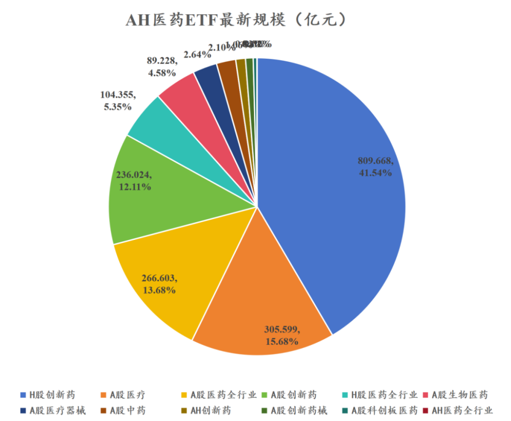
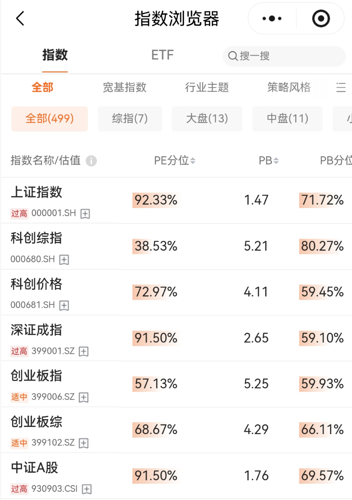
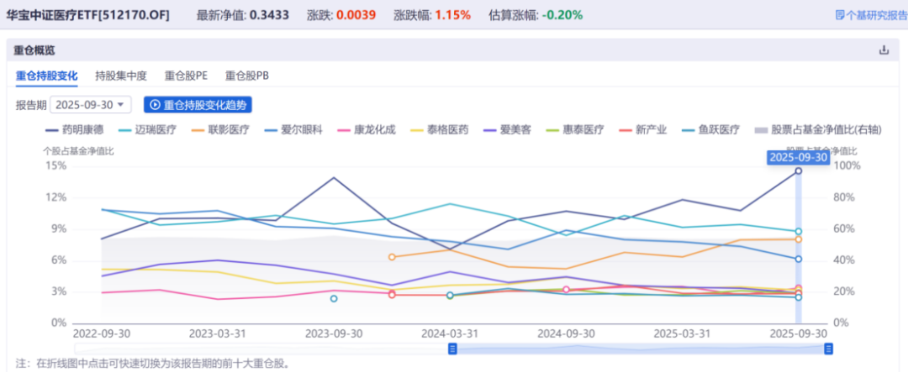
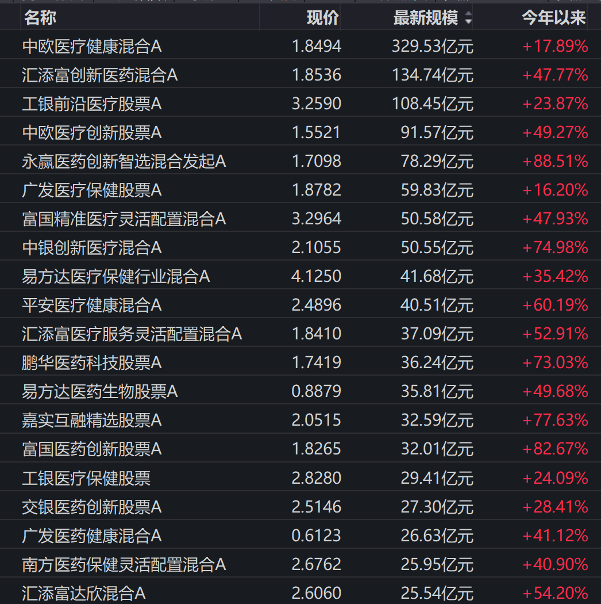
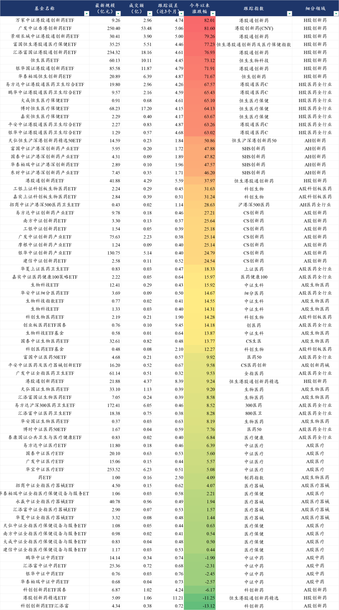
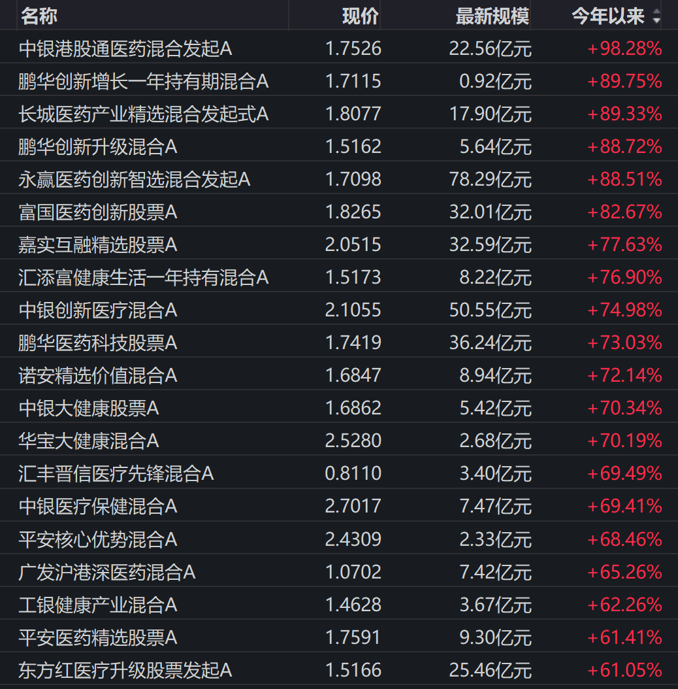
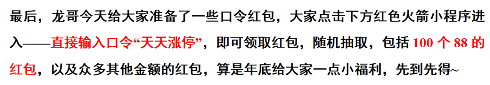

# 医药基金年底结账，谁在裸泳

大家好，我是龙哥。

年底了，给大家梳理一下医药行业基金今年全年运行的情况，包括主动管理基金和被动管理基金。文末给大家安排了红包福利，算是感谢大家这一年的支持~

1、主动+被动医药基金

首先我们统计了183个医药主动管理基金和74个医药被动管理基金的情况，183个医药主动管理基金合计最新的管理规模是2135亿元，74个医药ETF的合计规模是1949亿元，医药主题的主动+被动基金合计规模是4084亿元。

2023年7月统计的该规模，医药行业主动管理基金规模2200亿元，医药主题ETF规模1000亿元，合计规模3200亿元，历经两年半的时间，医药行业主题基金的规模又扩张了800多亿，但其中主动管理基金的规模略有下降，行业ETF的规模大幅扩张，在此期间，A股的申万医药指数至今累计是下跌11%，港股的恒生医疗保健指数至今累计上涨29%。

医药ETF的规模对比今年另外两个时间点，今年2月底梳理时61个医药主题ETF合计规模是1355亿元，今年9月初梳理时69个医药主题ETF合计规模是1832亿元，而目前74个医药主题ETF合计规模2135亿元。

规模庞大的医药主动管理基金，使得很多医药公司、尤其是A股的很多医药公司的估值，始终可以维持在一个不太正常的较高估值中枢水平，换句话说就是，由于有这些行业主题基金，使得哪怕经历了前面几年的医药熊市，某些细分领域、某些公司的基本面哪怕非常差，从筹码结构和估值角度始终难以出清。今年来情况稍有变化，绝大部分医药主动基金的持仓都切到创新药及创新药产业链。

2、细分领域ETF

ETF可以对跟踪指数所属领域做如下划分：

合计规模1949亿元的医药ETF中，H股创新药合计规模810亿元、占比41.5%，A股创新药规模236亿元、占比12.11%，AH创新药规模21亿元，也即A股+H股+AH股创新药ETF的合计规模约为1067亿元，占医药ETF的54.7%。

A股和港股创新药ETF规模看起来比较大，但相较医药主动基金的持仓集中度来说，还并不算高，A股的中证医疗ETF还有254亿的规模，至今仍然是医药领域的第一大ETF，持仓标的除了CXO以外，还有大量的医疗设备和医疗服务，而我们知道今年医疗设备行业虽然招投标数据有同比的修复，但总体情况依然不佳，行业内龙头公司也依然存在渠道库存压力；医疗服务更是不必多说。

之前也有不少读者问我们对这些医药基金的数据从哪里查的，我们机构投资人可以在wind里直接拉数据，也可以用下面这个红色火箭的小程序，尤其是在手机上看的时候比较方便，非常直观。

一方面是可以比较方便的看到各个指数跟踪的ETF的规模、成交量、业绩表现、费率等等核心指标，另一方面最好用的一个功能是他可以直接给你显示各个宽基指数、行业主题指数的PE/PB估值分位数，宽基和行业估值分位数虽然在定量分析上意义没那么大，但还是能比较好的帮助大家定性的评估估值水位的高低。

医疗ETF今年来的收益，大部分是药明康德一个公司贡献的，其他医疗设备、医疗服务、高值耗材的权重股如迈瑞医疗、新产业、爱尔眼科、惠泰医疗、爱美客等在今年都是负收益，联影医疗、鱼跃医疗都在持平附近，

CXO里A股的泰格医药也是负收益，也因此，在今年A股医药指数涨15%、H股医药指数涨65%的背景下，中证医疗ETF的涨幅只有5%。

类似的还有A股医药全行业ETF今年来的涨幅只有8%-9%，A股医疗器械ETF今年来涨幅只有2%，A股中药ETF今年来还是负收益，我们说从24年下半年以来医药有两个大的细分领域政策面恶化最明显，一个是器械领域的IVD，一个是院内中药。

选择大于努力，选错了细分领域，在今年创新药行情里也只能原地踏步。

医药主动基金不太方便做细分领域的划分，就规模来看，今年创新药主题的医药主动管理基金也是规模上的比较快，如永赢基金这样的“主动基金极致被动化”的风格在这两年比较吃香。

规模最大的中欧医疗健康仍有330亿的规模，今年来的17.9%的业绩表现在医药主动管理基金里大概是后25%的较差水平，“医药女神”彻底跌落人间。

3、基金业绩表现

被动基金方面，按今年来的业绩表现排序，可以看到和跟踪指数所属细分领域有较大的关系，业绩排名前8位全是H股创新药ETF，紧随其后的7个产品均为H股医药全行业ETF，与之相对应的就是今年以来港股创新药指数涨了大概76%，港股恒生医疗指数涨了大概64%。

74个医药主题ETF的中位数表现是14.3%，买A股和H股医药ETF今年的平均收益率差距平均在50%以上，属于定性上的投资方向选择差异，我们从去年以来一直讲港股创新药ETF，在今年的表现得以充分反映。

再往后是AH股沪港深创新药ETF涨幅都在46%-50%，A股科创板医药ETF涨幅31%-32%，A股创新药ETF涨幅在25%左右。A股医药全行业ETF在今年来总体还能有个10%-15%的涨幅，如果买到A股医疗、A股医疗器械等则是只有中低个位数涨幅。

注意以上这是从年初至今一直持有的收益率，实际上我们看到在创新药行情火热的阶段，ETF规模扩张了很多，这些新进的增量资金并不能完全吃到这些涨幅，甚至还有些高位新发基金至今已经亏损十几个点。

主动管理基金方面，185支医药主动管理基金今年以来的中位数收益率是30.79%，可见在医药行情相对较好的阶段，主动管理基金总体还是能呈现跑赢ETF的，这个逻辑我们在上一轮牛市里就给大家讲过，医药行业还是一个专业性要求比较高的赛道，因此专业的医药投资人在有行情的时候还是比较容易跑赢指数的。

换句话说就是在各位投资人做权益资产投资中配置医药板块的时候，选择医药基金的投资时，理论上来说应该是熊市选ETF、牛市选主动基金。

此前我们也多次讲到，主动管理基金大部分是规模的敌人，被动基金（ETF）大部分是规模的朋友，也就是说选择主动管理基金的时候尽量选择规模中等、基金经理已经验证过自己的产品，则选择被动管理基金的时候尽量选择规模最大、费率最低的产品。

从今年医药主动管理基金的表现也可以看到，业绩表现靠前的总体还是规模较小或者中等规模但风格较为极致的产品（今年就是创新药主题），而行业此前规模最大的3个主动管理基金中欧医疗健康、工银前沿医疗、广发医疗保健的份额都下了非常多，与之对应的是今年的业绩表现都非常一般。

......

风险提示：本文仅讨论行业/公司经营情况，投资需综合考虑公司经营、估值、管理层等多方面因素，建议读者审慎参考，本文不作为投资依据，不建议大家根据本文做出投资计划。

<!-- wxmp-comments-begin -->

---

## 留言（14 条，含回复共 31 条）

- **攀枝摘花** 👍3 · 2025-12-15 17:00
  谢谢老板[抱拳]，领得红包。祝明年研究顺利、成果斐然。
  - ↳ **作者** · 2025-12-15 17:12
    置顶一下，大家记得文末领领红包，领到88的小伙伴可以留言说一声哦，给大家传递一下好运，哈哈
- **ming** 👍1 · 2025-12-15 16:41
  器械Ivd目前看到拐点了吗？医疗器械PB估值百分位来到4%了
  - ↳ **作者** · 2025-12-15 16:42
    IVD我认为没到，设备存疑，高耗总体应该已经看到拐点，不过细分领域略有差异。
- **TT鼠。** 👍1 · 2025-12-15 16:41
  龙哥，今天吃大面了呀[苦涩]
  - ↳ **作者** · 2025-12-15 16:43
    一品红背大锅，吹吹吹，吹半天一地鸡毛，还得带着行业崩。
  - ↳ **作者** · 2025-12-15 16:53
    主要是没有销售分成 想象力就没了
- **迷雾** 👍1 · 2025-12-15 16:45
  龙哥，人福医药怎么看，是利空出尽吗？
  - ↳ **作者** · 2025-12-15 16:47
    是利空出尽，但等复牌股价要反映多少利空还得看市场的
- **成蹊** 👍1 · 2025-12-15 17:00
  港股创新药跌了补，补了跌，竟然没有给我一次高T的机会，现在已经拿成重仓了。
  - ↳ **作者** · 2025-12-15 17:13
    交易习惯的问题吧你这是，要做好交易计划，怎么能为了做T而被动买成重仓。
- **时间之外的往事** 👍1 · 2025-12-15 17:23
  龙大，今天港股创新药暴跌，几大龙头都大阴伺候，有说新基金考核不纳入港股，于是基金漂移。有说是日元升值，外资套现归还日元，有说是一品红拖累，龙哥受累给分析分析吧。
  - ↳ **作者** · 2025-12-15 17:25
    基金考核取决于基金对标指数是哪个，也不是今天刚出的消息，好多天了。
    日元今天波动也不大，对流动性能有这么大的冲击？
    一品红是得背大锅的。
- **Approach** · 2025-12-15 16:46
  一品一己之力带崩整个板块。被收购到底是利好还是压垮骆驼的稻草？看不懂真的看不懂。[流泪]
  - ↳ **作者** · 2025-12-15 16:49
    这有什么看不懂的，如果市场对这个收购没有预期，那当然是利好，公司在那吹国内100亿、全球100亿美金，在那吹海外BD起码10亿首付款，结果国内和海外的估值都只有这点，海外部分首付款到一品红就只能拿9个亿人民币，加上里程碑付款全落地也就14个亿，之前吹吹吹，炒出来几百亿市值。
  - ↳ **作者** · 2025-12-15 16:56
    你说的被谁套了30%？被基本面还扎实的创新药公司套的话，明年还是有机会创新高的，被这种诈骗公司套的话就不知道了。
- **一凡** · 2025-12-15 16:46
  百济神州A股-2%，港股-8%，核心还是港股的流动性问题。[流泪]
  - ↳ **作者** · 2025-12-15 16:53
    单个个股是一方面，行业指数来看港股创新药波动确实也一直比A股的大，之前涨的时候弹性更大，回调也跌的更快。今天A股创新药指数跌了2%，港股创新药指数跌了3.2%。
- **tmac** · 2025-12-15 16:51
  我记得龙哥说过26年年底会是创新医疗器械的拐点，想问下如果定投的话现在创新医疗器械etf是个好的选择吗
  - ↳ **作者** · 2025-12-15 16:52
    今年中的文章，今年中应该是器械（主要是高耗）的政策拐点，之所以说26年底是基本面拐点，因为我们之前看创新药领域，22年底政策拐点，基本面拐点往后延后了大概1.5年-2年，所以以此大致推算的。
- **Bryan** · 2025-12-15 17:00
  没想到今天BJ能跌这么多，一开始挂的低了担心到不了，再跌我砸锅卖铁补点吧。
  龙哥，传奇ASH基本面解读是正面的，为什么近期反而跌更厉害了？这票肯定是鸡肋了，但低位一直就没割，上周抄底一点还是埋了[捂脸]
  - ↳ **作者** · 2025-12-15 17:11
    竞品的ASH数据更惊艳啊，in vivo CAR-T，TCE，都非常牛逼
- **勇敢的十六宝** · 2025-12-15 17:12
  创新药最近这么弱是不是被美国的医药集采吓坏了。美国蛋糕变小了，会改变中国创新药的估值逻辑吗
  - ↳ **作者** · 2025-12-15 17:21
    可美国蛋糕没变小，到底吓到谁了啊？
  - ↳ **作者** · 2025-12-15 18:00
    蛋糕没变小吗？[捂脸]美国也有以价换量的逻辑吗？
- **魏小魏** · 2025-12-15 17:14
  医药比消费还坑，消费是不涨，医药是动不动就无脑砸一下
  - ↳ **作者** · 2025-12-15 17:21
    那医药比消费还是好的多，消费是除了几个新消费之外一直跌，医药是先大涨了再回调，起码今年有绝对收益的，哪怕是A股医药指数今年都涨了13.3%，今年食品饮料-7.4%，美容护理-4.1%，家电+7.77%。
- **HuangCX** · 2025-12-15 17:28
  医疗器械现在好的一方面就是国产替代，国家也在支持医疗设备更新，但是在医保政策下，还有集采下内卷太严重，只能不断扩大出海。
  - ↳ **作者** · 2025-12-15 17:29
    12月2号的文章，梳理了医疗器械出海
- **coco** · 2025-12-15 22:37
  长春高新终于出BD了，怎么看？
  - ↳ **作者** · 2025-12-16 08:25
    好事呀，高新讲创新药逻辑已经讲几年了，大概前年去他们研发日的时候就说自己创新药布局多么厉害，终于开始进入兑现期了

<!-- wxmp-comments-end -->
