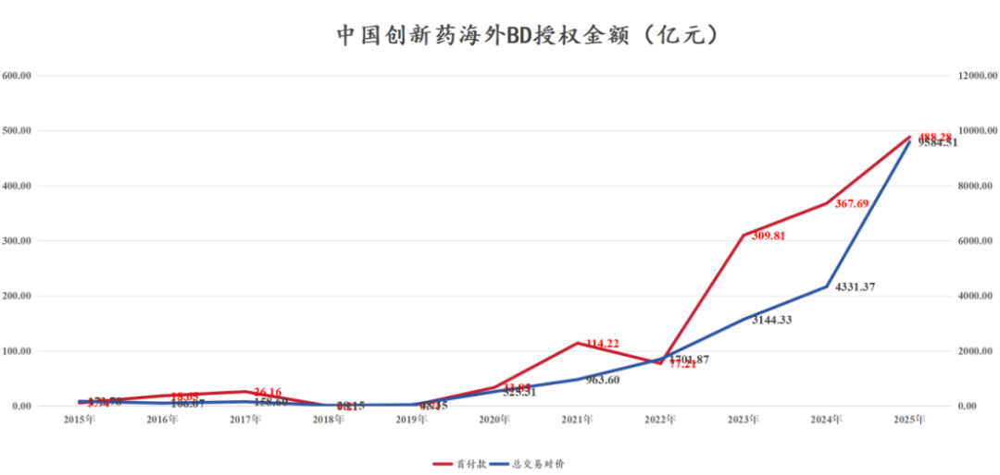
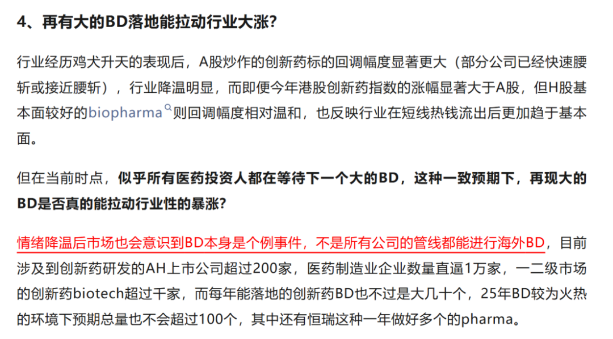
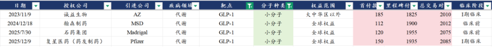
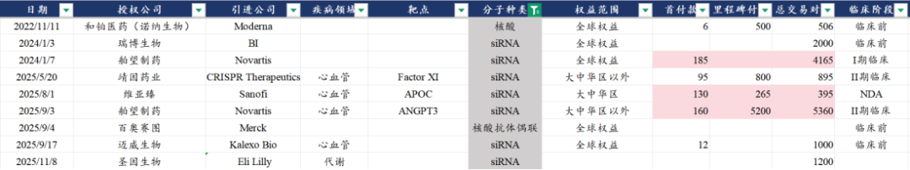
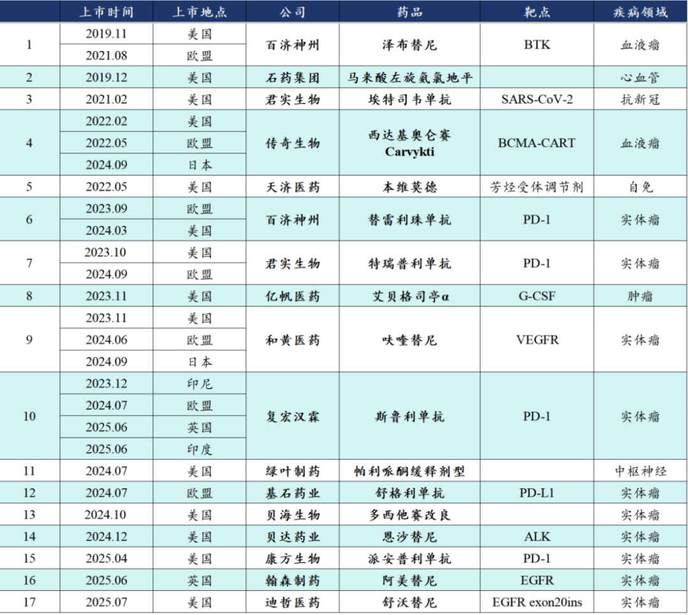
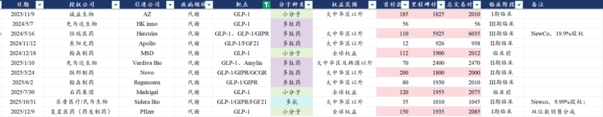
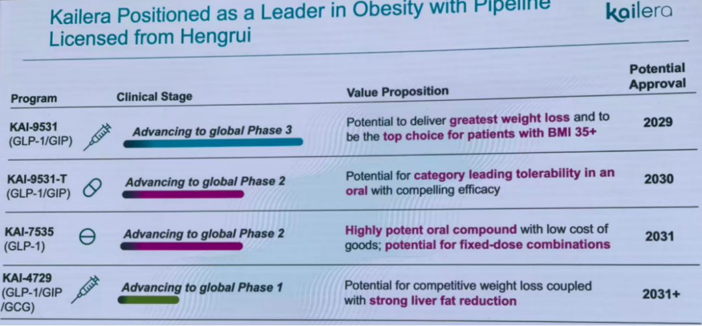

# 创新药出海新征程

大家好，我是龙哥。

今年创新药海外BD的炒作在资本市场爆火，预告式公告、“在与MNC接触”、传小作文、写段子、传假消息的数不胜数。

实际上从2023-2025年，创新药BD已经火了3年：

我们在10月13日的文章《[聊几个创新药行业大家最关心的问题](https://mp.weixin.qq.com/s?__biz=MzkyMzQ3MDc3Mw==&mid=2247485007&idx=1&sn=45e247c9104c79fb75f049c267247e33&scene=21#wechat_redirect)》中写到：

随后，信达生物的百亿美金交易落地后行业反而加速下跌，我们认为，创新药出海的驱动因素也在悄然变化，创新药BD交易的落地只是考虑创新药全球价值的定性分析中的一个环节，但如果大家只关注这个环节——最简单、卷内幕消息就可以，那么最终结果就是四季度以来行业的一地鸡毛。从定性分析的角度，BD交易后的研发推进和商业化是驱动股价进一步表现的核心因素，市场在逐渐认识到这一点。

本文我们主要想讨论两点内容，对26年及以后的创新药投资可能有重要的意义，其一是创新药BD的趋势变化，其二是哪些项目在BD后在快速的开启注册临床、对应海外价值在BD后仍在提升？

1、创新药BD趋势变化

从23年开始我们就一直提一点，创新药的海外BD是明显跟随技术方向变化的，或者说我们可以把这种全球创新药BD引进方、资本方愿意大规模投入的方向称之为产业趋势，那么上文提到的创新药出海比较火的这三年，技术方向在持续发生变化，而创新药投资以及CDMO领域的投资，则是很大程度上需要持续跟随技术趋势，因此我们总结了以下几点：

①ADC的BD交易最火的时候已经过去

2022年到2024年上半年，中国医药出海合计授权91个项目（包括biosimilar），其中ADC项目高达26个，中国创新药累计对外授权了46个ADC项目，2022-2025年分别为7个、13个、14个、11个，ADC项目在2025年的交易占比已经显著下降。

当然BD交易的降温并不意味着产业趋势结束，实际上更多的是MNC已经完成了主要的ADC管线的布局，后续的交易依然存在，例如25年10月罗氏引进翰森的CDH17 ADC等，只是体现在交易占比下降、重磅交易减少，这个阶段MNC陆续在推进临床和读出数据的阶段，实际上是属于经历了一轮密集BD交易后的“进展期”。

②双抗、双融合蛋白、三抗、多抗交易大爆发

2023-2025年，双抗/多抗的中国创新药海外BD交易数量分别为5个、15个、25个，2025年来双抗/多抗的交易已经显著超越ADC项目数，尤其是2025年下半年，双抗、多抗交易达到13个、ADC交易数量仅有4个。双抗/多抗领域呈现多个细分领域的“百花齐放”，IO双抗领域中国公司几乎呈现全球领导地位，自免双抗中国公司进度在全球市场也处于较为前列的水平，TCE技术平台更是层出不穷、引来海外BD交易方垂涎。

双抗、多抗的爆发实际上和ADC在国内的爆火有异曲同工之处，一方面是先驱公司的临床数据的陆续披露使得行业研发确定性提升，MNC有战略布局相应管线的需求，另一方面是中国公司非常擅长这种快速的进行工程化开发复杂药物形式，是工程师红利在创新药领域持续兑现。

③小分子药物经久不衰

2020-2025年，中国小分子创新药海外BD交易数量分别为5个、4个、3个、13个、12个、21个，25年来的BD授权交易数量仅次于双抗/多抗，且近几年都有不错的占比，小分子药物在中国创新药出海中是经久不衰，始终占据着重要地位。

在目前全球最火的GLP-1减重药靶点，小分子GLP-1领域中国公司占据极其重要的地位，2023-2025年授权出去4个小分子GLP-1，分别给阿斯利康、默沙东、辉瑞三大巨头以及MASH领域新星Madrigal，4笔交易均为超1亿美元首付款、超20亿美元总交易对价的重磅交易。

④小核酸药物初显锋芒

2024年-2025年小核酸药物分别实现海外授权2项、6项，类似前几年的ADC药物和多抗类药物BD授权陆续加速的阶段。小核酸药物领域的研发管线在快速积累，上市公司也即将迎来爆发，行业内较为有名的舶望制药、靖因药业、圣因生物、瑞博生物等都已经提交港股上市的招股书（有的是密交），有望在2026年陆续登录资本市场。

在A/H股市场，各家公司的小核酸布局也在快速增加，如恒瑞医药、石药集团都有5个siRNA药物进入临床阶段，信达等biopharma也不甘示弱的快速积累技术和在研项目，小核酸在中国市场的研发已经出现锋芒，未来几年有望持续爆发，引领新一轮的创新药新技术路线研发热潮。

2、创新药海外注册进展

创新药出海，BD是一个抓手，但不是全部，在BD交易落地后更重要的是海外持续的临床推进、产品注册和商业化。

在创新药出海公司的估值中，长期来看占估值大头的也不会是BD交易一锤子买卖的那点首付款，而是持续的里程碑付款和商业化后的销售分成，因此海外合作方对于BD引进的项目，有没有意愿推进、有没有能力推进、推进效率如何、临床和注册时间表、期间竞争格局的持续变化等，都是对海外BD项目估值的影响因素，其对于投资来说当然是难度更大，不如卷BD内幕消息那么简单粗暴，但这是创新药出海的本质。

投资中可以选择先做简单题，但不能舍本逐末，不能脱离底层逻辑。

此前我们统计过一个数据，中国创新药海外上市品种如下，其中大家特别熟悉的品种，像自己做商业化的百济神州的泽布替尼，以及BD授权的标杆项目如传奇生物的Carvykti、和黄医药的呋喹替尼等。

还有些项目是“老大难”，费了那么大的劲把海外临床做完，结果连个海外商业化合作方都找不到，大家就可以自行理解这个项目价值到底如何。

以上在海外商业化的算是中国创新药出海第一批的先行者，大家可以看到除了传奇的细胞疗法外，基本还是小分子药物和单抗药物为主，并且其中大部分是国内所谓的me better、fast follow，实际上拿到海外去就成了me too/me worse、slow follow。

在这几年BD交易出海的项目已经超过100个：2020年12个，2021年13个，2022年23个，2023年41个，2024年63个，2025年以来89个，近6年累计达到241个项目海外授权，其中可能大部分都会失败、退货、终止开发，但创新药从来都是少数赢家的游戏。

2025年以来，除了BD交易本身以外，海外临床推进已经成为中国创新药出海公司估值提升的重要驱动因素，因此这里我们也将会梳理创新药出海开启注册临床的重点项目，这些项目有望在未来2-3年陆续读出注册临床结果和提交上市申请、乃至实现在海外市场的商业化。

1）IO2.0

2025年IO领域可谓是“冰火两重天”，一边是默沙东、罗氏、百济、吉利德、GSK等一众公司在LAG-3、TIGIT等曾经被寄予厚望的下一代IO靶点上纷纷“含恨而终”，另一边是以康方、三生、信达等IO双抗公司风生水起，年初至今，信达生物股价翻倍有余，康方生物接近翻倍，三生制药更是涨超3倍，信达、康方超千亿市值，三生超600亿市值。

康方生物/Summit：AK112（PD-1\*VEGF双抗），国内累计开了13项注册临床，其中2项适应症已经在国内获批、1项申报上市，有3个国内注册临床将在2026年读出OS结果，对于PD-1\*VEGF双抗领域具有至关重要的影响。海外目前Summit开了联用化疗二线EGFR TKI经治肺癌、一线PD-L1阳性肺癌、联用化疗一线肺癌，联用化疗一线结直肠癌等4个适应症的全球III期临床。另外康方AK104（PD-1/CTLA-4双抗）在国内累计开了10项注册III期临床，其中3项适应症已经在国内获批且纳入医保，海外目前开了一线胃癌、二线肝癌等2个适应症的全球III期临床。

普米斯/BioNTech/BMS：普米斯的PM8002（PD-L1\*VEGF）授权给BioNTech、后直接被BioNTech收购，随后BioNTech又与BMS合作开发该双抗，目前该双抗已经启动一线三阴乳腺癌、一线非小细胞肺癌、一线广泛期小细胞肺癌、一线胃癌、一线结直肠癌等5项全球III期或II/III期临床。

三生制药/三生国健/Pfizer：三生国健此前为聚焦自免领域新药开发和商业化，将肿瘤管线及其他管线转让给母公司三生制药旗下的沈阳三生，并在今年实现对辉瑞的BD交易，目前该项目在国内开启了一线PD-L1阳性非小细胞肺癌的III期临床，在海外开启了联用化疗一线肺癌、联用化疗一线结直肠癌等2项全球III期临床，且后续还有一系列临床规划。

信达生物/武田制药：IBI-363（PD-1\*IL-2α）目前已经启动两项注册临床，包括一线治疗黏膜型及肢端型黑色素瘤的国内注册II期临床，和PD-1/PD-L1及含铂化疗经治非鳞非小的全球多中心III期临床。

2）ADC

ADC药物的海外注册临床，也是呈现百花齐放，科伦博泰、百利天恒两个行业龙头一骑绝尘，翰森、映恩等后来者各领风骚。

科伦博泰生物/默沙东：SKB264/MK-2870无疑是这两年中国ADC出海最亮眼的仔，自2023年10月以来的2年时间，默沙东陆续启动了15项全球多中心注册临床，覆盖了肺癌、乳腺癌、子宫内膜癌、宫颈癌、卵巢癌的辅助、新辅助、一线、一线维持、二线、三线治疗等一系列适应症，最快的适应症如三线胃癌、三线肺癌、二线肺癌等均将在27年完成。SKB264也已经在国内实现3个适应症的上市、1个适应症处于NDA、1个适应症达到III期临床终点，另有2个适应症处于III期临床。

百利天恒/BMS：BL-B01D1（EGFR\*HER3双抗ADC）目前在中国开展了10项III期临床，其中包括后线鼻咽癌适应症申报上市，二线食管鳞癌适应症达到III期终点。海外方面，BMS在今年开始推进BL-B01D1的海外注册II/III期临床，2025年以来启动了EGFE TKI经治NSCLC、一线不适用PD-1/内分泌治疗的三阴乳腺癌、转移性UC等3项全球多中心II/III期临床。

翰森制药/GSK：HS-20093（B7-H3 ADC）目前在国内启动3项注册临床，GSK在今年8月启动了首个全球注册III期临床——二线治疗晚期小细胞肺癌，为仅次于默沙东/第一三共的全球第二家，昨天默沙东还因为间质性肺炎导致患者死亡的副作用而终止了2L+小细胞肺癌适应症的全球III期临床，翰森/GSK成为该适应症的全球FIC位置。

近期，GSK还启动了HS-20089（B7-H4 ADC）针对复发性子宫内膜癌和卵巢癌的2项全球III期临床，而此前25年3月翰森在中国已经启动了针对复发卵巢癌的III期临床。翰森授权GSK的这两项ADC资产目前来看都得到了GSK足够的重视。

映恩生物/BioNTech：DB-1303/BNT323（HER2 ADC）目前在海外开展2项适应症的全球多中心注册临床，分别为单药二线HER2+子宫内膜癌和单药2L+ HER2 low乳腺癌，国内则是有2L+ HER2阳性乳腺癌达到III期临床终点，预计26年将在国内和海外递交HER2-ADC的上市申请。26年还有望看到BioNTech启动B7-H3 ADC的首个适应症的全球多中心注册临床。

康诺亚/乐普生物/AZ：CM336（CVlaudin18.2-ADC）在24年4月启动首个全球III期临床用于二线治疗Claudin18.2阳性胃癌，预计26年有望读出III期临床结果，也有可能成为中国海外授权的ADC项目中首个在海外读出III期结果的项目。

3）代谢

GLP-1领域，中国诞生了一系列的海外BD授权，交易总包超过200亿美元。

其中规模最大的就是恒瑞医药授权的GLP-1系列产品组合，恒瑞医药的海外合作方在恒瑞的研发日上也展示了其海外临床和上市计划，其中首个项目GLP-1/GIPR双靶点激动剂已经于近期启动了针对肥胖的3项全球多中心III期临床，此前该Newco公司刚完成6亿美元的B轮融资以支撑其推进临床试验。

4）其他领域

亚盛医药/武田制药：奥雷巴替尼（BCR-ABL）在25年12月初在欧盟和美国获批开展联合化疗一线治疗Ph+急性淋巴细胞白血病（ALL）的III期临床，该适应症在国内早在23年7月已经获批开展III期临床，奥雷巴替尼在一二代TKI经治的CML全人群适应症获批并纳入医保后， 25年国内商业化也有较大改善。

......

随着23-25年BD授权的项目早期临床开发，预计未来2-3年，创新药出海也将让大家看到“冰火两重天”，一方面是前几年密集的BD交易意味着未来几年会有密集的“退货”，另一方面则是会有越来越多POC验证的项目陆续启动全球注册临床，创新药出海的新征程，才刚开始。

......

近期重点文章：

[港股市场，荒野丛林](https://mp.weixin.qq.com/s?__biz=MzkyMzQ3MDc3Mw==&mid=2247485393&idx=1&sn=db2c9f925c04df69089f2b03aef460e7&scene=21#wechat_redirect)

[一年一度，创新药最重要的事](https://mp.weixin.qq.com/s?__biz=MzkyMzQ3MDc3Mw==&mid=2247485292&idx=1&sn=08556c858af26754ced3d852f1c5a64c&scene=21#wechat_redirect)

[2025年创新药融资数据更新](https://mp.weixin.qq.com/s?__biz=MzkyMzQ3MDc3Mw==&mid=2247485286&idx=1&sn=7251adbc2940be8b8c65842d6c45c243&scene=21#wechat_redirect)

[医疗数据看的人眼前一黑](https://mp.weixin.qq.com/s?__biz=MzkyMzQ3MDc3Mw==&mid=2247485274&idx=1&sn=6e837ca4ef2b8157346f34e115276e01&scene=21#wechat_redirect)

[创新器械出海先锋](https://mp.weixin.qq.com/s?__biz=MzkyMzQ3MDc3Mw==&mid=2247485262&idx=1&sn=72f5e11cdd06ea0b5beac35064179e86&scene=21#wechat_redirect)

[全球顶级大药的狂欢](https://mp.weixin.qq.com/s?__biz=MzkyMzQ3MDc3Mw==&mid=2247485203&idx=1&sn=0b605ddfb552f201dccf6d651f3c7278&scene=21#wechat_redirect)

风险提示：本文仅讨论行业/公司经营情况，投资需综合考虑公司经营、估值、管理层等多方面因素，建议读者审慎参考，本文不作为投资依据，不建议大家根据本文做出投资计划。

<!-- wxmp-comments-begin -->

---

## 留言（13 条，含回复共 27 条）

- **清风烈酒** 👍4 · 2025-12-19 11:56
  要么报着头部企业，要么买ETF
  - ↳ **作者** · 2025-12-19 12:03
    这不就是过去2年我们一直在讲的事情，当然，市场经历一轮大起大落之后，很多投资人才能更深刻的理解这种简单的结论。
- **天野源** 👍2 · 2025-12-19 12:26
  龙哥，根据您的分析，创新药的后续趋势仍旧非常好哇，而且后面应该可以持续看到利润了吧？
  - ↳ **作者** · 2025-12-19 12:35
    今年利润端已经有明显体现，明年利润端会更好的多。
- **廖书豪** 👍1 · 2025-12-19 11:54
  龙哥，请教下像贝达这种自研+并购管线，是按照管线单个拍估值还是拉通看ps呢，CDK4/6抑制剂放量还可以但是最近跟创新药一起回调的太猛了[捂脸]
  - ↳ **作者** · 2025-12-19 12:03
    创新药我一直认为，是非常非常典型的，大家一定要注意模糊的正确远大于精准的错误，我看了太多公司的精准的模型，对每个品种、每个适应症拍市场空间、销售预测，然后最后做出来的盈利预测过几年去看绝大部分都是与真实情况天差地别。
    创新药不论是中国市场还是全球顶级MNC，核心业绩驱动力、核心估值贡献，都是少数几个最核心的品种，其他的都是在旁边辅佐的绿叶。
  - ↳ **作者** · 2025-12-19 12:11
    这个不仅是看到市场上卖方、买方的模型，包括我自己曾经做的模型，有些也是犯了“精准的错误”的问题，最典型的就是2020-2021年那会做的恒瑞、信达的模型，回头去看都是错的一塌糊涂，我们投资人不怕犯错，但要知错能改。
- **Zg** 👍1 · 2025-12-19 12:13
  龙哥，有强烈的预感，创新药的二波快要来了[捂脸]。好像大家都很默契的在等药明系的利空落地。
  - ↳ **作者** · 2025-12-19 12:33
    创新药的行情为什么要等CXO的利空落地？
- **翟红广** 👍1 · 2025-12-19 13:35
  请教龙哥，如何看待乐普旗下民为生物的105和109？谢谢！
  - ↳ **作者** · 2025-12-19 14:49
    民为生物的三靶点进度是国产里比较领先的，就是推进的效率不算很高，再就是前阵子BD那个项目太小了
- **王熙** · 2025-12-19 11:49
  研发管线+商业化能力，2个都强的医药公司才值得投资。
  - ↳ **作者** · 2025-12-19 11:52
    研发管线强的可以投资，商业化能力强+BD眼光好的也可以投资，研发管线强+商业化能力强的更可以投资，前提是，是真的“强”，而不是由于短期股价走的好而被解读为强。
- **RoroFu** · 2025-12-19 12:07
  华东医药没在里面[捂脸]
  - ↳ **作者** · 2025-12-19 12:08
    华东医药至今没有任何一个项目实现海外授权或者自己去海外开注册临床，怎么会在里面呢。
- **-﹍寻觅.** · 2025-12-19 12:18
  龙哥 请教一下 三生拆分后的前景
  - ↳ **作者** · 2025-12-19 12:33
    这个没太多好说的啊，曼迪本来在他们体内也是相对独立运行的，现在创新药是核心业务，把消费健康这块的曼迪拆出来也就正常操作，拆不拆都行，拆了也没太多好说的。
- **🇲 🇮 🇸 🇸ོ 🇼** · 2025-12-19 13:06
  恒瑞呢
  - ↳ **作者** · 2025-12-19 13:08
    恒瑞在文章里呢，不读文章哪里知道恒瑞呢
- **向南** · 2025-12-19 13:22
  龙大，亚盛怎么看
  - ↳ **作者** · 2025-12-19 14:50
    亚盛也回答过好多次了，主要是今年缺少一些临床进展催化，公司还是不错的公司
- **宇文大大爷** · 2025-12-19 13:28
  信达在众多的创新药里，研发能力，盈利能力处于什么位置呢
  - ↳ **作者** · 2025-12-19 13:34
    战略眼光、研发效率都是国内比较领先的水平，盈利能力方面，毕竟是biopharma，还处于扭亏和盈利提升阶段。
- **Dr.21m** · 2025-12-19 14:31
  hoauta biotech ｐｄ-ｌ1／vegf谈成了！
  - ↳ **作者** · 2025-12-19 14:48
    这几家吧，今年都传好多回了，直接发公告吧，别天天传假消息了
- **六爻** · 2025-12-19 14:40
  龙哥，迈威生物的几条管线，商业化成功的可能性有多大啊？
  - ↳ **作者** · 2025-12-19 14:51
    Nectin4 ADC国内比较靠前的，国产目前应该就是迈威和恒瑞两家进3期。
    商业化看他验证自己呗，老板的背景是卖中药注射剂的，商业化能力应该不弱，观察看看。

<!-- wxmp-comments-end -->
