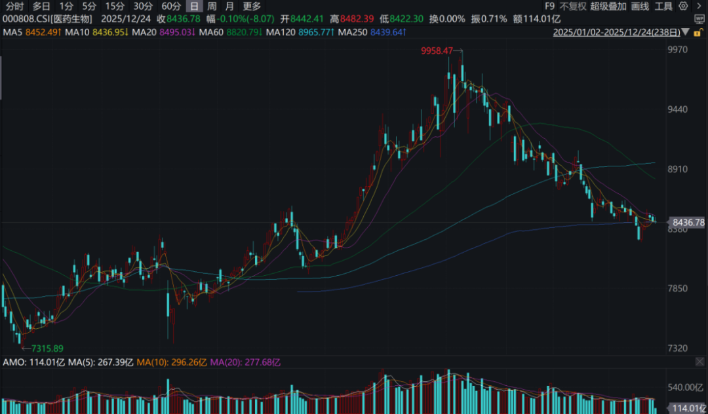
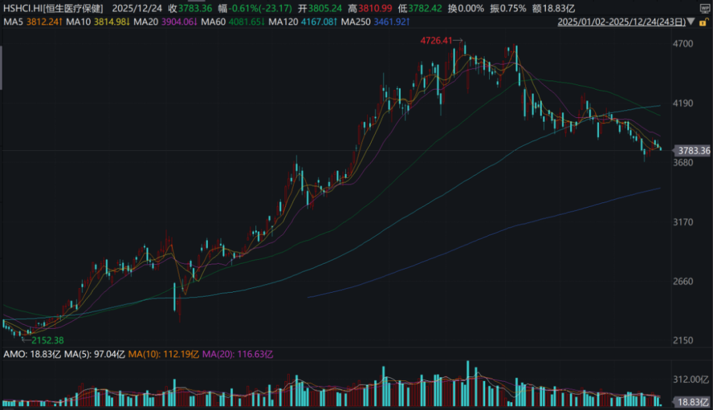
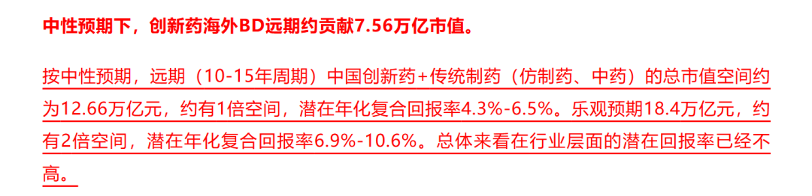

# 创新药投资困难的事

大家好，我是龙哥。

创新药从9月以来表现就比较平淡，自9月高位以来，申万医药行业指数累计回调了15%，恒生医疗保健指数累计回调了20%，AH股的创新药指数回调幅度与全行业指数接近或者还要略大一些，创新药投资又阶段性进入hard模式。

今年创新药最大的投资逻辑还是跟随新技术方向的创新药出海，如GLP-1减重药、ADC、双抗/多抗、小核酸等技术领域，以及传统的小分子和单抗，均有一系列重磅药物实现海外授权，包括近期也有多个不错的BD交易落地，但行业以及公司的股价表现就始终差强人意，这点我们在11月的文章《[时来天地皆同力，运去英雄不自由](https://mp.weixin.qq.com/s?__biz=MzkyMzQ3MDc3Mw==&mid=2247485218&idx=1&sn=39925301800ea61fe2312d4e74675777&scene=21#wechat_redirect)》里也有分析，本文我们再具体来谈谈，在创新药如火如荼的进行出海之际，行业阶段性回调幅度较大，创新药行业投资面临哪些困难的问题。

提出问题不是说产业发展趋势有哪些变化，对产业趋势我们还是非常积极乐观的看待，只是想聊聊行业二级投资中的一些问题、对行业投资决策的影响，是我们想看到行业更长期、更良性的发展。

1、信任问题

老读者都知道龙哥以前写过几篇《医药行业离谱事件》，这快一年没写这个系列了，也是因为行业总体的信心慢慢起来了，也挺不容易，尽量不去打击大家对行业的信心。但不写不代表没有，实际上这半年行情好了之后，大家可能看到了比前两年更多的妖魔鬼怪、更多的离谱骚操作。

创新药公司的投资，是一个典型的投资新技术和未来的领域，很多时候一个创新药公司就是拿着一张PPT出来融资，这个需要投资人和公司之间存在非常高的信任度，毕竟PPT内容可以具有很强的误导性，临床前和临床数据也不是没有过造假，即便不是造假，也可以通过各种方式进行数据的美化，因此，我们医药投资人朴素的认知，还是认为管理层的道德水平在创新药行业的投资中是非常重要的考量因素。

今年以来，很多公司以不是很好的方式去对外发布公告、对外交流，一家两家也就罢了，到后来行业隐隐呈现“劣币驱逐良币”的趋势，老实巴交的公司可能无人问津，主动迎合市场炒作、瞎吹牛的公司可以股价大涨，叠加有些投资人写小段子、编造虚假信息。

呈现给投资人的就是其中一部分创新药公司，越是曾经讲的故事够大、光环够多，却是miss的越狠、跌的越惨，这其中有少部分为了炒股票不择手段的上市公司的问题，也有少部分为了自己持仓股票上涨而编造小作文的投资人的问题，虽说可能是少数，但在创新药这种需要高度互信的行业，有几个老鼠屎就足以坏了一锅粥，足以摧毁很多投资人对创新药公司的信任和对创新药行业投资的信心。

2、内幕消息泄露问题

复盘这几年的BD交易、BD交易后的股价表现，少部分是BD交易后短期能出现股价大涨的，相当一部分是BD交易落地后容易是短期高点，核心原因还是国内大部分的创新药公司的潜在BD交易都被充分研究、充分调研，有些主观上的、有些客观上的信息泄露，使得BD落地前已经有不少资金埋伏在里面，一旦BD交易落地就是利好兑现，呈现出来的就是BD利好出来股价反而是不涨反跌的，这种情况出现的多了，自然而然也会打击投资人对创新药行业的信心。

这几个月我们的文章也一直想要引导大家更加理性的看到BD授权这种事件性催化的落地和短期股价交易，希望大家可以更理性的分析长期的产业趋势、分析项目本身的价值和BD交易对公司的实质影响到底如何，但“时来天地皆同力，运去英雄不自由”，整个市场的投资风格绝非是我们一个小小的公众号能影响的。

相比于研究创新药的技术趋势、竞争格局、临床数据而言，打听BD授权落地的时间、金额相对容易得多，但这种打听内幕消息、蹲BD落地的模式逐渐失灵之后，市场也会教育后续的创新药投资人更加深度的理解BD出海的长期价值。

3、投资框架问题

创新药海外BD授权，各位读者经常看到一个项目授权金额一二十亿乃至数十亿美元，对于BD交易如何估值，就连我们这样相对比较专业的医药投资人也不是个容易的事情，我们也要具体项目具体分析，大致根据临床数据、全球竞争格局来拍模型、测算市场潜力和审慎的给估值。

但是今年BD项目越来越多，这种创新药出海的密集落地和行业逻辑的宏大叙事，也吸引了很多非创新药、非医药投资人来投创新药，此时就需要一个简单粗暴的估值方式来告诉这些投资人BD交易的“价值”，于是诞生了一种估值方法叫“BD交易总交易对价1倍PS估值”。

稍微熟悉创新药BD交易的投资人都知道这种估值方法可能会错的有多离谱，因为除了真金白银给到的首付款以外（首付款也可以和“近期里程碑付款”叠加），里程碑付款是可以被大幅放大的——只要企业有想法通过这种方式来夸大BD交易的规模，例如一个药的研发里程碑付款可以包括10个、20个潜在适应症的里程碑，一个药的商业化里程碑更是可以按不切实际的潜在销售规模去外推，例如达到50亿、100亿、200亿美元销售额的销售里程碑，但实际能卖几亿美金都费劲，一个药实在是不够大，还可以3个药、5个药放在一个总包，还可以授权技术平台进行N个分子的药物发现作为一个总包，总之交易总包你要多大有多大，在这种情况下别说按照交易总包金额的1倍PS估值，打个2折3折可能都还是贵。

于是我们看到海外的BD交易有时会出现首付款占比超过50%的情况，并购和BD交易的总金额会比较大，而国内的BD交易大部分首付款占比超过10%都费劲，我们统计的190个有披露交易金额结构的中国创新药出海项目中，只有49个项目的首付款占比超过10%，这还是包含了几个并购项目的情况下，比例只有大概四分之一。

以上涉及的本质上是对创新药投资框架和估值体系的问题，其基本盘如此的不牢靠，涨的时候有些公司可以涨到我们也不能理解，稍有风吹草动又是一哄而散。

4、流动性问题

一二级市场融资的问题是我们老生常谈的问题，我们此前统计的数据来看，今年港股市场创新药及产业链在二级市场融资+重要股东大宗交易减持规模超过800亿人民币，这是切实“沉没”到资本市场中的流动性，更不用说还有大量的统计不到的减持，港股市场也呈现出这种“一放就乱、一收就死”的状态，前两年行情不好的时候IPO和配股增发是难如登天，现在行情好了IPO和配股一拥而上，资金不够用了。

......

以上问题，我们医药投资人也很无奈，资本市场的发展成熟也有其客观规律，我们投资人只能适应市场环境。

但我们还是要强调，以上种种资本市场的问题，都挡不住创新药及产业链大步向前的发展，行业的基本盘在切切实实的往上抬升，不少中国创新药公司在新技术、新靶点上展现了非常强的全球竞争力，只要创新药海外研发和商业化陆续推进、国内商业化规模快速增长，创新药行业及产业链还是会具有比较强的α，行业未来必然还是充满投资机会。

相比于9月我们测算行业有限的估值和市值空间（[创新药宏大叙事，行业估值处于什么水平？](https://mp.weixin.qq.com/s?__biz=MzkyMzQ3MDc3Mw==&mid=2247484956&idx=1&sn=015c13dab5e66b4a6ca8d66ff8791921&scene=21#wechat_redirect)）：

经过行业性的回调后，创新药投资人应该更多一些信心。

风险提示：本文仅讨论行业/公司经营情况，投资需综合考虑公司经营、估值、管理层等多方面因素，建议读者审慎参考，本文不作为投资依据，不建议大家根据本文做出投资计划。

<!-- wxmp-comments-begin -->

---

## 留言（20 条，含回复共 39 条）

- **Lok.cn** 👍15 · 2025-12-24 18:08
  感谢一直相随：客观、理性、睿智[强][强][强]
  - ↳ **作者** · 2025-12-24 18:38
    [抱拳]老读者的认可
- **木子先森** 👍6 · 2025-12-24 18:18
  创新药的估值太难了，一般人根本搞不定。港股的流通性真的让人无语，合联800亿市值的公司，几千万的卖盘能把股价砸下去3-5个点。说归说，闹归闹，星辰大海还是会有的。[破涕为笑][破涕为笑][破涕为笑]
- **团团不是猴** 👍2 · 2025-12-24 18:32
  那港股创新药etf的定投是不是可以调仓到其他板块了？
  - ↳ **作者** · 2025-12-24 18:37
    不应该是回调之后增加定投、行业高位回报率偏低的时候减少定投吗
- **zhaowz** 👍2 · 2025-12-24 18:33
  意思是，创新药的未来增长空间并没有前面预期的那么大了吗？
  - ↳ **作者** · 2025-12-24 18:36
    9月那个位置看确实是潜在回报率比较低了，行业回调之后还是可以的，有行业长期逻辑和能看几年高增长的行业并不多。
- **喻力** 👍1 · 2025-12-24 17:43
  作为今年启动的大主线，回调4个月是没有想到的。目前资金都不关注创新药
  - ↳ **作者** · 2025-12-24 18:42
    全行业资金也是在全市场选择最优标的，今年AI和有色太强，对创新药也是很大的抽流动性。
- **鲲鹏** 👍1 · 2025-12-24 17:54
  龙哥说说可怜的医疗器械吧，出海票也是一点没咋涨，现在都是商业航天，能源半导体概念飞
  - ↳ **作者** · 2025-12-24 18:40
    创新药产业，出海的起飞是在2023年，但股价企稳在24年底和25年。创新器械出海，我们前阵子也单独讲了一篇，明年公司会更多，行业公司越来越多、就会有越来越多投资人逐渐认可器械行业出海的逻辑。
- **灵感自在** 👍1 · 2025-12-24 18:01
  龙哥，小核酸这块你觉得国内哪几个走的比较前面？cdmo是不是也比较受益于这个趋势
  - ↳ **作者** · 2025-12-24 18:38
    CDMO是受益，但小核酸的用量比较少，生产门槛没那么高，产业上应该远不如ADC和GLP-1多肽
- **风火不离** 👍1 · 2025-12-24 18:15
  创新药是不是快挂了
  - ↳ **作者** · 2025-12-24 18:37
    创新药行业挂不了，而且发展的很好，创新药投机客是有一些快挂了
- **JMTerry** 👍1 · 2025-12-24 18:48
  龙哥今年的输出量惊人
  - ↳ **作者** · 2025-12-25 09:06
    快到年底总结咯
- **海蓝啸** 👍1 · 2025-12-24 19:31
  爱博医疗，欧普康视这种也有出海的逻辑吗
  - ↳ **作者** · 2025-12-24 20:30
    爱博讲出海讲了两三年了，进展有点低于预期。
- **知行** 👍1 · 2025-12-24 21:31
  龙哥，医疗器械主要聚焦哪些细分领域公司啊？
  - ↳ **作者** · 2025-12-24 22:04
    前阵子写了一篇创新器械出海的文章，参考
- **Zg** 👍1 · 2025-12-24 23:41
  翰思上市破发46%，听说医药投资界因为这个已经吵疯了是么？
  - ↳ **作者** · 2025-12-24 23:57
    医药投资界觉得很正常啊，为啥会吵[破涕为笑]
- **ANYTHING** 👍1 · 2025-12-25 09:09
  2026cro业绩会不会体现出？今年上了不少创新药公司IPO和融资。
  - ↳ **作者** · 2025-12-25 09:31
    会啊，CRO在25年已经有一些开始在毛利率上有所企稳了，26年会改善的更多。
- **王建** · 2025-12-24 18:41
  只有α，没有β吗？
  - ↳ **作者** · 2025-12-25 09:07
    创新药行业在整个医药行业里不就属于α，你不可能指望整个医药行业有β吧，全国的医疗总费用这两年还是下滑的，门诊诊疗量也是持平或者略微增长，这种情况下咋可能有全行业的β。
- **田野** · 2025-12-24 18:41
  BD交易总交易对价1倍PS估值——按照这个逻辑应该按手买和铂医药！
  - ↳ **作者** · 2025-12-25 09:06
    哈哈
- **萤火虫** · 2025-12-24 19:31
  信达生物未来如何
  - ↳ **作者** · 2025-12-25 09:05
    信达还是很好的，26年主要看IBI-363海外推临床的情况，国内就看看玛仕度肽商业化的情况，公司后续的储备管线也很充沛。
- **肥锋  家诚哥** · 2025-12-24 20:19
  这几年的跟随，感受到龙哥的变化
  - ↳ **作者** · 2025-12-24 20:28
    展开讲讲，什么变化[破涕为笑]
- **流枫** · 2025-12-24 20:26
  目前重仓诺诚健华。高人指点下 这只股如何。跟踪几年下来 管理层的指引还是靠谱的
  - ↳ **作者** · 2025-12-24 20:29
    高人不至于啊。
    诺诚是我去年以来一直还比较喜欢的biopharma，销售、研发都还算比较踏实，可能不是那种宏大叙事的大故事。
- **邱益宏** · 2025-12-24 22:12
  龙大指点一云顶新耀后续怎样，已经连调5个多月了，还值不值得持有？拜托了
  - ↳ **作者** · 2025-12-25 09:03
    云顶新耀之前市场预期过高的时候都不太敢点评，现在跌下来了可以稍微说说，公司还是引进了几个好的产品的，至少到目前来说耐赋康的商业化也算是做的比较成功的，后续后期和商业化管线也还比较充实，还是可以看的一家biopharma，当然，公司每次给的指引还是会显得比较乐观，兑现也要一步步的跟着看。
- **墨** · 2025-12-25 06:47
  龙哥，再鼎凯捷乐获得批准咋看？
  - ↳ **作者** · 2025-12-25 09:00
    再鼎今年为数不多的好消息，KarXT作为一款慢病药只审评了11个月就获批上市，速度还是很快的，药监应该也是比较认可这款药的临床价值的。

<!-- wxmp-comments-end -->
