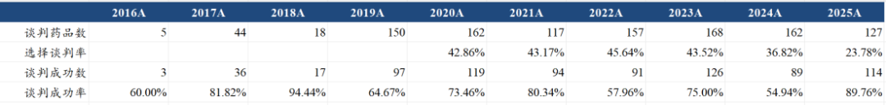

# 创新药支付体系破局

大家好，我是龙哥。

在今年12月上旬，国家医保局正式发布2025年国家基本医保目录和首版商保创新药目录。基本医保目录有114种药品谈判成功纳入医保支付范围，其中包含50种1类创新药，首设的商保创新药目录在医保目录之外，通过价格协商纳入了19种临床价值突出但超出医保支付能力的创新药。

这是国家医保局成立以来，首次在创新药领域拓展商保支付渠道，也是首次建立起医保与商保的双轨并行机制，医保支付体系进入“国家基本医保保基本，商保补高端”的新阶段。

1、“保基本”到“促创新”的变革

我国医保目录的演进可以大致划分为三个阶段：

第一阶段是2000年之前，我国尚未建立统一的全国医保目录，直至2000年首版医保目录发布，该目录以“广覆盖、保基本”为核心目标，初步搭起国家医保用药保障框架。

第二阶段是2000-2018年，医保目录调整节奏较慢，仅在2004、2009、2017年进行过三次更新，许多新药无法及时纳入医保，影响患者用药可及性与产业投资回报。

第三阶段始于2018年国家医保局成立，医保目录年度动态调整机制逐步建立，定位也从“广覆盖、保基本”加快迈向“精准保障、鼓励创新”，新药从获批上市到进入目录的周期整体压缩约80%，准入速度显著加快。

在我们所谓的第三阶段，也可以进一步分为两个小的阶段，在2018-2022年国家医保考虑的更多是“公平”、“广泛覆盖”、“基本保障”，而自2022年底（我们这几年一直强调的国内创新药政策拐点）以来，国家医保则是明确转向“基本保障+创新支持”的双轮驱动。

一方面，国家医保局数据显示，当前基本医保参保率稳定在95%以上，医保体系“保基本”功能已得到较好落实；另一方面，据Pharmaprojects数据，2025年，中国药企研发管线在全球的占比较2017年提升逾两倍，全球每三款在研新药中就有一款来自中国企业，在24年全球新增创新药管线中，中国占比更是达到45%。

创新药产业发展也离不开国内市场的政策支持，日本国内创新药市场的重重受限，很大程度上导致日本创新药企哪怕拼命在欧美市场做出海，总体日本创新药企的研发管线占全球的比例也呈现“断崖式下降”，从上世纪80-90年代的最高24%，到现在的5.5%。因此，出海固然重要，国内政策环境也同样不可忽视，是创新药产业的“基本盘”。

2、医保商保“双目录”发布

本次医保目录调整的最大亮点，是首次建立基本医保与商业健康保险协同运作的“双轨制”分层保障体系，实现对不同临床价值、不同价格水平药品更为精准的覆盖。

过去国家基本医保目录虽然目标是“保基本”，但同时又背负着在有限的资金下进行“支持创新”的产业责任，一边是要全力省钱应对未来的人口年龄结构变化，另一边是要以相对较高的价格去支付创新药，医保基金需要承担的责任太多，尤其是涉及到上万亿的资金支付方向。对于真正具有全球领先创新属性和临床价值的新药，基本医保经常会出现想支付但心有余而力不足的问题。

2025年的医保谈判，国家基本医保目录继续围绕“保基本为主、兼顾支持创新”展开，本次创新药谈判的成功率达88%，创下历史新高，意味着每10个参与谈判的品种约有9个被纳入医保目录；医保目录对创新药的支持力度也显著提升，今年新增的114种药品中，1类创新药占据50席，为历年最多。从时间维度看，创新药从获批上市到纳入目录的平均周期已从原来的5年以上大幅缩短至1到2年，约八成创新药能在上市两年内纳入医保目录，商业化进程显著提速。

同时商保创新药目录则侧重于“补高端”，在基本医保目录之外，有选择地纳入19种临床价值突出但超出医保支付能力的创新药，包括CAR-T疗法等前沿治疗方案，虽然目前商保目录的品种少、商保公司重视程度也还很低，但正如我们此前讲到的，2016年国家医保谈判的“前身”只有5个药品进行价格谈判、3个药品新纳入医保，或许也很少人预想到今天的创新药国谈盛况。

商保目录的推出，进一步打通了高创新性、高临床价值、高价创新药从实验室走向临床患者的“最后一公里”，在提升患者用药可及性的同时，有望提升企业研发更前沿的创新药的信心，推动企业将更多资源投入研发，从而助力医药产业创新形成良性循环，也可以很大程度上缓解国家基本医保“什么都得管”的压力。

由此，随着“医保+商保”多层支付体系开始建立，创新药商业化又增添一条新路径。

此前我们讲过ETF跟踪的指数中首批“纯度”达100%的港股创新药指数——恒生港股通创新药指数，精准汇聚港股创新药领军企业，另外也有读者问到A股的创新药指数，像中证创新药产业指数则是聚焦A股创新药赛道，由不超过50家主营业务涵盖创新药研发的龙头公司组成，集中反映A股创新药产业的代表性力量。

目前，市场上有恒生创新药ETF（159316，联接基金A/C：024328/024329）和创新药ETF易方达（516080，联接基金A/C：019666/019667）等产品分别跟踪恒生港股通创新药指数与中证创新药产业指数，前者我们7月的文章介绍过，后者是目前所有医药行业ETF中为数不多的综合费率仅有0.2%的产品（大部分ETF的管理费+托管费合计在0.6%左右）。

风险提示：本文仅讨论行业/公司经营情况，投资需综合考虑公司经营、估值、管理层等多方面因素，建议读者审慎参考，本文不作为投资依据，不建议大家根据本文做出投资计划。

<!-- wxmp-comments-begin -->

---

## 留言（8 条，含回复共 17 条）

- **zhz** 👍2 · 2025-12-29 16:15
  微创机器人今天很生猛
  - ↳ **作者** · 2025-12-29 16:22
    微创机器人海外订单超预期，出海做的不错的器械公司还是值得重视的，参照我前阵子12月2号那篇创新器械出海先锋的文章
- **光头的复利人生** 👍2 · 2025-12-29 16:16
  云顶今天一己之力……
  - ↳ **作者** · 2025-12-29 16:25
    云顶这个就是典型的，个人投资者聚集且被KOC引领的公司，一旦有一些消息风吹草动，就成这样了，看似已经是被充分研究、充分预期和挖掘的公司，实际上很多个人投资者只会听最简单的口号。
- **Jackie 余洵** 👍2 · 2025-12-29 16:16
  龙叔，这对创新药股价是好还是坏？
  - ↳ **作者** · 2025-12-29 16:23
    你首先，怎么能叫叔呢。。。。
    产业角度我觉得肯定是好事，医保支付方的变革历史上都是对医疗行业有巨大影响的最核心因素。
  - ↳ **作者** · 2025-12-29 16:27
    阿哈哈哈哈龙字一听就是大哥[旺柴]
- **雨化心声** 👍2 · 2025-12-29 16:37
  300医药，都回到2020年了，什么创新药，创新转型成功的都在周期中被各种政策和情况，绞杀殆尽，创新药也是穷途末路，
  - ↳ **作者** · 2025-12-29 16:42
    现实是，创新药从一二级市场融资、国内商业化、出海都在蓬勃向上。
    不得不说，2025年还能看到这种观点，还是挺令人震惊的，也不知道是完全不看市场、只看几周的行情，还是只看自己买的个别不太行的股票。
- **汪金贵～行胜于言** 👍1 · 2025-12-29 16:26
  创新药天天跌，PB太高，什么时候能进入？
  - ↳ **作者** · 2025-12-29 16:28
    其实吧，要是你觉得创新药PB太高，我首先建议先别考虑啥时候入的问题，得先研究下创新药是啥、商业模式咋样、估值体系咋样。
- **来去自如** 👍1 · 2025-12-29 16:47
  信立泰不堪一击啊!这是对政策的不同解读还是某钛小作文的影响？
  - ↳ **作者** · 2025-12-29 16:49
    市场上经常会有一些公司，涨的时候我也不太能理解估值到那么高，跌的时候也不太清楚为什么暴跌，但这类公司我尽量也不去公开说看空他，在我能力圈之外的公司，也尽量不去耽误别人赚钱。信立泰就属于这类公司。
- **Rita .Z** 👍1 · 2025-12-29 17:07
  三生制药还有救吗？[流泪]
  - ↳ **作者** · 2025-12-29 17:09
    三生要看看明年辉瑞推的临床进展啦，今年一次把市值透支掉了，跟着行业回调一些似乎也正常，况且公司还是忍不住搞资本运作，又是分拆又是配股的。
- **刘虎** · 2025-12-29 16:44
  龙哥，cxo最近股价较强势，是4季度新签订单超预期？
  - ↳ **作者** · 2025-12-29 16:45
    CRO主要就是提前反映我们之前说的订单价格回升、订单量回升、毛利率修复、盈利修复这些逻辑吧，尤其临床CRO的订单周期更长，量价的修复可能会滞后反映，临床CRO今年确实涨的也不多。

<!-- wxmp-comments-end -->
