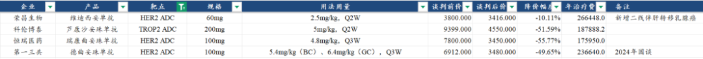
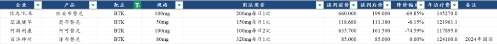
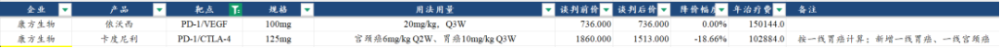
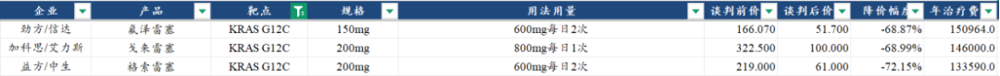
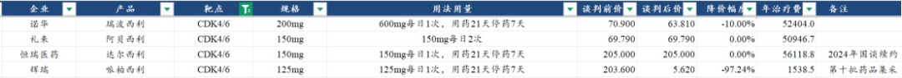
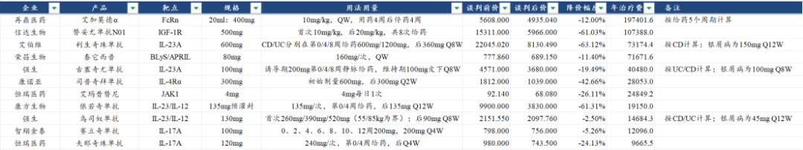
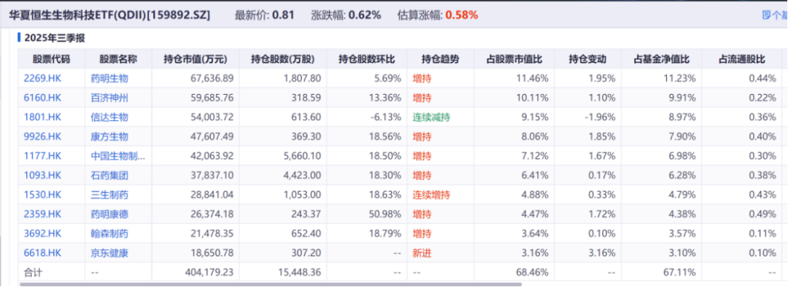
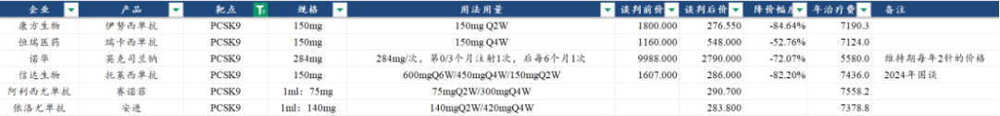
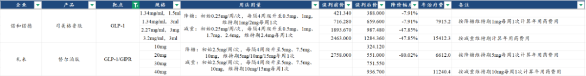
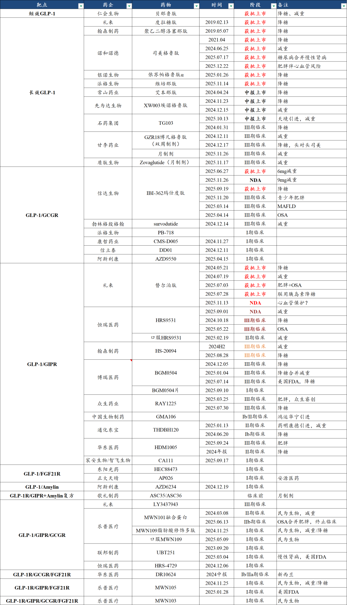

# 史上最精彩创新药价格谈判

大家好，我是龙哥。

2026新年第一篇，刚好昨天开门红，创新药板块大反弹，先祝大家新年快乐、账户长虹~

元旦之后，25年创新药国谈的价格情况陆续得以披露出来，由此我们也可以看看25年国谈的具体情况，此前我们大致讲过25年国谈总体的降价情况[一年一度，创新药最重要的事](https://mp.weixin.qq.com/s?__biz=MzkyMzQ3MDc3Mw==&mid=2247485292&idx=1&sn=08556c858af26754ced3d852f1c5a64c&scene=21#wechat_redirect)，但实际还要就具体品种去看。

昨天梳理完之后，最直接的感受就是，25年应该算是史上最“精彩”的一次创新药价格谈判，既包括ADC、IO双抗等创新肿瘤疗法、KRAS G12C等小分子靶向新药，也有一系列的自免国产新药密集进入医保，还有司美和替尔泊肽等降糖减重领域全球药王降价到大伙目瞪口呆，以及能看到小核酸药物对传统单抗药物的降维打击。

这种国内创新药行业的百花齐放，在医保谈判中的竞技，还是让医药投资人颇有感触的，港股创新药资产——如我们老生常谈的159892恒生医药ETF——依然是不错的中长期可选投资方向。

下面我们按疾病领域聊聊今年医保谈判中比较可圈可点的靶点和药物。（2025年底的文章赞赏过任意金额的小伙伴，可免费赠送本文整理的2024-2025年重点品种医保谈判价格数据，如有需要可后台私信留下邮箱）

1、抗肿瘤药物

ADC药物在2025年有多个品种参加国谈，其中就包括市场关注度最高的科伦博泰的SKB264（TROP2-ADC），以及恒瑞的瑞康曲妥珠单抗（首个国产TOP1i毒素的HER2-ADC）。SKB264按5mg/kg Q2W的剂量计算本次医保谈判价格对应的年用药费用约为18.8万元，恒瑞的瑞康曲妥珠单抗按4.8mg/kg Q3W的剂量计算年用药费用约为17.6万元。

（除特殊备注外，以下所称年用药费用均为假设用药满1年的费用，实际患者用药成本需要根据用药时长做调整，部分肿瘤药用药时长不足1年）

ADC药物的定价在所有肿瘤药中，是处于最靠前的位置，一方面是ADC药物目前属于创新属性比较强的领域，医保定价上还是给了一些倾斜，另一方面是目前获批的ADC药物还比较少、获批的适应症主要还是小适应症，因此医保目前尚且能接受比较高的价格，年用药费用定价普遍在2倍人均GDP以上，预计未来随着上市品种增加、大适应症陆续获批，价格区间可能会回到1-2倍人均GDP的范围。

血液瘤最大的靶点BTK，国内外的主要药物都已经纳入医保，其中礼来/信达的第三代BTK抑制剂匹妥布替尼和阿斯利康的阿卡替尼都是25年新进医保，奥布替尼是今年续约谈判降价6%，百济的泽布是24年谈判的品种，泽布和奥布的年用药费用在12万+，阿斯利康的阿卡替尼今年率先把价格降到12万以下的11.8万，礼来的定价则是目前最高的，达到14.5万。

血液瘤领域的竞品也在增加，昨晚百济的Bcl-2抑制剂索托克拉刚刚获批R/R MCL和R/R CLL/SLL两个适应症，去年7月亚盛医药的Bcl-2抑制剂也已经获批R/R CLL/SLL适应症，这两个品种预计会在26年底的国谈中纳入医保。百济、诺诚、亚盛等国内血液瘤头部企业也需要不断迭代自身。

康方生物的两款IO双抗都是在2024年纳入国家医保目录，25年的医保谈判情况来看，卡度尼利降价18.7%，年用药费用降至10.3万元（按一线胃癌10mg/kg Q3W剂量计算），新增纳入了一线胃癌和一线宫颈癌两个大适应症，IO基石疗法纳入一线大适应症后，还是能感受到医保的降价压力。

今年3款国产的KRAS G12C抑制剂均纳入国家医保目录，在KTAS G12C靶点上，国产厂商以注册II期申报上市的方式实现对安进和BMS/Mirati两家跨国MNC实现反超，后二者基本放弃国内市场（Mirati合作方再鼎放弃）。三家公司的谈判价格也相对接近，在13.4万-15.1万的年用药费用之间，考虑PFS在8-9个月左右，患者平均的实际年用药费用在10-11万左右。

乳腺癌领域的大药CDK4/6在国内的价格竞争也进入白热化，辉瑞的哌柏西利已经专利到期被纳入集采大幅降价，用药成本已经非常低；国产品牌恒瑞医药的哌柏西利以及两家MNC公司的瑞波西利、阿贝西利年用药费用都在5万多，CDK4/6已经成为仅略高于PD-1/PD-L1（目前年用药费用3万左右）的肿瘤药大靶点。

2、自免药物领域

自免药物领域今年有多款国产新药成功纳入医保，包括国产首款IL-4Rα单抗——康诺亚的司普奇拜单抗，国产首个JAK1抑制剂——恒瑞的艾玛昔替尼，国产首2个IL-17A单抗——恒瑞夫那奇珠单抗和智翔金泰的赛立奇单抗，以及国产首个IL-23/IL-12单抗——康方生物的依若奇单抗。

自免领域这一批重磅靶点，大部分国产首发产品齐聚25年国谈。

具体品种来看：

首先特应性皮炎领域两个核心靶点JAK1和IL-4Rα，康诺亚的IL-4Rα也是选择了比较大幅度的降价以与Dupi竞争，年用药费用降至2.8万元，只有Dupi去年国谈价格的7折左右，恒瑞的艾玛昔替尼则还是相对克制，年用药费用2.48万元，与艾伯维的乌帕替尼24年的定价较为接近。

我们都知道2025年康诺亚的IL-4Rα商业化销售还是遇到一些困难，在没有医保的情况下与有医保的MNC赛诺菲竞争的难度还是很大的，这还是在康诺亚有独家的过敏性鼻炎适应症的情况下，因此康诺亚大幅降价纳入医保后，26年是观察其商业化放量的关键年，在中国的国情下（患者群体庞大、支付能力稍差），做这类皮肤科自免药物，以价换量并不失为一个好的策略，诺华的可善挺在银屑病领域的卓越商业化表现已经验证。

银屑病领域，IL-17A的年用药费用在2万左右，恒瑞医药首家定价击穿2万，年用药费用约为1.93万元，该领域诺华已经做的比较成熟，恒瑞要靠给药便利性和较低的价格来硬生生的切下一块市场。

高价品种的续约谈判方面，再鼎医药的艾加莫德降价12%，荣昌生物的泰它西普降价11.4%。

以上肿瘤和自免领域的新药、涉及的公司、涉及的技术领域和获益的CDMO公司，大部分都在我们一直讲的159892恒生医药ETF的持仓中。

从25年初开始就有不少读者表示应该精选创新药α、行业没有β，且不说去年有多少投资人能跑赢ETF，我们精选α的前提也是在一个有β的行业里去精选α，如果你认为行业指数会很差（意味着行业龙头都不行），那如何相信行业里会有很多优质的α可选？指数投资天然具有去弱留强的特点，从而可以纠正散户投资时最差的交易习惯“去强留弱”（卖掉兑现赚钱的持仓、持有并连续补仓亏钱的）。

3、代谢领域药物

心血管领域，降脂重磅靶点PSCK9迎来颠覆者进入医保，去年诺华的英克司兰未选择进医保，定价为9988元/针，除了第0、第3个月各注射1针外，后续维持期只需要每半年注射1针，维持期年用药费用2万元，当时国产信达生物每2周给药一次的PCSK9单抗定价是4万的年用药费用，24年信达托莱西单抗纳入医保降至7400的年用药费用。

2025年，行业竞争加剧，恒瑞、康方、君实3家的PCSK9均陆续获批和在25年底纳入医保，这时候诺华直接放大招，英克司兰降价72%纳入医保，维持期年用药费用降至仅需不到5600元，给药间隔比你长几倍，价格比你还低，MNC打起价格战来足以让素来以内卷著称的国内药企也感到绝望，小核酸药物初步显现对传统大分子药物的降维打击。

GLP-1类药物的价格更加精彩，礼来同样是直接放大招，替尔泊肽降价80%，降糖5mg剂量维持期年用药费用只要6600元，减重10mg剂量维持期年用药费用只要11000元，每个月只需几百块就可以用上全球最顶级的减重药。

听说国内GLP-1单靶点和双靶点竞争激烈、在研管线上百个？礼来：不想玩就都别玩了，我掀桌子了。

留下还在III期临床的一众国产厂家在寒风中凌乱。

GLP-1系列减重药是大家预期国内具有千亿市场潜力的一个方向，此时此刻恰如彼时彼刻的PD-1/L1单抗，曾经对PD-1/L1单抗的国内市场预期也是千亿规模，这种超大规模的市场预期也给了医保局不小的压力，上市没几年就直接把价格杀到3-4万的年用药费用，实际用药费用只有1-2万，到2025年国内PD-1/L1的市场规模（含医保外高价市场）合计在200亿多点，叠加未来几年的增长，可能最终有个300亿的峰值，相较此前的市场预期打3折。

减重药领域，国内双靶点的竞争尚且刚开始，只有礼来的替尔泊肽和信达/礼来的玛仕度肽两个产品，礼来就毅然决然的发动价格战，势在国产品牌还未上市之际就快速抢占市场、奠定品牌先发优势。

......

2025年的医保谈判之精彩，不仅是新兴领域的多个国产新药、大适应症纳入医保，还有看到MNC也积极的参与到国内市场竞争中来，国内市场的创新药竞争已经高度向国际化看齐，MNC不仅能拿出FIC/BIC的药物，还愿意降价抢占市场，对于国产厂商来说也是一个警示，做一些fast follow、me too/me worse药物守着国内这一亩三分地的思路将被彻底打破。

近期重点文章：

[医药行业2026，继往开来](https://mp.weixin.qq.com/s?__biz=MzkyMzQ3MDc3Mw==&mid=2247485469&idx=1&sn=51560c124ea3a20e1624cd73474f43a5&scene=21#wechat_redirect)

[创新药投资困难的事](https://mp.weixin.qq.com/s?__biz=MzkyMzQ3MDc3Mw==&mid=2247485454&idx=1&sn=36c6f31397c2d7f59490f158415c2bcc&scene=21#wechat_redirect)

[创新药出海新征程](https://mp.weixin.qq.com/s?__biz=MzkyMzQ3MDc3Mw==&mid=2247485445&idx=1&sn=6148741052511a28d8d55bf603b7a7ee&scene=21#wechat_redirect)

风险提示：本文仅讨论行业/公司经营情况，投资需综合考虑公司经营、估值、管理层等多方面因素，建议读者审慎参考，本文不作为投资依据，不建议大家根据本文做出投资计划。

<!-- wxmp-comments-begin -->

---

## 留言（12 条，含回复共 22 条）

- **木子先森** 👍8 · 2026-01-06 13:41
  不破不立，有人拿鞭子抽着也好，比我们吐槽没用要强。
  - ↳ **作者** · 2026-01-06 13:43
    能轻松赚钱的温床培育不出来创新的基因
- **王晓洋** 👍6 · 2026-01-06 13:30
  最后一句话真理
- **肥锋  家诚哥** 👍5 · 2026-01-06 14:00
  这几年的药企就是被毒打出来继而创新的。另外问问龙哥，从第一季度看微芯生物是不是可以看到业绩拐点了。祝投资长虹
  - ↳ **作者** · 2026-01-06 14:07
    是的，从2015年以来的10年，就是行业不断改革、不断倒逼企业转型的10年。
    为什么说微芯生物Q1业绩拐点？他季度环比不是稳定向上的吗，西格列他那放量带动的增长，好像也没有什么其他特别的新的驱动力。
- **阿宝** 👍5 · 2026-01-06 14:23
  希望26年能新高吧。去年赚的利润，格局了一下，很多回吐在第四季度了。[捂脸]
- **路威** 👍3 · 2026-01-06 14:01
  龙哥的文章，质量都很高啊[强]用心了
  - ↳ **作者** · 2026-01-06 14:07
    [抱拳][抱拳]
- **yaya** 👍2 · 2026-01-06 13:52
  龙哥，新年快乐！投资长虹！
  - ↳ **作者** · 2026-01-06 13:57
    [太阳][太阳][太阳]
- **求索者** 👍2 · 2026-01-06 14:42
  哈哈哈，连续两年满仓单吊了，2026年才是需要发掘强α的年度，我深度发掘的是维立志博，2026最强α，没有之一，龙哥2026年底记得再把我这条留言亮一下。
- **知行** 👍1 · 2026-01-06 21:16
  礼来这个替尔泊肽降价的确是杀麻了，让整个创新药的估值空间大打折扣。。。。
  - ↳ **作者** · 2026-01-07 09:15
    大打折扣也不至于，创新药出海的部分，减重药实际并不多
- **童岩** 👍1 · 2026-01-07 08:52
  龙哥，所以说未来国内甚至全球都很难有过去那种大规模的单一药品市场了吧？用药量大的会把价格跟pd-1一样杀下去，所以药企比以前更需要储备丰富的管线和加强降本能力了，实际mnc的竞争优势更稳固了。可以这么理解不？
  - ↳ **作者** · 2026-01-07 09:17
    会有啊，实际上像替尔泊肽、自免皮肤科这种，头部企业直接把价格降到大部分患者能用得起的水平一把占据市场，相比坐等竞品上市杀价格，对于未来的总的销量来说不一定是坏事啊，可能龙头企业的集中度更高了。
- **Zg** · 2026-01-06 14:30
  龙哥，26年Ai制药开门红双响炮，Ea­r­e­n­d­il La­bs，英矽智能，总理视察晶泰。26年在Ai药物研发端是不是更有投资机会呢？
  - ↳ **作者** · 2026-01-06 14:32
    你跟踪挺细致的，确实，今年开年就是两个AI制药技术平台的BD交易，英矽智能成功IPO、预计3月进通，今年AI制药这边估计还是会有不少看点的。
- **元平** · 2026-01-06 15:02
  请问龙大，诺诚这次医保谈判，后续销售会放量吗？还有一点，目前公司300多亿市值，估值是否合理，或者后续研发管线什么的，公司还可以预期吗？谢谢
  - ↳ **作者** · 2026-01-06 15:31
    这次医保谈判诺诚的奥布替尼降价6%，应该是把最大的适应症一线CLL/SLL纳入医保了，对26年的销售增长应该是有正面的帮助的。我们看诺诚一般看H股，目前200亿多一点的市值不算贵。后续研发管线方面，公司刚完成了TYK2抑制剂ICP332治疗中重度特应性皮炎的III期患者入组，预计26年底有望完成该III期，27年可以申报NDA。
  - ↳ **作者** · 2026-01-06 16:15
    因为TYK2最快，年底就要申报上市了，其他的还有Bcl-2也开了注册临床，也是值得关注的，包括后续在AML、MDS的临床。其他管线像实体瘤的ADC管线都还在比较早期，没必要这么早给预期。
- **Roger** · 2026-01-06 15:27
  龙哥还坚守的住吗
  - ↳ **作者** · 2026-01-06 15:32
    才刚经历一大波行情，为啥会坚守不住。

<!-- wxmp-comments-end -->
