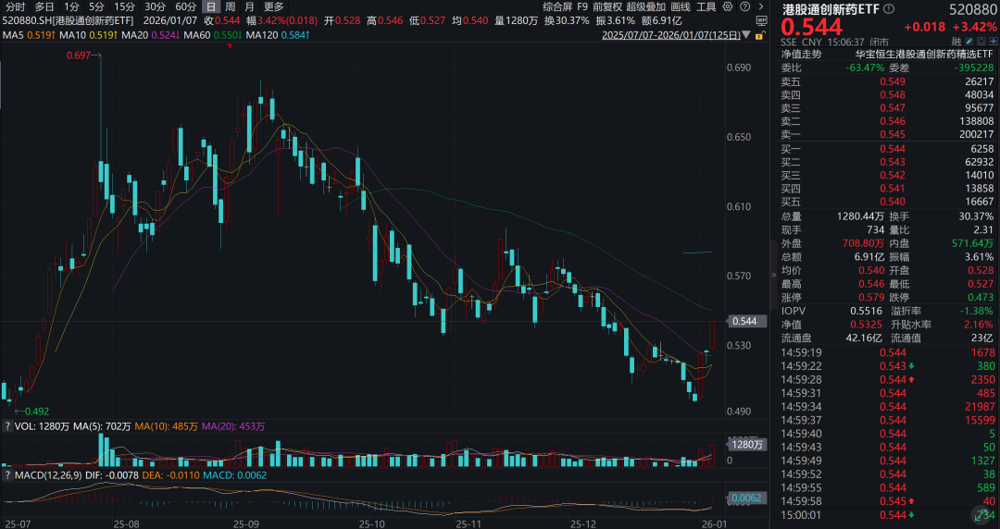
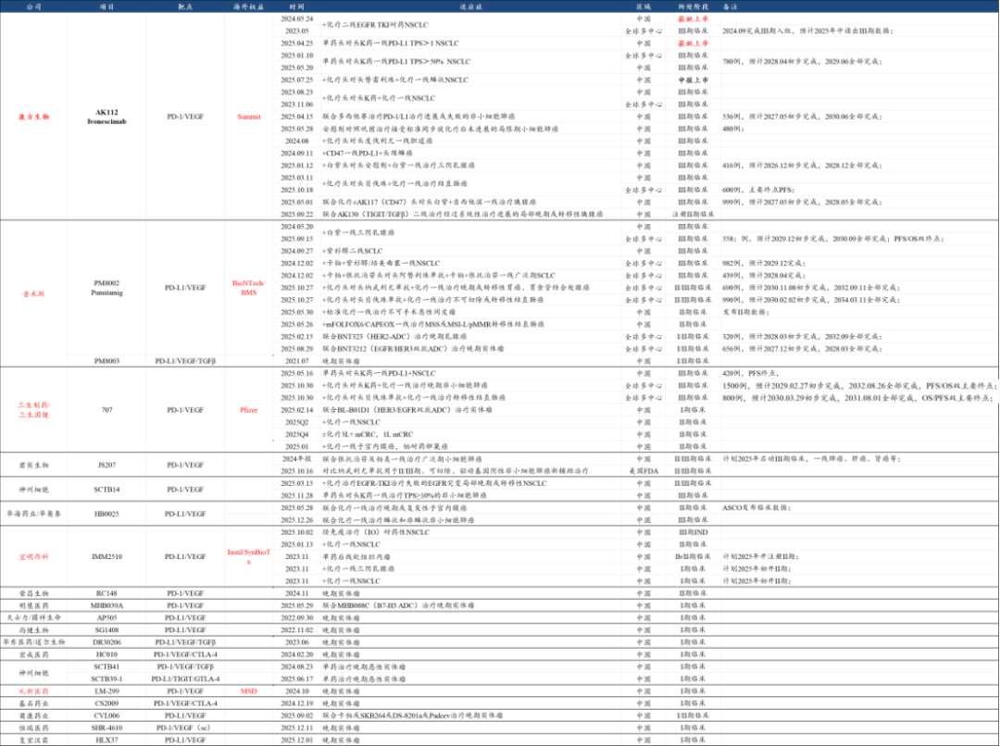
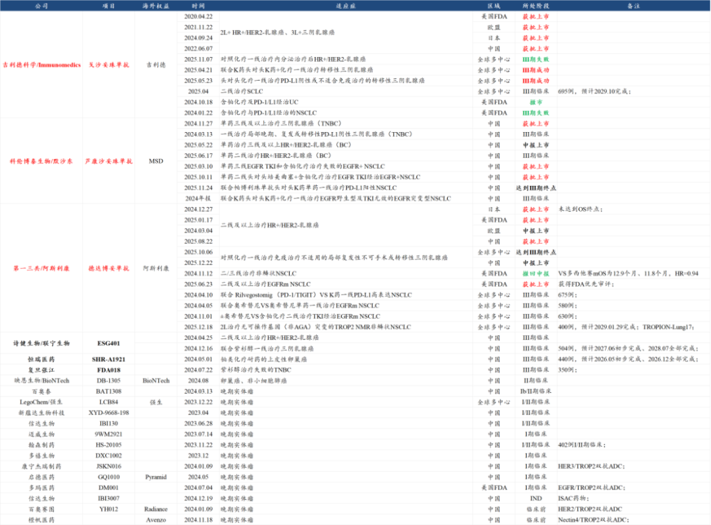
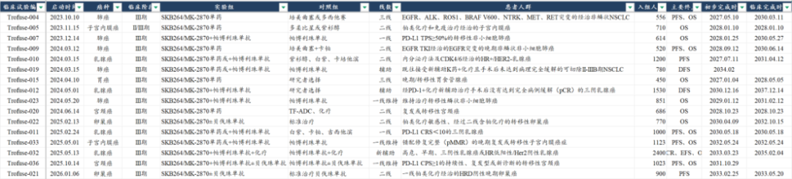
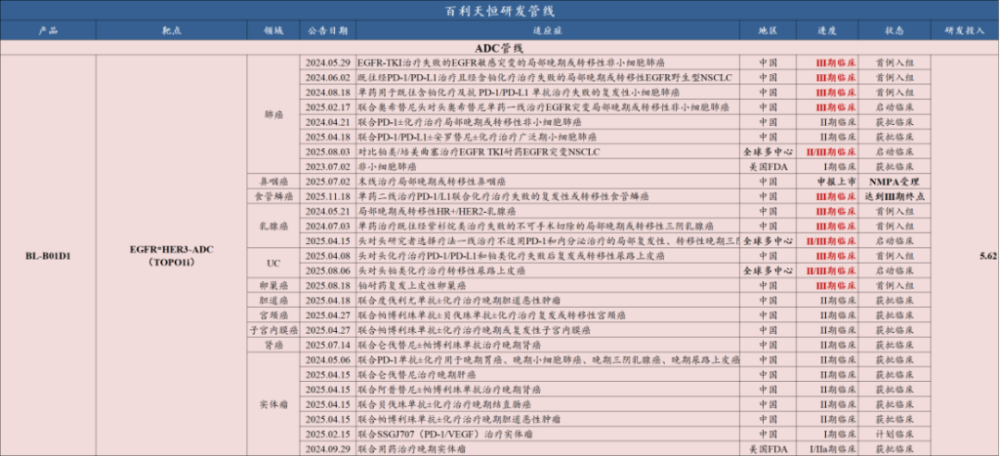

# BD交易之后，创新药下一个爆点

大家好，我是龙哥。

2025年的创新药大行情，总体围绕创新药海外BD交易展开，市场对BD交易的预期从一个极端走向另一个极端——从已经BD出去的要看到比较明确的临床推进才愿意给部分估值，到大多创新药公司的管线都被拉出来用放大镜看一圈、只要有潜力BD出去的就炒一把。

经过25年10月份以来的多个BD交易落地或海外资产被并购后反而股价暴跌的市场表现，3个月的行情、情绪、关注度的退潮，很多A股和H股的小公司股价腰斩，市场情绪趋于理性，创新药行业2026年的驱动逻辑被市场重新理解和认知。

2026年行业靠什么驱动？我们近三个月的文章已经多次讲过，淡化一过性的BD交易，后续要靠实实在在的海外临床推进、海外商业化确定性的提升来驱动，到现在市场对该认知已经逐渐理解，创新药行业β也再次显现，行业龙头和优质二线公司以及此前讲过的创新药持仓比较纯粹的520880港股通创新药ETF都陆续企稳向上。

本文我们来讨论一下2026年海外注册临床会有明确进展的公司，所谓的进展既包括新开全球多中心注册临床，也包括临床数据的读出，我们在此抛砖引玉的列举一部分公司，也欢迎大家的补充。

1、行业影响巨大的两个肿瘤药

首先我们要讲到抗肿瘤领域最重要的两个品种的III期结果，康方生物AK112和科伦博泰SKB264，分别对IO双抗和ADC领域有较大影响。

①康方生物：依沃西单抗（PD-1\*VEGF）

AK112过去两年一系列的临床进展和数据读出，引爆了全球对第二代IO的研发和BD热情，尤其是PD-1/L1\*VEGF为双靶点的IO双抗甚至后续三抗的开发，几乎是国内公司主导，达成了包括康方生物/Summit、BMS/BioNTech/普米斯、三生制药/三生国健/辉瑞、默沙东/礼新医药/中国生物制药等四笔对国内创新药行业有较大影响的BD交易，后续还有君实生物、神州细胞、华海药业、宜明昂科等推进II/III期临床，国内外都有不少公司投入大量资源在这个靶点组合上，该靶点的成败对行业未来几年的发展方向具有极其重要的影响。

康方生物在2026年有望读出3个国内大III期临床的结果，其中包括2个一线肺癌的III期OS结果：

- HARMONI-2依沃西单药头对头K药一线治疗PD-L1 TPS≥1的非小细胞肺癌，2023.08.29完成III期患者入组，2024.05.31达到III期临床PFS终点，2025.04.25该适应症在国内正式获批，有可能在2026年初读出OS结果（有可能在1月的JPM大会）。
- HARMONI-6依沃西+化疗VS替雷利珠单抗（PD-1）+化疗一线治疗鳞状非小细胞肺癌，2025.02.06完成III期患者入组，2025.04.23达到III期临床PFS终点，有可能在2026年中读出OS结果（预计在5-6月的ASCO）。

②科伦博泰：芦康沙妥珠单抗（TROP2-ADC）

SKB264虽然不是国内研发进度最领先的ADC药物，但却是首个国产ADC创新药中可能验证是全球BIC的药物，在科伦博泰之前，吉利德科学和第一三共的TROP2-ADC均在乳腺癌、肺癌、尿路上皮癌等癌种有适应症临床失败。

（下图1中芦康沙妥珠单抗仅列示中国III期临床，MSD开的海外III期在下图2单列）

2025年芦康沙妥珠单抗在国内有2个适应症获批、1个适应症提交上市申请、1个适应症达到III期终点，并新开了一项III期临床，海外方面默沙东在25年新开5项全球III期临床，在昨天又新开一项III期临床，累计开了16项全球III期、计划入组患者人数超过1.5万人。

科伦博泰/MSD在2026年有望读出国内2个大III期临床结果，以及有望读出首个海外III期临床结果：

- SKB264二线治疗HR+/HER2-乳腺癌中国III期临床预计2026年上半年读出注册临床结果，2024年底第一三共宣布其TROP2-ADC德达博妥单抗用于该适应症的全球III期临床未达到OS终点，但仍获得美国FDA、日本和中国CDE的批准。
- SKB264联合K药头对头K药一线治疗PD-L1 TPS≥1%的NSCLC中国III期临床预计2026年读出注册临床结果，如能取得成功，将是IO+ADC治疗肺癌的首个突破性临床，是对IO+ADC逻辑的进一步强化。

- 海外临床方面，芦康沙妥珠单抗在2026年底到2027年初有望读出III期临床结果的是三线胃癌和三线肺癌这两个后线的适应症，虽然这两个适应症可能市场空间没有很大，但也是初步验证芦康沙妥珠单抗在中国以外全球市场成药性，也是比较重要的。

2、2026年行业其他重要海外临床进展

我们列举几家2024-2025年达成重磅BD交易、26年有望看到重要临床推进的公司，这些公司早在24-25年可能短期炒了一把BD交易，但更重要的是后续海外临床推进，从而提升或者进一步验证其出海项目的真实价值。

对于投资来说，一方面是意味着公司的估值底更有保障，从而一定程度上降低股价因行业β和流动性导致的估值巨幅波动，另一方面是对创新药BD交易后的创新药出海长期逻辑的验证。

此外，我们也必须要认识到一个风险点，由于2023-2025年的BD大爆发，像今早的消息宜明昂科PD-L1\*VEGF双抗被海外退货这样的消息，在未来几年只会越来越多，也很好理解，从数量的角度，买的越多、必然失败的越多、退货的越多。

①信达生物：

此前信达生物在IBI-363（PD-1\*IL-2α）海外授权以前已经启动了一项单药治疗IO和含铂化疗经治的鳞状NSCLC的全球III期临床，26年有望在国内外开联合化疗一线治疗NSCLC的III期临床，以及结直肠癌的国内III期临床，后续还会拓展其他实体瘤适应症。短期信达生物国内估值部分可能还是会受到替尔泊肽降价超预期影响。

②映恩生物：

- 此前HER2-ADC延后到2026年下半年递交美国BLA，时间上晚了1年左右，但对项目成功率影响应该不大。
- B7-H3 ADC预计将在2026年启动多项国内外III期临床，包括小细胞肺癌、前列腺癌等核心适应症，并且可能有联合二代IO的部分数据读出。
- 授权给百济的B7-H4 ADC将在26年启动全球III期临床。

总体可以看到映恩生物多个后期和早期品种在26年有重要进展。

③三生制药：

辉瑞在去年已经启动707（PD-1\*VEGF双抗）的一线肺癌、一线结直肠癌两项III期临床，预计26年还将启动多项联合化疗或联合ADC的II期或II/III期临床，对于三生制药来说一系列海外注册临床的开启，也将使得707的海外估值预期逐渐稳定下来。

当然，三生制药近期在资金极其充裕的情况下还进行配股、分拆曼迪等的操作使得部分投资人不满，公司管理层的确是有做资本运作的习惯，但还好总体不太构成对小股东利益的侵害。

④百利天恒：

公司授权给BMS的EGFR\*HER3双抗ADC在2025-2026年将取得一系列的进展，包括数据读出和多个适应症的申报（国内为主），目前其在国内开了10个适应症的大III期临床，BMS也已经在海外启动了3个适应症的II/III期临床（NSCLC、UC、TNBC/HER2 low BC）。

除了目前已经读出III期临床结果的末线鼻咽癌和二线食管鳞癌这两个适应症以外，26年公司还将有多个大适应症的III期结果读出：包括单药二线治疗EGFR野生型NSCLC的III期临床中期分析，二线EGFR TKI经治的EGFR突变NSCLC的III期数据读出，后线SCLC的III期数据读出，后线TNBC和HER2 low BC也有望在26年读出III期结果，2026年还有望读出部分与IO联用的II期数据，并且有望启动与IO联用的多项III期临床，海外BMS也会探索与PD-L1\*VEGF双抗联用。

⑤诺诚健华：

奥布替尼海外开MS的两项III期临床，此前诺诚健华已经开始启动临床，BD授权并移交到Zenas后26年将正式开始患者入组，对应诺诚健华还将获得近期里程碑付款。

Zenas在前几天刚刚公布了CD19抗体治疗IgG4相关疾病的III期结果，虽然对照安慰剂的临床取得成功，但疗效与安进的CD19单抗有较大差距，使得Zenas股价暴跌50%以上，在BD交易中诺诚获得的700万股Zenas股权也大幅减值。Zenas后续是否会把更大的资源和精力投入到奥布替尼自免适应症的开发，也值得关注。

⑥康诺亚：

授权阿斯利康全球权益的Claudin18.2-ADC首个全球III期临床用于治疗二线及以上的Claudin18.2+胃癌预计在26年读出临床结果，这可能是中国对海外授权的ADC药物中首个读出全球III期临床的项目。以Newco方式授权的TSLP\*IL-13，预计26年读出中重度特应性皮炎的国内II期临床结果，海外也将有临床进展。

⑦加科思：

pan KRAS抑制剂近期完成海外BD交易后，预计加科思/阿斯利康26年有可能会启动首个国内和海外针对胰腺癌的注册II期临床，并依然有可能在ASCO读出I期临床数据（具体看AZ计划）。

......

2026年的创新药投资，虽然我们预计大概率不像25年中的AH股那样所有公司鸡犬升天，但有重要临床进展的头部公司和二线公司还是有很多值得关注的，包括一部分港股非通标的和新股会在今年3月和9月陆续纳入港股通，又给了大家更多的投资选择，对于投资指数基金的投资人来说ETF也可以覆盖更多的优质biotech，我们此前文章梳理的4个港股通创新药指数中，跟踪最全、调整最及时的恒生港股通创新药精选指数，跟踪的ETF基金就是港股通创新药ETF（520880）以及联接基金（025221）。

此前的文章已经无数次分析过，这几年都会是创新药行业国内商业化爆发、出海项目密集兑现的行业黄金投资期，后续的文章我们也会给大家进一步梳理总结25年的产业发展状况。看清产业中长期趋势，把握行业估值水位，叠加好的投资工具，方能助力大家在创新药产业浪潮中有所收获，不论是知识还是财富。

风险提示：本文仅讨论行业/公司经营情况，投资需综合考虑公司经营、估值、管理层等多方面因素，建议读者审慎参考，本文不作为投资依据，不建议大家根据本文做出投资计划。

<!-- wxmp-comments-begin -->

---

## 留言（20 条，含回复共 39 条）

- **AO🏅南国高端一手眼镜批发** 👍6 · 2026-01-07 15:57
  荣昌生物今天应该是收获年
- **@黄璞玉@** 👍3 · 2026-01-07 15:48
  请问龙哥，创新器械景气度值得埋伏不
  - ↳ **作者** · 2026-01-07 15:51
    器械板块，出海在进入加速期，越来越多的公司出海收入占比快速提升，可以参照我们前阵子写的创新器械出海先锋的文章。去年中我们认为国内市场器械政策拐点已至，国家也明确了支持的几个创新器械细分方向，像最近炒作的主题脑机接口就是其中之一。总体来说器械今年看起来是比去年要有更多机会的。
- **谢东颖 Donyyy Tse** 👍3 · 2026-01-07 15:51
  26年龙哥回归主场回归c位
  - ↳ **作者** · 2026-01-07 15:54
    借你吉言[加油]
- **和** 👍3 · 2026-01-07 18:30
  恒生医药ETF昨天开始建仓，等了几个月终看见一点点曙光，希望像上半年一样给力。[呲牙][呲牙][呲牙][呲牙][呲牙][呲牙][呲牙]
- **Jackie 余洵** 👍2 · 2026-01-07 15:25
  龙哥，节前重仓创新药-18%受不了割肉了，节后这几天涨的心态崩了，要追吗[流泪]
  - ↳ **作者** · 2026-01-07 15:36
    交易的事，买和卖我都给不了投资建议，这个我很早就说过了，大家每个人的风险承受能力、资金属性、投资风格、对行业的理解都天差地别的，如何能让别人给投资建议呢。
- **hello** 👍1 · 2026-01-07 15:22
  没有亚盛三个美国海外三期差评
  - ↳ **作者** · 2026-01-07 15:31
    亚盛的Bcl-2海外开了1.5线的CLL/SLL、一线的AML和一线的MDS三个III期，不过都已经启动了III期，数据读出的周期还比较久，这里说的主要是26年开III期或者有数据读出的。
  - ↳ **作者** · 2026-01-07 15:39
    是的，奥雷巴替尼联合化疗一线ALL已经在去年底在欧美获批开展III期，估计今年会开出来。
- **霍** 👍1 · 2026-01-07 15:22
  龙老师，再鼎医药那个精神分裂的新药前景如何？
  - ↳ **作者** · 2026-01-07 15:37
    是个有潜力的药，公司给的指引是10亿美金的销售峰值，或者对标以前的精分大药奥氮平，具体还要看公司商业化的情况，毕竟这两年公司商业化兑现确实是差强人意。
- **周文** 👍1 · 2026-01-07 15:28
  那么问题来了，如何看现在的药明系呢[呲牙]
  - ↳ **作者** · 2026-01-07 15:34
    药明系就是去年估值和业绩共振涨的多一些，今年业绩预计还是会很好，震荡消化一下估值依然是好汉。
- **风驰电掣** 👍1 · 2026-01-07 15:33
  龙哥牛啊，高产似.....
  - ↳ **作者** · 2026-01-07 15:34
    其实还有一篇早就要发的内容，明天发[机智]
- **Haley华** 👍1 · 2026-01-07 15:36
  龙哥创新药龙头百济今年落地情况会咋样？谢谢
  - ↳ **作者** · 2026-01-07 15:41
    百济之前都有文章专门解读业绩的，可以翻翻历史文章吧，就不单独说了，百济今年在临床上会启动多个POC新项目的III期临床。
- **兰** 👍1 · 2026-01-07 15:46
  创新药要反转了吗
  - ↳ **作者** · 2026-01-07 15:49
    虽然我们的观点不一定对，但我们认为创新药的政策面反转在2022年底，基本面反转在2024年中，股价反转在2024年四季度，2024年底以来到现在，行业经历了鸡犬升天式的大涨，和后续连续一个季度的大幅回调，总体来说行业表现和产业趋势都是积极向上的，所以反转似乎不适合在这里用，或许可能是回调后的企稳吧。
- **步入森林** 👍1 · 2026-01-07 16:01
  医药研究太难了，看了这么多文章，还是对各种药有多大前景空间搞不清楚。只知道现在中国创新药是在一个厚积薄发的期。
  - ↳ **作者** · 2026-01-07 16:06
    是的呀，这不就是我们这两年尽量讲产业趋势、讲ETF的意义吗，我也可以把文章给你写的足够专业和晦涩难懂，那样对大部分读者来说都是没意义的。
- **雪山之巅8866** · 2026-01-07 15:21
  石药和中国生物制药一个没有吗[捂脸]
  - ↳ **作者** · 2026-01-07 15:29
    石药集团对海外授权的项目也已经有多个，但目前都还处于早期，这里我们主要列举了一些开注册临床的项目，不是石药没有哈。
- **fengzhy** · 2026-01-07 15:26
  龙大，康方读出的年份是不是写错了？
  - ↳ **作者** · 2026-01-07 15:33
    是的，笔误，是2026年，已经改过来了。感谢提醒[抱拳][抱拳]
- **小志** · 2026-01-07 15:50
  龙哥，恒瑞最近表现咋样，AI给我的一件事百济和恒瑞[哇]
  - ↳ **作者** · 2026-01-07 15:53
    AI给你的意见？恒瑞我前阵子刚发了一篇去他们研发日的解读，可以去翻翻看，百济也是，翻翻历史文章，这种优秀的龙头公司我们都是反复讲过的。
- **咀方头湾** · 2026-01-07 16:14
  龙哥，个人认为爱博医疗产品偏消费品属性，属于刚需，业绩应该相对稳定，同时在新产品加持下，业绩增长才正常，请问您：1.为何出现三季度业绩狂降？2.如何评价其产品尤其是新产品的出海竞争力？谢谢
  - ↳ **作者** · 2026-01-07 16:42
    你也说了他的产品是偏消费属性，就不算很刚需，例如OK镜比较贵可以用离焦镜，再不行就配普通眼镜，多少还是会受到经济环境影响的，他同时还叠加了一个因素，就是人工晶体集采的影响，除此以外三季度还有渠道去库存的压力，可以说是buff叠满了。
    出海方面公司目前还看不到很强的海外竞争力。
- **安之** · 2026-01-07 16:36
  龙哥，国内商业化爆发，对国内临床CRO是不是很大利好？另外，26年对于小核酸，瑞博、圣诺和石药的市场潜力是不是会更大一些，谁更值得期待呢？
  - ↳ **作者** · 2026-01-07 16:40
    应该是国内一二级市场融资、BD交易、商业化这些因素共同促成了国内创新药研发投入的增加，从而利好CRO。
    小核酸明年要上的公司会有几家，像舶望、靖因、圣因都不错，瑞博很快周五就要上市，恒瑞、石药的小核酸布局也还可以，AH股还有一些其他的公司也有布局，标的还是有一些的。
    圣诺就算了，前阵子去调研过。
- **佳丙** · 2026-01-07 16:54
  感谢龙哥高质量的文章，新年快乐。2026年坚定投资创新药，再次感谢龙哥这个行业资深专家的分享。
  - ↳ **作者** · 2026-01-07 16:56
    新年快乐，开门红还是不错的[呲牙]
- **JMTerry** · 2026-01-07 18:40
  [抠鼻]龙哥这一年的输出量，读者扛得住嘛
  - ↳ **作者** · 2026-01-07 19:13
    [愉快]
- **尘缘** · 2026-01-07 22:31
  龙哥，今天恒瑞的一款双抗融合蛋白获批，因为前面开路的各位大佬退场了，恒瑞投了7个亿硬是搞成了FIC，不过，这款好像成色不怎么好啊，你怎么看？
  - ↳ **作者** · 2026-01-07 22:57
    恒瑞之前在其他海外公司失败的时候依然对这款药物信心满满，开了一堆的大适应症的3期，后来大部分都剁掉了，为数不多剩了个别适应症还在推，看上去没有大药的潜质，靠着批上来的个别适应症能卖一卖。

<!-- wxmp-comments-end -->
