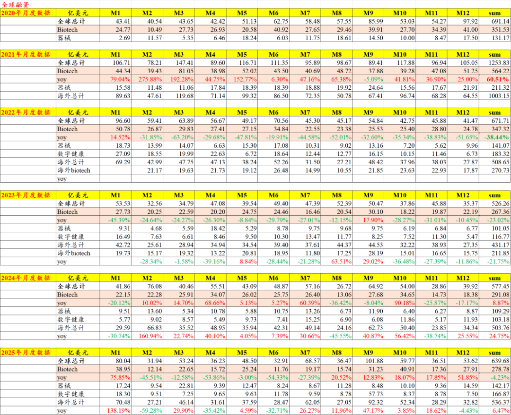
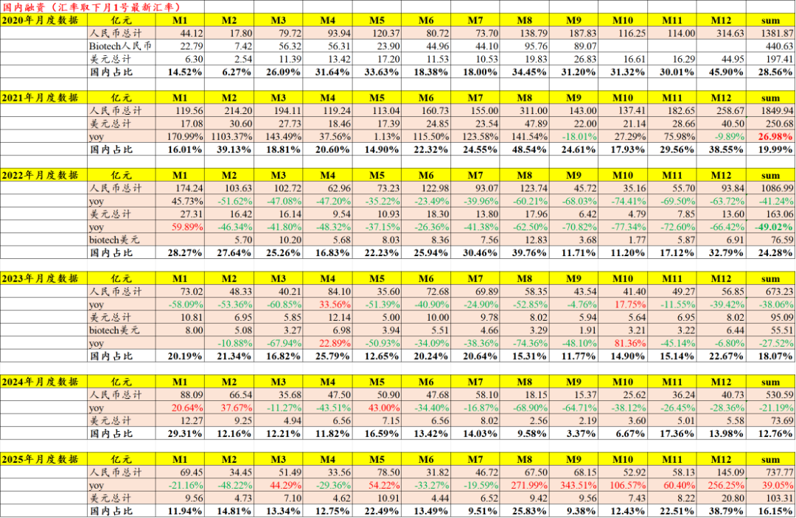
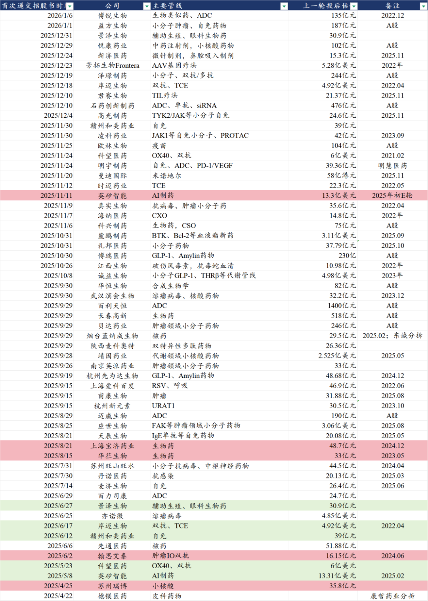
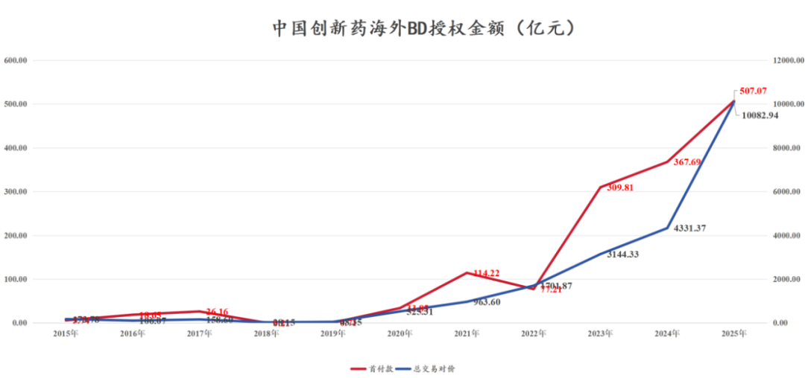
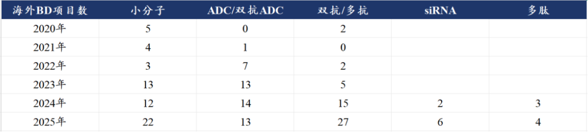
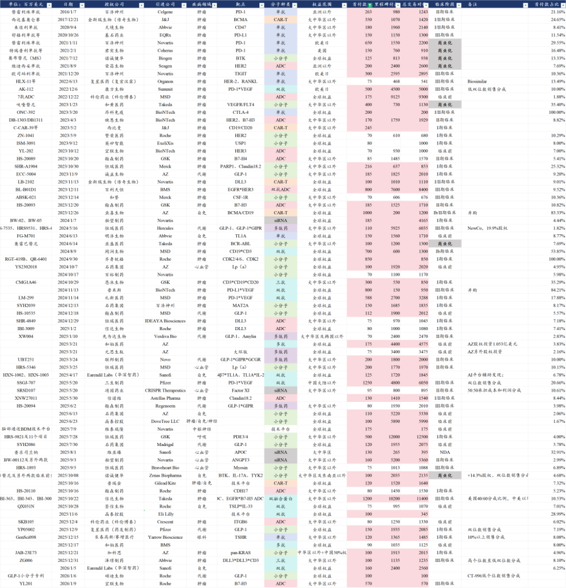

# 2000亿，创新药一生一世花不完

大家好，我是龙哥。

好多读者问，最近CRO为什么起来了，实际上答案早就在此前的文章里《[2025年创新药融资数据更新](https://mp.weixin.qq.com/s?__biz=MzkyMzQ3MDc3Mw==&mid=2247485286&idx=1&sn=7251adbc2940be8b8c65842d6c45c243&scene=21#wechat_redirect)》。大家知道，创新药biotech融资后，一般会在未来1-3年内把融到的钱投到研发投入中，根据我们统计的数据，在刚过去的2025年，国内医药公司仅通过一二级市场就拿到1600亿元的现金（大部分当然是我们投资人买单啦），BD交易出海仅获得的首付款就超过500亿元。

也既在不考虑商业化的情况下，创新药公司拿到了差不多2000亿的现金，这里面可能相当一大部分都会反映在未来1-3年的研发费用中，而创新药公司的研发费用、尤其是biotech的研发费用，又有相当一部分会给到CXO公司，这是上一轮医药牛市中CRO的逻辑之一。一生一世花不完是开玩笑的，花个两三年还是没问题的，况且在行业景气度不错的情况下26-27年一二级市场融资和BD也大概率不会太差。

1、一级市场融资加速修复

2025年12月全球医药行业一级市场融资53.62亿美元，其中创新药融资27.91亿美元同比增长51.85%；2025年12月中国医疗健康领域一级市场融资合计145亿元同比增长256%。

2025年全年，全球医药领域一级市场融资639.68亿美元同比增长10.8%，其中海外融资536.37亿美元同比增长6.47%，中国融资738亿元同比增长39%。

一级市场融资，不论是国内还是国外，2025年都呈现前低后高。

国内市场，一级市场融资大幅好转是在8月份，8-12月不论是从医药领域一级市场融资的绝对金额还是从同比增速都是非常不错的表现，这个体现的是，二级市场虽然从一季度就开始回暖，但是二级市场回暖的确认传导到一级市场需要时间，这个滞后性反映在8-12月这接近半年的时间里。

海外市场，创新药一级市场融资金额在2-7月这半年的时间里出现明显的同比下滑，在8-12月是连续正增长，这其中也有一部分基数的因素、以及中国市场的贡献，再就是川普上台后对医药领域一系列的政策也会引发投资人的担忧，投资人也会观望一下政策面的变化，美股XBI在2025年5月以前也是非常差的表现，美国创新药一二级市场在8月之后都出现了明显的修复。

我们看到海外的一级市场融资修复是在2024年出现，以海外业务为主的CXO公司、尤其是CDMO公司的业绩修复也领先于国内业务为主的CRO公司，从融资端的修复传导到企业真正大幅增加研发投入（需要整体信心的恢复、新技术/新靶点预期的提升）有一定的时间差，再传导到CRO的订单的量价，CRO公司的订单再传导到业绩兑现，这个间隔的周期可能就是半年到一年的时间，实际上这个逻辑在上半年讲CXO的时候都已经讲到（[创新药行情延伸](https://mp.weixin.qq.com/s?__biz=MzkyMzQ3MDc3Mw==&mid=2247484631&idx=1&sn=46d50979dcb5eb6edfbfb77cf83a7b18&scene=21#wechat_redirect)），只是现在下游研发信心恢复向上游CRO的订单和业绩传导已经更加清晰了。

2、二级市场融资大幅提升

创新药及CXO领域2025年二级市场融资金额合计947亿元，其中绝大部分为H股增发和IPO融资。2025年AH股创新药行业IPO融资合计313亿元，增发融资506亿元。

目前在IPO排队的港股创新药公司还有超过50家，其中一部分实现在2026年登陆港交所，一方面是又将对应数百亿元的融资额，另一方面也给市场和投资人带来很多新的投资标的。

二级市场不论是IPO还是增发配股，都要大幅好于2023-2024年，23-24年行业二级市场融资近乎断绝。

3、创新药BD规模破万亿

2025年中国创新药海外授权合计首付款达到507亿元，合计里程碑付款达到10083亿元，交易总包在2025年快速放大、历史首次突破1万亿元，中国创新药出海历史累计的首付款215亿美元（超1500亿人民币），累计总交易对价超过3000亿美元（超2.1万亿人民币）。

2023-2024年BD交易已经有大幅的提升，但当时市场一直有一种质疑的声音，就是认为2023-2024年的创新药密集的BD交易主要是上一轮创新药泡沫期积累的早期研发项目的兑现，而经历2-3年的行业寒冬之后，行业已经没有多少好的项目可以对外BD授权，认为未来创新药BD会出现断崖式下降。

但我们一直在强调一个逻辑，历年的创新药BD不论行业寒冬与否，始终是跟随技术趋势进行的，小分子新靶点、ADC、双抗、小核酸、多肽等新的技术趋势始终会诞生大量的BD交易机会。

虽然2025年是BD交易的大年，也是驱动创新药估值提升的核心逻辑，但由于以上一二级市场融资的大幅修复，使得BD交易拿到的资金的重要性，在2025年来说并不如2023-2024年重要，2023-2024年一二级市场融资近乎断绝之际，BD交易拿到的现金是稀缺、急迫甚至可能是救命的，也因此2023-2024年有不少好的项目以很低的价格卖出去，而2025年则是BD交易的市场定价有所修复的一年。

以7000万美元首付款（5亿人民币）为界限，中国创新药出海的历史上共有75个项目的首付款超过5亿人民币，其中有34个出现在2025年-2026年初，占比45%，一年的时间把重磅BD项目的数量几乎翻了个倍。中国创新药出海历史仅有10笔交易的总包超过50亿美元（在全球也是较为罕见的交易规模），其中有6笔出现在2025年，包括三生、石药、晶泰、恒瑞、舶望、信达等公司达成以上交易。

其中还包括了中国创新药BD历史上唯二首付款超过10亿美元的交易，三生的PD-1\*VEGF双抗和信达生物的PD-1\*IL-2α融合蛋白，还有恒瑞与GSK合作超过100亿美元的总包。

相较2023-2024年大部分的BD交易是由上市公司达成，2025年行业也再度呈现上市公司和非上市公司百花齐放的特点，行业的活力恢复也可以由此体现。

......

如上一篇文章所言《[BD交易之后，创新药下一个爆点](https://mp.weixin.qq.com/s?__biz=MzkyMzQ3MDc3Mw==&mid=2247485517&idx=1&sn=4165772f7153d7557d469892fbced90b&scene=21#wechat_redirect)》，创新药海外BD在2023-2025年的大量项目出海后，下一个阶段就是出海项目的两极分化，一方面我们会看到很多项目推进不下去或者被退回，另一方面我们也会看到有一批优秀的项目和公司持续跑出来，随着全球临床推进和进入商业化而实现下一阶段的高速成长。

同时，国内创新药公司的成长，也会再反哺国内CXO公司，不仅是短期对于CRO公司订单的量价修复，国内创新药公司的国际化也会倒逼CXO公司、尤其是CRO公司更多的走向更全面的国际化竞争。

风险提示：本文仅讨论行业/公司经营情况，投资需综合考虑公司经营、估值、管理层等多方面因素，建议读者审慎参考，本文不作为投资依据，不建议大家根据本文做出投资计划。

<!-- wxmp-comments-begin -->

---

## 留言（10 条，含回复共 20 条）

- **yuraisy** 👍2 · 2026-01-09 12:32
  利好药明吧，国内业务起来是对dyzz风险的有效分散
  - ↳ **作者** · 2026-01-09 13:36
    利好那肯定是利好，毕竟蛋糕在变大嘛，但这个量对药明来说弹性就还是小多了，药明的收入大头还是CDMO，定性分析角度国内业务能对分散风险起到的作用比较有限。
- **Zg** 👍1 · 2026-01-09 11:00
  宜联5.7亿美元，有点超预期。
  - ↳ **作者** · 2026-01-09 11:13
    嗯，确实不错，不过宜联生物没披露具体的交易结构。
- **肥锋  家诚哥** 👍1 · 2026-01-09 12:20
  龙哥7000万首付，少了一个万字[呲牙]
  - ↳ **作者** · 2026-01-09 12:23
    改好了，感谢感谢，你们看的好细致，哈哈[抱拳][抱拳]
- **davi** 👍1 · 2026-01-09 12:31
  大多数BD可能就是收一个首付款，里程碑款的钱难赚，上市后的商业分成更难，有10%就很好了，虽然国内新药上市也难，但FDA批一个新药上市难度高一个难度等级。
  - ↳ **作者** · 2026-01-09 12:33
    这行业原本就是这样，早期项目成功率不足10%。商业化分成比例要看具体项目。
- **welltodo** · 2026-01-09 11:16
  [强]分析很nice
  - ↳ **作者** · 2026-01-09 13:43
    直观的看数据，再配合大致的逻辑分析，就很清晰
- **邹斌** · 2026-01-09 11:21
  老师，药明今年会超预期吗
  - ↳ **作者** · 2026-01-09 13:42
    药明现在有3家上市公司了，所以说药明还是要具体说是康德、合联还是生物。总体今年药明系的业绩趋势肯定还是好的，增速比较快的应该还是合联，生物今年估计也不会差，现在双抗/多抗的研发和BD也是如火如荼。
- **路过** · 2026-01-09 11:23
  封面做的很漂亮！
  - ↳ **作者** · 2026-01-09 13:41
    感谢腾讯的AI
- **低碳哥** · 2026-01-09 11:30
  生一世花不完是开玩笑的[憨笑][憨笑][憨笑]
  - ↳ **作者** · 2026-01-09 13:41
    以前很多公司融资融了很多钱，我们也以为一生一世花不完，毕竟那些公司的研发管线按乐观预期达峰赚到的利润可能都不如融资规模大。但后来发现，根本没有花不完的钱，biotech真要想烧钱，真是如流水。
- **希真书童 (Terence Fang)** · 2026-01-09 11:37
  龙哥，劲方怎么看？
  - ↳ **作者** · 2026-01-09 13:39
    劲方今天涨幅比较大，不就是映射艾伯维和默沙东两家可能竞购Revolution，价格从200亿美金到300亿美金左右，劲方手里的pan RAS分子胶也在去年底刚进临床了，也指望着BD授权吧，只不过fast follow的授权规模肯定和FIC没法比。
- **观复** · 2026-01-09 11:54
  龙哥好，春立医疗不在脑机接口和AI医疗炒作概念里，作为出海有增量的创新器械还值得守护嘛[苦涩]
  - ↳ **作者** · 2026-01-09 13:37
    为啥非要在主题概念里呢，主题有主题的玩法，出海有出海的模式，除非是水平很高的灵活短线资金，不然没必要把自己的持仓非得往主题上靠哈。

<!-- wxmp-comments-end -->
