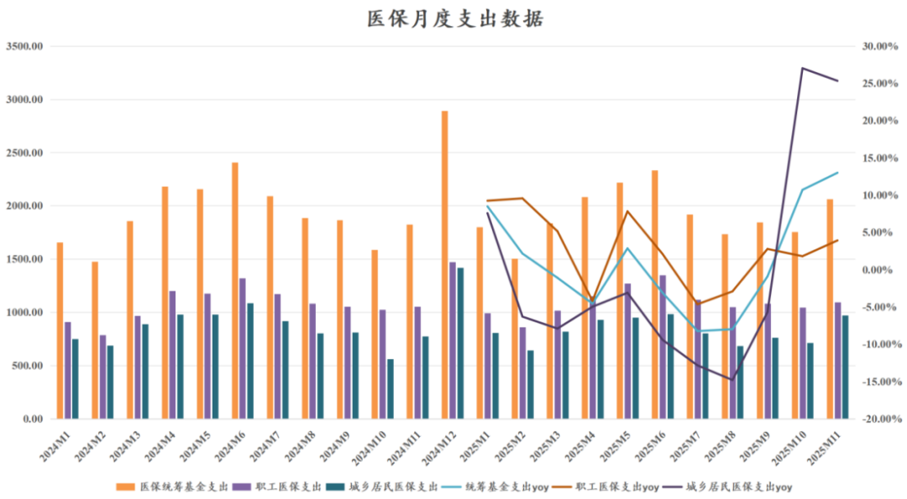

# 医药行业2026，继往开来

大家好，我是龙哥。

年底最后一天，也是在行业近三个月持续回调之际，和大家初步聊聊对行业26年的展望，到26年1月份还会再做更详细的总结和展望。

1、医疗行业总量将有所修复

2024-2025年的医疗行业总量逻辑非常差，差到什么程度呢，2024年医疗卫生费用9.09万亿同比增长仅有0.35%，占GDP的比重从7%下降了0.30%到6.7%，具体可以看这两篇文章（[医疗数据看的人眼前一黑](https://mp.weixin.qq.com/s?__biz=MzkyMzQ3MDc3Mw==&mid=2247485274&idx=1&sn=6e837ca4ef2b8157346f34e115276e01&scene=21#wechat_redirect)，[医药总量逻辑不容乐观](https://mp.weixin.qq.com/s?__biz=MzkyMzQ3MDc3Mw==&mid=2247484982&idx=1&sn=bc5b6dd8eb3b78e462926101bf915152&scene=21#wechat_redirect)）。2025年1-11月国家医保统筹基金累计收入2.63万亿同比增长2.88%，1-11月统筹基金累计支出2.11万亿同比增长0.51%。

在人口年龄结构快速变化的背景下，医药行业本身就面临通缩的压力（量增、价跌），如今医疗总费用的增速甚至跑不过GDP，行业通缩压力更甚，2024年门诊人次均医药费同比-0.17%，其中药费同比-0.37%，2024年住院人次均医药费同比-4.32%，其中药费同比-14.76%。

以上行业总量逻辑之下，还有国产创新药的崛起，此前我们给大家分享的数据中可以看到，国内创新药销售金额近年都是30%左右的行业增速，属于医药行业中很强的α，此消彼长之下意味着创新药以外的其他行业表现甚至比行业总量的低增长更差，这也是为什么今年除了创新药、CXO和个别出海器械以外，大部分的医药细分领域表现都非常惨淡。

但我们判断，医疗卫生费用、医保支出的增速并不会始终维持较低的增速甚至持续大幅跑输GDP增速的情况，虽然市场总是经常会线性外推，去年和今年的行业增速比较差就会外推到未来行业总量永远没有增长，但我们认为这是不现实的，医疗需求是永无止境的，政策面可以阶段性的改变个别年份的表现，但改变不了长期趋势。

实际上24-25年对医疗领域来说是“不太正常”的年份，大的框架是整体医疗费用开支、医保收支都受到总体经济环境的影响，经济环境和就业未来的复苏也会带动医药行业的修复；但同时这两年也是在集采、国谈等常态化的政策以外，更加严格的对终端医疗机构和药店行业进行整治的两年，除了2023年下半年以来常态化医疗反腐以外，对医疗机构和药店的骗保行为在这两年也加大了查处力度，直观表现就是医疗费用支出和医保支出端都受到影响，24-25年反倒成了国内创新药销售加速增长的两年。

2025年10-11月，医保支出端已经开始呈现修复，2026年我们认为医疗费用总量增长的表现大概率会好于2024-2025年，全行业的压力会有所降低，对行业的预期也有望出现修复。

2、创新药仍是主线

2025年是创新药BD交易出海逻辑反映在股价和估值的大年，2023年以来我们一直强调一个观点，“真正有全球竞争优势和临床价值的创新药一定会选择出海”，换句话说，不管你这款药吹的有多么牛，在现在高度有效、信息通畅的全球市场，如果你无法站在全球市场的舞台上做药物的开发，那么只能证明你的药并不具有明显领先的竞争力。国内创新药海外BD从2022年底开始出现边际变化，2023年开始爆发，直到25年这个逻辑深入人心。

从10月份以来，BD交易的落地对股价的影响似乎已经不再是利好，BD交易落地往往对应着股价大跌，对创新药投资人的信心带来很大的冲击，这其中更多是“过度卷内幕消息”带来的反噬，大部分落地的BD交易都是提前有预期、或者预期已经过高，我们在《[创新药投资困难的事](https://mp.weixin.qq.com/s?__biz=MzkyMzQ3MDc3Mw==&mid=2247485454&idx=1&sn=36c6f31397c2d7f59490f158415c2bcc&scene=21#wechat_redirect)》文章中和大家讨论了这个问题。创新药行业的回调，也使得很多读者质疑创新药行业的底层逻辑是否还正确。

对于今年刚看创新药的投资人来说，一轮大起大落，必然是会质疑产业逻辑是否还在，但作为眼看着2022年以来创新药行业发生巨大变化的我们来说，作为我们从各种行业数据中剖析产业趋势的我们来说，我们目前并不认为产业逻辑有大的变化，我们在思考的是行业回调后的潜在空间有多大，正如我们在9月市场狂热阶段测算出行业潜在回报率已经不高《[创新药宏大叙事，行业估值处于什么水平？](https://mp.weixin.qq.com/s?__biz=MzkyMzQ3MDc3Mw==&mid=2247484956&idx=1&sn=015c13dab5e66b4a6ca8d66ff8791921&scene=21#wechat_redirect)》。

创新药行业投资，单个公司之间的差异可以天差地别，不论是管线质量、团队效率、管理层道德水平等公司层面的核心因素，还是所处赛道、技术迭代、新技术领域等产业逻辑层面的核心因素。

我们龙谈价值的公众号在2019-2022年的阶段，更多的讨论公司层面的核心逻辑，但经历上一轮的牛熊之后，我们逐渐认识到讨论个股实际上对于大部分读者的认知来说并不能带来显著提升，较多的讨论个股也并不利于大部分读者赚到钱，因此在2023-2025年我们在这个新的公众号出发之后，我们绝大部分文章都是在讨论行业发展和产业趋势方面的问题，反映在创新药行业中，就是跟随技术趋势的创新药投资框架。

例如2023-2024年的ADC、GLP-1减重药，不但成就了多个牛股，而且细分领域的卖水人CDMO公司也获益颇丰，再到2024年下半年以来IO双抗、自免双抗等领域的进展，以及2025年下半年到2026年的siRNA等，都会带来一众牛股的投资机会，这种基于技术趋势下的细分技术领域投资，相对来说风险会可控的多，多个投资标的会很大程度上分散风险，技术趋势的惯性会吸引更多的产业资本进来，助推细分领域几年维度的发展。

由于创新药领域持续的技术突破，以及国产创新药在新技术领域的快速跟进乃至个别的后来居上，使得我们看至少未来3-5年维度，创新药行业不会缺少投资机会，从2-3年的维度也是创新药在国内商业化高增长的几年，属于国内和海外逻辑的共振。

3、CXO行业仍具潜力

在今年上半年创新药行情火热之际，我们也较早的和大家讨论CXO行业的投资机会（[CXO全面复苏](https://mp.weixin.qq.com/s?__biz=MzkyMzQ3MDc3Mw==&mid=2247484308&idx=1&sn=3ecff125b0b85e5cd323cb99f646e2a3&scene=21#wechat_redirect)），CDMO和CRO总体面临不同的投资逻辑。

CDMO绝大部分收入来自海外，其高度跟随全球技术趋势，因此投资CDMO公司的核心和上文创新药类似，技术趋势是首要考虑因素，2022-2024年较火热的ADC、GLP-1减重药等赛道造就了细分领域的CDMO龙头在业绩和股价表现上都大幅跑赢其他公司[医药最高景气方向](https://mp.weixin.qq.com/s?__biz=MzkyMzQ3MDc3Mw==&mid=2247484299&idx=1&sn=c6677f52d0ea6ebfbc11420984b3636d&scene=21#wechat_redirect)。

这两个赛道后续仍有潜力，产业的发展还处于中期，绝大部分项目都还处于临床开发甚至早期临床阶段，密集的商业化阶段和CMO大单尚未到来，二线的公司订单也随着项目推进而快速上量。我们在产业调研中也发现ADC CDMO一体化产能建设还是有一定壁垒，行业供给不太会像普通小分子和大分子那样快速无序扩张。

CRO领域，临床前CRO与临床CRO的节奏稍有不同，临床CRO里的细分领域的节奏也会有所不同，如SMO的小龙头在25年已经出现毛利率和盈利的大幅改善，但是大临床龙头的报表则是还受到历史低价订单的影响，25年的订单量价企稳会反映在26年及以后，这种订单转向对业绩的影响有滞后性，但股价大概率会领先于业绩。对于临床前CRO的动物实验环节，近期市场关注度比较高的主要是实验猴这类生物资产涨价的问题，不过2025年已经不是2021年，市场对生物资产的价格波动的理解也已经比较多。

4、创新器械出海加速

从今年中写医疗器械行业的文章开始，我们大概对行业有两个判断：

第一个是我们认为国内创新器械的政策拐点已经出现，当然政策拐点不代表股价拐点，从创新药行业来看，政策拐点到基本面拐点大概中间间隔1.5年，到股价拐点间隔1.5-2年，在此期间伴随着创新药出海的爆发。而创新器械的政策拐点到基本面拐点也不排除要经历这个过程，但是股价拐点有可能会更早。

创新器械也已经出现类似创新药的支持政策，国家陆续明确了高端医学影像设备、手术机器人、高端AI医疗器械、新型生物材料/高端植介入耗材、脑机接口等创新器械领域是支持的重点方向，其中脑机接口、AI医疗、医疗机器人等也是今年市场反复炒作到的主题方向。

第二个是器械出海已经形成趋势，器械出海正如创新药出海，其一定程度上也是被国内有限的市场倒逼的行为，否则可以在国内轻松的赚钱、谁愿意远渡重洋去陌生的国家拓展市场。目前我们看器械出海还主要是一部分细分领域的少数公司，可能林林总总算下来这两年在出海方面有大的突破或者已经做的不错的公司有个十几家，在200多家器械上市公司中的占比还不算多，但有前面出海的器械企业在业绩、股价、融资上都有积极的正反馈之后，未来更多器械公司会加大海外市场的开拓，未来两年很可能看到更加密集的器械出海，器械出海也会逐渐形成板块效应。

在前阵子的文章《[创新器械出海先锋](https://mp.weixin.qq.com/s?__biz=MzkyMzQ3MDc3Mw==&mid=2247485262&idx=1&sn=72f5e11cdd06ea0b5beac35064179e86&scene=21#wechat_redirect)》中写到的微创机器人，近期又公布了图迈腔镜机器人的订单情况，四季度海外新增订单再次出现大幅加速，股价也出现很不错的表现，这些都会给上市公司、给投资人带来积极的影响。

......

月底最后一天，也是2025年的最后一天，最后开一次赞赏。

2025年一共分享了108篇文章，累计超过30万字的内容分享，包含我们在创新药、CXO、创新器械领域的诸多研究和思考，以及每篇文章基本都会互动回答十几个到二十多个留言问题。

陪伴大家医药行业两轮牛市，今年也增加了一些新读者，由此也结识了一些新的医疗投资行业、医药产业的朋友；四季度行业回调之际，个别新读者也会有一些质疑甚至谩骂，但更多关注几年的老读者的认可还是很让人温暖。

提前祝大家元旦快乐，新的一年龙哥还是会努力给大家分享更多有客观理性有深度的文章~

风险提示：本文仅讨论行业/公司经营情况，投资需综合考虑公司经营、估值、管理层等多方面因素，建议读者审慎参考，本文不作为投资依据，不建议大家根据本文做出投资计划。

<!-- wxmp-comments-begin -->

---

## 留言（1 条，含回复共 2 条）

- **zhz** 👍1 · 2026-01-09 11:50
  忘放赞赏链接了
  - ↳ **作者** · 2026-01-09 11:51
    哎这篇不开赞赏，这个是25年最后一天的文章，那天发文出了点问题，我把文章重新发一下。

<!-- wxmp-comments-end -->
