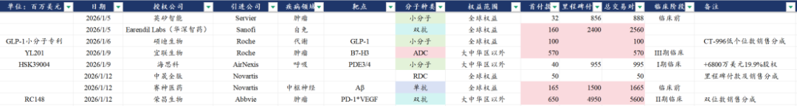
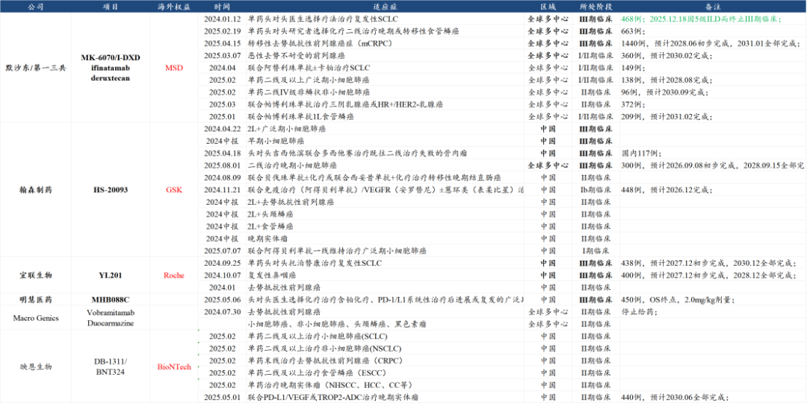
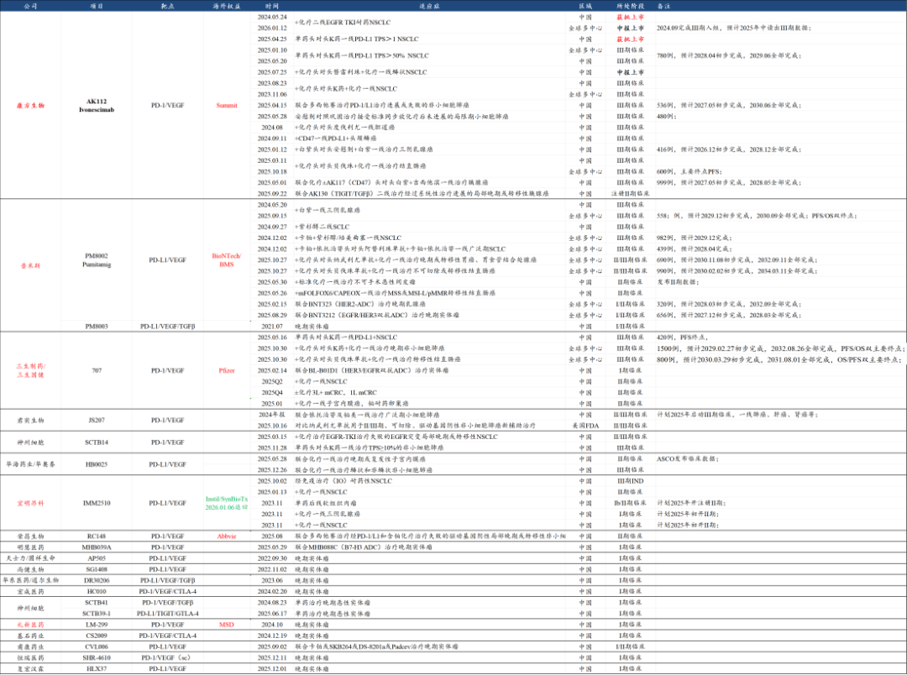
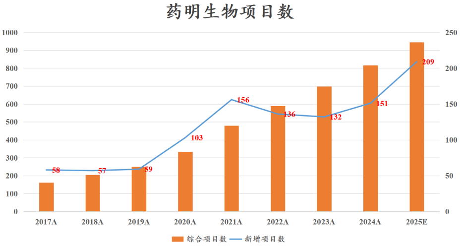
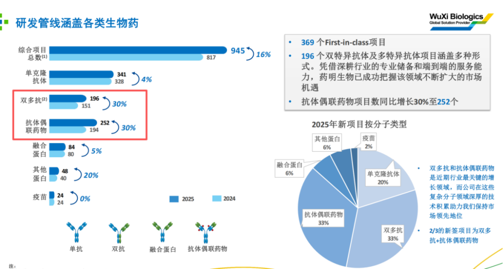
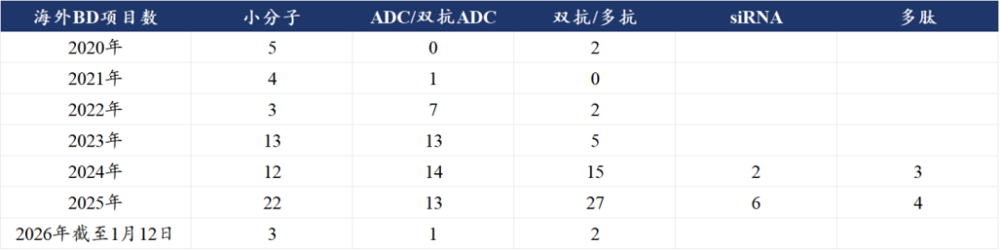
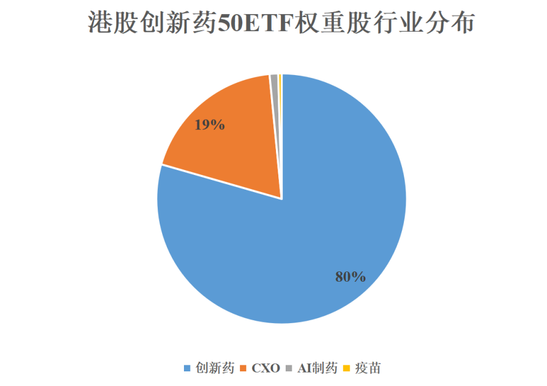
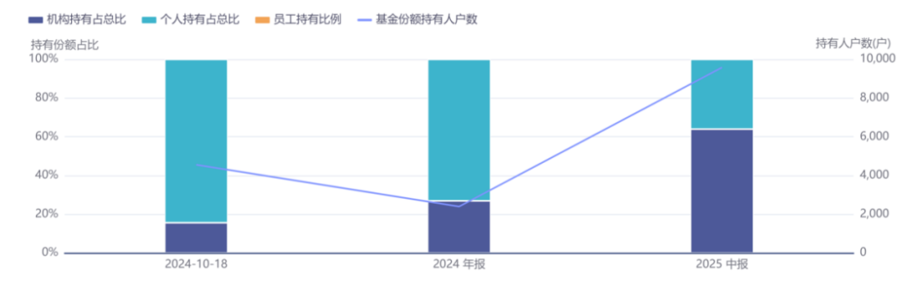

# 创新药产业链开门红

大家好，我是龙哥。

开年前两周，医药行业与市场一起出现了久违的行情，不仅是从短期流动性和主题炒作的角度，从基本面的角度也是有着非常积极的表现，包括创新药、CXO、创新器械、医疗AI等多个方面，篇幅所限，我们本文先就创新药及CXO来聊聊行业积极的变化。

2025年初在选择医药行业投资方向的时候，实际上是一个“做简单题”的思路，创新药在那个时间点属于产业逻辑非常通顺、估值又显著低估，因此2024年底、2025年初我们内部的医药行业年度策略以及我们公众号的文章，都是只需要瞄准创新药这个方向就可以，随着创新药全面趋于火热，我们陆续开始看好CXO，以及到后来的看器械板块的政策拐点。

如我们25年底的文章《[医药行业2026，继往开来](https://mp.weixin.qq.com/s?__biz=MzkyMzQ3MDc3Mw==&mid=2247485469&idx=1&sn=51560c124ea3a20e1624cd73474f43a5&scene=21#wechat_redirect)》所言，2026年我们认为是医药行业总量逻辑有望开始修复的时点，叠加近期的文章《[BD交易之后，创新药下一个爆点](https://mp.weixin.qq.com/s?__biz=MzkyMzQ3MDc3Mw==&mid=2247485517&idx=1&sn=4165772f7153d7557d469892fbced90b&scene=21#wechat_redirect)》、《[2000亿，创新药一生一世花不完](https://mp.weixin.qq.com/s?__biz=MzkyMzQ3MDc3Mw==&mid=2247485530&idx=1&sn=c056df56c79848a5f4f5d2dffb7129d0&scene=21#wechat_redirect)》、《[创新器械出海先锋](https://mp.weixin.qq.com/s?__biz=MzkyMzQ3MDc3Mw==&mid=2247485262&idx=1&sn=72f5e11cdd06ea0b5beac35064179e86&scene=21#wechat_redirect)》等，我们认为今年创新药、CXO、创新器械/器械出海等都有不错的机会，如此前有些读者可能会觉得港股创新药指数里有比较多的CXO、不够纯粹，例如我们此前讲过的513780港股创新药50ETF的持仓里第一大重仓就是药明生物，截至三季度末的持股比例达到11.5%，而站在2026年来看，同时覆盖创新药和CXO的港股创新药指数和对应的ETF却不失为好的选择。

1、创新药开年BD交易火热

我们知道BD交易通常需要有几个月的谈判周期，一般新的一年开启的BD交易谈判，最终落地可能都要在当年底了，也有些是为了完成当年的KPI而尽量在年底前完成谈判，或者有些拖延一下就到次年了，所以我们从近几年的BD交易的情况来看，年底到次年初经常是BD交易落地比较密集的。

例如在2025年的1月份前两周，就共落地了10笔的BD交易，总的首付款是3.56亿美元，总的交易对价是95亿美元，首付款占比大概是3.7%。而在2026年以来的不到两周时间落地的8笔交易，合计的首付款是17.67亿美元，合计的总交易对价是124.28亿美元，首付款占比大概是14.2%，也即2026年以来BD交易的质量相比2025年同期是有大幅提升的。

这实际上与我们自2025年三生制药的大额BD落地后对国内一系列BD交易的感受是比较接近的，总体国内BD交易的项目与海外MNC的议价权在提升，交易谈判的框架协议越来越有利于国内企业，虽然在交易对价上相较海外还是有较大差距，但相比过去肯定是大幅的提升。

开年有两笔首付款超过5亿美元的重磅交易，分别是：

1）1月9日国内ADC药物头部的biotech公司宜联生物的B7-H3 ADC以5.7亿美元的首付款+近期里程碑付款被授权给罗氏，B7-H3 ADC在全球已经达成了几笔比较有意思的交易，包括①2023年10月默沙东以45亿美元首付款、220亿美元总包引进第一三共的3款ADC药物，其中B7-H3 ADC支付了15亿美元的首付款，目前启动了3项III期，但其中二线SCLC的III期已经终止；②2023年4月BioNTech以1.7亿美元首付款、19.285亿美元总包引进映恩生物的B7-H3 ADC和HER2 ADC两款药物，2026年将会推进到III期临床；③2023年12月GSK以1.85亿美元首付款+15.25亿美元里程碑付款引进了翰森制药的B7-H3 ADC，并于2025年8月启动了首项全球III期临床。再就是本次的宜联生物与罗氏的合作，是以上3笔2023年达成的B7-H3 ADC交易后又一笔该领域的重磅交易。

2）就在昨晚，今年第二笔超级重磅交易，荣昌生物将其RC148（PD-1\*VEGF双抗）的大中华区以外权益授予艾伯维，荣昌生物获得6.5亿美元首付款+49.5亿美元里程碑付款+双位数销售分成。

目前在IO双抗领域达成的包括康方/Summit、普米斯/BioNTech/BMS、三生制药/辉瑞、礼新/默沙东、荣昌生物/艾伯维、信达生物/武田制药等6笔重磅交易均为中国公司对海外MNC的授权，这6笔交易合计贡献了50.43亿美元首付款、334亿美元的交易总包，可以说是全球第一个真正由中国公司主导的超级大药领域。

荣昌的这笔交易，是该领域的又一项重要进展，全球头部MNC中，已经有默沙东、辉瑞、艾伯维、BMS、武田制药通过BD引进中国的IO双抗，阿斯利康则是在推进其PD-1\*TIGIT双抗，肿瘤领域较强的还有罗氏、诺华、强生在观望。

除了以上两笔重磅的交易以外，大家还可以观察到，开年最先的两笔交易分别是英矽智能和华深智药的BD交易，这两笔交易都是基于AI药物发现平台的交易合作，2025年也已经有多项基于AI药物发现平台的BD合作，在可预见的未来，AI药物发现的占比预计会持续提升。

即便我们知道开年这种如此惊艳的BD交易是不可完全线性外推的，但不妨碍我们对过去1年的趋势判断，总体国内创新药全球BD交易的项目质量、议价权确实是在提升，也参照我们《[BD交易之后，创新药下一个爆点](https://mp.weixin.qq.com/s?__biz=MzkyMzQ3MDc3Mw==&mid=2247485517&idx=1&sn=4165772f7153d7557d469892fbced90b&scene=21#wechat_redirect)》文章的内容，好的BD交易也为未来临床推进和潜在的成功成药比例、商业化价值等打下更好的基础。

2、药明系继续领衔CXO

药明系三家公司康德、生物、合联，由于非常全面且充分的分别吃到GLP-1减重药、双抗、ADC药物的产业风口，是2025年CXO板块中表现最出色的公司里的三家，哪怕合联面对药明康德的大笔减持也依然表现强劲。

昨晚，药明康德发布了2025年业绩预告，收入利润均超预期，具体来说，2025年营收454.56亿元同比增长15.84%，超过公司指引的全年收入435亿-440亿元（超出3.3%-4.5%），也超出我们预计的451.5亿元（超出0.68%），其中持续经营业务收入同比增长超21.40%。

归母净利润191.51亿元同比增长102.65%，扣非归母净利润132.41亿元同比增长32.56%，经调整归母净利润149.57亿元同比增长41.33%，也均超出我们的预测。非经项目主要包括出售联营公司股权及剥离部分业务获得的投资收益，以及Q4人民币相较美元升值导致的汇兑损益，其中出售药明合联的投资净收益为41.61亿元，出售临床CRO部门的投资净收益为14.34亿元，这两部分合计投资收益为55.95亿元。

Q4单季度收入125.99亿元同比增长9.19%，经调整净利润44.17亿元同比增长36.74%，一方面是剥离临床CRO和ATU部门的影响，另一方面是去年Q4业绩基数基数也已经较高。

总体来看药明康德2025年的确处于一个业绩基数较高的水平：①替尔泊肽及其他多肽GLP-1药物的收入贡献大增，毛利率大幅提升；②资产出售的投资收益很高；③利润率已经达到32.9%的超高水平。

药明生物和药明合联虽然暂时还没有发业绩预告，但药明生物在JPM大会上展示了其2025年大致的经营情况；

2025年药明生物新签了209个项目创历史新高，总项目数945个，其中包括74个III期临床项目和25个商业化项目，但值得注意的是截至2025年底的商业化项目数还是要明显低于公司此前的指引，在全球制药供应链中，预计药明系还是多少受到一些政治因素的影响，从而可能被三星生物、lonza等对手抢了部分订单。

在其研发管线中有两个领域尤其突出，一个是分拆在药明合联的XDC板块，另一个是双抗领域，我们在此前分析BD趋势的文章中也多次提到，从2024年下半年以来，国内双抗药物的BD出海进入全面爆发，大量的国内在研管线和出海项目，也将预示着双抗/多抗领域的CDMO/CMO需求，随着大量项目的临床推进以及部分项目进入商业化，在未来几年会有较为确定性的增长，药明生物也将从中获益，2025年药明生物来自双抗/多抗的收入占比已经超过20%。

当然，基于我们在《[2000亿，创新药一生一世花不完](https://mp.weixin.qq.com/s?__biz=MzkyMzQ3MDc3Mw==&mid=2247485530&idx=1&sn=c056df56c79848a5f4f5d2dffb7129d0&scene=21#wechat_redirect)》文章中的判断，我们认为2026年的CXO行业不会像2025年那样更像是药明系的一枝独秀，而更可能出现百花齐放百家争鸣。

此时我们再回到上文提到的513780港股创新药50ETF及其联接基金A/C（023597/023598）的持仓可见：

ETF按25中报时全部持仓的成分股来看，大概是80%的创新药+20%的CXO，最新的规模在比较适中的32亿元左右。

还有一点有意思的是自2024年底以来这个ETF的规模扩张几乎都是机构买入为主，这也是创新药港股ETF中机构持仓占比相对较高的一个ETF。

......

创新药行业经历25年四季度的回撤，对不少读者的信心打击不小。多数时候我们也无法做到精准的择时，我们更多时候还是基于对行业发展趋势和估值进行“模糊的正确”的分析，以大致判断行业所处的阶段和位置。至少从去年四季度那个时间点来看，我们不认为行业在积极向上、蓬勃发展的产业趋势下会再次陷入如前些年那样的行业无休止的下跌中。

我们也在反思在当前量化和AI如此强大的背景下如何获取超额收益，超出和领先于市场的对战略方向的判断、对长期产业趋势的思考，或许是我们能在当前阶段仍可以大幅领先于AI的地方。

风险提示：本文仅讨论行业/公司经营情况，投资需综合考虑公司经营、估值、管理层等多方面因素，建议读者审慎参考，本文不作为投资依据，不建议大家根据本文做出投资计划。

<!-- wxmp-comments-begin -->

---

## 留言（16 条，含回复共 32 条）

- **DRAGON** 👍9 · 2026-01-13 11:30
  创新药我有恒瑞，器械我有迈瑞和微创，CXO我有药明两家，今后几年就踏着这波行情启航[呲牙][呲牙][呲牙]
- **王熙** 👍6 · 2026-01-13 11:29
  大幅领先量化、AI，我觉得还是要提前做好未来6-12个月的产业研究，然后提前买入埋伏，等着市场风口到来给我们抬轿子，这对于基本面拐点的研判要求是非常高的。
- **时间之外的往事** 👍4 · 2026-01-13 11:09
  康方给吓傻了，市场优等生，离成药最近的112不断被抛售，第二第三第四，三期数据尚不完整的，市场确乐观的认为注定成药，只是有大厂背书？
  - ↳ **作者** · 2026-01-13 11:11
    毕竟海外潜在竞品在增加，潜在买方在减少，是会有一些担心也正常。康方今年核心矛盾还是3期数据读出，数据好的话不太需要担心。
  - ↳ **作者** · 2026-01-13 11:40
    康方最近披露的一系类数据表明，H3，H7OS阳性概率越来越大，各大厂纷纷进军双抗，他们不担心数据？似乎也没人质疑第二第三第四的数据。为何到了康方这里就各种挑剔，龙大，我想不通啊。。
- **大内总管** 👍2 · 2026-01-13 11:07
  哈哈 就等龙将军发文安抚军心呢[加油]
  - ↳ **作者** · 2026-01-13 11:10
    行情起来了，不需要我安抚军心了，骂声也少了，写文章轻松一些了，哈哈
- **嘉淇** 👍2 · 2026-01-13 11:08
  药明真的厉害，虽然公司经常减持
  - ↳ **作者** · 2026-01-13 11:09
    实际上药明在2020-2021年那一波减持比现在凶猛多了，业绩好的时候市场根本不管这些，还是要把握不同阶段的核心矛盾。
- **@Sunny** 👍2 · 2026-01-13 11:08
  专业[强][强][强][强][强]
  - ↳ **作者** · 2026-01-13 11:10
    [加油][加油]
- **TT鼠。** 👍2 · 2026-01-13 11:12
  映恩生物直接涨的很强势呀
  - ↳ **作者** · 2026-01-13 11:15
    是的撒，参照1月7号的文章
- **welltodo** 👍2 · 2026-01-13 11:15
  药明康德扣非环比略降，大佬分析分析，感谢
  - ↳ **作者** · 2026-01-13 11:17
    公司公告里有提吧，Q4有汇兑的因素。
  - ↳ **作者** · 2026-01-13 11:44
    汇率是很大原因但是增长动能是不是也略显乏力了
- **Zg** 👍2 · 2026-01-13 12:16
  随着BD放量，2026年也要逐步传导到国内CXO了吧，不过最近涨的快的都是些杂毛，游资特色[捂脸]
  - ↳ **作者** · 2026-01-13 12:17
    看上篇文章，传导其实已经出现了
- **廖书豪** 👍1 · 2026-01-13 11:14
  请教龙哥，贝达走的弱于板块是有什么担忧吗比如几个大药商业化不及预期，上半年除了EYP-1901的3期数据要读还有其他比较大的催化吗，看着其他创新药涨的牙痒痒[苦涩]
  - ↳ **作者** · 2026-01-13 11:17
    创新药是时间的敌人，执行力和效率低的公司会与其他公司的差距在几年内就被快速拉开，而创新药公司的估值又大部分在管线的未来预期中，所以创新药的“低估值陷阱”可能比其他行业更显著。
- **求索者** 👍1 · 2026-01-13 11:18
  哈哈哈，不妨大胆些就是要线性外推:2026年对外授权的首付款相比2025年会翻倍的[呲牙]
  - ↳ **作者** · 2026-01-13 11:19
    首付款是有可能的，项目质量越来越好，1月前两周首付款125亿达到去年的四分之一。
- **yuraisy** 👍1 · 2026-01-13 11:19
  龙大，药明康德2026扣非业绩增长的持续性怎么看？虽然25年高基数
  - ↳ **作者** · 2026-01-13 11:20
    我认为增速大概率是大幅放缓了，所以药明三家上市公司目前估值都是和26年成长性相匹配的。
- **画画的北北** 👍1 · 2026-01-13 11:20
  您觉得华海药业的 hb005 有看头吗
  - ↳ **作者** · 2026-01-13 11:23
    你说的是HB0025吧，也是传BD传了好久，没有落地，现在海外MNC潜在买方越来越少，BD方面也是有压力的。目前已经开了一线肺癌的国内3期，2期来看剂量比较高，对应的疗效好和毒性大。
- **江油褀源电脑-复印机打印机维修站** 👍1 · 2026-01-13 11:23
  龙哥眼科今年有机会吗
  - ↳ **作者** · 2026-01-13 11:32
    看消费复苏的情况，总体应该会比去年好，大伙炒股票赚了钱也多出去消费，花出去的钱才是你的钱[机智]
- **妙蛙** 👍1 · 2026-01-13 11:24
  龙哥一出，必是好文，期待后面有创新器械文[愉快]。另外行情好的时候记得要放赞赏码。[玫瑰]
  - ↳ **作者** · 2026-01-13 11:31
    器械可以先参照12月初那篇，今年肯定会多聊一些器械的。
- **隐隐** 👍1 · 2026-01-13 11:40
  之前怕创新药不纯正要剔除cxo，现在整体看cxo都很好啊，所以踢不踢出貌似都行哈？
  - ↳ **作者** · 2026-01-13 12:17
    ETF是工具，核心是给大家想要的工具，有的投资人不看好CXO或者更看好创新药，他就想要最纯粹的，有的投资人就想要全覆盖的，甚至有的投资人希望带点器械和服务的。

<!-- wxmp-comments-end -->
