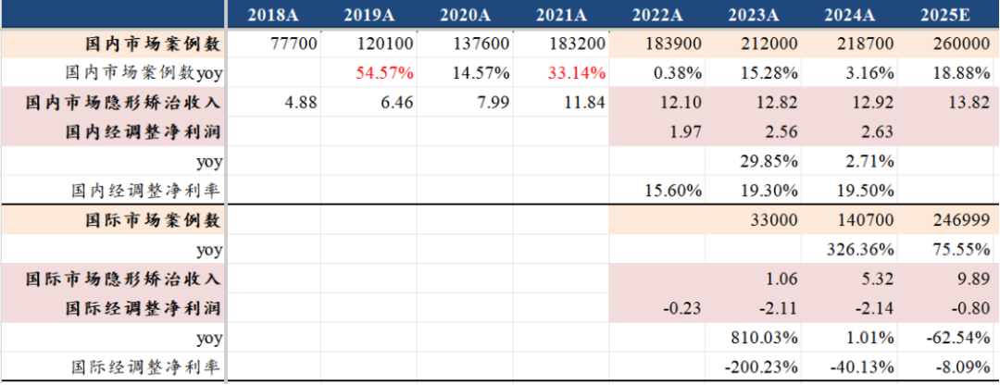

# 中国医疗器械全球化路径

大家好，我是龙哥。

12月初的文章《[创新器械出海先锋](https://mp.weixin.qq.com/s?__biz=MzkyMzQ3MDc3Mw==&mid=2247485262&idx=1&sn=72f5e11cdd06ea0b5beac35064179e86&scene=21#wechat_redirect)》中和大家讨论了医疗器械出海的公司，12月底的文章《[医药行业2026，继往开来](https://mp.weixin.qq.com/s?__biz=MzkyMzQ3MDc3Mw==&mid=2247485469&idx=1&sn=51560c124ea3a20e1624cd73474f43a5&scene=21#wechat_redirect)》中和大家讨论了对26年的大致观点，然后在进入2026年1月份之后，我们又陆续分享对今年创新药的研究思路《[BD交易之后，创新药下一个爆点](https://mp.weixin.qq.com/s?__biz=MzkyMzQ3MDc3Mw==&mid=2247485517&idx=1&sn=4165772f7153d7557d469892fbced90b&scene=21#wechat_redirect)》，以及对CXO的观点《[2000亿，创新药一生一世花不完](https://mp.weixin.qq.com/s?__biz=MzkyMzQ3MDc3Mw==&mid=2247485530&idx=1&sn=c056df56c79848a5f4f5d2dffb7129d0&scene=21#wechat_redirect)》。

基于我们对26年医药行业总体的判断：①行业总量逻辑修复，②创新药、CXO、器械出海三大方向值得关注。

今天我们再来讨论一下器械国际化的情况，从目前器械出海做得比较好的几个案例，来聊聊器械出海的机遇和我们的机会。

1、手术机器人

目前已经有两家腔镜手术机器人公司上市，分别是微创医疗分拆出来的微创机器人、以及深圳的精锋医疗。

由于国内近两年院内市场一些大家众所周知的原因，导致手术机器人在国内的装机几乎一直在miss，微创机器人曾经是陷入现金接近枯竭、国内商业化低于预期的窘境，但从其2024年推进国际化战略并取得实质性突破后，其订单和装机实现跨越式提升。

根据微创机器人公开发布的信息：

截至2024年11月25日，微创机器人的图迈腔镜手术机器人全球商业化订单突破50台。

截至2025年6月13日，微创机器人的图迈腔镜手术机器人全球商业化订单超70台，商业化装机突破50台，6.5个月的时间新增20台商业化订单。

截至2025年10月9日，微创机器人的图迈腔镜手术机器人全球商业化订单突破100台，已装机近80台，4个月的时间新增约30台的订单和30台的装机。

仅仅在两个半月后的2025年12月24日，公司宣布图迈的全球累计订单突破160台，累计商业化装机达到100台，四季度微创机器人的订单和商业化都出现了同环比的显著加速，2.5个月的时间新增约60台的订单和20台的装机。

2025年全年，图迈腔镜手术机器人在全球市场拿到了约120台的商业化订单，其中海外部分接近100台的订单，占比达到80%左右，当然，2025年中国市场的订单确实表现不佳，但海外的放量的确是非常迅猛。

精锋医疗虽然没有非常准确的数字，但是从其招股说明书的财务数据可见，出海做的相对微创晚一些的精锋医疗，2025年上半年海外收入占比也已经达到40%，海外订单量也已经有小几十台。

微创机器人和精锋医疗能在国际化上短期做出较快的突破，我们认为有几方面原因：

①全球手术机器人的市场需求够大，行业近乎寡头垄断的达芬奇手术机器人覆盖的市场有其局限性，放弃了很多经济欠发达市场，而手术机器人的临床价值经过这么多年的使用已经深入人心，新兴市场国家哪怕不能大规模普及手术机器人，也会有部分高端医疗的需求。

②微创机器人和精锋医疗的腔镜手术机器人在产品力上已经相对接近达芬奇手术机器人，至少从近2-3年我们与众多的医生专家交流来看，普遍认为微创机器人和精锋医疗的机器人在使用上与达芬奇比较接近甚至无法区分。

③价格优势，国产手术机器人不论在国内还是海外的商业化，相较达芬奇普遍还是有折价，如微创机器人在国内外的定价可能就是达芬奇的7折左右，相当于是医院可以以7折的价格买到9折或更高的产品力。

④微创机器人还借助了微创医疗集团原有的全球市场销售渠道——OBD海外事业部进行设备的销售，从而加快了全球市场覆盖的速度。

从手术机器人国际化来看，大市场+产品力+价格优势+渠道布局四者形成共振，从而使得两家国产企业在全球寡头垄断的市场中得以取得阶段性成功。但仍值得注意的是，直觉外科的基本盘——收入占比三分之二的美国市场，目前国内企业尚未进入，器械领域能真正进入美国市场的公司还是比较罕见。

2、隐形正畸

2025年，是时代天使的隐形矫治器出海布局的第4年，也是案例数和收入有所放量的第2年，2025年时代天使海外案例数预计在24-25万例，国内案例数我们预计在25-26万例，国内近20年的发展，海外仅用了3年多的时间就实现追平，2026年大概率看到海外案例数和收入超越国内市场，时代天使也逐渐在2022-2023年国内市场的低迷中走出来，借助海外市场实现收入加速。

中国大部分的医疗器械出海都是选择“农村包围城市”，通过经销的方式在一系列的发展中国家卖一卖，然后陆续能打入一些高端的市场和高端的客户，例如国内医疗器械领域的第一大龙头迈瑞医疗就是这样的路径。

隐形正畸的出海，对销售渠道的要求比较高，其不仅是卖产品，还要卖服务，要在专家和患者群体中建立品牌口碑，时代天使的出海几乎一上来就是巅峰对决，直接在欧洲、美国、澳大利亚等主流市场营销头部医生，对于海外正畸医生来说，隐形正畸长期面对隐适美一家的寡头垄断，也是有些医生想要新的品牌来竞争，时代天使给了医生第二个选择。

虽然海外业务持续超预期，但海外的盈利端仍在亏损，这种较长周期的投入期，也使得时代天使这3年虽然海外业务量逐年超预期，但估值始终在100亿左右区间震荡，其中包含的是：①2.6亿左右的国内利润，②超30亿的在手现金，③海外业务给的不太高的估值。

虽然从国内市场的角度来看公司今年海外接近10亿、明年可能15亿左右的收入体量已经不小，但从欧美市场来说1-1.5亿美元收入的器械公司也不过还是“小不点”，还处于费用投入期。

公司的指引是2027年上半年实现盈亏平衡，这样算的话2026年有望看到海外业务现金流打平。公司口径的指引一直非常保守，考虑其本身估值也还低，我们也没必要在当前时间点就给比较乐观的预测，盈利的改善应该随着收入的规模快速增长，确实在临近。

隐形正畸国内市场的情况也发生了一些改变，时代天使在2025年国内市场也进行了价格战（促销以价换量），市场份额有所提升，国内案例数尤其在下半年的增速较快。与此同时2025年国内也有看到小品牌如美立刻已经破产，通策医疗这样的终端医疗服务机构则是趁势推出低价的自有隐形正畸品牌隐秀，行业格局仍在变化中，国内的内卷一时半会看不到终点，国际化对时代天使的意义更甚。

3、先瑞达医疗

先瑞达在2023年被跨国器械巨头波士顿科学收购，波科持有其65%的股权，双方的合作在2025年以来逐渐加速落地，主要体现为，①波科作为全球总代在海外代理销售先瑞达的血管介入类产品，②波科向先瑞达提出产品定制化研发需求，并向先瑞达支付研发费用（类似CRO/CDMO），产品获得注册证后波科负责全球商业化（类似产品商业化授权）。

在2025年12月，先瑞达与波科签订了未来3年的销售合作框架，框架协议约定2026-2028年波科将采购先瑞达产品交易金额上限为3000万美元、6200万美元和7800万美元，对应人民币约为2.1亿元、4.34亿元、5.46亿元（按汇率7计算），占先瑞达2024年收入比重分别约为39%、81%、102%，该框架协议采购金额参考的是波科商业与市场团队提供的数据，基于未来3年业务发展及产品投放经验测算得出，波科需在取得产品注册后18个月完成销售目标，否则将终止独家分销权。

该供货协议下先瑞达拥有还不错的毛利率，且不需要承担海外商业化团队的销售和管理费用，利润率可能还会远高于国内业务。

先瑞达这种模式与创新药有一定区别，既不是传统的器械公司做自有品牌经销模式，也不是创新药BD授权的模式，属于独立走出来的一条国内企业与跨国器械巨头合作的模式，近期也有传闻其他器械公司可能被国际器械巨头收购，也是国内器械公司参与全球市场竞争的方式之一。

由于国内器械医工结合临床开发的效率显著高于欧美企业，器械公司未来或许也会出现越来越多公司与跨国企业进行多种方式的合作，包括被并购、产品授权或全球总代等方式，先瑞达医疗这样的案例也会越来越多。

......

创新药出海的模式是比较简单的，除了百济神州以外基本就是BD为主的商业模式，主攻欧美日等主流发达国家高药价市场，上到恒瑞、石药等头部pharma以及信达、康方等头部biopharma，下到一众biotech，都是通过BD授权的方式进入欧美市场，未来或许随着部分公司的发展壮大，还会有公司选择直接到欧美开国际大III期并自建商业化团队的方式，但总体这类公司不会很多。

器械出海的模式，到现在还是呈现多个模式并行，有的公司被跨国企业收购成为跨国公司的中国“器械CMO”部门，有的公司以核心零部件切入，有的是自建直销的销售团队，有的是经销的模式，有的是集团公司作为全球总代的模式；海外业务发展起来的公司，有做欧美市场的，有做新兴市场国家的，有做个别特殊市场（欧美巨头因某些原因主动退出的市场）的。

可以说是百花齐放，也可以说是在没有明确可复制路径下各家都在努力尝试走出自己的道路。

但目前已经可以在海外做的比较优秀的器械公司、尤其是已经进入欧美市场的企业，无不具有一个明确的特点——产品力已经接近或者达到海外竞争对手的水平，再叠加更有优势的产品定价，从而拿到一部分市场。除了以上公司以外，在医疗设备、高值耗材、中低值耗材领域还有一批公司已经走出来，我们后续也会用更多文章来聊聊出海做的比较有特点的器械公司。

风险提示：本文仅讨论行业/公司经营情况，投资需综合考虑公司经营、估值、管理层等多方面因素，建议读者审慎参考，本文不作为投资依据，不建议大家根据本文做出投资计划。

<!-- wxmp-comments-begin -->

---

## 留言（15 条，含回复共 30 条）

- **JeFF** 👍4 · 2026-01-20 14:27
  这波应该能给到ETF上车机会[旺柴]
- **HuangCX** 👍2 · 2026-01-20 14:13
  理邦出海也做得不错
  - ↳ **作者** · 2026-01-20 15:48
    小设备公司不少出海做的不错的，本质上是广东的电子供应链优势的体现，和家电、消费电子代工这些的逻辑类似。
- **席海瑞 茶叶** 👍2 · 2026-01-20 15:22
  器械真的不行
  - ↳ **作者** · 2026-01-20 15:45
    是啊，我23-24年讲一些基本面企稳的pharma和biopharma的时候也都是说创新药不行真不行，慢慢的行业越来越多走出来，形成板块效应，这种声音也就少了。现在的器械也是这样。
- **隐隐** 👍1 · 2026-01-20 15:25
  龙哥如何看待手术机器人未来可以取代医生的这种说法？如果可行，拍脑袋猜一下应该是多少年后实现的事？
  - ↳ **作者** · 2026-01-20 15:44
    目前我看到的手术机器人都是医生操控的，真要完全替代医生手术，拍脑袋30年？
- **蔡乔宇** · 2026-01-20 14:09
  澳华正在研发的ercp手术机器人怎么样呢？
  - ↳ **作者** · 2026-01-20 15:50
    市场容量比较有限
- **廖书豪** · 2026-01-20 14:10
  请教龙哥，瑞迈特出口数据海关那都还看的过去，但为啥每次业绩都miss，感觉还不如理邦了现在[捂脸]
  - ↳ **作者** · 2026-01-20 15:50
    主要是利润miss，公司今年国内渠道整合，利润有扰动
- **Rose** · 2026-01-20 14:12
  龙哥，只看港股吗，A股的天智航呢，也是机器人
  - ↳ **作者** · 2026-01-20 15:49
    骨科机器人目前从临床使用来说，产业共识的临床价值是远不如腔镜机器人的，可以关注一下三友医疗参股的春风化雨的机器人。
- **范征** · 2026-01-20 14:14
  期待龙哥的更多分享，这些公司的主要问题是在港股，港股市场环境，一言难尽！让人望而却步
  - ↳ **作者** · 2026-01-20 15:47
    医药整个行业，现在只有创新药产业链的预期算是真正修复了，其他的确实都还比较悲观，不仅是港股吧，当然港股这种市场环境也确实让不少投资人望而却步。
- **高立** · 2026-01-20 14:29
  迈瑞的拐点一季度应该能看到了吧[捂脸]
  - ↳ **作者** · 2026-01-20 15:51
    你要说业绩拐点，去年q3公司已经给你调出来了
- **王晨潮** · 2026-01-20 15:19
  龙哥，迈瑞26年海外业务预计有增速多少
  - ↳ **作者** · 2026-01-20 15:45
    双位数吧，也不会增速特别快
- **独行寒风下** · 2026-01-20 16:02
  龙哥，这块实在是搞不清楚，只认识迈瑞，那么选ETF是否好一些呢，有哪个？
  - ↳ **作者** · 2026-01-20 16:32
    器械etf我印象中梳理过，回头找机会再梳理一下
  - ↳ **作者** · 2026-01-20 17:17
    医疗器械，没有特别好的ETF，主要就是医疗器械ETF和中证医疗ETF，不过去年出了个双创医疗器械指数，期待跟踪这个指数的ETF
- **翔** · 2026-01-20 16:21
  龙哥有咩有什么群让大家吹吹逼交流下啊，一个人投资好无聊
  - ↳ **作者** · 2026-01-20 20:41
    目前没有啊，很多时候人多的地方反而噪音太多，投资需要安静的思考[偷笑]
- **熵减** · 2026-01-20 16:34
  龙哥sos[玫瑰]，华大智造怎么股价崩成这样都没资金接了，请问是不是基本面出问题了
  - ↳ **作者** · 2026-01-20 20:43
    华大智造这两年来回炒一下国产替代和AI医疗，但由于政治因素几乎失去海外市场，国内市场国产替代的空间又比较有限，确实是基本面承压的。
- **卫戈.com** · 2026-01-20 17:14
  据说爱博医疗也有海外业务，就是不知道量上来了没
  - ↳ **作者** · 2026-01-20 20:43
    是有，但这些年起色不大，眼科耗材缺少一个国际化爆量的契机
- **L.Henry** · 2026-01-20 20:18
  还有一种出海是直接收购海外已经成熟的公司，连产品带市场全收
  - ↳ **作者** · 2026-01-20 20:50
    这种模式，过去微创医疗和威高股份都做过，整合了多年结果都很差，福瑞的肝脏彩超算是为数不多有不错结果的案例，印象中就是迈瑞的海外并购算是比较成功，但迈瑞的并购一般主要是为了补充部分技术短板。
    实际上不只是医疗器械，由于国内外文化、经济、政治环境的差异，我们看到的大部分领域的海外并购后整合结果都不太好。

<!-- wxmp-comments-end -->
