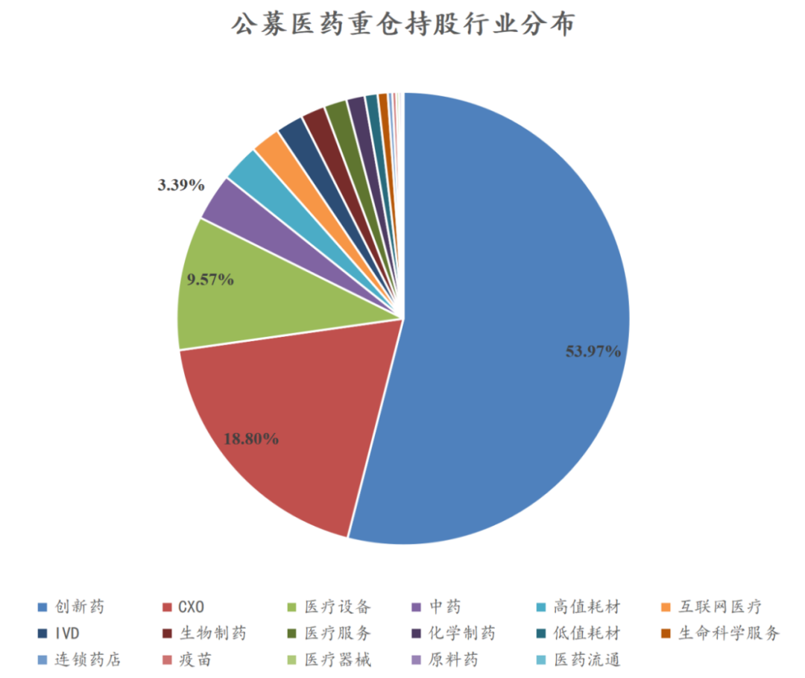
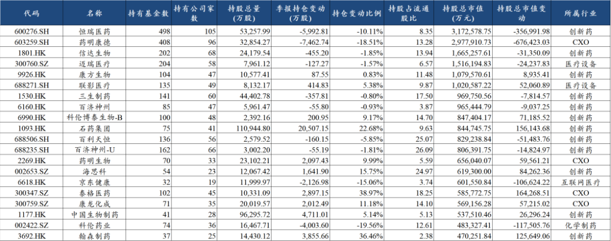
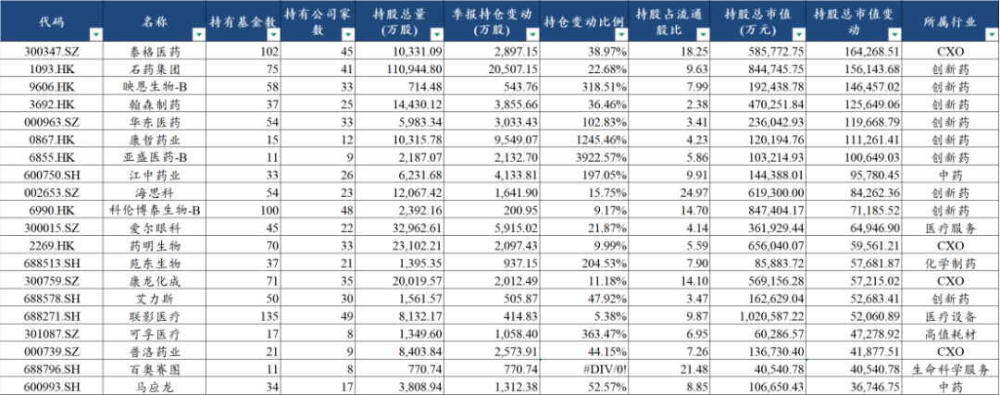
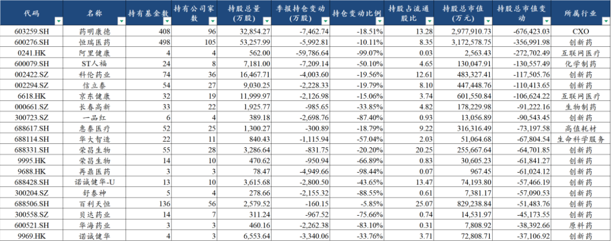

# 3000亿医药持仓，公募在买什么？

大家好，我是龙哥。

大家都知道，去年公募基金不论是医药基金还是非药基金，在创新药及产业链上的持仓比例都非常集中，尤其是药基的持仓已经比较极致，这里我们基于公募基金的前十大重仓股（完整持仓需要到3月披露），来看一下公募基金截至2025年底对医药股的持仓情况，尤其是在2025年Q4的调仓方向。

截至2025年12月31日，公募基金的前十大重仓股合计持有322家医药公司，合计持仓市值是3165亿元，其中重仓市值前10的公司合计公募持股市值为1506亿元、占比47.6%，前20的公司合计持股市值2122亿元、占比67.0%，前30的公司合计持股市值2439亿元77.1%，前50的公司合计持股市值2776亿元、占比87.7%。

1、重仓股细分行业分布

行业分布来看，创新药、化学制药、生物制药、CXO、生命科学上游等创新药及产业链公司合计持股比例是76.5%，仍处于比较集中和极致的持仓水平，其中创新药持仓比例53.97%，CXO持仓比例18.80%，二者合计占73%。

医疗器械板块的持仓比例合计是15.39%，其中主要是医疗设备板块的持仓比例达到9.58%，迈瑞和联影两家贡献了绝对大头。

互联网医疗板块的持仓比例是2.12%，主要是京东健康贡献了绝大部分。此外中药板块持仓比例3.39%，医疗服务持仓比例1.63%，连锁药店持仓比例0.32%。

总体医药前十大重仓股净减仓47亿，细分行业调仓来看，互联网医疗的减仓规模最大，行业净减仓37亿，CXO净减仓的规模其次，行业净减仓25.5亿，创新药及化学/生物制药净减仓18.8亿，中药净增仓20亿，医疗器械净增仓10亿。

2、前20大重仓股

公募重仓前20的医药公司中，包括13家创新药、4家CXO、2家医疗设备和1家互联网医疗。

恒瑞医药和药明康德两大创新药、CXO龙头公司的持股市值都达到300亿元左右，但两家公司的持仓数量环比均有双位数的下滑，龙头公司显示四季度公募呈现减仓创新药及CXO的趋势，恒瑞医药被减仓了接近6000万股，药明康德被减仓了接近7500万股，两家公司合计被减持了超过100亿元。

公募重仓创新药公司中，信达生物、三生制药、百济神州、百利天恒等公司也都有不同程度的减仓，而被加仓的主要是石药集团、科伦博泰、海思科、翰森制药、华东医药等。

迈瑞医疗和联影医疗两家设备公司持仓市值仍然靠前，从其持仓机构的情况来看，几乎是以ETF基金持仓为主，例如联影医疗合计100亿元的公募持仓中，3个科创板50ETF持有超过50亿元，华宝中证医疗持有19.1亿元，主动基金持有的非常少。

互联网医疗领域的京东健康，主动管理基金持有比较多的主要是易方达，易方达蓝筹精选持有15.8亿元，这也是明星基金经理张坤的主力产品，该基金规模从巅峰的900亿缩减到现在的300亿，2023-2025年连续3年大幅跑输指数和偏股混合基金行业平均水平，京东健康是其第9大重仓股，25年四季度大幅减仓了46%的京东健康持仓。

3、增持金额前20大重仓股

四季度公募基金增持的公司相对分散，创新药还是在数量和金额上占比较高，结构上有一些调整。

CXO板块，上文提到四季度药明康德被大幅减持，但与之对应的是泰格医药、药明生物、康龙化成、普洛药业、普蕊斯等，在去年高景气CDMO赛道以外的方向，在四季度被显著增持，不仅是药明康德，包括药明合联和皓元医药在Q4也都被减仓，公募似乎在四季度从估值合理或偏高的外需高景气方向往受益于创新药行业高热度下景气度修复的内需CXO细分领域切换。

创新药方面，增持金额较多的包括石药集团——小核酸领域布局较为领先的pharma，映恩生物——ADC领域26年有较多研发进展的小龙头，翰森制药——首个几乎完成创新转型、但流通盘非常小的头部pharma，华东医药——GLP-1赛道布局较为全面的二线公司、传统降糖药龙头。

消费医疗领域四季度被增持的还是不多，不过爱尔眼科在四季度持仓数量增加了22%，ETF和主动管理基金均有不同程度的增持，中欧基金有6个产品新进前十大重仓股或大笔增持，合计持股超过5000万股，增持超过4000万股，贡献了爱尔眼科接近6000万股增仓里的大部分。

4、减持金额前20大重仓股

四季度公募基金减持的公司，以创新药、CXO和互联网医疗为主。

除了上文提到的药明康德和恒瑞医药外，互联网医疗的两大龙头公司京东健康和阿里健康都被减持，京东健康上文提到主要是易方达张坤的产品减持，阿里健康则是几乎被清仓，但随后阿里健康在AI医疗主题炒作下，26年开年9个交易日暴涨50%+，公募全卖完了未必是坏事......

制药板块，人福医药由于涉及前大股东的资金占用和财务造假，最终还是被ST，因此被公募基金大笔减仓，预计需要1年左右的时间摘帽，可能在26年底到27年初。

A股创新药标的科伦药业、信立泰、长春高新等传统pharma被减持较多，长春高新面对长效生长激素大幅降价和行业竞争增加，公司也在积极的改变其在投资人心目中的定位，希望从一家生长激素公司转变为一家创新药公司。

科伦药业实际上没有太多变化，甚至科伦博泰在四季度还被增持，集团控股公司分拆核心资产导致的结果我们已经多次强调，科伦博泰的市值早已超过科伦药业，现在微创机器人的市值也超过微创医疗。未来，分拆的公司越多，大家会看到越多此类的案例，也会让更多投资人明白集团控股公司的各业务板块市值加总的算法大多都是低估值陷阱。

......

从2020年开始我们就时常给大家分析公募基金持仓和南下/北上资金持仓情况，这些资金通常被认为是“相对聪明”的资金，但也要辩证的看待，公募买的多不一定是好事，公募卖光了也不一定是坏事，核心还是从其调仓背后分析逻辑和产业趋势，公募对某些方向的密集的调仓还是会一定程度上反映核心机构们对产业趋势、估值的大致判断。

同时，如果发现被大幅减仓、但产业逻辑又比较通顺、公司基本面向好的公司，反而是给了好的买点。

以上展示了部分公司的增减持情况，完整数据也可以免费分享给大家，公众号主页发送“公募”即可获得完整文件。

风险提示：本文仅讨论行业/公司经营情况，投资需综合考虑公司经营、估值、管理层等多方面因素，建议读者审慎参考，本文不作为投资依据，不建议大家根据本文做出投资计划。

<!-- wxmp-comments-begin -->

---

## 留言（18 条，含回复共 38 条）

- **像小强一样活着** 👍2 · 2026-01-26 11:52
  老师人福重仓怎么办？
  - ↳ **作者** · 2026-01-26 12:00
    有耐心就等到27年上半年摘帽，没耐心就....自行处置呗
- **王宁** 👍2 · 2026-01-26 12:07
  诺泰也是，被st影响太大了，小市值都起飞了，就它最拉垮。啥时候能摘帽啊
  - ↳ **作者** · 2026-01-26 12:08
    ST之后摘帽起码1年，还要看整改的效果，没其他大问题的话满1年可以提交申请摘帽
- **Rain** 👍2 · 2026-01-26 12:07
  老师最近创新药跌的逻辑是什么
  - ↳ **作者** · 2026-01-26 12:09
    交易层面来说，如本文所言，就是机构持仓过于集中了，今年来创新药以外的主题热点又比较多，可能呈现的就是创新药资金净流出到其他热点板块。
  - ↳ **作者** · 2026-01-26 13:38
    医药基金里高度集中，没有外部增量资金的情况下，往其他细分领域切，自然导致创新药的资金流出。
- **迷雾** 👍1 · 2026-01-26 12:01
  龙哥，诺泰生物怎么看，3月份减肥药专利到期，你觉得诺泰的机会大不大
  - ↳ **作者** · 2026-01-26 12:05
    司美国内的专利应该是延期到2027年到期了。
- **刻舟求剑录** 👍1 · 2026-01-26 12:15
  医疗器械真难受，南微、联影、心脉，只能再加点etf了，个股不动了。
  - ↳ **作者** · 2026-01-26 13:42
    南微医学我上周刚去南京调研过，公司海外还是很不错的，国内短期有一些集采的影响，可能在今年下半年看到国内业务拐点吧，海外估计今年双位数以上增长还是有的，海外的利润水平也好。
- **Lin** 👍1 · 2026-01-26 12:46
  龙哥 有个笔误：恒瑞和百济的市值都达到3000亿
  - ↳ **作者** · 2026-01-26 13:33
    持仓市值300亿，不是指的总市值哈
- **廖书豪** · 2026-01-26 11:58
  泰格走的太臭了，这么通畅的逻辑不知道年报要玩个什么大的[捂脸]
  - ↳ **作者** · 2026-01-26 12:02
    几个二线的CXO走势还挺接近的，我觉得也不是说泰格一家年报业绩会怎么样，他Q4大概率也不会多差，年报业绩应该不会有什么大的风险。
- **东** · 2026-01-26 12:01
  龙哥，有关注英科医疗呢
  - ↳ **作者** · 2026-01-26 12:04
    英科医疗有啊，主营业务是没啥问题的，就是他这个国内举债、现金不结汇留在美国吃利息的操作，财务风险敞口有点大，人民币兑美元又在快速升值。
- **妙蛙** · 2026-01-26 12:28
  最近应该是流动性问题，做个小小过山车
  - ↳ **作者** · 2026-01-26 13:41
    医药以外，其他板块不论是业绩还是宏大叙事都很强，流动性也会抽医药，港股还会有个影响，是近期人民币汇率升值，港币是跟美元的，也会被抛售。
  - ↳ **作者** · 2026-01-26 23:42
    港元是和美元挂钩的，我给你举个例子，假如我告诉你未来三个月港元/美元兑人民币汇率会再贬值5%，那你现在持有港元资产还是人民币资产？
- **开心最好** · 2026-01-26 12:43
  创新药强烈看好小核酸药物
  - ↳ **作者** · 2026-01-26 13:40
    现在所有人都强烈看好小核酸，核心标的还没上市，炒的基本都是I期临床或者临床前的项目，未来还是风急浪高的。
- **老宋** · 2026-01-26 12:51
  老师，重仓君实生物啊[流泪][流泪][流泪][流泪]
  - ↳ **作者** · 2026-01-26 13:39
    君实现在也是尴尬的，没有重磅管线的出海，国内的商业化做的不错也给不上高估值。
- **莫子** · 2026-01-26 12:54
  恒瑞医药要不要割？[捂脸]
  - ↳ **作者** · 2026-01-26 13:33
    恒瑞现在走的就类似一个A股创新药ETF
- **davi** · 2026-01-26 12:59
  华海几乎是清仓式减仓，是要暴雷吗，这么不看好
  - ↳ **作者** · 2026-01-26 13:32
    一直反复传BD，最后荣昌落地BD，IO双抗没授权出去，去年炒创新药那波大部分不就跌回去
- **賈星星** · 2026-01-26 13:11
  再鼎被清仓了
  - ↳ **作者** · 2026-01-26 13:31
    嗯，再鼎的持仓比较少了，君实，康诺亚，贝达，荣昌也都被减的比较多
- **秋天** · 2026-01-26 13:21
  龙哥，怎么看待爱博的跨行收购行为？
  - ↳ **作者** · 2026-01-26 13:29
    这种并购给人的感觉不太好，给人的感觉就是眼科实在没得拓展了，只能去做跨界并购。
- **🇲 🇮 🇸 🇸ོ 🇼** · 2026-01-26 13:44
  老师，恒瑞医药呢，高点刚回本，想着在涨涨，结果喜提九连阴[捂脸]
  - ↳ **作者** · 2026-01-26 13:47
    他这个一堆小阴线确实挺离谱的
- **气宇轩昂** · 2026-01-26 23:25
  龙哥，请问乐普医疗最近集采中标的一批耗材价格低于预期吗？公司应该还有百分之四十的毛利率吧？谢谢
  - ↳ **作者** · 2026-01-26 23:42
    符合预期吧，药物球囊是吧
- **无涯之境1** · 2026-01-30 08:26
  龙哥，这些增仓减仓前20的数据，哪里可以查呀？谢谢
  - ↳ **作者** · 2026-01-30 08:31
    【龙谈价值2023】公众号[社会社会]

<!-- wxmp-comments-end -->
