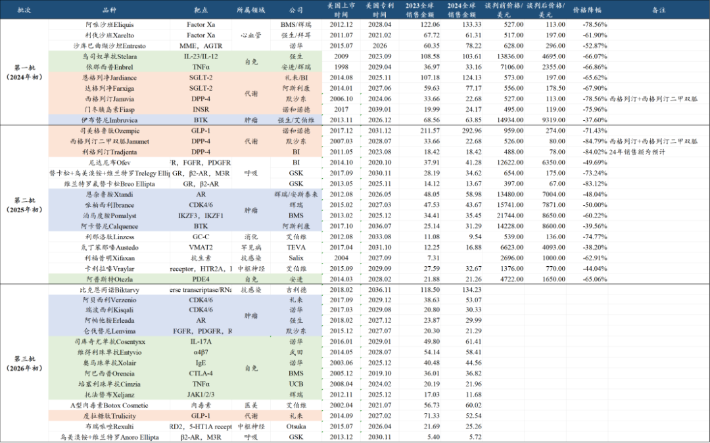
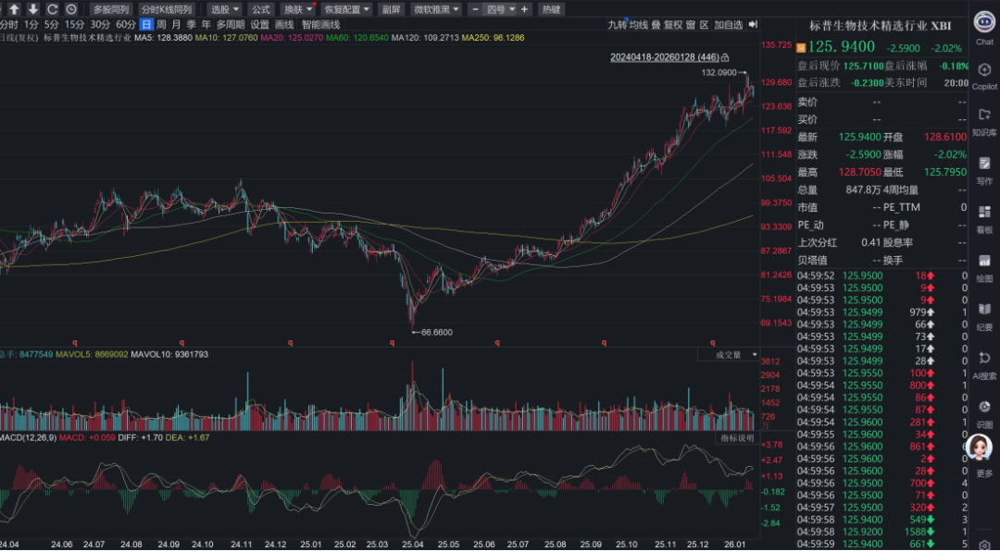
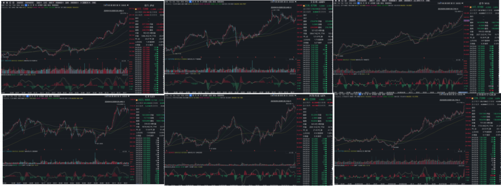
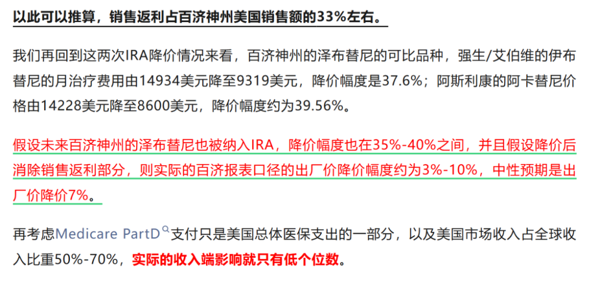
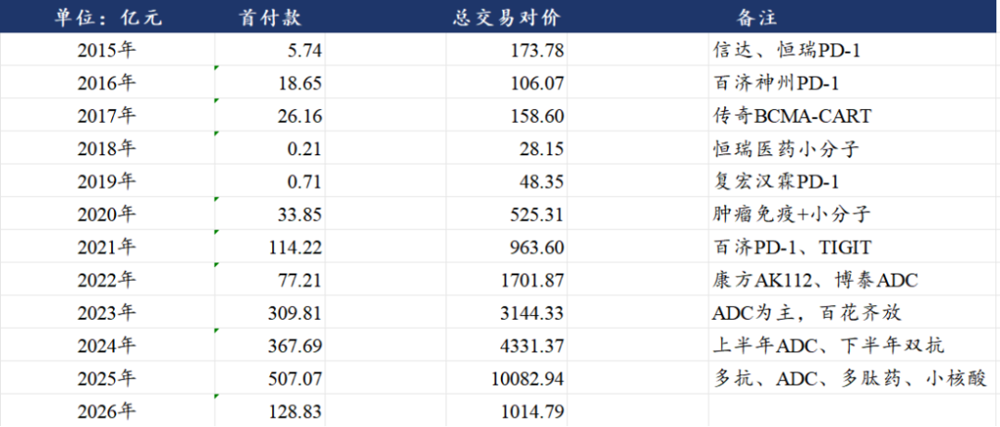

# 医保砍价，股价历史新高

大家好，我是龙哥。

近日，美国医疗保险与医疗补助服务中心（CMS）公布了其第三批药品价格谈判的目录，本次再次纳入15款药物，加上第一批的10款药物和第二批的15款药物，合计是40款药物，这40款药物在2024年的全球销售额合计为2020亿美元，以此推算预计占美国市场创新药销售的比例达到20%。

这15款药物包括：

- ①全球最大的抗HIV药物——吉利德科学的比克恩丙诺，预计25年全球销售额超过140亿美元；
- ②肿瘤领域的4个小分子靶向药，包括卖的很火的两款二代CDK4/6抑制剂和一款二代AR抑制剂；
- ③自免领域多个临近专利期的大品种，60亿美元+的司库奇尤单抗，60亿美金+的维得利珠单抗，40亿美金+的奥马珠单抗；
- ④GLP-1第二款被纳入的大品种——礼来的度拉糖肽，近年受到司美和替尔泊肽的冲击而下滑，但25年预计仍有超40亿美元销售额；
- ⑤艾伯维超60亿美元销售的大品种A型肉毒素，专利早已到期，但销售依然坚挺。

按照美国通胀削减法案（IRA）的规划，2027-2029年还将每年选择20个药品进行价格谈判，2024-2029年合计将对100个销售规模靠前的药品进行价格谈判降价，从而大幅降低医保对药品的支付成本。

前两次IRA法案的药品价格谈判已经完成，第一批10个品种在2024年初公布名单、2024年8月完成价格谈判，降价幅度37.6%-78.6%，平均降价幅度65.2%，第二批15个品种在2025年初公布名单、2025年11月完成价格谈判，降价幅度38.2%-84.8%，平均降价幅度61.9%。

作为对比，2020-2024年我国创新药国家基本医保目录价格谈判的平均降价幅度分别是53.8%、61.7%、60.1%、61.7%、63.0%，降价幅度基本在60%出头的水平，和美国药品价格谈判降价幅度差不多。

我们此前多次给大家分析过美国IRA法案，总有读者看到“降价”两个字就应激——过去几年国内市场药品降价导致股价下跌的心理阴影，认为美国创新药市场以及国内创新药出海的逻辑都要崩，结果，美股的标普生物科技指数XBI底部起来直接翻倍。

创新药biotech公司可以不被纳入IRA，那美股的MNC是不是都崩溃了？

- 诺华接近百亿美金的超级大药诺欣妥被纳入IRA，是不是要完了？诺华2025年初以来股价累计上涨57%，创历史新高。
- 阿斯利康达格列净和阿卡替尼两个合计销售超百亿美金的药物被纳入IRA，是不是要完了？阿斯利康2025年初以来股价累计上涨45%，创历史新高。
- 强生百亿美金的乌司奴单抗、大几十亿美金的伊布替尼和利伐沙班、30亿美金的阿帕他胺都被纳入，是不是要完了？强生2025年初以来股价累计上涨62%，创历史新高。
- 艾伯维合计超百亿美金销售的4个大品种被纳入，是不是要完了？艾伯维2025年初以来股价累计上涨28%，创历史新高。
- 吉利德科学占收入50%的比克恩丙诺都纳入了，这回总归得跌了吧？2025年初以来累计涨幅55%，创历史新高，近一周甚至还加速上涨。
- 更不用提接近200亿美元的药品被纳入IRA法案的礼来，也是股价创历史新高，也是史上首个市值突破万亿美元的药企。

这完全颠覆国内很多医药投资人的认知，怎么药品大幅降价，股价还能加速上涨？

我们认为，其原因有几个方面，有的此前已经给大家分析过，主要是：①价格下降大部分是中间渠道承担，出厂价受影响不大；②IRA法案选择的大多是上市时间比较久的药物，已经达峰或者接近达峰，距离专利到期时间已经不远的；③大幅削减渠道价差之后，医保可以节约更多资金，提高资金利用效率，未来有望支付更多创新药。

①削减渠道价差：

我们在去年3月份和11月份的两篇文章有大致介绍，以当时对百济神州的泽布替尼的测算为例大家可以更直接的感受到：

总体来说就是，出厂价口径的确有可能会有点影响，但绝大部分的降价还是销售返利等各种中间渠道承担，因此实际对药企的影响相对可控，对药企来说影响长期收入利润和估值的核心矛盾还是后续持续推出重磅新药。

②临近专利到期品种：

IRA法案选择品种的原则，是上市时间比较久、专利期相对临近的品种：

- IRA法案2024年初选择的第一批药物，上市时间在1998年到2015年时间，都是上市时间满10年的药物，专利到期时间从2021年到2028年不等；
- 2025年初选择的第二批品种，上市时间在2004年-2017年不等，专利到期时间在2020-2036年不等，但大部分是在2030年前后到期；
- 2026年初选择的第三批品种，上市时间从2003年到2018年不等，专利到期时间在2019-2036年之间，除比克恩丙诺外的品种的专利到期时间都是2030年之前。

以上品种除了诺华的CDK4/6抑制剂瑞波西利以外，历经8-10年以上的销售放量期，绝大部分都已经达峰或者接近达峰，这与国内在放量初期直接医保大幅降价还是有较大区别。

这些品种原本就接近专利到期时间，从选定品种到谈价需要几个月到一年的时间，实际执行是在2年后，也就是2024年初选定的品种到2026年初才开始执行，本次2026年初选定的品种要到2028年开始执行，届时其中已经多个品种专利到期，而专利到期后本身就会面临专利悬崖。

③提高医保资金利用效率：

现在看创新药的很多新读者可能不了解，过去几年全球医疗健康领域市值最大的上市公司曾经是联合健康，联合健康收入维持了30年的正增长，2016-2023年利润端维持了8年的双位数增长，收入规模超过4000亿美元，比一众药械公司高出一个数量级，巅峰市值5600亿美元，一家保险公司的市值超越一众创新药和医疗器械公司，比那时候的中国所有创新药公司市值总和还高出一倍有余。

IRA推出的这近一年多，叠加其他事件的影响，联合健康股价腰斩不止，反倒是推动了头部MNC的市值屡创新高，政府医保支出可以更高效的用在患者端，意味着未来潜在支付给药械企业的费用可能非但不会减少，反而还会持续增加。

......

最后总结一下，美国药品降价是必然趋势，过去的药品价格虚高非常明显，医保承受了不该承受之重，纠偏后美国市场仍然是非常优质的创新药械市场。

国内创新药出海进入美国市场仍在如火如荼，开年仅不到一个月的时间，创新药海外BD达到超千亿规模、拿到129亿元首付款。

行业内的一些问题客观存在《[创新药投资困难的事](https://mp.weixin.qq.com/s?__biz=MzkyMzQ3MDc3Mw==&mid=2247485454&idx=1&sn=36c6f31397c2d7f59490f158415c2bcc&scene=21#wechat_redirect)》，行业短期表现确实也远不及其他高景气的板块，对于我们创新药投资人来说，现在是属于“垃圾时间”、但确实不算“艰难时刻”，我们熬过2021-2024年的创新药寒冬，行业已经回不去了。

创新药的高风险、高波动的特点决定了其绝对不是一个能给人“稳稳的幸福”的行业，但创新药有其独有的魅力，还是我们那句老话，行业良性、可持续的发展，需要企业、监管部门、以及我们投资人共同的努力。

......

1月底了，按惯例每个月底开一次赞赏，虽然每个月赞赏金额不多、并且和行情高度挂钩，但多少也算是一个月分享文章的一个读者的“月度评价”。

本次赞赏任意金额的读者，可以赠送2022-2025年全球药品销售额数据、IRA法案药品清单，需要的读者可以私信留下邮箱。

......

近期重点文章：

[医药行业2026，继往开来](https://mp.weixin.qq.com/s?__biz=MzkyMzQ3MDc3Mw==&mid=2247485469&idx=1&sn=51560c124ea3a20e1624cd73474f43a5&scene=21#wechat_redirect)

[3000亿医药持仓，公募在买什么？](https://mp.weixin.qq.com/s?__biz=MzkyMzQ3MDc3Mw==&mid=2247485578&idx=1&sn=6aff19641d4fa9aba443d196381f0fb5&scene=21#wechat_redirect)

[BD交易之后，创新药下一个爆点](https://mp.weixin.qq.com/s?__biz=MzkyMzQ3MDc3Mw==&mid=2247485517&idx=1&sn=4165772f7153d7557d469892fbced90b&scene=21#wechat_redirect)

[史上最精彩创新药价格谈判](https://mp.weixin.qq.com/s?__biz=MzkyMzQ3MDc3Mw==&mid=2247485497&idx=1&sn=5aae73398eb3f5189849cadf9b0b34b9&scene=21#wechat_redirect)

风险提示：本文仅讨论行业/公司经营情况，投资需综合考虑公司经营、估值、管理层等多方面因素，建议读者审慎参考，本文不作为投资依据，不建议大家根据本文做出投资计划。

<!-- wxmp-comments-begin -->

---

## 留言（15 条，含回复共 31 条）

- **光头的复利人生** 👍2 · 2026-01-29 18:05
  把你的阅读量做成一条曲线，跟创新药板块走势拟合一下[旺柴]
  - ↳ **作者** · 2026-01-29 18:11
    我之前大致对比了一下，公众号阅读量会大概滞后板块行情1-2个月
- **希希** 👍1 · 2026-01-29 16:58
  龙哥，创新药什么时候能崛起啊，受了半年，亏死了
  - ↳ **作者** · 2026-01-29 17:07
    你是10月份关注的，差不多就是创新药行业去年最高点附近的位置，这半年确实会比较痛苦，实际上我不少新读者都是6-10月新关注的，但从8月份之后买的基本都比较难赚钱。
- **兔子的蔡** 👍1 · 2026-01-29 17:11
  龙大，维立志博最近利好出尽了吧，还是说可以看长远一点？[破涕为笑]
  - ↳ **作者** · 2026-01-29 18:03
    今年上半年PD-L1*4-1BB双抗会读出一些2期数据，可以关注一下。另外就是3月9号进通。
- **·** 👍1 · 2026-01-29 17:21
  医疗器械什么时候才能起来[流泪]
  - ↳ **作者** · 2026-01-29 18:09
    这个之前其实说过多次了，行业政策拐点到出海爆发和基本面拐点再到股价拐点，中间肯定有迟滞，现在这个阶段是先看少量个股，随着基本面拐点的器械公司越来越多，逐渐形成板块效应。
- **尹** · 2026-01-29 16:57
  龙大： 心脉医疗留言从来没提到过，心脉前景如何？ 和微众哪一个更有期待
  - ↳ **作者** · 2026-01-29 17:05
    你是取消关注又重新关注的吗，为什么上周才关注的，就留言18次......
    心脉医疗这两年提的少，其实也不是说心脉提的少，主要是所有国内为主的器械公司都提的少，器械的出海和创新药不同，相对更加循序渐进一点，不像创新药的出海是爆发式的，所以大部分器械公司虽然都在谋求出海，但海外收入的放量往往没那么快，有部分市场容量大的细分赛道放量比较快的，是去年以来我们相对看好的。
    心脉医疗本身出海也是没那么快的，叠加国内这两年还是陆续有集采的影响、管理层的变动，多方面的基本面的扰动。
- **知行** · 2026-01-29 17:00
  1061037382@qq.com，谢谢龙哥
  - ↳ **作者** · 2026-01-29 21:26
    已发送
- **廖书豪** · 2026-01-29 17:01
  泰格又提前抢跑，这个业绩请问龙哥是靴子落地了吧，不算miss了？除了现金流基本业绩拐点就在一季度了
  - ↳ **作者** · 2026-01-29 18:07
    额，说不上靴子落地吧，因为之前回调确实有读者问是不是业绩有雷，我也说了业绩应该不会有什么雷，只是你短期这个市场交易节奏他就是这样的，咱也把握不了这么短的波段，看2026全年我认为确定性会高一些。
- **李志柯** · 2026-01-29 17:05
  真心希望能一直这样写下去，给我们信心。
  - ↳ **作者** · 2026-01-29 18:05
    也希望我的读者能对行业有深入的理解，不需要我给信心也能在这个行业有好的投资成果
- **JMTerry** · 2026-01-29 17:15
  泰格的Q4有点还没起来
  - ↳ **作者** · 2026-01-29 18:02
    泰格Q4收入恢复大幅增长，扣非利润转正，25年新签订单双位数增长，还可以吧
  - ↳ **作者** · 2026-01-29 18:34
    [撇嘴]怪我预期太高
- **随遇而安的懒鬼** · 2026-01-29 17:24
  想请问一下龙哥，手术机器人有可能未来几年大规模普及应用么？
  - ↳ **作者** · 2026-01-29 17:54
    国内市场，政策面是有改观的，后面几年装机量还是有可能会提升的，就目前来说海外发展势头正盛，市场也够大，国内也不是非做大不可的
- **吴志华** · 2026-01-29 17:50
  龙哥，之前的号就关注了，光这个号看什么时间关注的不准吧？
  - ↳ **作者** · 2026-01-29 17:53
    是的，我知道的，换号的那个时间关注的基本都是老号最早的读者了，你这个时间就是，感谢一直以来的支持[抱拳][抱拳]
- **星移无痕** · 2026-01-29 18:14
  创心药到底是个啥登呢？小登涨它跌，老登涨它还跌[尴尬][尴尬]
  - ↳ **作者** · 2026-01-29 18:14
    中登
- **谢群** · 2026-01-29 21:53
  龙哥好！诺诚建华业绩出来了，首度扭亏为盈，但看了一下大部分都是BD收益，这个算不算主营业务，不太超预期啊，高位下来快腰斩了[尴尬][尴尬][尴尬]
  - ↳ **作者** · 2026-01-29 22:00
    奥布替尼的销售大概就这些，q4大概接近4个亿，CD19有一点点，其他8个多亿基本就是给Zenas的BD收入了，确实算不上超预期。
- **猎头张梅娜13289806201** · 2026-01-30 10:33
  794506439@qq.com 谢谢龙哥
  - ↳ **作者** · 2026-01-30 16:12
    已发送
- **子夜蓝** · 2026-01-30 17:44
  龙哥，药明合联合理估值多少？一直这么跌跌不休，是不是大家都对李割失望了？我都想放弃药明系了，投了几年，每次业绩好点，就减持
  - ↳ **作者** · 2026-02-01 17:36
    他短期主要是25年年报业绩miss，所以先杀了一波估值，和李哥减持没太大关系， 李哥对药明生物这边就是要清仓减持的，不用报啥期待，清仓减完了反而是好事

<!-- wxmp-comments-end -->
