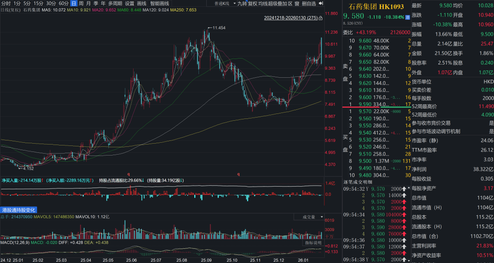
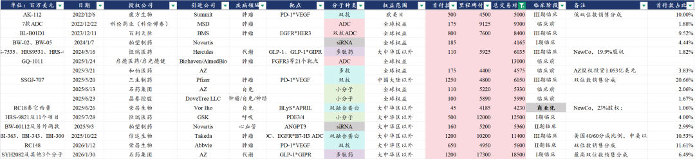
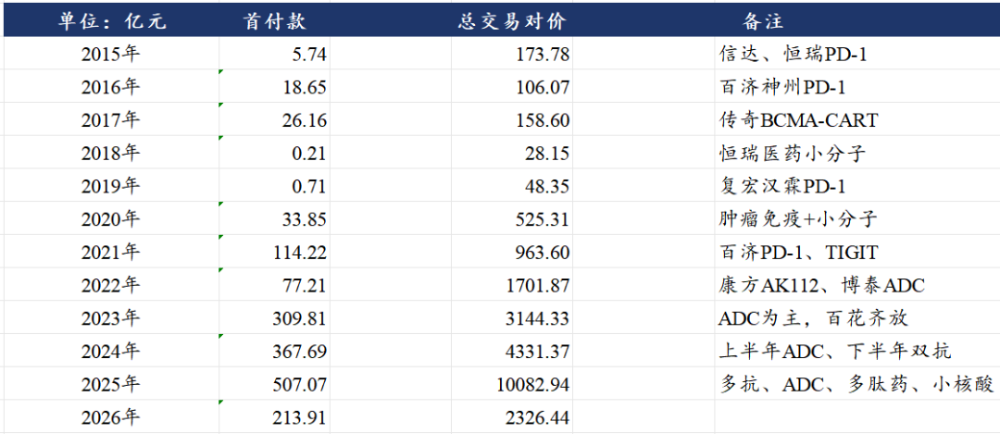
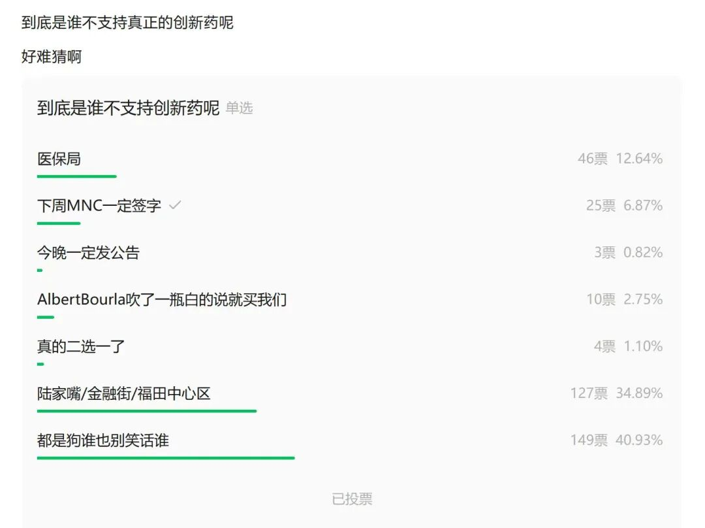

# 一定要把医药弄到狗都不玩吗

2026年1月30日早，石药集团公告与阿斯利康就创新长效多肽药物开发签订战略合作与授权协议，石药集团利用专有的缓释给药技术平台及多肽药物AI发现平台，开发创新长效多肽药物，石药集团将于阿斯利康在创新多肽分子的发现和长效递送产品的开发方面开展全面战略合作。

阿斯利康获得石药每月一次注射用体重管理产品组合的全球独家权利，包括SYH2082（长效GLP-1R/GIPR月制剂）以及3个临床前阶段减重药，阿斯利康获得大中华区以外权益独家授权。

石药集团获得12亿美元首付款、不超过35亿美元研发里程碑付款、不超过138亿美元销售里程碑付款、最高双位数销售分成。

《[创新药投资困难的事](https://mp.weixin.qq.com/s?__biz=MzkyMzQ3MDc3Mw==&mid=2247485454&idx=1&sn=36c6f31397c2d7f59490f158415c2bcc&scene=21#wechat_redirect)》

①一定要让全行业都知道医药全是蹲狗、出利好就把筹码都给你？

②内幕消息泄露和内幕交易到底查不查？

③医药买方卖方还得继续出清？

风险提示：本文仅讨论行业/公司经营情况，投资需综合考虑公司经营、估值、管理层等多方面因素，建议读者审慎参考，本文不作为投资依据，不建议大家根据本文做出投资计划。

<!-- wxmp-comments-begin -->

---

## 留言（26 条，含回复共 46 条）

- **柳钟瀚** 👍37 · 2026-01-30 10:10
  全是内幕，BD落地盘面暴跌，让出海订单成为负反馈，难怪这板块被全基抛售，都是公司跟勾兑盘自己作死
  - ↳ **作者** · 2026-01-30 10:12
    全基对医药的持仓一共还剩3%，创历史新低，医药蹲狗自己玩好了。
- **Ron** 👍26 · 2026-01-30 10:18
  大盘都4000点成交量3万亿了，部分板块开始玩自己左脚踩右脚飞升太空了；医药这边还在玩“我预期你的预期”“我预期你预期我的预期”的0和博弈游戏呢
  - ↳ **作者** · 2026-01-30 10:20
    确实，产业发展没太大问题，这种交易层面的预期你的预期、交易你的交易，就无语
- **荔枝酱** 👍16 · 2026-01-30 10:20
  龙哥，转行吧，医药太狗了
  - ↳ **作者** · 2026-01-30 10:23
    [叹气]
- **小鱼** 👍13 · 2026-01-30 10:09
  狗都不信里面消息没有提前透露
  - ↳ **作者** · 2026-01-30 10:10
    一早上被震惊两次，盘前被震惊临床前和I期的项目能签这么大的deal，开盘后被震惊这都能砸10%。
- **A随风** 👍8 · 2026-01-30 10:10
  石药跌停了，别吹了。垃圾药。
  - ↳ **作者** · 2026-01-30 10:12
    这篇文章一共三百个字，你告诉我，我哪一句话吹了？
  - ↳ **作者** · 2026-01-30 10:18
    我说的是药，不是说你吹，大A没有价值投资，业绩好也没用，反正就是不涨。
- **zhaowz** 👍7 · 2026-01-30 10:37
  中长期还是看好港股创新药
- **姑妄听之** 👍7 · 2026-01-30 11:18
  不把大家洗下去，怎么进场
- **希希** 👍6 · 2026-01-30 10:09
  龙哥，石药今天跌麻了[流泪]
  - ↳ **作者** · 2026-01-30 10:11
    [裂开]
- **rivers** 👍6 · 2026-01-30 10:21
  风气肯定是大资金带坏的，上梁不正下梁歪。小散户哪有那么多消息渠道
  - ↳ **作者** · 2026-01-30 10:24
    那肯定咯，小散更多是今天早上得到消息来接的
- **迷世小书童** 👍6 · 2026-01-30 10:43
  别怕，我来接一手盘，稳住。
- **旅行到地球的边缘** 👍5 · 2026-01-30 10:38
  医药不是还可以吗？医疗器械才踏马狠，被套好久了
- **Ak** 👍5 · 2026-01-30 11:17
  这不正给机会上车吗
- **刻舟求剑录** 👍5 · 2026-01-30 12:11
  继续定投指数，这里买起码不是山顶资本，顶多几年河谷资本，说不定一年时间都不要。
  - ↳ **作者** · 2026-01-30 12:23
    有几点：
    1) 创新药是不亚于AI的投资主体，人类追求更健康长寿一直没变过；
    2) 市场流动性充足，美元降息周期基本明确，美股标普生物指数已创新高；港A头部公司也很优秀。 
    3）筹码交换阶段，砸出黄金坑。
- **迷雾** 👍4 · 2026-01-30 10:13
  龙大，诺泰生物和人福医药你比较看好哪一只
  - ↳ **作者** · 2026-01-30 10:15
    主要是，为什么一定要在ST里挑[捂脸]
    人福医药我之前回复过，今年底摘帽的估值修复还是有可能的，至于有没有大的机会还是得看他的管线有没有新的看点，如果有的话，摘帽之前可能会写一篇。
- **cosγ** 👍4 · 2026-01-30 10:41
  医药可以的 不过应该买美股 当然美丽国也在集采 但相对而言真的更能用理性来分析。大a这种 我这种差生 不会玩
- **马华磊** 👍3 · 2026-01-30 10:07
  利好就是出货
- **求索者** 👍3 · 2026-01-30 10:20
  看来去年石药没吹牛，诺诚是真吹了[捂脸]
  - ↳ **作者** · 2026-01-30 10:23
    诺诚完全没吹过，公司对外口径从来不说BD规模，市场传假消息。
- **麦兜🌟** 👍3 · 2026-01-30 10:21
  医药最大的问题还是药价的问题，每年持续增加的砍价力度是问题的根本
  - ↳ **作者** · 2026-01-30 10:23
    海外逻辑还是比较顺的
- **老虎** 👍2 · 2026-01-30 11:40
  内幕狗太多，拉黑医药，恶心死了
  - ↳ **作者** · 2026-01-30 11:41
    拉黑医药可以，可以别拉黑我吗[裂开]
- **廖书豪** 👍1 · 2026-01-30 10:18
  哎😑龙哥最近一直在评论区避而不谈的话题，看来现在都忍不住了，越玩越过分现在都不用高开低走了，提前演绎落地成盒
  - ↳ **作者** · 2026-01-30 10:22
    偶尔也被搞的绷不住了，哈哈，创新药行业研究性价比是真的低。
- **峥嵘岁月** 👍1 · 2026-01-30 11:21
  跟港股对内幕交易的监管比起来，a股是更好还是更差呢
  - ↳ **作者** · 2026-01-30 11:23
    其实A股比港股稍微好些，A股的监管总体还是想要保护投资者的，港股完全没有监管，荒野丛林，随便造假、内幕交易、坐庄。
- **wings** · 2026-01-30 10:09
  诺诚建华的业绩，市场不认可？
  - ↳ **作者** · 2026-01-30 10:10
    也不是，主要是，中规中矩，没有超预期
- **墨** · 2026-01-30 11:12
  龙哥，咨询个基础问题，这个deal和新诺威有关系不？石药集团和新诺威创新药业务是怎么区分的？
  - ↳ **作者** · 2026-01-30 11:13
    你看新诺威的公告就知道了，新诺威从中拿35%
- **土土** · 2026-01-30 17:44
  龙哥，我没收到邮件
  - ↳ **作者** · 2026-02-01 17:37
    已发送
- **来去自如** · 2026-01-30 21:04
  假设医保那个洞中长期都会存在，那么就意味着整个板块没有预期，能跑出来的只可能是极少数个股。请教这个观点成立吗？
  - ↳ **作者** · 2026-01-30 21:19
    看看历史文章吧，产业逻辑一直讲的很清楚，没必要回调了就质疑产业逻辑
- **我本无相亦有万相** · 2026-02-02 15:36
  狗不玩我玩[委屈][委屈]
  - ↳ **作者** · 2026-02-02 15:54
    我也玩，快被玩成狗了，哈哈

<!-- wxmp-comments-end -->
