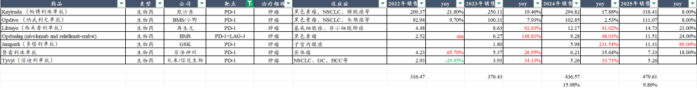
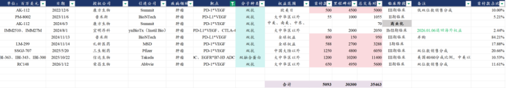

# 超级大药，群雄逐鹿

大家好，我是龙哥。

去年上半年曾用2-3篇文章和大家聊IO双抗领域的进展和投资机会，这是一个大几百亿美元的潜在市场机会——相比PD-1的潜在定价更高、用药周期更长。

在国内的康方、三生、信达、荣昌以及海外的Summit、BMS、辉瑞、AZ、武田、艾伯维等公司引领下，IO双抗也是2025年的创新药行业最重要的主线领域之一，诞生多个牛股，诞生多笔重磅BD交易，并且国内外启动一系列的注册临床，以及有部分数据读出。

近一年间，这个领域的股价也出现较大幅度的波动，尤其是近期，康方、三生等公司回调幅度较大，25年上半年由于板块上涨较快，有个别我们想分享的公司最终文章写好了也没有发出来，因为不想在市场情绪极度火爆的情况下再去添一把火，而在当下，借此板块回调的契机，我们一篇文章全面梳理IO双抗领域过去一年主要的临床和出海方面的进展。

1、BD交易

IO双抗诞生了近1年中全球最重磅的几笔BD中的大部分交易，仅从BD交易的规模，大家就能感受到海外MNC这个领域的预期之高。

①2025年5月20日，辉瑞与三生制药达成合作协议，辉瑞引进SSGJ-707（PD-1\*VEGF双抗）在大中华区以外权益，三生制药将获得12.5亿美元首付款、至多48亿美元开发、监管、销售里程碑付款，以及双位数梯度特许权使用费，后又以1.5亿美元获得SSGJ-707在中国区的商业化权利，并认购三生制药1亿美元股份。

②2025年6月2日，BMS与BioNTech达成合作协议，二者在全球共同开发BNT327（自普米斯收购的PM8002，PD-L1\*VEGF双抗），BioNTech获得15亿美元首付款+20亿美元非或有周年付款+76亿美元开发、监管和商业里程碑付款，总交易对价111亿美元，BMS和BioNTech各50%权益。

③2025年10月22日，武田制药与信达生物达成合作协议，二者在全球共同开发IBI-363（PD-1\*IL-2α双融合蛋白）、IBI-343（Claudin18.2-ADC），以及一款早期开发项目IBI-3001（EGFR/B7-H3 ADC）的选择权，信达生物获得11亿美元首付款、最高102亿美元里程碑付款，以及武田制药对信达生物溢价30%的1亿美元股权投资。对于IBI-363,信达生物与武田制药按照40/60比例共担美国开发成本、共享美国市场利润，且信达生物拥有大中华区及美国以外区域的高双位数梯度销售分成；对于IBI343，武田制药获得大中华区以外全球权益，信达生物可获得高双位数销售分成；对于IBI3001，武田制药获得大中华区以外权益的独家选择权，信达生物可获得中双位数销售分成。

④2026年1月12日，艾伯维与荣昌生物达成合作协议，艾伯维获得RC148（PD-1\*VEGF双抗）大中华区以外权益，荣昌生物将获得6.5亿美元首付款、至多49.5亿美元研发及商业化里程碑付款、双位数海外销售分成。

至此，在IO双抗领域，中国公司对外授权合计达成了356亿美元的交易总包，拿到51亿美元的首付款，而在2025年以来全球IO双抗领域达成的以上4笔交易，合计首付款45亿美元，合计总交易对价342亿美元。

除了以上落地的BD交易，还有多家公司，市场期待的BD交易至今尚未有落地：

海外Summit至今尚未能与MNC进行BD授权或者合作开发或者被收购，Summit从绝对领先的全球第一身位，目前已经逐渐被BMS/BioNTech和辉瑞追赶，在二代IO联用ADC方面更是处于同一起跑线，创新药竞争的残酷也在这里体现，仅仅1-2年时间就被拉平优势，创新药在很多时候都是时间的敌人。

君实生物的JS207、神州细胞的SCTB14、华海药业/华奥泰的HB0025，这三款药物也都在2025年开了II/III期临床，算是国内IO双抗中除了康方、普米斯和三生制药之外进度比较靠前的3家，2025年也先后有传闻有BD临近落地，但至今都没能落地BD交易；三抗领域的基石药业，也暂时还未有BD交易谈成。

此外，2026年1月6日，宜明昂科IMM2510（PD-L1\*VEGF，珀维拉芙普α）海外权益被Instil退回。

2、海外研发进展

①Summit/康方生物：

2025年以来Summit在海外新启动依沃西（PD-1\*VEGF）两项全球多中心III期临床，分别是单药一线治疗PD-L1 TPS＞50%的非小细胞肺癌和联合化疗一线治疗结直肠癌，至今累计启动4项全球III期临床。

其在2025年完成首个海外III期临床——联合化疗二线治疗EGFR TKI耐药NSCLC，并在2026年1月申报上市获得FDA受理，PDUFA时间为2026年11月14日，不过FDA是否会批准该适应症尚存在较大不确定性——全球III期显示OS未达到显著获益。

②BMS/BioNTech/普米斯：

2025年以来BMS/BioNTech在海外启动Pumitamig(PD-L1\*VEGF）5项全球多中心III期或II/III期临床，包括联合白紫一线治疗三阴乳腺癌、联合化疗一线治疗胃癌、联合化疗一线治疗结直肠癌、单药一线治疗PD-L1 TPS＞50%非小细胞肺癌、III期不可切除非小细胞肺癌等，至今累计启动7项全球多中心III期临床。

此外，BioNTech还启动了PD-L1\*VEGF双抗联用ADC的多项II期临床探索，包括联用HER2-ADC、TROP2-ADC、EGFR\*HER3 ADC、HER3-ADC等。

③Pfizer/三生制药：

辉瑞在2025年启动了SSGJ-707（PD-1\*VEGF）两项全球III期临床，分别是联合化疗一线治疗晚期非小细胞肺癌、联合化疗一线治疗转移性结直肠癌。

2026年辉瑞可能还会启动一线子宫内膜癌、联合维恩妥尤单抗（Nectin4-ADC）一线治疗转移性尿路上皮癌等适应症的全球III期临床。

④信达生物：

信达生物在2025年8月启动IBI-363（PD-1\*IL-2α）单药头对多西他赛治疗PD-1/L1及含铂化疗经治的局部晚期或转移性鳞状NSCLC的全球多中心III期临床，这是中国首个主动在海外开启IO双抗注册临床的公司，后在10月将该药物的海外权益授予武田制药。

⑤阿斯利康：

阿斯利康在2025年开始全面推进Rilvegostomig(PD-1\*TIGIT）的全球III期临床，新开了包括联合化疗一线治疗非鳞非小、联合德曲妥珠单抗一线治疗HER2+胆管癌、联合曲妥珠/帕妥珠+化疗一线治疗HER2+胃癌、单药一线治疗PD-L1阳性NSCLC、联合贝伐珠单抗±CTLA-4单抗一线治疗肝癌、联合CMG901（康诺亚的Claudin18.2-ADC）+化疗一线治疗胃癌等6个全球III期临床，目前已经累计启动8项全球III期临床。

另外阿斯利康还在2025年新启动Volrustomig（PD-1\*CTLA-4）的一项治疗宫颈癌的全球III期临床，目前也累计有4项该药物的全球III期临床在开展。

⑥康方生物：

康方生物2025年启动了两项AK104卡度尼利（PD-1\*CTLA-4）的全球III期临床，分别是联合化疗一线治疗HER2-胃癌、联合仑伐替尼治疗阿替利珠+贝伐珠经治的晚期肝癌。

⑦君实生物：

君实生物在2025年启动JS207（PD-1\*VEGF）新辅助治疗II/III期可切除驱动基因阴性非小细胞肺癌的全球多中心II/III期临床。

⑧Genmab：

Genmab的Acasunlimab（PD-L1\*4-1BB）先是被BioNTech退回海外权益，后在2025年12月终止全球III期临床开发。

⑨IO单抗、复方制剂：

罗氏的TIGIT单抗、百济神州的TIGIT单抗、默沙东的PD-1+TIGIT复方、GSK的TIGIT单抗、默沙东的PD-1+LAG-3复方、BMS的LAG-3单抗等在2024-2025年陆续取得全球III期临床失败，几乎全部终止开发。

IO领域在双抗的推动下呈现百花齐放、群雄逐鹿，其中我们看到两点值得欣喜的变化：

- 其一是除了阿斯利康的PD-1\*TIGIT双抗外，其他IO领域取得重大进展的（包括复宏汉霖的PD-L1 ADC），大多是中国公司主导，这对于这样一个大几百亿美金潜在市场的创新药领域来说具有极其重大的意义；
- 其二是即便没有落地BD交易，中国公司里的信达生物、康方生物、君实生物三家头部biopharma也都有勇气自主去海外开启全球多中心III期临床，这需要对产品强大的信心、对执行力的重大考验、以及对庞大海外临床资金的需求，反映的是中国biopharma的跨越式的国际化突破。

3、国内研发进展

①康方生物：

AK104新获批一线宫颈癌适应症，新开胃癌辅助治疗、局部放化疗后序贯治疗III期非小细胞肺癌、两项III期临床，且完成肝癌辅助治疗的III期入组。

AK112新获批单药一线治疗TPS≥1非小细胞肺癌适应症，联合化疗一线治疗鳞状NSCLC适应症申报上市，新启动联合多西他赛治疗IO经治NSCLC、局部放化疗后序贯治疗III期NSCLC、联合化疗±CD47单抗一线治疗胰腺癌、联合化疗一线治疗结直肠癌、联合化疗一线治疗PD-L1阴性三阴乳腺癌5项III期临床，另外联合化疗一线治疗胆道癌完成III期患者入组。

康方生物AK112，2026年将读出HARMONi2、HARMONi6两项国内III期临床的OS结果，对于行业将会有重要影响。

②君实生物：

公司启动联合化疗一线治疗广泛期小细胞肺癌的国内II/III期临床。

③神州细胞：

公司25年启动联合化疗二线治疗EGFR TKI耐药NSCLC的II/III期临床和单药一线治疗TPS≥10%的NSCLC的III期临床。

④华海药业：

公司启动联合化疗一线治疗鳞状/非鳞状非小细胞肺癌的III期临床，此前发布了较为亮眼的II期临床数据，在高于康方、三生的剂量下实现更好的ORR，同时也显示更高的毒性。

⑤宜明昂科：

公司启动IO经治NSCLC的III期临床。

⑥基石药业：

公司CS2009（PD-1\*CTLA-4\*VEGF三抗）启动联合治疗晚期实体瘤的II期临床，并在海外开启II期临床，25年有部分早期数据读出，但由于随访时间较短，数据较为一般，还要关注2026年ASCO上能否有进一步的数据读出。

⑦维立志博：

公司LBL-024（PD-L1\*4-1BB双抗）目前单药3L+肺外神经内分泌癌完成注册II期患者入组，预计最快2026Q3递交上市申请，一线的肺外神经内分泌癌将在2026年启动III期临床。

LBL-024于2025年在非小细胞肺癌读出较好的早期ORR数据，2026年将有进一步的扩大人群的II期临床ORR数据读出，以及26年底可能会有初步的PFS率的数据读出，对于该药物能否从肺外神经内分泌癌和小细胞肺癌拓展到超大适应症——一二线NSCLC具有重要指导意义，将决定该药物的天花板能否打开。

另外，2025年PD-1\*VEGF双抗领域国内又新增两个重磅玩家，一个是恒瑞医药的SHR-4610，虽迟但到，恒瑞的差异化在于其开发的是PD-1\*VEGF双抗皮下注射制剂，是行业首个IO双抗皮下注射制剂，另一个则是复宏汉霖的HLX37。

......

IO双抗领域，不论是中国市场还是全球市场，2025年都是极具里程碑意义的一年，多个在全球创新药BD交易史上留名的重磅交易，一批国内外注册临床大临床的开展，二代IO+ADC的联用探索，多个IO双靶点组合的亮眼数据，这些临床推进和数据读出会在未来几年持续的更新。

2026年，是行业又一个重要的验证期，AK112在一线肺癌的OS数据读出，成败对于全行业都会有较强的指导意义；先驱不一定能赢得全部，但先驱一定值得尊重。

风险提示：本文仅讨论行业/公司经营情况，投资需综合考虑公司经营、估值、管理层等多方面因素，建议读者审慎参考，本文不作为投资依据，不建议大家根据本文做出投资计划。

<!-- wxmp-comments-begin -->

---

## 留言（14 条，含回复共 29 条）

- **将臣** 👍6 · 2026-02-02 13:29
  关键是创新药一直跌跌不休，屡创新低啊
  - ↳ **作者** · 2026-02-02 13:39
    对于我们这样分享行业的公众号来说也很无奈，我们当然也希望行业回调低位的时候让大家多关注、多讨论，行情火热的时候也能少一些发言、多一分理性，但现实是，涨的时候不少读者只是把文章内容作为寻求一个上涨的解释，下跌的时候就是不管你写什么、只要股价跌了，写的就没什么意义。投资从来都是困难的事，我们只能在分享内容的时候尽量不在火热的时候填柴、不在悲观的时候更悲观。
  - ↳ **作者** · 2026-02-02 13:41
    比起您写的专业的分析，我更愿意学习您在评论中体现出来的投资理念。[强]
- **Bryan** 👍3 · 2026-02-02 13:50
  summit跌麻了，这两个月工作太忙了，也没自己盘竞争对手管线追赶进度了；之前也就BioNtech的进度最接近，但走的是PD-L1路线，毕竟不同。杜根挺倔强的，不读三期数据估计也不会二次BD动作了。
- **谢群** 👍2 · 2026-02-02 14:15
  只有科技股见中期大顶，创新药才有希望，大资金来个高低切，买药好过买白酒，是不龙哥[破涕为笑]
  - ↳ **作者** · 2026-02-02 14:34
    大资金也是看产业逻辑的，所谓的高切低从来不是核心矛盾，全市场的AI科技主线如果熄火的话可能就是全市场牛转熊，对大家来说也未必是好事。
- **田霖** 👍1 · 2026-02-02 13:38
  依沃西单抗OS不及预期，海外规模就起不来，只靠国内这点增量杯水车薪啊
  - ↳ **作者** · 2026-02-02 13:53
    今天确实有一些传闻，但我们也确实无从验证，今年我们不会去赌IO双抗的数据，因为我们也看不清，因此更希望看到数据落地的时候去判断产业趋势。
- **锋** 👍1 · 2026-02-02 13:45
  再鼎您怎么看，希望在哪里啊？
  - ↳ **作者** · 2026-02-02 13:51
    再鼎医药的问题，我们此前有文章讨论过，公司25年研发和商业化都出现大幅miss，算是行业里杀估值杀的最狠的biopharma，没有之一。如本文所言，创新药是时间的敌人，再鼎需要把握时间窗口期做出管线出海和国内商业化的大的进展，方能扭转颓势。
- **朴实无华** 👍1 · 2026-02-02 13:54
  我可怜的小恒恒
  - ↳ **作者** · 2026-02-02 13:59
    恒瑞短期确实可怜，一方面是被gjd抛售宽基ETF的影响，另一方面是创新药板块本身偏弱，被双重打击。
- **Wayne** 👍1 · 2026-02-02 14:00
  summit落后看在什么适应症上，本身他就没能力吃下全部。预计在非小鳞癌、直肠癌、低表达和阴性吃下主要份额，这块领先还是绝对优势，其他确实是平起平坐。io 就看104了，这个被低估了，所以公司有绝对的自信，自己干。
  - ↳ **作者** · 2026-02-02 14:03
    现在进度领先主要在肺癌，结直肠癌的进度说不上领先了，和辉瑞差不多的时间开3期，比BMS早两个月，但临床效率和资金实力都明显不如辉瑞和BMS，在一线肺癌可能也会被往回追一追进度。
- **求索者** 👍1 · 2026-02-02 15:23
  哈哈哈，都重点关注半年了，龙哥终于覆盖维立志博[捂脸]
  - ↳ **作者** · 2026-02-02 15:26
    从上市我就一直覆盖的呀，只是非通的公司我一直提的不多罢了，其实大多非通biotech我都看的，维立志博刚好上周和他们聊了聊。
- **水中的鱼** · 2026-02-02 13:35
  老师，九典制药还能拿吗，成本20
  - ↳ **作者** · 2026-02-02 13:43
    大品种公司，核心大品种逻辑被破坏，是很严重的杀逻辑，还是要重视的，洛索洛芬钠凝胶贴膏放开审批的时间，就是典型的核心大品种逻辑被破坏。
- **duofantasy** · 2026-02-02 13:41
  龙大，合联为啥是三兄弟最弱，是都不看好收购吗 还是管理层说的增长预期没了
  - ↳ **作者** · 2026-02-02 13:46
    合联此前估值最高，反映的是最高的成长预期，25年年报业绩预盈低于预期，就会导致短期估值回落，皓元也是类似。从今年来看，药明生物也是值得关注的，双抗的景气度在25年有显著提升，会帮助药明生物的业绩加速，同时药明生物的更换股东，也可能会减轻其地缘政治方面的风险。
- **小勇** · 2026-02-02 13:55
  华海药业有希望不，HB0025的BD有希望不
  - ↳ **作者** · 2026-02-02 13:57
    25年传了很多次BD，也有雪球KOL多次传播消息，可以去问问他们到底什么情况。
- **Luca** · 2026-02-02 14:01
  请问华东医药的DR30206也是PDL1/VEGF三抗，有机会不
  - ↳ **作者** · 2026-02-02 14:05
    30206是PD-L1*VEGF*TGFβ三抗，进临床也有两年半了，目前还没看到重要临床推进和早期数据。
- **ZLLM** · 2026-02-02 14:19
  这里面君实能不能回到四小龙的位置呢？[撇嘴][撇嘴][撇嘴]
  - ↳ **作者** · 2026-02-02 14:33
    我还琢磨了下四小龙是咋回事....PD-1四小龙是吧.....目前看是比较难回到的，目前出海还遥遥无期，临床进度上可以做一些差异化的适应症，但追到一线公司可能会比较难。
- **Andrew Tang** · 2026-02-02 14:26
  SMM 好像在重演当年O 药被K药绝杀的剧本，只不过这次逆袭的可能是BMS/BNT；对于112来说，成也SMM，如果未来败也是吧。
  - ↳ **作者** · 2026-02-02 14:28
    目前来说还只是被追了些进度，还没到被绝杀的时候吧，还要边走边看。
  - ↳ **作者** · 2026-02-02 14:35
    从绝对领先，到平分秋色只用了1年- 甚至联用还被反超了；再BD 再拖下去，很危险了~剩下的、顶尖可BD的MNC 也不多了~

<!-- wxmp-comments-end -->
