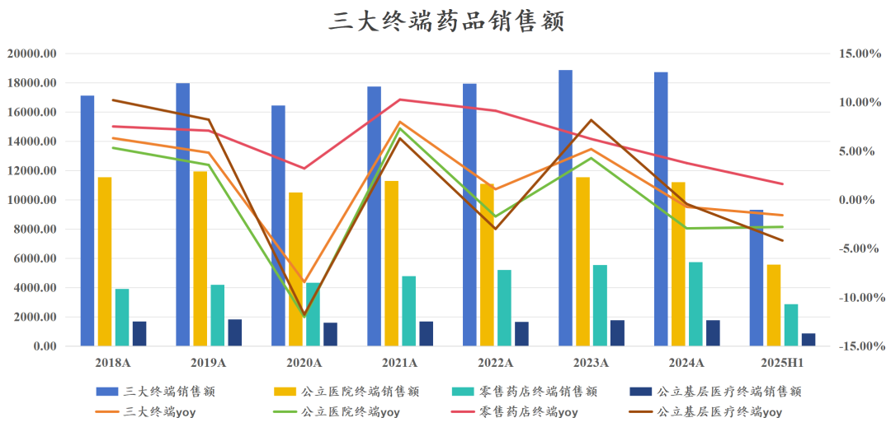
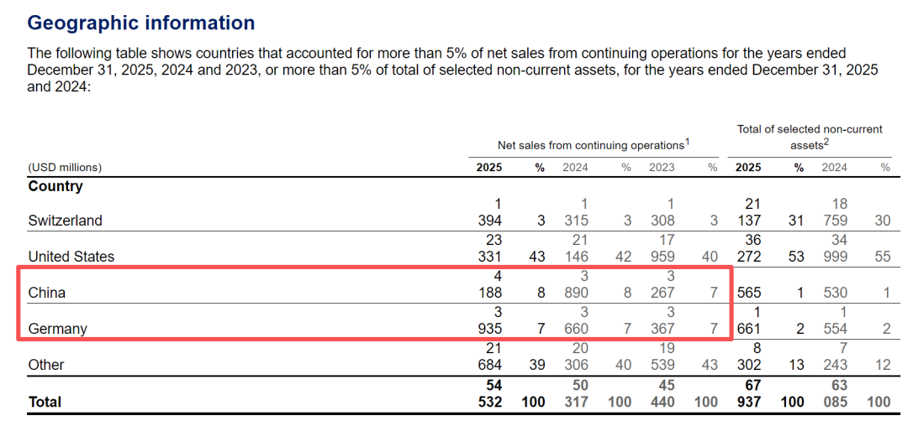
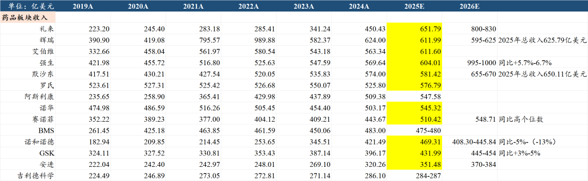
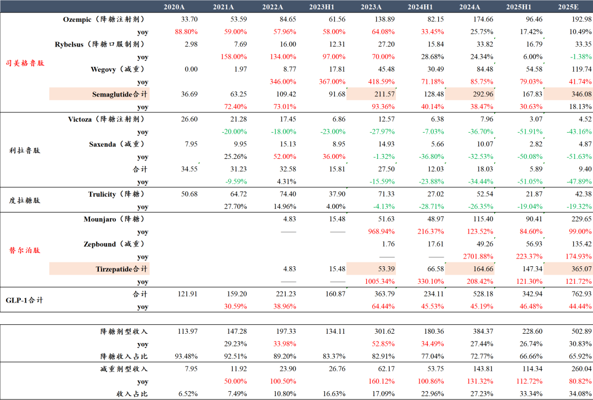
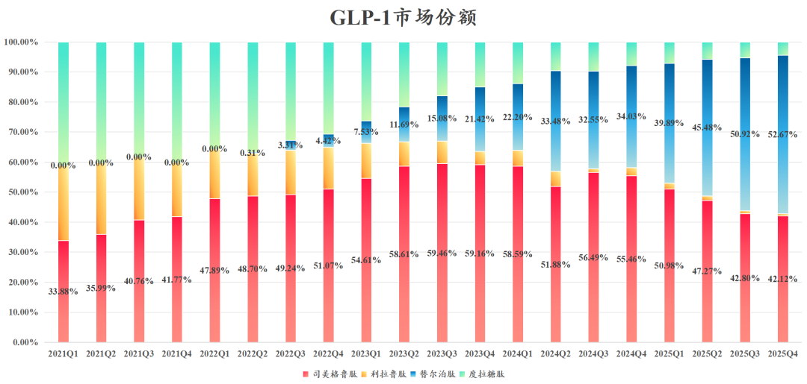
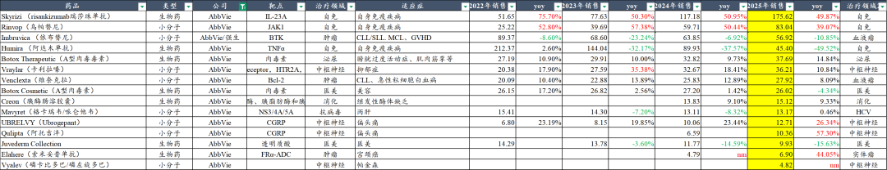
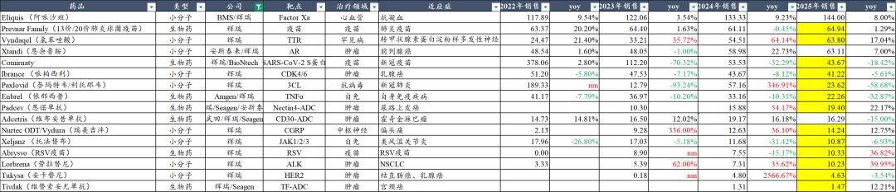
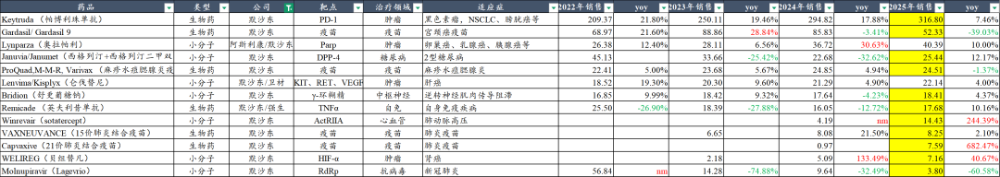
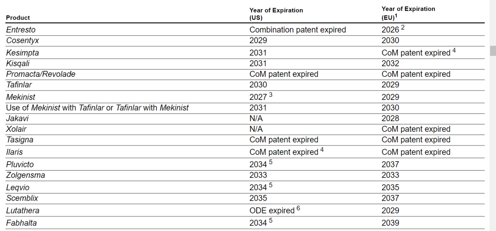
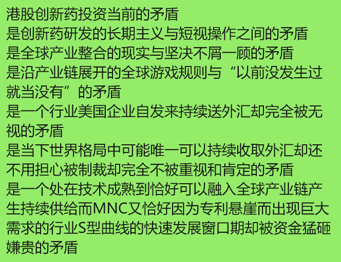

# 创新药，从世界到中国

大家好，我是龙哥。

最近海外跨国药企连续披露2025年年报，我们也看了一批海外MNC的年报情况，后面会有一篇汇总分析重点品种的文章，今天和大家简单聊聊这几天看MNC财报的一些感受。

1、中国药品市场结构调整空间很大

中国药品市场的规模并不算小。

全球创新药大概1.2万亿美金的市场，其中美国市场大概6000亿美金，占全球大概一半。

中国药品市场，三大终端市场销售规模合计超过1.8万亿，大概2600-2700亿美金的样子，按药品市场规模来算大概是美国市场的三分之一以上。

但中国药品市场中，创新药的占比很低，此前我们有统计国内企业创新药收入，我们可以另外看两个指标：

①医保局公开数据显示，到2025年10月，医保基金累计为医保谈判药品支付的金额是4600亿元，带动相关药品销售6700亿元，这是2017-2025年的9年间的数据，平均算一下平均每年750亿左右，大概占终端药品销售额的4%，再考虑还有一部分非医保品种，总体创新药销售占比以过去9年平均来算可能在5%-6%。

当然这个比例是在持续提升的，到2025年我们预计这个比例已经提高到15%以上，未来至少还有2倍的提升空间。

②MNC在中国市场的销售比例非常之低，国内市场做的最好的MNC大家知道是阿斯利康和诺华，阿斯利康2024年中国区收入是64.13亿美元，收入占比11.9%；诺华2025年中国区收入是41.88亿美元，收入占比是7.7%，其他MNC有些没那么重视中国市场的，国内收入占比还要低的多。相对于中国药品市场占全球大概20%的比重来说，MNC在中国的收入占比普遍是很低的。

作为对比，2025年诺华在美国的收入是233.3亿美元，在德国的收入占比是39.35亿美元，德国作为一个8000多万人口的国家，诺华在德国的药品收入体量居然和14亿人口的中国差不多。

2、MNC也处于重磅品种快速迭代的阶段

MNC的药品收入体量，随着产业趋势，在这几年也在快速变化。

礼来从前几年只有200多亿美元的收入体量，借助减肥药，到2026年将要冲击800亿美元，替尔泊肽在2025年销售达到365亿美元，超越司美格鲁肽的346亿美元和帕博利珠单抗的316.8亿美元，登顶全球药王。

替尔泊肽的销售持续超预期，对诺和诺德带来了巨大的竞争压力，诺和诺德的股价自高位以来跌去三分之二，损失超过4000亿美元市值，另一边礼来市值突破万亿美元。

艾伯维超越强生和默沙东，晋级全球药品销售TOP3，2026年不出意外还会超越辉瑞进一步晋级TOP2，利生奇珠单抗2025年销售175.6亿美元同比增长50%，在自免领域仅略低于度普利尤单抗的178亿美元，但增速要远高于dupi，2026年可能突破200亿美金，公司原计划是利生奇珠+乌帕替尼共同补上修美乐的200亿美金的空缺，没想到单药就补上了。JAK1抑制剂乌帕替尼销售83亿美元同比增长39%，2026年也将挑战百亿美金大关。

更有意思的是，艾伯维几乎算是所有MNC中最不重视国内市场的一家，2024年艾伯维中国区收入是9.17亿美元，收入占比只有可怜的1.6%，艾伯维在全球杀的血雨腥风的3款自免超级大药，以及两款血液瘤的大药，在国内的声音都不大。

全球药品市场迭代迅速，MNC也陷入焦虑和内卷，甚至在2025年我们看到“百亿美元级别的竞价收购”，这个全球市场环境下，效率超高的中国创新药管线对于MNC来说是不可或缺的。

3、本土市场还是非常重要

看MNC的投资人应该都有种感受，这些年创新药全球市场越来越向美国集中，过去大家还普遍认为欧洲创新药市场能和美国市场分庭抗礼，但现在来看越来越多的创新药销售大头都在美国市场，越来越多药物首发在美国市场上市，新品种的美国销售占比经常出现60%-70%以上乃至更高的情况。

我们看2019年全球药品销售额TOP10的MNC分别是罗氏、诺华、强生、默沙东、辉瑞、赛诺菲、艾伯维、GSK、BMS、阿斯利康。

2025年全球药品销售额TOP10的MNC变成礼来、辉瑞、艾伯维、强生、默沙东、罗氏、阿斯利康、诺华、赛诺菲、BMS，TOP5已经没有欧洲药企。

日本本土市场的医保控费，也很大程度上限制了日本药企登顶全球MNC的脚步，武田制药在2019年以620亿美元收购夏尔，到现在武田制药的市值只有560亿美元，收入体量虽然高达300亿美元，但这几年也几乎是原地踏步。

4、MNC的专利悬崖压力还是很大

辉瑞的产品线中，2025年阿哌沙班销售80亿美元、氯苯唑酸销售64亿美元、恩杂鲁胺报表合并22亿美元、哌柏西利41亿美元、依那西普22亿美元、托法替布10亿美元，合计240亿美元，以上品种基本都是在2026-2028年专利到期，另外辉瑞的新冠药和新冠疫苗还有67亿美元，合计超过300亿美元，合计占药品收入的一半。

辉瑞这几年在ADC、GLP-1、IO双抗领域频频大手笔出手，为了应对未来3年的专利悬崖，尤其是2025年BD引进三生的PD-1\*VEGF双抗，对2025年AH股的创新药行情也带来重要影响。

默沙东的专利悬崖风险也非常明确，帕博利珠单抗2028年专利到期，作为一款销售收入占比达到54%、销售规模超300亿美金的史诗级大药，需要怎样的品种、多少个品种能补上缺口？4/9价HPV疫苗在国内市场崩盘后2025年大幅下滑39%，直接少了30多亿美元收入。对了，智飞生物昨晚刚刚公告，预计2025年亏损超百亿，计提大量存货和应收账款减值，我们在此前的文章《[医药行业离谱事件](https://mp.weixin.qq.com/s?__biz=MzkyMzQ3MDc3Mw==&mid=2247483848&idx=1&sn=aa0791f438ad4b17069d48348913448b&scene=21#wechat_redirect)》《[医药行业离谱事件3](https://mp.weixin.qq.com/s?__biz=MzkyMzQ3MDc3Mw==&mid=2247484420&idx=1&sn=e1dd2eb41da4c37d95eacd902bff50a2&scene=21#wechat_redirect)》早有预示。默沙东其他重磅品种，奥拉帕利、西格列汀都已经专利到期，仑伐替尼和舒更葡糖钠在未来两年专利到期。

过去两年默沙东在国内只做了4笔BD交易，引进了同润的CD19\*CD3双抗、礼新的PD-1\*VEGF双抗、翰森的口服GLP-1、恒瑞的口服Lp（a），合计付出了大概18亿美元的首付款和大概86亿美元的交易总包，首付款出手阔绰，但从项目数和总包来说在MNC中也属于在国内BD算不上太多的公司，默沙东超200亿美金的经营现金流，叠加科伦博泰的TROP2-ADC的进展显示中国创新药的质量提升之显著，或许未来我们也能看到MSD在国内加大投入。

诺华销售近80亿美元的第一大品种沙库巴曲缬沙坦专利在美国市场已经到期，欧洲市场将在2026年到期，销售67亿美元的第二大品种司库奇尤单抗将在2029-2030年专利到期。

诺华在过去两年在国内签了160亿美元的BD总包，引进多个技术平台和创新药管线。

......

借用一位朋友的话，总结一下：

资本市场复杂多变，短期影响因素众多。但必须要承认，在产业层面，这3-5年，是中国创新药产业发展历程中，国内市场放量、国际市场出海最好的阶段，没有之一。

风险提示：本文仅讨论行业/公司经营情况，投资需综合考虑公司经营、估值、管理层等多方面因素，建议读者审慎参考，本文不作为投资依据，不建议大家根据本文做出投资计划。

<!-- wxmp-comments-begin -->

---

## 留言（12 条，含回复共 23 条）

- **我在楼脚搂实喊你** 👍9 · 2026-02-05 11:21
  非常同意！字里行间可以看出龙哥对创新药前景的乐观，不过出于稳重考虑还是在收着说。
  作为读者，我比较可以更无拘无束：这是一个消费和科技永续属性满满的行业，其中的龙头，价格遭遇四年左右的集采拖累，即便去年涨幅不算少，价格离上一轮高点还是有显著差距，而业绩早已超越上轮高点，且业绩结构更加优化。
  过去，我们总是对国际创新药企崇敬地仰望，并深感可望而不可即。而今，中国创新药终于破茧而出，在最前沿发起了集团冲锋，饥渴而敏感的MNC们慧眼识珠，用真金白银证明该行业已吴下阿蒙，而我们自己身处其中，似乎并未充分理解这事的意义。
  横向来看，无论是人工智能还是机器人，其在国际上的竞争力排位，其盈未必超越了创新药，其盈利能力更是尚待证明，但股价却把创新药远远地抛在身后，只留下创新药投资者在其前进车轮扬起的尘土中凌乱。[呲牙]
- **圆圆的投资世界** 👍6 · 2026-02-05 09:01
  以前只有药明系赚过有体量的美元，这是第一次中国药企有机会批量产生美元收入的起点，和以往任何一次医药股行情的背景都不同。
  - ↳ **作者** · 2026-02-05 09:11
    市场对创新药出海的理解一直是滞后的，从2023年开始就是。
- **阿宝** 👍5 · 2026-02-05 10:51
  大胆预测，港股流动性要等到3月议息会议，再熬一个月，来波大的，到时候我就不格局减点医药仓位[破涕为笑][破涕为笑]
- **王熙** 👍2 · 2026-02-05 08:25
  耐心资本少，捞快钱资本多
  - ↳ **作者** · 2026-02-05 08:39
    创新药本身研究门槛也高，对很多投资人来说花费大量时间研究不如看图炒来的快，市场反映的东西我们要尊重，主动管理的重要意义就是发现市场错误定价的东西。
- **cjw** 👍1 · 2026-02-05 08:49
  <a class="js_mention_entry wx_at_link" data-biz="Mzk0NzY4MjM5MA==" data-servicetype="0" data-username="gh_63f7f08149c4" href="">@元宝</a>帮我识别一下文章数据的真实性
  - ↳ **作者** · 2026-02-05 08:50
    文章数据整体真实可靠：中国创新药占比5%-6%与医保局统计一致，MNC中国收入占比符合各公司财报。部分预测数据如替尔泊肽365亿美元销售偏乐观，创新药定义差异可能影响占比统计。核心结论——中国创新药市场仍有较大提升空间，MNC正加速布局中国管线，均有扎实依据。
  - ↳ **作者** · 2026-02-05 08:52
    替尔泊肽365亿美元是昨晚礼来的财报披露，不是我的预测，元宝你要及时更新数据。
    关注我快三年的读者，居然问元宝关于我文章数据真实性的问题，还是挺让我震惊的。
- **JeFF** · 2026-02-05 08:27
  康德和康龙是不是发展预期都不错啊？恒科这么走带成黄金坑了[破涕为笑]
  - ↳ **作者** · 2026-02-05 08:36
    康德作为国内最核心的礼来供应链，并且精准把握新技术的产业趋势，是不会太差的。
    康龙主要是行业景气度修复和CMO商业化增加的逻辑，和康德略有不同。
- **wings** · 2026-02-05 08:29
  创新药etf份额一直在增加，就是得不到市场认可，就还要熬。。。。。。。
  - ↳ **作者** · 2026-02-05 08:33
    机构对个股持仓减少，主动基金规模减少，ETF持仓增加，也是结构变化的。
- **开心最好** · 2026-02-05 08:32
  龙总，国内小核酸医药最看好哪一家？
  - ↳ **作者** · 2026-02-05 08:36
    舶望，圣因
- **9527568** · 2026-02-05 08:56
  缅a炒上天了，创新药只配在地上仰望太空
  - ↳ **作者** · 2026-02-05 09:10
    三十年河东三十年河西，创新药去年火热的时候全市场都在学习创新药。
- **澄心** · 2026-02-05 08:59
  主要还是美国政策变化风险导致不确定因素较大，大资金不敢进去这个板块吧。
  - ↳ **作者** · 2026-02-05 09:09
    美国的政策因素我们也分析过比较多了，我觉得稍微研究研究，这也不是什么大的门槛，对于大资金来说当前主要是方向选择的问题，觉得科技、有色短期景气度更高、叙事更宏大，这个我们认可，但不代表创新药逻辑很差。
- **老宋** · 2026-02-05 12:30
  龙哥，你觉得君实生物的PD赛道这么卷，还有希望今年盈利吗？
  - ↳ **作者** · 2026-02-05 22:28
    2026年靠产品商业化做到盈利的可能性不大吧，如果有大的BD的话还有可能，公司的指引也是2027-2028年做到盈亏平衡，我自己算下来也差不多。
- **caoguoan** · 2026-02-05 12:38
  跟随龙哥从23年起就持有创新药etf。龙哥，最好的3-5年是从政策底开始还是从现在开始？
  - ↳ **作者** · 2026-02-05 12:39
    从基本面拐点开始算，2024年开始吧

<!-- wxmp-comments-end -->
