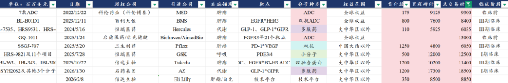
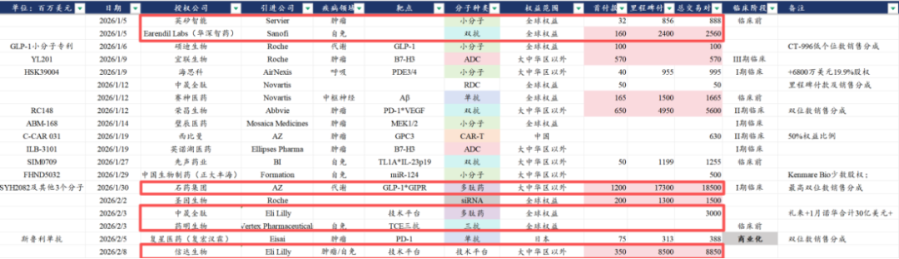
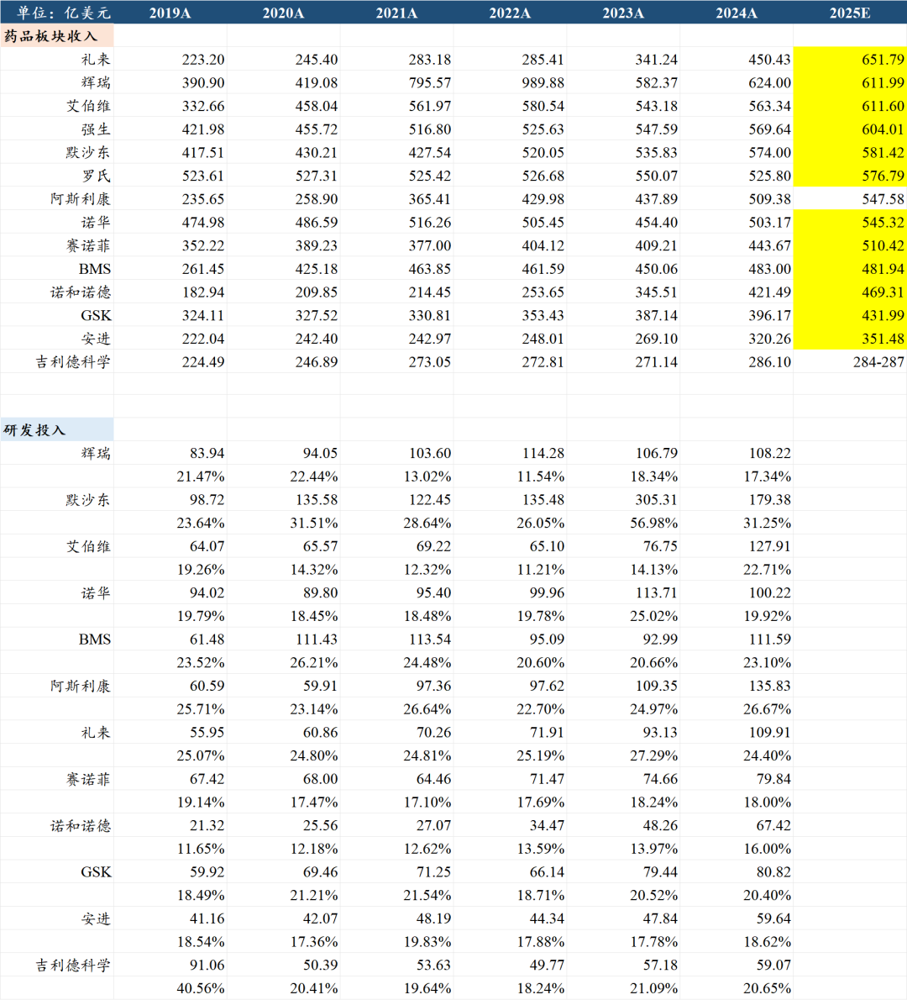

# 从BD交易趋势看全球创新药产业链重大变化

大家好，我是龙哥。

昨晚，信达生物公告，公司及其海外子公司Forvita与礼来达成战略合作，共同推进肿瘤及免疫领域创新药物的全球研发，双方发挥互补优势，加快推进创新药物的全球研发工作，信达生物主导相关项目从药物发现到中国临床概念验证的研发工作，礼来获得相关项目在大中华区以外全球独家开发与商业化许可，信达生物保留大中华区全部权利。

信达生物获得3.5亿美元首付款、最高85亿美元里程碑付款、大中华区以外净销售额的梯度销售分成。

在中国创新药出海历史上，这笔交易的总包大概能排在第6的位置，首付款规模大概能排在第12的位置，作为一款没有落实到具体药物分子的技术平台合作，这笔交易也不可谓不重磅。

对于这笔交易，讨论和争议依然存在，因此这里我们来谈谈由这笔交易、或者说由近期的一系列交易，我们看到的行业趋势是怎么样的。

1、MNC热情极高

MNC目前非常热衷与中国创新药公司进行此类技术平台合作：过去在海外想要收购一个此类的数百人乃至上千人、有丰富新药开发经验的技术平台，且不说有没有这么大的工程师团队，即便是有一个百人规模的工程师团队构建的技术平台，可能也需要付出数十亿乃至百亿美元的收购对价。但目前在中国市场，只需要付出低个位数亿美元的首付款，即可让中国数百人乃至1-2千人的研发团队为其打工。

如礼来、阿斯利康、辉瑞、诺华、BMS、GSK等一众MNC在这两年陆续都选择与国内的一众pharma、biopharma、biotech、AI制药公司进行技术平台合作，仅今年以来的19笔BD交易中就有6笔是此类技术平台的BD合作，还有另外2笔交易是基于技术平台的早期项目合作，此类合作在所有BD中的占比可见在显著提升。

这类合作对于MNC来说是可以大幅提升资金利用效率、广撒网的高性价比投资，与之对应的是MNC这两年可见大量进行早研团队的裁员。

2、国内资本市场认可度不高

至少从过去两年来看，国内资本市场暂时并不认可这种模式，对这种BD合作给不上估值，此前如和铂、石药、恒瑞等公司都曾签订多个此类技术平台的BD合作，市场反馈普遍是短期埋伏消息、利好落地后股价反而大跌——哪怕合作规模超预期。

主要担心的因素有三点：

i.技术平台合作不指向具体项目，最终落地的金额可能占交易总包的比例非常低；

ii.早期技术平台授权后，后续技术平台开发的项目可能很难再有新的大额BD；

iii.技术平台和核心品种授权后，biopharma失去了成为MNC的机会。

这三点因素或者说担忧，我们都非常理解，但我们也有一些思考和见解。

首先第一点，对于单个公司、单项合作的角度来说的确如此，所谓的“BD常态化”对于单个公司来说的确存在一定不确定性，对单个公司来说此类BD合作实际上最终还是要落实到能推到临床阶段和有数据读出的项目上，而这些项目即便是要读出早期数据，往往可能【至少】也要在2-3年后才能看到，因此并不会短期马上反映到估值和业绩上，这是短期给不上很高估值的核心原因。

对于第二点，我认为不需要担心，原因在于，biopharma技术平台的搭建和迭代更多是基于行业性的技术发展和产业趋势，2022年四季度信达生物才拿到第一个ADC药物的临床批件，那时候又有几位投资人能想到信达生物会一跃成为国内ADC核心头部玩家之一；恒瑞医药在去年12月也展示了他们技术平台的持续发展和迭代，肿瘤领域从PROTAC到RIPTAC，减重代谢领域从多靶点到月注射、周口服制剂。

所谓的“技术平台授权”对于这些执行力强、研发团队庞大的pharma和biopharma来说并不是什么未来研发突破和创新药出海的障碍，能以当前还没有产品的技术平台卖出高价更是稳赚不赔的生意。

对于第三点，大家大可复盘一下欧美创新药MNC们，看看这些年美股欧股到底诞生了几家可以称得上是MNC的公司，国内的创新药公司除了恒瑞和百济以外，其他公司的市值、收入体量、研发投入相较MNC还有多大差距，跑步都还没学会，何必这么早担心无法起飞呢，更何况如第二点所言，长期来看也并不会真正制约公司的“起飞”——假如公司确实有能力。

3、边际利好

即便是市场本身对这次的交易有分歧、有讨论，但好在本次交易基本没有提前泄露内幕消息，公司也没有给过“预告式BD”的指引，因此该BD的落地属于边际增量利好，也因此没有出现类似其他公司的利好落地砸盘。

我们在《[一定要把医药弄到狗都不玩吗](https://mp.weixin.qq.com/s?__biz=MzkyMzQ3MDc3Mw==&mid=2247485600&idx=1&sn=5b894335237b295b6e10950cf304fd69&scene=21#wechat_redirect)》、《[创新药投资困难的事](https://mp.weixin.qq.com/s?__biz=MzkyMzQ3MDc3Mw==&mid=2247485454&idx=1&sn=36c6f31397c2d7f59490f158415c2bcc&scene=21#wechat_redirect)》讨论过行业的一些问题，很多时候导致股价短期表现显著弱于预期的原因并不是交易本身不好，更多时候还是基本面以外的因素。

4、中长期产业逻辑

目前越来越多的MNC从国内的biotech/biopharma引进技术平台，意味着biotech/biopharma与CRO之间的界限在变得模糊，这也是很多投资人困惑的地方，“biotech变得CRO化，到底该怎么给估值？”。

相较过去与CRO公司进行定制化药物发现、MNC再自己推临床前和临床研究，与biotech/biopharma进行技术平台的合作可以将早期项目直接推到做完临床前以及早期临床拿到POC数据，MNC可以看到早期临床数据后再选择行权，从而进一步简化新药早期开发的环节。

本质上是把新药开发更多的环节“外包”给中国创新药公司——付出比CRO高的多的价格和销售分成，像这次与信达生物的交易支付了3.5亿美元的首付款，后续里程碑付款高达85亿美元，还有后续销售提成，3.5亿美元大概对应25亿人民币，放在以前找CRO买临床前的分子，足够买50个分子，而信达与礼来的合作显然不可能达到50个分子之多，并且是打包式的买。

这也也意味着，从全球创新药全产业链分工的角度，中国公司未来可能会可持续地从全球创新药产业链中切下更多的环节和价值量。

这是工程师红利和CXO行业的延伸，在2018-2021年的创新药全球产业链分工重塑中，中国CXO公司切下了全球CRO/CDMO行业更多的份额，即便是随后的几年历经多次地缘政治因素的干扰，中国CXO公司也依然在提升全球份额。

着眼当下，则是全球医药产业发展趋势下，中国创新药产业链进一步延伸的结果，MNC在面临大量的专利悬崖、低垂的果子很多已经被摘完的情况下，对新技术平台的渴求与降本增效的要求并存，一边是内部裁员以提高资金利用效率，另一边是需要大规模引进项目填补专利悬崖的空缺，这就使得中国公司在整个创新药的产业链中可以切下更多的蛋糕。

MNC越来越聚焦于其在优势疾病领域进行大规模临床开发、注册、商业化等能力的强化，而国内biotech/biopharma参与的环节则是在CRO公司的药物发现的基础上，在创新药产业链更多环节上扩张，可以获得首付款、里程碑以及潜在的销售分成。

这是一个慢变量，如上文所述，一个技术平台的合作有可能至少也要2-3年、慢则3-5年之后输出的分子才能看到POC临床数据，对于国内“只争朝夕”的二级市场来说显然不是短期能驱动股价马上大涨的原因，但长期的改变已经在发生，不可逆转，终将会积少成多。

......

近期重点文章：

[创新药，从世界到中国](https://mp.weixin.qq.com/s?__biz=MzkyMzQ3MDc3Mw==&mid=2247485623&idx=1&sn=6c2395a0c40f4cb7cfe8b12823a0b8d3&scene=21#wechat_redirect)

[超级大药，群雄逐鹿](https://mp.weixin.qq.com/s?__biz=MzkyMzQ3MDc3Mw==&mid=2247485607&idx=1&sn=4b77807612d850b2ab03ea2143c299d3&scene=21#wechat_redirect)

[医保砍价，股价历史新高](https://mp.weixin.qq.com/s?__biz=MzkyMzQ3MDc3Mw==&mid=2247485589&idx=1&sn=3da758317db21b4529507e894a75d500&scene=21#wechat_redirect)

[3000亿医药持仓，公募在买什么？](https://mp.weixin.qq.com/s?__biz=MzkyMzQ3MDc3Mw==&mid=2247485578&idx=1&sn=6aff19641d4fa9aba443d196381f0fb5&scene=21#wechat_redirect)

[中国医疗器械全球化路径](https://mp.weixin.qq.com/s?__biz=MzkyMzQ3MDc3Mw==&mid=2247485569&idx=1&sn=4fb6ee854b13ff09385b88fb3c638409&scene=21#wechat_redirect)

[BD交易之后，创新药下一个爆点](https://mp.weixin.qq.com/s?__biz=MzkyMzQ3MDc3Mw==&mid=2247485517&idx=1&sn=4165772f7153d7557d469892fbced90b&scene=21#wechat_redirect)

风险提示：本文仅讨论行业/公司经营情况，投资需综合考虑公司经营、估值、管理层等多方面因素，建议读者审慎参考，本文不作为投资依据，不建议大家根据本文做出投资计划。

<!-- wxmp-comments-begin -->

---

## 留言（11 条，含回复共 18 条）

- **木木** 👍11 · 2026-02-09 11:07
  1. 中国Biotech CRO化，又何尝不是MNC规避地缘风险的一种方式呢
  2. MNC此刻最看中的，应该是中国Biotech快速、高效、低成本的临床推进速度，使得MNC可以节省很多时间和资金成本，以更早的时间看到POC数据，决策该项目是否继续推进。讲白了就是中国医生多、患者多、研发人员多，便宜又勤奋
- **wings** 👍8 · 2026-02-09 10:36
  创新药真不受市场待见，明明看的见的业绩，就是给不上估值，看来还是想象力不够，来个太空创新药估值立马原地起飞[呲牙]
- **9527568** 👍4 · 2026-02-09 10:41
  龙哥，不要每天研究了，再多利好，和股价没半毛钱关系
  - ↳ **作者** · 2026-02-09 10:43
    哈哈，很多投资人在前几年的熊市里逐渐不看医药了，因此也大多把握不住去年创新药的大涨。术业有专攻，有时候我确实也忍不住吐槽几句，但不代表这行业真的赚不到钱，要是跌了就不看了，涨了再回来学习，那能有超额认知和超额收益吗。
- **四川俫佧文化飞扬** 👍4 · 2026-02-09 11:13
  龙哥的文章都会细细品读，康方和恒瑞这样的大哥不动弹，创新药的股价是不会动的。不过，拉长时间看，正在量变中
- **嘀嗒** 👍2 · 2026-02-09 10:33
  龙哥这是年前最后一篇了吧。
  - ↳ **作者** · 2026-02-09 10:40
    有可能吧，这周还有几个调研，碰到有意思的公司或者信息还是会分享的。
- **🍎** 👍2 · 2026-02-09 11:23
  感觉有点类似外不驻场的包公司，企业可以招大量的生物医药相关专业毕业生，一个项目干下来就是熟手了，可以把表现优秀的调到自家项目。国内有些科技类企业就是这么干的，常年雇佣外包人员，小部门十多个正式员工，每个正式员工带几个外包，近百人的团队就成了，每年给外包一定转正名额。
- **光头的复利人生** 👍1 · 2026-02-09 10:48
  随着这个模式不断复制，会否挤占CXO的蛋糕？
  - ↳ **作者** · 2026-02-09 10:53
    远期不排除这个可能性吧，但至少目前来看，大家还是在全球产业链里切更多蛋糕的阶段。
- **一一得一** 👍1 · 2026-02-09 11:05
  器械是不是不会有BD的？
  - ↳ **作者** · 2026-02-09 11:10
    可以参照此前1月的文章，器械出海也是多条路径并进的。
- **墨** 👍1 · 2026-02-09 15:12
  龙哥，迪哲医药收入增幅大、利润减亏少，2026年预期咋样？
  - ↳ **作者** · 2026-02-09 21:33
    迪哲现在的问题也不是国内商业化卖多少、利润减亏多少，核心还是两个药的海外商业化怎么弄，毕竟回调这么多都还有250亿的市值，其中包含的一大半是海外的估值预期。
- **勇敢的十六宝** · 2026-02-09 10:31
  易中天不是英伟达的打工厂吗，也没歧视啊
  - ↳ **作者** · 2026-02-09 10:41
    如文中所言，创新药的BD只是兑现没那么快，需要在比较长的时间里，在大量的BD里有少部分项目实现高价值量的兑现，国内二级的资金大多并没有这样的耐心，易中天是短期快速兑现业绩了，有直观看得到的现金流。
- **zhz** · 2026-02-09 16:57
  为啥不给估值，首付款不算业绩吗？
  - ↳ **作者** · 2026-02-09 21:33
    不是不给估值，收付款当然是业绩，指的是短期给不了很高的估值。

<!-- wxmp-comments-end -->
