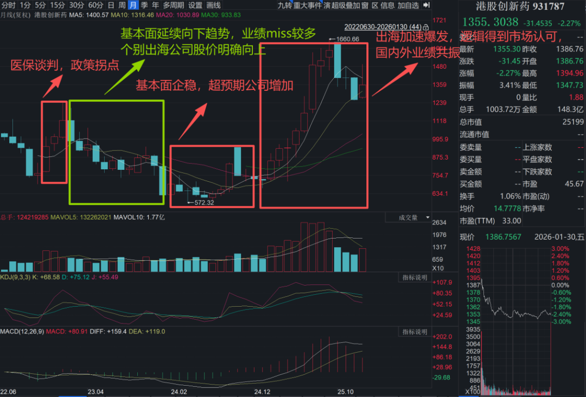
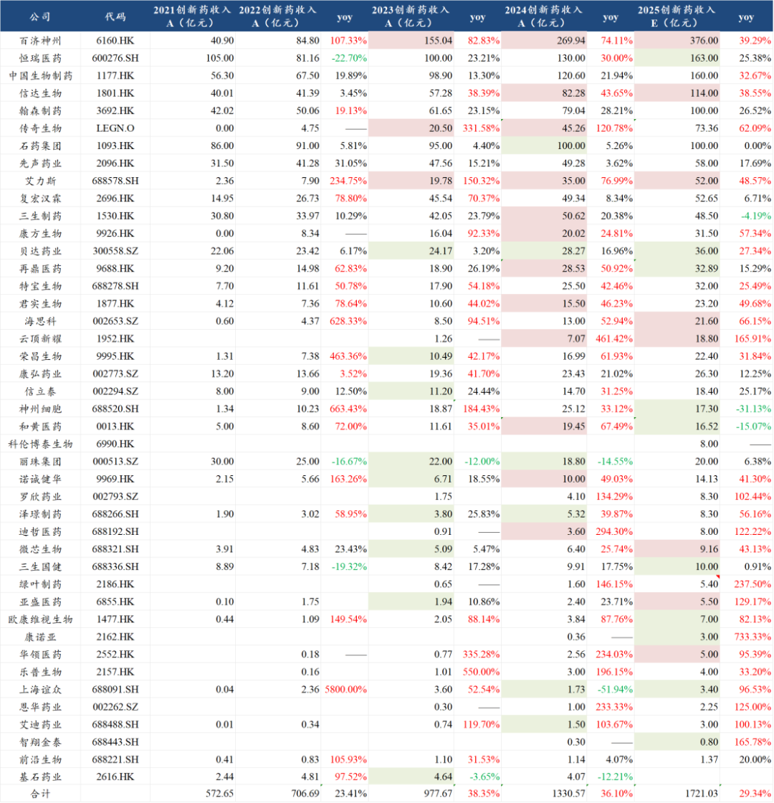
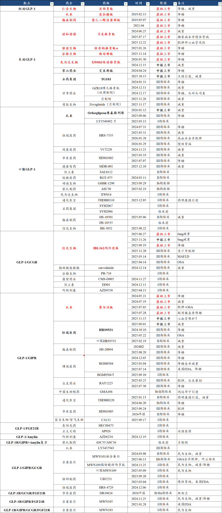
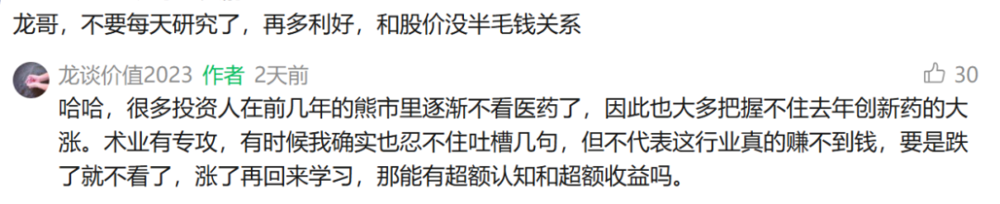
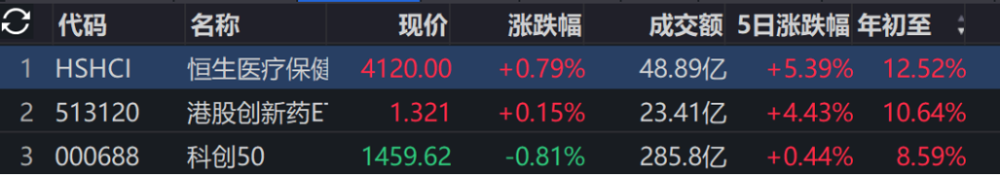

# 做困难且正确的事

大家好，我是龙哥。

2026年春节前最后一篇，趁着这两天医药行情还不错，和大家汇总聊聊过去一年对医药的一些观点或者想法，文章第二篇还给大家附上了《龙谈价值2023公众号2026使用指南》，2026年继续与大家共同进步。

1、医药投资是困难的事

医药的研究和投资门槛总体还是比较高，这点相信各位读者只要稍稍了解，应该都是深有体会，其一是医药领域对专业性要求确实比较高，其二是这个行业内公司还特别多，个股间的差异非常巨大，其三是创新药的属性决定其一定是股价波动幅度巨大，持股体验不会很好。

我们过去两年绝大部分的文章都在讲创新药，实际上港股创新药指数从最底部企稳涨幅超过2倍，诞生了一众牛股，但这个过程实际上是非常波折的：

这个从最早的政策拐点到股价拐点的过程，我们可以简单复盘一下：

- 第一阶段：政策拐点，股价大涨，涨估值，2-3个月时间（2022.10-2023.01，对应器械2025.07-2025.08）。
- 第二阶段：行业基本面仍在惯性下降，但少量管线优质、出海领先的公司股价走出明显α，1年时间（2023.02-2024.01，对应器械2025.09以来）。（《[创新器械出海先锋](https://mp.weixin.qq.com/s?__biz=MzkyMzQ3MDc3Mw==&mid=2247485262&idx=1&sn=72f5e11cdd06ea0b5beac35064179e86&scene=21#wechat_redirect)》《[中国医疗器械全球化路径](https://mp.weixin.qq.com/s?__biz=MzkyMzQ3MDc3Mw==&mid=2247485569&idx=1&sn=4fb6ee854b13ff09385b88fb3c638409&scene=21#wechat_redirect)》）
- 第三阶段：行业基本面开始明确改善，但股价市场不信，行业股价仍在惯性下降，仍是部分管线优质公司走出α，0.5-1年时间（2024.02-2024.12）。
- 第四阶段：市场全面相信行业出海逻辑和国内销售提升逻辑，行业估值业绩双升，1年时间（2025.01-2025.09）。

与之对应的，我们看下面这个图，也是我们老读者比较熟悉的一个更新了好几年的图了，这是国内创新药公司产品商业化收入的数据，不含BD授权收入的，标绿色底的代表销售显著低于预期的，标红色的则代表销售显著超预期的。

由图可见，2022年底的政策转向，传导到销售端实际上是会有滞后性的，毕竟每年医保谈判的品种有限、存量品种众多，因此2023年的业绩还是以miss居多，为数不多超预期的3家公司，百济和传奇都是海外超预期，只有艾力斯是国内大单品持续超预期。到了2024年超预期的公司和品种大大增加，国内基本面已经有所反映，再到2025年股价上涨后，整个市场的预期都提起来了，又是一轮分化，超预期和低于预期的都有不少。

产业逻辑我们过去用了大量的篇幅讲，这里不再赘述，总体来说过去两年在这种行业极度低迷和极度乐观之间切换，不管对于研究还是对于投资，确实都是很大的挑战，如何在市场波动中能客观理性的看待产业趋势和发展节奏，这是我们过去两年在努力做到的，事实证明结果还不错。

我们在此前也经常吐槽“创新药简直不是人看的行业”，这个行业国内超过千家biotech（上市的创新药公司就达到200家），海外还有众多公司需要看——毕竟现在创新药投研高度需要国际视角，上万个在研管线，哪怕在这其中只覆盖一部分，也是非常巨大的工作量，更不用说我们同时还要兼顾医疗器械以及其他医药细分领域。

我们做了不知道多少几百行的EXCEL，不知道多少数十页的PPT，不知道多少公司的模型，才有了过去一年给大家分享的100多篇文章——也只是我们研究成果能展示出来的一小部分，例如一个GLP-1领域的创新药动不动就是近100个管线：

行业研究性价比低、波动幅度又大，为什么还要看这个行业？

- 因为这个行业永远有新技术、永远都在创新突破，永远不会缺投资机会。
- 因为这个行业哪怕波动幅度巨大，但也完全足够“三年不开张、开张吃三年”。
- 因为这个行业专业要求高、有信息差、能赚到超额收益。

创新药及产业链只是不如过去一年最火爆的AI产业链和有色（本质上很多也和AI产业链相关），但也是跑赢大部分行业的，创新药虽然没那么离谱的涨幅，但创新药及产业链怎么也说不上是很差。

2、写医药公众号是困难的事

写公众号和自身做投研又是两码事，因为还要照顾到读者们的情绪。

由于创新药高波动的特征，哪怕行业涨的再多也会有很多投资人在交易中亏钱，并且总会有一部分读者会把我们这种公众号作为情绪宣泄的地方，这个倒也无可厚非，只要不是破口大骂，我们也都相对理性的回答问题。

因此我们在分享内容的同时，还要经常承受读者们的情绪传导，行情好的时候读者们传导更乐观的情绪，行情不好的时候读者传导更悲观的情绪，甚至每次评论区几乎一片绝望的时候反而容易看到行业低点，常看评论区的老读者应该也都有印象。

这些都会成为我们自身在做投研中需要进一步克服的挑战——如何在市场噪音中更加理性和客观地看待行业、市场。

3、做困难且正确的事

困难总是很多，任何行业都是。从2019年这个公众号成立以来，我们就一直坚持“做困难且正确的事”。

医药行业的投研如此困难，但我们有一群优秀且坚强的小伙伴一起努力，其中不乏比我们更优秀、更勤奋的医药投资人。

公众号分享内容如此困难，但我们过去一年坚持分享100多篇、合计30多万字的内容，并且我们对自己发文的要求是不做简单的信息汇总和点评、有超越市场的深度，另外我们在文末回复的留言、后台回复的私信估计也是数以十万字计，有不少读者一直陪伴，更有读者几乎每个月底都会赞赏支持，令人感动。

2026年，我们会继续坚持，正如我们过去两年的判断，当前以及未来3-5年的中国创新药产业链，就是国内商业化放量+国际化爆发最好的时间和投资阶段，逻辑重塑+业绩高增长的窗口期放在当前任何一个行业都是稀缺的，大伙，且投且珍惜。

......

年前最后一篇，再开一次赞赏，提前预祝各位新年快乐~

风险提示：本文仅讨论行业/公司经营情况，投资需综合考虑公司经营、估值、管理层等多方面因素，建议读者审慎参考，本文不作为投资依据，不建议大家根据本文做出投资计划。

<!-- wxmp-comments-begin -->

---

## 留言（14 条，含回复共 23 条）

- **廖书豪** 👍7 · 2026-02-11 11:51
  龙哥，新年快乐！申请2026新年做个评论区医药恐慌指数[旺柴]
  - ↳ **作者** · 2026-02-11 11:55
    你让我想想这东西怎么做[破涕为笑]咱们这单看留言的数据量还是少了点，应该可以通过投票的方式？比如每个月初弄一次投票？
- **醉品烟酒茶15503640189** 👍6 · 2026-02-11 11:53
  预祝
  新年快乐
  马年行好运
- **陈学锋** 👍6 · 2026-02-11 11:58
  感谢龙哥一直在，近几个月基本没操作，9月开始连续大亏，但并没有因此失去耐心，一月上半月快把之前亏得赚回来下半月又还回去大部分，依然没动。底气来源于龙哥很多文章的观点的学习和认同。这段时间忙都没咋看文章，也没咋看股票。但是不影响对龙哥的认可和感激。祝愿新的一年朋友们都能有不错的收益率，也愿龙哥公众号“马”上起飞，马年呼呼涨粉。
- **Ron** 👍5 · 2026-02-11 11:58
  感谢龙哥！我是做创新药研发的，感觉你们真不容易。有时我要吃透一个竞品分子的部分数据都需要几天甚至几周，你们却要follow这么多管线，真是太厉害了[捂脸]
- **但为君故** 👍5 · 2026-02-11 12:00
  感觉龙哥待读者很感性，在投资上又理性的可怕
- **杨风雨@华福创新药首席** 👍4 · 2026-02-11 11:44
  感谢龙哥的辛苦付出 创新药研究确实花时间 需要兼具广度和深度 但是研究这能创造价值 很有魅力的
  - ↳ **作者** · 2026-02-11 11:47
    行业的良性发展需要行业里大家共同的努力，杨老师的研究成果也给了很多启示[抱拳][抱拳]
- **庆之** 👍1 · 2026-02-11 11:46
  期待下一波的爆发
- **donny** 👍1 · 2026-02-11 11:50
  感谢龙哥一路陪伴
  - ↳ **作者** · 2026-02-11 11:53
    感谢各位老读者一路陪伴，尤其是老号过来的最早一批读者[抱拳][抱拳]
- **caoguoan** 👍1 · 2026-02-11 13:37
  在医药的至暗时刻龙哥的分享是一盏明灯指引方向！感谢龙哥，也坚定的跟随龙哥！持有创新药etf
  - ↳ **作者** · 2026-02-11 15:11
    [抱拳][抱拳]老读者熬过几年很不容易
- **专坑队友123** · 2026-02-11 12:05
  药名生物，这业绩怎么样
  - ↳ **作者** · 2026-02-11 12:07
    业绩不错，超预期的。
    关于药明生物，可以参照1月份CXO的观点，从行业景气度的角度，去年CDMO景气度最高的是多肽和ADC，所以康德和合联、皓元最强，去年可以看到双抗/多抗的景气度提升非常明确，药明生物会比较受益。
    另外药明生物还有换大股东的因素，也会减少地缘政治风险。
- **希真书童 (Terence Fang)** · 2026-02-11 12:53
  感谢龙哥的文章，龙哥经常把文章第一时间私我，龙哥非常专业且持续迭代学习，及时更新。再次感谢，我也要向龙哥学习，2026年有机会上海面聊[抱拳][玫瑰]
  - ↳ **作者** · 2026-02-11 15:09
    有机会欢迎大家来线下交流讨论[呲牙]
- **LIN H.L.** · 2026-02-11 13:03
  是医药基金经理？还在革兰🤚里面
  - ↳ **作者** · 2026-02-11 15:10
    兰姐毕竟是让所有男人消费最多的女人，没有之一
- **佛门小僧** · 2026-02-11 14:09
  感谢龙哥分享和陪伴，新年祝大家在创新药里发发发！🧧[鼓掌]
  - ↳ **作者** · 2026-02-11 15:12
    [烟花][烟花][烟花]
- **daibing** · 2026-02-11 14:17
  感谢龙哥多年持续付出，跟着买港股的ETF也赚了点，但过程实在波折。而且现在明显头部效应还有部分公司持续miss. 后续是否可以抓几个重点头部，ETF里感觉有些拖后腿严重啊
  - ↳ **作者** · 2026-02-11 15:13
    其实个股幺蛾子更多，就算是再牛的牛股都不妨碍很差交易习惯的投资人亏钱，ETF还是很好的工具

<!-- wxmp-comments-end -->
