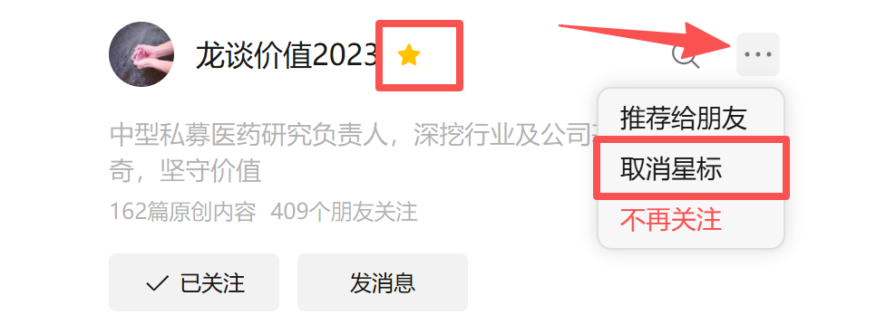

# 龙谈价值2023公众号使用指南

大家好，我是龙哥。

新年之际，给大家奉上2026年《龙谈价值2023》公众号使用指南，2026年我们会继续分享有价值的文章，也希望大家依然能在此有所收获。

1、历史文章合集

每个月底，龙哥会把当月的文章整理到我们的历史文章合集中，并单独发送或者作为月底文章的第二篇发送，或者也可以在公众号主页下方直接点击“文章合集”来查看。

在历史文章合集中我们根据行业分析、政策解读、行业基金解读、年度策略、部分个股解读等做了分类，方便各位读者查看感兴趣的方向。

我们历史文章不论分析的对错、逻辑是否有瑕疵，都不会删除，我们的文章更多偏中长期产业逻辑的分析，保留历史文章也是也是对我们判断产业趋势过程的一个验证。

2、留言区

我们的文章讨论具体个股没那么多，对具体个股的观点、对短期边际变化的点评等基本都会放在评论区，评论区有时候也会作为文章内容的重要补充和进一步的解读，各位读者在读完正文之后可以再多翻翻留言区，也可以多多留言。

读者们留言的时候希望也可以注意两点：①留言给我观点的时候尽量不要甩给我一个结论，这么多的读者每人给我一个结论，对我来说没任何意义，因此讲观点的时候尽量大致讲一下逻辑，这样我们才能形成讨论。②对于不合适的留言哪怕我翻出来也会被屏蔽掉，所以尽量不要讲敏感言论。

但留言区回复的时间可能没那么及时，尤其是我们回复有些问题可能也会回复的比较具体，甚至有的问题会回复几百字，因此各位读者也可以在看新文章的时候记得去翻看一下历史文章的留言区。

很多读者的问题都是历史文章的留言区里重复回答过的，多翻翻留言区，很多问题就不需要重复问了，提高读者的阅读效率，我们也可以把更多时间用来交流新的问题。

另外，我们一般不会主动删留言互动内容，也希望留言的读者不要删，或者说不想被翻出来的留言可以特别备注一下，我们有些回复较长的内容，也希望更多读者能看到。

3、加星标

公众号推送文章给各位，会根据各位读者的阅读频率排序，我们公众号发文频率不算高，大概一周两篇文章，相比每天更新的号肯定是少的多，因此推送文章的时候容易被排在后面，导致大家错过一些不错的文章。可以把公众号加个星标，这样推送的时候可以靠前一些，每篇文章都不要错过~

4、数据分享

我们的文章分享的内容，经常包含大量的数据，我们过去分享的文章，也经常会赠送给大家一些数据底稿，这是给支持我们的老读者的一些福利，未来也还是会继续。

很多数据大家看到我们在文章中给出的一个结论、一个汇总的数据，可能会觉得将信将疑，但如果把完整数据摆在面前，对产业逻辑和行业趋势的理解可能会更深刻，因此我们也愿意“授人以渔”，给大家分享一些好的数据资料，也是帮助医药投资人更加客观理性的看待行业。

<!-- wxmp-comments-begin -->

---

## 留言（0 条，含回复共 0 条）

_暂无留言_

<!-- wxmp-comments-end -->
