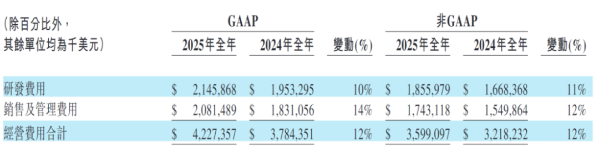
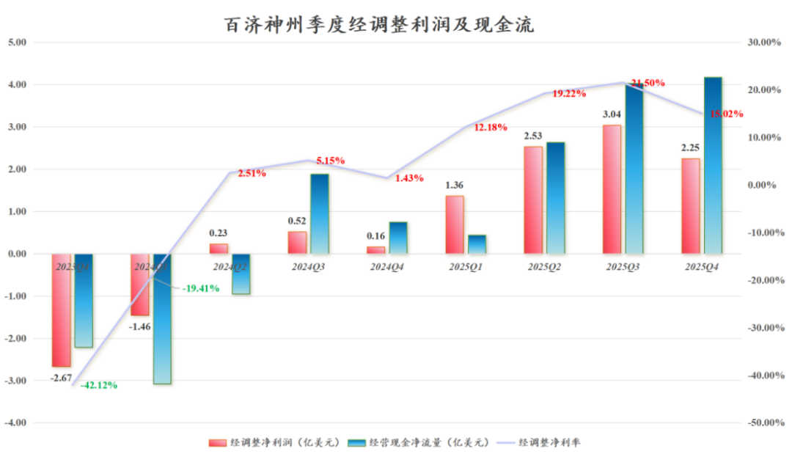
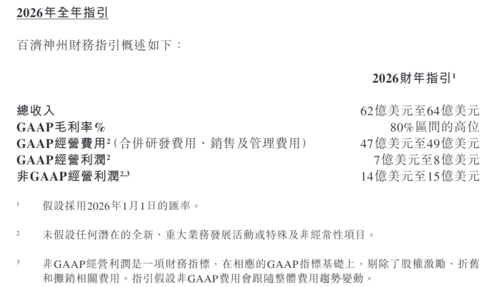
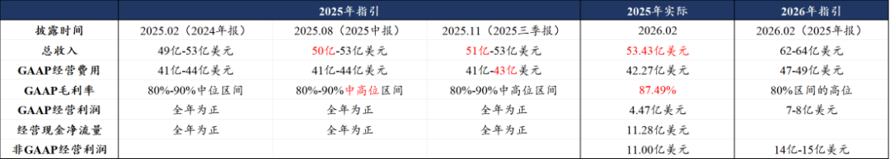
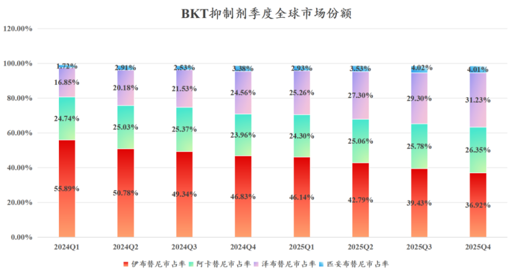
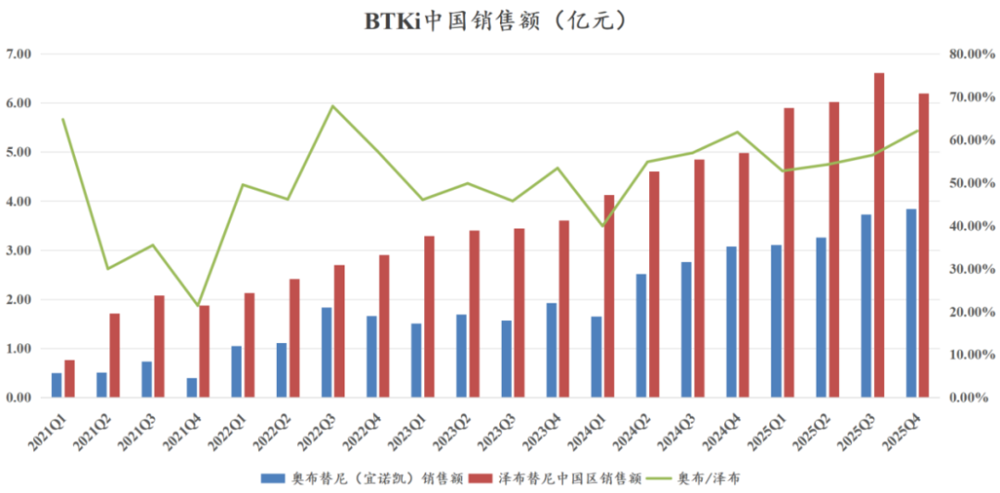
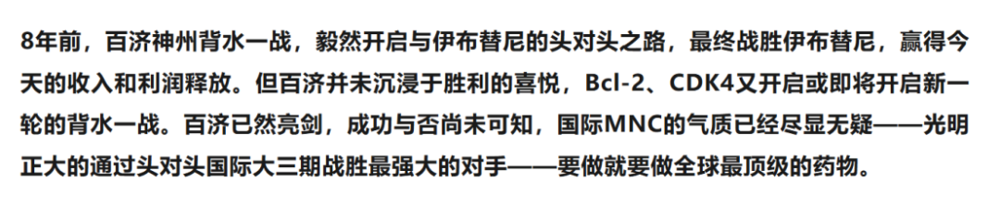

# 创新药之王新征程

大家好，我是龙哥。

百济神州在创新药产品商业化方面从2022年登顶国内创新药一哥，后优势不断扩大，到2024-2025年，百济的全球创新药产品收入已经超过龙二恒瑞医药的两倍有余（不含BD收入），昨晚百济神州披露了2025年年报，对其财报的解读，市场也有一些争议，这里我们来谈谈我们的观点，仅供参考。

首先给一个结论：百济25Q4财报虽然不及前面两个季度那么惊艳，但依然是非常不错的表现，26年在产品销售、利润释放、研发推进都还有不少看点，在MNC里算是颇具增量的公司，以及估值也不算高。

1、业绩表现

公司2025年收入382.05亿元同比增长40.39%，其中产品收入377.70亿元/52.82亿美元同比增长39.75%，百济神州仅用了6年时间实现产品收入从0到50亿美金的突破。

毛利率从2024年的84.4%提升到2025年的87.5%，同比提升3.05%，25Q4单季度的毛利率已经达到90.49%，同比提升4.75%。

总体的经营费用（研发+销售+管理）只增长了12%到42.27亿美元，经营费用率79.12%，同比下降20.2%。

2025年归母净利润14.22亿元，去年同期为亏损49.78亿元，扭亏64亿元，扣非归母净利润13.81亿元，去年同期亏损53.79亿元，扭亏67.6亿元，Q4单季度盈利2.84亿元，去年同期亏损12.91亿元。

2025年经调整净利润60.94亿元，去年同期为亏损4.91亿元，扭亏65.85亿元。市场关注的第一个点就是Q4单季度的利润端略低，过往来看百济在Q4都会有一些增加的费用计提，季度的利润环比波动是正常情况。

2025年经营现金流11.28亿美元，25Q4单季度经营现金流4.17亿美元。公司的投资现金流也在缩减，2025年的投资现金净流出2.76亿美元也同比减半，这使得百济的自由现金流从2024年的-6.89亿美元到2025年的8.52亿美元。

公司对2026业绩指引是：

指引2026年收入62亿-64亿美元，同比增长16.04%-19.78%；指引毛利率处于80%区间的高位（85%-90%），指引非GAAP经营利润14亿-15亿美元，同比增长35.00%-44.65%。

收入端和利润端，这都是一个相对保守的指引，当然，有一些投资人认为这个指引有些低于预期，不过分产品拆分预测来看，虽然泽布替尼在26年的增长必然也会有所降速，预计仍会有20%-30%的增长，索托克拉也将在2026年在国内外市场贡献收入，而替雷利珠单抗和国内其他代理品种的增速预计会比较低，会一定程度上降低总收入增速，但这些代理品种对其管线估值的影响并不大。

我们也可以对比一下在2024年报中对2025年的指引情况：

2、核心产品销售

①泽布替尼：

全球销售39.28亿美元同比增长48.57%，2025年泽布替尼全球市场份额28.39%；Q4单季度销售11.46亿美元同比增长38.40%、环比增长10.11%，符合此前Q4环比增长10%的预期，Q4泽布替尼的全球市占率提升至31.23%，预计在2026Q2-Q3可以看到泽布替尼正式登顶全球BTKi。

Q4美国销售8.45亿美元同比增长37.18%，欧洲销售1.67亿美元同比增长48.14%，中国销售6.19亿元同比增长24.30%。

2025年四季度，泽布替尼在中国和美国的销售额是0.88亿美元VS 8.45亿美元，销量大概是6.76万盒VS 6.07万盒，美国市场季度销量首次超过中国市场，销售金额已经相差接近10倍。

②替雷利珠单抗：

国内销售为主，2025年全球销售额52.97亿元同比增长18.58%，略高于全年18%的增长预期，其中Q4单季度销售12.91亿元同比增长16.62%。

替雷利珠单抗自2023年以来陆续在欧盟获批了8个适应症，在美国获批了3个适应症（一二线食管鳞癌、一线胃癌），海外会陆续贡献少量收入，但也难以带来较大的增长。

③其他代理品种：

2025年全年销售合计44.06亿元同比增长20.12%，其中代理安进的产品销售34.71亿元同比增长33.60%，具体包括地舒单抗销售3.06亿美元+36.35%、贝林妥欧单抗销售1.04亿美元+40.22%。地舒单抗在国内已经陆续有多款生物类似药获批，竞争趋于激烈，后续增长可能会较为困难，贝伐珠也在持续面临激烈竞争。

④索托克拉：

2026年1月初在国内获批上市后，目前已经进入国内所有主流血液瘤中心，公司对索托克拉的销售也很有信心。海外美国市场预计也有望在2026年上半年获批进入商业化。

3、2025/2026重点研发里程碑

①泽布替尼：一线套淋（MCL）的III期临床中期分析（2026H1）。

②替雷利珠单抗：联合HER2双抗一线治疗HER2阳性胃癌美国和中国递交BLA（2026H1）。

③索托克拉（Bcl-2）：美国FDA决定是否批准R/R MCL（2026H1），欧盟预计也将会在2026年内完成审批；启动R/R MM的III期临床（2026H2）；尽快启动联合BTK CDAK固定疗程治疗R/R CLL/SLL的III期临床。

④BTK CDAC：以注册II期临床数据递交R/R CLL中美上市申请（2026H2），尽快开联合索托克拉固定疗程治疗R/R CLL/SLL的III期临床。自免适应症将读出中重度慢性自发性荨麻疹的Ib期数据（2026H1）。

⑤CDK4i：启动一线HR+/HER2-乳腺癌III期临床（2026H1），将于26H1公布一二线BC的I期数据。

⑥GPC3\*4-1BB双抗：启动注册II期临床（2026H2）。

⑦B7-H4 ADC：12个月内启动注册临床，不一定在2026年，也可能2027年初，2026H1读出早期临床数据。

⑧IRAK4 CDAC：读出类风关的I/II期临床数据（2026H2）。

研发方面，百济神州从从一阶段立身之本的两个分子泽布替尼+替雷利珠单抗，到第二阶段强化血液瘤全球统治力的两个分子Bcl-2+BTK CDAC，再到第三阶段全面拓展新技术平台和多个实体瘤适应症，新一批的实体瘤疗法将在2026-2027年密集进入注册临床，包括CDK4、GPC3\*4-1BB、B7-H4 ADC、PRMT5等重点分子。

早期管线中，百济近两年有6款ADC药物进入临床阶段，包括双抗ADC、新靶点ADC；近两年有4款双抗/三抗药物进入临床阶段，有2款蛋白降解剂进入临床阶段，另有多个小分子药物进入临床。

如我们在11月的文章所述：

如今的百济也已经不是8年前的百济，如今的百济拥有50亿美金的产品销售额、十几亿美金的经营现金流、更充实和广阔的在研管线，实力与底气都已经开始向MNC看齐，或许国内投资人还需要更长的时间理解跨国MNC的商业模式与长期价值。

风险提示：本文仅讨论行业/公司经营情况，投资需综合考虑公司经营、估值、管理层等多方面因素，建议读者审慎参考，本文不作为投资依据，不建议大家根据本文做出投资计划。

<!-- wxmp-comments-begin -->

---

## 留言（15 条，含回复共 31 条）

- **wen** 👍6 · 2026-02-27 12:50
  我一个重仓创新药基金的基民，被迫天天看这么专业的分析，真难啊[捂脸]
  - ↳ **作者** · 2026-02-27 12:55
    投资本身不就是需要学无止境[呲牙]
- **嘻乐开心** 👍4 · 2026-02-27 12:06
  越跌越买就对了。
- **Zg** 👍3 · 2026-02-27 12:12
  市场给了泽布替尼的充分定价，然后把其他管线的价值弃之如履。就是这么极端
  - ↳ **作者** · 2026-02-27 12:14
    投资人对于市场的有效性一直有两派，一派是市场有效理论，市场永远是对的，顺势而为，另一派认为市场永远会出错，所以主动管理才有其价值，才能在市场上获得超额收益。我始终尊重市场的运行规律，但我也认为市场是经常出错的，深度研究的结果在短期可能与市场走势相悖，但长期均值回归之下是能创造价值的。
- **政委** 👍3 · 2026-02-27 12:12
  跌的太惨了[苦涩]
  - ↳ **作者** · 2026-02-27 12:17
    百济这两天跌幅比较大，今年的YTD还是+6%，和AI产业链的涨幅肯定没法比啦，风口一时半会也不在这，但也不算很差吧，多些耐心咯。
- **廖书豪** 👍2 · 2026-02-27 12:15
  求现在医药行业恐慌指数，感觉大家都快扛不住了吧，快成狗都不用买了[旺柴]
  - ↳ **作者** · 2026-02-27 12:19
    年前咱么也说到这个，仅看留言区还是数据量不够，不过今天来看留言里大概60%-70%都是比较悲观或者强调创新药一直跌的，横向对比来说是比较高的比例。
- **ST小金** 👍2 · 2026-02-27 12:17
  目前百济，恒瑞那个更值得中长布局？
  - ↳ **作者** · 2026-02-27 12:29
    建议先把名字改一下，不要叫ST，哈哈。
    目前基本面和估值来说我认为还是百济更胜一筹。
- **9527568** 👍2 · 2026-02-27 12:45
  前世造什么孽，今生买创新药
  - ↳ **作者** · 2026-02-27 12:51
    创新药并不是非投不可的赛道，如果因为投资都怀疑人生了那得不偿失，大可不投嘛，不要为难自己。
  - ↳ **作者** · 2026-02-27 15:14
    5年前，也有人这么说芯片，狗都不理的板块，一模一样的语境甚至更甚，尤其是说中芯
- **阿拉斯加闪电** 👍2 · 2026-02-27 13:00
  现在市场里都只盯着算力芯片的，创新药在他们眼里不赚钱[捂脸]
  - ↳ **作者** · 2026-02-27 13:03
    这个市场从来都是这样，总会有阶段性或者持续相当一段时间的超级热点，抽去市场大部分的关注度和流动性，因此也时常带来非热点板块的好公司的买入机会。
- **皓宇** 👍2 · 2026-02-27 13:02
  龙哥，怎么看港股创新药新股上市以后快速拉升，然后走快速通道进入港股通和创新药ETF这个事，这是不是割韭菜？
  - ↳ **作者** · 2026-02-27 13:03
    马上又快到港股通调整的时间，我正准备写一篇相关的内容。
- **阿宝** 👍1 · 2026-02-27 12:23
  药名暴跌之下，创新药焉有完卵。不过传闻大妈基金清仓要命是真的吗？
  - ↳ **作者** · 2026-02-27 12:29
    大妈基金清不清仓我不知道，反正割总肯定是要清仓的，大股东换成中东资本，也可以缓解地缘政治风险，未必不是好事。
- **天天** 👍1 · 2026-02-27 12:51
  百济公布了25Q4业绩。恒瑞至今不敢公布，有鬼，听说不达预期，所以股价跌跌不休！
  - ↳ **作者** · 2026-02-27 12:54
    百济是跟随美股的财报披露时间节奏，每年都是这个时间先披露季度业绩，然后到4月还会发完整A股年报。
    恒瑞医药是按照AH股财报发布时间要求，A股是在430之前发布年报，H股是在331之前发布年报，恒瑞预约的年报披露时间是3月26日，相比往年的年报披露时间还要提前了一些。
    这些都是投资的基本常识，还是要多了解。
- **小鱼** · 2026-02-27 12:04
  创新药整体没有爆点，所以整个板块感觉都被资金抛弃了
  - ↳ **作者** · 2026-02-27 12:27
    资金要全市场做横向对比的，创新药基本面是不错的，只是一方面有AI产业链这种景气度更好的方向，另一方面我们此前也有两篇文章讲到行业的问题，卷内幕消息和较差的交易结构、交易习惯，上市公司的某些不良习惯，短期还是有不小的影响。
  - ↳ **作者** · 2026-02-27 12:37
    非常认可，一边是产业的欣欣向荣，一边是资金面的尔虞我诈。当情绪冰点，人人见如过街老鼠，反而为未来超额收益创造空间。就是这么反人性。还有一点就是目前大A按月轮动，医药的大奇迹月，我是相信快了（自己给自己按摩下吧[捂脸]）
- **JeFF** · 2026-02-27 12:05
  龙哥，药明康德这个位置性价比如何，看去年文章感觉空间不大，地缘政治反而心惊肉跳[撇嘴]
  - ↳ **作者** · 2026-02-27 12:26
    从行业景气度的角度来说，双抗/多抗、多肽药、ADC还是比较高景气、大市场的方向，产业链龙头基本面应该都还是不错的。地缘政治因素感觉去年以来是有所弱化的，当然并非消失。
- **A000金茂璞逸缦湖 | 于沛楠👍** · 2026-02-27 12:17
  期待龙哥出一篇石药集团的文章[爱心]
  - ↳ **作者** · 2026-02-27 12:21
    今年最火的siRNA领域，石药和恒瑞算是pharma中管线布局的比较领先的公司，叠加重磅的BD交易，使得石药今年在pharma里的表现还是比较突出的。
- **Daniel** · 2026-02-27 12:42
  说个鬼故事，美联储 2026年不降息了
  - ↳ **作者** · 2026-02-27 12:49
    今年大概率还会继续降息，只是目前看降息的幅度可能不及去年，降息的时间也可能会晚一些。

<!-- wxmp-comments-end -->
