# 全球创新药群雄逐鹿

大家好，我是龙哥。

这是一篇值得收藏的文章，我们用6000字全面梳理汇总了过去一个多月全球MNC的年报发布情况，并结合全球创新药商业化和研发趋势来适当拓展对国内创新药研发方向的分析，望对各位医药读者有所帮助。

1、MNC收入变化

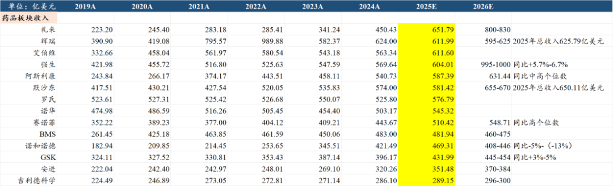

①礼来凭借减肥药登顶MNC药品收入，2025年替尔泊肽的收入365亿美元、收入占比达到56%，而2022-2025年礼来的收入增量是366亿美元。

礼来在2026年将挑战800亿-830亿美元药品收入，创造全球MNC（非新冠）的新纪录，虽然GLP-1类药物以及礼来总体收入都不可避免的要有所降速，也有投资人担心对应的CDMO的增速下降，这个是收入基数快速扩大后必然面对的问题，但从2026年来看销售额增量的绝对金额依然可观，更明显的降速可能在2027年出现。

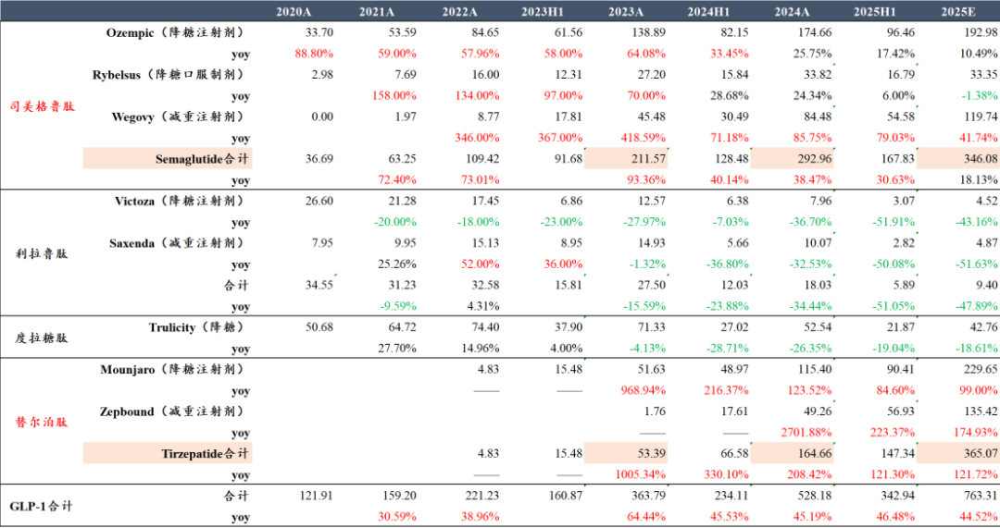

与之相对的是诺和诺德25年销售不及预期的同时、指引26年收入下滑5%-13%，高位至今市值损失超4000亿美元，一年半时间诺和诺德跌没了半个中国创新药全行业总市值。

②艾伯维两款自免超重磅药物高速增长，在自免领域收入断崖式领先（304亿美元VS第二赛诺菲184亿美元），2026年艾伯维可能超越辉瑞成为MNC top2，距离艾伯维从雅培分拆出来已经过去13年，艾伯维的市值达到雅培的2倍，收入达到雅培的1.4倍。

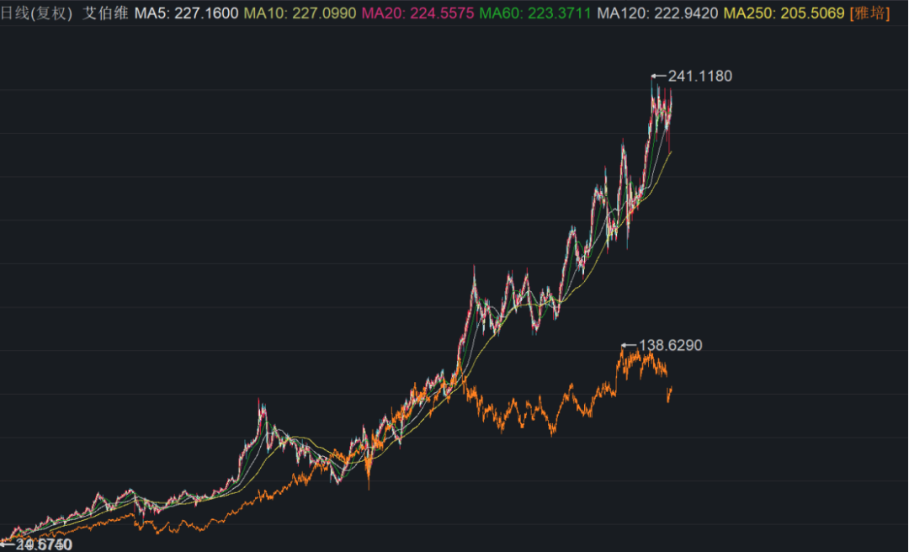

自免的另一巨头赛诺菲高度依赖度普利尤单抗，2025年全球销售157亿美元同比增长20%，赛诺菲对下一代自免双抗的开发也较为重视，目前已经有IL-13\*TSLP双抗开启首个全球III期临床。

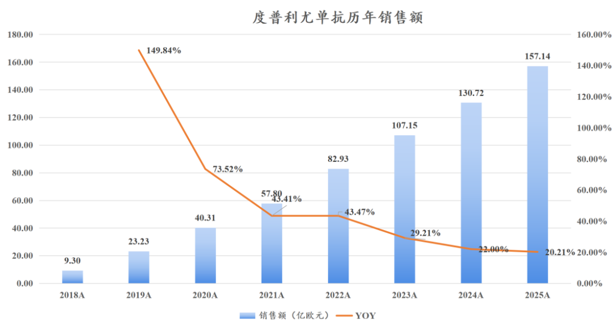

③辉瑞新冠药/新冠疫苗继续下滑，未来3年还将有收入占比近半的品种专利到期或者有下滑压力，新冠赚的钱被辉瑞用来以430亿美元的高估值收购了Seagen，却没能带来足够重磅的增量品种，其在25年以超60亿美金总交易对价引进了三生的PD-1\*VEGF双抗，又以92亿美元的总价收购Metsera获得超长效GLP-1资产。

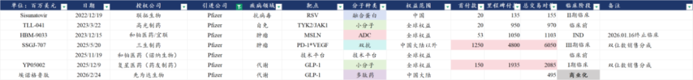

BMS也面临巨大的专利悬崖压力，辉瑞/BMS的阿哌沙班全球销售额144亿美元、将在未来2年专利到期，也是难兄难弟了。相比辉瑞，BMS在2023年引进百利天恒的EGFR\*HER3双抗ADC后似乎就一直对国内创新药的BD兴趣缺缺，什么时候会来中国区扫货呢？

⑤强生稳健的令人羡慕，哪怕有百亿美金大品种乌司奴单抗专利悬崖和伊布替尼的竞争压力，仍能维持非常稳健的增长，2025年MNC中肿瘤业务增速第一、超越罗氏和BMS跻身全球TOP3肿瘤巨头，在多发性骨髓瘤领域的统治力仍在强化。

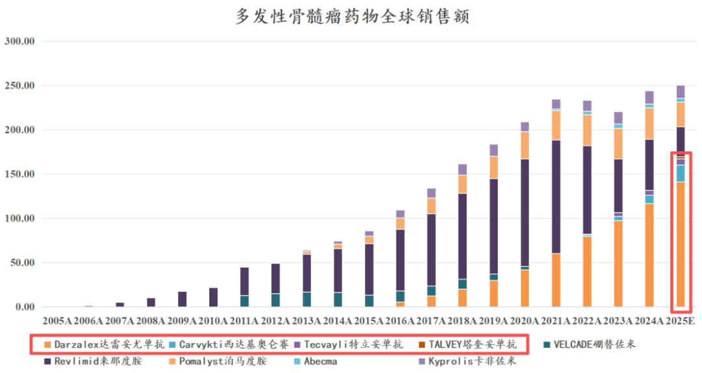

2、MNC中国区收入

MNC制药业务在中国收入TOP3的公司是阿斯利康、诺华、罗氏三家欧洲药企，相对来说美国的顶级药企礼来、艾伯维对中国市场都不算非常重视，辉瑞、强生则是没有单独披露中国区收入。

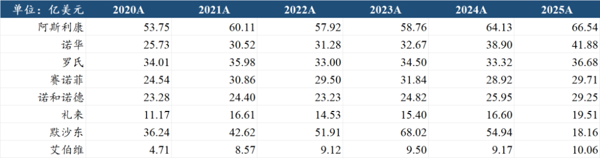

以上中国区收入TOP5的MNC，按人民币计价的中国区收入大概分别是（简单按美元/人民币汇率7计算）466亿元、293亿元、257亿元、208亿元、205亿元。按国内药品销售三大终端2025年合计约1.85万亿元的销售额计算，TOP5的MNC市占率分别约为2.52%、1.58%、1.39%、1.12%、1.11%。

国内上市药企中，2025年药品板块收入的TOP5大概是百济神州接近380亿（海外为主）、中国生物制药330亿+（集团合计）、恒瑞医药280亿+（不含BD收入）、复星医药260亿+（不含原料药）、石药集团210亿+（成药业务）。

不考虑海外收入为主的百济的情况下，即便是在国内战场，中国药企与MNC之间的收入差距依然存在，并且不小，中国生物制药、恒瑞、复星、石药的市占率分别约为1.78%、1.51%、1.41%、1.14%。

中国药品市场的行业集中度也是非常低，以上5家MNC+4家国产龙头合计的市场份额只有13.57%。

如果考虑未上市的扬子江（约700亿药品收入）、修正药业（约600-650亿药品收入）、齐鲁（约370亿药品收入，包括10亿美元出口）等巨头，CR10可能也只有17%-19%左右，显著低于MNC在全球的市场份额——CR10在45%-48%，也显著低于日本医药行业50%+的CR10。

中国药品市场远没有进入行业整合出清、龙头做大做强的阶段。

3、重点疾病领域

2025年全球药品销售TOP100的品种合计销售额为5642亿美元，TOP100的“门槛”是阿斯利康的IL-5单抗贝那利珠单抗（Fasenra），2025年全球销售额19.81亿美元，而2024年全球TOP100品种合计销售额约为5100亿美元，TOP100的“门槛”则是瑞德西韦的18亿美元。

2020-2025年的5年间，全球TOP100药品的门槛从15.4亿美元提升至19.8亿美元，超百亿美金的超级重磅炸弹药物数量从3个增加到13个。

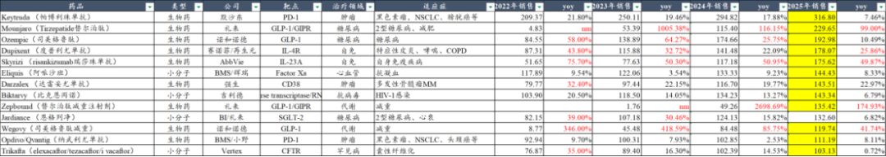

①肿瘤领域

肿瘤领域我们统计的67个药品合计销售额接近2000亿美元，肿瘤药在全球药品销售中的占比预计也达到20%左右，是全球第一大药物领域，其中：

10款IO药物（PD-1单抗、PD-L1单抗、LAG-3单抗、CTLA-4单抗）合计全球销售额达到611亿美元，占重点肿瘤药销售额超过30%。帕博利珠单抗一款药物销售额就达到317亿美元。二代IO之所以在2024-2025年被市场如此重视、并且引得一众头部MNC纷纷下场BD引进项目，原因就是超大的市场容量，并且二代IO由于显著延长的PFS，潜在用药时长可能被大幅延长，在定价与第一代IO接近或者可能定价更高的情况下，市场容量也将被进一步扩大。

前列腺癌与乳腺癌分别是美国男性和女性的第一大癌种，也分别是全球第四和第二大癌种，患者群体庞大、患者生存期和治疗周期长，天生是诞生大药的领域。

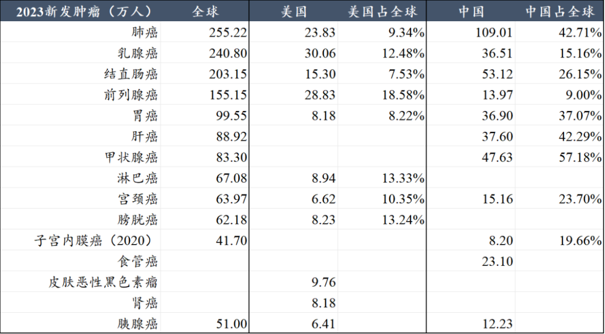

前列腺癌领域，6款药物贡献了超160亿美元的全球销售额，其中3款AR抑制剂实现了125亿美元的全球销售额，AR抑制剂还在持续迭代，适应症覆盖最全面的首款第二代AR抑制剂恩杂鲁胺的全球销售额预计2025年突破60亿美元，安全性最好、唯一在联用多西他赛治疗mCSPC取得成功的达罗他胺近年呈现最迅猛的增长趋势。

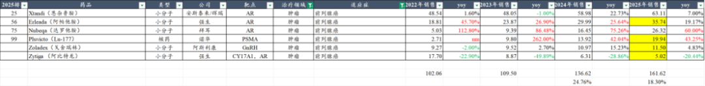

前列腺癌后续疗法也仍在迭代创新，诺华的Lu-177虽然在2L mCRPC的注册临床有一定争议，但不妨碍其2L适应症获批后销量快速攀升，2025年已经达到近20亿美元的全球销售额，预计2026年有望挑战30亿美元。

辉瑞的Mevrometostat（EZH2i）联用恩杂鲁胺二线治疗前列腺癌将在今年公布III期数据，意在解决AR抑制剂耐药问题。另外默沙东/第一三共、BioNTech/映恩生物已经启动了B7-H3 ADC针对mCRPC的全球III期临床，就在前几天映恩生物和翰森制药共同公布了B7-H3 ADC针对后线CRPC的早期临床数据。

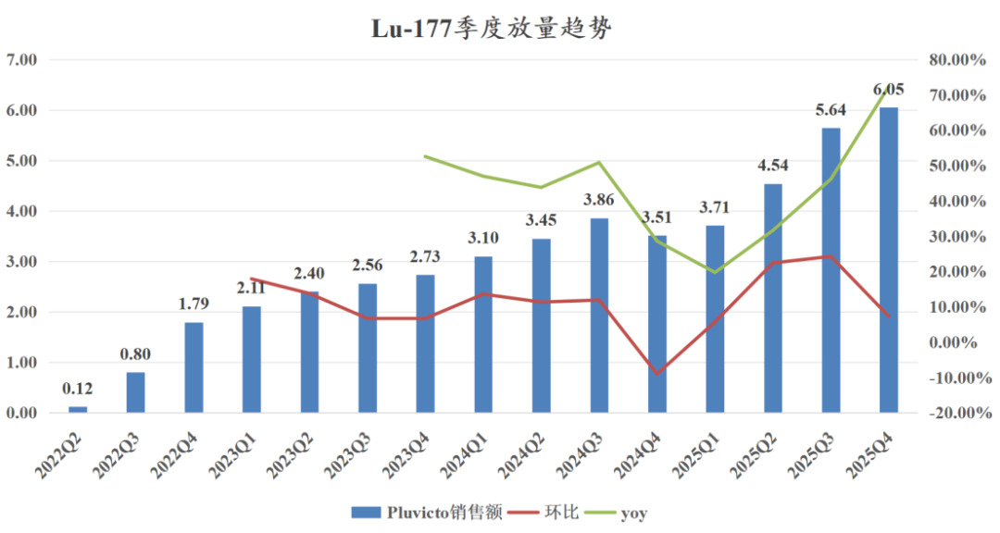

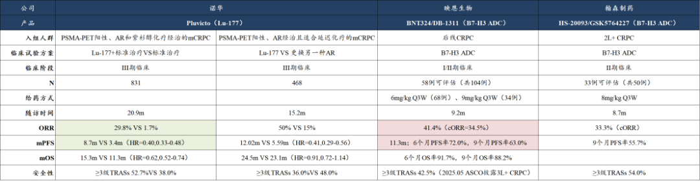

乳腺癌领域有两大重点靶点，HER2、CDK4/6，未来可能还会增加一个TROP2在乳腺癌领域有所建树。

HER2靶点的6款重点药物合计全球销售额达到157亿美元同比增长10.6%，其中第一三共/阿斯利康的Enhertu（HER2-ADC）超越帕妥珠单抗登顶，2025年全球销售额达到49.82亿美元，有望成为未来的百亿美金超级重磅炸弹药物。基于Top1i毒素的HER2-ADC目前仅有第一三共的德曲妥珠单抗，目前在海外进行全球III期临床的也只有映恩生物/BioNTech的DB-1303/BNT323，后续的HER2-ADC再在欧美开全球III期临床可能都需要面对与德曲妥珠单抗的头对头临床试验，难度上一个台阶。

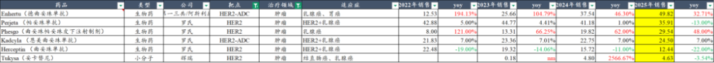

CDK4/6靶点的3款重点药物合计全球销售额达到146亿美元同比增长15.1%，哌柏西利的市场份额持续下降，诺华的瑞波西利凭借在一线晚期乳腺癌的3个III期临床均达到OS显著获益、早期乳腺癌辅助治疗最广泛人群覆盖而市场份额快速提升，2026年有望超越阿贝西利登顶CDK4/6抑制剂。

CDK靶点后续在研管线也较为丰富，相比于原有的CDK4/6抑制剂，如辉瑞、百济等公司致力于开发CDK4抑制剂以减少CDK6的骨髓抑制的毒性问题，上周百济的文章也讲到百济很快将开展CDK4抑制剂的全球III期临床。同时Incyte、辉瑞、百济等公司也在开发CDK2抑制剂，以应对CDK4/6耐药的问题，此前2024年齐鲁锐格的CDK2和CDK2/4/6抑制剂曾以8.5亿美元首付款的高价将全球权益授权给罗氏。

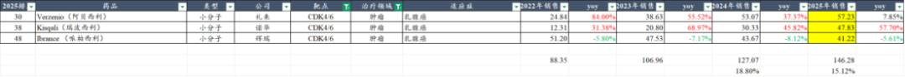

血液瘤方面，全球重磅品种在更迭中，我们统计的23个重点品种全球销售达到540亿美元，血液瘤享受肿瘤药的定价和慢病药的超长生存期和用药时长，也成了诞生大药的温床。除了上文提到的多发性骨髓瘤领域强生的超强统治力以外，在CLL/SLL、MCL领域的BTK抑制剂的市场格局也在变化。

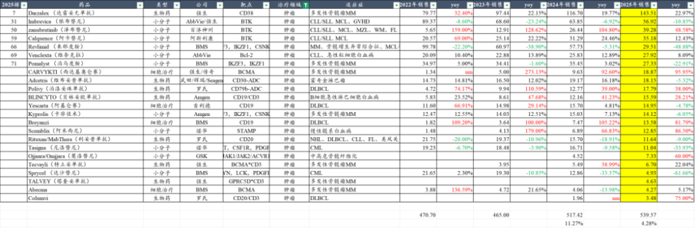

BTK靶点的5款重点药物合计全球销售额达到138.4亿美元同比增长9.5%，百济神州的泽布替尼贡献了超越行业总量的增长，25年达到39.3亿美元的全球销售额，市场份额提升至28.39%，市场份额超越比泽布替尼早3年上市的阿卡替尼，伊布替尼则是双位数下滑，相较峰值销售额已经下滑了超40亿美元。泽布替尼有望在2026年接近50亿美元大关。

百济在该领域的统治力不仅体现在泽布替尼一款产品，还有后续的索托克拉（Bcl-2抑制剂）、BGB-16673（BTK CADC）等品种的联合疗法，上周我们也着重分析了百济神州的25年财报情况《[创新药之王新征程](https://mp.weixin.qq.com/s?__biz=MzkyMzQ3MDc3Mw==&mid=2247485661&idx=1&sn=a8e7b6f76ec129f81007a8a778e61987&scene=21#wechat_redirect)》。

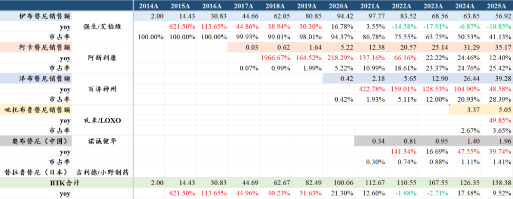

细胞治疗领域Carvykti已经在25Q2就登顶全球细胞疗法销售TOP1，预计至今已经累计治疗了上万名患者，但可惜的是传奇/金斯瑞错过了超百亿美元估值被并购的机会，至今居然跌到只有35亿美元的市值，反观时间上落后几年的竞品Arcellx反倒被吉利德科学以78亿美元的总交易对价并购，实在是令人唏嘘，在商业化高速放量的黄金阶段被高价并购是biotech公司很好的结局，没想到错过宝贵的时间窗口后的代价会那么惨痛。

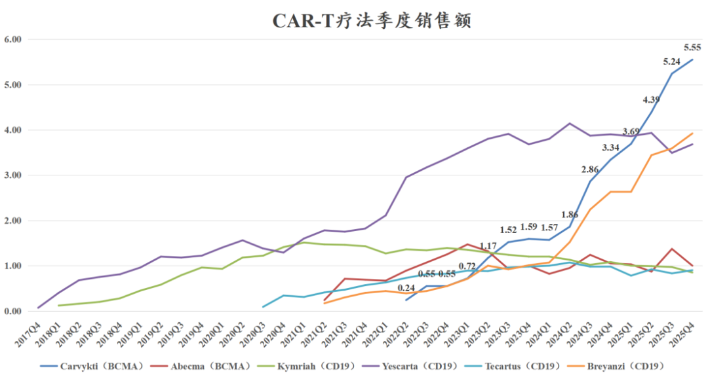

肺癌领域销售规模最大的一款靶向药——三代EGFR抑制剂奥希替尼，2025年全球销售72.54亿美元同比增长10.24%，截至目前欧美市场仅有三款三代EGFR抑制剂获批，分别是2015-2016年获批的阿斯利康的奥希替尼、2024-2025年获批的强生的兰泽替尼+埃万妥单抗联合疗法，以及2025-2026年在英国和欧盟获批的翰森制药的阿美替尼。  
反观中国市场，目前已经有10款第三代EGFR抑制剂获批上市、还有2款处于注册申报阶段，另还有几款在III期临床阶段，面对大适应症，国内的重复研发层出不穷，CDE审批来者不拒，众多竞争者又给了医保局谈价的空间，注定了大品种的价格、市场份额都会很容易受到压制。

②自身免疫及呼吸领域

自免及呼吸领域统计的38个品种合计销售额达到1500亿美元，同比增长11.1%，单品种平均销售额达到39.6亿美元，行业内出现了35款销售额超10亿美元的重磅炸弹药物，是密集诞生重磅炸弹药物的疾病领域，行业增速以及单品种的平均销售额都还要高于肿瘤领域。

皮肤科是自免最核心的疾病领域，除了上文提到的自免领域第一大药物——赛诺菲/再生元的度普利尤单抗（主要适应症中重度特应性皮炎）以外，艾伯维用于特应性皮炎和IBD的小分子药物乌帕替尼也实现了高速增长，2025年全球销售83亿美元同比增长39%，预计26-27年很可能成为下一个百亿美金的超级重磅炸弹药物。

皮科另外两个核心靶点，IL-17、IL-23靶点的6款重磅药物在2025年合计销售额高达416亿美元同比增长16.3%，其中自免领域第二大药物Skyrizi在2025年的全球销售额达到175.6亿美元同比增长50%，这是近年来在银屑病和IBD领域表现最出色的药物，预计在银屑病和IBD领域的销售额分别达到百亿美金和超60亿美金。同为IL-23p19靶点的强生古塞奇尤单抗在2025年也实现了高速增长，销售额超过50亿美元，同比增长40%，但仍远不能弥补乌司奴单抗的下滑，2025年乌司奴单抗销售额下滑超40亿美元。

司库奇尤单抗（IL-17A）和比美吉珠单抗（BIMZELX，IL-17A/F）分别在2023年和2024年在欧美市场获批了化脓性汗腺炎（HS）这个患者群体庞大、治疗意愿较强、缺少创新疗法的适应症，由此带来了司库奇尤单抗2024年的销售增长超10亿美元、比美吉珠单抗2025年销售增长接近20亿美元，UCB的IL-17A/F也成为2025年自免领域增长最迅猛的重磅药物之一。

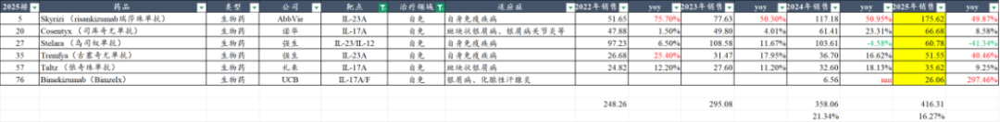

多发性硬化领域，传统MS龙头公司Biogen已经低迷了几年，罗氏和诺华的两款CD20单抗在MS领域大放异彩，25年分别销售85亿美元和44亿美元，合计接近130亿美元的销售，MS总的市场规模超过160亿美金。

多发性硬化领域新的突破来自小分子BTK抑制剂，罗氏的BTK抑制剂Fenebrutinib在2025年11月公布在RMS和PPMS均取得III期临床成功，并于26年2月初公布在治疗原发性进展型多发性硬化（PPMS）中将患者残疾进展风险相较其CD20单抗Ocrevus（奥瑞利珠单抗）降低了12%，且常见不良事件发生率与Ocrevus相当。诺诚健华的奥布替尼目前也已经启动治疗PPMS和SPMS的全球III期临床。

艾加莫德是自免领域另一个最值得关注的超级大品种，2025年全球销售41.51亿美元同比增长89.9%，艾加莫德在全球和国内的放量趋势如下图所示，还是很让人唏嘘的。

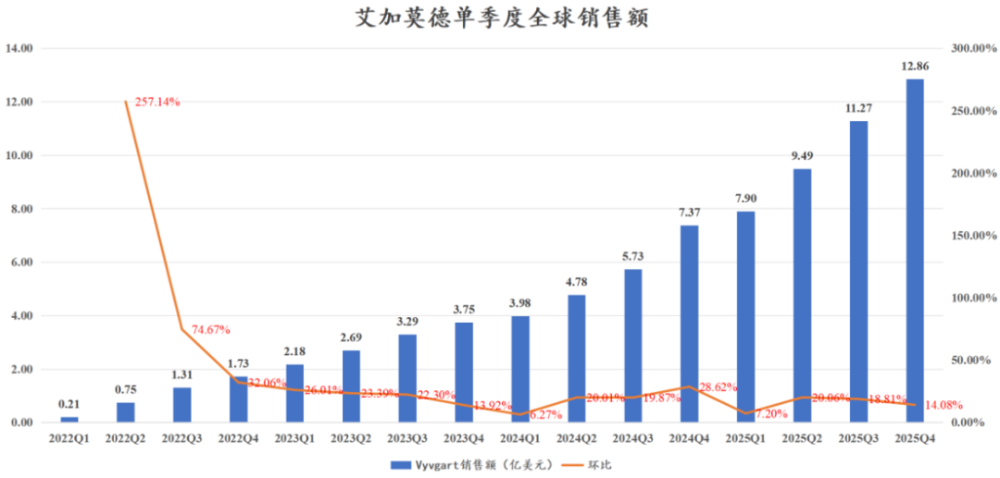

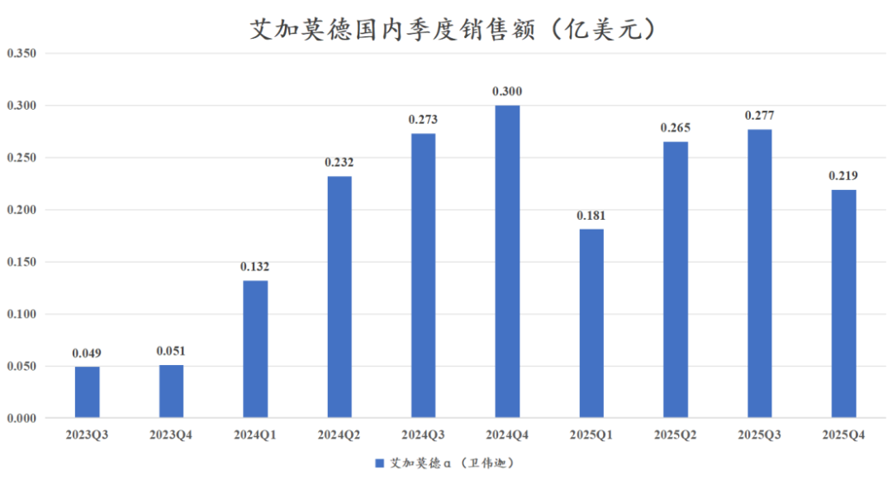

优时比的FcRn单抗在2023年6月获得FDA批准，强生的FcRn单抗在2025年4月底获得FDA批准，销售体量都和Argenx有较大差距，UCB的Rystiggo在2025年全球销售额为3.32亿欧元同比增长65%，另外UCB还有另一款治疗重症肌无力的C5补体抑制剂环肽药物在2025年全球销售额2.17亿欧元同比增长201.4%。Argenx以40亿美元的销售、500亿美元的市值再次验证了FIC药物在欧美市场的极强市场统治力。

呼吸领域另一款值得重点关注的药物Tezspire（特泽鲁单抗，TSLP）在2025年实现了19.36亿美元的全球销售额，TSLP在呼吸领域还是被寄予厚望，下一代超长效TSLP单抗以及超长效TSLP双抗都在临床开发中。

③糖尿病、心血管、减重及其他代谢领域

代谢领域31款重点药物合计实现约1580亿美元的全球销售额，其中最大的亮点大家都知道，必然是GLP-1类药物替尔泊肽和司美格鲁肽，替尔泊肽在降糖和减重适应症上从前几个季度的处方量超越、到现在单季度的销售额已经全面超越司美格鲁肽，替尔泊肽在2025Q3-Q4的全球市场份额已经超过50%。

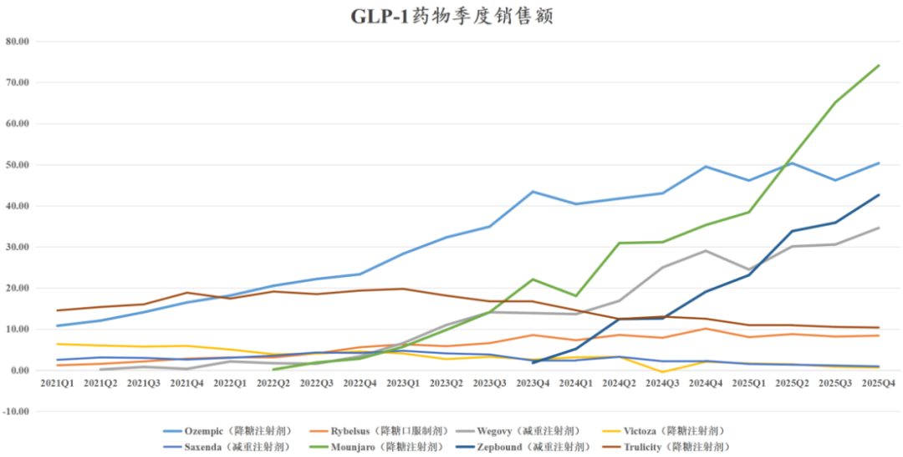

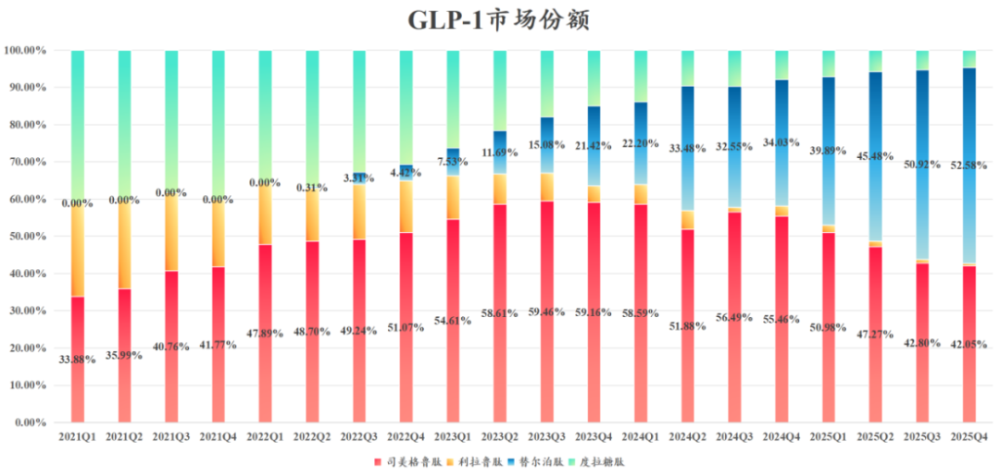

非酒精性脂肪肝的全球首款靶向药Rezdiffra（TGF-β）在2025年实现9.59亿美元的全球销售额，同比增长442%，Q4单季度销售额爬坡至3.21亿美元。

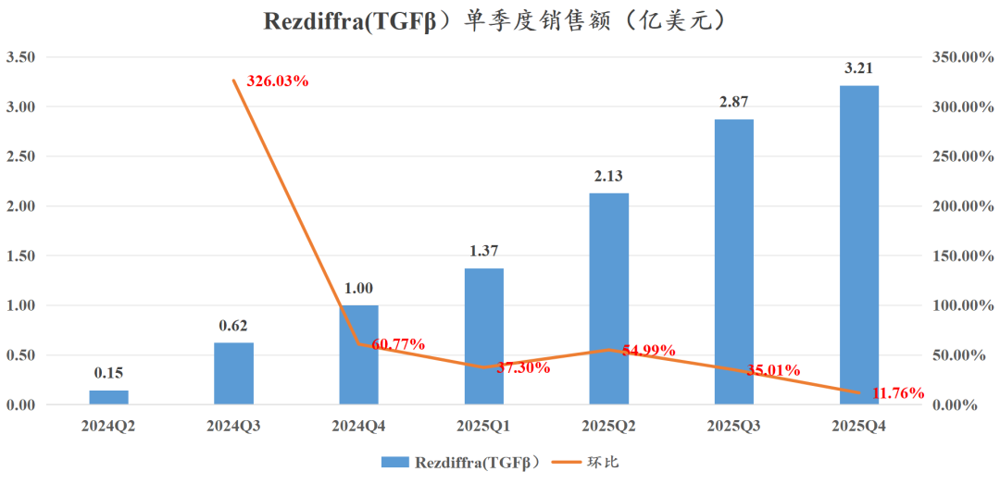

降血脂领域近年全球最重点的靶点是PCSK9，国内陆续也有不少患者开始使用PCSK9单抗药物治疗了。该靶点在国内也是快速陷入内卷，但在欧美市场目前主要还是安进/安斯泰来、赛诺菲和诺华三家，其中安进的PCSK9单抗Repatha（依洛尤单抗）在2025年销售30.16亿美元+35.7%，而诺华的PCSK9 siRNA药物Leqvio（英克司兰）在2025年销售11.98亿美元+58.9%，两款药物合计实现42亿美元全球销售额、同比增长41.6%，诺华的英克司兰可以实现半年一次的给药间隔，但在实际商业化中并未能快速取代Q2W/Q4W的PCSK9单抗的市场份额。

④疫苗和抗病毒药物

疫苗和抗病毒药物自新冠疫情后基本“一蹶不振”，2022年的巅峰时期仅TOP100的药物中有22个品种是抗病毒及疫苗领域的药物，合计销售额达到1430亿美元的全球销售额，到2025年合计29个抗病毒及疫苗领域重点品种合计销售额756亿美元，包括300亿美元的HIV药物、310亿美元的常规疫苗、100亿美元的新冠药+新冠疫苗，曾被寄予厚望的RSV疫苗和RSV长效抗体也未能实现大的突破，2款RSV疫苗和1款RSV抗体2023-2025年合计销售额分别30.76亿美元、33.40亿美元、39.01亿美元。

......

MNC之间在出现非常明显的分化，这是一个超级重磅品种频出的时代，这是一个技术快速迭代进步的时代，这也是一个专利悬崖纵横、MNC疯狂寻求新的增长点的时代，更是中国创新药难得的在全球市场和中国市场都在蓬勃向上的时代。

短期纵使存在很多交易层面的扰动，行业受制于一些我们此前专门撰文讲到的内因和外因的交困，我们仍然相信，现在是积累优质标的的时候。

风险提示：本文仅讨论行业/公司经营情况，投资需综合考虑公司经营、估值、管理层等多方面因素，建议读者审慎参考，本文不作为投资依据，不建议大家根据本文做出投资计划。

<!-- wxmp-comments-begin -->

---

## 留言（12 条，含回复共 22 条）

- **廖书豪** 👍6 · 2026-03-04 10:17
  对于中国MNC/管线的估值有种恨铁不成钢的感觉，当然市场如果修正就是极大的超额收益，但就怕市场永远是对的[捂脸]
- **雪山之巅8866** 👍2 · 2026-03-04 09:48
  创新药没眼看
  - ↳ **作者** · 2026-03-04 09:58
    如果说创新药前期还是在内因和外因交织下的下跌，3月以来则是在系统性风险下的加速下跌，这种基本面向上、但板块因系统性风险而全行业杀跌，是最容易出现错杀和买点的时间，其他的就见仁见智吧。
- **ฅ*panda** 👍1 · 2026-03-04 09:48
  开了美股账户后开始就买了礼来，后来又尝试买了别的什么QQQ、二倍黄金白银，都没赚钱还拿不住，最后老实了，有美元进去就买礼来[旺柴]
- **大内总管** 👍1 · 2026-03-04 10:03
  久违的开启了创新药基金的加仓 同步还加了器械etf~
  请教下龙哥 您是不是等那些出海不错的器械出了年报后  才能对他们开始点评[机智]
  求三友&amp;联影~~~
  另外想再请您下 我觉得大跌的情况下 本性都是会有些慌  您是如何处理这份心情的呢
  - ↳ **作者** · 2026-03-04 10:13
    年报披露后能讲的内容会多一些，算是个契机，器械出海的公司里，我们之前重点提到的那些公司，应该都会单独或者汇总文章来聊聊的，毕竟在当前时间点来说在出海方面做的能说是比较不错的公司还是少数的。
    
    资本市场的概率分布本身就是尖峰厚尾，可能很多投资人对系统性风险没有太多理解和承受能力，但必须要承认的是，资本市场出现系统性风险并不是统计学中的“小概率事件”，而是必然事件，每隔1-2年基本都会发生一次，AH是这样，美股也是如此，经历的多了，可以稍稍控制一些自己的情绪。实际上你要说恐慌，我们在去年8-9月行业一片狂热的时候内心是更恐慌的，要面对的是，既要跟上行情、又要在市场火热的时候去判断行业顶部和泡沫。现在对行业板块反而没那么恐慌，更多的是思考在行业性杀估值后该抄哪些优质低估资产。
- **马毛滚雪球** 👍1 · 2026-03-04 10:26
  原文“前列腺癌与乳腺癌分别是美国男性和女性的第一大癌种，也分别是全球第二和第四大癌种”，看表格数据，前列腺癌与乳腺癌分别是全球第四和第二大癌种，原文数据写反了吧
  - ↳ **作者** · 2026-03-04 10:40
    是的，乳腺癌是全球第二大癌种，前列腺癌是第四大癌种，这里写错了，我来修正一下，感谢提示纠正[抱拳][抱拳]
- **赶路的** · 2026-03-04 09:57
  能不能多讲讲未来的预测
  - ↳ **作者** · 2026-03-04 10:02
    我们有的文章是讲对产业趋势的预判，有的文章是总结当前的情况，文章内容可能做不到每一篇都能全面的把行业过去现在未来都讲一遍，我们发文频率不算非常高，每周2篇左右，每周的文章可以都读一读，对我们的观点和判断可能会有更直观的了解。
- **丁山** · 2026-03-04 10:03
  龙哥，继续定投159892是不是我们散户最优的选择呢？
  - ↳ **作者** · 2026-03-04 10:05
    每当系统性风险暴露、板块出现情绪性的急跌，是定投比较好的时间吧。当然这个也取决于你对短期情绪的一个大致判断，毕竟早两天晚两天都可能差不少，择时总体还是困难的事。
- **鲲鹏** · 2026-03-04 10:10
  南微医学跌了个大的，惨不忍睹，感觉业绩相对还行啊，没业绩板块公司的蹭蹭涨
  - ↳ **作者** · 2026-03-04 10:19
    业绩快报利润低于预期吧，然后这周全市场的系统性风险你也看到了。
- **灵感自在** · 2026-03-04 10:24
  龙哥，为啥百济ah差那么多？但是恒瑞就没有？
  - ↳ **作者** · 2026-03-04 10:43
    百济的流通盘大头在H股和美股，属于港美股定价的公司，A股的流通盘很小，在A股市场又属于创新药里国际化成功的稀缺龙头资产，被内资买到溢价。恒瑞的流通盘大头在A股，属于A股定价的公司，H股是刚发行的，流通盘小，因此AH差价不大。
- **suker** · 2026-03-04 10:54
  龙大 时代天使的业绩符合预期吗
  - ↳ **作者** · 2026-03-04 10:59
    利润略超市场预期吧，之前公司的指引特别保守，是说和24年差不多持平，实际市场预期没那么低的。具体情况还要看正式的年报吧，光看一个表观利润的意义也没有特别大，还是要看业务发展的情况。
- **JeFF** · 2026-03-04 11:04
  龙哥，康龙也算是CXO核心标吧？今年有没有什么催化事件，谢谢
  - ↳ **作者** · 2026-03-04 11:14
    康龙今年还是有积极的边际变化的，主要是CDMO这边今年应该会有一些CMO的项目，康龙虽然这几年确实在新技术领域基本没跟上吧，在小分子领域的竞争力还是在的，没享受到行业景气度向上的细分赛道，弹性可能没那么大，比较稳健的二线龙头。
- **无名** · 2026-03-06 06:29
  老师对艾力斯一季度预报数据怎么分析？会不会是有新药进入销售加量阶段？
  - ↳ **作者** · 2026-03-06 08:17
    KRAS G12C新纳入医保的放量有一定贡献，伏美替尼也依然有不错环比增长。

<!-- wxmp-comments-end -->
