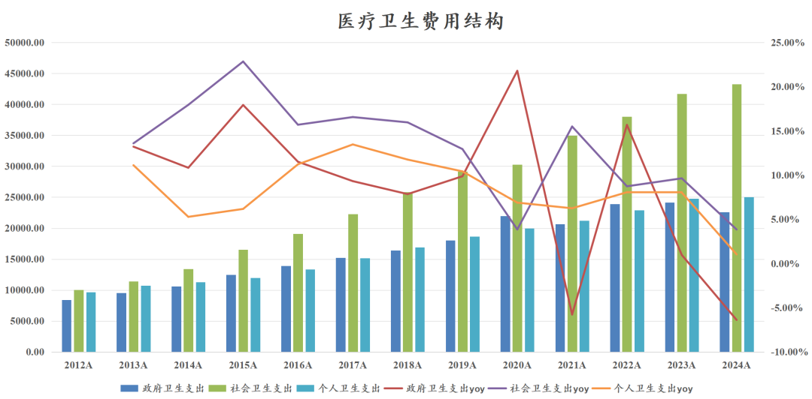
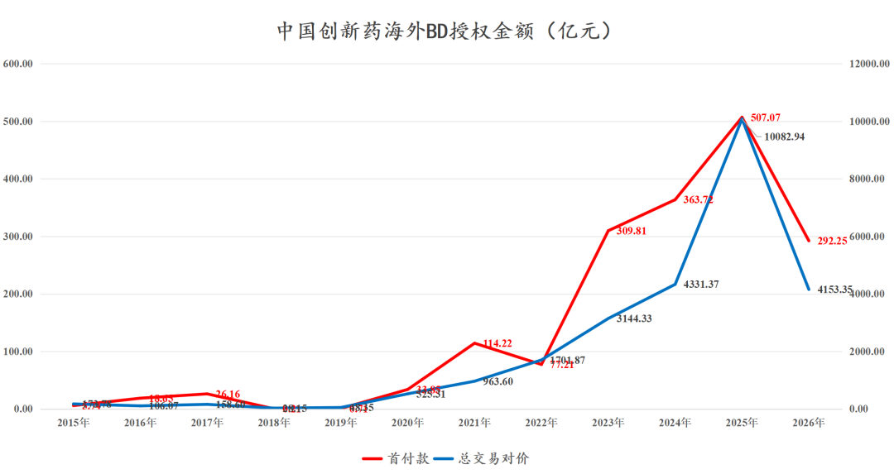

# 支持产业发展可以多给点钱吗？

大家好，我是龙哥。

今天大家最关注的事情应该就是2026年政府工作报告的内容，其中在医药领域有一些变化，我们本文简单总结一下。

①创新药行业定位：

- 2021-2023年政府工作报告基本以强调集采为主。
- 2024年政府工作报告将创新药列为战略新兴产业。
- 2025年政府工作报告将生物制造、量子科技、具身智能、6G等列为未来产业，强调制定创新药目录等切实支持创新药械发展的举措。
- 2026年将集成电路、航空航天、低空经济、生物医药一起列为新兴支柱产业。

行业的定位被拔得很高。

②财政补助：

2026年财政对医保个人账户的人均补助金额提高24元/年，而过去2020-2025年每年财政对个人账户补贴金额提升都是30元/人/年，2025年的财政补贴是每人每年不低于700元，个人缴纳是每人每年不低于400元。

2020-2026年的财政补贴金额增速分别为5.8%、5.5%、5.2%、4.9%、4.7%、4.5%、3.4%，2022-2024年城乡居民医保的缴纳人数分别为-2.50%、-2.09%、-1.64%。

以此计算2022-2024年财政补贴居民医保的金额增速是2.8%、2.7%、3.0%，大致推算2025年的增速大概是3.1%。

2025年居民医保收入合计11226.4亿元+0.41%，居民医保支出合计10657亿元-0.04%。大致推算2025年居民医保人均收入约1200元+1.7%，人均支出约1140元+1.3%，均显著低于人均GDP增速5.1%。

政府卫生开支在医疗支出中的比重从2022年的28.2%下降至2024年的24.9%。社会资本承担了更多的医疗责任。

另外强调：

i.鼓励政府投资基金做“耐心资本”，支持初创医药企业。

ii.强调加快发展商业健康保险。

③医改重点：

i.扩大外商独资医院试点和生物技术开放。

ii.强调落实家庭医生，从而落实分级诊疗。

iii.推动省级医保统筹，盘活医保结余资金使用。（解读在此：[国内外两大重要医药政策](https://mp.weixin.qq.com/s?__biz=MzkyMzQ3MDc3Mw==&mid=2247485250&idx=1&sn=26b1db9e62c4b9bc35e696f701dae3fa&scene=21#wechat_redirect)）

④新技术领域：

提了具身智能/脑机接口是未来产业投入重点。

......

2023-2026年创新药出海展现了非常积极的产业趋势，创新药用自己的全球竞争力证明了“行业值得被支持和发展”，是可以用知识产权赚全球的钱、并创造大量高薪就业岗位的生意，可以作为高端产业升级的重点方向之一。

从我们过去对全球创新药产业的发展趋势分析来看，日本本土医药市场的长期降本控费压力使得日本药企的全球竞争力逐渐减弱，欧洲本土医药市场的压力与日俱增、与美国市场拉开差距，也使得欧洲MNC的全球份额全面被美国MNC反超。

一个强大的本土创新药支付市场对于产业发展也是至关重要的。

因此，在支付方面，还是希望能看到一些积极的变化，简单说就是，支付方再多给点钱吧。

......

[医保砍价，股价历史新高](https://mp.weixin.qq.com/s?__biz=MzkyMzQ3MDc3Mw==&mid=2247485589&idx=1&sn=3da758317db21b4529507e894a75d500&scene=21#wechat_redirect)

[史上最精彩创新药价格谈判](https://mp.weixin.qq.com/s?__biz=MzkyMzQ3MDc3Mw==&mid=2247485497&idx=1&sn=5aae73398eb3f5189849cadf9b0b34b9&scene=21#wechat_redirect)

[创新药支付体系破局](https://mp.weixin.qq.com/s?__biz=MzkyMzQ3MDc3Mw==&mid=2247485461&idx=1&sn=1f47eb2c893d2f6b621bb76148f87670&scene=21#wechat_redirect)

<!-- wxmp-comments-begin -->

---

## 留言（5 条，含回复共 9 条）

- **Vincent 韩👀🐲** 👍8 · 2026-03-05 22:38
  说归说闹归闹，当真就不对了啊[旺柴]
  - ↳ **作者** · 2026-03-05 22:47
    2022年以来国内创新药行业的政策面确实是肉眼可见的改善的，这个毋庸置疑，我们也多次分析。但归根到底啊，还是得多给钱，不然僧多肉少，最后还不是存量内卷、行业通缩。
- **sc** 👍6 · 2026-03-05 22:39
  给钱才是实在话
- **Alex叔叔** 👍3 · 2026-03-05 23:25
  支付方给钱是不大可能了，财政压力巨大。
  另外，虽然美国药企强，但是美国医疗制度并不是东大学习的目标。
  - ↳ **作者** · 2026-03-06 00:45
    属于是两个极端了，肯定不可能走他们那个路，但有些东西值得学习。
- **廖书豪** 👍1 · 2026-03-05 22:40
  感谢龙哥高产按摩，请问君实最近回调的厉害是因为JS207目前2/3期一直没落地BD的原因吗，今年除了JS207还其他看点吗
  - ↳ **作者** · 2026-03-05 22:51
    首先最近大家可以看到行业是全面的下跌，流动性的因素还是主要矛盾。
    但君实算是其中跌的比较多的一家，肯定是和他近5年在出海方面没有一个像样的进展有关系的，君实的研发管线经历一波收缩，再到特瑞普利商业化放量后重新开始扩张，总体还是fast follow或者说me too为主，如果不能把握住某些重点项目出海授权的关键窗口期，就又要等下一个风口了。
- **接
受** 👍1 · 2026-03-06 00:34
  创新药属于生物医药么
  - ↳ **作者** · 2026-03-06 00:46
    应该说生物医药主要指的就是创新药

<!-- wxmp-comments-end -->
