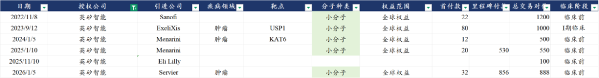
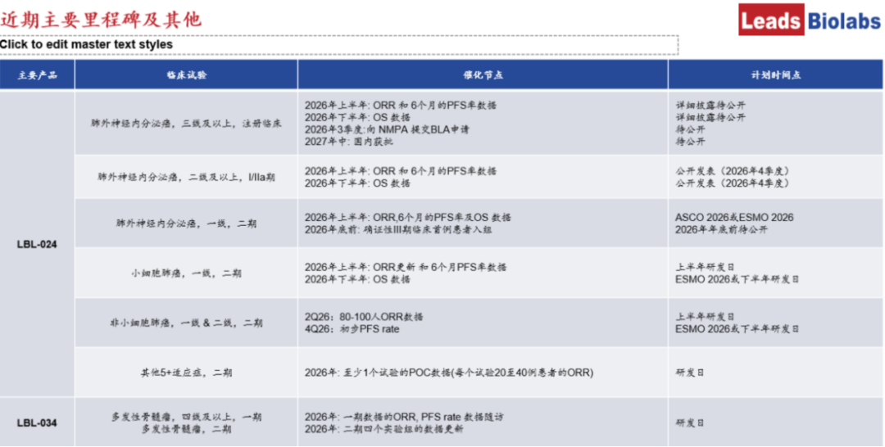
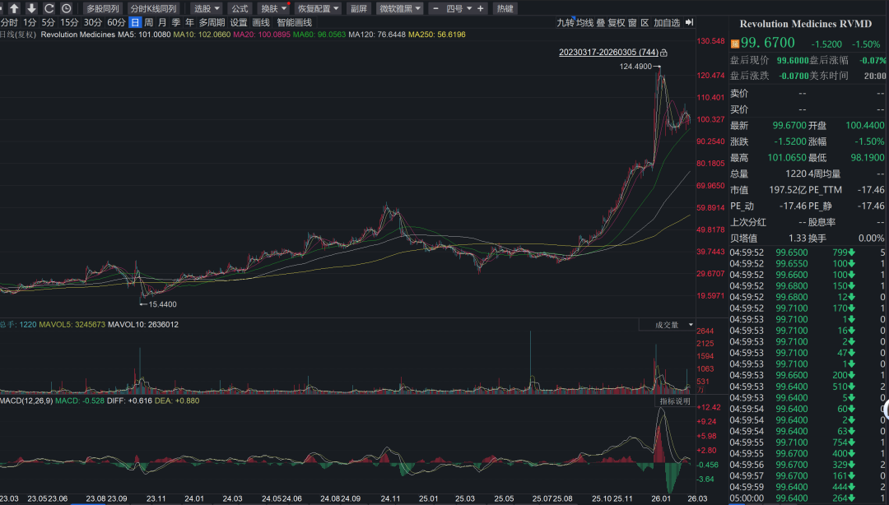
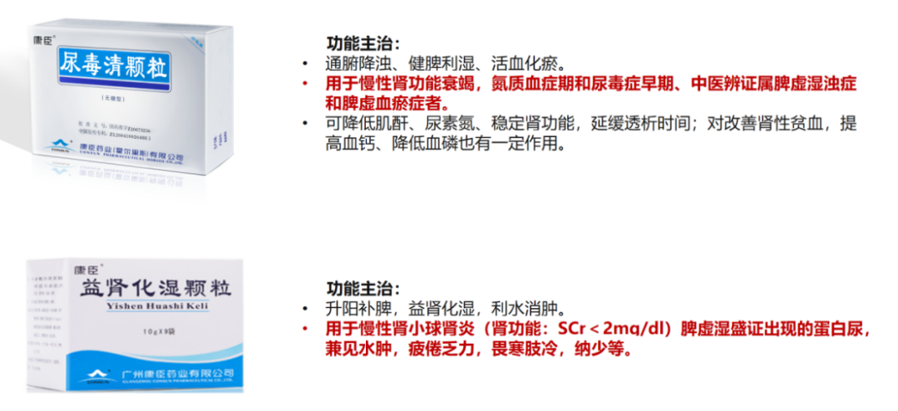
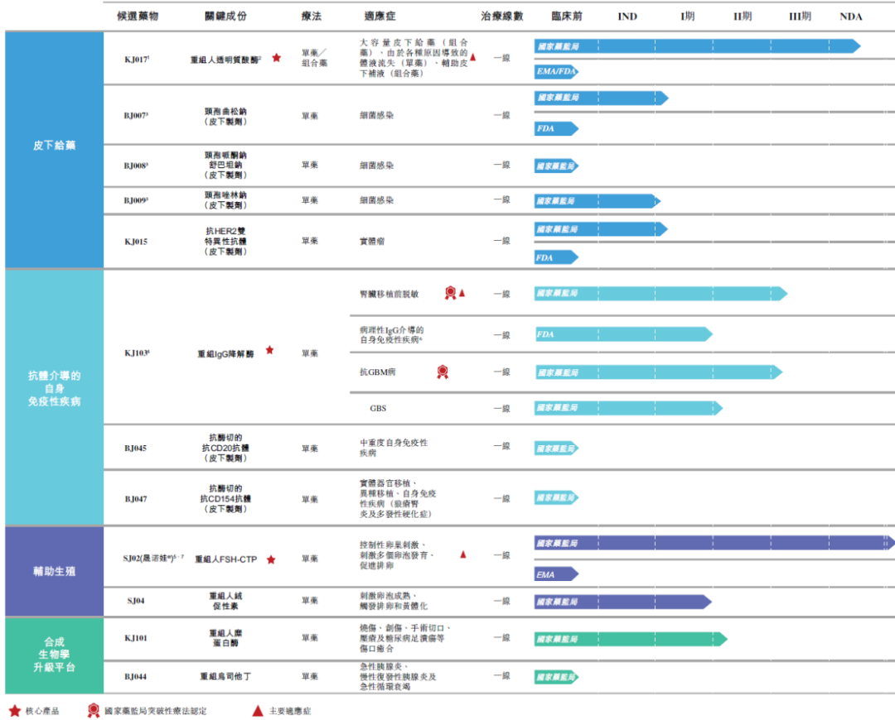
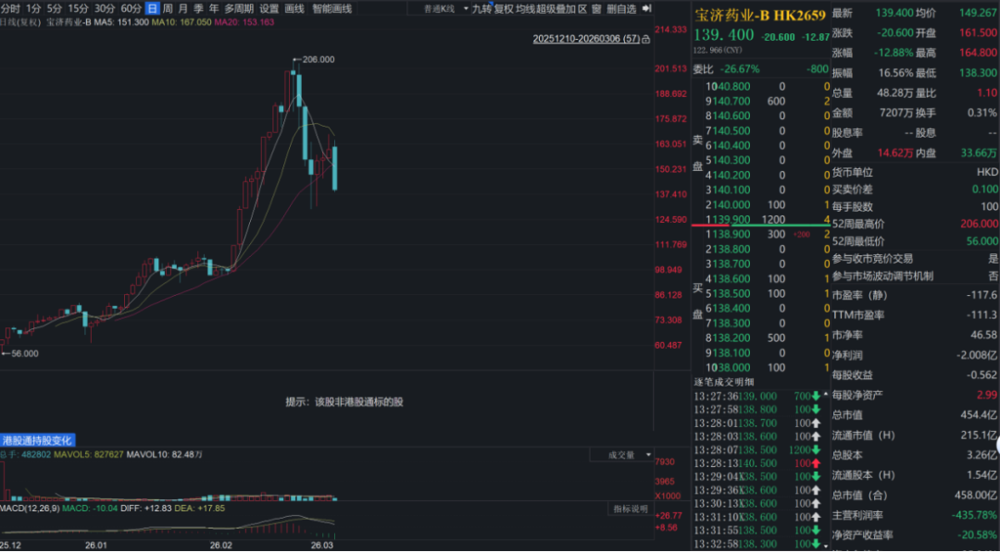
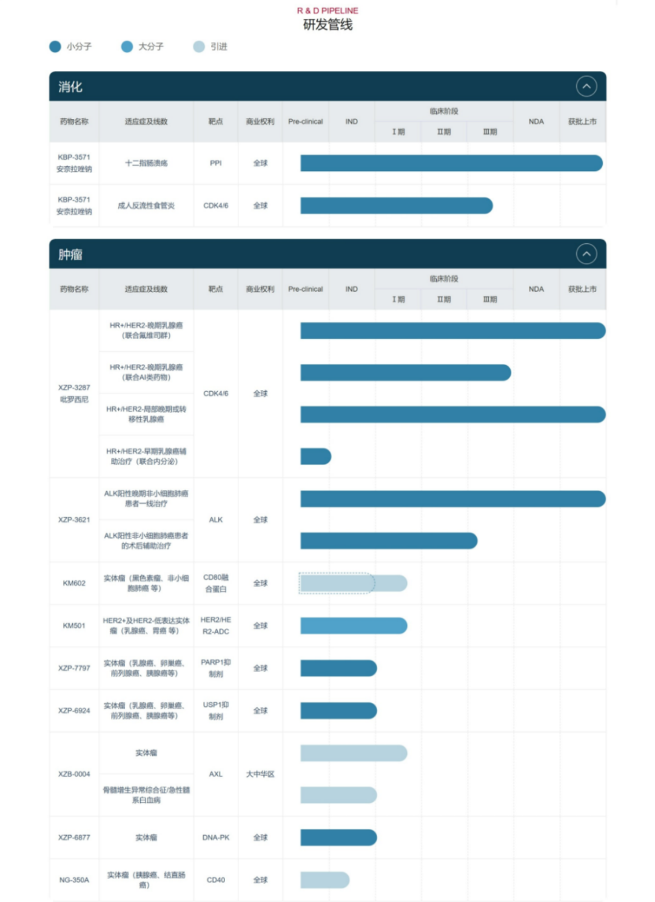
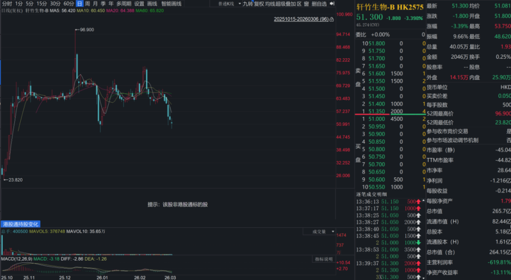

# 港股通调整，哪些公司值得关注

大家好，我是龙哥。

不知不觉又临近港股通名单调整的时间，今天收盘后港股通调整，下周一开盘前正式生效。

上一次某些庄股借助港股通名单调整和ETF持仓调整割韭菜的行为似乎还近在眼前，当时的分析文章《[坏了，药捷安康的瓜吃到自己头上了](https://mp.weixin.qq.com/s?__biz=MzkyMzQ3MDc3Mw==&mid=2247484970&idx=1&sn=22311272811206d8d758a8e097de2235&scene=21#wechat_redirect)》有讨论这个问题，本次港股通调整，也是风险与机遇并存，有些公司又被坐庄，磨好镰刀准备收割我们，还有些质地好一些的公司，入通后也是给没有港股账户的投资人们买入的机会。

本次港股通调整涉及的医药公司还是比较多的，主要是去年港股新上市了不少公司《[创新药港股IPO大爆发](https://mp.weixin.qq.com/s?__biz=MzkyMzQ3MDc3Mw==&mid=2247485020&idx=1&sn=3900ffc1d770a9f29ee8d5866eafed74&scene=21#wechat_redirect)》，不管是公司本身质地还可以、或者是因为流通盘小而估值有溢价，总之是数量和占比还是比较高的。

本次新纳入港股通的有以下公司：英矽智能、中慧生物、宝济药业、派格生物、劲方生物、轩竹生物、康臣药业、科济药业、海西新药、长风药业、维立志博。

1、值得关注的公司

①英矽智能

英矽智能是国内AI制药领域双龙头之一，另一家大家应该也都知道——晶泰控股，目前市值也不小。英矽智能与晶泰控股的商业模式均介乎创新药biotech与CRO公司之间，相对来说英矽智能与和铂医药更加接近，也即更偏向创新药biotech的商业模式，而晶泰控股更加偏向CRO的商业模式。

英矽智能的竞争优势主要包括两块：①借助优秀的生成式人工智能平台Pharma.AI进行药物研发，从靶点发现到临床前候选药物确认时间12-18个月（VS传统研发模式平均4.5年左右）。②其拥有行业顶级的数据量，自2014年开始积累的1000万组数据，其中包括10%的自动化实验室生成的数据。

业务结构来看：公司主要有3块业务：

i.创新药开发及BD授权，公司开发一系列创新药管线，其中个别最核心管线会选择自己独立往后期开发以最大化收益，其他临床前和I期管线会选择授权给国内外公司——biotech的BD授权模式，公司目前收入80%以上来自BD授权收入。公司自2022年以来达成6笔海外BD交易，还有部分国内的BD交易如在1月底与齐鲁制药达成的9.3亿港元的代谢领域药物开发合作。

ii.创新药CRO服务，基于AI药物发现平台为MNC提供临床前CRO服务，收入占比10%左右，也为沙特石油企业、医美企业等非制药领域提供材料开发服务。

iii.授权使用AI软件，托管订阅费20万美元/年，本地部署订阅费52.5万美元/年，收入占比中高个位数，这几年占比都在5%-10%左右。

公司目前在研管线有30+个项目，其中包括10个IND批件，055（TNIK，特发性肺纤维化，对标尼达尼布全球40亿美金销售额）和5411（PHD1/2，IBD适应症，300亿美金潜在市场）两个分子自主推进I/II期临床，其中055预计26H1推进到中国IIb/III期临床，预计国内入组50-70人，3年完成临床，可能2029年申报上市。

AI制药公司的问题也很直接——估值比较难给，在中早期发展阶段叠加资产稀缺性，估值可能持续维持大部分理解不了的较高水平。

②维立志博

在前阵子的文章《[超级大药，群雄逐鹿](https://mp.weixin.qq.com/s?__biz=MzkyMzQ3MDc3Mw==&mid=2247485607&idx=1&sn=4b77807612d850b2ab03ea2143c299d3&scene=21#wechat_redirect)》中我们梳理了第二代IO双抗目前的全球研发进展，维立志博的LBL-024奥帕替苏米单抗是25年下半年开始被大家关注到的一个具有第二代IO潜力的新靶点。

公司今年在5月份的研发日、6月份的ASCO以及下半年的研发日和ESMO都会有数据更新，PD-L1\*4-1BB双抗在NSCLC的II期临床入组速度超预期，200多人的大II期临床从25年7月开始入组，到26年中前后应该可以入组完，26年5月的研发日会更新更多患者的ORR数据，到四季度可能读出初步PFS率的数据。

公司目前有2款药物实现海外授权，为自免领域的双融合蛋白、三抗，分别是LBL-047（BDCA2\*TACI）和LBL-051（CD19\*BCMA\*CD3），051在2024年11月以3500万美元首付款+5.79亿美元里程碑付款授权给Oblenio Bio，047在2025年10月以3800万美元首付款+9.62亿美元里程碑付款授权给Dianthus Therapeutics。

另外维立志博还有2款TCE双抗进入临床阶段，分别是LBL-034（GPRC5D\*CD3）和LBL-033（MUC16\*CD3），LBL-034和上文提到的LBL-024双抗是公司今年做创新药海外BD的重点。

③劲方医药

劲方的管线以肿瘤领域为主，管线主要包括RAS通路的GFH925（KRAS G12C，国内已获批二线NSCLC，国内商业化权益授权给信达生物）、GFH375（KRAS G21D，国内已启动二线PDAC的III期临床）、GFH276（Pan-RAS，I/II期临床剂量爬坡）、GFH784（EGFR-panRAS ADC，IND阶段），以及非RAS通路的GFS202A（GDF15/IL-6，用于肿瘤恶病质,II期临床）、GFH009（CDK9，用于AML，II期临床）、GFH018（TGF-βR1）。

KRAS G12C国内才刚开始商业化放量，已经有劲方/信达、加科思/艾力斯、益方生物/中国生物制药三家公司同时进入医保放量，2月底国内又批了一家济民可信，该靶点在国内的发病率不高，本身市场容量没有非常大，目前进入4家竞争，可能带来的利润和估值可能都会比较有限。

KRAS G12D的全球开发目前普遍处于早期临床，目前全球有恒瑞医药的HRS-4642于25年10月启动联合化疗一线治疗KRAS G12D突变的PDAC的中国III期临床，劲方医药的GFH375此前ESMO读出II期临床数据、于25年11月启动单药二线治疗KRAS G12D突变PDAC的中国III期临床。

劲方医药在2025年10月底ESMO披露二线PDAC的II期临床数据，66例二线及以上KRAS G12D阳性PDAC患者的mPFS为5.52个月，三线治疗的mPFS也是5.52个月，好于Revolution的RMC-6236在三线及以上患者的PFS4.4个月（pan-RAS抑制剂，3L+患者群体，不完全可比）。三级以上TRAE发生率31%（公司表示国内PD-1在PDAC渗透率较高，影响后线安全性）VS RMC-6236三级以上TRAE发生率34%。

KRAS G12D全球新发患者群体约为肺癌8.7万人、结直肠癌24万人（欧美日约10万人），胰腺癌18万人（欧美日约7万+），合计新发患者群体51万人、欧美日约20万+，中国患者群体约为12万人（肺癌1.2万+结直肠癌6.4万+胰腺癌4.4万）。市场大头肯定还是在欧美日，国内市场目前是恒瑞、劲方在前排竞争，并且未来也要和pan RAS/pan KRAS竞争。

劲方在pan-RAS抑制剂的全球开发进度靠前，目前在进行I期临床剂量爬坡，算是个Revolution的fast follow，Revolution目前市值198亿美元，此前曾传MNC多家有意向收购RVMD，其中最高的估值高达300亿美金，估值对标的天花板比较高，且去年以来市场对RAS通路关注度相对较高，

25年12月加科思的pan KRAS抑制剂授权阿斯利康时的交易对价有些低于市场预期，导致加科思和劲方的估值都有所下跌，但RAS通路的市场潜力还是值得长期关注的。

④康臣药业

公司核心产品是治疗慢性肾病的中成药尿毒清颗粒，2024年的销售规模在18-19亿元，预计2025年维持20%+的高增长到23-24亿元，尿毒清是国家医保目录甲类产品，日用药费用又只有十几块钱，价格比较低，在临床使用比较广泛，近年增长趋势也一直较好，肾科中成药领域没有比较有竞争力的竞品。肾科药物占康臣药业的收入比重在70%左右。

康臣药业2025H1收入15.69亿元+23.6%，归母净利润4.98亿元+24.64%，经营现金净流量4.93亿元+40.65%，表观估值是12.6倍PE，总市值125亿元，另外截至2025中报还有38亿元的在手现金。

公司在2024年和2025H1都是51%的股利支付率，预计全年计算的股息率大概4%出头，另外公司还在回购股份，近一年累计回购1368万股，占总股本1.61%，回购金额1.85亿元，回购密集出现在25年10月-12月股价回调之际，近期进入了年报披露的静默期，不能回购股份。

2、镰刀互割的公司

①宝济药业

看研发管线基本是没多少机构关注的公司，IPO价格26.38港元/股，发行估值86亿港元已经不低，股价最高炒到206港元，估值高达630亿港元，目前估值仍有456亿港元。

去年药捷安康、映恩生物等公司的炒作，是炒到进通、等到指数和ETF调整成份股后拉爆股价并卖给ETF，吃一堑长一智，今年很难再以同样的套路收割ETF基金，因此这类坐庄资金在港股通调整之前提前挥下镰刀互割，在港股通调整前夕还在暴跌。

②轩竹生物

研发管线中虽然有3款创新药获批上市，但PPI、CDK4/6、ALK都是国内严重重复研发和低效内卷的靶点，商业化空间存疑，发行估值60亿港元尚且不算便宜，估值最高炒到500亿港元，目前仍有262亿港元，同样也是没等到港股通调整就开始镰刀互割。

其他公司，如海西新药也是提前开始镰刀互割，也有中慧生物、派格生物等至今较为坚挺的。待到限售股解禁时，自然能看清谁在裸泳。

......

前期港股大跌，我们找了很多原因，其中一个小的因素，就是港股通调整临近，可能会有投资人担心再出现类似去年9月药捷安康事件导致的ETF亏损，如果做提前赎回ETF规避风险，反而导致头部公司也被动净卖出而下跌。

不论今年的港股通调整后是否还会出现如去年9月那样戏剧性的场景，终归是该来的要来了，港股通调整后，风险与机会并存。

风险提示：本文仅讨论行业/公司经营情况，投资需综合考虑公司经营、估值、管理层等多方面因素，建议读者审慎参考，本文不作为投资依据，不建议大家根据本文做出投资计划。

<!-- wxmp-comments-begin -->

---

## 留言（7 条，含回复共 15 条）

- **杨思宁** 👍8 · 2026-03-06 14:11
  创新药科技属性的原因，不确定性特别大，作为非专业的散户，就两个策略，要么押注最大的龙头，要么就投ETF
  - ↳ **作者** · 2026-03-06 14:18
    嗯，这是我给非专业医药读者的一贯思路。
  - ↳ **作者** · 2026-03-06 14:20
    追加一个前提，好公司好价格，得学会低位埋伏
- **魏小魏** 👍1 · 2026-03-06 14:14
  说实话，感觉没一个能涨的。 [呲牙]
  - ↳ **作者** · 2026-03-06 14:20
    大部分公司都被提前埋伏过或者炒过，但不妨碍，上市满半年和满1年，限售股解禁后，大部分的公司都会有估值回归理性的机会，对于优质的资产来说有港股通的通道对于境内投资人肯定是好事，对于垃圾资产来说有没有港股通都一样。
- **希真书童 (Terence Fang)** · 2026-03-06 14:09
  退出港股通标的能列举吗？谢谢龙哥
  - ↳ **作者** · 2026-03-06 14:17
    去年创新药普遍涨幅还是比较大的，所以创新药这边基本没有调出的，医疗领域是有几个可能被调出，像一脉阳光、药师帮、方舟健客、艾迪康、华润医疗这些。
- **DRAGON** · 2026-03-06 14:18
  要是同仁堂科技能进港股通就好了[呲牙][呲牙][呲牙]
  - ↳ **作者** · 2026-03-06 14:23
    同仁堂科技好像是没有全流通吧，现在市值也差的不少。
- **天野源** · 2026-03-06 14:34
  今天抄底加仓了创新药ETF[呲牙]
  - ↳ **作者** · 2026-03-06 14:41
    [加油][加油]
- **唯一视觉一大鹏** · 2026-03-06 14:39
  康臣老年化受益
  - ↳ **作者** · 2026-03-06 14:42
    他确实算是老龄化受益的，竞品少，价格也低，甲类医保，患者群体又大
- **蔡乔宇** · 2026-03-06 14:44
  龙哥能不能推荐几家好的做小核酸的公司啊
  - ↳ **作者** · 2026-03-06 14:45
    比较好的几家基本还没上市呢，上市的时候会讲的

<!-- wxmp-comments-end -->
