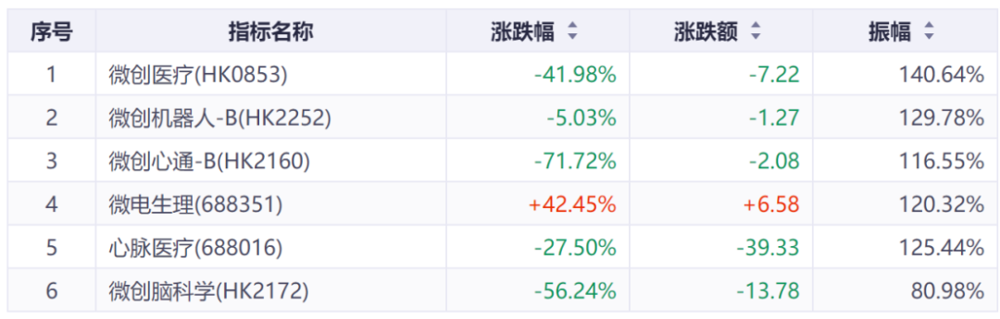
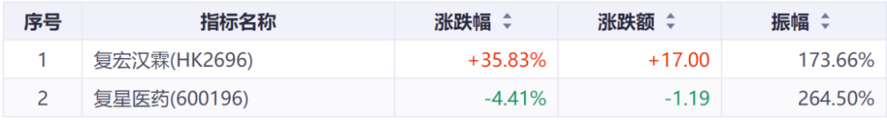
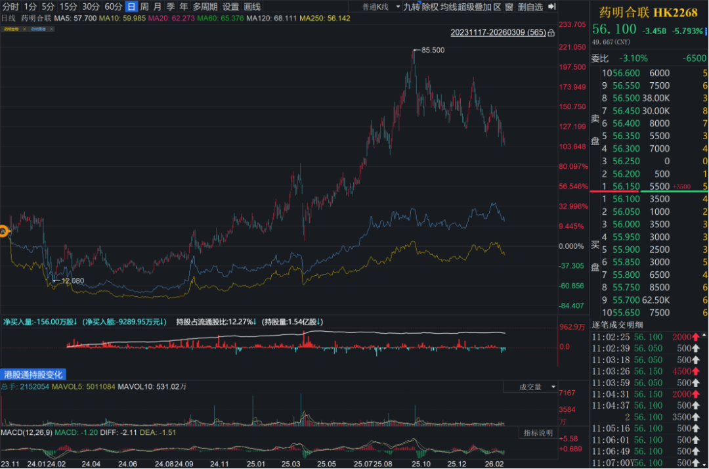
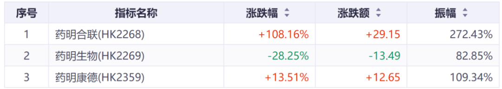
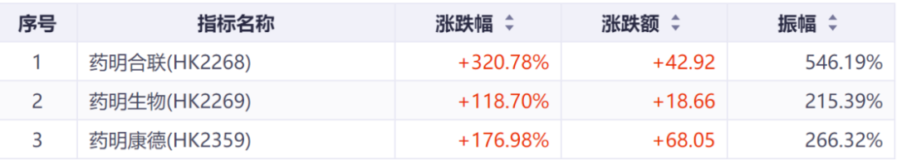
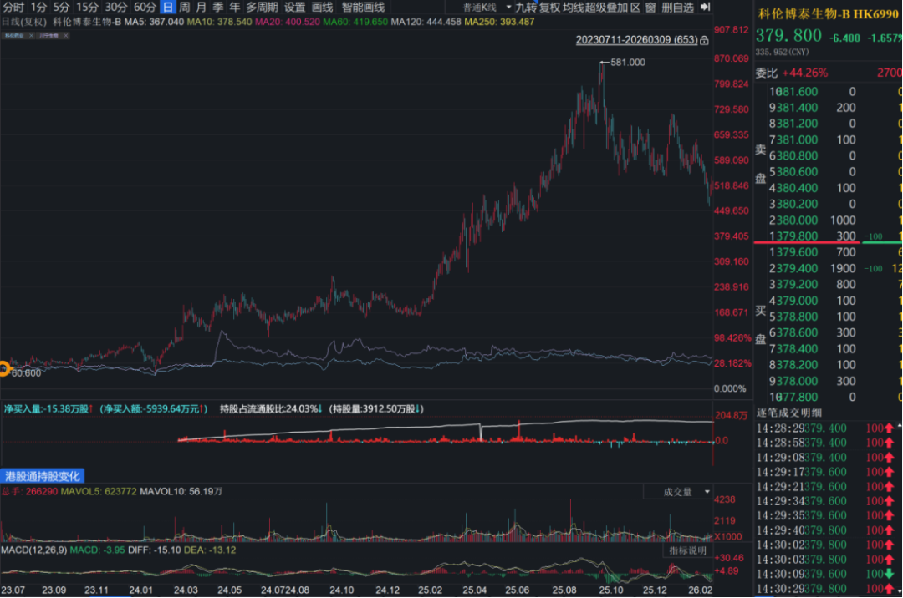
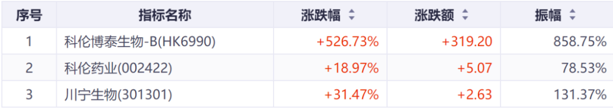
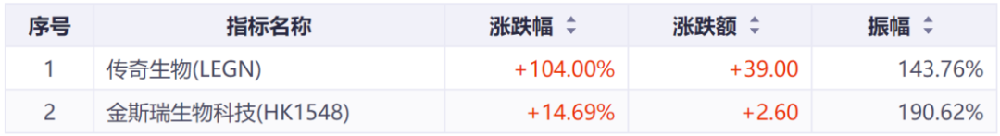

# 那些“严重低估”的公司，后来怎么样了？

大家好，我是龙哥。

我们之前的文章中曾经多次提到一个观点，就是如果一个公司分拆其优秀子公司，那么一定要去买公司分拆出来的最优秀的资产而不是买母公司/集团控股公司，这个基本逻辑在于，在复利效应下子公司的潜在回报率本身会显著高于母公司，而分拆上市对母公司原有股东来说相当于“投资标的中被动降低了对高成长资产的持股比例、提高了对低增长甚至夕阳业务的持股比例”。

但由于集团控股公司往往呈现比较低的表观估值水平，也有不少投资人通过分部估值的方式、每个独立上市子公司权益市值加总的方式来计算集团控股公司的估值，发现集团控股公司“特别低估”，于是便愿意买这些所谓的“低估值平台公司”，结果往往是陷入低估值陷阱，长期回报率较为一般。

这里我们以医药行业比较典型的一系列分拆上市的公司为例给大家展示分拆上市后母公司和独立上市子公司的表现差异，帮助大家理解低估值陷阱在过去几年分拆上市的公司中有多么显著，包括微创系、复星系、药明系、金斯瑞、科伦，后续继续分拆的还有先声、三生、康哲等。以此来告诉大家在面对这类分拆上市时应该如何选择。

1、微创系

微创系合计分拆了5家重点子公司独立上市，分别是心脉医疗（2019.07）、微创心通（2021.02，吸收合并微创心率）、微创机器人（2021.11）、微创脑科学（2022.07）、微电生理（2022.08），以最后一家独立上市的公司微电生理上市时间至今计算6家公司股价累计涨幅：

合计863个交易日，微创系6家公司中有5家都是下跌，这个和2022年8月以来的器械行业β有较大关系，即便如此微创系的表现也算是行业里比较差的。

由图5家子公司的平均跌幅为-23.61%，相较母公司-41.98%的跌幅有18.37%的超额收益，这个前提还是母公司对于子公司的经营有一定干预，否则这个股价表现差异可能更大。

2、复星系

复星医药于2019年9月分拆了创新药核心子公司复宏汉霖独立上市，以复宏汉霖独立上市时间作为起点复星医药A股和复宏汉霖的股价表现如下：

复宏汉霖上市至今已经合计1561个交易日，其中复宏汉霖的累计涨幅是35.83%，复星医药累计则是下跌4.41%，复宏汉霖呈现40.24%的超额收益。

3、药明系

药明系目前是有3家独立上市的公司，分别是药明康德、药明生物、药明合联，其中药明康德、药明生物都是药明系在美股私有化回来后分拆出来独立上市的两家公司，药明合联是从药明生物分拆出来的子公司，我们以药明生物和药明合联为对比：

药明系3家的对比，比微创系、复星系要显著的多，药明合联分拆上市以来累计涨幅是108%，累计跑赢其母公司药明生物136.4%。

如果我们以2024年2月药明系股价见底的位置至今涨幅来算，则药明合联累计涨幅为320.78%，跑赢药明生物超过200%。

4、科伦系

科伦药业是我们在2022年时比较看好的标的，主要看好其创新药业务，从科伦药业分拆科伦博泰上市后我们就没再考虑过科伦药业，实际股价表现来看科伦药业与科伦博泰也是天差地别：

从科伦博泰生物分拆上市至今653个交易日，科伦博泰生物累计涨幅是526.73%，年化复合收益率102%，而科伦药业的累计涨幅是19%，年化复合收益率7%，两年半的时间二者的收益率相差500%。科伦药业的股价也没跑赢其分拆的另一家子公司——做抗生素原料药中间体的川宁生物。

5、金斯瑞

传奇生物自上市以来的股价表现并未跑赢金斯瑞生物科技，但在传奇生物股价上涨的2020.06-2023.07还是显著跑赢金斯瑞生物科技：

3年时间传奇生物累计涨幅是104%VS金斯瑞的累计涨幅是14.7%，接近90%的超额涨幅。传奇生物原本有机会以超百亿美元的价格卖给MNC，但其大股东的原因导致没能卖身，谁能想到2026年收入可能达到14-15亿美元且仍在高速增长的传奇生物，市值跌到如今只有35亿美元。

......

总体来看：

- 微创系分拆上市的5家子公司在3年半的时间里平均实现相较母公司18%的超额收益；
- 复星系分拆上市的复宏汉霖在6年多的时间里实现相较母公司40%的超额收益；
- 药明系分拆上市的药明合联在2年多的时间里实现相较母公司136%的超额收益；
- 科伦系分拆上市的科伦博泰生物在2年半的时间里实现相较母公司500%的超额收益；
- 金斯瑞分拆上市的传奇生物在上市前3年的时间里实现相较母公司90%的超额收益。

结论已经无需多言。

这里值得反思的是，我们研究海外的行业龙头时，经常看到的资本运作方式，是剥离非核心业务或者未来成长潜力不佳的业务，聚焦核心成长业务、或通过外部并购高成长的未来新兴业务实现公司总体的持续成长。

而国内有些医药公司采取的操作恰恰相反，不断地分拆最优秀的子公司独立上市，不断摊薄老股东在新兴高成长业务的权益比例，老股东不能享受新业务的成长红利，反而要被动提高对传统夕阳业务的持股比例。这种反向资本运作方式，如何培育世界级的顶级企业？

......

另外这里想发起一个投票，看看大家在今年比较感兴趣的内容有哪些，龙哥后续也会尽量有一些倾向性。另外也想问问大家能不能接受龙哥有一些适当的创收方式。

风险提示：本文仅讨论行业/公司经营情况，投资需综合考虑公司经营、估值、管理层等多方面因素，建议读者审慎参考，本文不作为投资依据，不建议大家根据本文做出投资计划。

<!-- wxmp-comments-begin -->

---

## 留言（11 条，含回复共 22 条）

- **田霖** 👍7 · 2026-03-09 15:53
  一旦战争引起流动性危机，港股创新药估值再低也不会有钱买
  - ↳ **作者** · 2026-03-09 16:00
    这是短期交易上的因素，你说的风险确实客观存在，战争面前的不确定性难以预判且波动巨大。但可以确定的是，每一次这种流动性危机导致的系统性风险都是1-2年内的绝佳买点，我倒是很期待有这种情况。
- **听雨** 👍2 · 2026-03-09 15:37
  上周港股通调整的文章真是及时，看你写的值得关注的四家公司，维立志博，英矽智能，劲方医药，康臣药业，都加了自选，刚才一看都是大涨
  - ↳ **作者** · 2026-03-09 15:38
    还有diss的宝济药业上周五暴跌36%😂
- **谷人** 👍2 · 2026-03-09 15:40
  这么说传奇生物被严重低估吗？
  - ↳ **作者** · 2026-03-09 16:09
    便宜是便宜的，但也确实错过了最好的被收购的时间窗口，现在竞品和新技术平台陆续都出来了。
- **阿杰** 👍1 · 2026-03-09 15:49
  爱博医疗你怎么看？今年业绩能反转不？？？
  - ↳ **作者** · 2026-03-09 16:09
    原本是认为今年有机会反转的，但他们去收购骨科的公司，还是挺让人意外的，公司对眼科业务的扩张这么没有信心了吗。
- **追求卓越** 👍1 · 2026-03-09 15:58
  龙哥，现在的药明康德是不是可以无脑加仓了？
  - ↳ **作者** · 2026-03-09 16:12
    短线交易问我不如直接看图操作。中长期来看药明系三家都还是维持在细分领域非常强的竞争优势，对新技术方向的把握很领先。
- **刘敏** 👍1 · 2026-03-09 17:08
  龙哥 你觉得国健对于三生母公司是好资产还是负资产？
  - ↳ **作者** · 2026-03-09 17:11
    肯定是好资产啊，他只是要大幅折价，不代表是负资产啊[破涕为笑]
- **Tracy Cheung** · 2026-03-09 15:32
  三生的分拆怎么看 但是迟迟不落地  比它晚递交的H股有些都上了
  - ↳ **作者** · 2026-03-09 15:35
    我个人认为，三生分拆曼迪倒还不算多大的事，毕竟三生的现有主要产品和在研管线大部分都还是院内严肃医疗的品种，把偏消费品的曼迪分拆出去独立运营还可以理解，并且分拆对于老股东来说也是直接给曼迪的股份，倒不算吃亏。去年11月才决定分拆，也没那么快。
- **LEFT** · 2026-03-09 15:54
  龙哥有视频账号吗。龙哥应该做视频
  - ↳ **作者** · 2026-03-09 16:11
    毕竟只是业余时间发些内容，就没想着在多平台去花费很大精力的做。目前的市场，视频确实比文字有吸引力的多。
- **Zach** · 2026-03-09 16:31
  终于知道华润医药表现为什么这么差了
  - ↳ **作者** · 2026-03-09 16:40
    华润医药表现差不仅是因为集团控股公司，还有就是他主业医药流通确实就是低增长、低估值的业务。
- **嘀嗒** · 2026-03-09 17:22
  港股威高也算吗，龙哥
  - ↳ **作者** · 2026-03-09 17:23
    是的，威高也分拆了威高骨科，之前把集团那边的威高血净也独立上市了，不过现在又把威高血净合并到港股威高股份控股了
- **今日心** · 2026-03-09 18:42
  论分拆还是药明系厉害。
  - ↳ **作者** · 2026-03-09 18:45
    药明系也不过3家上市公司，谁能比得过微创系6家上市公司，总收入还不如人家药明系一家公司高

<!-- wxmp-comments-end -->
